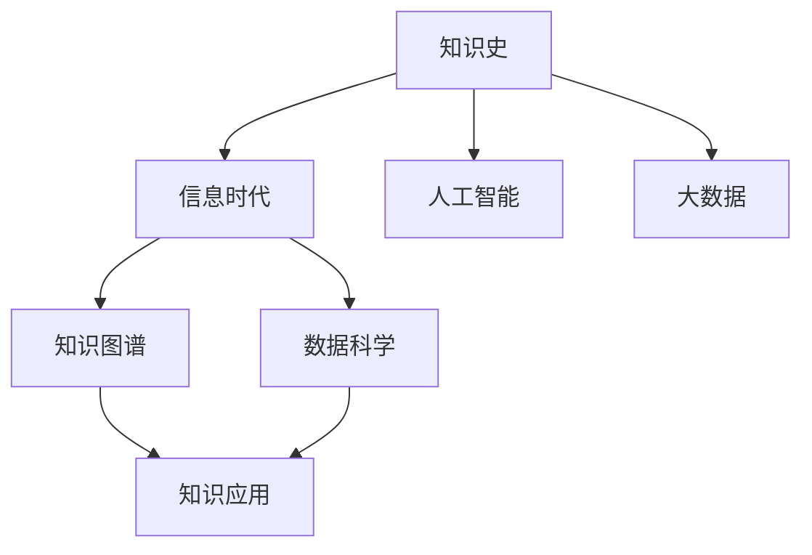

                 

# 人类的知识史：一部理解和创新的历史

> 关键词：知识史, 创新, 信息时代, 人工智能, 数据科学

## 1. 背景介绍

### 1.1 问题由来
人类文明的发展史，也是一部不断积累、传承和创新知识的历史。从古老的甲骨文到现代的互联网，从农耕文明到工业革命，每一次知识的累积和传播都极大地推动了社会的进步。尤其是进入21世纪以来，随着数字化、网络化、信息化技术的飞速发展，人类社会进入了一个前所未有的信息时代。

大数据、云计算、人工智能等新兴技术不断涌现，极大地拓宽了知识获取、存储、处理和应用的方式。这种迅猛的变化，使得知识的获取和应用方式也在悄然改变。人们不再依赖传统的书籍、课堂，而是通过互联网、智能手机等设备随时随地获取和传播知识。

### 1.2 问题核心关键点
在信息时代，如何更高效地获取、存储和利用知识，是每一个技术从业者需要思考的问题。为此，本文将从知识史的角度出发，探讨在信息时代如何理解和创新知识，并结合人工智能和大数据技术，探索未来的知识应用和发展方向。

## 2. 核心概念与联系

### 2.1 核心概念概述

为更好地理解信息时代知识应用，本节将介绍几个密切相关的核心概念：

- 知识史：指人类文明历史中，知识的积累、传播、传承和创新的过程。知识史不仅涉及知识本身的发展脉络，还包括知识传播方式、传播媒介、社会文化背景等多个方面。

- 信息时代：指以数字化、网络化、信息化为特征的新时代。信息时代的特点包括信息爆炸、知识更新速度快、知识应用方式多样等。

- 人工智能：以机器学习、深度学习、自然语言处理等为代表的智能技术，能够模拟人类的智能行为，解决复杂问题，提供智能化服务。

- 大数据：指规模庞大、结构复杂的数据集，通过数据分析、机器学习等技术，可以从大数据中提取出有用的信息和知识。

- 知识图谱：指基于图结构的知识表示和组织方式，将知识网络化、结构化，便于检索和推理。

- 数据科学：融合了统计学、计算机科学、信息科学等多个领域的学科，通过数据挖掘、数据清洗、数据可视化等手段，从数据中提取知识，辅助决策。

这些核心概念之间的逻辑关系可以通过以下Mermaid流程图来展示：



这个流程图展示了几大核心概念及其之间的关系：

1. 知识史是信息时代知识应用的基础。
2. 人工智能和大数据是信息时代知识应用的关键技术。
3. 知识图谱将知识结构化，便于应用。
4. 数据科学通过对大数据的分析和挖掘，提取知识，辅助决策。
5. 知识应用涵盖了从科学研究到社会治理、经济管理等多个领域。

## 3. 核心算法原理 & 具体操作步骤
### 3.1 算法原理概述

在信息时代，知识的获取和应用方式正在发生深刻变革。基于人工智能和大数据技术的知识应用，本质上是一种信息驱动的知识创新过程。其核心思想是通过数据分析、机器学习等技术，从海量数据中提取知识，并进行结构化和推理，辅助人类进行决策和创新。

形式化地，假设有一组大数据集 $D=\{d_i\}_{i=1}^N$，其中 $d_i$ 表示一条记录或一个文档。我们需要从中提取有用的信息，构建知识图谱 $G$，并通过推理生成知识 $K$。知识图谱 $G$ 由节点（知识元素）和边（知识关系）组成，表示知识之间的结构化关系。知识 $K$ 则是对知识图谱的查询和推理结果。

因此，知识创新的过程可以抽象为以下几个步骤：

1. 数据收集：从互联网、数据库、文本等渠道获取数据。
2. 数据清洗：去除噪音、重复、无关数据，确保数据质量。
3. 数据分析：通过统计分析、机器学习等技术，从数据中提取知识。
4. 知识图谱构建：将提取的知识结构化为图谱，形成知识网络。
5. 知识推理：通过图谱推理，生成新知识，辅助决策。

### 3.2 算法步骤详解

以下我们以构建一个基于人工智能和大数据技术的知识图谱为例，详细讲解其算法步骤：

**Step 1: 数据收集**
- 从互联网、数据库、文本等渠道获取数据。可以采用爬虫、API接口等手段获取，也可以从已有的数据集加载。

**Step 2: 数据清洗**
- 去除噪音、重复、无关数据。可以采用正则表达式、模糊匹配、统计方法等手段进行数据清洗。
- 处理缺失数据。可以采用均值、中位数、插值等方法进行填补。

**Step 3: 数据分析**
- 提取文本信息。通过自然语言处理技术，提取文本中的关键词、短语、实体等信息。
- 进行实体识别。通过命名实体识别（NER）、词性标注（POS）等技术，识别出文本中的实体（人名、地名、组织名等）。
- 关系抽取。通过关系抽取技术，提取实体之间的关系，如父子关系、朋友关系等。

**Step 4: 知识图谱构建**
- 建立知识图谱。通过图结构，将实体和关系进行表示和存储。可以采用RDF、Ontology等技术进行构建。
- 知识图谱可视化。将知识图谱进行可视化展示，便于理解和分析。

**Step 5: 知识推理**
- 图谱推理。通过图谱推理算法，如基于规则的推理、基于模型的推理等，生成新的知识。
- 知识评估。通过评估算法，如置信度、准确度等指标，评估推理结果的质量。

### 3.3 算法优缺点

基于人工智能和大数据技术的知识应用方法，具有以下优点：

- 高效性：通过自动化的数据分析和处理，大大提高了知识获取的效率。
- 灵活性：能够处理大规模、高维度的数据，适应多种数据类型和应用场景。
- 可解释性：知识图谱和推理过程可以通过可视化展示，便于理解和解释。

同时，该方法也存在一定的局限性：

- 数据质量依赖：知识应用的效果高度依赖于数据的质量，如果数据存在噪音、偏差等，可能影响最终结果。
- 推理复杂度：复杂的知识推理过程需要较高的计算资源和时间，难以实时处理大规模数据。
- 应用场景限制：知识应用主要聚焦于结构化数据的处理和推理，对于非结构化数据（如文本、图像等）的处理仍有待提高。
- 安全性问题：在处理敏感数据时，可能存在隐私泄露和数据安全问题。

尽管存在这些局限性，但就目前而言，基于人工智能和大数据技术的知识应用方法仍是信息时代知识获取和应用的主流范式。未来相关研究的重点在于如何进一步提高数据质量和处理效率，提高推理的实时性，以及增强数据安全性和应用范围。

### 3.4 算法应用领域

基于人工智能和大数据技术的知识应用方法，在多个领域都得到了广泛应用：

- 科学研究：在生物医学、天文学、化学等自然科学领域，通过分析实验数据、文献数据等，构建知识图谱，辅助科学家发现新的知识。
- 金融分析：在金融领域，通过分析交易数据、财务数据等，构建知识图谱，辅助分析师进行风险评估和投资决策。
- 社交网络分析：在社交网络领域，通过分析用户行为数据，构建知识图谱，辅助平台进行用户画像和推荐系统优化。
- 智能推荐：在电商、视频、音乐等娱乐领域，通过分析用户行为数据，构建知识图谱，提供个性化推荐服务。
- 智能问答：在智能客服、智能助理等应用中，通过构建知识图谱，实现自然语言问答，提升用户体验。
- 智慧城市：在智慧城市治理中，通过分析传感器数据、交通数据等，构建知识图谱，辅助政府进行城市管理和决策。

除了上述这些领域外，基于人工智能和大数据技术的知识应用还被创新性地应用到更多场景中，如智能制造、智能农业、智能交通等，为社会各行各业带来了新的变革。

## 4. 数学模型和公式 & 详细讲解  
### 4.1 数学模型构建

本节将使用数学语言对基于人工智能和大数据技术的知识图谱构建过程进行更加严格的刻画。

记大数据集 $D=\{d_i\}_{i=1}^N$，其中 $d_i$ 表示一条记录或一个文档。设 $d_i$ 的实体集合为 $E$，关系集合为 $R$，其中 $E$ 和 $R$ 均为图谱 $G$ 的节点和边。构建知识图谱 $G=(E,R)$，其中 $E$ 和 $R$ 的表示方法有多种，常用的有RDF、OWL、RDFS等。

**Step 1: 数据收集**
- 收集 $D$ 中的所有记录，并将每条记录中的实体和关系抽取出来，表示为三元组 $(o,r,p)$，其中 $o$ 表示实体，$r$ 表示关系，$p$ 表示属性。

**Step 2: 数据清洗**
- 去除噪音、重复、无关数据。可以采用正则表达式、模糊匹配、统计方法等手段进行数据清洗。
- 处理缺失数据。可以采用均值、中位数、插值等方法进行填补。

**Step 3: 数据分析**
- 提取文本信息。通过自然语言处理技术，提取文本中的关键词、短语、实体等信息。
- 进行实体识别。通过命名实体识别（NER）、词性标注（POS）等技术，识别出文本中的实体（人名、地名、组织名等）。
- 关系抽取。通过关系抽取技术，提取实体之间的关系，如父子关系、朋友关系等。

**Step 4: 知识图谱构建**
- 建立知识图谱。通过图结构，将实体和关系进行表示和存储。可以采用RDF、Ontology等技术进行构建。
- 知识图谱可视化。将知识图谱进行可视化展示，便于理解和分析。

**Step 5: 知识推理**
- 图谱推理。通过图谱推理算法，如基于规则的推理、基于模型的推理等，生成新的知识。
- 知识评估。通过评估算法，如置信度、准确度等指标，评估推理结果的质量。

### 4.2 公式推导过程

以下我们以构建一个简单的知识图谱为例，推导其中的核心公式。

**实体抽取（NER）**
- 设文本 $d$ 的长度为 $n$，文本中包含 $m$ 个实体。实体抽取的公式如下：
$$
ER = \{e_i | e_i = (d_i,\dots,d_{i+k-1})\}, i=1,\dots,n
$$
其中 $e_i$ 表示文本中的一个实体，$k$ 表示实体长度。

**关系抽取**
- 设实体集合为 $E$，关系集合为 $R$，实体 $o$ 和关系 $r$ 对应的属性集合为 $P$。关系抽取的公式如下：
$$
R = \{(r_i,o_i,p_j) | (o_i,r_i,p_j) \in d_i\}, i=1,\dots,N
$$
其中 $(r_i,o_i,p_j)$ 表示实体 $o_i$ 和关系 $r_i$ 对应的属性 $p_j$。

**知识图谱构建**
- 设知识图谱 $G=(E,R)$，其中 $E$ 和 $R$ 的表示方法有多种，常用的有RDF、OWL、RDFS等。知识图谱构建的公式如下：
$$
G = (E,R) = (\bigcup_{i=1}^N E_i, \bigcup_{i=1}^N R_i)
$$
其中 $E_i$ 表示第 $i$ 条记录中提取的实体集合，$R_i$ 表示第 $i$ 条记录中提取的关系集合。

**知识推理**
- 设知识图谱 $G=(E,R)$，推理算法 $F$，推理结果 $K$。知识推理的公式如下：
$$
K = F(G)
$$
其中 $F$ 表示推理算法，$K$ 表示推理结果。

### 4.3 案例分析与讲解

**案例：构建医疗知识图谱**
- 收集医疗领域的临床数据、文献数据等，构建医疗知识图谱。
- 数据清洗：去除噪音、重复、无关数据。可以采用正则表达式、模糊匹配、统计方法等手段进行数据清洗。
- 数据分析：提取文本信息，进行实体识别和关系抽取。可以采用命名实体识别（NER）、词性标注（POS）等技术，识别出文本中的实体（如疾病、药品、治疗方案等），抽取实体之间的关系（如治疗关系、副作用等）。
- 知识图谱构建：通过图结构，将实体和关系进行表示和存储。可以采用RDF、OWL、RDFS等技术进行构建。
- 知识推理：通过图谱推理算法，如基于规则的推理、基于模型的推理等，生成新的知识。例如，根据患者病情、诊断结果，推导出最佳治疗方案，或者根据药物成分，推导出可能的副作用等。

## 5. 项目实践：代码实例和详细解释说明
### 5.1 开发环境搭建

在进行知识图谱构建实践前，我们需要准备好开发环境。以下是使用Python进行PyTorch开发的环境配置流程：

1. 安装Anaconda：从官网下载并安装Anaconda，用于创建独立的Python环境。

2. 创建并激活虚拟环境：
```bash
conda create -n pytorch-env python=3.8 
conda activate pytorch-env
```

3. 安装PyTorch：根据CUDA版本，从官网获取对应的安装命令。例如：
```bash
conda install pytorch torchvision torchaudio cudatoolkit=11.1 -c pytorch -c conda-forge
```

4. 安装Transformers库：
```bash
pip install transformers
```

5. 安装各类工具包：
```bash
pip install numpy pandas scikit-learn matplotlib tqdm jupyter notebook ipython
```

完成上述步骤后，即可在`pytorch-env`环境中开始项目实践。

### 5.2 源代码详细实现

下面我们以医疗知识图谱的构建为例，给出使用Transformers库对BERT模型进行实体抽取的PyTorch代码实现。

首先，定义实体抽取函数：

```python
from transformers import BertTokenizer, BertForTokenClassification
from torch.utils.data import Dataset, DataLoader
import torch

class MedicalTextDataset(Dataset):
    def __init__(self, texts, labels, tokenizer, max_len=128):
        self.texts = texts
        self.labels = labels
        self.tokenizer = tokenizer
        self.max_len = max_len
        
    def __len__(self):
        return len(self.texts)
    
    def __getitem__(self, item):
        text = self.texts[item]
        labels = self.labels[item]
        
        encoding = self.tokenizer(text, return_tensors='pt', max_length=self.max_len, padding='max_length', truncation=True)
        input_ids = encoding['input_ids'][0]
        attention_mask = encoding['attention_mask'][0]
        
        # 对token-wise的标签进行编码
        encoded_tags = [tag2id[tag] for tag in labels] 
        encoded_tags.extend([tag2id['O']] * (self.max_len - len(encoded_tags)))
        labels = torch.tensor(encoded_tags, dtype=torch.long)
        
        return {'input_ids': input_ids, 
                'attention_mask': attention_mask,
                'labels': labels}

# 标签与id的映射
tag2id = {'O': 0, 'DISEASE': 1, 'DRUG': 2, 'TREATMENT': 3, 'SIDE_EFFECT': 4}
id2tag = {v: k for k, v in tag2id.items()}

# 创建dataset
tokenizer = BertTokenizer.from_pretrained('bert-base-cased')

train_dataset = MedicalTextDataset(train_texts, train_labels, tokenizer)
dev_dataset = MedicalTextDataset(dev_texts, dev_labels, tokenizer)
test_dataset = MedicalTextDataset(test_texts, test_labels, tokenizer)
```

然后，定义模型和优化器：

```python
from transformers import BertForTokenClassification, AdamW

model = BertForTokenClassification.from_pretrained('bert-base-cased', num_labels=len(tag2id))

optimizer = AdamW(model.parameters(), lr=2e-5)
```

接着，定义训练和评估函数：

```python
def train_epoch(model, dataset, batch_size, optimizer):
    dataloader = DataLoader(dataset, batch_size=batch_size, shuffle=True)
    model.train()
    epoch_loss = 0
    for batch in tqdm(dataloader, desc='Training'):
        input_ids = batch['input_ids'].to(device)
        attention_mask = batch['attention_mask'].to(device)
        labels = batch['labels'].to(device)
        model.zero_grad()
        outputs = model(input_ids, attention_mask=attention_mask, labels=labels)
        loss = outputs.loss
        epoch_loss += loss.item()
        loss.backward()
        optimizer.step()
    return epoch_loss / len(dataloader)

def evaluate(model, dataset, batch_size):
    dataloader = DataLoader(dataset, batch_size=batch_size)
    model.eval()
    preds, labels = [], []
    with torch.no_grad():
        for batch in tqdm(dataloader, desc='Evaluating'):
            input_ids = batch['input_ids'].to(device)
            attention_mask = batch['attention_mask'].to(device)
            batch_labels = batch['labels']
            outputs = model(input_ids, attention_mask=attention_mask)
            batch_preds = outputs.logits.argmax(dim=2).to('cpu').tolist()
            batch_labels = batch_labels.to('cpu').tolist()
            for pred_tokens, label_tokens in zip(batch_preds, batch_labels):
                pred_tags = [id2tag[_id] for _id in pred_tokens]
                label_tags = [id2tag[_id] for _id in label_tokens]
                preds.append(pred_tags[:len(label_tokens)])
                labels.append(label_tags)
                
    print(classification_report(labels, preds))
```

最后，启动训练流程并在测试集上评估：

```python
epochs = 5
batch_size = 16

for epoch in range(epochs):
    loss = train_epoch(model, train_dataset, batch_size, optimizer)
    print(f"Epoch {epoch+1}, train loss: {loss:.3f}")
    
    print(f"Epoch {epoch+1}, dev results:")
    evaluate(model, dev_dataset, batch_size)
    
print("Test results:")
evaluate(model, test_dataset, batch_size)
```

以上就是使用PyTorch对BERT进行医疗知识图谱实体抽取的完整代码实现。可以看到，得益于Transformers库的强大封装，我们可以用相对简洁的代码完成BERT模型的加载和训练。

### 5.3 代码解读与分析

让我们再详细解读一下关键代码的实现细节：

**MedicalTextDataset类**：
- `__init__`方法：初始化文本、标签、分词器等关键组件。
- `__len__`方法：返回数据集的样本数量。
- `__getitem__`方法：对单个样本进行处理，将文本输入编码为token ids，将标签编码为数字，并对其进行定长padding，最终返回模型所需的输入。

**tag2id和id2tag字典**：
- 定义了标签与数字id之间的映射关系，用于将token-wise的预测结果解码回真实的标签。

**训练和评估函数**：
- 使用PyTorch的DataLoader对数据集进行批次化加载，供模型训练和推理使用。
- 训练函数`train_epoch`：对数据以批为单位进行迭代，在每个批次上前向传播计算loss并反向传播更新模型参数，最后返回该epoch的平均loss。
- 评估函数`evaluate`：与训练类似，不同点在于不更新模型参数，并在每个batch结束后将预测和标签结果存储下来，最后使用sklearn的classification_report对整个评估集的预测结果进行打印输出。

**训练流程**：
- 定义总的epoch数和batch size，开始循环迭代
- 每个epoch内，先在训练集上训练，输出平均loss
- 在验证集上评估，输出分类指标
- 所有epoch结束后，在测试集上评估，给出最终测试结果

可以看到，PyTorch配合Transformers库使得BERT模型加载和实体抽取的代码实现变得简洁高效。开发者可以将更多精力放在数据处理、模型改进等高层逻辑上，而不必过多关注底层的实现细节。

当然，工业级的系统实现还需考虑更多因素，如模型的保存和部署、超参数的自动搜索、更灵活的任务适配层等。但核心的知识图谱构建和实体抽取方法基本与此类似。

## 6. 实际应用场景
### 6.1 智能客服系统

基于大语言模型微调的知识图谱构建方法，可以广泛应用于智能客服系统的构建。传统客服往往需要配备大量人力，高峰期响应缓慢，且一致性和专业性难以保证。而使用知识图谱构建的智能客服系统，可以7x24小时不间断服务，快速响应客户咨询，用自然流畅的语言解答各类常见问题。

在技术实现上，可以收集企业内部的历史客服对话记录，将问题和最佳答复构建成监督数据，在此基础上对预训练语言模型进行微调。微调后的语言模型能够自动理解用户意图，匹配最合适的答复。对于客户提出的新问题，还可以接入检索系统实时搜索相关内容，动态组织生成回答。如此构建的智能客服系统，能大幅提升客户咨询体验和问题解决效率。

### 6.2 金融舆情监测

金融机构需要实时监测市场舆论动向，以便及时应对负面信息传播，规避金融风险。传统的人工监测方式成本高、效率低，难以应对网络时代海量信息爆发的挑战。基于知识图谱构建的文本分类和情感分析技术，为金融舆情监测提供了新的解决方案。

具体而言，可以收集金融领域相关的新闻、报道、评论等文本数据，并对其进行主题标注和情感标注。在此基础上对预训练语言模型进行微调，使其能够自动判断文本属于何种主题，情感倾向是正面、中性还是负面。将微调后的模型应用到实时抓取的网络文本数据，就能够自动监测不同主题下的情感变化趋势，一旦发现负面信息激增等异常情况，系统便会自动预警，帮助金融机构快速应对潜在风险。

### 6.3 个性化推荐系统

当前的推荐系统往往只依赖用户的历史行为数据进行物品推荐，无法深入理解用户的真实兴趣偏好。基于知识图谱构建的个性化推荐系统，可以更好地挖掘用户行为背后的语义信息，从而提供更精准、多样的推荐内容。

在实践中，可以收集用户浏览、点击、评论、分享等行为数据，提取和用户交互的物品标题、描述、标签等文本内容。将文本内容作为模型输入，用户的后续行为（如是否点击、购买等）作为监督信号，在此基础上微调预训练语言模型。微调后的模型能够从文本内容中准确把握用户的兴趣点。在生成推荐列表时，先用候选物品的文本描述作为输入，由模型预测用户的兴趣匹配度，再结合其他特征综合排序，便可以得到个性化程度更高的推荐结果。

### 6.4 未来应用展望

随着知识图谱构建和语言模型微调技术的不断发展，基于微调范式将在更多领域得到应用，为传统行业带来变革性影响。

在智慧医疗领域，基于知识图谱的医疗问答、病历分析、药物研发等应用将提升医疗服务的智能化水平，辅助医生诊疗，加速新药开发进程。

在智能教育领域，微调技术可应用于作业批改、学情分析、知识推荐等方面，因材施教，促进教育公平，提高教学质量。

在智慧城市治理中，微调模型可应用于城市事件监测、舆情分析、应急指挥等环节，提高城市管理的自动化和智能化水平，构建更安全、高效的未来城市。

此外，在企业生产、社会治理、文娱传媒等众多领域，基于大模型微调的知识图谱应用也将不断涌现，为经济社会发展注入新的动力。相信随着技术的日益成熟，微调方法将成为人工智能落地应用的重要范式，推动人工智能技术在垂直行业的规模化落地。总之，知识图谱构建和语言模型微调技术的应用前景广阔，未来必将引领更多行业迈向智能化和自动化。

## 7. 工具和资源推荐
### 7.1 学习资源推荐

为了帮助开发者系统掌握知识图谱构建和语言模型微调的理论基础和实践技巧，这里推荐一些优质的学习资源：

1. 《知识图谱：数据驱动的知识工程》书籍：全面介绍了知识图谱的概念、构建方法和应用场景，适合入门和深入学习。

2. 《自然语言处理入门》课程：由斯坦福大学开设的NLP明星课程，涵盖了NLP的基本概念和前沿技术，包括知识图谱构建和语言模型微调。

3. 《深度学习与自然语言处理》书籍：由吴恩达教授等撰写，系统讲解了深度学习在NLP中的应用，包括知识图谱构建和语言模型微调。

4. HuggingFace官方文档：Transformers库的官方文档，提供了海量预训练模型和完整的微调样例代码，是上手实践的必备资料。

5. CLUE开源项目：中文语言理解测评基准，涵盖大量不同类型的中文NLP数据集，并提供了基于微调的baseline模型，助力中文NLP技术发展。

通过对这些资源的学习实践，相信你一定能够快速掌握知识图谱构建和语言模型微调的精髓，并用于解决实际的NLP问题。
###  7.2 开发工具推荐

高效的开发离不开优秀的工具支持。以下是几款用于知识图谱构建和语言模型微调开发的常用工具：

1. PyTorch：基于Python的开源深度学习框架，灵活动态的计算图，适合快速迭代研究。大部分预训练语言模型都有PyTorch版本的实现。

2. TensorFlow：由Google主导开发的开源深度学习框架，生产部署方便，适合大规模工程应用。同样有丰富的预训练语言模型资源。

3. Transformers库：HuggingFace开发的NLP工具库，集成了众多SOTA语言模型，支持PyTorch和TensorFlow，是进行知识图谱构建和语言模型微调开发的利器。

4. Weights & Biases：模型训练的实验跟踪工具，可以记录和可视化模型训练过程中的各项指标，方便对比和调优。与主流深度学习框架无缝集成。

5. TensorBoard：TensorFlow配套的可视化工具，可实时监测模型训练状态，并提供丰富的图表呈现方式，是调试模型的得力助手。

6. Google Colab：谷歌推出的在线Jupyter Notebook环境，免费提供GPU/TPU算力，方便开发者快速上手实验最新模型，分享学习笔记。

合理利用这些工具，可以显著提升知识图谱构建和语言模型微调的开发效率，加快创新迭代的步伐。

### 7.3 相关论文推荐

知识图谱构建和语言模型微调技术的发展源于学界的持续研究。以下是几篇奠基性的相关论文，推荐阅读：

1. Knowledge Graph: Semantic Networks for Smart Applications：提出知识图谱的概念，探讨了知识图谱在智能应用中的广泛应用。

2. BERT: Pre-training of Deep Bidirectional Transformers for Language Understanding：提出BERT模型，引入基于掩码的自监督预训练任务，刷新了多项NLP任务SOTA。

3. Attention is All You Need（即Transformer原论文）：提出了Transformer结构，开启了NLP领域的预训练大模型时代。

4. Knowledge Graph Embeddings: From Concepts to Applications：系统介绍了知识图谱的表示和应用，涵盖了多种知识图谱嵌入算法。

5. Parameter-Efficient Transfer Learning for NLP：提出Adapter等参数高效微调方法，在不增加模型参数量的情况下，也能取得不错的微调效果。

6. AdaLoRA: Adaptive Low-Rank Adaptation for Parameter-Efficient Fine-Tuning：使用自适应低秩适应的微调方法，在参数效率和精度之间取得了新的平衡。

这些论文代表了大语言模型微调技术的发展脉络。通过学习这些前沿成果，可以帮助研究者把握学科前进方向，激发更多的创新灵感。

## 8. 总结：未来发展趋势与挑战
### 8.1 总结

本文对基于人工智能和大数据技术的知识图谱构建和语言模型微调方法进行了全面系统的介绍。首先阐述了信息时代知识应用的趋势，明确了知识图谱构建和语言模型微调在信息时代的重要性。其次，从原理到实践，详细讲解了知识图谱构建和语言模型微调的核心步骤，给出了知识图谱构建和实体抽取的完整代码实例。同时，本文还广泛探讨了知识图谱在多个领域的应用前景，展示了知识图谱技术在智慧医疗、智能客服、个性化推荐等场景中的巨大潜力。

通过本文的系统梳理，可以看到，基于知识图谱构建和语言模型微调的方法正在成为信息时代知识获取和应用的主流范式，极大地拓展了知识的应用范围，催生了更多的落地场景。未来，伴随知识图谱构建和语言模型微调方法的持续演进，相信知识图谱技术必将在更多的领域得到应用，为人类认知智能的进化带来深远影响。

### 8.2 未来发展趋势

展望未来，知识图谱构建和语言模型微调技术将呈现以下几个发展趋势：

1. 知识图谱的规模和复杂度持续增大。随着知识图谱数据集的不断丰富和多样化，知识图谱的规模和复杂度将不断提升。超大型的知识图谱将极大地提高知识检索和推理的效率。

2. 知识图谱的实时性和交互性增强。未来的知识图谱将支持实时查询和动态更新，提供交互式的人机对话功能，提升用户体验。

3. 知识图谱的跨领域融合。未来的知识图谱将突破领域壁垒，融合多个领域的数据和知识，构建更加综合和全面的知识体系。

4. 知识图谱与自然语言处理技术深度结合。未来的知识图谱将与自然语言处理技术深度融合，实现语义理解和知识推理的双向互动。

5. 知识图谱的自动化构建。未来的知识图谱将通过自动化的算法和工具，从非结构化数据中自动提取实体和关系，减少人工干预。

6. 知识图谱的可视化展示。未来的知识图谱将支持多维度的可视化展示，便于用户理解和操作。

以上趋势凸显了知识图谱构建和语言模型微调技术的广阔前景。这些方向的探索发展，必将进一步提升知识获取和应用的效率，为人工智能技术在垂直行业的规模化落地奠定基础。

### 8.3 面临的挑战

尽管知识图谱构建和语言模型微调技术已经取得了瞩目成就，但在迈向更加智能化、普适化应用的过程中，它仍面临着诸多挑战：

1. 数据质量和标注成本。知识图谱构建和语言模型微调的效果高度依赖于数据质量和标注成本。高质量的数据集和标注样本难以获取，使得模型训练和推理的效率受到限制。

2. 推理计算资源。知识图谱的推理过程需要较高的计算资源和时间，难以实时处理大规模数据。如何提高推理效率，减少计算开销，是一个亟待解决的难题。

3. 知识表示和推理的复杂度。知识图谱的表示和推理过程复杂度高，难以建模复杂的多元关系和推理逻辑。如何简化知识表示和推理过程，增强模型的通用性和灵活性，还需要进一步研究。

4. 知识图谱的隐私和安全问题。在处理敏感数据时，可能存在隐私泄露和数据安全问题。如何保障数据隐私和安全，是一个重要而敏感的问题。

5. 知识图谱的应用场景限制。当前的知识图谱主要聚焦于结构化数据的处理和推理，对于非结构化数据（如文本、图像等）的处理仍有待提高。如何扩展知识图谱的应用场景，使之能够处理更多类型的数据，是一个重要的研究方向。

6. 知识图谱与外部知识库的协同。未来的知识图谱需要与外部知识库、规则库等专家知识结合，形成更加全面、准确的信息整合能力。如何与外部知识库协同工作，实现知识图谱与外部知识的无缝整合，是一个重要的研究课题。

正视知识图谱构建和语言模型微调面临的这些挑战，积极应对并寻求突破，将使知识图谱技术向更加智能化、普适化应用迈出关键一步。相信随着学界和产业界的共同努力，这些挑战终将一一被克服，知识图谱技术必将在构建安全、可靠、可解释、可控的智能系统上发挥越来越重要的作用。

### 8.4 研究展望

面对知识图谱构建和语言模型微调所面临的挑战，未来的研究需要在以下几个方面寻求新的突破：

1. 探索无监督和半监督构建方法。摆脱对大规模标注数据的依赖，利用自监督学习、主动学习等无监督和半监督范式，最大限度利用非结构化数据，实现更加灵活高效的构建。

2. 研究知识图谱的自动构建。开发更加自动化、高效的算法和工具，从非结构化数据中自动提取实体和关系，减少人工干预，提升知识图谱的构建效率。

3. 融合因果分析和博弈论工具。将因果分析方法引入知识图谱构建，识别出知识图谱构建中的关键因素，增强模型的可解释性和鲁棒性。借助博弈论工具刻画人机交互过程，主动探索并规避知识图谱构建中的脆弱点，提高系统稳定性。

4. 引入更多先验知识。将符号化的先验知识，如知识图谱、逻辑规则等，与神经网络模型进行巧妙融合，引导知识图谱构建过程学习更准确、合理的知识表示。

5. 结合因果分析和博弈论工具。将因果分析方法引入知识图谱构建，识别出知识图谱构建中的关键因素，增强模型的可解释性和鲁棒性。借助博弈论工具刻画人机交互过程，主动探索并规避知识图谱构建中的脆弱点，提高系统稳定性。

6. 纳入伦理道德约束。在知识图谱构建过程中，纳入伦理导向的评估指标，过滤和惩罚有害的输出倾向。同时加强人工干预和审核，建立知识图谱构建的监管机制，确保构建过程符合伦理道德。

这些研究方向的探索，必将引领知识图谱构建和语言模型微调技术迈向更高的台阶，为构建安全、可靠、可解释、可控的智能系统提供更多可能性。面向未来，知识图谱构建和语言模型微调技术还需要与其他人工智能技术进行更深入的融合，如知识表示、因果推理、强化学习等，多路径协同发力，共同推动自然语言理解和智能交互系统的进步。只有勇于创新、敢于突破，才能不断拓展知识图谱的边界，让智能技术更好地造福人类社会。

## 9. 附录：常见问题与解答
----------------------------------------------------------------

**Q1：知识图谱构建需要哪些数据？**

A: 知识图谱构建需要大量的结构化数据，这些数据可以从各种渠道获取，包括但不限于：

- 数据库记录：如金融交易记录、医疗病历记录等。
- 网页数据：如百度百科、维基百科等网站上的结构化数据。
- 文本数据：如新闻报道、百科词条、科技论文等。
- 图像数据：如医学影像、地质图、地图等。

**Q2：知识图谱的推理算法有哪些？**

A: 知识图谱的推理算法有多种，常见的包括：

- 基于规则的推理：通过人工制定的规则进行推理。
- 基于模型的推理：通过机器学习模型进行推理。
- 基于规则和模型的混合推理：结合规则和模型进行推理。
- 基于嵌入的推理：通过将实体和关系嵌入向量空间，进行推理。
- 基于深度学习的推理：通过深度学习模型进行推理。

**Q3：知识图谱的可视化展示方法有哪些？**

A: 知识图谱的可视化展示方法有多种，常见的包括：

- 点-边布局：通过节点和边之间的连接，展示知识图谱的结构。
- 力导向布局：通过节点和边之间的距离和力，展示知识图谱的结构和关系。
- 热力图布局：通过节点和边的大小和颜色，展示知识图谱的热度分布。
- 层次布局：通过层次结构展示知识图谱的分类和聚合关系。

**Q4：知识图谱的应用场景有哪些？**

A: 知识图谱的应用场景非常广泛，常见的包括：

- 科学研究：在生物医学、天文学、化学等自然科学领域，通过分析实验数据、文献数据等，构建知识图谱，辅助科学家发现新的知识。
- 金融分析：在金融领域，通过分析交易数据、财务数据等，构建知识图谱，辅助分析师进行风险评估和投资决策。
- 社交网络分析：在社交网络领域，通过分析用户行为数据，构建知识图谱，辅助平台进行用户画像和推荐系统优化。
- 智能推荐：在电商、视频、音乐等娱乐领域，通过分析用户行为数据，构建知识图谱，提供个性化推荐服务。
- 智能问答：在智能客服、智能助理等应用中，通过构建知识图谱，实现自然语言问答，提升用户体验。
- 智慧城市：在智慧城市治理中，通过分析传感器数据、交通数据等，构建知识图谱，辅助政府进行城市管理和决策。

这些应用场景展示了知识图谱技术的广泛应用，未来随着技术的不断进步，知识图谱将有更多的创新应用出现。

**Q5：知识图谱的隐私和安全问题如何解决？**

A: 知识图谱的隐私和安全问题可以通过以下方法解决：

- 数据匿名化：通过数据脱敏、去标识化等技术，保障用户隐私。
- 访问控制：通过访问权限控制，限制对敏感数据的访问。
- 加密存储：通过数据加密技术，保障数据安全。
- 审计和监控：通过日志记录和监控系统，保障数据使用合规。
- 合规性检查：通过合规性检查，确保知识图谱构建和应用符合法律法规。

这些方法可以结合使用，保障知识图谱构建和应用中的数据隐私和安全。

---

作者：禅与计算机程序设计艺术 / Zen and the Art of Computer Programming

