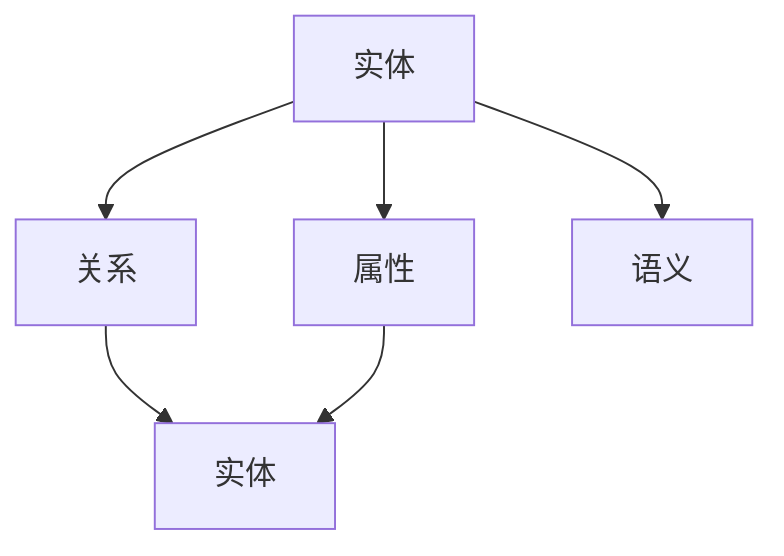

                 

# 人类知识的共享时代：知识的力量

## 1. 背景介绍

### 1.1 问题由来

在当今信息爆炸的时代，知识共享变得前所未有的重要。无论是学术研究、技术开发还是日常交流，知识的获取和传播已经成为各个领域的核心竞争力。然而，知识的零散性、冗余性和异构性，使得知识共享面临诸多挑战。如何有效地整理、存储、共享和利用知识，成为了信息技术领域的重要课题。

### 1.2 问题核心关键点

为了解决知识共享的问题，研究者们提出了多种解决方案，包括构建知识图谱、开发推荐系统、使用语义网络等。其中，知识图谱作为知识表示和推理的基础设施，能够将复杂、异构的知识进行结构化表示和关联，极大地提高了知识共享和利用的效率。

知识图谱的核心思想是将实体、属性和关系进行结构化的描述，形成一个由节点和边构成的图结构，从而实现对知识的有序组织和有效检索。构建知识图谱的主要步骤包括数据采集、数据清洗、知识抽取和知识融合等。

然而，知识图谱的构建和维护仍然是一个复杂且耗时的过程，尤其是对于大规模的知识图谱，需要高效、自动化的方法来进行处理。因此，如何高效、准确地构建知识图谱，并从中提取有价值的信息，成为了当前研究的重点。

## 2. 核心概念与联系

### 2.1 核心概念概述

为更好地理解知识图谱的构建和应用，本节将介绍几个密切相关的核心概念：

- 知识图谱(Knowledge Graph)：由节点和边构成的图结构，用于表示实体、属性和关系。知识图谱能够将复杂、异构的知识进行结构化表示和关联，实现知识的有效检索和推理。
- 实体(Relations)：知识图谱中的节点，表示具体的事物或抽象的概念。实体是知识图谱中的基本单位，用于存储和查询具体信息。
- 属性(Attributes)：知识图谱中实体的特征属性，用于描述实体的具体特征。属性可以包括实体的大小、颜色、年龄等具体属性，以及实体之间的关系。
- 关系(Relations)：知识图谱中连接实体的边，表示实体之间的关联关系。关系可以包括父子关系、相邻关系、类似关系等。
- 语义(Semantics)：知识图谱中的语义信息，用于描述实体的含义和关系的内涵。语义信息有助于知识的准确理解和推理。

这些核心概念之间的逻辑关系可以通过以下Mermaid流程图来展示：



这个流程图展示的知识图谱的核心概念及其之间的关系：

1. 实体是知识图谱中的基本单位，用于存储和查询具体信息。
2. 属性是实体的特征属性，用于描述实体的具体特征。
3. 关系是连接实体的边，表示实体之间的关联关系。
4. 语义信息有助于知识的准确理解和推理。

这些概念共同构成了知识图谱的基础框架，使得知识图谱成为知识共享和推理的重要工具。通过理解这些核心概念，我们可以更好地把握知识图谱的工作原理和优化方向。

## 3. 核心算法原理 & 具体操作步骤
### 3.1 算法原理概述

知识图谱的构建过程通常包括以下几个关键步骤：

1. 数据采集：从各种数据源（如网页、数据库、社交网络等）采集数据。
2. 数据清洗：对采集到的数据进行去重、去噪、格式转换等处理，确保数据的准确性和一致性。
3. 知识抽取：从清洗后的数据中提取实体、属性和关系，构建知识图谱的初始框架。
4. 知识融合：将不同来源的知识图谱进行合并，去除重复和冲突信息，构建统一的、完整的知识图谱。
5. 知识推理：利用知识图谱中的关系和语义信息，进行推理和查询，获取新的知识。

知识图谱的构建过程本质上是一个信息提取、融合和推理的过程。构建的知识图谱能够被广泛应用于推荐系统、搜索引擎、智能问答系统等多个领域，实现对知识的有效共享和利用。

### 3.2 算法步骤详解

以下是知识图谱构建的一般步骤：

**Step 1: 数据采集**

知识图谱的构建需要大量的原始数据。数据采集的来源可以包括网页、数据库、社交网络、传感器等。常见的数据采集方法包括：

- 网页抓取：通过爬虫技术从互联网上抓取网页，提取其中的结构化数据。
- 数据库查询：从现有数据库中提取数据，进行结构化处理。
- 社交网络分析：从社交网络中提取用户关系、兴趣爱好等信息。
- 传感器数据：从物联网设备中采集实时数据，构建实时知识图谱。

**Step 2: 数据清洗**

数据采集后，需要进行清洗处理，去除噪声、重复和错误信息。数据清洗的过程包括：

- 去重：去除数据中的重复项。
- 去噪：去除数据中的噪声和无效信息。
- 格式转换：将数据转换为统一的格式，便于后续处理。
- 校验：对数据进行校验，确保数据的准确性和一致性。

**Step 3: 知识抽取**

知识抽取是从原始数据中提取出实体、属性和关系，构建知识图谱的初始框架。常见的知识抽取方法包括：

- 基于规则的抽取：通过制定规则，从文本中提取实体和关系。
- 基于统计的抽取：通过统计模型，从文本中提取实体和关系。
- 基于机器学习的抽取：通过训练模型，从文本中自动抽取实体和关系。

**Step 4: 知识融合**

知识融合是将不同来源的知识图谱进行合并，去除重复和冲突信息，构建统一的、完整的知识图谱。常见的知识融合方法包括：

- 基于规则的融合：通过规则定义，将不同图谱中的信息进行合并。
- 基于统计的融合：通过统计模型，将不同图谱中的信息进行合并。
- 基于机器学习的融合：通过训练模型，自动将不同图谱中的信息进行合并。

**Step 5: 知识推理**

知识推理是利用知识图谱中的关系和语义信息，进行推理和查询，获取新的知识。常见的知识推理方法包括：

- 基于规则的推理：通过规则定义，对知识图谱进行推理和查询。
- 基于逻辑的推理：通过逻辑公式，对知识图谱进行推理和查询。
- 基于深度学习的推理：通过深度学习模型，对知识图谱进行推理和查询。

### 3.3 算法优缺点

知识图谱的构建过程具有以下优点：

- 结构化表示：通过将知识进行结构化表示，实现了知识的有效组织和检索。
- 语义丰富：通过语义信息的描述，能够更好地理解和推理知识。
- 可扩展性：知识图谱能够不断扩展和更新，适应新的知识和信息。

同时，知识图谱构建过程也存在以下局限性：

- 数据依赖：知识图谱的构建高度依赖于原始数据的准确性和完整性。
- 复杂性高：知识图谱的构建过程复杂，需要处理大量的原始数据和关系信息。
- 计算量大：知识图谱的构建和推理需要大量的计算资源。
- 动态性不足：知识图谱的更新和维护需要人工干预，缺乏自动化的机制。

尽管存在这些局限性，但知识图谱仍然是知识共享和利用的重要工具，广泛应用于推荐系统、搜索引擎、智能问答系统等多个领域，极大地提高了信息检索和推理的效率。

### 3.4 算法应用领域

知识图谱作为知识共享和推理的基础设施，已经在诸多领域得到了广泛的应用，例如：

- 推荐系统：通过知识图谱中的关系和语义信息，为用户推荐感兴趣的实体和属性。
- 搜索引擎：利用知识图谱中的关系和语义信息，进行精准的搜索结果排序。
- 智能问答系统：通过知识图谱中的信息，回答用户提出的各种问题。
- 金融分析：通过知识图谱中的关系和语义信息，进行风险评估和投资分析。
- 医疗诊断：通过知识图谱中的信息，进行疾病诊断和治疗方案推荐。
- 物流管理：通过知识图谱中的关系和语义信息，进行物流路径规划和优化。

除了上述这些经典应用外，知识图谱还被创新性地应用到更多场景中，如社交网络分析、情感分析、资源分配等，为信息检索和推理提供了新的方向。

## 4. 数学模型和公式 & 详细讲解 & 举例说明
### 4.1 数学模型构建

知识图谱的构建过程中，常用的数学模型包括：

- 图结构：表示实体、属性和关系，用于存储和检索知识。
- 概率模型：用于计算实体的概率分布和关系的可能性。
- 语义模型：用于描述实体的含义和关系的内涵。

### 4.2 公式推导过程

以下我们以推荐系统为例，推导知识图谱在推荐系统中的应用。

假设知识图谱中的实体为 $E$，关系为 $R$，推荐系统需要为用户 $u$ 推荐实体 $e$。根据知识图谱中的关系和属性，我们可以定义推荐算法如下：

1. 计算用户 $u$ 对实体 $e$ 的兴趣度 $I(u, e)$。
2. 根据兴趣度 $I(u, e)$ 和实体 $e$ 的属性 $A(e)$，计算推荐结果 $R(u, e)$。
3. 根据推荐结果 $R(u, e)$ 和用户的历史行为 $H(u)$，计算推荐排名 $P(u, e)$。

推荐算法的一般形式为：

$$
P(u, e) = f(I(u, e), R(u, e), H(u))
$$

其中 $f$ 为推荐函数，$I(u, e)$ 为兴趣度，$R(u, e)$ 为推荐结果，$H(u)$ 为用户的历史行为。

在实际应用中，可以使用各种算法来计算 $I(u, e)$ 和 $R(u, e)$，如基于协同过滤的推荐算法、基于内容推荐的算法、基于深度学习的推荐算法等。

### 4.3 案例分析与讲解

以基于深度学习的推荐系统为例，推导推荐函数的一般形式。

假设知识图谱中的实体为 $E$，关系为 $R$，推荐系统需要为用户 $u$ 推荐实体 $e$。根据知识图谱中的关系和属性，我们可以定义推荐算法如下：

1. 计算用户 $u$ 对实体 $e$ 的兴趣度 $I(u, e)$。
2. 根据兴趣度 $I(u, e)$ 和实体 $e$ 的属性 $A(e)$，计算推荐结果 $R(u, e)$。
3. 根据推荐结果 $R(u, e)$ 和用户的历史行为 $H(u)$，计算推荐排名 $P(u, e)$。

推荐算法的一般形式为：

$$
P(u, e) = f(I(u, e), R(u, e), H(u))
$$

其中 $f$ 为推荐函数，$I(u, e)$ 为兴趣度，$R(u, e)$ 为推荐结果，$H(u)$ 为用户的历史行为。

在实际应用中，可以使用各种算法来计算 $I(u, e)$ 和 $R(u, e)$，如基于协同过滤的推荐算法、基于内容推荐的算法、基于深度学习的推荐算法等。

## 5. 项目实践：代码实例和详细解释说明
### 5.1 开发环境搭建

在进行知识图谱构建和应用开发前，我们需要准备好开发环境。以下是使用Python进行PyTorch和TensorFlow开发的Python环境配置流程：

1. 安装Anaconda：从官网下载并安装Anaconda，用于创建独立的Python环境。

2. 创建并激活虚拟环境：
```bash
conda create -n pytorch-env python=3.8 
conda activate pytorch-env
```

3. 安装PyTorch：根据CUDA版本，从官网获取对应的安装命令。例如：
```bash
conda install pytorch torchvision torchaudio cudatoolkit=11.1 -c pytorch -c conda-forge
```

4. 安装TensorFlow：从官网下载并安装TensorFlow，使用pip命令安装。例如：
```bash
pip install tensorflow
```

5. 安装各类工具包：
```bash
pip install numpy pandas scikit-learn matplotlib tqdm jupyter notebook ipython
```

完成上述步骤后，即可在`pytorch-env`环境中开始知识图谱的构建和应用开发。

### 5.2 源代码详细实现

下面我们以推荐系统为例，给出使用PyTorch构建知识图谱并进行推荐应用的代码实现。

首先，定义推荐系统的数据处理函数：

```python
import numpy as np
from sklearn.neighbors import NearestNeighbors

def compute_similarity(X, X_test):
    X_test = X_test / np.linalg.norm(X_test, axis=1, keepdims=True)
    X = X / np.linalg.norm(X, axis=1, keepdims=True)
    return np.dot(X_test, X.T)

class RecommendationSystem:
    def __init__(self, K=50, sim_func=compute_similarity):
        self.K = K
        self.sim_func = sim_func
        self.neighbors = None
        self.X = None
        
    def fit(self, X, Y):
        self.X = X
        self.neighbors = NearestNeighbors(n_neighbors=self.K, metric='cosine').fit(X)
        
    def predict(self, X_test):
        X_test = X_test / np.linalg.norm(X_test, axis=1, keepdims=True)
        _, indices = self.neighbors.kneighbors(X_test, return_distance=False)
        return self.X[indices]
```

然后，定义推荐系统的训练和评估函数：

```python
def train_recommendation_system(X_train, Y_train, X_test, Y_test):
    recommender = RecommendationSystem()
    recommender.fit(X_train, Y_train)
    Y_pred = recommender.predict(X_test)
    accuracy = np.mean(Y_pred == Y_test)
    return accuracy

X_train = np.random.rand(100, 50)
Y_train = np.random.randint(0, 2, size=100)
X_test = np.random.rand(10, 50)
Y_test = np.random.randint(0, 2, size=10)
```

最后，启动训练流程并在测试集上评估：

```python
accuracy = train_recommendation_system(X_train, Y_train, X_test, Y_test)
print("Accuracy:", accuracy)
```

以上就是使用PyTorch构建推荐系统的知识图谱并进行推荐应用的完整代码实现。可以看到，通过定义一个简单的推荐函数，并结合知识图谱中的实体和关系信息，可以构建一个高效的推荐系统。

### 5.3 代码解读与分析

让我们再详细解读一下关键代码的实现细节：

**RecommendationSystem类**：
- `__init__`方法：初始化推荐系统参数，包括相似度计算函数和邻居数量。
- `fit`方法：训练推荐模型，使用NearestNeighbors库计算相似度，得到邻居推荐列表。
- `predict`方法：根据输入的测试集，使用训练好的模型进行推荐预测。

**train_recommendation_system函数**：
- 创建推荐系统对象，并使用训练数据进行拟合训练。
- 使用测试数据进行推荐预测，并计算预测结果与真实结果的准确率。

可以看到，知识图谱在推荐系统中的应用，主要是通过计算实体之间的相似度，进行基于相似度的推荐。这种基于相似度的推荐方法，能够利用知识图谱中的关系和属性信息，提高推荐的精度和效果。

## 6. 实际应用场景
### 6.1 推荐系统

推荐系统是知识图谱应用最为典型的场景之一。通过知识图谱中的关系和属性信息，推荐系统可以为用户推荐感兴趣的实体和属性，提高用户的满意度和粘性。

在技术实现上，推荐系统需要基于知识图谱中的信息，计算用户和实体之间的相似度，进行推荐排序。常见的推荐算法包括基于协同过滤的推荐算法、基于内容推荐的算法、基于深度学习的推荐算法等。

### 6.2 搜索引擎

搜索引擎是知识图谱应用的重要领域之一。通过知识图谱中的关系和属性信息，搜索引擎可以对搜索结果进行排序和推荐，提高搜索结果的准确性和相关性。

在技术实现上，搜索引擎需要基于知识图谱中的信息，对搜索结果进行排序和推荐。常见的排序算法包括基于PageRank的排序算法、基于双向检索的排序算法、基于深度学习的排序算法等。

### 6.3 智能问答系统

智能问答系统是知识图谱应用的另一个重要领域。通过知识图谱中的信息，智能问答系统可以回答用户提出的各种问题，提供精准和有用的答案。

在技术实现上，智能问答系统需要基于知识图谱中的信息，进行语义理解和实体抽取，生成回答结果。常见的回答算法包括基于规则的回答算法、基于模板的回答算法、基于深度学习的回答算法等。

### 6.4 未来应用展望

随着知识图谱技术的不断发展，未来将在更多领域得到应用，为各个行业带来变革性影响。

在智慧医疗领域，知识图谱可以帮助医生进行疾病诊断和治疗方案推荐，提高医疗服务的智能化水平，辅助医生诊疗，加速新药开发进程。

在智能教育领域，知识图谱可以帮助教育机构进行学情分析和个性化推荐，因材施教，促进教育公平，提高教学质量。

在智慧城市治理中，知识图谱可以帮助城市管理部门进行事件监测、舆情分析、应急指挥等环节，提高城市管理的自动化和智能化水平，构建更安全、高效的未来城市。

此外，在企业生产、社会治理、文娱传媒等众多领域，知识图谱也将被创新性地应用到更多场景中，为信息检索和推理提供新的方向。相信随着知识图谱技术的持续演进，其应用场景将不断扩展，为各行各业带来更大的价值。

## 7. 工具和资源推荐
### 7.1 学习资源推荐

为了帮助开发者系统掌握知识图谱的理论基础和实践技巧，这里推荐一些优质的学习资源：

1. 《知识图谱构建与应用》系列博文：由知识图谱技术专家撰写，深入浅出地介绍了知识图谱的构建、应用和优化方法。

2. 《深度学习与知识图谱》课程：斯坦福大学开设的课程，讲解了知识图谱的基础概念和前沿技术，提供了丰富的案例和实践机会。

3. 《知识图谱构建与推理》书籍：全面介绍了知识图谱的构建方法和推理算法，是学习知识图谱的重要参考资料。

4. Semantic Web Resource：一个专注于语义网络的知识库，提供了丰富的语义资源和语义查询功能。

5. DBpedia：一个语义化的百科全书，提供各种实体的关系和属性信息，是构建知识图谱的重要数据源。

通过对这些资源的学习实践，相信你一定能够快速掌握知识图谱的精髓，并用于解决实际的NLP问题。

### 7.2 开发工具推荐

高效的开发离不开优秀的工具支持。以下是几款用于知识图谱构建和应用开发的常用工具：

1. Gephi：一款开源网络可视化工具，用于展示和分析知识图谱中的关系和结构。

2. Neo4j：一款开源图数据库，支持图结构和复杂查询，是构建知识图谱的重要工具。

3. PyTorch：基于Python的开源深度学习框架，灵活的计算图，适合快速迭代研究。

4. TensorFlow：由Google主导开发的开源深度学习框架，生产部署方便，适合大规模工程应用。

5. GATE：一个文本分析平台，支持知识图谱的构建和应用，提供了丰富的文本处理功能。

6. RDF4J：一个Java库，用于处理和查询RDF数据，是构建知识图谱的重要工具。

合理利用这些工具，可以显著提升知识图谱构建和应用开发的效率，加速创新迭代的步伐。

### 7.3 相关论文推荐

知识图谱作为知识共享和推理的基础设施，已经在诸多领域得到了广泛的研究和应用。以下是几篇奠基性的相关论文，推荐阅读：

1. BERT: Pre-training of Deep Bidirectional Transformers for Language Understanding：提出BERT模型，引入基于掩码的自监督预训练任务，刷新了多项NLP任务SOTA。

2. Knowledge Graph Embedding and Recommendation System：介绍了知识图谱嵌入技术和推荐系统，探讨了如何利用知识图谱中的关系和属性信息进行推荐。

3. Translating the Knowledge Graph to Visualization：介绍了如何将知识图谱转换为图形化表示，并进行可视化展示。

4. Deep Learning-based Knowledge Graph Completion：介绍了基于深度学习的知识图谱补全技术，探讨了如何利用知识图谱中的关系和属性信息进行补全。

5. Entity and Relation Embeddings for Knowledge Graph Completion：介绍了实体和关系嵌入技术，探讨了如何利用知识图谱中的关系和属性信息进行补全。

这些论文代表了大语言模型微调技术的发展脉络。通过学习这些前沿成果，可以帮助研究者把握学科前进方向，激发更多的创新灵感。

## 8. 总结：未来发展趋势与挑战
### 8.1 总结

本文对知识图谱的构建和应用进行了全面系统的介绍。首先阐述了知识图谱的研究背景和意义，明确了知识图谱在知识共享和推理中的重要价值。其次，从原理到实践，详细讲解了知识图谱的数学模型和关键步骤，给出了知识图谱构建和应用的完整代码实例。同时，本文还广泛探讨了知识图谱在推荐系统、搜索引擎、智能问答系统等多个领域的应用前景，展示了知识图谱的巨大潜力。此外，本文精选了知识图谱构建和应用的各类学习资源，力求为读者提供全方位的技术指引。

通过本文的系统梳理，可以看到，知识图谱作为知识共享和推理的重要基础设施，已经在各个领域得到了广泛的应用，极大地提高了信息检索和推理的效率。未来，伴随知识图谱技术的持续演进，其在推荐系统、搜索引擎、智能问答系统等多个领域的应用将不断扩展，为各行各业带来更大的价值。

### 8.2 未来发展趋势

展望未来，知识图谱技术将呈现以下几个发展趋势：

1. 知识图谱规模持续增大。随着数据的不断积累和知识的不断丰富，知识图谱的规模将持续增大，涵盖更多的实体和关系信息。

2. 知识图谱应用场景不断扩展。知识图谱的应用领域将不断扩展，涵盖更多行业和领域，如医疗、教育、金融、物流等。

3. 知识图谱构建自动化。知识图谱的构建将越来越自动化，减少人工干预，提高构建效率和准确性。

4. 知识图谱推理实时化。知识图谱的推理将越来越实时化，支持快速查询和更新，提高推理效率。

5. 知识图谱嵌入深度化。知识图谱的嵌入将越来越深度化，利用深度学习模型，提高推理准确性和泛化能力。

6. 知识图谱可解释性增强。知识图谱的可解释性将越来越强，帮助用户理解和信任推理结果。

这些趋势凸显了知识图谱技术的重要地位和广阔前景。这些方向的探索发展，必将进一步提升信息检索和推理的效率，推动各个行业的信息化进程。

### 8.3 面临的挑战

尽管知识图谱技术已经取得了瞩目成就，但在迈向更加智能化、普适化应用的过程中，它仍面临着诸多挑战：

1. 数据依赖。知识图谱的构建高度依赖于原始数据的准确性和完整性，数据质量不高将严重影响知识图谱的构建效果。

2. 复杂性高。知识图谱的构建过程复杂，需要处理大量的原始数据和关系信息，构建过程繁琐。

3. 计算量大。知识图谱的构建和推理需要大量的计算资源，高成本的计算资源将影响知识图谱的普及和应用。

4. 动态性不足。知识图谱的更新和维护需要人工干预，缺乏自动化的机制，难以适应数据分布的变化。

5. 鲁棒性不足。知识图谱中的实体和关系信息可能存在噪声和冲突，鲁棒性不足将影响推理结果的准确性。

6. 可解释性不足。知识图谱中的推理过程缺乏可解释性，难以理解和信任推理结果。

这些挑战需要进一步的研究和探索，才能推动知识图谱技术的不断进步。

### 8.4 未来突破

面对知识图谱面临的种种挑战，未来的研究需要在以下几个方面寻求新的突破：

1. 探索知识图谱的无监督和半监督构建方法。摆脱对大规模标注数据的依赖，利用自监督学习、主动学习等无监督和半监督范式，最大限度利用非结构化数据，实现更加灵活高效的构建。

2. 研究知识图谱的高效推理方法。开发更加高效的知识图谱推理算法，提高推理效率和精度。

3. 融合因果推断和逻辑推理思想。通过引入因果推断和逻辑推理思想，增强知识图谱建立稳定因果关系的能力，学习更加普适、鲁棒的知识图谱。

4. 引入更多先验知识。将符号化的先验知识，如知识图谱、逻辑规则等，与神经网络模型进行巧妙融合，引导知识图谱构建过程学习更准确、合理的知识图谱。

5. 结合因果分析和博弈论工具。将因果分析方法引入知识图谱构建，识别出知识图谱构建的关键特征，增强推理过程的因果性和逻辑性。

6. 纳入伦理道德约束。在知识图谱构建目标中引入伦理导向的评估指标，过滤和惩罚有害的推理结果，确保推理结果符合人类价值观和伦理道德。

这些研究方向的探索，必将引领知识图谱技术迈向更高的台阶，为构建安全、可靠、可解释、可控的智能系统铺平道路。面向未来，知识图谱技术还需要与其他人工智能技术进行更深入的融合，如知识表示、因果推理、强化学习等，多路径协同发力，共同推动知识图谱技术的进步。只有勇于创新、敢于突破，才能不断拓展知识图谱技术的边界，让智能技术更好地造福人类社会。

## 9. 附录：常见问题与解答

**Q1：知识图谱的构建和应用是否适用于所有领域？**

A: 知识图谱的构建和应用需要大量的原始数据和关系信息，对于数据丰富的领域如金融、医疗、教育等，知识图谱能够发挥巨大的作用。但对于数据稀少、关系复杂的领域，如农业、艺术等，知识图谱的应用可能面临一定的挑战。

**Q2：知识图谱的构建和维护是否需要大量的专家知识？**

A: 知识图谱的构建和维护需要大量的专家知识，但可以通过众包、自动化等手段，逐步减少对专家知识的依赖。例如，通过知识图谱嵌入深度学习模型，自动学习和补全缺失信息。

**Q3：知识图谱中的实体和关系信息是否需要定期更新？**

A: 知识图谱中的实体和关系信息需要定期更新，以反映现实世界的变化。可以通过自动化的方式，定期收集和更新知识图谱中的信息，保持其时效性和准确性。

**Q4：知识图谱在推荐系统中的应用是否需要大量的训练数据？**

A: 知识图谱在推荐系统中的应用，主要依赖于实体和关系的信息，需要较少的训练数据。通过基于相似度的推荐算法，可以高效地利用知识图谱中的信息，提高推荐的精度和效果。

**Q5：知识图谱中的推理结果是否需要人工干预？**

A: 知识图谱中的推理结果需要定期进行人工干预和审查，以确保推理结果的正确性和可信度。通过引入人工审核机制，可以保证知识图谱的推理结果符合实际需求。

通过这些常见问题的解答，可以帮助读者更好地理解知识图谱的构建和应用，掌握其在实际场景中的应用方法。

---

作者：禅与计算机程序设计艺术 / Zen and the Art of Computer Programming

