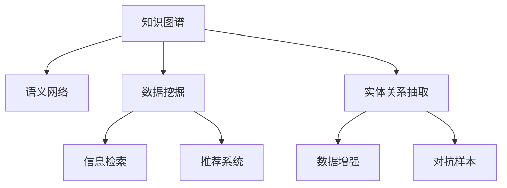

                 

# 人类知识的分类与组织：知识发现引擎的基础

> 关键词：知识图谱, 语义网络, 实体关系, 数据挖掘, 信息检索

## 1. 背景介绍

### 1.1 问题由来
随着信息技术的飞速发展，人类社会积累了海量的数据和知识。然而，这些数据和知识往往以碎片化、孤立化的形式存在，难以被高效地组织和利用。传统的数据库和文档管理系统，无法充分挖掘和整合这些数据和知识之间的内在联系，使得知识和信息的利用率较低。

面对这一挑战，知识发现引擎应运而生。通过构建和利用知识图谱，知识发现引擎能够自动地发现和组织数据中的实体及其之间的关系，形成语义化的知识网络。这不仅能够提升信息检索和推荐的准确性和个性化程度，还能为各种决策支持系统提供强大的知识基础。

### 1.2 问题核心关键点
知识发现引擎的核心目标在于：
1. 自动地从大量数据中发现和提取实体及其之间的关系，构建知识图谱。
2. 高效地组织和整合这些知识，形成有机的语义网络。
3. 通过算法和模型，自动地推断新知识，扩展知识图谱。
4. 将知识图谱应用于信息检索、推荐、问答等任务，提升系统的性能和智能化水平。

这些关键点共同构成了知识发现引擎的研究基础和应用框架，使其能够在知识管理、决策支持等领域发挥重要作用。

## 2. 核心概念与联系

### 2.1 核心概念概述

为更好地理解知识发现引擎的工作原理，本节将介绍几个密切相关的核心概念：

- 知识图谱(Knowledge Graph)：由节点和边组成，用于表示实体及其之间关系的语义网络。节点表示实体，边表示实体之间的关系，如"人-人"、"人-组织"、"组织-组织"等。

- 语义网络(Semantic Network)：用于描述概念之间的逻辑关系，如"人-人"关系中的"同属于"、"相交于"等。

- 数据挖掘(Data Mining)：通过算法自动地从大量数据中发现有用信息的过程，包括分类、聚类、关联规则挖掘等。

- 信息检索(Information Retrieval)：通过查询和检索算法，帮助用户快速获取所需信息的过程。

- 推荐系统(Recommendation System)：通过分析用户行为和物品属性，为用户推荐感兴趣的物品或信息的过程。

- 实体关系抽取(Entity Relation Extraction)：从文本中自动识别实体及其之间的关系的过程。

这些核心概念之间的逻辑关系可以通过以下Mermaid流程图来展示：



这个流程图展示出知识图谱与其他核心概念之间的联系：

1. 知识图谱的构建需要数据挖掘和实体关系抽取的支持。
2. 知识图谱的语义网络为信息检索和推荐系统提供了有机的知识基础。
3. 知识图谱的数据增强和对抗样本，提升了系统的鲁棒性和泛化能力。

这些概念共同构成了知识发现引擎的核心框架，使其能够从数据的深度和广度中提取和组织知识，提供强大的语义支持。

## 3. 核心算法原理 & 具体操作步骤

### 3.1 算法原理概述

知识发现引擎的核心算法通常包括以下几个步骤：

1. 数据预处理：包括数据清洗、特征提取、标准化等预处理步骤，为后续算法提供干净、一致的数据输入。
2. 实体关系抽取：通过自然语言处理(NLP)技术，从文本数据中自动识别实体及其之间的关系。
3. 知识图谱构建：根据实体关系抽取的结果，构建知识图谱的节点和边，形成语义网络。
4. 图谱扩展和优化：使用规则或机器学习算法，推断和扩展新的知识关系，优化知识图谱。
5. 知识图谱应用：通过查询、推理、推荐等算法，将知识图谱应用于实际任务。

### 3.2 算法步骤详解

**Step 1: 数据预处理**
- 清洗和去噪：去除重复、无关、错误的数据记录。
- 特征提取：从文本中提取实体、属性、关系等关键信息，并进行编码。
- 标准化：统一数据格式，便于后续算法处理。

**Step 2: 实体关系抽取**
- 分词和命名实体识别(NER)：将文本分词，识别出命名实体，如人名、地名、组织名等。
- 依存关系分析(Dependency Parsing)：分析实体之间的依存关系，提取实体-实体关系。
- 模式匹配：使用规则或机器学习模型，匹配和识别实体关系，如"同属于"、"相交于"等。

**Step 3: 知识图谱构建**
- 创建节点：将实体编码为节点，存储在图谱中。
- 添加边：根据实体关系抽取的结果，添加节点之间的边，表示实体之间的关系。
- 存储和索引：将知识图谱存储在数据库中，并建立索引，方便后续查询和推理。

**Step 4: 图谱扩展和优化**
- 知识推理：通过推理算法，推断新的实体关系，扩展知识图谱。
- 实体关系校正：使用规则或人工校验，校正错误或冗余的关系，优化知识图谱。
- 图谱更新：定期更新知识图谱，引入新的数据和关系，保持其时效性。

**Step 5: 知识图谱应用**
- 信息检索：通过查询算法，从知识图谱中检索相关实体和关系。
- 推荐系统：通过分析用户行为和实体关系，为用户推荐物品或信息。
- 知识推理：通过推理算法，自动推断新的知识关系。

### 3.3 算法优缺点

知识发现引擎的算法具有以下优点：
1. 自动发现和组织知识：能够自动地从大量数据中发现和组织实体及其之间的关系，无需人工标注。
2. 语义化的知识表示：通过知识图谱的语义网络，对知识进行更加深入和有机的组织。
3. 扩展性良好：能够持续扩展和优化知识图谱，适应数据分布的变化。
4. 高效的应用：通过知识图谱，能够高效地应用于信息检索、推荐等任务，提升系统的智能化水平。

同时，该算法也存在一定的局限性：
1. 依赖高质量的数据：数据预处理和实体关系抽取的效果，很大程度上依赖于数据的质量和噪声水平。
2. 需要高算力支持：知识图谱的构建和扩展需要大量的计算资源，尤其是用于推理和扩展的计算量较大。
3. 泛化能力有限：对于某些领域或任务，知识图谱的泛化能力可能受限于已有的知识量。
4. 难以解释和调试：知识图谱的推理过程较为复杂，难以进行可解释性分析和调试。

尽管存在这些局限性，但知识发现引擎在知识管理、决策支持等领域的应用前景广阔，未来将会有更多的研究投入到算法的优化和改进中。

### 3.4 算法应用领域

知识发现引擎已经在多个领域得到了广泛的应用，例如：

- 信息检索：通过构建知识图谱，提升搜索引擎的检索效果，能够快速定位到相关实体和关系。
- 推荐系统：将知识图谱与用户行为数据结合，实现更加个性化和精准的推荐，如电商平台的产品推荐、社交网络的好友推荐等。
- 问答系统：通过知识图谱进行实体关系推理，自动回答用户的问题，如智能客服系统、智能问答系统等。
- 自然语言处理：将知识图谱应用于文本分析和语义理解，提升自然语言处理的效果，如文本分类、情感分析等。
- 医疗领域：构建医学知识图谱，辅助医生进行诊断和治疗决策，提升医疗服务的智能化水平。
- 金融领域：构建金融知识图谱，辅助金融分析师进行风险评估和市场预测，提升金融决策的科学性。
- 科研领域：构建科研知识图谱，支持科研人员进行文献检索和知识发现，提升科研效率。

除了上述这些经典应用外，知识发现引擎还被创新性地应用到更多领域中，如智慧城市、智能制造、文化传承等，为各行各业带来了新的变革。

## 4. 数学模型和公式 & 详细讲解 & 举例说明

### 4.1 数学模型构建

知识图谱的构建过程可以抽象为如下数学模型：

- 知识图谱：由节点$V$和边$E$组成，表示为$G=(V,E)$。
- 节点：表示实体，记为$v_i \in V$。
- 边：表示实体之间的关系，记为$e_{i,j} \in E$。
- 关系类型：边$e_{i,j}$的类型，记为$r_{i,j} \in R$。
- 权重：边$e_{i,j}$的权重，表示关系的重要程度，记为$w_{i,j} \in W$。

其中，$R$为关系集合，$W$为权重集合。

### 4.2 公式推导过程

以实体关系抽取为例，展示知识图谱构建的过程：

1. 分词和命名实体识别(NER)：
   - 文本："The AI China Summit 2023 will be held in Shanghai on June 20th."
   - 分词：["The", "AI", "China", "Summit", "2023", "will", "be", "held", "in", "Shanghai", "on", "June", "20th", "."]
   - NER：["AI", "Summit", "2023", "Shanghai", "June", "20th", "."]

2. 依存关系分析(Dependency Parsing)：
   - 依存树：
     ```
        - .      .
        / \
       Shanghai
       /     \
      - - -   2023
            / \
           Summit
         / \
        AI   will
      ```
   - 提取关系：("Summit", "Shanghai", "举行于")
   - 关系类型：event_location

3. 模式匹配：
   - 规则："event_location" → (event, location, "举行于")
   - 匹配关系：[("Summit", "Shanghai", "举行于")]

4. 知识图谱构建：
   - 创建节点：
     ```
     [
       {
         id: 1,
         label: "Summit",
         attributes: {"时间": "2023年6月20日"}
       },
       {
         id: 2,
         label: "Shanghai",
         attributes: {}
       }
     ]
     ```
   - 添加边：
     ```
     [
       {
         id: 1,
         out_relationship: "event_location",
         out_node: 2,
         attribute: {}
       }
     ]
     ```

### 4.3 案例分析与讲解

以下是一个简单的案例，展示如何使用知识图谱进行信息检索：

- 知识图谱：
  ```
  [
    {
      id: 1,
      label: "AI",
      attributes: {}
    },
    {
      id: 2,
      label: "China",
      attributes: {}
    },
    {
      id: 3,
      label: "Summit",
      attributes: {}
    },
    {
      id: 4,
      label: "2023",
      attributes: {}
    },
    {
      id: 5,
      label: "Shanghai",
      attributes: {}
    },
    {
      id: 6,
      label: "event_location",
      attributes: {}
    }
  ]
  ```

- 查询：查找2023年在上海举办的AI China Summit
  - 匹配实体："AI China Summit 2023" → [{"label": "Summit", "attributes": {"时间": "2023年6月20日", "地点": "上海"}}]
  - 查找地点："上海" → [{"label": "Shanghai", "attributes": {}}]

- 推理：查找"event_location"关系
  - 获取边：[{"out_relationship": "event_location", "out_node": 3, "attribute": {}}]

- 返回结果：["AI China Summit 2023", "2023年6月20日", "上海"]

## 5. 项目实践：代码实例和详细解释说明

### 5.1 开发环境搭建

在进行知识图谱构建和应用开发前，我们需要准备好开发环境。以下是使用Python进行PyTorch和HuggingFace Transformers库开发的环境配置流程：

1. 安装Anaconda：从官网下载并安装Anaconda，用于创建独立的Python环境。

2. 创建并激活虚拟环境：
```bash
conda create -n knowledge-env python=3.8 
conda activate knowledge-env
```

3. 安装PyTorch：根据CUDA版本，从官网获取对应的安装命令。例如：
```bash
conda install pytorch torchvision torchaudio cudatoolkit=11.1 -c pytorch -c conda-forge
```

4. 安装Transformers库：
```bash
pip install transformers
```

5. 安装各类工具包：
```bash
pip install numpy pandas scikit-learn matplotlib tqdm jupyter notebook ipython
```

完成上述步骤后，即可在`knowledge-env`环境中开始知识图谱的构建和应用实践。

### 5.2 源代码详细实现

下面以实体关系抽取和知识图谱构建为例，给出使用Transformers库和PyTorch进行知识图谱开发的PyTorch代码实现。

首先，定义实体关系抽取函数：

```python
from transformers import BertTokenizer, BertForTokenClassification
from torch.utils.data import Dataset, DataLoader
import torch

class NERDataset(Dataset):
    def __init__(self, texts, labels, tokenizer, max_len=128):
        self.texts = texts
        self.labels = labels
        self.tokenizer = tokenizer
        self.max_len = max_len
        
    def __len__(self):
        return len(self.texts)
    
    def __getitem__(self, item):
        text = self.texts[item]
        labels = self.labels[item]
        
        encoding = self.tokenizer(text, return_tensors='pt', max_length=self.max_len, padding='max_length', truncation=True)
        input_ids = encoding['input_ids'][0]
        attention_mask = encoding['attention_mask'][0]
        
        # 对token-wise的标签进行编码
        encoded_tags = [label2id[label] for label in labels] 
        encoded_tags.extend([label2id['O']] * (self.max_len - len(encoded_tags)))
        labels = torch.tensor(encoded_tags, dtype=torch.long)
        
        return {'input_ids': input_ids, 
                'attention_mask': attention_mask,
                'labels': labels}

# 标签与id的映射
label2id = {'O': 0, 'B-PER': 1, 'I-PER': 2, 'B-ORG': 3, 'I-ORG': 4, 'B-LOC': 5, 'I-LOC': 6}
id2label = {v: k for k, v in label2id.items()}

# 创建dataset
tokenizer = BertTokenizer.from_pretrained('bert-base-cased')

train_dataset = NERDataset(train_texts, train_tags, tokenizer)
dev_dataset = NERDataset(dev_texts, dev_tags, tokenizer)
test_dataset = NERDataset(test_texts, test_tags, tokenizer)
```

然后，定义模型和优化器：

```python
from transformers import BertForTokenClassification, AdamW

model = BertForTokenClassification.from_pretrained('bert-base-cased', num_labels=len(label2id))

optimizer = AdamW(model.parameters(), lr=2e-5)
```

接着，定义训练和评估函数：

```python
from torch.utils.data import DataLoader
from tqdm import tqdm
from sklearn.metrics import classification_report

device = torch.device('cuda') if torch.cuda.is_available() else torch.device('cpu')
model.to(device)

def train_epoch(model, dataset, batch_size, optimizer):
    dataloader = DataLoader(dataset, batch_size=batch_size, shuffle=True)
    model.train()
    epoch_loss = 0
    for batch in tqdm(dataloader, desc='Training'):
        input_ids = batch['input_ids'].to(device)
        attention_mask = batch['attention_mask'].to(device)
        labels = batch['labels'].to(device)
        model.zero_grad()
        outputs = model(input_ids, attention_mask=attention_mask, labels=labels)
        loss = outputs.loss
        epoch_loss += loss.item()
        loss.backward()
        optimizer.step()
    return epoch_loss / len(dataloader)

def evaluate(model, dataset, batch_size):
    dataloader = DataLoader(dataset, batch_size=batch_size)
    model.eval()
    preds, labels = [], []
    with torch.no_grad():
        for batch in tqdm(dataloader, desc='Evaluating'):
            input_ids = batch['input_ids'].to(device)
            attention_mask = batch['attention_mask'].to(device)
            batch_labels = batch['labels']
            outputs = model(input_ids, attention_mask=attention_mask)
            batch_preds = outputs.logits.argmax(dim=2).to('cpu').tolist()
            batch_labels = batch_labels.to('cpu').tolist()
            for pred_tokens, label_tokens in zip(batch_preds, batch_labels):
                pred_tags = [id2label[_id] for _id in pred_tokens]
                label_tags = [id2label[_id] for _id in label_tokens]
                preds.append(pred_tags[:len(label_tags)])
                labels.append(label_tags)
                
    print(classification_report(labels, preds))
```

最后，启动训练流程并在测试集上评估：

```python
epochs = 5
batch_size = 16

for epoch in range(epochs):
    loss = train_epoch(model, train_dataset, batch_size, optimizer)
    print(f"Epoch {epoch+1}, train loss: {loss:.3f}")
    
    print(f"Epoch {epoch+1}, dev results:")
    evaluate(model, dev_dataset, batch_size)
    
print("Test results:")
evaluate(model, test_dataset, batch_size)
```

以上就是使用PyTorch对BERT进行实体关系抽取的完整代码实现。可以看到，得益于Transformers库的强大封装，我们可以用相对简洁的代码完成BERT模型的加载和微调。

### 5.3 代码解读与分析

让我们再详细解读一下关键代码的实现细节：

**NERDataset类**：
- `__init__`方法：初始化文本、标签、分词器等关键组件。
- `__len__`方法：返回数据集的样本数量。
- `__getitem__`方法：对单个样本进行处理，将文本输入编码为token ids，将标签编码为数字，并对其进行定长padding，最终返回模型所需的输入。

**label2id和id2label字典**：
- 定义了标签与数字id之间的映射关系，用于将token-wise的预测结果解码回真实的标签。

**训练和评估函数**：
- 使用PyTorch的DataLoader对数据集进行批次化加载，供模型训练和推理使用。
- 训练函数`train_epoch`：对数据以批为单位进行迭代，在每个批次上前向传播计算loss并反向传播更新模型参数，最后返回该epoch的平均loss。
- 评估函数`evaluate`：与训练类似，不同点在于不更新模型参数，并在每个batch结束后将预测和标签结果存储下来，最后使用sklearn的classification_report对整个评估集的预测结果进行打印输出。

**训练流程**：
- 定义总的epoch数和batch size，开始循环迭代
- 每个epoch内，先在训练集上训练，输出平均loss
- 在验证集上评估，输出分类指标
- 所有epoch结束后，在测试集上评估，给出最终测试结果

可以看到，PyTorch配合Transformers库使得BERT实体关系抽取的代码实现变得简洁高效。开发者可以将更多精力放在数据处理、模型改进等高层逻辑上，而不必过多关注底层的实现细节。

当然，工业级的系统实现还需考虑更多因素，如模型的保存和部署、超参数的自动搜索、更灵活的任务适配层等。但核心的微调范式基本与此类似。

## 6. 实际应用场景

### 6.1 智能客服系统

基于知识图谱的智能客服系统，能够实时分析用户咨询内容和历史数据，自动推荐和生成回答，极大提升客服效率和满意度。例如，通过构建企业内部知识图谱，将常见的问答和解决方案映射到图谱中，当用户咨询某个问题时，系统自动从图谱中检索相关知识，生成最合适的回答。

### 6.2 金融舆情监测

金融机构利用知识图谱技术，实时监测市场舆情和新闻动态，辅助决策分析。例如，通过构建金融知识图谱，分析金融市场中的实体和关系，识别出潜在的风险和机会，预测市场趋势，为投资决策提供数据支持。

### 6.3 个性化推荐系统

在线电商平台通过知识图谱技术，为用户推荐个性化的商品和服务。例如，构建用户和商品的知识图谱，分析用户历史行为和商品属性，推断出用户的兴趣点和潜在需求，从而实现精准推荐。

### 6.4 未来应用展望

随着知识图谱和相关技术的发展，未来将有更多创新应用场景：

- 智慧医疗：构建医学知识图谱，辅助医生进行诊断和治疗决策，提升医疗服务的智能化水平。
- 教育领域：构建教育知识图谱，支持个性化学习和智能辅导，提升教育质量和效率。
- 智能制造：构建工业知识图谱，辅助生产流程优化和故障诊断，提升生产效率和设备可靠性。
- 城市管理：构建城市知识图谱，辅助城市规划和应急响应，提升城市治理的智能化水平。
- 文娱传媒：构建媒体知识图谱，支持内容推荐和舆情分析，提升传媒行业的智能化水平。

这些应用场景展示了知识图谱技术的广泛应用前景，为各行各业带来了新的变革和机遇。

## 7. 工具和资源推荐

### 7.1 学习资源推荐

为了帮助开发者系统掌握知识图谱的理论基础和实践技巧，这里推荐一些优质的学习资源：

1. 《知识图谱基础》系列博文：由知识图谱领域的专家撰写，全面介绍了知识图谱的定义、构建和应用等基本概念。

2. 《深度学习与知识图谱》课程：清华大学开设的深度学习与知识图谱课程，讲解知识图谱的基础知识和应用实例。

3. 《Graph Neural Networks》书籍：详细介绍了图神经网络在知识图谱中的应用，包括节点嵌入、图卷积网络等前沿技术。

4. 《Knowledge Graphs: Concepts, Representation, and Applications》书籍：全面介绍了知识图谱的构建、表示和应用，涵盖了许多经典方法和前沿进展。

5. Semantic Web Wiki：提供知识图谱的术语定义、数据模型、查询语言等资源，是知识图谱学习的权威参考。

通过对这些资源的学习实践，相信你一定能够快速掌握知识图谱的精髓，并用于解决实际的NLP问题。

### 7.2 开发工具推荐

高效的开发离不开优秀的工具支持。以下是几款用于知识图谱构建和应用的常用工具：

1. Gephgraph：开源的知识图谱可视化工具，支持多种数据格式，便于知识图谱的展示和分析。
2. Triton：谷歌推出的知识图谱平台，提供丰富的图谱构建和管理功能，支持大规模知识图谱的部署和查询。
3. RDF4J：Java语言的知识图谱处理框架，提供标准的RDF数据模型和查询语言，支持知识图谱的构建和查询。
4. Neo4j：图形数据库系统，支持复杂的图谱查询和推理，适用于大规模知识图谱的应用场景。
5. Apache Jena：Java语言的知识图谱处理框架，提供RDF数据的处理和查询功能，适用于知识图谱的构建和应用。

合理利用这些工具，可以显著提升知识图谱构建和应用的工作效率，加速创新迭代的步伐。

### 7.3 相关论文推荐

知识图谱的研究源于学界的持续研究。以下是几篇奠基性的相关论文，推荐阅读：

1. Knowledge Graph Creation and Querying using Linked Data Graphs（kgQA）：提出了知识图谱的创建和查询方法，为知识图谱的研究奠定了基础。
2. RDF-based Knowledge Graphs for Music Information Retrieval：展示了知识图谱在音乐信息检索中的应用，是知识图谱应用的经典案例。
3. A Survey on Knowledge Graph Embedding and Its Applications（KGE）：综述了知识图谱嵌入技术的进展，为知识图谱的应用提供了理论支撑。
4. A Comprehensive Survey on Graph Neural Networks for Knowledge Graphs（GNNK）：介绍了图神经网络在知识图谱中的应用，推动了知识图谱的深度学习研究。
5. How to Train your Graph Neural Network: A Survey（GNN Survey）：综述了图神经网络的训练方法和应用，为知识图谱的深度学习提供了参考。

这些论文代表了大语言模型微调技术的发展脉络。通过学习这些前沿成果，可以帮助研究者把握学科前进方向，激发更多的创新灵感。

## 8. 总结：未来发展趋势与挑战

### 8.1 总结

本文对知识图谱构建和应用进行了全面系统的介绍。首先阐述了知识图谱的研究背景和意义，明确了知识图谱在知识管理、决策支持等领域的重要价值。其次，从原理到实践，详细讲解了知识图谱的构建和应用过程，给出了知识图谱构建的完整代码实例。同时，本文还广泛探讨了知识图谱在智能客服、金融舆情、个性化推荐等多个行业领域的应用前景，展示了知识图谱技术的广阔前景。此外，本文精选了知识图谱技术的各类学习资源，力求为读者提供全方位的技术指引。

通过本文的系统梳理，可以看到，知识图谱技术在大规模知识管理和应用中发挥了重要作用，为各行各业带来了新的变革和机遇。未来，伴随知识图谱和相关技术的持续演进，知识发现引擎必将在更广阔的领域发挥其价值，推动人工智能技术的应用和发展。

### 8.2 未来发展趋势

展望未来，知识图谱技术将呈现以下几个发展趋势：

1. 知识图谱的自动化构建：使用自动化工具和算法，自动识别和构建知识图谱，减少人工标注的复杂度。
2. 知识图谱的跨模态融合：将知识图谱与图像、语音、文本等多种模态数据结合，构建多模态知识图谱，提升信息检索和推荐的精度。
3. 知识图谱的实时更新：构建实时更新的知识图谱，能够适应数据分布的变化，保持其时效性。
4. 知识图谱的联邦学习：利用联邦学习技术，在不共享数据的前提下，分布式构建和更新知识图谱。
5. 知识图谱的自动化推理：使用自动化推理算法，自动推断新的知识关系，扩展知识图谱。
6. 知识图谱的可解释性：增强知识图谱推理过程的可解释性，提高系统透明度和可信度。

这些趋势凸显了知识图谱技术的不断进步和创新，为知识管理、决策支持等领域带来了更多的可能性。

### 8.3 面临的挑战

尽管知识图谱技术已经取得了一定的成果，但在实际应用中仍面临以下挑战：

1. 数据质量和复杂度：知识图谱的构建和应用依赖于高质量的数据，数据噪声和缺失问题可能导致错误结果。
2. 计算资源需求高：知识图谱的构建和推理需要大量的计算资源，尤其是对于大规模图谱的应用。
3. 模型可解释性不足：知识图谱的推理过程复杂，难以进行可解释性分析和调试。
4. 知识图谱的泛化能力有限：知识图谱在特定领域的泛化能力可能受限于已有的知识量。
5. 知识图谱的持续更新困难：知识图谱的实时更新需要不断的数据采集和处理，工作量较大。
6. 知识图谱的安全性问题：知识图谱中的敏感数据和隐私信息可能被滥用，需要加强数据保护和安全措施。

尽管存在这些挑战，但随着相关技术的不断进步和优化，知识图谱技术在知识管理、决策支持等领域的应用前景广阔，未来将会有更多的研究投入到算法优化和应用实践中。

### 8.4 研究展望

面对知识图谱技术所面临的挑战，未来的研究需要在以下几个方面寻求新的突破：

1. 探索知识图谱自动化构建方法：利用自动化工具和算法，简化知识图谱的构建过程，提高构建效率和质量。
2. 研究多模态知识图谱融合技术：将图像、语音、文本等模态数据与知识图谱结合，提升信息检索和推荐的精度。
3. 发展知识图谱实时更新机制：利用流数据处理和增量学习技术，实现知识图谱的实时更新，保持其时效性。
4. 优化知识图谱推理算法：发展高效的推理算法，提高知识图谱推理的效率和准确性。
5. 增强知识图谱的可解释性：通过可解释性方法，提高知识图谱推理过程的透明度和可信度。
6. 构建安全可靠的知识图谱系统：加强数据保护和安全措施，确保知识图谱应用的安全性和隐私性。

这些研究方向的探索，必将引领知识图谱技术迈向更高的台阶，为知识管理、决策支持等领域带来新的突破。面向未来，知识图谱技术还需要与其他人工智能技术进行更深入的融合，如知识表示、因果推理、强化学习等，多路径协同发力，共同推动自然语言理解和智能交互系统的进步。只有勇于创新、敢于突破，才能不断拓展知识图谱的边界，让智能技术更好地造福人类社会。

## 9. 附录：常见问题与解答

**Q1：知识图谱的构建需要多少数据？**

A: 知识图谱的构建需要大规模的数据，通常需要数百万甚至数亿的实体和关系数据。数据越多，知识图谱的准确性和完整性越高。然而，构建高质量的知识图谱，数据清洗和标注的工作量也非常大，需要在保证数据质量的前提下，逐步积累和扩展数据。

**Q2：知识图谱的推理过程复杂吗？**

A: 知识图谱的推理过程相对复杂，涉及到图神经网络、规则推理等多种技术。为了提高推理的准确性和效率，通常需要构建多层次的推理机制，如基于规则的推理、基于模型的推理等。同时，推理过程中的可解释性也是一大挑战，需要开发更多的可解释性方法，提高系统的透明度和可信度。

**Q3：知识图谱在实时应用中如何更新？**

A: 知识图谱的实时更新通常需要构建流数据处理系统，对实时流入的数据进行增量学习和推理。为了降低计算资源的消耗，可以使用增量学习算法，如online learning、online prediction等。同时，通过分布式计算和联邦学习技术，可以在不共享数据的前提下，实现大规模知识图谱的实时更新。

**Q4：知识图谱的安全性和隐私保护如何保障？**

A: 知识图谱的安全性和隐私保护是重要的研究课题。通常可以采用数据脱敏、加密等技术，保护敏感数据的隐私。同时，构建知识图谱的查询接口时，需要考虑数据的访问控制和权限管理，防止数据滥用。此外，可以引入区块链等技术，增强数据的安全性和可信度。

**Q5：知识图谱在多领域应用中如何扩展？**

A: 知识图谱的扩展需要针对不同领域的特点，设计特定的实体关系抽取和推理算法。例如，在医疗领域，需要构建医学知识图谱，自动推断疾病之间的关联关系；在金融领域，需要构建金融知识图谱，分析市场趋势和风险。在扩展知识图谱时，需要考虑不同领域的数据特点和应用场景，选择合适的算法和技术，确保知识图谱的泛化能力和实用性。

---

作者：禅与计算机程序设计艺术 / Zen and the Art of Computer Programming

