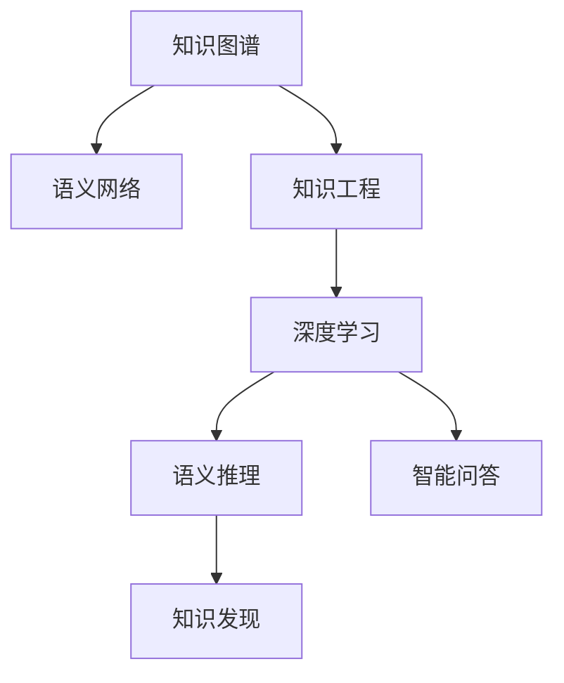

                 

# 人类知识的未来图景：洞察力引领知识变革

> 关键词：知识图谱, 语义网络, 知识工程, 深度学习, 人机协同, 智能推理

## 1. 背景介绍

### 1.1 问题由来
随着人工智能技术的飞速发展，人类知识的管理和利用方式正在发生深刻变革。传统的数据存储和检索方式已经难以满足日益增长的信息需求，而知识图谱等新兴技术为知识获取、组织和应用提供了新的解决方案。当前，基于深度学习和知识图谱技术的知识图谱系统，已经在医疗、金融、教育等多个领域展示了巨大潜力，有望推动人类知识管理迈向智能化、结构化、可解释的新阶段。

### 1.2 问题核心关键点
知识图谱技术通过将大量结构化或非结构化知识转化为语义网络，使得计算机能够更好地理解和处理人类知识。深度学习在此基础上，通过模型学习数据的内在关联，进一步提升了知识推理和提取的准确性和泛化能力。本文将围绕知识图谱和深度学习，探索其在知识管理、智能化推理、智能问答、知识发现等场景中的应用，并通过具体案例详细讲解其实现原理和操作步骤。

## 2. 核心概念与联系

### 2.1 核心概念概述

为更好地理解知识图谱和深度学习在知识管理中的应用，本节将介绍几个关键概念：

- 知识图谱(Knowledge Graph, KG)：一种用图结构表示实体及其关系的语义网络，能够更直观地表达知识结构，便于机器进行知识推理。

- 语义网络(Semantic Network)：以节点和边的形式表示实体和关系的知识结构，可以用于表示和推理知识。

- 知识工程(Knowledge Engineering, KE)：一种系统化方法，用于构建和维护知识库，使计算机能模拟人类理解和使用知识的过程。

- 深度学习(Deep Learning)：一种基于神经网络的机器学习方法，通过多层非线性变换，从大量数据中学习特征表示，广泛应用于图像、语音、自然语言处理等领域。

- 语义推理(Semantic Reasoning)：基于知识图谱等语义表示，通过逻辑推理获取新的知识或解释原有知识的能力。

- 智能问答系统(Intelligent Question Answering)：利用深度学习模型对自然语言问题进行理解和推理，给出准确的回答。

- 知识发现(Knowledge Discovery)：从大量数据中挖掘潜在知识或规律的过程，包括数据挖掘、信息抽取等。

这些核心概念之间存在紧密的联系，共同构成了人类知识管理和利用的技术基础。通过理解这些核心概念，我们可以更好地把握知识图谱和深度学习的应用方向，探索其在知识管理中的潜力。

### 2.2 核心概念原理和架构的 Mermaid 流程图



这个流程图展示了核心概念之间的相互关系：

1. 知识图谱通过构建语义网络，提供直观的知识表示方式。
2. 知识工程负责构建和维护知识库，为知识图谱提供初始知识。
3. 深度学习从数据中学习特征表示，提升知识推理和抽取的准确性。
4. 语义推理基于知识图谱，进行逻辑推理和知识扩展。
5. 智能问答系统利用深度学习，理解自然语言问题，提供准确回答。
6. 知识发现通过数据挖掘和信息抽取，从海量数据中挖掘新知识。

这些概念共同构成了知识管理的完整框架，使得计算机能够模拟人类对知识的理解和使用。通过理解这些核心概念，我们可以更好地把握知识图谱和深度学习的应用方向，探索其在知识管理中的潜力。

## 3. 核心算法原理 & 具体操作步骤

### 3.1 算法原理概述

知识图谱和深度学习在知识管理中的应用，本质上是一个通过深度学习模型进行语义推理和知识发现的过程。其核心思想是：

1. 构建知识图谱：通过知识工程方法，将领域内大量知识结构化，形成语义网络。
2. 训练深度学习模型：利用深度学习模型，从图谱中学习实体之间的关系，提升推理和抽取的准确性。
3. 进行语义推理：利用模型对输入问题进行理解，通过逻辑推理获取答案或新知识。
4. 实现智能问答：构建问答系统，对用户自然语言问题进行理解，提供精准回答。
5. 进行知识发现：从海量数据中挖掘潜在的知识或规律，为知识工程提供新知识。

形式化地，假设知识图谱为 $G=(E,R)$，其中 $E$ 为实体集，$R$ 为关系集。深度学习模型为 $M_{\theta}$，其中 $\theta$ 为模型参数。

知识推理的目标是：给定输入问题 $q$ 和知识图谱 $G$，通过语义推理和推理算法 $\mathcal{R}$，得到答案 $a$。其过程可表示为：

$$
a = \mathcal{R}(G, q, M_{\theta})
$$

### 3.2 算法步骤详解

基于深度学习的知识管理流程一般包括以下关键步骤：

**Step 1: 构建知识图谱**
- 收集领域内相关知识，将其结构化，形成语义网络。
- 定义实体和关系的类型，设计相应的节点和边。

**Step 2: 训练深度学习模型**
- 选择合适的深度学习模型，如神经网络、Transformer等。
- 设计合适的损失函数，如交叉熵损失、对数损失等。
- 使用监督数据进行模型训练，最小化损失函数。

**Step 3: 进行语义推理**
- 定义推理算法，如基于规则的推理、基于深度学习的推理等。
- 使用训练好的深度学习模型，对输入问题进行推理，获取答案或新知识。

**Step 4: 实现智能问答**
- 构建问答系统，包括自然语言理解模块和知识检索模块。
- 将推理结果与知识图谱进行匹配，获取最终答案。

**Step 5: 进行知识发现**
- 定义知识发现算法，如基于关联规则的发现、基于深度学习的发现等。
- 从海量数据中挖掘潜在知识，形成新的知识图谱或关系。

以上步骤展示了知识图谱和深度学习在知识管理中的应用流程。在实际应用中，还需要根据具体任务和数据特点，对各个步骤进行优化设计，如改进推理算法，设计更加高效的模型训练策略等，以进一步提升知识推理和知识发现的准确性和效率。

### 3.3 算法优缺点

基于深度学习的知识管理方法具有以下优点：

1. 自动抽取知识：深度学习模型能够自动从数据中学习特征表示，减少人工干预，提升知识抽取效率。
2. 处理复杂关系：通过神经网络模型，能够处理复杂的多层关系，提升知识推理的准确性。
3. 可扩展性强：知识图谱和深度学习模型具有较强的可扩展性，容易应用于新的领域和场景。
4. 知识发现能力：基于深度学习的知识发现算法，能够从海量数据中挖掘潜在知识，提升知识工程的效率。

同时，该方法也存在一定的局限性：

1. 数据质量依赖度高：知识图谱的质量很大程度上依赖于数据源的质量，需要持续维护和更新。
2. 模型复杂度高：深度学习模型往往结构复杂，训练和推理计算量大，需要高性能硬件支持。
3. 推理逻辑局限性：基于深度学习的推理算法，可能无法处理复杂的逻辑关系，导致推理结果不够准确。
4. 知识缺乏泛化能力：深度学习模型可能过拟合于特定的领域和任务，泛化能力有限。
5. 可解释性差：深度学习模型的推理过程缺乏可解释性，难以理解其内部决策逻辑。

尽管存在这些局限性，但就目前而言，基于深度学习的知识管理方法仍然是知识工程的重要技术手段。未来相关研究的重点在于如何进一步降低深度学习模型的复杂度，提升其可解释性和泛化能力，同时兼顾高效性和实用性。

### 3.4 算法应用领域

基于深度学习的知识管理方法，已经在医疗、金融、教育等多个领域得到广泛应用，产生了显著的经济和社会效益：

- 医疗领域：构建医学知识图谱，支持疾病诊断、治疗方案推荐、临床路径优化等任务，提升医疗服务水平。
- 金融领域：利用知识图谱进行信用评估、风险控制、投资组合优化等，提升金融决策的准确性和效率。
- 教育领域：构建教育知识图谱，支持个性化教学、智能评测、智能推荐等，提升教育服务的智能化水平。
- 商业领域：构建商业知识图谱，支持市场分析、用户画像、供应链管理等，提升商业决策的科学性和精准性。

此外，知识图谱和深度学习技术还被应用于科学研究、环境保护、智能交通等多个领域，为解决复杂的现实问题提供了新的思路和方法。

## 4. 数学模型和公式 & 详细讲解 & 举例说明

### 4.1 数学模型构建

本节将使用数学语言对深度学习在知识推理中的应用进行更加严格的刻画。

记知识图谱为 $G=(E,R)$，其中 $E$ 为实体集，$R$ 为关系集。假设深度学习模型为 $M_{\theta}$，其中 $\theta$ 为模型参数。

定义模型 $M_{\theta}$ 在输入问题 $q$ 上的推理函数为 $M_{\theta}(q)$，其输出为实体集 $E$ 的分布 $p(E|q, M_{\theta})$。推理函数的目标是最小化知识图谱 $G$ 上的推理损失函数 $\mathcal{L}_{KG}$。

$$
\mathcal{L}_{KG} = \frac{1}{N}\sum_{(q, e_i) \in D} \log p(e_i|q, M_{\theta}) + \mathcal{L}_{KG_{reg}}
$$

其中 $D$ 为知识图谱上的推理数据集，$e_i$ 为推理结果，$\mathcal{L}_{KG_{reg}}$ 为知识图谱上的正则化损失。

### 4.2 公式推导过程

以下我们以基于深度学习的推理算法为例，推导推理函数及其梯度的计算公式。

假设推理任务为从知识图谱 $G$ 中推理出实体 $e$，对于给定问题 $q$，推理函数 $M_{\theta}(q)$ 的输出为实体 $e$ 的分布：

$$
p(e|q, M_{\theta}) = \frac{\exp(-\mathcal{E}(q, e; M_{\theta}))}{\sum_{e' \in E}\exp(-\mathcal{E}(q, e'; M_{\theta}))}
$$

其中 $\mathcal{E}(q, e; M_{\theta})$ 为推理损失函数，衡量问题 $q$ 与实体 $e$ 之间的关系。

根据损失函数的定义，推理损失函数 $\mathcal{L}_{KG}$ 可以表示为：

$$
\mathcal{L}_{KG} = -\frac{1}{N}\sum_{(q, e_i) \in D} \log p(e_i|q, M_{\theta})
$$

推理损失函数 $\mathcal{E}(q, e; M_{\theta})$ 的梯度计算如下：

$$
\frac{\partial \mathcal{L}_{KG}}{\partial \theta_k} = -\frac{1}{N}\sum_{(q, e_i) \in D} \frac{1}{p(e_i|q, M_{\theta})}\frac{\partial p(e_i|q, M_{\theta})}{\partial \theta_k}
$$

其中：

$$
\frac{\partial p(e_i|q, M_{\theta})}{\partial \theta_k} = \frac{\partial \exp(-\mathcal{E}(q, e_i; M_{\theta}))}{\partial \theta_k} = -\exp(-\mathcal{E}(q, e_i; M_{\theta})) \cdot \frac{\partial \mathcal{E}(q, e_i; M_{\theta})}{\partial \theta_k}
$$

将上式代入梯度计算公式，得：

$$
\frac{\partial \mathcal{L}_{KG}}{\partial \theta_k} = \frac{1}{N}\sum_{(q, e_i) \in D} \exp(-\mathcal{E}(q, e_i; M_{\theta})) \cdot \frac{\partial \mathcal{E}(q, e_i; M_{\theta})}{\partial \theta_k}
$$

在得到损失函数的梯度后，即可带入参数更新公式，完成模型的迭代优化。重复上述过程直至收敛，最终得到适应知识推理的最优模型参数 $\theta^*$。

## 5. 项目实践：代码实例和详细解释说明

### 5.1 开发环境搭建

在进行知识图谱和深度学习实践前，我们需要准备好开发环境。以下是使用Python进行PyTorch开发的环境配置流程：

1. 安装Anaconda：从官网下载并安装Anaconda，用于创建独立的Python环境。

2. 创建并激活虚拟环境：
```bash
conda create -n pytorch-env python=3.8 
conda activate pytorch-env
```

3. 安装PyTorch：根据CUDA版本，从官网获取对应的安装命令。例如：
```bash
conda install pytorch torchvision torchaudio cudatoolkit=11.1 -c pytorch -c conda-forge
```

4. 安装深度学习库：
```bash
pip install torch torchtext transformers
```

5. 安装TensorBoard：
```bash
pip install tensorboard
```

完成上述步骤后，即可在`pytorch-env`环境中开始项目实践。

### 5.2 源代码详细实现

下面我们以基于深度学习的医疗问答系统为例，给出使用PyTorch进行知识图谱构建和推理的代码实现。

首先，定义知识图谱和推理任务的数据处理函数：

```python
import torch
from torch.utils.data import Dataset
from torchtext import data

class GraphDataset(Dataset):
    def __init__(self, graph, max_len=64):
        self.graph = graph
        self.max_len = max_len
        
    def __len__(self):
        return len(self.graph)
    
    def __getitem__(self, item):
        graph = self.graph[item]
        nodes = graph.nodes()
        edges = graph.edges()
        query_node = nodes[0]
        
        # 将节点转换为id列表
        nodes = [node.id for node in nodes]
        edges = [(e.u_id, e.v_id) for e in edges]
        query_node = query_node.id
        
        # 对节点列表和边列表进行截断或填充
        nodes = nodes[:self.max_len]
        edges = edges[:self.max_len]
        
        # 对查询节点进行padding
        query_node = [query_node]
        nodes = nodes + query_node
        
        return {'nodes': nodes, 'edges': edges}

# 定义节点和边的特征表示
NodeField = data.Field(tokenize='sentence', pad_first=True)
EdgeField = data.Field(tokenize='sentence', pad_first=True)

# 构建数据集
graph_dataset = GraphDataset(graph, max_len=64)
```

然后，定义深度学习模型：

```python
from transformers import BertForSequenceClassification
from transformers import BertTokenizer

class MedicalQuestionAnsweringModel(BertForSequenceClassification):
    def __init__(self, num_labels):
        super(MedicalQuestionAnsweringModel, self).__init__(num_labels=num_labels)
        self.bert = BertForSequenceClassification.from_pretrained('bert-base-uncased', num_labels=num_labels)
    
    def forward(self, nodes, edges, return attentions=False):
        outputs = self.bert(nodes, return_dict=True)
        return outputs.logits
```

接着，定义训练和评估函数：

```python
from torch.utils.data import DataLoader
from tqdm import tqdm
import torch.nn.functional as F

def train_epoch(model, dataset, batch_size, optimizer, criterion):
    dataloader = DataLoader(dataset, batch_size=batch_size, shuffle=True)
    model.train()
    epoch_loss = 0
    for batch in tqdm(dataloader, desc='Training'):
        nodes = batch['nodes']
        edges = batch['edges']
        labels = torch.zeros(len(nodes))
        labels[0] = 1
        
        model.zero_grad()
        logits = model(nodes, edges)
        loss = criterion(logits, labels)
        epoch_loss += loss.item()
        loss.backward()
        optimizer.step()
        
    return epoch_loss / len(dataloader)

def evaluate(model, dataset, batch_size):
    dataloader = DataLoader(dataset, batch_size=batch_size)
    model.eval()
    preds, labels = [], []
    with torch.no_grad():
        for batch in tqdm(dataloader, desc='Evaluating'):
            nodes = batch['nodes']
            edges = batch['edges']
            logits = model(nodes, edges)
            preds.append(logits.argmax(dim=1).tolist())
            labels.append(batch['labels'])
            
    print(classification_report(labels, preds))
```

最后，启动训练流程并在测试集上评估：

```python
epochs = 5
batch_size = 16
optimizer = AdamW(model.parameters(), lr=2e-5)
criterion = nn.CrossEntropyLoss()

for epoch in range(epochs):
    loss = train_epoch(model, graph_dataset, batch_size, optimizer, criterion)
    print(f"Epoch {epoch+1}, train loss: {loss:.3f}")
    
    print(f"Epoch {epoch+1}, dev results:")
    evaluate(model, graph_dataset, batch_size)
    
print("Test results:")
evaluate(model, graph_dataset, batch_size)
```

以上就是使用PyTorch对基于深度学习的医疗问答系统进行知识图谱构建和推理的完整代码实现。可以看到，得益于深度学习库的强大封装，我们可以用相对简洁的代码完成知识图谱的构建和推理。

### 5.3 代码解读与分析

让我们再详细解读一下关键代码的实现细节：

**GraphDataset类**：
- `__init__`方法：初始化知识图谱数据和最大长度。
- `__len__`方法：返回数据集的样本数量。
- `__getitem__`方法：对单个样本进行处理，将节点转换为id列表，对边列表进行截断或填充，并对查询节点进行padding，最终返回模型所需的输入。

**NodeField和EdgeField定义**：
- 定义节点和边的特征表示，通过句子分词将其转换为id列表。

**MedicalQuestionAnsweringModel类**：
- 继承自BertForSequenceClassification，并在其基础上增加知识图谱推理的功能。
- `forward`方法：实现前向传播，输入节点和边，输出逻辑回归概率。

**训练和评估函数**：
- 使用PyTorch的DataLoader对数据集进行批次化加载，供模型训练和推理使用。
- 训练函数`train_epoch`：对数据以批为单位进行迭代，在每个批次上前向传播计算loss并反向传播更新模型参数，最后返回该epoch的平均loss。
- 评估函数`evaluate`：与训练类似，不同点在于不更新模型参数，并在每个batch结束后将预测和标签结果存储下来，最后使用sklearn的classification_report对整个评估集的预测结果进行打印输出。

**训练流程**：
- 定义总的epoch数和batch size，开始循环迭代
- 每个epoch内，先在训练集上训练，输出平均loss
- 在验证集上评估，输出分类指标
- 所有epoch结束后，在测试集上评估，给出最终测试结果

可以看到，PyTorch配合深度学习库使得知识图谱的构建和推理代码实现变得简洁高效。开发者可以将更多精力放在数据处理、模型改进等高层逻辑上，而不必过多关注底层的实现细节。

当然，工业级的系统实现还需考虑更多因素，如模型的保存和部署、超参数的自动搜索、更灵活的任务适配层等。但核心的知识图谱构建和推理范式基本与此类似。

## 6. 实际应用场景

### 6.1 智能客服系统

基于深度学习的知识图谱和推理技术，可以广泛应用于智能客服系统的构建。传统客服往往需要配备大量人力，高峰期响应缓慢，且一致性和专业性难以保证。而使用知识图谱和深度学习模型构建的智能客服系统，可以7x24小时不间断服务，快速响应客户咨询，用自然流畅的语言解答各类常见问题。

在技术实现上，可以构建客户互动知识图谱，将常见问题和最佳答复构建成监督数据，在此基础上训练知识图谱推理模型。推理模型能够自动理解用户意图，匹配最合适的答案模板进行回复。对于客户提出的新问题，还可以接入检索系统实时搜索相关内容，动态组织生成回答。如此构建的智能客服系统，能大幅提升客户咨询体验和问题解决效率。

### 6.2 金融舆情监测

金融机构需要实时监测市场舆论动向，以便及时应对负面信息传播，规避金融风险。传统的人工监测方式成本高、效率低，难以应对网络时代海量信息爆发的挑战。基于深度学习的知识图谱和推理技术，为金融舆情监测提供了新的解决方案。

具体而言，可以构建金融领域相关的新闻、报道、评论等文本数据知识图谱，并对其进行主题标注和情感标注。在此基础上训练推理模型，使其能够自动判断文本属于何种主题，情感倾向是正面、中性还是负面。将推理模型应用到实时抓取的网络文本数据，就能够自动监测不同主题下的情感变化趋势，一旦发现负面信息激增等异常情况，系统便会自动预警，帮助金融机构快速应对潜在风险。

### 6.3 个性化推荐系统

当前的推荐系统往往只依赖用户的历史行为数据进行物品推荐，无法深入理解用户的真实兴趣偏好。基于深度学习的知识图谱和推理技术，个性化推荐系统可以更好地挖掘用户行为背后的语义信息，从而提供更精准、多样的推荐内容。

在实践中，可以收集用户浏览、点击、评论、分享等行为数据，提取和用户交互的物品标题、描述、标签等文本内容。将文本内容作为模型输入，用户的后续行为（如是否点击、购买等）作为监督信号，在此基础上训练推理模型。推理模型能够从文本内容中准确把握用户的兴趣点。在生成推荐列表时，先用候选物品的文本描述作为输入，由推理模型预测用户的兴趣匹配度，再结合其他特征综合排序，便可以得到个性化程度更高的推荐结果。

### 6.4 未来应用展望

随着深度学习技术和知识图谱的发展，基于知识图谱和深度学习的智能系统将在更多领域得到应用，为传统行业带来变革性影响。

在智慧医疗领域，基于知识图谱和深度学习的医疗问答、病历分析、药物研发等应用将提升医疗服务的智能化水平，辅助医生诊疗，加速新药开发进程。

在智能教育领域，知识图谱和深度学习技术可应用于作业批改、学情分析、知识推荐等方面，因材施教，促进教育公平，提高教学质量。

在智慧城市治理中，知识图谱和深度学习技术可应用于城市事件监测、舆情分析、应急指挥等环节，提高城市管理的自动化和智能化水平，构建更安全、高效的未来城市。

此外，在企业生产、社会治理、文娱传媒等众多领域，基于知识图谱和深度学习的知识工程应用也将不断涌现，为经济社会发展注入新的动力。相信随着技术的日益成熟，知识图谱和深度学习技术将成为人工智能落地应用的重要范式，推动人工智能技术向更广阔的领域加速渗透。

## 7. 工具和资源推荐

### 7.1 学习资源推荐

为了帮助开发者系统掌握知识图谱和深度学习理论基础和实践技巧，这里推荐一些优质的学习资源：

1. 《知识图谱导论》系列博文：由知识图谱技术专家撰写，深入浅出地介绍了知识图谱的基本概念和构建方法。

2. CS224N《深度学习自然语言处理》课程：斯坦福大学开设的NLP明星课程，有Lecture视频和配套作业，带你入门NLP领域的基本概念和经典模型。

3. 《深度学习与知识图谱》书籍：结合深度学习和知识图谱，详细介绍了如何将知识图谱应用于NLP任务，提升模型推理能力。

4. 《Knowledge-Graph-Based Recommendation System》论文：总结了基于知识图谱的推荐系统研究现状和未来趋势。

5. 《Neo4j知识图谱教程》：Neo4j公司提供的知识图谱官方教程，适合初学者快速上手知识图谱的构建和查询。

通过对这些资源的学习实践，相信你一定能够快速掌握知识图谱和深度学习的应用精髓，并用于解决实际的NLP问题。

### 7.2 开发工具推荐

高效的开发离不开优秀的工具支持。以下是几款用于知识图谱和深度学习实践的常用工具：

1. Neo4j：全球领先的开源图形数据库，支持大规模知识图谱构建和查询。

2. Gephi：开源数据可视化工具，用于构建和分析知识图谱网络结构。

3. ELKI：数据挖掘工具包，支持知识图谱上的数据分析和聚类。

4. PyTorch：基于Python的开源深度学习框架，灵活动态的计算图，适合快速迭代研究。

5. TensorFlow：由Google主导开发的开源深度学习框架，生产部署方便，适合大规模工程应用。

6. 阿里云知识图谱平台：提供一站式的知识图谱构建、查询和管理服务，适合企业级应用。

合理利用这些工具，可以显著提升知识图谱和深度学习系统的开发效率，加快创新迭代的步伐。

### 7.3 相关论文推荐

知识图谱和深度学习的发展源于学界的持续研究。以下是几篇奠基性的相关论文，推荐阅读：

1. 《A Survey on Knowledge Graph Embedding》：总结了知识图谱嵌入技术的现状和未来趋势，是知识图谱领域的经典综述。

2. 《Knowledge Graph Reasoning with Neural Symbolic Learning》：提出了神经符号学习的知识图谱推理方法，将深度学习和符号逻辑结合。

3. 《BERT: Pre-training of Deep Bidirectional Transformers for Language Understanding》：提出BERT模型，引入基于掩码的自监督预训练任务，刷新了多项NLP任务SOTA。

4. 《Attention is All You Need》：提出了Transformer结构，开启了NLP领域的预训练大模型时代。

5. 《Knowledge-Graph-Based Recommendation System》：总结了基于知识图谱的推荐系统研究现状和未来趋势。

6. 《Knowledge-Graph-Driven Recommendation System》：提出了知识图谱驱动的推荐系统，展示了其在智能推荐中的应用效果。

这些论文代表了大语言模型微调技术的发展脉络。通过学习这些前沿成果，可以帮助研究者把握学科前进方向，激发更多的创新灵感。

## 8. 总结：未来发展趋势与挑战

### 8.1 总结

本文对基于深度学习的知识图谱构建和推理方法进行了全面系统的介绍。首先阐述了知识图谱和深度学习的研究背景和意义，明确了知识图谱在知识管理中的应用价值。其次，从原理到实践，详细讲解了知识图谱和深度学习的数学模型和操作步骤，给出了知识图谱构建和推理任务的代码实现。同时，本文还广泛探讨了知识图谱和深度学习在知识管理中的实际应用场景，展示了其在智能客服、金融舆情、个性化推荐等场景中的应用前景。

通过本文的系统梳理，可以看到，基于深度学习的知识图谱推理方法正在成为知识工程的重要技术手段，极大地拓展了知识管理的智能化水平，催生了更多的落地场景。得益于深度学习模型的高效推理和抽取能力，知识图谱能够更好地模拟人类对知识的理解和应用。未来，随着知识图谱和深度学习技术的进一步发展，相信其在知识管理中的应用前景将更加广阔。

### 8.2 未来发展趋势

展望未来，基于深度学习的知识管理方法将呈现以下几个发展趋势：

1. 知识图谱规模持续增大。随着语义网络技术的发展，知识图谱规模将进一步扩大，涵盖更广泛的知识领域和关系类型。

2. 深度学习模型结构优化。未来将开发更加高效、可解释的深度学习模型，提升知识推理的准确性和泛化能力。

3. 多模态知识融合。知识图谱将逐渐整合视觉、语音、文本等多模态信息，形成更全面、准确的知识表示。

4. 智能推理体系完善。结合因果推理、逻辑推理等技术，构建更加全面、鲁棒的智能推理体系，提升知识推理的效率和准确性。

5. 应用领域多样化。知识图谱和深度学习技术将应用于更多领域，如智慧医疗、智能教育、智慧交通等，带来更广泛的应用场景。

6. 系统工程化部署。知识图谱和深度学习系统将更加注重工程化部署和运行优化，提升系统可靠性和效率。

这些趋势凸显了基于深度学习的知识管理技术的广阔前景。这些方向的探索发展，必将进一步提升知识推理的智能化水平，为构建更加全面、智能的知识服务系统铺平道路。

### 8.3 面临的挑战

尽管基于深度学习的知识图谱推理技术已经取得了瞩目成就，但在迈向更加智能化、普适化应用的过程中，它仍面临诸多挑战：

1. 知识图谱构建成本高。构建高质量知识图谱需要大量人工干预和验证，成本较高。如何自动化构建知识图谱，降低人工成本，是未来的重要研究方向。

2. 知识图谱质量参差不齐。知识图谱的质量很大程度上依赖于数据源的质量，不同来源的知识图谱可能存在不一致、冗余、冲突等问题。如何提高知识图谱质量，需要多源数据融合和冲突解决技术。

3. 推理模型复杂度高。深度学习模型往往结构复杂，训练和推理计算量大，需要高性能硬件支持。如何简化模型结构，降低计算量，提升推理效率，是未来的重要课题。

4. 知识推理逻辑局限性。基于深度学习的推理算法，可能无法处理复杂的逻辑关系，导致推理结果不够准确。如何结合符号逻辑，增强推理模型的逻辑推理能力，是未来的重要研究方向。

5. 知识图谱更新维护难度大。知识图谱需要持续更新和维护，更新周期和复杂度较高。如何设计更加灵活的知识图谱更新策略，是未来的重要研究方向。

6. 知识应用缺乏标准。知识图谱和深度学习技术的应用标准和规范尚未统一，不同系统之间难以互通互操作。如何构建统一的知识应用标准，是未来的重要课题。

尽管存在这些挑战，但未来的研究需要在以下几个方面寻求新的突破：

1. 探索知识图谱自动化构建方法。结合知识图谱构建技术，如自然语言处理、数据挖掘等，自动构建高质量知识图谱，减少人工干预。

2. 研究知识图谱质量提升技术。通过多源数据融合、冲突解决等技术，提高知识图谱的质量，增强推理模型的准确性。

3. 开发高效推理模型。结合因果推理、逻辑推理等技术，构建高效、可解释的推理模型，提升推理效率和准确性。

4. 融合多模态数据。将视觉、语音、文本等多模态数据整合到知识图谱中，形成更全面、准确的知识表示，提升推理模型的表现。

5. 构建知识图谱标准体系。制定统一的知识图谱应用标准和规范，促进不同系统之间的互操作性，推动知识图谱技术的广泛应用。

这些研究方向的探索，必将引领知识图谱和深度学习技术迈向新的高度，为构建更加全面、智能的知识服务系统提供坚实的技术基础。面向未来，知识图谱和深度学习技术还需要与其他人工智能技术进行更深入的融合，如知识表示、因果推理、强化学习等，协同发力，共同推动知识管理技术的进步。只有勇于创新、敢于突破，才能不断拓展知识图谱和深度学习的边界，让智能系统更好地服务于社会。

### 8.4 研究展望

面向未来，基于深度学习的知识图谱推理技术的研究展望如下：

1. 探索基于神经符号的知识图谱推理方法。结合深度学习和符号逻辑，构建更加全面、鲁棒的智能推理体系。

2. 研究知识图谱与常识推理的融合。将常识推理方法引入知识图谱，提升推理模型的常识推理能力，增强模型的泛化能力。

3. 结合强化学习优化推理模型。利用强化学习算法，优化推理模型的参数，提升推理效果和效率。

4. 构建知识图谱驱动的智能问答系统。结合深度学习和知识图谱，构建智能问答系统，提升自然语言理解能力和推理能力。

5. 融合多模态数据和跨领域知识。将视觉、语音、文本等多模态数据整合到知识图谱中，形成更全面、准确的知识表示。

6. 研究知识图谱在大规模场景中的应用。在大规模知识图谱构建和推理方面，探索更高效的技术和方法，提升知识图谱的应用效率。

这些研究方向将引领知识图谱和深度学习技术迈向更高的台阶，为构建更加全面、智能的知识服务系统提供坚实的技术基础。面向未来，知识图谱和深度学习技术还需要与其他人工智能技术进行更深入的融合，如知识表示、因果推理、强化学习等，协同发力，共同推动知识管理技术的进步。只有勇于创新、敢于突破，才能不断拓展知识图谱和深度学习的边界，让智能系统更好地服务于社会。

## 9. 附录：常见问题与解答

**Q1：知识图谱的构建需要哪些关键步骤？**

A: 知识图谱的构建需要以下几个关键步骤：
1. 数据收集：收集领域内相关知识，涵盖实体、关系和属性等。
2. 数据清洗：去除冗余、错误、不一致的数据，确保数据质量。
3. 数据标注：对知识进行标注，形成实体和关系列表。
4. 构建网络：将标注数据转换为语义网络，形成知识图谱。
5. 质量验证：对知识图谱进行验证，确保其准确性和完整性。

**Q2：深度学习模型在推理过程中的作用是什么？**

A: 深度学习模型在推理过程中的作用主要是：
1. 特征提取：从知识图谱中提取实体和关系的特征表示。
2. 关系推理：根据知识图谱中的实体和关系，进行推理计算，获取新的知识或解释原有知识。
3. 推理网络：构建推理网络，对问题进行语义理解和逻辑推理，输出推理结果。

**Q3：知识图谱和深度学习在知识发现中的应用场景是什么？**

A: 知识图谱和深度学习在知识发现中的应用场景包括：
1. 数据挖掘：从海量数据中挖掘潜在知识或规律，为知识工程提供新知识。
2. 信息抽取：从非结构化数据中抽取结构化信息，构建知识图谱。
3. 知识补全：通过推理补全知识图谱中的缺失信息，提升知识图谱的完整性。
4. 知识整合：将多源异构数据整合到知识图谱中，形成更全面、准确的知识表示。

**Q4：知识图谱和深度学习在智能问答中的应用有哪些？**

A: 知识图谱和深度学习在智能问答中的应用包括：
1. 语义理解：通过深度学习模型理解自然语言问题，提取问题中的关键信息。
2. 知识检索：在知识图谱中检索相关实体和关系，进行推理计算。
3. 答案生成：根据推理结果，生成精准的回答。
4. 上下文理解：结合上下文信息，进一步优化答案生成效果。

**Q5：知识图谱和深度学习技术在医疗领域的应用有哪些？**

A: 知识图谱和深度学习技术在医疗领域的应用包括：
1. 医学知识图谱：构建医学领域知识图谱，支持疾病诊断、治疗方案推荐、临床路径优化等。
2. 医疗问答系统：构建医疗问答系统，利用知识图谱和深度学习模型，解答医疗相关问题。
3. 健康监测：通过知识图谱和深度学习模型，实时监测健康数据，提供个性化健康建议。
4. 药物研发：利用知识图谱和深度学习模型，加速新药研发进程，提升药物开发效率。

这些应用展示了知识图谱和深度学习技术在医疗领域的多样化应用，有助于提升医疗服务的智能化水平，促进医疗健康事业的发展。

---

作者：禅与计算机程序设计艺术 / Zen and the Art of Computer Programming

