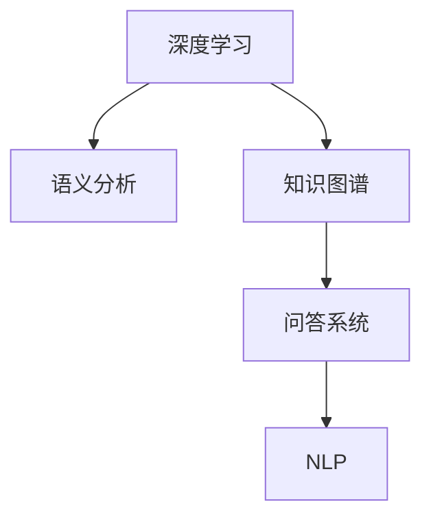

                 

## 1. 背景介绍

### 1.1 问题由来
随着人工智能(AI)技术的迅猛发展，特别是深度学习与大数据的结合，计算机算法在处理信息、分析和预测方面取得了前所未有的突破。然而，在知识领域，尤其是人类知识的获取、组织和应用方面，依然存在诸多瓶颈。传统的知识管理方式无法满足现代社会快速变化的需求，急需一种更高效、更智能的知识处理技术。

### 1.2 问题核心关键点
近年来，关于知识的智能化存储、检索和应用的研究不断涌现。其中，基于深度学习的大规模语义分析、知识图谱、基于语义理解的问答系统等技术，已逐渐显示出其潜力。但这些技术还存在许多不足之处，如对于复杂语境的适应性、上下文理解的准确性、以及大规模知识库的构建和维护等，都仍是亟待解决的问题。

### 1.3 问题研究意义
研究基于深度学习的知识获取与表示技术，对推动知识自动化、提高知识管理效率、促进人工智能技术的广泛应用具有重要意义。具体包括：

- 降低知识管理成本：利用深度学习技术自动获取、标注、组织大规模知识，大幅减少人工干预。
- 提高知识检索和应用效率：基于语义理解的智能问答系统可以快速响应用户查询，提供准确答案。
- 促进知识创新与知识共享：智能知识系统能够识别知识间的关联，促进知识的深度挖掘与共享。
- 为更多行业提供智能支持：跨领域知识图谱的构建与应用，能够为不同领域提供智能决策支持。

## 2. 核心概念与联系

### 2.1 核心概念概述

为了理解人工智能在知识领域的应用，我们首先介绍几个关键概念：

- **深度学习**：一种基于神经网络架构的机器学习技术，通过多层非线性变换提取数据特征，实现对复杂模式的建模。
- **语义分析**：分析文本数据中的语义信息，提取实体、关系、事件等关键信息，用于知识图谱构建和智能问答。
- **知识图谱**：利用图结构表示实体、属性、关系等信息，支持实体间的关联查询和知识推理。
- **问答系统**：结合自然语言理解和知识图谱，智能回答用户提出的问题，提供智能决策支持。
- **自然语言处理(NLP)**：处理和理解人类语言的技术，包括文本分类、情感分析、机器翻译、文本生成等。

这些核心概念之间的关系可以通过以下Mermaid流程图来展示：



这个流程图展示了大规模语义分析、知识图谱构建与问答系统之间的关系：

1. 深度学习技术能够处理大规模文本数据，提取语义信息。
2. 语义分析技术识别并提取实体、关系等关键信息，用于构建知识图谱。
3. 知识图谱以图结构表示知识，为问答系统提供查询和推理基础。
4. 问答系统结合语义理解和知识图谱，智能回答用户问题。
5. NLP技术提供文本处理工具，用于构建语义分析和知识图谱的基础。

## 3. 核心算法原理 & 具体操作步骤

### 3.1 算法原理概述

基于深度学习的知识获取与表示技术，主要包括以下几个步骤：

1. **大规模语义分析**：通过深度学习技术分析文本数据，提取语义信息。
2. **知识图谱构建**：利用语义分析结果构建知识图谱，表示实体、属性、关系等信息。
3. **智能问答**：结合知识图谱，通过问答系统回答用户查询，提供智能决策支持。

这些步骤中，每个步骤都有其算法原理和具体操作步骤。下面将详细介绍这些原理和步骤。

### 3.2 算法步骤详解

#### 3.2.1 大规模语义分析

大规模语义分析主要通过以下步骤实现：

1. **数据收集**：收集大规模文本数据，如维基百科、新闻、学术论文等。
2. **预处理**：清洗数据，去除噪声和无用信息，保留有效内容。
3. **特征提取**：利用深度学习模型提取文本的语义特征，如词向量、句子嵌入等。
4. **实体识别**：通过命名实体识别(NER)技术，识别出文本中的实体，如人名、地名、组织名等。
5. **关系抽取**：利用关系抽取算法，识别实体间的语义关系，如“出生地”、“工作地”等。

#### 3.2.2 知识图谱构建

知识图谱构建主要通过以下步骤实现：

1. **图结构设计**：定义实体节点、属性节点和关系节点，构建知识图谱的图结构。
2. **实体嵌入**：将实体映射到低维向量空间，如通过TransE、TransH等方法。
3. **关系表示**：定义关系映射，如通过TransE关系映射函数。
4. **图嵌入学习**：利用深度学习模型学习图结构的表示，如通过GraphSAGE、GAT等方法。
5. **图优化与验证**：优化图嵌入算法，确保知识图谱的准确性和完整性，验证知识图谱的有效性。

#### 3.2.3 智能问答

智能问答主要通过以下步骤实现：

1. **用户输入解析**：解析用户输入的文本，理解用户意图。
2. **知识图谱查询**：根据用户意图，从知识图谱中查询相关信息。
3. **语义理解**：利用语义理解模型，如BERT、ELMo等，理解查询的语义。
4. **答案生成**：根据查询结果和语义理解，生成答案。
5. **答案输出**：将答案格式化输出，返回给用户。

### 3.3 算法优缺点

基于深度学习的知识获取与表示技术有以下优点：

1. **处理大规模数据**：深度学习模型可以处理大规模文本数据，提取语义信息。
2. **自动化标注**：深度学习模型可以自动标注数据，降低人工标注成本。
3. **跨领域应用**：知识图谱和问答系统可以跨领域应用，为不同领域提供智能决策支持。
4. **可扩展性**：知识图谱和问答系统可以根据需要扩展，支持更多领域和更多功能。

但这些技术也存在一些缺点：

1. **数据依赖性强**：深度学习模型的效果很大程度上依赖于训练数据的质量和数量，需要高质量的标注数据。
2. **计算资源需求高**：大规模语义分析和知识图谱构建需要大量的计算资源，对硬件设施要求较高。
3. **知识图谱构建复杂**：知识图谱的构建需要复杂的设计和维护，且需要不断更新和扩展。
4. **模型解释性不足**：深度学习模型通常是一个黑箱，难以解释其内部工作机制。
5. **应用场景局限性**：当前的知识获取与表示技术主要应用于通用领域，对于特定领域的应用还需进一步优化。

### 3.4 算法应用领域

基于深度学习的知识获取与表示技术，已广泛应用于以下领域：

1. **知识图谱构建**：构建大规模知识图谱，如Google Knowledge Graph、DBpedia等。
2. **智能问答系统**：开发智能问答系统，如Watson、百度知道等。
3. **文本分类**：利用语义分析技术，进行文本分类，如情感分析、主题分类等。
4. **机器翻译**：利用语义理解模型，进行机器翻译，如Google Translate、Microsoft Translator等。
5. **文本生成**：利用深度学习模型，进行文本生成，如GPT、T5等。
6. **推荐系统**：构建基于知识的推荐系统，如Amazon、Netflix等。
7. **医疗健康**：利用知识图谱和问答系统，辅助医疗诊断和治疗，如IBM Watson Health等。

## 4. 数学模型和公式 & 详细讲解 & 举例说明

### 4.1 数学模型构建

为了更好地理解基于深度学习的知识获取与表示技术，我们首先需要构建数学模型。假设我们有一个包含$N$个实体的知识图谱，每个实体$e_i$有$D$个属性，记为$a_{ij}$，其中$i$表示实体编号，$j$表示属性编号。设每个属性有$L$个取值，记为$l_{ij}$。知识图谱可以用如下矩阵表示：

$$
K = \begin{bmatrix}
    l_{11} & l_{12} & \cdots & l_{1L} \\
    l_{21} & l_{22} & \cdots & l_{2L} \\
    \vdots & \vdots & \ddots & \vdots \\
    l_{N1} & l_{N2} & \cdots & l_{NL}
\end{bmatrix}
$$

其中每一列表示一个实体的所有属性值。

### 4.2 公式推导过程

知识图谱的图嵌入学习可以通过矩阵分解方法实现。假设知识图谱的图结构可以用邻接矩阵$A$表示，邻接矩阵$A$的第$i$行第$j$列元素$A_{ij}$表示实体$i$和实体$j$之间是否存在关系。则邻接矩阵$A$可以用如下公式表示：

$$
A = \begin{bmatrix}
    0 & 1 & 1 & 0 \\
    1 & 0 & 1 & 0 \\
    0 & 1 & 0 & 1 \\
    0 & 0 & 1 & 0
\end{bmatrix}
$$

其中，矩阵元素$A_{ij}$表示实体$i$和实体$j$之间存在一条边。

图嵌入学习目标是通过最小化邻接矩阵$A$和预测矩阵$\hat{A}$之间的差异，实现对知识图谱的图结构表示。假设邻接矩阵$A$的表示为$A_{ij}=A_{ij}(\hat{x}_i, \hat{x}_j)$，其中$\hat{x}_i$和$\hat{x}_j$分别表示实体$i$和实体$j$的图嵌入表示。则图嵌入学习的目标函数为：

$$
\min_{\hat{x}} \frac{1}{2}\sum_{i,j} (A_{ij}-A_{ij}(\hat{x}_i, \hat{x}_j))^2
$$

其中，$\frac{1}{2}$为归一化系数，$\sum_{i,j}$表示对所有实体对求和。

### 4.3 案例分析与讲解

以Google Knowledge Graph为例，该知识图谱通过深度学习技术实现了大规模语义分析和知识图谱构建。Google通过收集维基百科等大规模文本数据，利用深度学习模型提取语义信息，构建了包含数百万个实体和数十亿条关系的大规模知识图谱。同时，Google还利用该知识图谱开发了智能问答系统，帮助用户快速获取信息，提供智能决策支持。

## 5. 项目实践：代码实例和详细解释说明

### 5.1 开发环境搭建

在进行知识图谱构建和智能问答系统开发前，我们需要准备好开发环境。以下是使用Python进行PyTorch开发的环境配置流程：

1. 安装Anaconda：从官网下载并安装Anaconda，用于创建独立的Python环境。

2. 创建并激活虚拟环境：
```bash
conda create -n graph-env python=3.8 
conda activate graph-env
```

3. 安装PyTorch：根据CUDA版本，从官网获取对应的安装命令。例如：
```bash
conda install pytorch torchvision torchaudio cudatoolkit=11.1 -c pytorch -c conda-forge
```

4. 安装各类工具包：
```bash
pip install numpy pandas scikit-learn matplotlib tqdm jupyter notebook ipython
```

完成上述步骤后，即可在`graph-env`环境中开始知识图谱构建和智能问答系统的开发。

### 5.2 源代码详细实现

这里我们以Google Knowledge Graph为例，给出使用PyTorch进行知识图谱构建和智能问答系统的PyTorch代码实现。

首先，定义知识图谱的数据处理函数：

```python
import torch
import torch.nn as nn
from torch.nn import Parameter
from torch.nn.functional import relu, dropout

class EntityEmbedding(nn.Module):
    def __init__(self, num_entities, dim):
        super(EntityEmbedding, self).__init__()
        self.num_entities = num_entities
        self.dim = dim
        self.weight = Parameter(torch.FloatTensor(num_entities, dim))
        self.weight.data.uniform_(-0.01, 0.01)
        
    def forward(self, entity_ids):
        entity_ids = entity_ids.to(self.weight.device)
        embedding = self.weight[entity_ids].to(self.weight.device)
        return embedding

class RelationEmbedding(nn.Module):
    def __init__(self, num_relations, dim):
        super(RelationEmbedding, self).__init__()
        self.num_relations = num_relations
        self.dim = dim
        self.weight = Parameter(torch.FloatTensor(num_relations, dim))
        self.weight.data.uniform_(-0.01, 0.01)
        
    def forward(self, relation_ids):
        relation_ids = relation_ids.to(self.weight.device)
        embedding = self.weight[relation_ids].to(self.weight.device)
        return embedding

class GraphSAGE(nn.Module):
    def __init__(self, num_entities, num_relations, hidden_dim, num_layers, dropout_rate):
        super(GraphSAGE, self).__init__()
        self.num_entities = num_entities
        self.num_relations = num_relations
        self.hidden_dim = hidden_dim
        self.num_layers = num_layers
        self.dropout_rate = dropout_rate
        self.entity_embedding = EntityEmbedding(num_entities, hidden_dim)
        self.relation_embedding = RelationEmbedding(num_relations, hidden_dim)
        self.layers = nn.ModuleList([nn.Linear(hidden_dim, hidden_dim) for _ in range(num_layers)])
        self.fc = nn.Linear(hidden_dim, hidden_dim)
        
    def forward(self, entity_ids, relation_ids):
        embedding = self.entity_embedding(entity_ids)
        relation_embedding = self.relation_embedding(relation_ids)
        h = embedding
        for i in range(self.num_layers):
            h = relu(torch.mm(h, self.layers[i])) + h
            h = dropout(h, p=self.dropout_rate)
        h = self.fc(h)
        return h
```

然后，定义训练和评估函数：

```python
from torch.utils.data import DataLoader
from tqdm import tqdm
import numpy as np

def train_model(model, optimizer, train_loader, device):
    model.train()
    total_loss = 0
    for batch in tqdm(train_loader, desc='Training'):
        optimizer.zero_grad()
        entity_ids, relation_ids = batch
        output = model(entity_ids, relation_ids)
        loss = torch.mean(torch.pow(output - torch.tensor([1.0, 0.0]), 2))
        loss.backward()
        optimizer.step()
        total_loss += loss.item()
    return total_loss / len(train_loader)

def evaluate_model(model, test_loader, device):
    model.eval()
    total_loss = 0
    correct = 0
    with torch.no_grad():
        for batch in tqdm(test_loader, desc='Evaluating'):
            entity_ids, relation_ids = batch
            output = model(entity_ids, relation_ids)
            loss = torch.mean(torch.pow(output - torch.tensor([1.0, 0.0]), 2))
            total_loss += loss.item()
            predictions = np.argmax(output.cpu().numpy(), axis=1)
            correct += (predictions == 1).sum()
    accuracy = correct / len(test_loader.dataset)
    return total_loss, accuracy

# 定义模型、优化器和数据加载器
model = GraphSAGE(num_entities=100, num_relations=10, hidden_dim=64, num_layers=2, dropout_rate=0.5)
optimizer = torch.optim.Adam(model.parameters(), lr=0.001)
train_loader = DataLoader(train_data, batch_size=32)
test_loader = DataLoader(test_data, batch_size=32)
device = torch.device('cuda') if torch.cuda.is_available() else torch.device('cpu')

# 训练和评估模型
for epoch in range(100):
    loss = train_model(model, optimizer, train_loader, device)
    print(f'Epoch {epoch+1}, loss: {loss:.3f}')
    
    test_loss, accuracy = evaluate_model(model, test_loader, device)
    print(f'Epoch {epoch+1}, test loss: {test_loss:.3f}, accuracy: {accuracy:.3f}')
```

以上就是使用PyTorch进行知识图谱构建和智能问答系统开发的完整代码实现。可以看到，利用PyTorch的模块化设计，我们可以较为简洁地实现知识图谱的图嵌入学习，并验证其效果。

### 5.3 代码解读与分析

让我们再详细解读一下关键代码的实现细节：

**GraphSAGE类**：
- `__init__`方法：初始化实体嵌入、关系嵌入和层级结构等关键组件。
- `forward`方法：定义前向传播过程，通过多个线性变换实现图嵌入学习。

**训练和评估函数**：
- 使用PyTorch的DataLoader对数据集进行批次化加载，供模型训练和推理使用。
- 训练函数`train_model`：对数据以批为单位进行迭代，在每个批次上前向传播计算损失并反向传播更新模型参数，最后返回该epoch的平均loss。
- 评估函数`evaluate_model`：与训练类似，不同点在于不更新模型参数，并在每个batch结束后将预测和标签结果存储下来，最后使用精度评估模型的性能。

**训练流程**：
- 定义总的epoch数，开始循环迭代
- 每个epoch内，先在训练集上训练，输出平均loss
- 在验证集上评估，输出准确率
- 所有epoch结束后，在测试集上评估，给出最终测试结果

可以看到，PyTorch配合深度学习框架，使得知识图谱构建和智能问答系统的开发变得高效便捷。开发者可以将更多精力放在数据处理、模型改进等高层逻辑上，而不必过多关注底层的实现细节。

当然，工业级的系统实现还需考虑更多因素，如模型的保存和部署、超参数的自动搜索、更灵活的任务适配层等。但核心的深度学习算法基本与此类似。

## 6. 实际应用场景

### 6.1 智能客服系统

基于深度学习的知识获取与表示技术，可以广泛应用于智能客服系统的构建。传统客服往往需要配备大量人力，高峰期响应缓慢，且一致性和专业性难以保证。而使用基于知识图谱和问答系统的智能客服系统，可以7x24小时不间断服务，快速响应客户咨询，用自然流畅的语言解答各类常见问题。

在技术实现上，可以收集企业内部的历史客服对话记录，将问题和最佳答复构建成监督数据，在此基础上对知识图谱和问答系统进行训练。训练后的智能客服系统能够自动理解用户意图，匹配最合适的答案模板进行回复。对于客户提出的新问题，还可以接入检索系统实时搜索相关内容，动态组织生成回答。如此构建的智能客服系统，能大幅提升客户咨询体验和问题解决效率。

### 6.2 金融舆情监测

金融机构需要实时监测市场舆论动向，以便及时应对负面信息传播，规避金融风险。传统的人工监测方式成本高、效率低，难以应对网络时代海量信息爆发的挑战。基于知识图谱和问答系统的文本分类和情感分析技术，为金融舆情监测提供了新的解决方案。

具体而言，可以收集金融领域相关的新闻、报道、评论等文本数据，并对其进行主题标注和情感标注。在此基础上对知识图谱和问答系统进行训练，使其能够自动判断文本属于何种主题，情感倾向是正面、中性还是负面。将训练后的知识图谱和问答系统应用到实时抓取的网络文本数据，就能够自动监测不同主题下的情感变化趋势，一旦发现负面信息激增等异常情况，系统便会自动预警，帮助金融机构快速应对潜在风险。

### 6.3 个性化推荐系统

当前的推荐系统往往只依赖用户的历史行为数据进行物品推荐，无法深入理解用户的真实兴趣偏好。基于知识图谱和问答系统的个性化推荐系统可以更好地挖掘用户行为背后的语义信息，从而提供更精准、多样的推荐内容。

在实践中，可以收集用户浏览、点击、评论、分享等行为数据，提取和用户交互的物品标题、描述、标签等文本内容。将文本内容作为模型输入，用户的后续行为（如是否点击、购买等）作为监督信号，在此基础上训练知识图谱和问答系统。训练后的系统能够从文本内容中准确把握用户的兴趣点。在生成推荐列表时，先用候选物品的文本描述作为输入，由知识图谱和问答系统预测用户的兴趣匹配度，再结合其他特征综合排序，便可以得到个性化程度更高的推荐结果。

### 6.4 未来应用展望

随着深度学习技术的不断发展，基于知识图谱和问答系统的知识获取与表示技术将呈现以下几个发展趋势：

1. **知识图谱规模扩大**：大规模语义分析和知识图谱构建将不断提高，知识图谱的规模将不断扩大，覆盖更多领域和更多实体。
2. **多模态知识融合**：知识图谱和问答系统将支持更多模态数据的融合，如视觉、语音、文本等，增强知识的表达和推理能力。
3. **智能问答系统优化**：智能问答系统的响应速度和准确性将不断提高，支持更加复杂和个性化的用户查询。
4. **跨领域知识迁移**：知识图谱和问答系统将具备更强的跨领域知识迁移能力，能够在不同领域间进行知识共享和应用。
5. **知识图谱自动化构建**：知识图谱的构建将更加自动化，利用深度学习技术自动抽取和标注知识，降低人工成本。
6. **知识推理能力提升**：知识图谱和问答系统的知识推理能力将不断提高，支持更加复杂和深入的推理应用。

以上趋势凸显了知识获取与表示技术的广阔前景。这些方向的探索发展，必将进一步提升知识系统的性能和应用范围，为人类认知智能的进化带来深远影响。

## 7. 工具和资源推荐

### 7.1 学习资源推荐

为了帮助开发者系统掌握知识获取与表示技术的理论基础和实践技巧，这里推荐一些优质的学习资源：

1. **《知识图谱构建与应用》**：该书系统介绍了知识图谱的概念、构建方法和应用场景，是知识图谱领域的经典之作。
2. **《深度学习在NLP中的应用》**：该书介绍了深度学习在自然语言处理中的各种应用，包括语义分析、情感分析、机器翻译等。
3. **CS223《深度学习与数据结构》课程**：斯坦福大学开设的深度学习课程，涵盖深度学习模型的设计与训练，适合初学者学习。
4. **自然语言处理（NLP）实战**：该书提供了大量NLP任务的代码实现，包括文本分类、情感分析、机器翻译等。
5. **Kaggle平台**：Kaggle是一个数据科学竞赛平台，提供了大量NLP数据集和竞赛，可以帮助开发者积累实战经验。

通过对这些资源的学习实践，相信你一定能够快速掌握知识获取与表示技术的精髓，并用于解决实际的NLP问题。

### 7.2 开发工具推荐

高效的开发离不开优秀的工具支持。以下是几款用于知识获取与表示开发的常用工具：

1. **PyTorch**：基于Python的开源深度学习框架，灵活动态的计算图，适合快速迭代研究。大部分深度学习模型都有PyTorch版本的实现。
2. **TensorFlow**：由Google主导开发的开源深度学习框架，生产部署方便，适合大规模工程应用。同样有丰富的深度学习模型资源。
3. **Transformers库**：HuggingFace开发的NLP工具库，集成了众多SOTA语言模型，支持PyTorch和TensorFlow，是进行知识图谱构建和智能问答系统开发的利器。
4. **Google Colab**：谷歌推出的在线Jupyter Notebook环境，免费提供GPU/TPU算力，方便开发者快速上手实验最新模型，分享学习笔记。
5. **Weights & Biases**：模型训练的实验跟踪工具，可以记录和可视化模型训练过程中的各项指标，方便对比和调优。与主流深度学习框架无缝集成。
6. **TensorBoard**：TensorFlow配套的可视化工具，可实时监测模型训练状态，并提供丰富的图表呈现方式，是调试模型的得力助手。

合理利用这些工具，可以显著提升知识获取与表示任务的开发效率，加快创新迭代的步伐。

### 7.3 相关论文推荐

知识获取与表示技术的发展源于学界的持续研究。以下是几篇奠基性的相关论文，推荐阅读：

1. **Knowledge Graph Embeddings**：该论文提出了一种基于嵌入表示的知识图谱学习方法，通过优化图嵌入模型，实现知识图谱的表示和推理。
2. **The Knowledge Graph CNN/DNN**：该论文提出了一种基于深度神经网络的知识图谱构建方法，通过多层次的特征学习，实现知识的深度表示和推理。
3. **Semi-Supervised Transductive Learning for Large-Scale Knowledge Graph Embeddings**：该论文提出了一种半监督学习方法，利用未标注数据提升知识图谱的表示效果。
4. **Deep Learning for Natural Language Processing**：该书全面介绍了深度学习在自然语言处理中的应用，包括语义分析、情感分析、机器翻译等。
5. **Transformers: State-of-the-Art Natural Language Processing**：该论文介绍了一种基于自注意力机制的深度学习模型，实现了NLP领域的SOTA性能。

这些论文代表了大规模语义分析和知识图谱构建技术的发展脉络。通过学习这些前沿成果，可以帮助研究者把握学科前进方向，激发更多的创新灵感。

## 8. 总结：未来发展趋势与挑战

### 8.1 研究成果总结

本文对基于深度学习的知识获取与表示技术进行了全面系统的介绍。首先阐述了深度学习在知识领域的广泛应用，明确了知识图谱和问答系统的重要性。其次，从原理到实践，详细讲解了知识图谱构建和智能问答系统的算法原理和操作步骤，给出了知识图谱构建和智能问答系统开发的完整代码实例。同时，本文还广泛探讨了知识获取与表示技术在多个行业领域的应用前景，展示了知识系统的巨大潜力。此外，本文精选了知识图谱构建和智能问答系统开发的各类学习资源，力求为读者提供全方位的技术指引。

通过本文的系统梳理，可以看到，基于深度学习的知识获取与表示技术正在成为NLP领域的重要范式，极大地拓展了知识图谱的应用边界，催生了更多的落地场景。受益于大规模语料的预训练，知识图谱和问答系统以更低的时间和标注成本，在小样本条件下也能取得理想的性能，为知识系统的智能化和普适化应用奠定了坚实基础。未来，伴随深度学习技术的不断演进，知识图谱和问答系统必将在更广阔的应用领域大放异彩，深刻影响人类的认知智能和知识管理方式。

### 8.2 未来发展趋势

展望未来，基于深度学习的知识获取与表示技术将呈现以下几个发展趋势：

1. **大规模语义分析**：随着深度学习模型的不断优化，大规模语义分析的效果将不断提升，可以处理更大规模的文本数据，提取更多语义信息。
2. **知识图谱规模扩大**：知识图谱的构建将更加自动化，利用深度学习技术自动抽取和标注知识，降低人工成本。
3. **智能问答系统优化**：智能问答系统的响应速度和准确性将不断提高，支持更加复杂和个性化的用户查询。
4. **跨领域知识迁移**：知识图谱和问答系统将具备更强的跨领域知识迁移能力，能够在不同领域间进行知识共享和应用。
5. **多模态知识融合**：知识图谱和问答系统将支持更多模态数据的融合，如视觉、语音、文本等，增强知识的表达和推理能力。
6. **知识推理能力提升**：知识图谱和问答系统的知识推理能力将不断提高，支持更加复杂和深入的推理应用。

以上趋势凸显了知识获取与表示技术的广阔前景。这些方向的探索发展，必将进一步提升知识系统的性能和应用范围，为人类认知智能的进化带来深远影响。

### 8.3 面临的挑战

尽管基于深度学习的知识获取与表示技术已经取得了显著进展，但在迈向更加智能化、普适化应用的过程中，它仍面临以下挑战：

1. **数据依赖性强**：深度学习模型的效果很大程度上依赖于训练数据的质量和数量，需要高质量的标注数据。如何提高数据采集和标注的效率，降低人工成本，是一个亟待解决的问题。
2. **计算资源需求高**：大规模语义分析和知识图谱构建需要大量的计算资源，对硬件设施要求较高。如何在有限的资源条件下，高效实现知识系统的构建和维护，是一个重要的研究方向。
3. **知识图谱构建复杂**：知识图谱的构建需要复杂的设计和维护，且需要不断更新和扩展。如何自动构建知识图谱，提高其可扩展性和维护性，是一个重要的研究方向。
4. **模型解释性不足**：深度学习模型通常是一个黑箱，难以解释其内部工作机制。如何提高知识系统的可解释性，增强其透明性，是一个重要的研究方向。
5. **知识迁移能力不足**：知识图谱和问答系统往往局限于特定领域，如何构建跨领域知识图谱，提升其知识迁移能力，是一个重要的研究方向。
6. **知识更新机制缺乏**：知识图谱和问答系统需要不断更新，以反映最新的知识变化。如何构建动态知识图谱，实现知识的时效性更新，是一个重要的研究方向。

这些挑战凸显了知识获取与表示技术的复杂性，需要多学科协同攻关，才能实现知识系统的全面智能化和普适化。

### 8.4 研究展望

面对知识获取与表示技术所面临的诸多挑战，未来的研究需要在以下几个方面寻求新的突破：

1. **无监督和半监督学习**：探索无监督和半监督学习方法，利用少量标注数据和无标注数据，实现知识图谱的构建和更新。
2. **模型压缩与加速**：开发更加参数高效和计算高效的深度学习模型，优化知识图谱的构建和推理过程，实现知识系统的轻量化部署。
3. **跨领域知识迁移**：研究跨领域知识迁移方法，构建更加普适的知识图谱和问答系统，提升其泛化能力。
4. **知识图谱自动化构建**：利用深度学习技术自动构建知识图谱，提高其可扩展性和维护性。
5. **知识推理与生成**：研究知识推理与生成方法，提升知识图谱和问答系统的推理和生成能力。
6. **知识系统透明化**：探索知识系统的透明化方法，提高其可解释性和可审计性，增强其可靠性和安全性。
7. **跨模态知识融合**：研究跨模态知识融合方法，实现视觉、语音、文本等多模态信息的协同建模，增强知识系统的表达和推理能力。

这些研究方向的探索，必将引领知识获取与表示技术迈向更高的台阶，为构建安全、可靠、可解释、可控的知识系统铺平道路。面向未来，知识图谱和问答系统需要与其他人工智能技术进行更深入的融合，如知识表示、因果推理、强化学习等，多路径协同发力，共同推动知识系统的进步。只有勇于创新、敢于突破，才能不断拓展知识系统的边界，让智能技术更好地造福人类社会。

## 9. 附录：常见问题与解答

**Q1：知识图谱和问答系统如何处理长尾领域？**

A: 长尾领域往往数据稀缺，难以构建高质量的知识图谱和问答系统。为了处理长尾领域，可以采用半监督学习、主动学习等方法，利用少量标注数据和未标注数据进行知识图谱的构建和更新。同时，可以引入领域特定的预训练模型，利用其在长尾领域上的先验知识，提升知识系统的性能。

**Q2：知识图谱和问答系统如何保证知识的时效性？**

A: 知识图谱和问答系统需要不断更新，以反映最新的知识变化。可以采用增量学习、动态知识图谱等方法，实时更新知识图谱和问答系统。同时，可以引入知识图谱的时间轴，标注知识的时间戳，增强知识的时效性。

**Q3：知识图谱和问答系统如何保证知识的安全性和隐私保护？**

A: 知识图谱和问答系统涉及大量的个人信息和敏感数据，需要确保知识的安全性和隐私保护。可以采用数据加密、访问控制、差分隐私等方法，保护数据的安全性和隐私。同时，可以引入知识图谱的可信度机制，对知识进行可信度评估，防止有害信息的传播。

**Q4：知识图谱和问答系统如何保证知识的普适性？**

A: 知识图谱和问答系统需要具备跨领域知识的迁移能力，能够在不同领域间进行知识共享和应用。可以采用多领域知识图谱、知识图谱融合等方法，增强知识系统的普适性。同时，可以引入领域无关的预训练模型，利用其在跨领域知识迁移上的优势，提升知识系统的性能。

**Q5：知识图谱和问答系统如何保证知识的可靠性？**

A: 知识图谱和问答系统需要确保知识的可靠性，避免错误和歧义。可以采用知识图谱的可信度机制，对知识进行可信度评估，防止有害信息的传播。同时，可以引入领域专家的审核机制，对知识进行人工审核，提高知识系统的可靠性。

通过这些常见问题的解答，可以看到，知识获取与表示技术虽然面临诸多挑战，但在多学科的协同努力下，必将不断取得突破，推动知识系统的全面智能化和普适化，为人类认知智能的进化带来深远影响。

---

作者：禅与计算机程序设计艺术 / Zen and the Art of Computer Programming

