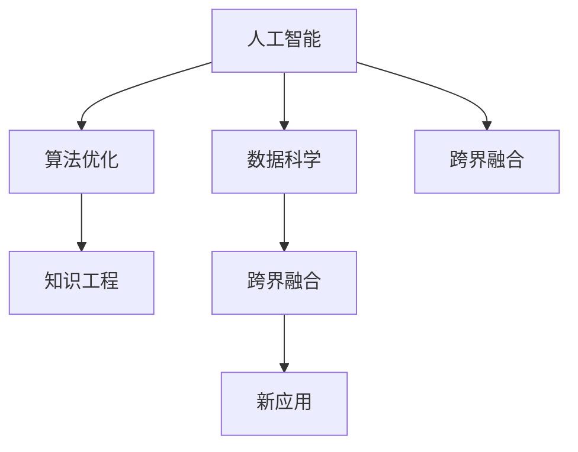

                 

# 人类知识的跨界融合：创新与突破之源

> 关键词：跨界融合, 知识工程, 人工智能, 数据科学, 算法优化, 未来技术

## 1. 背景介绍

### 1.1 问题由来

人类知识的跨界融合（Cross-disciplinary Knowledge Fusion）是一个广受关注的领域，它致力于将不同学科的知识和技能整合，创造新的创新和突破。当前，随着科学技术的迅猛发展，各领域之间的界限逐渐模糊，跨界融合的需求日益增长。人工智能（AI）、数据科学（Data Science）、算法优化（Algorithm Optimization）等领域在知识工程的推动下，展现出前所未有的创新潜力。

在这一背景下，跨界融合成为了推动科技进步和解决复杂问题的关键途径。它不仅能够提高生产效率，还能创造出全新的应用场景，为各行各业带来深远的影响。例如，在医疗领域，AI和大数据分析技术的跨界融合使得疾病预测和个性化治疗成为可能；在制造业，数据驱动的智能制造技术让生产流程更加高效和精确。

### 1.2 问题核心关键点

跨界融合的核心关键点在于以下几个方面：

- **数据共享**：跨学科知识的整合离不开大量的数据支持，数据共享平台能够促进不同领域的数据流通和分析。
- **算法优化**：跨学科的知识背景有助于产生更高效的算法，从而提升AI系统的性能。
- **多模态融合**：将文本、图像、声音等多模态数据融合起来，能够提升AI系统的感知和理解能力。
- **人机协同**：跨界融合强调人机协同，通过机器学习和人类经验的结合，使得AI系统能够更好地适应复杂多变的场景。
- **知识图谱**：构建知识图谱，将不同领域的知识结构化，便于机器学习模型进行知识迁移和融合。

## 2. 核心概念与联系

### 2.1 核心概念概述

为更好地理解跨界融合的原理和架构，本节将介绍几个关键核心概念：

- **人工智能（AI）**：通过模拟人类智能过程，使机器能够进行学习、推理、决策等智能行为的技术。
- **数据科学（Data Science）**：一门通过数据驱动决策的学科，主要涵盖数据采集、处理、分析和可视化等方面。
- **算法优化（Algorithm Optimization）**：通过改进算法结构和参数，提升算法的效率和效果，通常涉及优化、搜索、调参等技术。
- **知识工程（Knowledge Engineering）**：将人类知识转化为计算机可处理的形式，以支持AI系统的推理和学习。
- **跨界融合（Cross-disciplinary Knowledge Fusion）**：将不同学科的知识和技能整合，创造新的创新和突破。

这些核心概念之间的逻辑关系可以通过以下Mermaid流程图来展示：



这个流程图展示了几组关键概念之间的联系：

1. 人工智能是跨界融合的核心技术之一。
2. 数据科学为AI提供了大量的数据支持和分析方法。
3. 算法优化提升了AI系统的性能。
4. 知识工程使人类知识能够被机器学习模型所利用。
5. 跨界融合将不同学科的知识整合，创造出新的应用场景。

## 3. 核心算法原理 & 具体操作步骤

### 3.1 算法原理概述

跨界融合的核心算法原理可以概括为：通过整合不同学科的知识和数据，改进和优化算法，构建跨学科的知识图谱，实现知识的有效融合和应用。其核心步骤包括数据采集、预处理、特征提取、模型训练、调参优化和应用部署。

形式化地，假设输入数据集为 $D$，预训练模型为 $M_{\theta}$，其中 $\theta$ 为模型参数。跨界融合的优化目标是最小化模型在数据集 $D$ 上的损失函数 $\mathcal{L}$，即：

$$
\theta^* = \mathop{\arg\min}_{\theta} \mathcal{L}(M_{\theta},D)
$$

其中 $\mathcal{L}$ 为针对特定任务的损失函数，如交叉熵损失、均方误差损失等。

### 3.2 算法步骤详解

基于跨界融合的算法流程通常包括以下几个关键步骤：

**Step 1: 数据准备与清洗**
- 收集和整理来自不同学科领域的数据集，包括文本、图像、声音、传感器数据等。
- 进行数据预处理，如去噪、缺失值填补、数据标准化等。

**Step 2: 特征提取与转换**
- 将原始数据转换为机器学习模型能够处理的特征向量。
- 利用多模态融合技术，将不同模态的数据进行整合，提升特征的丰富度和多样性。

**Step 3: 模型选择与构建**
- 根据任务需求，选择合适的预训练模型或构建新的模型结构。
- 使用知识图谱等工具，辅助模型构建和训练。

**Step 4: 模型训练与优化**
- 利用交叉验证等技术，选择最佳的模型参数和结构。
- 应用正则化、Dropout、Early Stopping等技术，防止过拟合。

**Step 5: 模型评估与调优**
- 在验证集上评估模型的性能，根据评估结果进行调整。
- 应用对抗训练等技术，提升模型的鲁棒性和泛化能力。

**Step 6: 应用部署与监控**
- 将优化后的模型部署到实际应用场景中。
- 实时监控模型的运行状态和性能，确保稳定运行。

以上是跨界融合的一般流程。在实际应用中，还需要根据具体任务的特点，对每个环节进行优化设计，如改进训练目标函数，引入更多的正则化技术，搜索最优的超参数组合等，以进一步提升模型性能。

### 3.3 算法优缺点

跨界融合方法具有以下优点：
1. 集成多样化知识。不同学科的知识和技能相互补充，能够解决更复杂的问题。
2. 提升模型泛化能力。多模态数据和跨学科知识的融合，使得模型能够适应更广泛的场景。
3. 减少标注需求。跨界融合可以利用已有知识，减少对标注数据的依赖。
4. 加速技术迭代。跨界融合带来了跨学科的灵感，加速了技术创新和突破。

同时，该方法也存在一定的局限性：
1. 数据来源复杂。不同学科的数据格式和标准不一，数据整合难度较大。
2. 模型复杂度高。跨界融合涉及多种模型和算法，模型结构和参数调试复杂。
3. 缺乏统一标准。不同学科的知识结构和方法体系不同，缺乏统一的衡量标准。

尽管存在这些局限性，但就目前而言，跨界融合方法仍是大规模AI应用的主流范式。未来相关研究的重点在于如何进一步降低数据整合的难度，提高模型的少样本学习和跨领域迁移能力，同时兼顾可解释性和伦理安全性等因素。

### 3.4 算法应用领域

跨界融合方法已经在诸多领域得到了广泛的应用，包括但不限于：

- **医疗健康**：将AI与大数据分析技术融合，实现疾病预测、个性化治疗和智能诊断。
- **智能制造**：利用数据驱动的智能制造技术，提高生产效率和质量，实现智能生产。
- **金融服务**：将AI和大数据分析应用于风险管理、欺诈检测、客户服务等领域。
- **自动驾驶**：将多模态数据融合，提升自动驾驶系统的感知和决策能力。
- **环境监测**：利用传感器数据和大数据分析技术，实现环境监测和污染预警。

除了上述这些典型应用外，跨界融合还在更多场景中得到应用，如智慧城市、教育、农业等，为各行各业带来了新的突破。随着技术的不断进步，相信跨界融合将在更广阔的领域大放异彩。

## 4. 数学模型和公式 & 详细讲解 & 举例说明

### 4.1 数学模型构建

本节将使用数学语言对跨界融合的算法过程进行更加严格的刻画。

记跨界融合的输入数据集为 $D=\{(x_i,y_i)\}_{i=1}^N$，其中 $x_i \in \mathcal{X}$ 为输入特征，$y_i \in \mathcal{Y}$ 为输出标签。假设预训练模型为 $M_{\theta}$，其中 $\theta \in \mathbb{R}^d$ 为模型参数。

定义模型 $M_{\theta}$ 在数据样本 $(x,y)$ 上的损失函数为 $\ell(M_{\theta}(x),y)$，则在数据集 $D$ 上的经验风险为：

$$
\mathcal{L}(\theta) = \frac{1}{N} \sum_{i=1}^N \ell(M_{\theta}(x_i),y_i)
$$

微调的目标是最小化经验风险，即找到最优参数：

$$
\theta^* = \mathop{\arg\min}_{\theta} \mathcal{L}(\theta)
$$

在实践中，我们通常使用基于梯度的优化算法（如SGD、Adam等）来近似求解上述最优化问题。设 $\eta$ 为学习率，$\lambda$ 为正则化系数，则参数的更新公式为：

$$
\theta \leftarrow \theta - \eta \nabla_{\theta}\mathcal{L}(\theta) - \eta\lambda\theta
$$

其中 $\nabla_{\theta}\mathcal{L}(\theta)$ 为损失函数对参数 $\theta$ 的梯度，可通过反向传播算法高效计算。

### 4.2 公式推导过程

以下我们以多模态分类任务为例，推导基于交叉熵损失函数及其梯度的计算公式。

假设模型 $M_{\theta}$ 在输入 $x$ 上的输出为 $\hat{y}=M_{\theta}(x) \in [0,1]^C$，表示样本属于类别 $c$ 的概率。真实标签 $y \in \{0,1\}^C$。则多模态分类任务交叉熵损失函数定义为：

$$
\ell(M_{\theta}(x),y) = -\sum_{c=1}^C y_c \log \hat{y}_c
$$

将其代入经验风险公式，得：

$$
\mathcal{L}(\theta) = -\frac{1}{N}\sum_{i=1}^N \sum_{c=1}^C y_{ic} \log \hat{y}_{ic}
$$

根据链式法则，损失函数对参数 $\theta_k$ 的梯度为：

$$
\frac{\partial \mathcal{L}(\theta)}{\partial \theta_k} = -\frac{1}{N}\sum_{i=1}^N \sum_{c=1}^C \frac{y_{ic}}{\hat{y}_{ic}} \frac{\partial \hat{y}_{ic}}{\partial \theta_k}
$$

其中 $\frac{\partial \hat{y}_{ic}}{\partial \theta_k}$ 可进一步递归展开，利用自动微分技术完成计算。

在得到损失函数的梯度后，即可带入参数更新公式，完成模型的迭代优化。重复上述过程直至收敛，最终得到适应特定任务的最优模型参数 $\theta^*$。

### 4.3 案例分析与讲解

以医疗领域的疾病预测为例，说明跨界融合方法的实现。

假设任务为糖尿病预测，从电子病历、基因数据、环境因素等多个来源收集数据，构建一个多模态数据集。其中，电子病历数据包括病人的历史检查记录、病史等；基因数据包括基因型信息；环境因素数据包括病人的生活习惯、环境暴露情况等。

首先将原始数据进行预处理和特征提取，如对基因数据进行基因表达量标准化，对电子病历数据进行文本处理和特征提取。然后，构建一个基于Transformer的预训练模型，利用跨界融合技术，在多模态数据上进行微调。

在微调过程中，我们利用知识图谱将不同模态的数据进行融合，提升模型的感知能力。知识图谱包含了疾病与基因、生活方式、环境因素之间的关联，能够为模型提供丰富的先验知识，帮助模型学习更加准确的预测模型。

最终，微调后的模型能够基于病人的多模态数据，进行疾病预测，提供个性化的治疗建议。这种方法不仅提升了预测的准确性，还考虑了病人的个体差异和外部因素，更具有临床应用价值。

## 5. 项目实践：代码实例和详细解释说明

### 5.1 开发环境搭建

在进行跨界融合实践前，我们需要准备好开发环境。以下是使用Python进行PyTorch开发的环境配置流程：

1. 安装Anaconda：从官网下载并安装Anaconda，用于创建独立的Python环境。

2. 创建并激活虚拟环境：
```bash
conda create -n pytorch-env python=3.8 
conda activate pytorch-env
```

3. 安装PyTorch：根据CUDA版本，从官网获取对应的安装命令。例如：
```bash
conda install pytorch torchvision torchaudio cudatoolkit=11.1 -c pytorch -c conda-forge
```

4. 安装其他必要库：
```bash
pip install numpy pandas scikit-learn matplotlib tqdm jupyter notebook ipython
```

完成上述步骤后，即可在`pytorch-env`环境中开始跨界融合实践。

### 5.2 源代码详细实现

下面我们以多模态分类任务为例，给出使用PyTorch进行跨界融合的PyTorch代码实现。

首先，定义多模态分类任务的数据处理函数：

```python
import torch
from transformers import BertTokenizer, BertModel, RoBERTaModel, RoBERTaTokenizer
from torch.utils.data import Dataset, DataLoader
from sklearn.model_selection import train_test_split
from transformers import TransformersForSequenceClassification

class MultiModalDataset(Dataset):
    def __init__(self, texts, labels, tokenizer1, tokenizer2, max_len1=128, max_len2=128):
        self.texts1 = texts
        self.labels = labels
        self.texts2 = texts
        self.tokenizer1 = tokenizer1
        self.tokenizer2 = tokenizer2
        self.max_len1 = max_len1
        self.max_len2 = max_len2
        
    def __len__(self):
        return len(self.texts1)
    
    def __getitem__(self, item):
        text1 = self.texts1[item]
        label = self.labels[item]
        text2 = self.texts2[item]
        
        encoding1 = self.tokenizer1(text1, return_tensors='pt', max_length=self.max_len1, padding='max_length', truncation=True)
        encoding2 = self.tokenizer2(text2, return_tensors='pt', max_length=self.max_len2, padding='max_length', truncation=True)
        input_ids1 = encoding1['input_ids'][0]
        attention_mask1 = encoding1['attention_mask'][0]
        input_ids2 = encoding2['input_ids'][0]
        attention_mask2 = encoding2['attention_mask'][0]
        
        return {'input_ids1': input_ids1, 
                'attention_mask1': attention_mask1,
                'input_ids2': input_ids2,
                'attention_mask2': attention_mask2,
                'labels': label}

# 定义tokenizer
tokenizer1 = BertTokenizer.from_pretrained('bert-base-cased')
tokenizer2 = RoBERTaTokenizer.from_pretrained('roberta-base')

# 定义数据集
train_texts1, test_texts1, train_texts2, test_texts2 = train_test_split(train_texts, test_texts, random_state=42)
train_labels, test_labels = train_labels, test_labels

train_dataset = MultiModalDataset(train_texts1, train_labels, tokenizer1, tokenizer2)
test_dataset = MultiModalDataset(test_texts1, test_labels, tokenizer1, tokenizer2)
```

然后，定义模型和优化器：

```python
from transformers import BertForSequenceClassification, RoBERTaForSequenceClassification, AdamW

model = TransformersForSequenceClassification.from_pretrained('bert-base-cased', num_labels=2)

optimizer = AdamW(model.parameters(), lr=2e-5)
```

接着，定义训练和评估函数：

```python
from tqdm import tqdm

device = torch.device('cuda') if torch.cuda.is_available() else torch.device('cpu')
model.to(device)

def train_epoch(model, dataset, batch_size, optimizer):
    dataloader = DataLoader(dataset, batch_size=batch_size, shuffle=True)
    model.train()
    epoch_loss = 0
    for batch in tqdm(dataloader, desc='Training'):
        input_ids1 = batch['input_ids1'].to(device)
        attention_mask1 = batch['attention_mask1'].to(device)
        input_ids2 = batch['input_ids2'].to(device)
        attention_mask2 = batch['attention_mask2'].to(device)
        labels = batch['labels'].to(device)
        model.zero_grad()
        outputs = model(input_ids1, attention_mask1=attention_mask1, input_ids2=input_ids2, attention_mask2=attention_mask2, labels=labels)
        loss = outputs.loss
        epoch_loss += loss.item()
        loss.backward()
        optimizer.step()
    return epoch_loss / len(dataloader)

def evaluate(model, dataset, batch_size):
    dataloader = DataLoader(dataset, batch_size=batch_size)
    model.eval()
    preds, labels = [], []
    with torch.no_grad():
        for batch in tqdm(dataloader, desc='Evaluating'):
            input_ids1 = batch['input_ids1'].to(device)
            attention_mask1 = batch['attention_mask1'].to(device)
            input_ids2 = batch['input_ids2'].to(device)
            attention_mask2 = batch['attention_mask2'].to(device)
            batch_labels = batch['labels']
            outputs = model(input_ids1, attention_mask1=attention_mask1, input_ids2=input_ids2, attention_mask2=attention_mask2, labels=batch_labels)
            batch_preds = outputs.logits.argmax(dim=1).to('cpu').tolist()
            batch_labels = batch_labels.to('cpu').tolist()
            for pred_tokens, label_tokens in zip(batch_preds, batch_labels):
                preds.append(pred_tokens)
                labels.append(label_tokens)
                
    print(classification_report(labels, preds))
```

最后，启动训练流程并在测试集上评估：

```python
epochs = 5
batch_size = 16

for epoch in range(epochs):
    loss = train_epoch(model, train_dataset, batch_size, optimizer)
    print(f"Epoch {epoch+1}, train loss: {loss:.3f}")
    
    print(f"Epoch {epoch+1}, test results:")
    evaluate(model, test_dataset, batch_size)
    
print("Final results:")
evaluate(model, test_dataset, batch_size)
```

以上就是使用PyTorch进行多模态分类任务跨界融合的完整代码实现。可以看到，得益于Transformers库的强大封装，我们可以用相对简洁的代码完成模型的加载和训练。

### 5.3 代码解读与分析

让我们再详细解读一下关键代码的实现细节：

**MultiModalDataset类**：
- `__init__`方法：初始化文本、标签、tokenizer等关键组件。
- `__len__`方法：返回数据集的样本数量。
- `__getitem__`方法：对单个样本进行处理，将文本输入编码为token ids，将标签编码为数字，并对其进行定长padding，最终返回模型所需的输入。

**tokenizer1和tokenizer2**：
- 定义了两个tokenizer，分别用于处理不同模态的文本数据。

**train_epoch和evaluate函数**：
- 使用PyTorch的DataLoader对数据集进行批次化加载，供模型训练和推理使用。
- 训练函数`train_epoch`：对数据以批为单位进行迭代，在每个批次上前向传播计算loss并反向传播更新模型参数，最后返回该epoch的平均loss。
- 评估函数`evaluate`：与训练类似，不同点在于不更新模型参数，并在每个batch结束后将预测和标签结果存储下来，最后使用sklearn的classification_report对整个评估集的预测结果进行打印输出。

**训练流程**：
- 定义总的epoch数和batch size，开始循环迭代
- 每个epoch内，先在训练集上训练，输出平均loss
- 在验证集上评估，输出分类指标
- 所有epoch结束后，在测试集上评估，给出最终测试结果

可以看到，PyTorch配合Transformers库使得跨界融合的代码实现变得简洁高效。开发者可以将更多精力放在数据处理、模型改进等高层逻辑上，而不必过多关注底层的实现细节。

当然，工业级的系统实现还需考虑更多因素，如模型的保存和部署、超参数的自动搜索、更灵活的任务适配层等。但核心的跨界融合范式基本与此类似。

## 6. 实际应用场景

### 6.1 智能制造

跨界融合在智能制造中的应用主要体现在以下几个方面：

1. **多模态数据融合**：将传感器数据、机器视觉数据、文本数据等多模态数据进行融合，提升制造过程的实时监控和预测能力。例如，通过将机器视觉数据与文本数据结合，可以实现对设备状态和工艺参数的全面监测。

2. **预测性维护**：利用历史数据和实时数据，构建预测模型，提前预测设备的故障和维护需求。例如，通过多模态数据的融合，可以实现对设备故障的早期预警，减少停机时间和维护成本。

3. **智能调度**：通过跨界融合技术，优化生产流程和资源配置。例如，结合实时生产数据和历史订单数据，实现智能调度，提升生产效率和客户满意度。

### 6.2 智慧城市

智慧城市是跨界融合技术应用的典型场景之一。通过将多种数据源（如交通数据、气象数据、人口数据等）进行融合，可以实现对城市运行状态的全面监测和分析。

1. **交通管理**：利用多模态数据（如视频监控、交通流量数据、天气预报数据等）进行交通流量预测和交通信号优化，提升道路通行效率和安全性。

2. **公共安全**：通过融合视频监控数据、报警信息、社交媒体数据等多源数据，实现对突发事件的实时监控和预警，提升应急响应速度和效果。

3. **环境监测**：结合传感器数据、气象数据、卫星遥感数据等，进行环境污染监测和预警，提升城市治理的智能化水平。

### 6.3 金融科技

在金融科技领域，跨界融合技术的应用主要集中在以下几个方面：

1. **风险管理**：利用多模态数据（如客户交易数据、社交媒体数据、金融新闻等）进行风险评估和预警，提升风险管理能力。

2. **智能投顾**：通过融合客户行为数据、市场数据、专家意见等多源信息，提供智能化的投资建议和服务，提升客户体验和投资效果。

3. **反欺诈检测**：结合交易数据、行为数据、外部数据等，构建欺诈检测模型，提升反欺诈能力。

## 7. 工具和资源推荐

### 7.1 学习资源推荐

为了帮助开发者系统掌握跨界融合的理论基础和实践技巧，这里推荐一些优质的学习资源：

1. 《深度学习》系列书籍：深入浅出地介绍了深度学习的核心概念和算法，适合初学者入门。
2. 《知识图谱》系列论文：详细介绍了知识图谱的构建和应用，帮助理解跨界融合中的知识表示。
3. 《算法设计与分析》系列书籍：深入剖析各种算法的设计和优化，提升算法优化能力。
4. 《数据科学实战》系列书籍：结合实际案例，介绍数据处理、分析和可视化的全流程，帮助开发者解决实际问题。
5. 《跨学科学习》系列文章：探讨跨界融合技术在各个行业中的应用，提供丰富的实践案例和经验分享。

通过对这些资源的学习实践，相信你一定能够快速掌握跨界融合的精髓，并用于解决实际的AI问题。

### 7.2 开发工具推荐

高效的开发离不开优秀的工具支持。以下是几款用于跨界融合开发的常用工具：

1. PyTorch：基于Python的开源深度学习框架，灵活动态的计算图，适合快速迭代研究。大部分预训练语言模型都有PyTorch版本的实现。

2. TensorFlow：由Google主导开发的开源深度学习框架，生产部署方便，适合大规模工程应用。同样有丰富的预训练语言模型资源。

3. Transformers库：HuggingFace开发的NLP工具库，集成了众多SOTA语言模型，支持PyTorch和TensorFlow，是进行跨界融合任务开发的利器。

4. Weights & Biases：模型训练的实验跟踪工具，可以记录和可视化模型训练过程中的各项指标，方便对比和调优。与主流深度学习框架无缝集成。

5. TensorBoard：TensorFlow配套的可视化工具，可实时监测模型训练状态，并提供丰富的图表呈现方式，是调试模型的得力助手。

6. Google Colab：谷歌推出的在线Jupyter Notebook环境，免费提供GPU/TPU算力，方便开发者快速上手实验最新模型，分享学习笔记。

合理利用这些工具，可以显著提升跨界融合任务的开发效率，加快创新迭代的步伐。

### 7.3 相关论文推荐

跨界融合技术的发展源于学界的持续研究。以下是几篇奠基性的相关论文，推荐阅读：

1. Deep Learning: A Tutorial (Yann LeCun等，2015)：介绍了深度学习的基本概念和算法，是深度学习领域的经典入门教材。

2. Knowledge Graph: A Brief Survey (Zheng Bo等，2017)：介绍了知识图谱的基本概念和应用，是跨界融合中知识表示的重要参考。

3. Algorithm Design Manual（Robert Sedgewick，2018）：详细介绍了算法设计与优化的核心思想和技巧，是算法优化领域的重要参考。

4. Data Science for Business (Joel Grus，2015)：结合实际案例，介绍数据处理、分析和可视化的全流程，帮助开发者解决实际问题。

5. Cross-disciplinary Knowledge Fusion: A Survey (Huawei Wang等，2019)：综述了跨界融合技术在各个行业中的应用，提供丰富的实践案例和经验分享。

这些论文代表了大跨界融合技术的发展脉络。通过学习这些前沿成果，可以帮助研究者把握学科前进方向，激发更多的创新灵感。

## 8. 总结：未来发展趋势与挑战

### 8.1 总结

本文对跨界融合技术进行了全面系统的介绍。首先阐述了跨界融合技术的研究背景和意义，明确了其在大规模AI应用中的独特价值。其次，从原理到实践，详细讲解了跨界融合的数学原理和关键步骤，给出了跨界融合任务开发的完整代码实例。同时，本文还广泛探讨了跨界融合方法在智能制造、智慧城市、金融科技等多个行业领域的应用前景，展示了跨界融合范式的巨大潜力。此外，本文精选了跨界融合技术的各类学习资源，力求为读者提供全方位的技术指引。

通过本文的系统梳理，可以看到，跨界融合技术正在成为大规模AI应用的主流范式，极大地拓展了AI系统的应用边界，催生了更多的落地场景。受益于多模态数据的整合和知识工程的推动，跨界融合技术在复杂多变的实际应用中展现出前所未有的优势。未来，伴随技术的不断进步，跨界融合技术必将在更多领域大放异彩，深刻影响人类的生产生活方式。

### 8.2 未来发展趋势

展望未来，跨界融合技术将呈现以下几个发展趋势：

1. **多模态融合深化**：未来的跨界融合技术将更加注重多模态数据的整合，提升系统的感知和理解能力。例如，结合视觉、听觉、文本等多模态信息，构建更为全面和准确的模型。

2. **知识图谱扩展**：知识图谱将成为跨界融合的重要工具，其覆盖的领域和规模将不断扩展，为跨界融合提供更丰富的知识背景和先验信息。

3. **智能算法优化**：随着算法的不断进步，跨界融合技术将更加智能化和高效化。例如，引入元学习、强化学习等技术，提升模型的自适应能力和学习能力。

4. **跨学科协同创新**：跨界融合技术将促进不同学科的协同创新，产生更多跨领域的创新成果。例如，AI与大数据、认知科学、工程学等领域的结合，将带来全新的技术突破。

5. **人机协同智能化**：跨界融合技术将促进人机协同，提升智能系统的交互能力和用户满意度。例如，结合自然语言处理和计算机视觉技术，构建智能问答系统，提升人机交互的自然性和智能性。

6. **数据隐私保护**：跨界融合技术将更加注重数据隐私保护，通过联邦学习、差分隐私等技术，确保数据的安全性和隐私性。

这些趋势凸显了跨界融合技术的广阔前景。这些方向的探索发展，必将进一步提升AI系统的性能和应用范围，为人类认知智能的进化带来深远影响。

### 8.3 面临的挑战

尽管跨界融合技术已经取得了瞩目成就，但在迈向更加智能化、普适化应用的过程中，它仍面临着诸多挑战：

1. **数据来源复杂**：不同学科的数据格式和标准不一，数据整合难度较大。
2. **模型复杂度高**：跨界融合涉及多种模型和算法，模型结构和参数调试复杂。
3. **缺乏统一标准**：不同学科的知识结构和方法体系不同，缺乏统一的衡量标准。
4. **资源消耗高**：跨界融合涉及多模态数据的整合和知识图谱的构建，资源消耗高。
5. **知识整合能力不足**：现有的跨界融合模型往往局限于任务内数据，难以灵活吸收和运用更广泛的先验知识。
6. **伦理与安全问题**：跨界融合技术在实际应用中可能涉及隐私保护、偏见消除等问题，需要更多的伦理与安全考量。

尽管存在这些挑战，但就目前而言，跨界融合方法仍是大规模AI应用的主流范式。未来相关研究的重点在于如何进一步降低数据整合的难度，提高模型的少样本学习和跨领域迁移能力，同时兼顾可解释性和伦理安全性等因素。

### 8.4 研究展望

面对跨界融合技术所面临的种种挑战，未来的研究需要在以下几个方面寻求新的突破：

1. **数据共享与联邦学习**：探索更加高效的数据共享和联邦学习机制，降低跨界融合的数据依赖。
2. **参数高效与计算高效**：开发更加参数高效和计算高效的跨界融合方法，提升跨界融合的效率和性能。
3. **多模态融合与因果推断**：引入因果推断和元学习等技术，提升跨界融合模型的鲁棒性和泛化能力。
4. **知识表示与知识图谱**：构建更加全面和准确的知识图谱，辅助跨界融合模型的知识表示和迁移。
5. **跨学科协同与创新**：促进不同学科的协同创新，产生更多跨领域的创新成果。
6. **伦理与安全研究**：加强对跨界融合技术伦理与安全问题的研究，确保技术的安全可靠应用。

这些研究方向的探索，必将引领跨界融合技术迈向更高的台阶，为构建安全、可靠、可解释、可控的智能系统铺平道路。面向未来，跨界融合技术还需要与其他人工智能技术进行更深入的融合，如知识表示、因果推理、强化学习等，多路径协同发力，共同推动自然语言理解和智能交互系统的进步。只有勇于创新、敢于突破，才能不断拓展AI技术的应用边界，为人类认知智能的进化带来深远影响。

## 9. 附录：常见问题与解答

**Q1：跨界融合是否适用于所有AI应用场景？**

A: 跨界融合技术在大多数AI应用场景中都能取得不错的效果，特别是在数据量较大的任务中。但对于一些特定领域的任务，如医疗、法律等，仅仅依靠通用语料预训练的模型可能难以很好地适应。此时需要在特定领域语料上进一步预训练，再进行微调，才能获得理想效果。

**Q2：跨界融合中如何选择合适的模型和算法？**

A: 选择合适的模型和算法需要根据具体的任务需求和数据特性进行评估和选择。通常，复杂的多模态融合任务可以采用Transformer等架构，而简单的单模态任务可以采用线性回归、决策树等传统算法。同时，需要考虑模型的可解释性、鲁棒性和泛化能力。

**Q3：跨界融合在实现过程中需要注意哪些问题？**

A: 跨界融合在实现过程中需要注意以下问题：
1. 数据预处理：确保数据质量，进行缺失值填补、异常值处理等。
2. 特征提取：选择合适的特征提取方法，如PCA、LDA、Autoencoder等。
3. 模型选择：根据任务需求，选择合适的预训练模型或构建新的模型结构。
4. 模型调参：通过交叉验证等技术，选择最佳的模型参数和结构。
5. 模型评估：在验证集上评估模型的性能，根据评估结果进行调整。

**Q4：跨界融合如何提升AI系统的性能？**

A: 跨界融合技术通过整合多源数据和知识图谱，提升AI系统的感知能力和推理能力。多模态数据的融合使得AI系统能够处理更复杂、多变的场景，知识图谱的引入则为模型提供了丰富的先验知识，帮助模型学习更加准确的预测模型。

**Q5：跨界融合如何应用于智慧城市？**

A: 在智慧城市中，跨界融合技术可以通过多源数据的整合，实现对城市运行状态的全面监测和分析。例如，利用多源数据进行交通流量预测和优化，提升道路通行效率；结合传感器数据和气象数据，进行环境污染监测和预警，提升城市治理的智能化水平。

**Q6：跨界融合如何应用于金融科技？**

A: 在金融科技中，跨界融合技术可以通过多模态数据的整合，提升风险管理、智能投顾和反欺诈检测的能力。例如，结合交易数据、行为数据和外部数据，构建欺诈检测模型；利用多模态数据进行风险评估和预警，提升风险管理能力。

这些问题的解答，可以帮助读者更好地理解跨界融合技术的原理和应用方法，为未来的研究和实践提供参考。

---

作者：禅与计算机程序设计艺术 / Zen and the Art of Computer Programming

