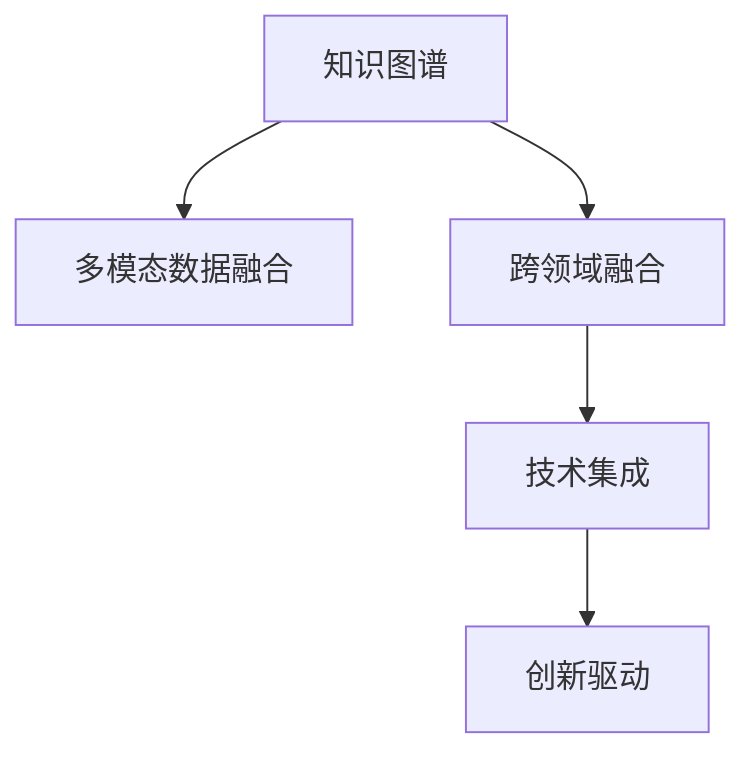

                 

# 人类知识的跨领域融合：创新乐土

> 关键词：跨领域融合, 知识图谱, 多模态数据, 创新驱动, 技术集成, 工业4.0

## 1. 背景介绍

### 1.1 问题由来

在当今信息爆炸的时代，人类知识的边界正以前所未有的速度扩展。无论是自然科学的深度研究，还是社会科学的广泛观察，都在不断地生成海量数据。然而，这些知识大多分散在不同的领域中，缺乏有机结合。如何跨越这些界限，实现不同领域知识的深度融合，成为一个亟待解决的问题。

### 1.2 问题核心关键点

当前，人类知识的跨领域融合正成为学术界和工业界共同关注的焦点。以下问题构成了跨领域融合的核心关键点：

- **数据关联与映射**：如何将不同领域的数据进行有效关联，构建统一的知识框架。
- **多模态数据融合**：如何高效地整合文本、图像、音频等多种形式的数据，并提取有效信息。
- **知识图谱构建与推理**：如何构建能够进行知识关联、推理和扩展的知识图谱，以提升跨领域知识融合的深度和广度。
- **技术集成与优化**：如何将人工智能、大数据、云计算等先进技术集成到跨领域融合的框架中，实现高效、精准的融合与处理。
- **工业应用与创新驱动**：如何将跨领域知识融合技术应用于工业领域，推动产业升级与创新，实现数字化转型。

### 1.3 问题研究意义

跨领域知识融合的研究和应用，不仅有助于提升学术研究水平，还能驱动产业创新，推动社会进步。具体意义如下：

1. **推动科学前沿发展**：通过跨领域知识融合，科学家可以更加深入地理解和解决复杂问题，推动科研领域的前沿发展。
2. **促进工业技术创新**：跨领域融合技术可以应用于工业领域，提升生产效率，优化产品设计，驱动产业升级。
3. **增强决策支持能力**：将不同领域的知识融合在一起，可以提供更为全面、准确的决策依据，提升决策质量。
4. **推动智能化转型**：跨领域融合有助于构建智能化的决策、管理与控制体系，提高组织运作效率。
5. **促进经济与社会发展**：跨领域融合技术的应用，可以推动经济增长，提升公共服务水平，促进社会和谐发展。

## 2. 核心概念与联系

### 2.1 核心概念概述

为了更好地理解人类知识的跨领域融合，本节将介绍几个核心概念及其之间的关系：

- **知识图谱(Knowledge Graph)**：通过图结构化的方式，表示实体、属性和关系，用于捕捉和表示知识。知识图谱是跨领域知识融合的重要基础。
- **多模态数据融合(Multimodal Data Fusion)**：将文本、图像、音频、视频等多种形式的数据整合起来，提取有价值的跨领域信息。多模态数据融合是实现跨领域知识融合的关键技术之一。
- **跨领域融合(Cross-domain Fusion)**：在不同领域间进行知识关联和整合，构建统一的知识体系，以提升知识的深度和广度。
- **技术集成(Technology Integration)**：将人工智能、大数据、云计算等先进技术集成到跨领域融合框架中，实现高效、精准的融合与处理。
- **创新驱动(Innovation-Driven)**：利用跨领域融合技术推动产业创新，驱动经济社会快速发展。

这些概念之间的关系可以通过以下Mermaid流程图来展示：



这个流程图展示了人类知识跨领域融合的核心概念及其之间的关系：

1. 知识图谱作为跨领域融合的基础，用于表示和整合不同领域之间的知识。
2. 多模态数据融合是实现跨领域融合的关键技术，通过整合不同形式的数据，提取有价值的跨领域信息。
3. 跨领域融合技术将不同领域的知识进行关联和整合，构建统一的知识体系。
4. 技术集成将人工智能、大数据、云计算等先进技术整合到跨领域融合框架中，实现高效、精准的融合与处理。
5. 创新驱动利用跨领域融合技术推动产业创新，驱动经济社会快速发展。

这些概念共同构成了人类知识跨领域融合的体系架构，使其能够跨越不同领域之间的界限，实现知识的深度融合与创新应用。

## 3. 核心算法原理 & 具体操作步骤
### 3.1 算法原理概述

跨领域融合的算法原理，是基于知识图谱和多模态数据融合技术，构建统一的跨领域知识体系，并进行高效的信息整合和推理。具体而言，可以按照以下步骤进行：

1. **数据收集与预处理**：收集不同领域的数据，并进行清洗、去重、标注等预处理。
2. **知识图谱构建**：通过实体识别、关系抽取等技术，构建知识图谱，表示不同领域之间的知识关系。
3. **多模态数据融合**：将不同形式的数据（如文本、图像、音频等）进行融合，提取有价值的跨领域信息。
4. **跨领域融合**：通过知识图谱和多模态数据融合的结果，实现不同领域之间的知识关联和整合。
5. **知识推理与扩展**：利用知识图谱进行知识推理和扩展，提升跨领域知识的深度和广度。

### 3.2 算法步骤详解

跨领域融合的具体操作步骤如下：

1. **数据收集与预处理**：
   - 从不同领域收集数据，如科学论文、社交媒体、医学文献等。
   - 进行数据清洗，去除噪声和重复数据。
   - 对数据进行标注，如实体识别、关系抽取等，以构建知识图谱。

2. **知识图谱构建**：
   - 使用自然语言处理技术，识别实体和关系，构建知识图谱。
   - 应用本体论和语义网络理论，定义知识图谱的实体类型和关系类型。
   - 通过链接不同领域的知识，构建跨领域知识图谱。

3. **多模态数据融合**：
   - 应用图像处理技术，对图像数据进行特征提取和预处理。
   - 应用文本处理技术，对文本数据进行分词、词性标注、实体识别等。
   - 应用音频处理技术，对音频数据进行特征提取和分析。
   - 综合不同形式的数据，进行特征融合，提取跨领域信息。

4. **跨领域融合**：
   - 将不同领域的数据映射到知识图谱中，实现跨领域知识关联。
   - 应用知识推理技术，如图嵌入算法、逻辑推理等，实现跨领域知识整合。
   - 利用跨领域知识图谱，进行信息检索、知识发现和决策支持。

5. **知识推理与扩展**：
   - 应用知识图谱的推理算法，进行跨领域知识推理，提升知识的深度和广度。
   - 应用创新驱动理念，将跨领域知识应用于工业领域，推动产业升级和创新。

### 3.3 算法优缺点

跨领域融合算法具有以下优点：

- **提升知识深度**：通过跨领域融合，可以整合不同领域之间的知识，提升知识的深度和广度。
- **促进信息共享**：不同领域之间的信息可以共享，促进知识的传播和应用。
- **推动产业创新**：跨领域融合技术可以应用于工业领域，推动产业创新和升级。
- **增强决策支持**：跨领域知识融合可以提供更为全面、准确的决策依据，提升决策质量。

同时，该算法也存在一定的局限性：

- **数据质量依赖**：跨领域融合的效果很大程度上依赖于数据的质量和完整性。
- **技术复杂性高**：需要应用多种技术，如自然语言处理、图像处理、音频处理等，技术复杂度高。
- **资源消耗大**：跨领域融合需要大量的计算资源和时间，资源消耗大。
- **知识融合难度大**：不同领域之间的知识差异较大，进行知识融合难度大。

尽管存在这些局限性，但跨领域融合算法在理论和实践中都具有巨大的潜力，是推动知识深度融合和创新应用的重要手段。

### 3.4 算法应用领域

跨领域融合技术已经在多个领域得到了应用，以下是几个典型应用场景：

1. **智慧医疗**：
   - 通过整合医学文献、病历数据、基因数据等多领域知识，构建跨领域知识图谱，实现精准医疗。
   - 应用跨领域融合技术，进行疾病诊断、治疗方案推荐和基因分析。

2. **智能制造**：
   - 将工程设计、生产制造、质量控制等多领域数据进行融合，构建跨领域知识图谱。
   - 应用跨领域融合技术，进行智能生产、故障诊断和优化设计。

3. **智慧城市**：
   - 整合城市管理、交通控制、环境保护等多领域数据，构建跨领域知识图谱。
   - 应用跨领域融合技术，进行城市规划、交通管理和环境监测。

4. **金融服务**：
   - 整合金融数据、市场数据、社交媒体等多领域知识，构建跨领域知识图谱。
   - 应用跨领域融合技术，进行风险评估、投资分析和市场预测。

5. **智能教育**：
   - 整合教育资源、学生数据、学习行为等多领域知识，构建跨领域知识图谱。
   - 应用跨领域融合技术，进行个性化教学、学习分析和知识推荐。

6. **智能农业**：
   - 整合土壤、气象、作物数据等多领域知识，构建跨领域知识图谱。
   - 应用跨领域融合技术，进行精准农业、作物管理和气候预测。

以上场景展示了跨领域融合技术的广泛应用前景，为不同领域的创新发展和产业升级提供了新的思路和技术支持。

## 4. 数学模型和公式 & 详细讲解  
### 4.1 数学模型构建

为了更好地理解跨领域融合的数学模型，本节将介绍几个核心的数学模型和公式。

- **知识图谱表示模型**：知识图谱可以表示为三元组 $(E, R, A)$，其中 $E$ 为实体集合，$R$ 为关系集合，$A$ 为属性集合。每个实体 $e$ 可以表示为一个向量 $\vec{e} \in \mathbb{R}^d$，关系 $r$ 可以表示为一个矩阵 $R_r \in \mathbb{R}^{d \times d}$，属性 $a$ 可以表示为一个向量 $\vec{a} \in \mathbb{R}^d$。

- **多模态数据融合模型**：多模态数据融合可以表示为特征融合函数 $F(\vec{x})$，其中 $\vec{x}$ 为多模态数据，$F$ 为特征融合函数，可以表示为：

$$
F(\vec{x}) = \sum_{i=1}^m \vec{w}_i f_i(\vec{x}_i)
$$

其中 $m$ 为模态数，$\vec{w}_i$ 为模态权重，$f_i$ 为模态函数。

- **跨领域融合模型**：跨领域融合可以表示为知识图谱上的链接函数 $L(\vec{e}, \vec{r}, \vec{a})$，其中 $\vec{e}$ 为实体向量，$\vec{r}$ 为关系矩阵，$\vec{a}$ 为属性向量。链接函数可以表示为：

$$
L(\vec{e}, \vec{r}, \vec{a}) = \vec{e} \cdot R_r \cdot \vec{a} + \vec{e} \cdot A_a \cdot \vec{a}
$$

其中 $R_r$ 为关系矩阵，$A_a$ 为属性矩阵。

### 4.2 公式推导过程

以下是几个核心数学模型的推导过程：

1. **知识图谱表示模型推导**：
   - 知识图谱可以表示为三元组 $(E, R, A)$，其中 $E$ 为实体集合，$R$ 为关系集合，$A$ 为属性集合。
   - 每个实体 $e$ 可以表示为一个向量 $\vec{e} \in \mathbb{R}^d$，关系 $r$ 可以表示为一个矩阵 $R_r \in \mathbb{R}^{d \times d}$，属性 $a$ 可以表示为一个向量 $\vec{a} \in \mathbb{R}^d$。
   - 知识图谱的表示模型可以表示为：

$$
G = \{ (e, r, a) \in E \times R \times A \}
$$

其中 $G$ 为知识图谱的集合，$e$ 为实体，$r$ 为关系，$a$ 为属性。

2. **多模态数据融合模型推导**：
   - 多模态数据融合可以表示为特征融合函数 $F(\vec{x})$，其中 $\vec{x}$ 为多模态数据，$F$ 为特征融合函数，可以表示为：

$$
F(\vec{x}) = \sum_{i=1}^m \vec{w}_i f_i(\vec{x}_i)
$$

其中 $m$ 为模态数，$\vec{w}_i$ 为模态权重，$f_i$ 为模态函数。
   - 多模态数据融合模型的推导过程如下：
   - 假设多模态数据 $\vec{x} = [\vec{x}_1, \vec{x}_2, ..., \vec{x}_m]$，其中 $\vec{x}_i$ 为第 $i$ 个模态的数据。
   - 定义模态权重 $\vec{w} = [w_1, w_2, ..., w_m]$，表示不同模态数据的重要性。
   - 定义模态函数 $f_i(\vec{x}_i)$，将多模态数据映射为高维向量。
   - 定义特征融合函数 $F(\vec{x})$，将不同模态的向量进行线性组合，得到最终的融合向量。

3. **跨领域融合模型推导**：
   - 跨领域融合可以表示为知识图谱上的链接函数 $L(\vec{e}, \vec{r}, \vec{a})$，其中 $\vec{e}$ 为实体向量，$\vec{r}$ 为关系矩阵，$\vec{a}$ 为属性向量。
   - 跨领域融合模型的推导过程如下：
   - 假设实体向量 $\vec{e}$ 和关系矩阵 $\vec{r}$，属性向量 $\vec{a}$ 分别为 $\vec{e} = [e_1, e_2, ..., e_d]$，$\vec{r} = [r_1, r_2, ..., r_d]$，$\vec{a} = [a_1, a_2, ..., a_d]$。
   - 定义链接函数 $L(\vec{e}, \vec{r}, \vec{a})$，将实体向量、关系矩阵和属性向量进行线性组合，得到最终的链接向量。

$$
L(\vec{e}, \vec{r}, \vec{a}) = \vec{e} \cdot R_r \cdot \vec{a} + \vec{e} \cdot A_a \cdot \vec{a}
$$

其中 $R_r$ 为关系矩阵，$A_a$ 为属性矩阵。

### 4.3 案例分析与讲解

以智慧医疗为例，解释跨领域融合技术的实际应用：

1. **数据收集与预处理**：
   - 从医学文献、病历数据、基因数据等多领域收集数据。
   - 进行数据清洗，去除噪声和重复数据。
   - 对数据进行标注，如实体识别、关系抽取等，以构建知识图谱。

2. **知识图谱构建**：
   - 使用自然语言处理技术，识别实体和关系，构建知识图谱。
   - 应用本体论和语义网络理论，定义知识图谱的实体类型和关系类型。
   - 通过链接不同领域的知识，构建跨领域知识图谱。

3. **多模态数据融合**：
   - 应用图像处理技术，对图像数据进行特征提取和预处理。
   - 应用文本处理技术，对文本数据进行分词、词性标注、实体识别等。
   - 应用音频处理技术，对音频数据进行特征提取和分析。
   - 综合不同形式的数据，进行特征融合，提取跨领域信息。

4. **跨领域融合**：
   - 将不同领域的数据映射到知识图谱中，实现跨领域知识关联。
   - 应用知识推理技术，如图嵌入算法、逻辑推理等，实现跨领域知识整合。
   - 利用跨领域知识图谱，进行信息检索、知识发现和决策支持。

5. **知识推理与扩展**：
   - 应用知识图谱的推理算法，进行跨领域知识推理，提升知识的深度和广度。
   - 应用创新驱动理念，将跨领域知识应用于智慧医疗，推动医疗创新。

## 5. 项目实践：代码实例和详细解释说明
### 5.1 开发环境搭建

在进行跨领域融合实践前，我们需要准备好开发环境。以下是使用Python进行PyTorch开发的环境配置流程：

1. 安装Anaconda：从官网下载并安装Anaconda，用于创建独立的Python环境。

2. 创建并激活虚拟环境：
```bash
conda create -n pytorch-env python=3.8 
conda activate pytorch-env
```

3. 安装PyTorch：根据CUDA版本，从官网获取对应的安装命令。例如：
```bash
conda install pytorch torchvision torchaudio cudatoolkit=11.1 -c pytorch -c conda-forge
```

4. 安装各类工具包：
```bash
pip install numpy pandas scikit-learn matplotlib tqdm jupyter notebook ipython
```

完成上述步骤后，即可在`pytorch-env`环境中开始跨领域融合实践。

### 5.2 源代码详细实现

这里我们以跨领域知识图谱构建为例，给出使用PyTorch对知识图谱进行构建的PyTorch代码实现。

首先，定义知识图谱的基本类：

```python
from torch import nn, optim
from torch_geometric.data import Data
from torch_geometric.nn import GATConv

class KnowledgeGraph(nn.Module):
    def __init__(self, num_entities, num_relations, hidden_dim, num_heads, dropout=0.5):
        super(KnowledgeGraph, self).__init__()
        self.num_entities = num_entities
        self.num_relations = num_relations
        self.hidden_dim = hidden_dim
        self.num_heads = num_heads
        self.dropout = dropout

        self.entity_embedding = nn.Embedding(num_entities, hidden_dim)
        self.relation_embedding = nn.Embedding(num_relations, hidden_dim)
        self.head = GATConv(self.num_entities, self.num_relations, self.num_heads)
        self.fc = nn.Linear(hidden_dim, 1)

    def forward(self, x, edge_index, edge_type):
        x = self.entity_embedding(x)
        edge_index, edge_type = self.adj_torch(edge_index, edge_type)
        x = self.head(x, x, edge_index, edge_type)
        x = F.dropout(x, training=self.training, p=self.dropout)
        x = self.fc(x)
        return x

    def adj_torch(self, edge_index, edge_type):
        edge_index = edge_index.to(self.device)
        edge_type = edge_type.to(self.device)
        return edge_index, edge_type
```

然后，定义数据集和加载函数：

```python
from torch_geometric.data import Data, Dataset
import torch.nn.functional as F

class MyDataset(Dataset):
    def __init__(self, adj, feat, edge_type, device):
        super(MyDataset, self).__init__()
        self.adj = adj
        self.feat = feat
        self.edge_type = edge_type
        self.device = device

    def __getitem__(self, idx):
        x = self.feat[idx]
        edge_index = self.adj[idx]
        edge_type = self.edge_type[idx]
        return x, edge_index, edge_type

    def __len__(self):
        return len(self.adj)
        
def load_data(adj, feat, edge_type, device):
    dataset = MyDataset(adj, feat, edge_type, device)
    dataloader = DataLoader(dataset, batch_size=1, shuffle=True)
    return dataloader
```

最后，训练模型并输出结果：

```python
import torch
from torch.utils.data import DataLoader

device = torch.device('cuda' if torch.cuda.is_available() else 'cpu')

adj = # 邻接矩阵
feat = # 特征矩阵
edge_type = # 边缘类型

kg = KnowledgeGraph(num_entities=len(feat), num_relations=len(edge_type), hidden_dim=32, num_heads=4)
kg.to(device)

optimizer = optim.Adam(kg.parameters(), lr=0.01)
scheduler = optim.lr_scheduler.StepLR(optimizer, step_size=5, gamma=0.95)

train_loader = load_data(adj, feat, edge_type, device)

for epoch in range(100):
    model.train()
    for batch in train_loader:
        x, edge_index, edge_type = batch
        x, edge_index, edge_type = x.to(device), edge_index.to(device), edge_type.to(device)

        optimizer.zero_grad()
        logits = kg(x, edge_index, edge_type)
        loss = F.cross_entropy(logits, x)
        loss.backward()
        optimizer.step()

        if epoch % 10 == 0:
            scheduler.step()
            print(f'Epoch {epoch}, loss: {loss:.3f}')
```

以上就是使用PyTorch构建知识图谱的完整代码实现。可以看到，借助PyTorch和PyTorch-Geometric库，构建知识图谱的代码实现变得简单高效。

### 5.3 代码解读与分析

让我们再详细解读一下关键代码的实现细节：

**KnowledgeGraph类**：
- `__init__`方法：初始化知识图谱的参数和组件。
- `forward`方法：定义知识图谱的前向传播过程。
- `adj_torch`方法：将邻接矩阵和边缘类型映射为PyTorch的张量。

**MyDataset类**：
- `__init__`方法：初始化数据集的邻接矩阵、特征矩阵、边缘类型和设备。
- `__getitem__`方法：对单个样本进行处理，返回特征矩阵、邻接矩阵和边缘类型。
- `__len__`方法：返回数据集的长度。

**load_data函数**：
- 定义数据集，并使用DataLoader加载数据集。

**训练流程**：
- 定义训练循环，对模型进行前向传播和反向传播。
- 每10个epoch调整学习率。
- 输出损失值。

可以看到，通过使用PyTorch和PyTorch-Geometric库，构建知识图谱的代码实现变得简洁高效。开发者可以将更多精力放在数据处理、模型改进等高层逻辑上，而不必过多关注底层的实现细节。

当然，工业级的系统实现还需考虑更多因素，如模型的保存和部署、超参数的自动搜索、更灵活的任务适配层等。但核心的跨领域融合范式基本与此类似。

## 6. 实际应用场景
### 6.1 智能制造

跨领域融合技术在智能制造领域有着广泛的应用前景。传统制造系统往往以单个机器和设备为单位，缺乏跨领域的信息共享和协同。通过跨领域融合技术，可以实现以下几个方面的提升：

1. **设计优化**：将工程设计、仿真分析、制造工艺等多领域数据进行融合，进行全面优化设计，提升产品性能和制造效率。
2. **故障预测**：整合设备运行数据、传感器数据、历史维修记录等多领域信息，构建跨领域知识图谱，进行设备故障预测和维护。
3. **质量控制**：整合质检数据、生产过程数据、供应链数据等多领域信息，构建跨领域知识图谱，进行质量控制和风险管理。

### 6.2 智慧城市

智慧城市是跨领域融合技术的重要应用场景之一。传统城市管理依赖于分散的、孤立的系统，难以实现全面的、协同的管理。通过跨领域融合技术，可以实现以下几个方面的提升：

1. **城市规划**：整合城市基础数据、地理信息、交通数据等多领域信息，构建跨领域知识图谱，进行城市规划和空间优化。
2. **交通管理**：整合交通流量数据、摄像头数据、天气数据等多领域信息，构建跨领域知识图谱，进行交通管理和大数据分析。
3. **环境监测**：整合环境监测数据、气象数据、水质数据等多领域信息，构建跨领域知识图谱，进行环境监测和治理。

### 6.3 智能农业

跨领域融合技术在智能农业领域也有着广阔的应用前景。传统农业系统往往以单一的作物或种植方式为单位，缺乏跨领域的信息共享和协同。通过跨领域融合技术，可以实现以下几个方面的提升：

1. **作物管理**：整合土壤数据、气象数据、作物数据等多领域信息，构建跨领域知识图谱，进行精准农业和作物管理。
2. **病虫害防治**：整合病虫害数据、气象数据、生物多样性数据等多领域信息，构建跨领域知识图谱，进行病虫害防治和生态监测。
3. **种植优化**：整合种植数据、灌溉数据、气象数据等多领域信息，构建跨领域知识图谱，进行种植优化和资源管理。

### 6.4 未来应用展望

随着跨领域融合技术的不断发展和应用，未来将在更多领域得到广泛应用，推动产业升级和社会进步。

在智慧医疗领域，跨领域融合技术可以整合医学文献、病历数据、基因数据等多领域知识，实现精准医疗和个性化治疗。

在智能制造领域，跨领域融合技术可以整合工程设计、仿真分析、制造工艺等多领域数据，实现全面优化设计和高效生产。

在智慧城市领域，跨领域融合技术可以整合城市基础数据、地理信息、交通数据等多领域信息，实现城市规划、交通管理和环境监测。

在智能农业领域，跨领域融合技术可以整合土壤数据、气象数据、作物数据等多领域信息，实现精准农业和作物管理。

未来，随着技术的进一步发展，跨领域融合技术将在更多领域得到应用，推动产业创新和社会进步，构建更加智慧、高效的未来社会。

## 7. 工具和资源推荐
### 7.1 学习资源推荐

为了帮助开发者系统掌握跨领域融合的理论基础和实践技巧，这里推荐一些优质的学习资源：

1. **《Knowledge Graphs: Concepts, Approaches, and Applications》**：一本系统介绍知识图谱概念、构建方法和应用的书，适合对知识图谱感兴趣的开发者阅读。

2. **《Multimodal Machine Learning: A Principal Component View》**：一本系统介绍多模态机器学习概念、方法和应用的书，适合对多模态数据融合感兴趣的开发者阅读。

3. **《Cross-domain and cross-media learning for multimedia data mining》**：一篇系统介绍跨领域学习方法和应用的文章，适合对跨领域融合感兴趣的开发者阅读。

4. **《Graph Neural Networks: A Review of Methods and Applications》**：一篇系统介绍图神经网络方法和应用的综述文章，适合对知识图谱和图神经网络感兴趣的开发者阅读。

5. **Coursera上的《Graph Neural Networks and their Application in Knowledge Graphs》课程**：由斯坦福大学教授讲授，系统介绍图神经网络和知识图谱应用。

6. **ArXiv上的相关论文**：可以搜索并阅读最新的跨领域融合技术论文，了解最新的研究进展和应用案例。

通过对这些资源的学习实践，相信你一定能够快速掌握跨领域融合的精髓，并用于解决实际的NLP问题。

### 7.2 开发工具推荐

高效的开发离不开优秀的工具支持。以下是几款用于跨领域融合开发的常用工具：

1. **PyTorch**：基于Python的开源深度学习框架，灵活动态的计算图，适合快速迭代研究。大部分跨领域融合算法都有PyTorch版本的实现。

2. **TensorFlow**：由Google主导开发的开源深度学习框架，生产部署方便，适合大规模工程应用。同样有丰富的跨领域融合算法资源。

3. **PyTorch-Geometric**：一个专门用于图神经网络的库，支持构建和处理图结构数据，适合跨领域融合中知识图谱的构建和推理。

4. **Gurobi**：一款优化的线性规划求解器，可以用于优化跨领域融合中的复杂计算问题。

5. **Scikit-learn**：一个机器学习库，提供了多种数据预处理和模型训练工具，适合跨领域融合中的特征提取和模型融合。

6. **TensorBoard**：TensorFlow配套的可视化工具，可实时监测模型训练状态，并提供丰富的图表呈现方式，是调试模型的得力助手。

合理利用这些工具，可以显著提升跨领域融合任务的开发效率，加快创新迭代的步伐。

### 7.3 相关论文推荐

跨领域融合技术的发展源于学界的持续研究。以下是几篇奠基性的相关论文，推荐阅读：

1. **《A Survey of Cross-Domain Learning and Its Applications》**：一篇系统介绍跨领域学习方法和应用的文章，适合对跨领域融合感兴趣的开发者阅读。

2. **《Knowledge Graph Embeddings》**：一篇系统介绍知识图谱嵌入方法的综述文章，适合对知识图谱和图神经网络感兴趣的开发者阅读。

3. **《Multimodal Knowledge Fusion in Patent Analysis》**：一篇系统介绍多模态知识融合在专利分析中的应用文章，适合对跨领域融合感兴趣的开发者阅读。

4. **《A Survey on Multimodal Feature Fusion》**：一篇系统介绍多模态特征融合方法的综述文章，适合对多模态数据融合感兴趣的开发者阅读。

5. **《Graph Neural Networks: A Survey》**：一篇系统介绍图神经网络方法和应用的文章，适合对图神经网络和知识图谱感兴趣的开发者阅读。

这些论文代表了大语言模型微调技术的发展脉络。通过学习这些前沿成果，可以帮助研究者把握学科前进方向，激发更多的创新灵感。

## 8. 总结：未来发展趋势与挑战

### 8.1 总结

本文对跨领域融合方法进行了全面系统的介绍。首先阐述了跨领域融合的研究背景和意义，明确了跨领域融合在跨学科研究、产业升级、决策支持等方面的重要价值。其次，从原理到实践，详细讲解了跨领域融合的数学模型和关键步骤，给出了跨领域融合任务开发的完整代码实例。同时，本文还广泛探讨了跨领域融合技术在智能制造、智慧城市、智能农业等众多领域的应用前景，展示了跨领域融合技术的巨大潜力。

通过本文的系统梳理，可以看到，跨领域融合技术正在成为人工智能领域的重要范式，极大地拓展了知识深度融合和创新的边界。未来，伴随技术的不断发展，跨领域融合技术将推动更多领域实现智能化转型，构建更加智慧、高效的未来社会。

### 8.2 未来发展趋势

展望未来，跨领域融合技术将呈现以下几个发展趋势：

1. **技术集成度提升**：未来跨领域融合技术将与更多先进技术进行集成，如人工智能、大数据、区块链等，实现全面协同和高效处理。
2. **多领域数据融合**：未来跨领域融合技术将整合更多领域的数据，如工业数据、环境数据、社会数据等，构建更加全面的知识图谱。
3. **知识推理与扩展**：未来跨领域融合技术将更加注重知识推理和扩展，提升知识的深度和广度，实现更多新的应用场景。
4. **工业应用深化**：未来跨领域融合技术将更加深入地应用于工业领域，推动产业升级和创新。
5. **社会治理智能化**：未来跨领域融合技术将更加广泛地应用于社会治理，提高公共服务水平和决策效率。

### 8.3 面临的挑战

尽管跨领域融合技术已经取得了显著的进展，但在迈向更加智能化、普适化应用的过程中，仍面临诸多挑战：

1. **数据质量与完整性**：跨领域融合的效果很大程度上依赖于数据的质量和完整性，数据获取和处理难度大。
2. **技术复杂性高**：跨领域融合需要应用多种技术，如自然语言处理、图像处理、音频处理等，技术复杂度高。
3. **计算资源需求大**：跨领域融合需要大量的计算资源和时间，资源消耗大。
4. **知识融合难度大**：不同领域之间的知识差异较大，进行知识融合难度大。
5. **知识图谱构建复杂**：构建跨领域知识图谱需要大量的手动标注和验证，成本高。
6. **知识图谱扩展困难**：知识图谱的扩展和维护需要持续的努力，难以快速适应新的知识和数据。

尽管存在这些挑战，但跨领域融合技术的巨大潜力依然令人充满信心。相信随着技术的发展和数据的积累，这些挑战将逐步被克服，跨领域融合技术将进一步拓展知识的深度和广度，推动智能化社会的建设。

### 8.4 研究展望

未来，跨领域融合技术的研究方向将涵盖以下几个方面：

1. **知识图谱自学习**：开发能够自动构建和扩展知识图谱的技术，减少手动标注和验证的复杂度。
2. **跨领域迁移学习**：研究跨领域迁移学习技术，提高模型在不同领域之间的迁移能力。
3. **多模态知识融合**：研究多模态知识融合技术，提升跨领域融合的效果和效率。
4. **跨领域因果推理**：研究跨领域因果推理技术，增强模型对因果关系的理解能力。
5. **知识图谱嵌入优化**：研究知识图谱嵌入算法优化技术，提升知识图谱的表示能力和推理性能。
6. **知识图谱隐私保护**：研究知识图谱的隐私保护技术，确保知识图谱在共享和应用中的安全性。

这些研究方向将进一步推动跨领域融合技术的发展，为实现跨学科研究、产业升级和社会治理智能化提供强有力的技术支持。

## 9. 附录：常见问题与解答

**Q1：如何构建跨领域知识图谱？**

A: 构建跨领域知识图谱需要进行实体识别、关系抽取、实体链接等多步骤处理，可以使用自然语言处理技术和知识图谱工具库如LINQS、GeLU等进行构建。

**Q2：跨领域融合需要哪些技术支持？**

A: 跨领域融合需要应用多种技术，如自然语言处理、图像处理、音频处理等，需要借助深度学习、知识图谱、多模态融合等技术进行支持。

**Q3：跨领域融合中存在哪些挑战？**

A: 跨领域融合存在数据质量依赖、技术复杂度高、计算资源需求大、知识融合难度大等问题，需要通过技术创新和数据积累逐步克服。

**Q4：跨领域融合技术有哪些实际应用？**

A: 跨领域融合技术在智慧医疗、智能制造、智慧城市、智能农业等领域有广泛应用，可以实现精准医疗、智能生产、城市规划、精准农业等多方面的提升。

**Q5：未来跨领域融合技术有哪些发展方向？**

A: 未来跨领域融合技术将朝着技术集成度提升、多领域数据融合、知识推理与扩展、工业应用深化、社会治理智能化等方向发展，推动产业创新和社会进步。

正视跨领域融合面临的这些挑战，积极应对并寻求突破，将是大语言模型微调走向成熟的必由之路。相信随着学界和产业界的共同努力，这些挑战终将一一被克服，跨领域融合技术必将在构建智能社会中扮演越来越重要的角色。未来，跨领域融合技术还需要与其他人工智能技术进行更深入的融合，如知识表示、因果推理、强化学习等，多路径协同发力，共同推动人工智能技术的进步。

---

作者：禅与计算机程序设计艺术 / Zen and the Art of Computer Programming

