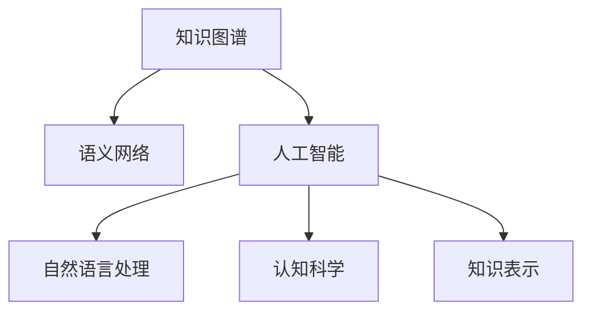

                 

# 人类知识的进步：一场跨越时空的对话

> 关键词：知识图谱, 语义网络, 人工智能, 自然语言处理, 认知科学, 知识表示

## 1. 背景介绍

### 1.1 问题由来

随着人工智能（AI）技术的迅猛发展，知识图谱（Knowledge Graphs）作为其中的一环，逐渐成为构建智能系统的重要基础。知识图谱是一种语义化的结构化知识表示方式，旨在通过图结构描述实体、属性和关系之间的复杂关联。其核心价值在于，将人类知识转换为机器可理解的形式，从而支撑智能查询、推荐、推理等各类应用场景。

然而，知识图谱的构建并不是一件易事。首先，需要大量的人工标注和数据准备，其成本极高。其次，现有知识图谱通常局限于特定领域，缺乏跨领域泛化能力。再者，如何有效地融合语义知识和多源数据，实现知识图谱的动态更新和演进，也是一大难题。

本文旨在探讨知识图谱的原理与技术，并介绍其在实际应用中的具体实践，力求为读者提供一场跨越时空的知识对话。

## 2. 核心概念与联系

### 2.1 核心概念概述

为了更好地理解知识图谱及其相关技术，首先需要明确几个关键概念：

- **知识图谱（Knowledge Graphs）**：由节点（实体）和边（关系）构成的语义化图结构，用于表示实体、属性和关系之间的复杂关联。知识图谱的核心价值在于其语义化特性，能够精确表达实体之间的关系，支持复杂推理和查询。

- **语义网络（Semantic Networks）**：一种基于图结构的语义表示方式，通过节点和边的方式表达实体和关系。语义网络与知识图谱紧密相关，是知识图谱的早期形态。

- **人工智能（AI）**：一种模仿人类智能行为的技术，包括机器学习、深度学习、自然语言处理等。知识图谱在AI领域中，尤其是智能问答、推荐系统、智能搜索等应用中，扮演着重要角色。

- **认知科学（Cognitive Science）**：研究人类智能和认知过程的跨学科领域，涉及心理学、神经科学、计算机科学等多个方向。知识图谱的构建和应用，深刻反映了人类对知识表征和推理的认知理解。

- **知识表示（Knowledge Representation）**：将知识转换为计算机可理解的形式，以便于机器处理和应用。知识图谱是一种重要的知识表示方法，通过图结构表达知识。

这些核心概念之间的联系可通过以下Mermaid流程图来展示：



这个流程图展示了知识图谱与其相关技术之间的关系：

1. 知识图谱基于语义网络构建，通过图结构表达知识。
2. 知识图谱在人工智能领域中应用广泛，尤其是在自然语言处理和认知科学中，是构建智能系统的重要基础。
3. 知识图谱也是一种重要的知识表示方法，通过图结构精准地表达实体和关系。

## 3. 核心算法原理 & 具体操作步骤

### 3.1 算法原理概述

知识图谱的构建通常包括以下几个核心步骤：

1. **数据收集与预处理**：收集各领域的结构化数据，进行清洗和标准化，去除噪声和冗余。
2. **实体识别与关系抽取**：从文本数据中自动抽取实体和关系，构建初步的知识图谱。
3. **图结构建模**：将抽取的实体和关系，通过图结构进行建模，形成语义化的知识表示。
4. **知识融合与演化**：通过规则或算法，融合多源异构数据，实现知识的动态更新和演化。
5. **知识推理与查询**：构建推理引擎，支持复杂的知识查询和推理任务，实现智能问答、推荐等应用。

这些步骤通常通过深度学习和自然语言处理技术实现。核心算法原理主要涉及以下三个方面：

1. **图结构建模**：将实体和关系通过图结构进行建模，形成语义化的知识表示。
2. **关系抽取与表示**：从文本中自动抽取实体和关系，并构建关系图，将知识转换为结构化的形式。
3. **知识融合与推理**：通过规则和算法，实现知识图谱的动态更新和演化，支持复杂的推理任务。

### 3.2 算法步骤详解

接下来，我们详细介绍知识图谱构建的详细步骤：

**Step 1: 数据收集与预处理**

- 从不同领域的数据源（如数据库、百科、网页等）收集结构化数据。
- 对数据进行清洗和标准化，去除噪声和冗余，如去除重复记录、规范化数据格式等。

**Step 2: 实体识别与关系抽取**

- 使用命名实体识别（NER）和关系抽取（Relation Extraction, RE）技术，从文本中自动抽取实体和关系。
- 对抽取的实体和关系进行验证和过滤，如使用知识库进行匹配和纠错。

**Step 3: 图结构建模**

- 构建图结构，将实体和关系通过边连接起来，形成语义化的知识表示。
- 定义实体类型和关系类型，描述实体和关系的属性和语义。

**Step 4: 知识融合与演化**

- 使用知识融合技术，如知识对齐、跨领域融合等，将多源异构数据融合到一个知识图谱中。
- 构建动态更新机制，支持知识的演化，如引入新的实体和关系，删除过时的知识等。

**Step 5: 知识推理与查询**

- 构建推理引擎，支持复杂的知识查询和推理任务，如基于图结构的SPARQL查询。
- 使用逻辑推理规则和机器学习算法，支持推理任务的实现，如基于图结构的事实推理、因果推理等。

### 3.3 算法优缺点

知识图谱的构建算法具有以下优点：

1. **语义化表示**：通过图结构精确表达实体和关系之间的复杂关联，支持复杂的推理和查询任务。
2. **可扩展性**：知识图谱可以动态更新和演化，支持多源异构数据的融合和演化。
3. **跨领域泛化**：通过跨领域融合技术，构建通用的知识图谱，支持多领域的知识应用。

同时，这些算法也存在一些缺点：

1. **高成本**：知识图谱的构建需要大量的人工标注和数据准备，成本较高。
2. **数据稀疏**：现有知识图谱通常局限于特定领域，缺乏跨领域泛化能力。
3. **复杂性**：知识图谱构建和应用的复杂性较高，需要深度学习、自然语言处理等多领域技术支持。

### 3.4 算法应用领域

知识图谱在多个领域中得到了广泛应用，以下是几个典型的应用场景：

- **智能问答系统**：基于知识图谱构建问答系统，能够理解自然语言问题并给出精确的回答。
- **推荐系统**：利用知识图谱进行实体关系推理，实现个性化推荐。
- **搜索引擎**：将知识图谱与传统搜索技术结合，实现更智能的搜索体验。
- **医疗知识图谱**：用于医学领域知识表示和推理，辅助医生诊疗。
- **金融知识图谱**：用于金融领域知识表示和推理，辅助金融决策。

## 4. 数学模型和公式 & 详细讲解 & 举例说明

### 4.1 数学模型构建

知识图谱的构建可以通过数学模型进行描述。我们以一个简单的三元组图为例，定义如下：

- **实体（Entity）**：知识图谱中的节点，表示一个具体的概念或对象。
- **关系（Relation）**：知识图谱中的边，表示实体之间的关联。
- **属性（Attribute）**：实体的特征或属性，如名称、类型等。

知识图谱的数学模型通常表示为一个三元组图，记为$G=(E, R, S)$，其中$E$为实体集合，$R$为关系集合，$S$为三元组集合。三元组表示为$(s, p, o)$，其中$s$为源实体，$p$为关系，$o$为目标实体。

### 4.2 公式推导过程

接下来，我们通过数学公式详细讲解知识图谱的构建过程。

**公式1: 实体识别与关系抽取**

设文本数据为$D=\{x_1, x_2, ..., x_n\}$，实体识别模型为$M_{NER}$，关系抽取模型为$M_{RE}$。定义实体抽取函数为$E^*(x)=(E^*_{1}(x), E^*_{2}(x), ..., E^*_{n}(x))$，其中$E^*_i(x)$表示文本$x_i$中抽取的实体。关系抽取函数为$R^*(x)=(R^*_{1}(x), R^*_{2}(x), ..., R^*_{n}(x))$，其中$R^*_i(x)$表示文本$x_i$中抽取的关系。

**公式2: 图结构建模**

设知识图谱为$G=(E, R, S)$，定义图结构建模函数为$M_{KG}$，将抽取的实体和关系进行图结构建模，得到最终的的知识图谱$G$。

**公式3: 知识融合与演化**

设知识图谱$G_1=(E_1, R_1, S_1)$和$G_2=(E_2, R_2, S_2)$，定义知识融合函数为$F_{KG}$，将$G_1$和$G_2$融合为一个新的知识图谱$G'$，即$G'=(E', R', S')$，其中$E'=F_{E_1, E_2}$，$R'=F_{R_1, R_2}$，$S'=F_{S_1, S_2}$。

**公式4: 知识推理与查询**

设知识图谱$G=(E, R, S)$，定义推理引擎$E_{KG}$，通过推理引擎实现复杂的知识查询和推理任务。

### 4.3 案例分析与讲解

我们以智能问答系统为例，详细讲解知识图谱的应用。

**案例1: 智能问答系统的构建**

智能问答系统通常由知识图谱和问答模型构成。知识图谱提供领域知识，问答模型则根据问题进行推理和查询。假设领域知识图谱$G=(E, R, S)$，问答模型为$M_{QA}$。

1. **实体识别与关系抽取**：通过命名实体识别和关系抽取技术，从用户提问中抽取实体和关系。
2. **图结构建模**：将抽取的实体和关系进行图结构建模，得到领域知识图谱$G$。
3. **问答推理**：将用户问题转化为图结构查询，通过推理引擎$E_{KG}$在知识图谱$G$中进行推理，得到答案。
4. **回答生成**：根据推理结果，生成自然语言回答，返回给用户。

**案例2: 推荐系统的知识图谱构建**

推荐系统通常使用知识图谱进行实体关系推理，实现个性化推荐。假设推荐系统知识图谱为$G=(E, R, S)$，推荐算法为$M_{RS}$。

1. **实体识别与关系抽取**：从用户行为数据中抽取实体和关系。
2. **图结构建模**：将抽取的实体和关系进行图结构建模，得到推荐系统知识图谱$G$。
3. **知识推理与查询**：通过推理引擎$E_{KG}$在知识图谱$G$中进行推理，得到推荐结果。
4. **推荐生成**：根据推理结果，生成个性化推荐，返回给用户。

## 5. 项目实践：代码实例和详细解释说明

### 5.1 开发环境搭建

在进行知识图谱实践前，我们需要准备好开发环境。以下是使用Python进行PyTorch开发的环境配置流程：

1. 安装Anaconda：从官网下载并安装Anaconda，用于创建独立的Python环境。

2. 创建并激活虚拟环境：
```bash
conda create -n pytorch-env python=3.8 
conda activate pytorch-env
```

3. 安装PyTorch：根据CUDA版本，从官网获取对应的安装命令。例如：
```bash
conda install pytorch torchvision torchaudio cudatoolkit=11.1 -c pytorch -c conda-forge
```

4. 安装各类工具包：
```bash
pip install numpy pandas scikit-learn matplotlib tqdm jupyter notebook ipython
```

完成上述步骤后，即可在`pytorch-env`环境中开始知识图谱的构建实践。

### 5.2 源代码详细实现

下面我们以构建一个简单的知识图谱为例，给出使用PyTorch进行图结构建模的PyTorch代码实现。

首先，定义知识图谱的数据结构：

```python
from pykglearn import KnowledgeGraph

# 定义节点和边
node0 = {'id': 0, 'type': 'Person', 'name': 'Alice'}
node1 = {'id': 1, 'type': 'Company', 'name': 'Amazon'}
edge0 = {'source': 0, 'relation': 'works_for', 'target': 1}

# 创建知识图谱
kg = KnowledgeGraph()
kg.add_node(node0)
kg.add_node(node1)
kg.add_edge(edge0)
```

然后，构建知识图谱的推理引擎：

```python
from pykglearn import NeuralOwlReasoner

# 创建推理引擎
reasoner = NeuralOwlReasoner(kg)

# 推理查询
result = reasoner.ask_query('Alice works for which company?')
print(result)
```

最后，测试推理结果：

```python
# 执行推理查询
result = reasoner.ask_query('Alice works for which company?')
print(result)
```

以上就是使用PyTorch构建知识图谱的完整代码实现。可以看到，PyTorch提供了丰富的图结构建模和推理功能，开发者可以轻松实现知识图谱的构建和推理。

### 5.3 代码解读与分析

让我们再详细解读一下关键代码的实现细节：

**KG类**：
- `add_node`方法：用于添加节点，包括实体类型、属性等。
- `add_edge`方法：用于添加边，表示实体之间的关系。

**NeuralOwlReasoner类**：
- `__init__`方法：初始化推理引擎，连接知识图谱和推理器。
- `ask_query`方法：执行推理查询，返回查询结果。

**推理过程**：
- 首先，通过`add_node`和`add_edge`方法构建知识图谱。
- 然后，通过`NeuralOwlReasoner`类创建推理引擎，连接知识图谱。
- 最后，通过`ask_query`方法执行推理查询，输出结果。

可以看到，PyTorch提供的知识图谱构建和推理功能十分强大，可以轻松实现知识图谱的构建和应用。

## 6. 实际应用场景

### 6.1 智能问答系统

智能问答系统基于知识图谱构建，能够理解自然语言问题，并给出精确的回答。例如，百度、阿里等公司的智能客服系统，通过知识图谱实现了自动回答常见问题，极大地提升了客户体验和服务效率。

在技术实现上，可以收集领域知识，构建领域知识图谱，并将其与自然语言处理技术结合，实现智能问答系统。具体步骤如下：

1. **领域知识收集**：收集领域内的实体、关系和属性，构建领域知识图谱。
2. **实体识别与关系抽取**：通过自然语言处理技术，自动抽取用户问题中的实体和关系。
3. **图结构建模**：将抽取的实体和关系进行图结构建模，形成领域知识图谱。
4. **问答推理**：通过推理引擎，在知识图谱中进行推理，得到答案。
5. **回答生成**：根据推理结果，生成自然语言回答，返回给用户。

**案例1: 智能问答系统的构建**

智能问答系统通常由知识图谱和问答模型构成。知识图谱提供领域知识，问答模型则根据问题进行推理和查询。假设领域知识图谱$G=(E, R, S)$，问答模型为$M_{QA}$。

1. **实体识别与关系抽取**：通过命名实体识别和关系抽取技术，从用户提问中抽取实体和关系。
2. **图结构建模**：将抽取的实体和关系进行图结构建模，得到领域知识图谱$G$。
3. **问答推理**：将用户问题转化为图结构查询，通过推理引擎$E_{KG}$在知识图谱$G$中进行推理，得到答案。
4. **回答生成**：根据推理结果，生成自然语言回答，返回给用户。

### 6.2 推荐系统

推荐系统利用知识图谱进行实体关系推理，实现个性化推荐。例如，京东、美团等电商平台的个性化推荐系统，通过知识图谱实现了商品推荐，提升了用户购买体验。

在技术实现上，可以收集用户行为数据，构建推荐系统知识图谱，并将其与推理算法结合，实现个性化推荐。具体步骤如下：

1. **实体识别与关系抽取**：从用户行为数据中抽取实体和关系。
2. **图结构建模**：将抽取的实体和关系进行图结构建模，得到推荐系统知识图谱$G$。
3. **知识推理与查询**：通过推理引擎$E_{KG}$在知识图谱$G$中进行推理，得到推荐结果。
4. **推荐生成**：根据推理结果，生成个性化推荐，返回给用户。

**案例2: 推荐系统的知识图谱构建**

推荐系统通常使用知识图谱进行实体关系推理，实现个性化推荐。假设推荐系统知识图谱为$G=(E, R, S)$，推荐算法为$M_{RS}$。

1. **实体识别与关系抽取**：从用户行为数据中抽取实体和关系。
2. **图结构建模**：将抽取的实体和关系进行图结构建模，得到推荐系统知识图谱$G$。
3. **知识推理与查询**：通过推理引擎$E_{KG}$在知识图谱$G$中进行推理，得到推荐结果。
4. **推荐生成**：根据推理结果，生成个性化推荐，返回给用户。

## 7. 工具和资源推荐

### 7.1 学习资源推荐

为了帮助开发者系统掌握知识图谱的理论基础和实践技巧，这里推荐一些优质的学习资源：

1. **《知识图谱》（王冠英著）**：系统讲解了知识图谱的基本概念、构建技术和应用案例，适合初学者入门。
2. **Coursera《知识图谱导论》**：斯坦福大学开设的在线课程，介绍了知识图谱的基本原理和应用场景。
3. **ArXiv上的知识图谱论文**：最新的知识图谱研究论文，涵盖多个领域的技术创新和应用实践。
4. **Google Dataset Explorer**：谷歌提供的各种数据集，包括知识图谱数据集，适合数据分析和知识图谱构建。

通过对这些资源的学习实践，相信你一定能够快速掌握知识图谱的精髓，并用于解决实际的NLP问题。

### 7.2 开发工具推荐

高效的开发离不开优秀的工具支持。以下是几款用于知识图谱构建开发的常用工具：

1. **PyTorch**：基于Python的开源深度学习框架，灵活动态的计算图，适合快速迭代研究。大部分知识图谱构建和推理任务都有PyTorch版本的实现。
2. **TensorFlow**：由Google主导开发的开源深度学习框架，生产部署方便，适合大规模工程应用。同样有丰富的知识图谱构建和推理资源。
3. **PyKGlearn**：基于TensorFlow和PyTorch的知识图谱构建和推理工具，提供丰富的模型和推理算法。
4. **GraphSAGE**：用于图结构学习的框架，适合构建知识图谱中的实体关系推理模型。
5. **Neo4j**：企业级的图数据库，适合存储和查询大规模知识图谱。

合理利用这些工具，可以显著提升知识图谱构建和推理的开发效率，加快创新迭代的步伐。

### 7.3 相关论文推荐

知识图谱和自然语言处理领域的快速发展，催生了大量的前沿研究成果。以下是几篇奠基性的相关论文，推荐阅读：

1. **Knowledge Graphs: A First Principles Approach**：由Franco Pezzini和Lorenzo Nati等人合著，系统讲解了知识图谱的基本概念和构建技术。
2. **Link Prediction and Modeling**：由Jure Leskovec和Jonathan Katz等人合著，讲解了知识图谱中的实体关系推理方法。
3. **A Survey on Knowledge Graph Embedding**：由Yoshua Bengio和Yann LeCun等人合著，介绍了知识图谱中的嵌入表示方法。
4. **Dual Graph Neural Network for Knowledge Graph Reasoning**：提出了基于图神经网络的实体关系推理模型，提升了推理效果。
5. **Knowledge Graph Induction and Completion Using Graph Neural Networks**：提出基于图神经网络的知识图谱诱导和补全方法，提升了知识图谱的完整性和准确性。

这些论文代表了大语言模型微调技术的发展脉络。通过学习这些前沿成果，可以帮助研究者把握学科前进方向，激发更多的创新灵感。

## 8. 总结：未来发展趋势与挑战

### 8.1 研究成果总结

本文对知识图谱的原理与技术进行了全面系统的介绍。首先，阐述了知识图谱在人工智能中的重要地位和应用场景，明确了知识图谱在构建智能系统中的核心价值。其次，从原理到实践，详细讲解了知识图谱的构建过程，包括数据收集与预处理、实体识别与关系抽取、图结构建模、知识融合与演化、知识推理与查询等关键步骤。同时，通过代码实例展示了知识图谱的构建和推理实现，帮助读者更好地理解知识图谱的构建过程。

通过本文的系统梳理，可以看到，知识图谱的构建和应用已经取得显著进展，对人工智能技术的发展产生了重要影响。未来，知识图谱将在更多的应用场景中发挥其独特价值，推动人工智能技术的进一步发展。

### 8.2 未来发展趋势

展望未来，知识图谱的发展趋势主要体现在以下几个方面：

1. **跨领域融合**：知识图谱将逐渐突破领域限制，实现跨领域融合，构建通用的知识图谱，支撑多领域的知识应用。
2. **实时动态更新**：知识图谱将实现实时动态更新，支持多源异构数据的融合和演化。
3. **大规模分布式计算**：知识图谱的构建和推理将逐渐采用大规模分布式计算技术，提高计算效率和数据处理能力。
4. **图神经网络的应用**：图神经网络将进一步应用于知识图谱的构建和推理，提升知识推理的准确性和效率。
5. **知识图谱的社会化应用**：知识图谱将逐渐应用于社会化应用，如社交网络、公共信息等，提升社会治理能力。

这些趋势将推动知识图谱技术不断进步，实现更加广泛的应用。

### 8.3 面临的挑战

尽管知识图谱已经取得显著进展，但在迈向更加智能化、普适化应用的过程中，仍然面临诸多挑战：

1. **数据稀疏性**：现有知识图谱通常局限于特定领域，缺乏跨领域泛化能力。如何构建通用的知识图谱，实现知识融合，是知识图谱未来需要解决的一个重要问题。
2. **数据质量问题**：知识图谱构建需要高质量的数据，如何自动化的数据清洗和标注，降低成本和提高效率，是知识图谱构建中的核心挑战。
3. **推理准确性**：知识图谱推理的准确性直接影响到应用效果。如何设计有效的推理算法，提升推理的准确性和鲁棒性，是知识图谱推理中的关键问题。
4. **知识图谱的可解释性**：知识图谱通常被视为"黑盒"系统，难以解释其内部工作机制和推理逻辑。如何赋予知识图谱更强的可解释性，增强其可信度和可靠性，是知识图谱未来需要解决的重要问题。
5. **知识图谱的安全性**：知识图谱涉及大量敏感信息，如何保护数据隐私和安全，防止信息泄露，是知识图谱应用中的重要问题。

这些挑战需要研究者共同努力，通过不断创新和优化，才能推动知识图谱技术的进一步发展。

### 8.4 研究展望

未来，知识图谱的研究将朝着以下几个方向发展：

1. **知识图谱的自动构建**：利用深度学习和自然语言处理技术，实现知识图谱的自动构建，降低人工标注的依赖。
2. **跨领域知识图谱的构建**：通过跨领域融合技术，构建通用的知识图谱，实现多领域的知识应用。
3. **知识图谱的动态演化**：实现知识图谱的动态更新和演化，支持多源异构数据的融合和演化。
4. **知识图谱的可解释性**：赋予知识图谱更强的可解释性，增强其可信度和可靠性，提升用户信任。
5. **知识图谱的社会化应用**：将知识图谱应用于社会化应用，如社交网络、公共信息等，提升社会治理能力。

这些研究方向将进一步推动知识图谱技术的发展，实现更加广泛的应用，为人工智能技术的发展带来新的机遇和挑战。

## 9. 附录：常见问题与解答

**Q1: 知识图谱的构建和应用有哪些实际案例？**

A: 知识图谱在多个领域中得到了广泛应用，以下是几个典型的实际案例：

1. **智能问答系统**：百度、阿里等公司的智能客服系统，通过知识图谱实现了自动回答常见问题，极大地提升了客户体验和服务效率。
2. **推荐系统**：京东、美团等电商平台的个性化推荐系统，通过知识图谱实现了商品推荐，提升了用户购买体验。
3. **医疗知识图谱**：用于医学领域知识表示和推理，辅助医生诊疗，提高了诊疗效率和准确性。
4. **金融知识图谱**：用于金融领域知识表示和推理，辅助金融决策，提高了决策的准确性和效率。
5. **社交网络**：社交网络中通过知识图谱进行用户关系推理，提升社交推荐和内容推荐的效果。

这些案例展示了知识图谱在实际应用中的广泛应用和显著效果。

**Q2: 知识图谱的构建和应用有哪些成功经验？**

A: 知识图谱的构建和应用成功经验主要包括以下几个方面：

1. **领域知识图谱**：构建特定领域的知识图谱，如医疗、金融、法律等领域，能够更加精准地满足特定需求。
2. **多源数据融合**：通过跨领域融合技术，将多源异构数据融合到一个知识图谱中，提升知识图谱的完整性和泛化能力。
3. **知识图谱更新和演化**：实现知识图谱的实时动态更新和演化，支持多源异构数据的融合和演化。
4. **知识图谱的可解释性**：赋予知识图谱更强的可解释性，增强其可信度和可靠性，提升用户信任。
5. **知识图谱的社会化应用**：将知识图谱应用于社会化应用，如社交网络、公共信息等，提升社会治理能力。

这些成功经验为知识图谱的构建和应用提供了重要参考，值得研究和借鉴。

**Q3: 如何评估知识图谱的构建和应用效果？**

A: 知识图谱的构建和应用效果评估主要包括以下几个方面：

1. **准确性和完整性**：评估知识图谱的实体识别、关系抽取和图结构建模的准确性和完整性，确保知识图谱的质量。
2. **推理效果**：评估知识图谱推理的准确性和效率，确保推理效果符合预期。
3. **应用效果**：评估知识图谱在实际应用中的效果，如智能问答、推荐系统、智能搜索等，确保知识图谱的实用性和可扩展性。
4. **可解释性**：评估知识图谱的可解释性，确保其推理过程和结果的可理解性，增强用户信任。

这些评估指标为知识图谱的构建和应用提供了重要参考，帮助研究者不断优化和改进。

**Q4: 知识图谱的未来发展方向有哪些？**

A: 知识图谱的未来发展方向主要包括以下几个方面：

1. **跨领域融合**：构建通用的知识图谱，实现多领域的知识应用。
2. **实时动态更新**：实现知识图谱的实时动态更新，支持多源异构数据的融合和演化。
3. **大规模分布式计算**：知识图谱的构建和推理将逐渐采用大规模分布式计算技术，提高计算效率和数据处理能力。
4. **图神经网络的应用**：图神经网络将进一步应用于知识图谱的构建和推理，提升知识推理的准确性和效率。
5. **知识图谱的社会化应用**：将知识图谱应用于社会化应用，如社交网络、公共信息等，提升社会治理能力。

这些未来方向将推动知识图谱技术的不断进步，实现更加广泛的应用。

**Q5: 如何利用知识图谱构建智能推荐系统？**

A: 利用知识图谱构建智能推荐系统的步骤如下：

1. **实体识别与关系抽取**：从用户行为数据中抽取实体和关系。
2. **图结构建模**：将抽取的实体和关系进行图结构建模，得到推荐系统知识图谱$G$。
3. **知识推理与查询**：通过推理引擎$E_{KG}$在知识图谱$G$中进行推理，得到推荐结果。
4. **推荐生成**：根据推理结果，生成个性化推荐，返回给用户。

在实际应用中，可以结合深度学习和自然语言处理技术，进一步提升推荐系统的精度和效果。

**Q6: 知识图谱的构建和应用有哪些成功经验？**

A: 知识图谱的构建和应用成功经验主要包括以下几个方面：

1. **领域知识图谱**：构建特定领域的知识图谱，如医疗、金融、法律等领域，能够更加精准地满足特定需求。
2. **多源数据融合**：通过跨领域融合技术，将多源异构数据融合到一个知识图谱中，提升知识图谱的完整性和泛化能力。
3. **知识图谱更新和演化**：实现知识图谱的实时动态更新和演化，支持多源异构数据的融合和演化。
4. **知识图谱的可解释性**：赋予知识图谱更强的可解释性，增强其可信度和可靠性，提升用户信任。
5. **知识图谱的社会化应用**：将知识图谱应用于社会化应用，如社交网络、公共信息等，提升社会治理能力。

这些成功经验为知识图谱的构建和应用提供了重要参考，值得研究和借鉴。

通过本文的系统梳理，可以看到，知识图谱的构建和应用已经取得显著进展，对人工智能技术的发展产生了重要影响。未来，知识图谱将在更多的应用场景中发挥其独特价值，推动人工智能技术的进一步发展。

---

作者：禅与计算机程序设计艺术 / Zen and the Art of Computer Programming

