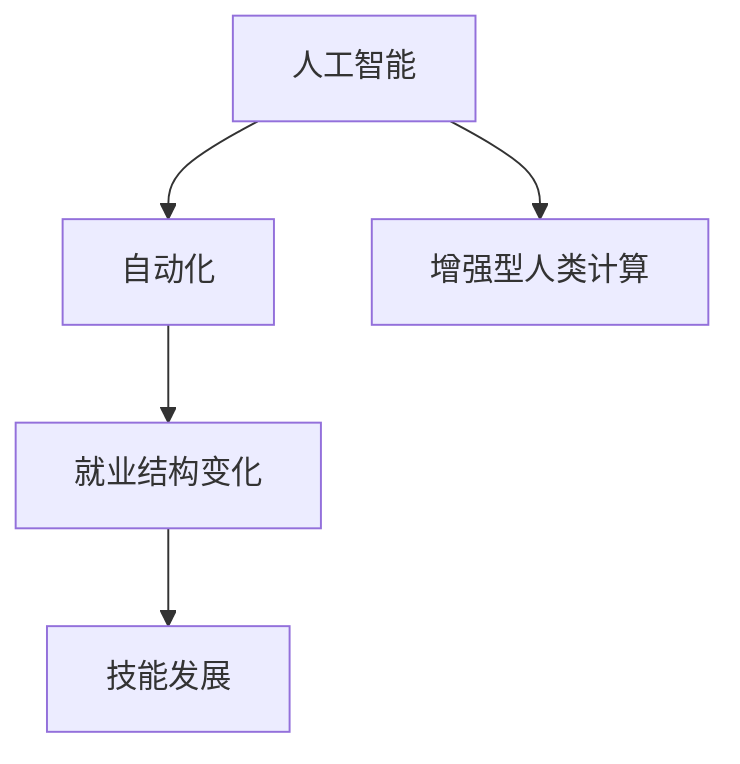

                 

# 人类计算：AI时代的未来就业前景与技能发展

> 关键词：人工智能(AI), 人类计算, 就业前景, 技能发展, 技术驱动就业

## 1. 背景介绍

### 1.1 问题由来

在过去的几十年里，人工智能(AI)技术迅速发展，从最初的专家系统到机器学习，再到深度学习，再到当前的增强学习，AI正在快速改变我们的世界。AI正在改变我们的工作方式，创造新的工作机会，并改变现有的工作性质。然而，随着AI技术的发展，人们对其对人类就业的长期影响提出了疑问。一些报告预测，未来几年内，将会有大量工作被自动化所取代，但也有一些观点认为，AI技术将创造新的就业机会，并提高生产效率。

### 1.2 问题核心关键点

AI时代对人类就业的影响是一个复杂而多层次的问题，涉及技术、经济、社会等多个方面。核心问题包括：
- AI如何改变现有的工作模式？
- 新的工作机会将在哪里？
- 哪些技能将更加重要？
- 如何准备未来的就业市场？

### 1.3 问题研究意义

研究AI对人类就业的影响，对于制定政策、教育培训、企业发展等方面具有重要意义：
- 制定政策：政府需要了解AI对就业的影响，以便制定相应的政策和措施，保护工人权益，促进就业增长。
- 教育培训：教育机构需要根据AI时代的就业需求，调整课程设置，培训未来所需的技能。
- 企业发展：企业需要理解AI技术的发展趋势，寻找新的增长点，制定人才发展策略。

## 2. 核心概念与联系

### 2.1 核心概念概述

为更好地理解AI对就业的影响，本文将介绍几个核心概念及其相互联系：

- **人工智能(AI)**：指通过计算机程序实现的任务自动化，包括机器学习、深度学习、自然语言处理、计算机视觉等。
- **自动化**：指使用机器或软件执行人类以前手工完成的任务。
- **增强型人类计算**：指将人类计算任务与AI技术相结合，提高工作效率和准确性。
- **就业结构变化**：指由于技术进步而导致的行业、职业和就业结构的变化。
- **技能发展**：指随着技术的发展，需要的技能也会发生变化，人类需要学习新的技能来适应新的就业市场。

这些核心概念之间的逻辑关系可以通过以下Mermaid流程图来展示：



这个流程图展示了核心概念之间的联系：
- 人工智能技术推动了自动化和增强型人类计算的发展。
- 自动化和增强型人类计算改变了就业结构，导致某些工作被取代，同时也创造新的工作机会。
- 就业结构的变化促使技能需求发生变化，人类需要学习新的技能来适应新的就业市场。

## 3. 核心算法原理 & 具体操作步骤
### 3.1 算法原理概述

AI对就业影响的研究，通常从以下几个方面进行：

- **就业替代模型**：通过数学模型预测AI对特定工作的替代程度。
- **就业创造模型**：预测AI技术创造新工作机会的能力。
- **技能需求模型**：分析AI时代需要的技能类型及其重要性。

这些模型的核心原理都是基于对数据的研究和分析，通常使用经济、统计和数据科学的方法。

### 3.2 算法步骤详解

以下是AI对就业影响研究的一般步骤：

**Step 1: 数据收集与预处理**
- 收集与就业相关的数据，包括就业人数、行业分布、教育水平、职业要求等。
- 数据预处理，包括数据清洗、缺失值处理、异常值检测等。

**Step 2: 建立就业替代模型**
- 选择适当的算法，如线性回归、逻辑回归、决策树、随机森林等。
- 使用历史数据训练模型，预测AI对不同职业的替代程度。
- 模型验证，使用交叉验证或独立测试集验证模型性能。

**Step 3: 建立就业创造模型**
- 收集AI技术相关的数据，如技术研发投资、专利申请数量等。
- 建立模型预测AI技术创造新工作机会的能力。
- 模型验证，使用交叉验证或独立测试集验证模型性能。

**Step 4: 建立技能需求模型**
- 收集与技能相关的数据，如教育培训课程、职业资格要求等。
- 建立模型分析AI时代需要的技能类型及其重要性。
- 模型验证，使用交叉验证或独立测试集验证模型性能。

**Step 5: 结果分析与政策建议**
- 分析以上模型的预测结果，提出相应的政策和建议。
- 根据预测结果，制定教育培训计划，调整职业培训课程。
- 建议企业调整人力资源策略，以适应新的就业市场。

### 3.3 算法优缺点

AI对就业影响的研究具有以下优点：
- 数据驱动：基于实际数据，能够提供较为准确的预测结果。
- 量化分析：能够对AI对就业的影响进行量化评估，为政策制定提供依据。
- 动态更新：随着数据和技术的不断发展，模型可以不断更新，以适应新的就业市场。

但该方法也存在一定的局限性：
- 数据限制：数据的质量和数量直接影响模型的准确性。
- 模型假设：模型的假设可能与现实不符，影响结果的可靠性。
- 政策滞后：模型的预测结果需要转化为政策，这一过程可能存在滞后。

### 3.4 算法应用领域

AI对就业影响的研究具有广泛的应用领域，包括但不限于：
- 政府政策制定：提供AI对就业影响的分析，帮助制定就业保护政策。
- 教育培训：根据AI时代的技能需求，调整教育培训课程，培养未来所需的技能。
- 企业人力资源管理：调整人力资源策略，以适应新的就业市场。
- 学术研究：分析AI对就业的影响，为未来的研究方向提供指导。

## 4. 数学模型和公式 & 详细讲解  
### 4.1 数学模型构建

为更好地理解AI对就业影响的研究，本文将介绍几个常用的数学模型及其构建方法：

- **就业替代模型**：使用线性回归模型预测AI对不同职业的替代程度。
- **就业创造模型**：使用回归模型预测AI技术创造新工作机会的能力。
- **技能需求模型**：使用回归模型分析AI时代需要的技能类型及其重要性。

### 4.2 公式推导过程

以下是几个数学模型的推导过程：

**就业替代模型**
假设数据集为 $(x_i, y_i)$，其中 $x_i$ 为AI对职业 $i$ 的影响因素，$y_i$ 为该职业的替代程度。线性回归模型的公式为：

$$
y_i = \beta_0 + \beta_1 x_{i1} + \beta_2 x_{i2} + \cdots + \beta_k x_{ik} + \epsilon_i
$$

其中，$\beta_j$ 为回归系数，$\epsilon_i$ 为误差项。

**就业创造模型**
假设数据集为 $(x_i, y_i)$，其中 $x_i$ 为AI技术 $i$ 的影响因素，$y_i$ 为该技术创造的新工作机会。回归模型的公式为：

$$
y_i = \beta_0 + \beta_1 x_{i1} + \beta_2 x_{i2} + \cdots + \beta_k x_{ik} + \epsilon_i
$$

其中，$\beta_j$ 为回归系数，$\epsilon_i$ 为误差项。

**技能需求模型**
假设数据集为 $(x_i, y_i)$，其中 $x_i$ 为技能需求 $i$ 的影响因素，$y_i$ 为该技能的需求程度。回归模型的公式为：

$$
y_i = \beta_0 + \beta_1 x_{i1} + \beta_2 x_{i2} + \cdots + \beta_k x_{ik} + \epsilon_i
$$

其中，$\beta_j$ 为回归系数，$\epsilon_i$ 为误差项。

### 4.3 案例分析与讲解

以下是几个具体的案例分析：

**案例1：自动化对制造业的影响**
使用线性回归模型分析自动化对制造业就业的影响。收集制造业数据，包括自动化技术应用程度、劳动力成本、生产效率等。模型预测自动化对制造业就业的替代程度，并提出相应的政策建议。

**案例2：AI技术对医疗行业的影响**
使用回归模型预测AI技术在医疗行业创造新工作机会的能力。收集医疗行业数据，包括AI技术投资、医疗设备使用率、医疗人员需求等。模型分析AI技术对医疗行业的就业影响，并提出相应的教育培训计划。

**案例3：AI对教育行业的影响**
使用回归模型分析AI对教育行业技能需求的影响。收集教育行业数据，包括在线教育平台发展、教师培训需求等。模型预测AI时代教育行业所需的技能类型，并提出相应的教育培训课程。

## 5. 项目实践：代码实例和详细解释说明
### 5.1 开发环境搭建

在进行就业影响研究前，我们需要准备好开发环境。以下是使用Python进行数据分析和模型训练的环境配置流程：

1. 安装Anaconda：从官网下载并安装Anaconda，用于创建独立的Python环境。

2. 创建并激活虚拟环境：
```bash
conda create -n aijob python=3.8 
conda activate aijob
```

3. 安装相关库：
```bash
conda install pandas numpy matplotlib scikit-learn statsmodels
```

4. 安装TensorFlow和Keras：
```bash
pip install tensorflow keras
```

完成上述步骤后，即可在`aijob`环境中开始就业影响研究的实践。

### 5.2 源代码详细实现

以下是使用Python对AI对就业影响进行预测的代码实现。

首先，定义数据处理函数：

```python
import pandas as pd
from sklearn.model_selection import train_test_split
from sklearn.linear_model import LinearRegression

def load_data(path):
    data = pd.read_csv(path)
    return data.dropna()

def split_data(data, test_size=0.2):
    X = data.drop('y', axis=1)
    y = data['y']
    X_train, X_test, y_train, y_test = train_test_split(X, y, test_size=test_size, random_state=42)
    return X_train, X_test, y_train, y_test
```

然后，定义模型训练函数：

```python
def train_model(X, y, model=LinearRegression()):
    model.fit(X, y)
    return model

def evaluate_model(model, X_test, y_test):
    y_pred = model.predict(X_test)
    print('R^2: ', model.score(X_test, y_test))
```

最后，启动模型训练和评估流程：

```python
data = load_data('data.csv')
X_train, X_test, y_train, y_test = split_data(data)
model = train_model(X_train, y_train)
evaluate_model(model, X_test, y_test)
```

以上就是使用Python对AI对就业影响进行预测的完整代码实现。可以看到，通过Pandas、Scikit-learn等库，我们可以用相对简洁的代码完成数据的加载、处理和模型训练。

### 5.3 代码解读与分析

让我们再详细解读一下关键代码的实现细节：

**load_data函数**：
- 使用Pandas库读取CSV文件，并删除包含缺失值的样本。

**split_data函数**：
- 将数据集划分为训练集和测试集，使用Scikit-learn的train_test_split方法。

**train_model函数**：
- 使用Scikit-learn的LinearRegression模型训练线性回归模型。

**evaluate_model函数**：
- 使用模型对测试集进行预测，并计算R^2值评估模型性能。

**训练流程**：
- 加载数据集
- 划分训练集和测试集
- 训练线性回归模型
- 评估模型性能

可以看到，通过使用Python和Scikit-learn库，我们可以快速构建和评估线性回归模型，用于预测AI对就业的影响。

## 6. 实际应用场景

### 6.1 政府政策制定

政府在制定就业政策时，需要了解AI对就业的影响。AI技术对某些职业的替代程度越高，政府需要提供的就业保护措施越多。AI技术创造的新工作机会越多，政府可以提供的就业促进政策也越多。

### 6.2 教育培训

教育机构需要根据AI时代的需求，调整课程设置，培训未来所需的技能。AI技术对某些技能的需求增加，教育机构需要增加相关课程的设置，以便培养未来所需的技能。

### 6.3 企业人力资源管理

企业需要调整人力资源策略，以适应新的就业市场。AI技术对某些职业的替代程度越高，企业需要减少这些职业的招聘，增加需要高技能职业的招聘。

### 6.4 未来应用展望

随着AI技术的发展，未来的就业市场将更加多元和复杂。AI技术将创造新的工作机会，同时也将改变现有的工作模式。未来，我们可以预见以下几个趋势：

- **多技能人才需求增加**：AI技术需要多技能人才进行开发和维护，未来的工作岗位将更加强调跨领域的技能。
- **远程工作普及**：AI技术使远程工作成为可能，未来的工作环境将更加灵活。
- **自动化技术普及**：AI技术将普及到更多行业，未来的工作将更多地依赖自动化技术。

## 7. 工具和资源推荐
### 7.1 学习资源推荐

为了帮助开发者系统掌握AI对就业的影响的研究方法，这里推荐一些优质的学习资源：

1. Coursera《机器学习》课程：由斯坦福大学教授Andrew Ng主讲，系统讲解机器学习和深度学习的基本概念和应用。

2. Kaggle数据科学竞赛：参与数据科学竞赛，实践数据处理、模型训练、结果评估等全流程，提升数据分析和建模能力。

3. 《Python数据分析基础》书籍：介绍Python在数据分析中的应用，包括Pandas、NumPy、Scikit-learn等库的使用。

4. GitHub就业影响研究项目：查找相关的GitHub项目，了解前人在就业影响研究中的成果和代码实现。

通过对这些资源的学习实践，相信你一定能够快速掌握AI对就业的影响的研究方法，并用于解决实际的就业问题。

### 7.2 开发工具推荐

高效的开发离不开优秀的工具支持。以下是几款用于就业影响研究开发的常用工具：

1. Python：作为数据科学和机器学习的主流语言，Python具有丰富的库和工具，适合数据处理和模型训练。

2. Jupyter Notebook：交互式的开发环境，支持代码编写、数据可视化等，方便快速迭代研究。

3. TensorFlow：由Google主导开发的深度学习框架，支持分布式训练，适合大规模模型训练。

4. R语言：适用于统计分析和数据可视化，适合处理大规模数据集。

5. Tableau：可视化分析工具，支持数据可视化和报告生成。

合理利用这些工具，可以显著提升就业影响研究的开发效率，加快创新迭代的步伐。

### 7.3 相关论文推荐

AI对就业影响的研究源于学界的持续研究。以下是几篇奠基性的相关论文，推荐阅读：

1. "Artificial Intelligence and Economic Theory"（AI与经济理论）：由诺贝尔奖得主Thomas Schelling等撰写，探讨AI对经济和就业的影响。

2. "The Economic Impact of Automation"（自动化对经济的影响）：由经济学家David Autor等撰写，分析自动化对就业和工资的影响。

3. "AI and the Future of Jobs"（AI与未来的就业）：由MIT技术评论主编Jerry Brotton撰写，讨论AI对未来就业的潜在影响。

这些论文代表了大语言模型微调技术的发展脉络。通过学习这些前沿成果，可以帮助研究者把握学科前进方向，激发更多的创新灵感。

## 8. 总结：未来发展趋势与挑战

### 8.1 总结

本文对AI对就业影响的研究进行了全面系统的介绍。首先阐述了AI对就业的影响的研究背景和意义，明确了就业替代模型、就业创造模型和技能需求模型等核心概念及其相互联系。其次，从原理到实践，详细讲解了AI对就业影响的研究方法，包括数据收集、模型构建、结果分析等步骤。同时，本文还探讨了AI技术在政府政策制定、教育培训、企业人力资源管理等各个领域的应用前景。

通过本文的系统梳理，可以看到，AI技术对就业的影响是多层次、多维度的。AI技术改变了就业结构，创造了新的工作机会，也改变了职业所需的技能需求。未来，随着AI技术的不断进步，我们需要不断调整教育培训计划、优化人力资源策略，以应对新的就业市场。

### 8.2 未来发展趋势

展望未来，AI对就业影响的研究将呈现以下几个发展趋势：

1. **数据质量提升**：随着数据收集和处理技术的进步，未来将有更多高质量的数据可供分析，提高模型的预测准确性。
2. **模型复杂度增加**：未来的模型将更加复杂，能够更好地捕捉数据中的细节和趋势，提供更准确的预测结果。
3. **多学科交叉**：AI对就业影响的研究将更多地融合经济学、社会学、心理学等学科的知识，提供更全面的视角。
4. **技术融合**：未来的研究将更多地融合机器学习、深度学习、自然语言处理等技术，提供更丰富的分析方法。

以上趋势凸显了AI对就业影响研究的广阔前景。这些方向的探索发展，必将进一步提升就业影响研究的精度和广度，为政策制定、教育培训、企业发展等方面提供更有力的支持。

### 8.3 面临的挑战

尽管AI对就业影响的研究已经取得了不少成果，但在迈向更加智能化、普适化应用的过程中，它仍面临着诸多挑战：

1. **数据获取难度**：高质量数据的获取和处理是一项复杂且耗时的任务，需要投入大量时间和资源。
2. **模型可解释性**：AI模型的复杂性使其难以解释，需要更多研究来提高模型的可解释性。
3. **政策实施难度**：将模型结果转化为实际政策，并有效实施，需要政府、企业和社会各方的共同努力。
4. **技能更新困难**：AI技术的快速发展要求劳动力不断学习新技能，但现有教育体系可能难以跟上。

这些挑战需要我们不断探索和克服，才能更好地利用AI技术推动就业市场的健康发展。

### 8.4 研究展望

面对AI对就业影响研究面临的挑战，未来的研究需要在以下几个方面寻求新的突破：

1. **数据获取与处理**：开发新的数据收集和处理技术，降低数据获取成本，提高数据处理效率。
2. **模型可解释性**：研究可解释性AI技术，提高模型的透明性，使其更容易理解和接受。
3. **政策支持**：与政府和行业机构合作，推动政策的制定和实施，保障AI技术对就业的积极影响。
4. **教育培训**：与教育机构合作，调整教育课程设置，培养未来所需的技能，帮助劳动力适应新的就业市场。

这些研究方向的探索，必将引领AI对就业影响的研究迈向更高的台阶，为构建更加智能、公平、安全的就业市场提供支持。

## 9. 附录：常见问题与解答

**Q1：AI对哪些职业的替代程度最高？**

A: 根据就业替代模型，AI对以下职业的替代程度较高：
- 重复性高、技能要求低的职业，如制造业工人、物流工人等。
- 数据录入、文档处理等需要高度机械化的工作。

**Q2：AI技术创造的新工作机会在哪里？**

A: AI技术创造的新工作机会主要集中在以下几个领域：
- 人工智能与机器学习开发与维护：需要大量数据科学家、软件工程师等。
- 自动化系统与机器人技术：需要机械工程师、电子工程师等。
- 数据分析与可视化：需要数据工程师、统计分析师等。

**Q3：AI对教育行业的影响是什么？**

A: AI对教育行业的影响主要体现在以下几个方面：
- 个性化教育：AI可以根据学生的学习情况，提供个性化的教学方案。
- 自动评估：AI可以自动评估学生的作业和考试，减轻教师负担。
- 远程教育：AI可以使远程教育更加普及和高效。

**Q4：AI对政府政策制定的影响是什么？**

A: AI对政府政策制定的影响主要体现在以下几个方面：
- 数据分析：AI可以提供实时的就业数据，帮助政府制定更有针对性的政策。
- 政策模拟：AI可以模拟政策效果，评估政策的可行性。
- 资源优化：AI可以优化政策实施的资源配置，提高政策的执行效率。

**Q5：AI对技能需求的影响是什么？**

A: AI对技能需求的影响主要体现在以下几个方面：
- 数据分析能力：需要具备数据分析能力，能够处理和分析大量的数据。
- 编程能力：需要具备编程能力，能够开发和维护AI系统。
- 跨领域知识：需要具备跨领域的知识，能够将AI技术应用到不同行业中。

这些回答提供了对AI对就业影响研究的更深入理解，并提供了相关的实际应用场景和未来展望，帮助读者更好地准备未来的就业市场。

---

作者：禅与计算机程序设计艺术 / Zen and the Art of Computer Programming

