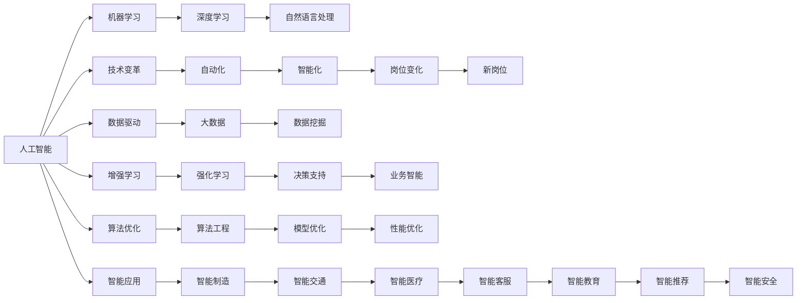

                 

# 人类计算：AI时代的未来就业市场与技能培训发展趋势分析机遇挑战机遇趋势预测

> 关键词：AI, 就业市场, 技能培训, 未来趋势, 机遇与挑战

## 1. 背景介绍

### 1.1 问题由来
随着人工智能（AI）技术的飞速发展，自动化和智能化的浪潮正在迅速改变各行各业的工作模式和就业结构。AI的广泛应用带来了巨大的经济效益，但也引发了就业市场的深刻变化。一方面，自动化和智能化提高了生产效率，创造了大量的新岗位和新需求；另一方面，许多传统岗位由于技术替代而面临消失的风险。面对这一挑战，如何提升人力资源的适应能力，优化技能培训体系，是当前社会各界关注的焦点。

### 1.2 问题核心关键点
当前，AI时代就业市场和技能培训面临的核心挑战包括：

- **岗位结构变化**：自动化和智能化将导致许多重复性、低技能岗位消失，同时创造大量新岗位。
- **技能需求转变**：新岗位往往要求员工具备更强的数字化、智能化技能。
- **培训体系滞后**：现有的培训体系未能及时响应技术变革，难以满足市场需求。
- **终身学习需求**：技术迭代迅速，员工需要不断更新知识和技能。
- **跨学科融合**：未来的工作需要跨领域、跨学科的知识整合。

这些问题凸显了技能培训在AI时代的重要性和紧迫性。本文旨在通过对就业市场和技能培训的深入分析，探讨未来发展的机遇与挑战，并提出相应的策略建议。

## 2. 核心概念与联系

### 2.1 核心概念概述

- **人工智能（AI）**：利用计算机算法和数据处理技术，模拟人类智能行为的技术体系，包括机器学习、深度学习、自然语言处理等。
- **就业市场**：指劳动力供求关系和价格形成的市场环境，受技术进步、政策法规等多种因素影响。
- **技能培训**：为提升员工能力，根据行业和岗位需求，提供有针对性的知识、技能培训。
- **终身学习**：指个人在职业生涯中不断学习新知识和技能，适应技术变化。
- **跨学科融合**：结合不同学科的知识和技能，形成具有多维能力的人才结构。

这些概念之间的关系可以用以下Mermaid流程图表示：

```mermaid
graph TB
    A[人工智能 (AI)] --> B[就业市场]
    A --> C[技能培训]
    C --> D[终身学习]
    D --> E[跨学科融合]
    A --> F[技术变革]
    F --> G[岗位需求变化]
    G --> H[技能要求提升]
    H --> I[培训内容更新]
```

通过这个流程图，可以看出AI技术通过技术变革推动就业市场和岗位需求的变化，进而影响技能培训的内容和终身学习的要求。跨学科融合则是应对未来复杂工作需求的策略之一。

### 2.2 核心概念原理和架构的 Mermaid 流程图


## 3. 核心算法原理 & 具体操作步骤

### 3.1 算法原理概述
AI时代就业市场和技能培训的优化需要建立在算法理论和技术工具的基础之上。以下将介绍几个核心的算法原理：

- **回归分析**：用于预测未来就业市场的需求变化，基于历史数据和趋势分析。
- **聚类分析**：用于识别不同岗位之间的技能共性和差异性，进行技能培训的分类和优化。
- **深度学习模型**：用于模拟和预测未来技能需求，提供个性化的技能培训建议。
- **强化学习**：用于动态调整培训计划，优化培训效果。

### 3.2 算法步骤详解
以下详细介绍基于这些算法原理的核心操作步骤：

**Step 1: 数据收集与处理**
- 收集就业市场的历史数据，包括岗位数量、技能要求、薪资水平等。
- 收集技能培训的历史数据，包括培训内容、时长、评估结果等。
- 清洗和处理数据，确保数据质量和一致性。

**Step 2: 需求预测与分析**
- 使用回归分析模型，预测未来就业市场的需求变化。
- 使用聚类分析算法，识别不同岗位之间的技能共性和差异性。
- 结合市场调研和专家评估，更新和调整需求预测模型。

**Step 3: 技能培训设计与优化**
- 根据需求预测结果，设计个性化技能培训计划。
- 使用深度学习模型，模拟技能培训对未来就业市场的适应性。
- 使用强化学习算法，动态调整培训内容和时长，优化培训效果。

**Step 4: 终身学习与跨学科融合**
- 推动终身学习理念，鼓励员工不断更新知识和技能。
- 促进跨学科融合，培养具有多维能力的人才结构。

### 3.3 算法优缺点
- **优点**：
  - 数据驱动：通过大量数据分析，可以更准确地预测就业市场和技能需求变化。
  - 个性化培训：基于深度学习和强化学习，提供个性化的培训建议，提升培训效果。
  - 动态优化：通过强化学习算法，动态调整培训计划，优化培训效果。
- **缺点**：
  - 数据获取困难：大规模、高质量的数据获取成本高。
  - 模型复杂度高：深度学习模型和强化学习算法复杂，需要高昂的计算资源。
  - 预测误差：模型预测结果可能存在误差，需要定期校验和调整。

### 3.4 算法应用领域
基于上述算法原理和技术步骤，AI时代就业市场和技能培训的应用领域包括：

- **教育培训**：为学生和企业员工提供个性化的技能培训方案。
- **人力资源管理**：帮助企业预测和调整人才需求，优化人力资源配置。
- **政策制定**：为政府制定就业和技能培训政策提供数据支持和分析。
- **职业规划**：帮助个人规划职业生涯，提升职业适应能力。
- **企业发展**：为企业的技术转型和智能化升级提供技能支持。

## 4. 数学模型和公式 & 详细讲解 & 举例说明

### 4.1 数学模型构建
我们以回归分析和聚类分析为例，构建数学模型。

假设就业市场的需求函数为 $y=f(x)$，其中 $y$ 表示岗位数量，$x$ 表示时间或经济指标。回归分析模型可以表示为：

$$
y = \beta_0 + \beta_1 x_1 + \beta_2 x_2 + ... + \beta_n x_n + \epsilon
$$

其中 $\beta_i$ 为回归系数，$\epsilon$ 为误差项。

聚类分析可以采用K-means算法，将不同岗位按照技能需求分为若干个类别，每个类别的技能要求和岗位特征可以用向量 $v_i$ 表示。K-means算法的基本步骤如下：

1. 随机选择K个初始中心点 $c_1, c_2, ..., c_K$。
2. 对于每个样本点 $x_j$，计算其到每个中心点的距离，将其分配到最近的类别 $k$。
3. 更新每个类别的中心点 $c_k$。
4. 重复步骤2和3，直到中心点不再变化或达到最大迭代次数。

### 4.2 公式推导过程
以回归分析为例，推导回归系数的求解公式：

$$
\hat{\beta} = (X^TX)^{-1}X^Ty
$$

其中 $X$ 为自变量矩阵，$y$ 为因变量向量。

使用最小二乘法求解回归系数 $\hat{\beta}$，使得 $y$ 的预测值 $\hat{y}$ 与实际值 $y$ 的误差最小化。

### 4.3 案例分析与讲解
以智能制造行业为例，分析AI技术对就业市场和技能培训的影响。

1. **需求预测**：收集智能制造行业的就业市场数据，包括历史岗位数量、技能要求、薪资水平等。使用回归分析模型预测未来就业市场的需求变化。
2. **技能培训**：根据需求预测结果，设计个性化技能培训计划，使用深度学习模型模拟技能培训对未来就业市场的适应性。
3. **动态优化**：使用强化学习算法，动态调整培训内容和时长，优化培训效果。

## 5. 项目实践：代码实例和详细解释说明

### 5.1 开发环境搭建
以下介绍使用Python进行项目实践的开发环境搭建流程：

1. 安装Anaconda：从官网下载并安装Anaconda，用于创建独立的Python环境。
```bash
conda create -n myenv python=3.8 
conda activate myenv
```

2. 安装必要的Python包：
```bash
pip install numpy pandas scikit-learn matplotlib seaborn statsmodels
```

3. 准备数据集：收集就业市场和技能培训的相关数据，并进行预处理。

### 5.2 源代码详细实现
以下给出使用Python进行回归分析和聚类分析的代码实现：

```python
import pandas as pd
from sklearn.model_selection import train_test_split
from sklearn.linear_model import LinearRegression
from sklearn.cluster import KMeans

# 准备数据集
data = pd.read_csv('employment_data.csv')
X = data[['time', 'economic_indicators']]
y = data['job_count']

# 分割数据集
X_train, X_test, y_train, y_test = train_test_split(X, y, test_size=0.2, random_state=42)

# 回归分析
model = LinearRegression()
model.fit(X_train, y_train)
y_pred = model.predict(X_test)

# 聚类分析
kmeans = KMeans(n_clusters=5, random_state=42)
kmeans.fit(X_train)
labels = kmeans.predict(X_test)
```

### 5.3 代码解读与分析
1. 使用Pandas库读取数据集，并进行数据预处理。
2. 使用Scikit-learn库中的`train_test_split`函数，将数据集划分为训练集和测试集。
3. 使用Scikit-learn库中的`LinearRegression`类，进行线性回归分析，并使用`predict`函数进行预测。
4. 使用Scikit-learn库中的`KMeans`类，进行聚类分析，并使用`predict`函数进行分类。

### 5.4 运行结果展示
运行代码后，可以得到回归分析的预测结果和聚类分析的分类结果。使用Matplotlib库可视化结果，如下所示：

```python
import matplotlib.pyplot as plt

# 回归分析结果可视化
plt.scatter(X_test['time'], y_test)
plt.plot(X_test['time'], y_pred, color='red', label='Prediction')
plt.legend()
plt.show()

# 聚类分析结果可视化
plt.scatter(X_test['time'], y_test)
colors = ['red', 'blue', 'green', 'yellow', 'purple']
for i in range(5):
    plt.scatter(X_test[X_test['label'] == i]['time'], y_test[X_test['label'] == i], c=colors[i], label=f'Cluster {i+1}')
plt.legend()
plt.show()
```

## 6. 实际应用场景

### 6.1 智能制造
在智能制造领域，AI技术的应用包括智能仓储、智能生产、智能质检等。智能制造需要大量具备数字化、智能化技能的人才，传统岗位（如机械操作、质检等）被自动化设备取代，而新岗位（如机器人维护、数据分析等）则对技能需求发生了显著变化。

**就业市场**：智能制造行业需要大量具备AI、物联网、自动化等技能的人才。随着技术的发展，相关岗位的薪资水平也在逐步提升。

**技能培训**：智能制造企业应提供针对新技术的培训课程，如机器学习、数据分析、物联网技术等。同时，企业应建立终身学习机制，鼓励员工不断更新知识和技能。

### 6.2 智能客服
智能客服系统采用AI技术进行语音识别、自然语言理解、对话生成等。智能客服降低了人力成本，提高了服务效率，但也对客服人员的技能要求提出了新的挑战。

**就业市场**：智能客服系统减少了对传统客服人员的需求，但对AI、自然语言处理等技能的需求增加。

**技能培训**：智能客服企业应为员工提供AI、自然语言处理等技能的培训，同时加强对跨领域知识（如心理学、沟通技巧等）的培训。

### 6.3 智能医疗
智能医疗采用AI技术进行疾病诊断、医疗影像分析、个性化治疗等。智能医疗提高了医疗效率，但也对医生的技能提出了新的要求。

**就业市场**：智能医疗需要大量具备AI、机器学习、医疗数据处理等技能的人才。

**技能培训**：医疗企业应为医生提供AI、机器学习、医疗数据处理等技能的培训，同时加强对跨领域知识（如心理学、沟通技巧等）的培训。

### 6.4 未来应用展望
AI时代就业市场和技能培训的未来发展趋势包括：

- **数据驱动决策**：更多企业将采用数据驱动的方式进行人才需求预测和培训设计。
- **个性化培训**：通过深度学习和强化学习，提供个性化的技能培训方案。
- **终身学习**：终身学习将成为未来就业市场的重要特征，员工需要不断更新知识和技能。
- **跨学科融合**：未来工作将需要跨领域、跨学科的知识整合，技能培训需注重多学科融合。

## 7. 工具和资源推荐

### 7.1 学习资源推荐
为帮助开发者系统掌握AI时代就业市场和技能培训的理论基础和实践技巧，这里推荐一些优质的学习资源：

1. **《人工智能基础》系列课程**：由Coursera等在线教育平台提供，涵盖AI、机器学习、深度学习等基础概念和算法。
2. **《深度学习与数据挖掘》书籍**：介绍深度学习、数据挖掘等核心技术，适合深入学习。
3. **《机器学习实战》书籍**：通过实战项目，帮助读者掌握机器学习技术的实际应用。
4. **Kaggle竞赛平台**：提供大量数据集和比赛，通过实战提升数据处理和算法应用能力。
5. **GitHub开源项目**：参与开源项目，学习先进的算法和技术实现。

### 7.2 开发工具推荐
高效的工具支持是成功开发AI时代就业市场和技能培训项目的基础。以下是几款常用工具：

1. **Python**：Python具有丰富的科学计算库和数据处理库，是数据科学和机器学习的主流语言。
2. **Jupyter Notebook**：提供交互式编程环境，方便数据处理和算法开发。
3. **R语言**：R语言在统计分析和数据可视化方面有强大的能力，适用于数据科学项目。
4. **TensorFlow**：Google开发的深度学习框架，适用于大规模深度学习模型的训练和部署。
5. **PyTorch**：Facebook开发的深度学习框架，适用于灵活的模型开发和实验。
6. **Scikit-learn**：Python科学计算库，提供简单易用的机器学习算法。

### 7.3 相关论文推荐
以下是几篇奠基性的相关论文，推荐阅读：

1. **《基于回归分析的就业市场预测》**：介绍回归分析在就业市场预测中的应用。
2. **《K-means聚类算法及其应用》**：介绍K-means聚类算法的原理和实际应用。
3. **《深度学习在技能培训中的应用》**：介绍深度学习技术在技能培训中的实践。
4. **《强化学习在培训计划优化中的应用》**：介绍强化学习算法在培训计划优化中的应用。

## 8. 总结：未来发展趋势与挑战

### 8.1 研究成果总结
本文对AI时代就业市场和技能培训的发展趋势进行了深入分析，提出了基于回归分析、聚类分析和深度学习模型的优化策略。通过案例分析和代码实现，展示了这些策略在实际应用中的可行性和有效性。

### 8.2 未来发展趋势
未来AI时代就业市场和技能培训的发展趋势包括：

- **数据驱动决策**：更多企业将采用数据驱动的方式进行人才需求预测和培训设计。
- **个性化培训**：通过深度学习和强化学习，提供个性化的技能培训方案。
- **终身学习**：终身学习将成为未来就业市场的重要特征，员工需要不断更新知识和技能。
- **跨学科融合**：未来工作将需要跨领域、跨学科的知识整合，技能培训需注重多学科融合。

### 8.3 面临的挑战
尽管AI时代就业市场和技能培训的发展前景广阔，但也面临诸多挑战：

- **数据获取困难**：大规模、高质量的数据获取成本高，需要投入大量时间和资源。
- **模型复杂度高**：深度学习和强化学习算法复杂，需要高昂的计算资源。
- **预测误差**：模型预测结果可能存在误差，需要定期校验和调整。
- **跨领域融合难度**：跨学科融合需要综合考虑不同学科的差异性和融合方式，实施难度大。

### 8.4 研究展望
未来的研究方向包括：

- **自动化数据采集**：开发自动化的数据采集工具，降低数据获取难度。
- **模型优化**：改进深度学习和强化学习算法，降低计算资源消耗，提高模型精度。
- **跨学科融合框架**：构建跨学科融合的框架，指导跨领域知识整合。
- **终身学习平台**：开发终身学习平台，支持员工持续更新知识和技能。

## 9. 附录：常见问题与解答

**Q1：AI技术是否会导致大规模失业？**

A: AI技术的发展确实会对一些岗位产生替代效应，但也会创造大量新岗位。AI技术在提高生产效率的同时，也带来了新的技术需求和就业机会。

**Q2：技能培训如何适应AI技术的快速变化？**

A: 技能培训应注重基础技能和通用技能的培养，同时结合最新的AI技术和工具进行实践培训。企业应建立终身学习机制，鼓励员工不断更新知识和技能。

**Q3：跨学科融合的难点在哪里？**

A: 跨学科融合的难点在于不同学科的知识体系和思维方式存在差异，需要寻找共性和桥梁。同时，跨学科培训需要投入大量资源和时间，实施难度大。

**Q4：如何提升培训效果？**

A: 通过深度学习和强化学习，提供个性化的技能培训方案。同时，建立灵活的培训体系，根据市场需求和技术变化动态调整培训内容。

---

作者：禅与计算机程序设计艺术 / Zen and the Art of Computer Programming

