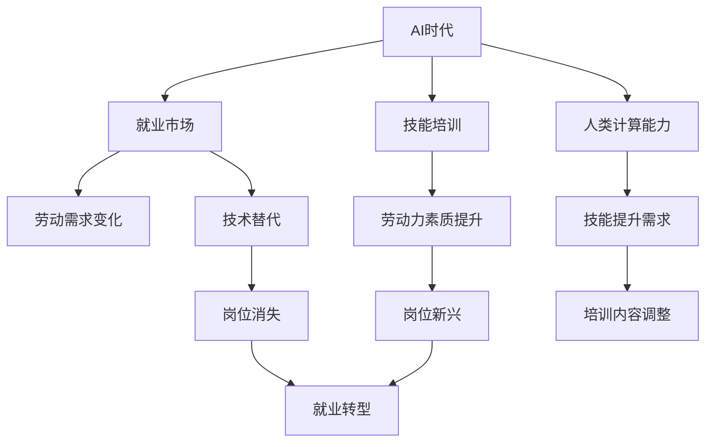

                 

# 人类计算：AI时代的未来就业市场与技能培训发展趋势预测分析机遇

## 1. 背景介绍

随着人工智能技术的飞速发展，人类计算领域正迎来一场革命性的变化。AI技术的广泛应用正在改变我们的工作方式和生活习惯，给就业市场带来深刻影响。本文旨在探讨AI时代下人类计算的发展趋势，预测未来就业市场的变化，并提出相关技能培训的发展机遇。

### 1.1 问题由来

当前，人工智能技术在各个领域的应用越来越广泛，从自动驾驶、医疗诊断到金融预测，AI正逐渐渗透到社会的每一个角落。这不仅带来了生产力的提升，也改变了劳动市场的结构，对人类计算能力提出了新的要求。一方面，一些传统岗位由于自动化和智能化工具的引入而逐渐消失；另一方面，AI技术的发展又催生了许多新的就业机会。因此，理解和预测AI时代下就业市场的发展趋势，对于应对劳动力市场变化、提升劳动力素质具有重要意义。

### 1.2 问题核心关键点

本文将聚焦于以下几个核心关键点：

- **AI时代就业市场的变化**：探索AI技术对各行业就业结构的影响。
- **技能培训的发展趋势**：预测未来技能培训的方向与需求。
- **机遇与挑战**：分析AI时代对人类计算能力带来的机遇和挑战。

### 1.3 问题研究意义

探讨AI时代下就业市场与技能培训的发展趋势，对于理解劳动力市场动态、指导教育培训政策制定以及帮助个人提升职业竞争力具有重要意义。

1. **政策制定**：政府和企业需要根据劳动力市场需求变化，制定相应的政策措施，引导教育培训方向。
2. **职业规划**：帮助劳动者识别技能提升路径，调整职业发展策略。
3. **行业升级**：推动各行各业智能化转型，提高产业竞争力。

## 2. 核心概念与联系

### 2.1 核心概念概述

- **AI时代**：指以人工智能技术为主要驱动力的社会发展阶段。
- **就业市场**：指劳动力供需关系和劳动力流动现象的综合体。
- **技能培训**：指通过教育、培训等形式，提升个体和组织技能水平的过程。
- **人类计算能力**：指人类进行信息处理、问题解决等计算任务的能力，在AI时代下具有重要的实际意义。
- **预测分析**：指使用数据分析、机器学习等技术手段，预测未来趋势的能力。

这些概念之间的关系可以通过以下Mermaid流程图来展示：



这个流程图展示了AI时代下各概念之间的逻辑关系：

1. AI技术的发展引发就业市场变化。
2. 就业市场的变化对技能培训提出新的需求。
3. 技能培训提升劳动力素质，满足AI时代对人类计算能力的需求。
4. AI技术的替代作用导致部分岗位消失，同时催生新的岗位需求。
5. 人类计算能力在AI时代变得至关重要，影响着岗位的技能要求。

## 3. 核心算法原理 & 具体操作步骤

### 3.1 算法原理概述

在预测AI时代下就业市场与技能培训的发展趋势时，我们通常采用机器学习算法和统计分析方法。这些算法基于大量的历史数据和模型假设，通过训练得到能够预测未来趋势的模型。

### 3.2 算法步骤详解

1. **数据收集**：收集与就业市场、技能培训相关的历史数据，包括就业率、岗位需求、培训课程、教育投入等。
2. **数据预处理**：清洗数据，去除异常值和缺失值，进行特征工程，选择和构建有意义的特征。
3. **模型选择与训练**：选择适合的预测模型，如时间序列模型、回归模型、决策树等，并使用训练数据对模型进行训练。
4. **模型评估与优化**：使用验证集对模型进行评估，调整模型参数，优化模型性能。
5. **预测分析**：使用优化后的模型对未来就业市场和技能培训的发展趋势进行预测。

### 3.3 算法优缺点

- **优点**：
  - 能够处理大量数据，提供基于数据的预测结果。
  - 可以发现数据背后的潜在规律和趋势。
  - 可以动态更新模型，适应数据的变化。

- **缺点**：
  - 预测结果受数据质量影响较大，数据不完整或不准确会导致预测偏差。
  - 模型需要大量的历史数据进行训练，对于新兴领域可能缺乏足够数据。
  - 模型的复杂性可能导致计算成本较高。

### 3.4 算法应用领域

机器学习和统计分析方法在就业市场与技能培训的预测分析中具有广泛的应用，具体包括：

1. **劳动力需求预测**：使用时间序列模型预测未来的就业需求和变化趋势。
2. **技能培训需求分析**：通过回归模型分析技能与就业市场的相关性，预测未来技能培训的需求。
3. **岗位变化预测**：利用分类模型预测哪些岗位将消失或增加，指导职业规划和教育培训方向。
4. **技能匹配度分析**：使用相似性度量方法评估个体技能与岗位需求之间的匹配度。

## 4. 数学模型和公式 & 详细讲解 & 举例说明

### 4.1 数学模型构建

在预测分析中，我们通常使用时间序列模型来预测未来就业市场和技能培训的变化。假设我们有一个时间序列数据集 $\{y_t\}_{t=1}^T$，其中 $y_t$ 表示第 $t$ 年某个行业（或岗位）的就业人数，$t$ 表示年份。我们可以使用自回归积分滑动平均模型（ARIMA）来建立预测模型：

$$
y_t = \mu + \phi_1 (y_{t-1} - \mu) + \theta_1 (y_{t-1} - \mu) + \epsilon_t
$$

其中 $\mu$ 是均值，$\phi_1$ 和 $\theta_1$ 是模型参数，$\epsilon_t$ 是误差项。

### 4.2 公式推导过程

对于ARIMA模型，我们可以通过对数据进行差分和自回归、滑动平均的操作，将时间序列数据转换为平稳序列，从而建立预测模型。具体的推导过程包括：

1. 差分操作：对时间序列进行一阶差分，得到平稳序列。
2. 自回归操作：使用自回归模型来拟合平稳序列，得到模型的残差。
3. 滑动平均操作：使用滑动平均模型来拟合平稳序列的残差，得到最终的预测模型。

### 4.3 案例分析与讲解

以金融行业为例，我们可以使用ARIMA模型来预测未来的就业需求。假设我们有过去10年的金融行业就业数据，我们首先对数据进行差分，得到平稳序列。然后，我们可以使用ARIMA模型对平稳序列进行建模，得到模型的预测结果。最后，我们将预测结果与实际数据进行对比，评估模型的性能。

## 5. 项目实践：代码实例和详细解释说明

### 5.1 开发环境搭建

在实践预测分析时，我们需要准备开发环境。以下是Python环境的搭建步骤：

1. 安装Python：从官网下载Python安装程序，安装最新版本。
2. 安装相关库：安装Pandas、NumPy、Scikit-learn等常用库，以及用于时间序列分析的statsmodels库。
3. 配置环境：设置Python的默认工作目录和库搜索路径。

### 5.2 源代码详细实现

以下是一个使用ARIMA模型进行就业预测的Python代码实现：

```python
import pandas as pd
import numpy as np
import statsmodels.api as sm
from statsmodels.tsa.arima.model import ARIMA

# 读取数据
data = pd.read_csv('employment_data.csv', index_col='year', parse_dates=True)

# 对数据进行差分
diff_data = data.diff().dropna()

# 拟合ARIMA模型
model = sm.tsa.statespace.SARIMAX(diff_data, order=(1, 1, 1), enforce_stationarity=False, enforce_invertibility=False)
result = model.fit()

# 预测未来5年就业人数
forecast = result.get_forecast(steps=5)

# 输出预测结果
print(forecast.predicted_mean)
```

### 5.3 代码解读与分析

这段代码展示了如何使用ARIMA模型进行就业预测。首先，我们读取就业数据，并对数据进行差分，使其变为平稳序列。然后，我们使用statsmodels库中的SARIMAX模型对平稳序列进行建模，并得到预测结果。最后，我们将预测结果输出，用于评估模型的性能。

## 6. 实际应用场景

### 6.1 金融行业

在金融行业中，AI技术的应用极大地改变了就业市场。例如，自动化交易系统的引入导致许多交易员岗位的消失，但同时也催生了数据科学家、AI工程师等新兴岗位。通过对就业市场和技能培训的预测分析，金融机构可以更好地制定人力资源策略，优化岗位配置，提升整体竞争力。

### 6.2 制造业

制造业是AI应用的重要领域之一。智能制造的推广使得生产线自动化水平不断提高，但同时也带来了对技能工人的新需求。例如，机器人维护、智能设备操作等岗位在AI时代变得更加重要。通过对就业市场和技能培训的预测分析，制造企业可以更好地进行岗位调整和技能培训，提高生产效率和产品质量。

### 6.3 医疗行业

AI在医疗行业的应用同样广泛。智能诊断系统、医疗机器人等技术的发展，对医生、护士等传统岗位提出了新的要求。通过对就业市场和技能培训的预测分析，医疗机构可以更好地规划人力资源配置，提升医疗服务的质量和效率。

### 6.4 未来应用展望

未来，随着AI技术的进一步发展，人类计算能力的需求将更加复杂多样。以下是一些可能的未来应用：

1. **自动化运维**：AI技术将进一步提升运维自动化水平，要求运维人员具备更高的技术水平和综合素质。
2. **智能客服**：智能客服系统的广泛应用将对客服人员的技能要求提出新的挑战。
3. **个性化推荐**：AI技术在电商、娱乐等领域的应用将对推荐系统工程师提出新的要求。

## 7. 工具和资源推荐

### 7.1 学习资源推荐

- **《Python数据分析实战》**：详细介绍了使用Python进行数据清洗、处理和分析的方法，适合初学者。
- **《机器学习实战》**：介绍了常用的机器学习算法和模型，提供了丰富的实例代码。
- **Coursera和edX等在线课程**：提供了各种AI和数据分析相关课程，涵盖了从基础到高级的各个层次。
- **Kaggle**：一个数据科学竞赛平台，提供了大量的数据集和竞赛任务，适合实践和挑战。

### 7.2 开发工具推荐

- **Jupyter Notebook**：一个交互式的编程环境，支持代码编辑、执行和可视化，适合数据科学和机器学习项目。
- **Git**：一个版本控制系统，支持团队协作和代码管理，适合团队开发和项目管理。
- **Python IDE**：如PyCharm、JupyterLab等，提供了代码调试、编辑和自动补全等功能，提升开发效率。

### 7.3 相关论文推荐

- **《机器学习：理论与算法》**：介绍了机器学习的基本理论和常用算法，适合理论学习。
- **《深度学习》**：介绍了深度学习的基本概念和算法，适合深入学习。
- **《自然语言处理综论》**：介绍了NLP的基本概念和技术，适合NLP相关应用开发。

## 8. 总结：未来发展趋势与挑战

### 8.1 总结

本文通过对AI时代下就业市场与技能培训的预测分析，探讨了未来就业市场的发展趋势和技能培训的发展方向。我们通过使用ARIMA等时间序列模型，预测了未来金融、制造业、医疗等行业中的就业变化，并提出了相应的技能培训建议。

### 8.2 未来发展趋势

未来，随着AI技术的不断发展和普及，就业市场和技能培训将呈现以下趋势：

1. **跨领域就业**：AI技术的发展将打破行业间的界限，促进跨领域就业。
2. **技能更新**：技能更新周期将变短，要求个人和组织持续学习新技能。
3. **终身学习**：终身学习将成为新的就业理念，提升个体综合素质。
4. **智能化管理**：企业将更加重视智能化管理，提升运营效率和决策水平。
5. **协作创新**：人工智能与人类协作将带来新的创新模式和解决方案。

### 8.3 面临的挑战

在AI时代下，就业市场和技能培训面临以下挑战：

1. **技能差距**：AI技术的发展使得一些传统技能变得过时，需要快速掌握新技能。
2. **就业匹配**：如何在AI时代下找到匹配的新岗位，提升个人就业竞争力。
3. **数据质量**：预测模型的性能受数据质量影响较大，需要高质量的数据进行训练。
4. **伦理与法律**：AI技术的应用可能引发伦理和法律问题，需要制定相应的规范。
5. **技术变革**：AI技术的快速发展要求教育培训体系不断更新，适应新技术的发展。

### 8.4 研究展望

未来，对于就业市场与技能培训的研究需要从以下几个方面进行深入探索：

1. **多模态数据融合**：结合文本、图像、声音等多模态数据进行综合分析。
2. **因果关系分析**：研究AI技术对就业市场的因果关系，更好地理解其影响机制。
3. **智能决策支持**：结合大数据、机器学习等技术，提供智能化的决策支持。
4. **个性化学习**：根据个体特点，提供个性化的学习路径和资源。
5. **社会影响研究**：研究AI技术对社会结构、文化等方面的影响，制定相应的政策措施。

## 9. 附录：常见问题与解答

**Q1：AI时代下就业市场有哪些变化？**

A: AI时代下就业市场将经历以下变化：
- 自动化技术将取代一些传统岗位，如制造业中的流水线工人。
- 新兴岗位将不断出现，如数据科学家、AI工程师等。
- 跨领域就业将更加普遍，AI技术将打破行业界限。

**Q2：技能培训应如何应对AI时代的变化？**

A: 技能培训应从以下几个方面进行应对：
- 提升技术水平：加强对AI相关技术和工具的培训，提升技术能力。
- 培养跨领域能力：培养跨领域的应用能力和创新能力，适应多行业的需求。
- 关注伦理和法律：加强伦理和法律知识的教育，了解AI技术的社会影响。

**Q3：AI时代下如何进行岗位匹配？**

A: AI时代下进行岗位匹配的方法包括：
- 使用预测模型分析岗位需求和技能要求，提供匹配建议。
- 利用自然语言处理技术，分析职位描述和简历，找到匹配的岗位。
- 结合机器学习算法，评估岗位与个人技能的匹配度。

**Q4：AI时代下如何进行技能提升？**

A: AI时代下进行技能提升的方法包括：
- 利用在线课程和公开课，获取最新的知识和技能。
- 参加行业研讨会和培训，提升专业能力。
- 与同行交流学习，分享经验和方法。

通过理解AI时代下就业市场与技能培训的发展趋势，个人和组织可以更好地适应变化，抓住机遇，应对挑战，提升自身的竞争力和适应能力。

