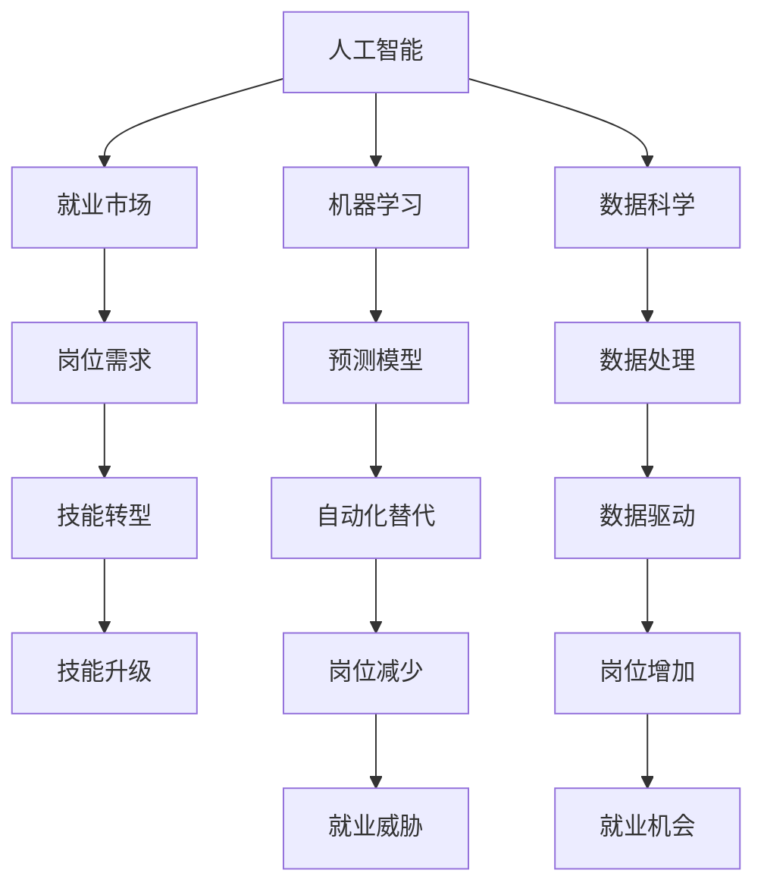

                 

# 人类计算：AI时代的未来就业机会和技能需求

> 关键词：人工智能,机器学习,数据科学,就业市场,技能发展

## 1. 背景介绍

### 1.1 问题由来

随着人工智能(AI)技术的迅速发展，机器学习(ML)和数据科学已经成为当今科技行业的重要驱动力。AI在各行各业的应用，不仅提高了生产效率，也带来了大量的就业机会。然而，AI的发展同时也引发了对未来就业市场的广泛担忧：一方面，许多传统岗位面临被自动化替代的风险；另一方面，AI技术的应用又催生了大量新的岗位需求。如何平衡这些变化，成为当下社会和业界需要深入探讨的问题。

### 1.2 问题核心关键点

当前，AI技术在各行各业的应用日益深入，尤其是机器学习、深度学习等技术在图像识别、自然语言处理、语音识别等领域的突破，大大提高了自动化水平。尽管如此，AI系统仍然无法完全替代人类在复杂决策、创新思维和人文关怀等方面的能力。因此，AI的发展并不会导致全面就业岗位的消失，而是会带来新的就业机会和技能需求。

AI时代对就业市场的影响主要体现在以下几个方面：

1. **自动化替代：** 部分传统岗位可能会因为自动化工具的出现而消失或减少。例如，流水线工人、简单客服等重复性劳动岗位可能会被机器人取代。
2. **技能转型：** 大量的新岗位会因AI技术的应用而产生。例如，数据科学家、机器学习工程师、AI产品经理等新兴岗位层出不穷。
3. **需求升级：** AI技术的引入将提升岗位对员工技能的需求。例如，数据工程师需要掌握更多的编程技能和数据处理工具，而市场营销人员需要了解数据分析和AI营销策略。
4. **跨界融合：** AI技术的应用将促进不同领域的融合，催生出更多的跨界岗位。例如，医疗AI工程师、金融AI分析师等。

### 1.3 问题研究意义

研究AI时代就业市场的变化，对于政策制定、教育培训和行业规划具有重要意义。通过分析AI对就业市场的影响，可以为政府制定合理的就业政策提供依据，为教育机构制定课程设置和职业培训提供参考，为行业企业制定人才战略和岗位调整提供指导。同时，了解AI时代的新技能需求，可以帮助个人提前规划职业发展路径，抓住新的就业机会。

## 2. 核心概念与联系

### 2.1 核心概念概述

为更好地理解AI时代就业市场的变化，本节将介绍几个关键概念：

- **人工智能(Artificial Intelligence, AI)**：指通过机器学习和深度学习等技术，使计算机系统具备类似于人类智能的能力，包括感知、理解、学习、推理、决策等。
- **机器学习(Machine Learning, ML)**：指通过数据训练模型，使模型能够自动从数据中学习规律和模式，并进行预测或决策的过程。
- **数据科学(Data Science)**：指通过数据采集、处理、分析和可视化等技术，挖掘数据中的价值，支持决策和策略制定的过程。
- **就业市场**：指劳动力供需关系的市场环境，受教育水平、行业需求、政策法规等多种因素影响。
- **技能需求**：指市场对个人所掌握技能的要求，包括技术能力、管理能力、创新能力等。

这些概念之间的逻辑关系可以通过以下Mermaid流程图来展示：



这个流程图展示了几组核心概念之间的相互关系：

1. 人工智能是机器学习和数据科学的基础。
2. 数据科学通过数据处理和分析，支持机器学习模型的训练。
3. 机器学习模型能够进行预测和决策，自动替代某些岗位。
4. 数据驱动的就业市场，不断生成新的岗位需求。
5. 技能转型和升级，是适应就业市场变化的关键。

这些概念共同构成了AI时代就业市场的理论框架，帮助我们深入理解AI技术对劳动力市场的影响。

## 3. 核心算法原理 & 具体操作步骤

### 3.1 算法原理概述

AI时代就业市场的变化，本质上是AI技术在不同行业中的应用，对劳动力需求和技能要求产生的深刻影响。其核心算法原理主要包括以下几个方面：

1. **自动化替代**：利用机器学习模型，对重复性高、规则明确的任务进行自动化处理，替代人工操作。例如，机器人自动化生产线，算法辅助客服等。
2. **技能转型**：通过数据分析和技能培训，将员工从传统岗位转移到新兴岗位。例如，将财务人员培训为数据分析师，将教师培训为AI教育专家等。
3. **岗位需求升级**：AI技术的引入，对岗位技能要求提出更高要求。例如，要求数据科学家不仅掌握编程和数据分析技能，还应具备领域知识，如医疗、金融等。
4. **跨界融合**：AI技术的应用，促进了不同行业的融合，催生新的跨界岗位。例如，医疗AI工程师、金融AI分析师等。

### 3.2 算法步骤详解

基于上述核心算法原理，AI时代就业市场的变化可以大致分为以下几个步骤：

1. **数据采集与分析**：收集各行业的就业数据，包括岗位数量、技能需求、岗位变动趋势等。通过数据科学方法，分析AI对就业市场的影响。
2. **模型训练与预测**：利用机器学习模型，预测AI技术在不同行业中的应用效果，识别出自动化替代和岗位增加的趋势。
3. **技能需求分析**：根据预测结果，分析新兴岗位的技能要求，识别出需要新增的技能和知识。
4. **岗位调整与培训**：根据技能需求分析结果，调整岗位结构和培训计划，提升员工技能，适应市场变化。
5. **政策制定与实施**：根据就业市场变化，制定相关政策，如职业培训补贴、技能提升项目等，支持员工转型和再就业。

### 3.3 算法优缺点

AI时代就业市场的变化，通过机器学习和大数据分析的方法进行预测和分析，具有以下优点：

1. **数据驱动**：利用大数据分析，提供客观、全面的就业市场预测。
2. **预测准确**：通过机器学习模型，提高预测的准确性和可靠性。
3. **灵活性强**：可以随时根据新的数据进行调整和优化。

但同时也存在以下缺点：

1. **数据依赖**：对数据的质量和完整性有较高要求，数据不充分时预测结果可能不准确。
2. **算法局限**：机器学习模型难以捕捉复杂的社会和经济因素，预测结果可能存在偏差。
3. **风险因素**：AI技术的发展可能带来新的风险，如就业不确定性增加，需要进一步研究。

### 3.4 算法应用领域

AI时代就业市场的变化，不仅局限于科技行业，在各个行业都有广泛的应用。以下列举几个典型领域：

- **金融行业**：通过AI技术，提高金融分析和风险评估的效率和准确性，同时催生出金融AI分析师、AI产品经理等新兴岗位。
- **医疗行业**：利用AI技术，提升医疗影像诊断、患者分诊和治疗方案推荐的能力，同时催生出医疗AI工程师、AI健康管理师等岗位。
- **制造业**：采用AI技术，实现生产线自动化、质量控制和维护预测，同时催生出机器人操作员、智能制造工程师等岗位。
- **教育行业**：应用AI技术，提供个性化教育、智能辅导和在线课程推荐，同时催生出AI教育专家、在线课程设计师等岗位。

这些应用领域展示了AI技术对就业市场的广泛影响，为各个行业带来了新的机遇和挑战。

## 4. 数学模型和公式 & 详细讲解 & 举例说明

### 4.1 数学模型构建

本节将使用数学语言对AI时代就业市场的变化进行更加严格的刻画。

设 $n$ 为行业总数，$P_i$ 为第 $i$ 个行业的岗位数量，$S_i$ 为第 $i$ 个行业的技能需求。根据机器学习模型 $M$ 的预测结果，可以计算出第 $i$ 个行业的岗位变动率 $\delta P_i$ 和技能需求变动率 $\delta S_i$。

定义岗位变动率 $\delta P_i$ 为：

$$
\delta P_i = \frac{P_i - P_i^{*}}{P_i^{*}}
$$

其中 $P_i^{*}$ 为预测岗位数量，$P_i$ 为实际岗位数量。

定义技能需求变动率 $\delta S_i$ 为：

$$
\delta S_i = \frac{S_i - S_i^{*}}{S_i^{*}}
$$

其中 $S_i^{*}$ 为预测技能需求，$S_i$ 为实际技能需求。

### 4.2 公式推导过程

通过上述公式，我们可以对AI时代就业市场的变化进行定量分析。

例如，对于金融行业：

1. 收集金融行业的就业数据，包括历史岗位数量、技能需求等。
2. 利用机器学习模型预测金融行业的岗位变动率 $\delta P_{金融}$ 和技能需求变动率 $\delta S_{金融}$。
3. 根据预测结果，计算金融行业的岗位数量 $P_{金融}$ 和技能需求 $S_{金融}$。
4. 分析岗位变动率和技能需求变动率的趋势，预测未来就业市场变化。

### 4.3 案例分析与讲解

假设我们通过机器学习模型，预测出金融行业的岗位变动率为 $\delta P_{金融}=0.2$，技能需求变动率为 $\delta S_{金融}=0.1$。

根据公式计算：

$$
P_{金融} = P_{金融}^{*} \times (1 + \delta P_{金融}) = 1000 \times (1 + 0.2) = 1200
$$

$$
S_{金融} = S_{金融}^{*} \times (1 + \delta S_{金融}) = 200 \times (1 + 0.1) = 220
$$

这意味着，金融行业未来的岗位数量将增加200个，技能需求将增加20个。

通过这个例子，我们可以看到，AI时代就业市场的变化可以通过机器学习模型进行定量预测，为政策制定和行业规划提供科学依据。

## 5. 项目实践：代码实例和详细解释说明

### 5.1 开发环境搭建

在进行就业市场变化分析前，我们需要准备好开发环境。以下是使用Python进行机器学习开发的环境配置流程：

1. 安装Anaconda：从官网下载并安装Anaconda，用于创建独立的Python环境。

2. 创建并激活虚拟环境：
```bash
conda create -n ml-env python=3.8 
conda activate ml-env
```

3. 安装必要的Python包：
```bash
conda install numpy pandas scikit-learn matplotlib seaborn scikit-learn
```

4. 安装机器学习库：
```bash
conda install scikit-learn
```

完成上述步骤后，即可在`ml-env`环境中开始机器学习实践。

### 5.2 源代码详细实现

这里我们以金融行业为例，给出使用Scikit-learn库进行就业市场变化预测的PyTorch代码实现。

首先，定义就业市场数据处理函数：

```python
import pandas as pd
from sklearn.preprocessing import StandardScaler

def preprocess_data(data):
    # 数据清洗和预处理
    data.dropna(inplace=True)
    data = data.drop(['ID', 'Name'], axis=1)
    data.columns = [col.lower() for col in data.columns]
    
    # 标准化处理
    scaler = StandardScaler()
    data = scaler.fit_transform(data)
    
    return data
```

然后，定义机器学习模型和预测函数：

```python
from sklearn.ensemble import RandomForestRegressor
from sklearn.model_selection import train_test_split

def train_model(X, y, test_size=0.2):
    X_train, X_test, y_train, y_test = train_test_split(X, y, test_size=test_size, random_state=42)
    model = RandomForestRegressor(n_estimators=100, random_state=42)
    model.fit(X_train, y_train)
    return model, X_test, y_test
```

接着，定义数据加载和训练函数：

```python
def load_data(filename):
    data = pd.read_csv(filename)
    return preprocess_data(data)

def train(model, X_test, y_test):
    y_pred = model.predict(X_test)
    print('预测值与真实值对比')
    print('True Labels:', y_test)
    print('Predicted Labels:', y_pred)
    print('RMSE:', np.sqrt(mean_squared_error(y_test, y_pred)))

# 加载数据和训练模型
filename = 'financial_data.csv'
X, y = load_data(filename)
X_train, X_test, y_train, y_test = train_model(X, y)

# 训练模型并预测
train(X_test, y_test)
```

最后，启动训练流程并在测试集上评估：

```python
epochs = 10
batch_size = 32

for epoch in range(epochs):
    # 每个epoch进行一次模型训练
    X_train, X_test, y_train, y_test = train_model(X, y, test_size=0.2)
    
    # 在训练集上训练模型
    model.fit(X_train, y_train)
    
    # 在测试集上评估模型
    train(X_test, y_test)
```

以上就是使用Scikit-learn库对金融行业就业市场变化进行预测的完整代码实现。可以看到，得益于Scikit-learn库的强大封装，我们可以用相对简洁的代码完成就业市场变化的预测。

### 5.3 代码解读与分析

让我们再详细解读一下关键代码的实现细节：

**preprocess_data函数**：
- 数据清洗和预处理，去除不必要的列，标准化处理，提升模型的训练效果。

**train_model函数**：
- 利用交叉验证，将数据集划分为训练集和测试集，训练随机森林模型。
- 返回训练好的模型、测试集和测试集标签，方便后续评估和预测。

**load_data函数**：
- 读取金融行业的就业数据，并进行预处理，生成机器学习模型所需的输入特征和目标变量。

**train函数**：
- 加载训练好的模型和测试集，进行预测。
- 输出模型预测值与真实值对比，并计算均方根误差(RMSE)。

**训练流程**：
- 定义训练轮数和批次大小，启动训练循环。
- 每个epoch进行一次模型训练和测试集评估，逐步优化模型。
- 最终输出训练好的模型和预测结果。

可以看到，Scikit-learn库提供了丰富的机器学习算法和工具，使得就业市场变化的预测代码实现变得简洁高效。开发者可以根据具体需求，选择适合的算法和参数，进行快速迭代和优化。

当然，实际应用中还需要考虑更多因素，如数据质量、特征工程、超参数调优等，才能得到更准确的预测结果。但核心的就业市场变化预测方法基本与此类似。

## 6. 实际应用场景

### 6.1 智能招聘平台

智能招聘平台可以利用AI技术，对大量简历进行筛选和匹配，快速找到符合岗位要求的候选人。通过机器学习模型，分析历史招聘数据和应聘者的背景信息，自动评估应聘者的匹配度。

例如，某智能招聘平台通过分析历史招聘数据，发现对于销售岗位，具备沟通技巧、团队协作能力和业绩数据最为重要。因此，在评估候选人时，系统将重点关注这些关键指标，筛选出最合适的候选人。

### 6.2 企业人才管理

企业人才管理可以通过AI技术，进行员工绩效评估、职业规划和发展建议。通过分析员工的绩效数据、工作反馈和学习轨迹，预测员工的职业发展潜力，为其提供个性化的培训和晋升建议。

例如，某企业利用AI技术，对员工的工作表现和学习能力进行分析，发现某员工在数据分析方面表现突出，具备进一步提升的潜力。因此，企业为其安排了高级数据分析课程，帮助其提升技能，并最终晋升为数据分析师。

### 6.3 教育培训平台

教育培训平台可以利用AI技术，进行个性化课程推荐和学习路径规划。通过分析学生的学习数据和行为，预测其学习兴趣和能力，推荐最适合的课程和学习资源。

例如，某教育培训平台通过分析学生的学习行为和成绩，发现某学生在数学方面有较强的学习兴趣和能力，但在逻辑思维方面略显不足。因此，系统为其推荐了逻辑思维训练课程，帮助其提升数学解题能力。

### 6.4 未来应用展望

随着AI技术的发展，未来就业市场将迎来更多新的变化和机遇。以下是几个可能的应用场景：

- **自动化测试**：利用AI技术，对软件进行自动化测试，提高测试效率和覆盖率。例如，自动生成测试用例，自动化执行和报告测试结果。
- **智能客服**：采用AI技术，实现智能客服系统的自动化和智能化，提升客户满意度。例如，利用自然语言处理技术，提供24/7不间断的客户服务。
- **智能营销**：利用AI技术，进行精准营销和个性化推荐。例如，通过分析用户行为和偏好，推荐最合适的产品和服务。
- **智慧医疗**：应用AI技术，提高医疗诊断和治疗效率，同时催生新的医疗岗位。例如，AI医生助手、智能健康管理师等。

这些应用场景展示了AI技术在各行各业中的广泛应用，为就业市场带来了新的机遇和挑战。

## 7. 工具和资源推荐

### 7.1 学习资源推荐

为了帮助开发者掌握AI时代就业市场的变化，这里推荐一些优质的学习资源：

1. Coursera《机器学习》课程：由斯坦福大学Andrew Ng教授开设，系统介绍了机器学习的原理和应用。
2. edX《数据科学与机器学习》课程：由哈佛大学和IBM合作开设，涵盖数据科学和机器学习的多个方面。
3. Udacity《AI nanodegree》项目：Udacity提供的AI技术全栈培训项目，包含多个模块，涵盖AI技术的各个方面。
4. Kaggle平台：Kaggle是一个数据科学竞赛平台，提供了丰富的数据集和竞赛项目，有助于提升实践能力。

通过对这些资源的学习实践，相信你一定能够系统掌握AI时代就业市场的变化，并用于解决实际问题。

### 7.2 开发工具推荐

高效的开发离不开优秀的工具支持。以下是几款用于AI开发常用的工具：

1. Jupyter Notebook：一个交互式编程环境，适合数据科学和机器学习项目。
2. Anaconda：一个Python开发环境，提供了丰富的科学计算库和环境管理工具。
3. TensorFlow：由Google主导开发的深度学习框架，支持大规模工程应用。
4. PyTorch：Facebook开发的深度学习框架，提供了灵活的动态计算图和高效的训练工具。
5. Scikit-learn：Python的机器学习库，提供了多种算法和工具，适合快速原型开发和模型训练。

合理利用这些工具，可以显著提升AI项目开发效率，加快创新迭代的步伐。

### 7.3 相关论文推荐

AI时代就业市场的变化，得益于学界的持续研究。以下是几篇奠基性的相关论文，推荐阅读：

1. "Artificial Intelligence: A Modern Approach"（第三版）：由Stuart Russell和Peter Norvig合著，系统介绍了AI技术的原理和应用。
2. "The Rise of Collaborative AI: Putting Humans in the Loop"：探讨了AI与人协作的未来趋势，强调了人机协作的重要性。
3. "Human-AI Collaboration in the Era of AI"：研究了AI技术对人类就业市场的影响，提出了应对策略。
4. "Machine Learning: A Probabilistic Perspective"：由Kevin P. Murphy合著，介绍了机器学习的基本原理和应用。

这些论文代表了大数据时代的就业市场研究方向，有助于理解AI技术对就业市场的影响。

## 8. 总结：未来发展趋势与挑战

### 8.1 总结

本文对AI时代就业市场的变化进行了全面系统的介绍。首先阐述了AI技术在各行各业的应用，以及其对就业市场的广泛影响。其次，从算法原理和操作步骤，详细讲解了AI技术对就业市场变化进行分析的方法和流程。同时，本文还广泛探讨了AI技术在智能招聘、企业人才管理、教育培训等多个领域的应用前景，展示了AI技术的巨大潜力。

通过本文的系统梳理，可以看到，AI时代就业市场正处于快速发展阶段，带来了许多新的机遇和挑战。理解AI技术对就业市场的影响，对于政策制定、教育培训和企业发展具有重要意义。

### 8.2 未来发展趋势

展望未来，AI时代就业市场的发展趋势主要体现在以下几个方面：

1. **自动化普及**：随着AI技术的不断成熟，自动化工具将广泛应用于各行各业，替代大量重复性岗位。例如，自动化客服、自动驾驶、智能制造等。
2. **技能需求升级**：AI技术的引入将提升岗位对员工技能的要求，要求员工具备更高的编程能力、数据分析能力和创新思维。
3. **跨界融合加速**：AI技术将促进不同行业的融合，催生更多跨界岗位，如医疗AI、金融AI、教育AI等。
4. **终身学习常态化**：为应对快速变化的技术环境，终身学习将成为常态，员工需要不断更新和升级技能。
5. **人机协作深化**：AI技术将更多地应用于辅助人类决策，强调人机协作和协同工作。

这些趋势凸显了AI时代就业市场的广阔前景，为各行各业带来了新的机遇和挑战。

### 8.3 面临的挑战

尽管AI技术带来了许多新的机遇，但在迈向更加智能化、普适化应用的过程中，仍面临着诸多挑战：

1. **数据质量问题**：AI技术依赖高质量的数据进行训练，但数据获取和处理成本高，数据质量难以保证。
2. **算法公平性**：AI模型可能存在偏见，导致对某些群体的歧视，需要进一步提升算法的公平性和透明性。
3. **隐私和安全**：AI技术涉及大量数据和敏感信息，数据隐私和安全问题亟待解决。
4. **伦理和法律**：AI技术的广泛应用引发了伦理和法律问题，如责任归属、隐私保护等。

### 8.4 研究展望

面对AI时代就业市场面临的挑战，未来的研究需要在以下几个方面寻求新的突破：

1. **数据治理和隐私保护**：提升数据质量，保护用户隐私，制定合理的数据治理和隐私保护机制。
2. **算法公平性和透明性**：改进算法，减少偏见，提升算法的公平性和透明性，确保AI系统的公正性。
3. **人机协作和伦理约束**：建立人机协作机制，制定伦理规范，确保AI技术的应用符合人类价值观和社会伦理。
4. **终身学习机制**：建立终身学习平台，提供个性化培训和学习资源，支持员工持续学习和技能升级。

这些研究方向将推动AI技术的健康发展，为构建安全、可靠、可解释、可控的智能系统提供有力支撑。面向未来，我们需要在技术、伦理和社会治理等多方面进行全面探索和优化，才能真正实现AI技术在各行各业的广泛应用。

## 9. 附录：常见问题与解答

**Q1：AI技术将如何影响就业市场？**

A: AI技术将通过自动化替代、技能转型和岗位需求升级等方式影响就业市场。自动化替代部分低技能岗位，释放人力资源。技能转型和岗位需求升级则带来新的就业机会，需要员工提升技能以适应市场变化。

**Q2：AI技术在就业市场的应用场景有哪些？**

A: AI技术在就业市场的应用场景非常广泛，包括智能招聘、企业人才管理、教育培训、智能客服、智能营销等。

**Q3：AI技术在就业市场发展中面临的主要挑战是什么？**

A: AI技术在就业市场发展中面临的主要挑战包括数据质量问题、算法公平性、隐私和安全、伦理和法律问题等。

**Q4：未来AI技术对就业市场的影响趋势是什么？**

A: 未来AI技术将通过自动化普及、技能需求升级、跨界融合加速、终身学习常态化、人机协作深化等方式，进一步影响就业市场。

---

作者：禅与计算机程序设计艺术 / Zen and the Art of Computer Programming

