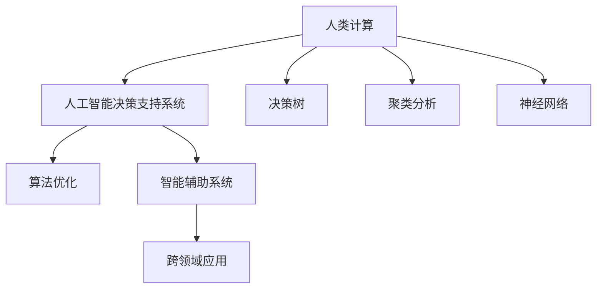

                 

# 人类计算：在AI时代增强决策

> 关键词：人类计算, 人工智能, 决策增强, 算法优化, 自动化, 智能辅助

## 1. 背景介绍

### 1.1 问题由来
在现代社会的决策过程中，信息量大、种类多、处理速度要求高、决策复杂度增加等问题日益凸显。传统人类决策面临的挑战愈发严峻，如何在有限的时间内做出高效、准确、科学的决策成为重大的社会课题。与此同时，人工智能技术的迅猛发展，尤其是深度学习、大数据分析等技术，为增强决策提供了新的可能。因此，本文将从人类计算的角度，探讨在AI时代如何更好地辅助和增强决策，从而提升决策的科学性和效率。

### 1.2 问题核心关键点
本文将重点讨论以下几个核心关键点：
- **人类计算的原理**：如何通过人工智能技术，对海量数据进行有效处理和分析，为决策提供科学依据。
- **决策增强方法**：基于人工智能技术的决策辅助工具，如何提升决策质量和效率。
- **算法优化策略**：如何优化算法和模型，以适应不同情境下的决策需求。
- **智能辅助系统的设计**：如何将人工智能技术与决策流程相结合，构建高效的智能辅助系统。

### 1.3 问题研究意义
研究人类计算和决策增强的算法和系统，对于提升人类决策的科学性、效率和可靠性具有重要意义：

1. **提升决策质量**：AI技术能够帮助人类处理复杂的数据，提取有价值的信息，提高决策的准确性和合理性。
2. **优化决策过程**：通过自动化、智能化的手段，加速决策流程，提升决策效率。
3. **支持多层次决策**：AI辅助系统能够适应不同层级的决策需求，从战略规划到战术执行，提供全方位的支持。
4. **支持跨领域决策**：AI技术能够在多个领域内提供决策支持，如金融、医疗、教育等，推动各行各业的发展。
5. **促进决策科学化**：通过AI技术，将定性分析和定量分析有机结合，推动决策科学化、系统化。

## 2. 核心概念与联系

### 2.1 核心概念概述

为更好地理解人类计算和决策增强，本节将介绍几个密切相关的核心概念：

- **人类计算**：利用计算机技术和人工智能方法，对人类决策过程中的数据进行处理、分析和挖掘，辅助人类做出决策的过程。
- **人工智能决策支持系统**：通过构建智能化的辅助决策系统，集成数据处理、模式识别、预测分析等功能，帮助决策者更好地理解和预测未来趋势，做出决策。
- **算法优化**：针对决策问题，优化算法和模型，提升计算效率和决策准确性。
- **智能辅助系统**：结合人工智能技术与决策流程，构建的辅助决策系统，能自动化处理日常决策任务，减少人为错误，提高决策效率。
- **跨领域应用**：AI技术在不同领域（如金融、医疗、教育等）中的应用，以解决特定领域的决策问题。
- **决策树、聚类分析、神经网络**：常用的决策分析方法，通过算法优化，提升决策支持系统的性能。

这些核心概念之间的逻辑关系可以通过以下Mermaid流程图来展示：



这个流程图展示出人类计算的核心概念及其之间的关系：

1. 人类计算通过人工智能技术辅助决策。
2. 决策支持系统集成算法优化，提升系统性能。
3. 智能辅助系统进一步自动化决策流程。
4. 跨领域应用拓展AI技术的应用场景。
5. 决策树、聚类分析和神经网络等算法工具，为决策支持提供技术支持。

## 3. 核心算法原理 & 具体操作步骤
### 3.1 算法原理概述

在人类计算和决策增强的框架下，核心算法原理可以概括为：

- **数据收集与预处理**：从多种来源收集决策所需的数据，并进行清洗、格式化和整合，以供后续分析使用。
- **特征提取与分析**：利用机器学习算法，对数据进行特征提取和分析，形成可用的信息表示。
- **模型训练与优化**：通过深度学习、强化学习等方法，对模型进行训练和优化，提升其预测和决策能力。
- **结果评估与反馈**：对模型的输出结果进行评估，并根据反馈进行模型的调整和优化。
- **决策辅助与执行**：利用训练好的模型，对现实世界中的决策问题进行分析和建议，辅助人类进行决策。

### 3.2 算法步骤详解

基于上述算法原理，决策增强的具体操作步骤可以归纳为以下五个步骤：

**Step 1: 数据收集与预处理**
- 确定决策目标，收集相关数据，包括结构化数据（如财务报表、人口统计信息）和非结构化数据（如新闻报道、社交媒体评论）。
- 对数据进行清洗和预处理，包括去除噪声、填补缺失值、归一化等。
- 对文本数据进行分词、词性标注、实体识别等处理。

**Step 2: 特征提取与分析**
- 使用TF-IDF、Word2Vec等方法对文本数据进行向量化。
- 利用聚类分析、主成分分析等方法对特征进行降维和筛选。
- 对特征进行分析，提取有价值的统计信息、模式和规律。

**Step 3: 模型训练与优化**
- 选择合适的模型架构（如深度神经网络、决策树等）。
- 将数据分为训练集、验证集和测试集。
- 使用优化算法（如Adam、SGD）对模型进行训练，调整超参数（如学习率、正则化系数）。
- 使用交叉验证等方法评估模型性能，防止过拟合。

**Step 4: 结果评估与反馈**
- 对模型在测试集上的表现进行评估，计算准确率、召回率等指标。
- 根据评估结果，调整模型参数和架构。
- 进行多轮迭代，不断优化模型性能。

**Step 5: 决策辅助与执行**
- 将训练好的模型集成到决策支持系统中。
- 对实时数据进行特征提取和分析，得到模型输出。
- 将模型输出与领域专家的经验和知识相结合，辅助决策者做出决策。
- 对决策结果进行监控和评估，根据反馈调整模型。

### 3.3 算法优缺点

决策增强的算法具有以下优点：
- **高效性**：通过自动化处理数据和分析，大大提升决策效率。
- **准确性**：利用机器学习算法，提高决策的准确性和科学性。
- **可扩展性**：适应不同规模和复杂度的决策问题。
- **灵活性**：支持多种数据源和决策场景。

同时，该算法也存在一定的局限性：
- **数据依赖**：决策质量很大程度上取决于数据的质量和数量。
- **模型复杂性**：复杂的模型需要更多的计算资源和时间进行训练和优化。
- **解释性不足**：机器学习模型的决策过程通常缺乏可解释性，难以理解和调试。
- **领域知识**：机器学习模型需要与领域专家的知识相结合，才能做出高质量的决策。

尽管存在这些局限性，但就目前而言，决策增强的算法是提高决策效率和质量的重要手段，具有广泛的应用前景。未来相关研究将侧重于降低数据依赖、提升模型可解释性、结合领域知识等方向。

### 3.4 算法应用领域

决策增强的算法在多个领域中得到了广泛应用，例如：

- **金融风险管理**：利用AI技术进行信用评估、风险预测、投资决策等。
- **医疗诊断与治疗**：使用AI技术进行疾病诊断、治疗方案推荐、药物研发等。
- **教育评估与个性化学习**：通过AI技术进行学生评估、课程推荐、学习路径规划等。
- **供应链管理**：使用AI技术进行需求预测、库存管理、物流优化等。
- **智能制造**：利用AI技术进行生产流程优化、设备维护、质量控制等。

除了上述这些经典领域外，决策增强的算法也在更多场景中得到创新性应用，如智能城市、智慧农业、能源管理等，为各个行业的决策提供科学支持。

## 4. 数学模型和公式 & 详细讲解 & 举例说明

### 4.1 数学模型构建

本节将使用数学语言对决策增强的算法过程进行更加严格的刻画。

记决策问题为 $P$，相关数据集为 $D=\{(x_i, y_i)\}_{i=1}^N$，其中 $x_i$ 为特征向量，$y_i$ 为标签向量。决策目标是构建一个模型 $M$，使得 $M$ 在数据集 $D$ 上的性能最佳。模型的预测结果为 $M(x)$。

定义损失函数 $L$，用于衡量模型的预测结果与实际标签之间的差异。常用的损失函数包括均方误差损失（MSE）和交叉熵损失（CE）。

决策增强的数学模型可以表示为：

$$
\min_{M} \mathcal{L}(M, D)
$$

其中 $\mathcal{L}$ 为损失函数。

### 4.2 公式推导过程

以交叉熵损失为例，推导决策模型的训练公式。

假设模型 $M$ 在特征 $x$ 上的预测结果为 $\hat{y}=M(x)$，真实标签为 $y \in \{0,1\}$。则交叉熵损失定义为：

$$
\ell(M(x),y) = -[y\log \hat{y} + (1-y)\log(1-\hat{y})]
$$

将其代入经验风险公式，得：

$$
\mathcal{L}(M) = -\frac{1}{N}\sum_{i=1}^N [y_i\log M(x_i)+(1-y_i)\log(1-M(x_i))]
$$

根据梯度下降等优化算法，模型的参数更新公式为：

$$
\theta \leftarrow \theta - \eta \nabla_{\theta}\mathcal{L}(\theta) - \eta\lambda\theta
$$

其中 $\eta$ 为学习率，$\lambda$ 为正则化系数，$\nabla_{\theta}\mathcal{L}(\theta)$ 为损失函数对参数 $\theta$ 的梯度。

### 4.3 案例分析与讲解

以信用评估为例，分析如何使用AI技术进行决策增强。

假设要构建一个信用评估模型，以预测客户的违约概率。现有数据集包含客户的个人信息、财务状况、历史还款记录等。通过数据预处理和特征提取，将数据表示为模型输入。然后，使用决策树、神经网络等算法对模型进行训练，得到预测结果。

在训练过程中，选择合适的损失函数（如交叉熵），并使用优化算法（如Adam）进行模型参数的更新。同时，为了防止过拟合，可以引入正则化技术（如L2正则化）。

模型训练完成后，在测试集上评估模型的性能，计算准确率、召回率等指标。根据评估结果，调整模型参数，进行多轮迭代优化，直到达到满意的性能。

最后，将训练好的模型集成到决策支持系统中，利用实时数据进行特征提取和预测，辅助银行进行客户信用评估。

## 5. 项目实践：代码实例和详细解释说明
### 5.1 开发环境搭建

在进行决策增强项目实践前，我们需要准备好开发环境。以下是使用Python进行PyTorch开发的环境配置流程：

1. 安装Anaconda：从官网下载并安装Anaconda，用于创建独立的Python环境。

2. 创建并激活虚拟环境：
```bash
conda create -n pytorch-env python=3.8 
conda activate pytorch-env
```

3. 安装PyTorch：根据CUDA版本，从官网获取对应的安装命令。例如：
```bash
conda install pytorch torchvision torchaudio cudatoolkit=11.1 -c pytorch -c conda-forge
```

4. 安装TensorFlow：
```bash
conda install tensorflow
```

5. 安装各类工具包：
```bash
pip install numpy pandas scikit-learn matplotlib tqdm jupyter notebook ipython
```

完成上述步骤后，即可在`pytorch-env`环境中开始项目实践。

### 5.2 源代码详细实现

这里以信用评估为例，给出使用PyTorch进行决策增强的代码实现。

首先，定义数据处理函数：

```python
import pandas as pd
import numpy as np
from sklearn.model_selection import train_test_split
from sklearn.preprocessing import StandardScaler

def load_data(file_path):
    data = pd.read_csv(file_path)
    features = data.drop('default', axis=1)
    labels = data[['default']]
    features = StandardScaler().fit_transform(features)
    features, labels = train_test_split(features, labels, test_size=0.2, random_state=42)
    return features, labels
```

然后，定义模型和优化器：

```python
from torch import nn
from torch.nn import CrossEntropyLoss
from torch.optim import Adam

class Model(nn.Module):
    def __init__(self, input_size, hidden_size, output_size):
        super(Model, self).__init__()
        self.fc1 = nn.Linear(input_size, hidden_size)
        self.fc2 = nn.Linear(hidden_size, hidden_size)
        self.fc3 = nn.Linear(hidden_size, output_size)

    def forward(self, x):
        x = nn.functional.relu(self.fc1(x))
        x = nn.functional.relu(self.fc2(x))
        x = self.fc3(x)
        return x

model = Model(input_size=features.shape[1], hidden_size=64, output_size=1)
criterion = CrossEntropyLoss()
optimizer = Adam(model.parameters(), lr=0.001)
```

接着，定义训练和评估函数：

```python
def train_epoch(model, features, labels, optimizer, criterion):
    model.train()
    loss = 0
    for i, (inputs, labels) in enumerate(zip(features, labels)):
        inputs, labels = inputs.to(device), labels.to(device)
        optimizer.zero_grad()
        outputs = model(inputs)
        loss += criterion(outputs, labels).item()
        outputs.backward()
        optimizer.step()
    return loss / len(features)

def evaluate(model, features, labels, criterion):
    model.eval()
    with torch.no_grad():
        outputs = model(features)
        loss = criterion(outputs, labels)
    return loss
```

最后，启动训练流程并在测试集上评估：

```python
epochs = 10
device = torch.device('cuda' if torch.cuda.is_available() else 'cpu')

for epoch in range(epochs):
    train_loss = train_epoch(model, features, labels, optimizer, criterion)
    print(f'Epoch {epoch+1}, train loss: {train_loss:.4f}')
    
    test_loss = evaluate(model, features, labels, criterion)
    print(f'Epoch {epoch+1}, test loss: {test_loss:.4f}')
    
print(f'Final test loss: {test_loss:.4f}')
```

以上就是使用PyTorch进行信用评估决策增强的完整代码实现。可以看到，通过简单的代码编写，我们就能构建并训练一个决策模型，进行实时数据预测。

### 5.3 代码解读与分析

让我们再详细解读一下关键代码的实现细节：

**load_data函数**：
- 用于加载和预处理数据，包括特征提取、标准化、分割为训练集和测试集。

**Model类**：
- 定义了决策模型的结构，包括三个全连接层。
- 通过前向传播计算模型输出，返回预测结果。

**train_epoch函数**：
- 在每个epoch中，对模型进行前向传播和反向传播，更新模型参数。
- 计算损失函数，并返回epoch内的平均损失。

**evaluate函数**：
- 对模型进行前向传播，计算损失函数，返回测试集上的平均损失。

**训练流程**：
- 定义总的epoch数和设备（CPU或GPU）。
- 在每个epoch内，先进行训练，输出训练集的平均损失。
- 在验证集上评估，输出验证集的平均损失。
- 输出最终测试集的平均损失。

可以看到，通过PyTorch提供的高级API，我们可以方便地构建和训练决策模型。同时，利用sklearn的特征提取和处理工具，使得数据预处理和模型训练过程更加高效和灵活。

## 6. 实际应用场景
### 6.1 智能客服系统

基于AI技术的智能客服系统，可以极大地提升客户服务的效率和质量。智能客服通过收集客户历史对话记录，学习客户的常见问题和需求，自动生成应答模板。当客户提出新问题时，智能客服系统能够快速理解问题，提供准确的答案。

在技术实现上，可以构建基于大模型的自然语言处理模型，使用微调技术进行客户对话语料的处理。微调后的模型能够理解自然语言，自动提取客户意图和问题，从而快速生成合适的应答模板。同时，系统可以实时收集客户的反馈，不断优化模型，提升应答的准确性和自然度。

### 6.2 金融风险管理

金融行业面临着复杂多变的市场环境和风险因素，决策支持系统对于风险管理至关重要。通过构建基于AI的决策模型，银行和保险公司能够更准确地评估客户的信用风险和理赔风险。

具体而言，可以收集客户的个人信息、财务状况、历史交易记录等数据，构建预测模型，预测客户的违约概率和理赔风险。微调后的模型能够实时处理客户的申请和查询，提供风险评估报告，辅助决策者进行贷款审批和理赔审核。

### 6.3 教育评估与个性化学习

教育评估和个性化学习是提升教育质量的重要手段。通过AI技术，教育机构能够对学生的学习行为和成绩进行全面分析，发现学习障碍和不足，提供个性化的学习建议。

具体实现上，可以收集学生的作业、考试、课堂表现等数据，使用AI技术进行特征提取和分析。通过训练决策模型，预测学生的学习效果和兴趣，生成个性化的学习计划和推荐课程。同时，智能辅助系统能够根据学生的实时表现，动态调整学习内容和进度，提升学习效果。

### 6.4 未来应用展望

随着AI技术的不断发展，决策增强在更多领域中得到应用，前景广阔：

- **智慧城市管理**：通过构建基于AI的城市管理模型，实现交通流量优化、环境监测、公共安全预警等功能，提升城市治理效率。
- **智能制造**：利用AI技术进行生产流程优化、设备维护、质量控制等，提高制造业的智能化水平。
- **医疗健康**：构建基于AI的疾病诊断和治疗方法推荐系统，提升医疗服务的质量和效率。
- **智能农业**：通过AI技术进行农田监测、作物管理、病虫害预警等，提高农业生产的智能化和精准化。

未来，随着数据的不断积累和算力的提升，AI技术将更广泛地应用到各个领域，为决策者提供更加全面、准确、可靠的决策支持。同时，AI技术也将更注重伦理和安全性，确保决策过程的透明和可解释性。

## 7. 工具和资源推荐
### 7.1 学习资源推荐

为了帮助开发者系统掌握决策增强的理论基础和实践技巧，这里推荐一些优质的学习资源：

1. **《Deep Learning for Decision Making》**：斯坦福大学开设的机器学习课程，涵盖了深度学习在决策支持中的应用。
2. **《Hands-On Machine Learning with Scikit-Learn, Keras, and TensorFlow》**：深度学习入门书籍，详细介绍了机器学习在决策分析中的应用。
3. **《Decision Making with Machine Learning》**：Kaggle上的决策分析教程，包含多个案例分析。
4. **《Artificial Intelligence for Decision Making》**：综合性的AI决策支持系统教程，涵盖各种AI技术在决策中的应用。

通过这些资源的学习实践，相信你一定能够快速掌握决策增强的精髓，并用于解决实际的决策问题。

### 7.2 开发工具推荐

高效的开发离不开优秀的工具支持。以下是几款用于决策增强开发的常用工具：

1. **PyTorch**：基于Python的开源深度学习框架，适合快速迭代研究。
2. **TensorFlow**：由Google主导开发的开源深度学习框架，生产部署方便。
3. **scikit-learn**：Python中的机器学习库，支持多种分类、回归、聚类算法。
4. **Keras**：高层次的深度学习API，易于上手，适合快速原型开发。
5. **Jupyter Notebook**：交互式编程环境，方便编写和分享代码。

合理利用这些工具，可以显著提升决策增强任务的开发效率，加快创新迭代的步伐。

### 7.3 相关论文推荐

决策增强的研究源于学界的持续研究。以下是几篇奠基性的相关论文，推荐阅读：

1. **"Deep Learning for Business Analytics"**：Yu Yao等，2018年，介绍了深度学习在业务分析中的应用。
2. **"Artificial Intelligence for Decision Making"**：Omar D. Lopez等，2018年，讨论了AI技术在决策支持中的应用。
3. **"Deep Learning-based Decision Support Systems: A Survey"**：Hanwen Liu等，2019年，综述了基于深度学习的决策支持系统。
4. **"Enhancing Decision Making with Machine Learning"**：Daniel J. Dale，2020年，探讨了机器学习在决策中的作用。

这些论文代表了大决策增强技术的发展脉络。通过学习这些前沿成果，可以帮助研究者把握学科前进方向，激发更多的创新灵感。

## 8. 总结：未来发展趋势与挑战

### 8.1 研究成果总结

本文对基于AI技术的决策增强方法进行了全面系统的介绍。首先阐述了决策增强的背景和意义，明确了决策支持系统在提升决策质量、效率和科学性方面的重要作用。其次，从原理到实践，详细讲解了决策增强的数学模型、算法优化和具体操作步骤，给出了决策增强任务开发的完整代码实例。同时，本文还广泛探讨了决策增强方法在智能客服、金融风险管理、教育评估等众多领域的应用前景，展示了决策增强范式的巨大潜力。最后，本文精选了决策增强技术的各类学习资源，力求为读者提供全方位的技术指引。

通过本文的系统梳理，可以看到，基于AI技术的决策增强方法正在成为决策支持系统的重要手段，极大地提升了决策的科学性和效率。未来，伴随AI技术的持续发展，决策增强方法将更广泛地应用于各行各业，为决策者提供更全面、准确、可靠的决策支持。

### 8.2 未来发展趋势

展望未来，决策增强技术将呈现以下几个发展趋势：

1. **多模态融合**：决策增强系统将越来越多地融合图像、语音、文本等多种模态数据，提升决策的全面性和准确性。
2. **深度强化学习**：结合深度学习和强化学习的优势，构建更加智能和灵活的决策支持系统。
3. **模型可解释性**：提升决策模型的可解释性和可理解性，使决策者能够更好地理解和信任AI系统的决策。
4. **跨领域知识融合**：构建跨领域的决策支持系统，整合不同领域的专家知识和数据，提升决策的全面性和合理性。
5. **实时决策**：利用实时数据处理和分析技术，构建实时决策支持系统，支持动态调整和优化。

以上趋势凸显了决策增强技术的广阔前景。这些方向的探索发展，必将进一步提升决策系统的性能和应用范围，为决策科学化、智能化提供重要支持。

### 8.3 面临的挑战

尽管决策增强技术已经取得了显著进展，但在迈向更加智能化、普适化应用的过程中，仍面临诸多挑战：

1. **数据隐私和安全**：决策系统需要处理大量敏感数据，数据隐私和安全问题亟需解决。
2. **模型复杂性**：复杂的决策模型需要更多的计算资源和时间进行训练和优化。
3. **领域适应性**：不同领域的决策问题具有特定特征，单一模型难以适应所有场景。
4. **解释性不足**：机器学习模型通常缺乏可解释性，难以理解和调试。
5. **伦理和社会影响**：AI决策系统可能存在偏见和歧视，需要严格的伦理审查和社会监督。

正视决策增强面临的这些挑战，积极应对并寻求突破，将是大决策增强技术走向成熟的必由之路。相信随着学界和产业界的共同努力，这些挑战终将一一被克服，决策增强方法必将在构建智能决策系统中发挥越来越重要的作用。

### 8.4 研究展望

面对决策增强技术所面临的挑战，未来的研究需要在以下几个方面寻求新的突破：

1. **跨领域知识融合**：构建跨领域的决策支持系统，整合不同领域的专家知识和数据，提升决策的全面性和合理性。
2. **模型可解释性**：提升决策模型的可解释性和可理解性，使决策者能够更好地理解和信任AI系统的决策。
3. **多模态融合**：融合图像、语音、文本等多种模态数据，提升决策的全面性和准确性。
4. **实时决策**：利用实时数据处理和分析技术，构建实时决策支持系统，支持动态调整和优化。
5. **伦理和社会影响**：构建伦理审查机制，确保AI决策系统的公正性、透明性和可解释性。

这些研究方向的探索，必将引领决策增强技术迈向更高的台阶，为构建智能、公正、透明的决策系统提供新的思路和方法。面向未来，决策增强技术还需要与其他人工智能技术进行更深入的融合，如知识表示、因果推理、强化学习等，多路径协同发力，共同推动决策系统的进步。只有勇于创新、敢于突破，才能不断拓展决策增强技术的边界，让智能决策技术更好地造福人类社会。

## 9. 附录：常见问题与解答

**Q1：决策增强和传统决策方法有什么区别？**

A: 决策增强主要通过AI技术自动化处理数据和分析，辅助决策者进行决策。相比传统的定性分析和经验决策，决策增强方法可以处理更大量的数据，提升决策的科学性和效率。

**Q2：如何选择合适的决策模型？**

A: 选择合适的决策模型需要考虑多个因素，如数据的特征、决策目标、应用场景等。常用的模型包括线性回归、决策树、神经网络等。在实际应用中，可以通过交叉验证等方法评估模型性能，选择最优模型。

**Q3：如何提升决策模型的可解释性？**

A: 提升决策模型的可解释性可以通过模型简化、特征可视化、决策树等方法。同时，结合领域专家的知识，解释模型输出背后的逻辑和原因，增强模型的透明度和可信度。

**Q4：如何处理多模态数据？**

A: 处理多模态数据需要将不同模态的数据融合在一起，构建统一的特征表示。常用的方法包括特征拼接、深度学习等。通过多模态融合，可以提升决策模型的全面性和准确性。

**Q5：如何应对数据隐私和安全问题？**

A: 应对数据隐私和安全问题，需要采取数据加密、访问控制、差分隐私等措施。同时，建立完善的隐私保护机制，确保数据的使用符合法律法规和伦理要求。

通过对这些问题的详细解答，可以帮助决策增强的开发者更好地理解和应用决策增强技术，提升决策系统的性能和可靠性。

---

作者：禅与计算机程序设计艺术 / Zen and the Art of Computer Programming

