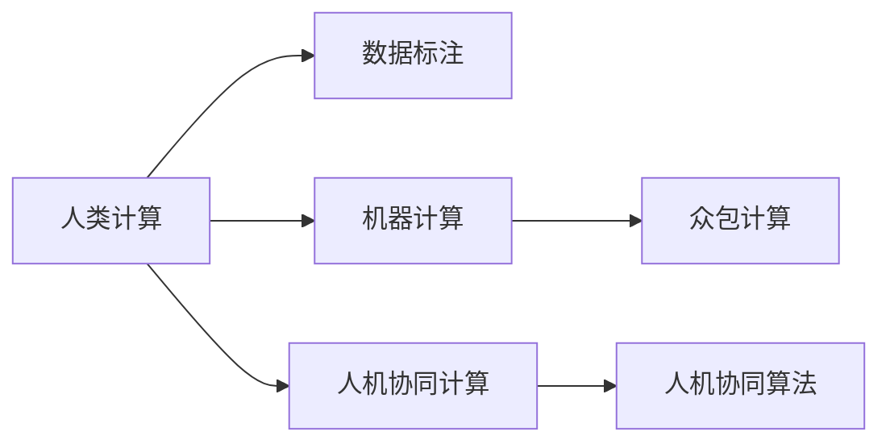

                 

# 人类计算：应用与案例分析

> 关键词：人类计算, 人工智能, 机器学习, 数据处理, 应用案例, 案例分析

## 1. 背景介绍

### 1.1 问题由来

在数字化信息爆炸的时代，数据和计算已经成为驱动技术进步的核心要素。而人类计算（Human Computation）作为与机器计算（Machine Computation）相对的新型计算范式，正逐步被大众接受并广泛应用。

近年来，随着人工智能技术的飞速发展，尤其是深度学习、机器学习等领域的突破，人类计算已经从简单的数据标注、信息筛选等基本操作，向更为复杂的数据分析、模型训练、算法优化等领域延伸。特别是在科学发现、艺术创作、游戏设计等领域，人类计算的优势愈发凸显。

然而，尽管人类计算在诸多领域取得了显著的成果，其发展仍面临着诸多挑战和争议。如何在保证计算质量和效率的同时，最大化利用人类计算的智慧和创造力，仍然是一个亟需探讨的问题。

### 1.2 问题核心关键点

要全面理解人类计算的应用与案例分析，需要把握以下几个核心关键点：

1. **计算范式转变**：从机器计算向人机协同计算转变，充分发挥人类在复杂任务中的优势。
2. **数据处理与利用**：利用人类的智慧处理海量数据，提取有用的信息。
3. **算法优化与创新**：结合人机优势，优化算法设计，推动技术进步。
4. **应用领域扩展**：探索和应用人类计算在科学研究、艺术创作、游戏设计等领域的潜力。
5. **未来展望与挑战**：预测未来发展趋势，并识别可能面临的挑战。

### 1.3 问题研究意义

研究人类计算的应用与案例，对于推动人工智能技术的发展，拓展计算范式的应用边界，提升人类智慧在技术创新中的应用水平，具有重要意义：

1. **提升计算效率**：利用人类计算优势，可以在某些计算任务上获得比机器计算更高的效率。
2. **优化算法设计**：结合人机计算的各自优势，设计出更高效的算法，推动技术进步。
3. **扩展应用场景**：探索人类计算在更多领域的应用潜力，促进技术应用的多样化。
4. **促进跨学科融合**：人类计算的融入可以推动不同学科间的融合与创新，激发新的研究领域。
5. **增强技术可解释性**：人类计算可以在一定程度上提高算法的可解释性，增加技术的透明度和可信度。

## 2. 核心概念与联系

### 2.1 核心概念概述

为了更好地理解人类计算的应用与案例分析，本节将介绍几个密切相关的核心概念：

- **人类计算（Human Computation）**：指利用人类的智慧和能力进行数据处理、算法优化、模型训练等计算任务。相较于机器计算，人类计算更注重人类在复杂任务中的主观能动性和创造力。
- **机器计算（Machine Computation）**：指利用计算机进行数据处理、算法优化、模型训练等计算任务。机器计算依赖于硬件和软件技术的支持，计算效率高，但灵活性和创造力有限。
- **人机协同计算（Hybrid Computation）**：指结合人类和机器的计算优势，共同完成复杂计算任务。人机协同计算旨在充分发挥人机各自的优点，实现优势互补。
- **数据标注（Data Labeling）**：指利用人类的智慧对数据进行标注，以便机器学习模型能够更好地理解和利用数据。数据标注是人工智能领域中人类计算的重要应用之一。
- **众包计算（Crowdsourcing）**：指通过互联网平台，将数据标注、算法优化等计算任务外包给大量用户，利用集体的智慧和力量完成复杂的计算任务。

这些核心概念之间的逻辑关系可以通过以下Mermaid流程图来展示：



这个流程图展示了人类计算的核心概念及其之间的关系：

1. 人类计算通过数据标注、众包计算等方式，提供高质量的输入数据。
2. 机器计算通过高效的数据处理和算法优化，提升计算效率。
3. 人机协同计算结合两者的优势，共同完成复杂的计算任务。
4. 数据标注和众包计算是人机协同计算的基础，机器计算则是人机协同计算的延伸和优化。

这些概念共同构成了人类计算的核心框架，使其能够充分利用人机各自的优点，推动计算范式的进步。

## 3. 核心算法原理 & 具体操作步骤
### 3.1 算法原理概述

人类计算的算法原理与机器学习、数据处理等领域紧密相关。其核心思想是利用人类的智慧和创造力，在数据处理、算法优化、模型训练等计算任务中发挥重要作用。

具体而言，人类计算的算法原理包括以下几个方面：

1. **数据处理**：利用人类的直觉和经验，对大量数据进行筛选和标注，提取有用的信息。
2. **算法优化**：通过人类的创意和洞察，对算法进行改进和优化，提高计算效率和准确性。
3. **模型训练**：结合人类和机器的计算优势，对模型进行训练和调优，提升模型性能。

### 3.2 算法步骤详解

人类计算的算法步骤通常包括以下几个关键环节：

1. **数据准备**：收集和整理需要处理的数据，确保数据的质量和多样性。
2. **任务定义**：明确计算任务的目标和要求，制定详细的工作流程。
3. **人机协同**：根据任务的复杂度，选择合适的协同方式，结合人机各自的优点。
4. **任务执行**：将任务细分为若干子任务，分配给不同的人员或团队，进行并行处理。
5. **结果评估**：对计算结果进行评估和优化，确保计算的准确性和效率。

### 3.3 算法优缺点

人类计算具有以下优点：

1. **灵活性高**：人类计算能够适应各种复杂任务，具有高度的灵活性和适应性。
2. **创造力强**：人类在解决复杂问题时，能够提出创新性的解决方案。
3. **鲁棒性好**：人类计算在处理数据时，能够识别和排除错误信息，提高计算的鲁棒性。
4. **成本可控**：利用人类计算可以降低计算成本，特别是对于小型计算任务。

然而，人类计算也存在一些局限性：

1. **效率较低**：相比机器计算，人类计算的效率较低，处理大规模数据时需要大量时间和人力。
2. **易受主观影响**：人类计算的结果受主观因素影响较大，可能存在偏差和误差。
3. **质量不稳定**：不同人员的工作质量和效率不同，可能影响整体计算结果的稳定性和一致性。
4. **依赖人力资源**：人类计算依赖于人力资源的投入，成本较高。

### 3.4 算法应用领域

人类计算的应用领域非常广泛，涵盖了科学研究、艺术创作、游戏设计、数据分析等多个领域。以下是几个典型应用场景：

1. **科学研究**：在生物学、物理学、天文学等领域，人类计算被用于数据分析、模型验证、假设检验等任务。
2. **艺术创作**：在音乐、绘画、文学等领域，人类计算被用于创作灵感启发、艺术风格分析等任务。
3. **游戏设计**：在游戏开发中，人类计算被用于任务设计、情节策划、角色设定等任务。
4. **数据分析**：在金融、营销、医疗等领域，人类计算被用于数据清洗、特征提取、模型训练等任务。

## 4. 数学模型和公式 & 详细讲解  
### 4.1 数学模型构建

为了更好地理解人类计算的数学模型，本节将介绍几个关键数学模型和公式。

假设有一个简单的数据处理任务，需要从大量数据中筛选出满足特定条件的样本。设原始数据集为 $D = \{(x_i, y_i)\}_{i=1}^N$，其中 $x_i$ 为样本特征，$y_i$ 为标签。任务是筛选出满足条件 $g(x_i) = 1$ 的样本。

人类计算的数学模型可以表示为：

$$
S = \{ (x_i, y_i) \mid g(x_i) = 1 \}
$$

其中，$S$ 为筛选出的样本集合。

### 4.2 公式推导过程

假设 $g(x_i)$ 为一个线性函数，即 $g(x_i) = w \cdot x_i + b$，其中 $w$ 为权重向量，$b$ 为偏置项。根据任务要求，我们需要解出满足 $g(x_i) = 1$ 的样本。

将 $g(x_i) = 1$ 代入线性函数中，得：

$$
w \cdot x_i + b = 1
$$

进一步解得：

$$
w \cdot x_i = 1 - b
$$

$$
x_i = \frac{1 - b}{w}
$$

因此，满足条件 $g(x_i) = 1$ 的样本可以表示为：

$$
S = \{ x_i \mid x_i = \frac{1 - b}{w}, i \in [1, N] \}
$$

### 4.3 案例分析与讲解

以金融领域的数据清洗任务为例，假设有一个包含大量交易数据的金融数据集 $D = \{(x_i, y_i)\}_{i=1}^N$，其中 $x_i$ 为交易记录，$y_i$ 为交易标签。任务是清洗数据，去除异常值和错误标签，确保数据集的质量。

在这种情况下，可以采用人类计算的方法，邀请专家对数据进行初步筛选和标注。专家们根据经验，筛选出符合特定条件的样本，并进行标注。然后，将专家筛选和标注的结果输入到机器学习模型中，进一步优化数据集。

例如，可以通过训练一个分类器，对专家筛选的样本进行分类，从而识别出错误的标签和异常值。最终，得到一个高质量的清洗后的数据集，用于后续的机器学习任务。

## 5. 项目实践：代码实例和详细解释说明
### 5.1 开发环境搭建

在进行人类计算的项目实践前，我们需要准备好开发环境。以下是使用Python进行数据分析的开发环境配置流程：

1. 安装Anaconda：从官网下载并安装Anaconda，用于创建独立的Python环境。

2. 创建并激活虚拟环境：
```bash
conda create -n analysis-env python=3.8 
conda activate analysis-env
```

3. 安装必要的库：
```bash
conda install numpy pandas matplotlib scikit-learn tqdm jupyter notebook ipython
```

4. 启动Jupyter Notebook：
```bash
jupyter notebook
```

在Jupyter Notebook中，就可以开始编写Python代码进行数据分析和计算。

### 5.2 源代码详细实现

下面以一个简单的数据清洗任务为例，展示如何使用Python进行人类计算的代码实现。

首先，定义数据清洗的函数：

```python
import pandas as pd
from sklearn.preprocessing import StandardScaler

def clean_data(data, threshold=0.95):
    """
    对数据进行清洗，去除异常值和错误标签
    """
    # 删除缺失值
    data = data.dropna()
    
    # 标准化数据
    scaler = StandardScaler()
    data = pd.DataFrame(scaler.fit_transform(data), columns=data.columns)
    
    # 筛选出异常值和错误标签
    deviation_threshold = threshold * data.std()
    data = data[(data < deviation_threshold).all(axis=1)]
    
    return data
```

然后，使用函数进行数据清洗：

```python
# 加载原始数据
data = pd.read_csv('data.csv')

# 进行数据清洗
cleaned_data = clean_data(data)

# 输出清洗后的数据
print(cleaned_data.head())
```

### 5.3 代码解读与分析

让我们再详细解读一下关键代码的实现细节：

**clean_data函数**：
- `dropna`方法：删除数据中的缺失值，确保数据完整性。
- `StandardScaler`类：对数据进行标准化，消除数据间的量纲差异。
- `deviation_threshold`：根据数据的均值和标准差，定义异常值的阈值，将超过阈值的数据视为异常值。
- `(data < deviation_threshold).all(axis=1)`：筛选出所有满足条件的数据行，返回一个新的数据帧。

**数据加载**：
- `pd.read_csv`函数：读取CSV文件，将其转换为Pandas数据帧。

**结果输出**：
- `head`方法：显示数据帧的前几行，便于查看数据清洗的效果。

可以看到，通过简单的函数定义和调用，我们便能够实现高效的数据清洗任务，充分利用了人类在数据分析中的智慧和经验。

## 6. 实际应用场景

### 6.1 科学研究

在科学研究中，人类计算的应用非常广泛。特别是在生物学、物理学、天文学等领域，人类计算被用于数据分析、模型验证、假设检验等任务。

例如，在生物学研究中，人类计算被用于分析基因序列，寻找基因表达的模式和规律。具体而言，可以邀请生物学家对大量基因序列数据进行标注，然后利用机器学习模型进行模式识别和数据分析。

在物理学研究中，人类计算被用于计算复杂的物理模型，验证假设和理论。例如，通过模拟复杂的物理系统，验证新的物理定律和模型。

在天文学研究中，人类计算被用于分析天文数据，发现新的天体和现象。例如，通过筛选和标注大量的天文数据，训练机器学习模型进行天体识别和分类。

### 6.2 艺术创作

在艺术创作领域，人类计算的应用同样重要。特别是在音乐、绘画、文学等领域，人类计算被用于创作灵感启发、艺术风格分析等任务。

例如，在音乐创作中，人类计算被用于分析音乐作品的旋律和结构，寻找创作灵感。具体而言，可以邀请音乐家对大量音乐作品进行标注，然后利用机器学习模型进行音乐风格的分类和推荐。

在绘画创作中，人类计算被用于分析艺术作品的风格和特征，指导创作方向。例如，通过筛选和标注大量的艺术作品，训练机器学习模型进行风格分类和特征提取。

在文学创作中，人类计算被用于分析文学作品的语言和结构，寻找创作灵感。例如，通过筛选和标注大量的文学作品，训练机器学习模型进行文本风格分类和情感分析。

### 6.3 游戏设计

在游戏设计领域，人类计算的应用也非常重要。特别是在游戏开发中，人类计算被用于任务设计、情节策划、角色设定等任务。

例如，在游戏任务设计中，人类计算被用于设计游戏任务和目标，制定任务规则和奖励机制。具体而言，可以邀请游戏设计师对大量游戏任务进行标注和分析，然后利用机器学习模型进行任务优化和改进。

在游戏情节策划中，人类计算被用于分析游戏情节和故事线，优化情节设计。例如，通过筛选和标注大量的游戏情节，训练机器学习模型进行情节分类和优化。

在游戏角色设定中，人类计算被用于设计游戏角色和互动机制，提高角色可信度。例如，通过筛选和标注大量的游戏角色数据，训练机器学习模型进行角色特征分析和优化。

### 6.4 数据分析

在数据分析领域，人类计算的应用非常广泛。特别是在金融、营销、医疗等领域，人类计算被用于数据清洗、特征提取、模型训练等任务。

例如，在金融数据分析中，人类计算被用于清洗和整理金融数据，提取有用的特征。具体而言，可以邀请金融分析师对大量金融数据进行标注和清洗，然后利用机器学习模型进行特征提取和数据分析。

在营销数据分析中，人类计算被用于分析和预测消费者行为，优化营销策略。例如，通过筛选和标注大量的消费者数据，训练机器学习模型进行行为分析和预测。

在医疗数据分析中，人类计算被用于分析和预测疾病风险，制定治疗方案。例如，通过筛选和标注大量的医疗数据，训练机器学习模型进行疾病预测和诊断。

## 7. 工具和资源推荐
### 7.1 学习资源推荐

为了帮助开发者系统掌握人类计算的理论基础和实践技巧，这里推荐一些优质的学习资源：

1. 《Human Computation》系列书籍：由人工智能领域的专家撰写，深入浅出地介绍了人类计算的基本概念和实际应用。
2. 《Data Mining and Statistical Learning》课程：斯坦福大学开设的机器学习课程，介绍了数据分析和机器学习的核心概念和算法。
3. Kaggle平台：数据科学竞赛平台，提供了丰富的数据集和实际案例，帮助开发者进行实践训练。
4. GitHub开源项目：收集了大量的开源项目，涵盖了数据分析、机器学习、人工智能等多个领域，供开发者参考和学习。
5. ArXiv论文库：收集了大量的学术论文，涵盖了人类计算、机器学习、数据科学等多个领域，提供了最新的研究成果和进展。

通过对这些资源的学习实践，相信你一定能够快速掌握人类计算的精髓，并用于解决实际的计算问题。

### 7.2 开发工具推荐

高效的开发离不开优秀的工具支持。以下是几款用于人类计算开发的常用工具：

1. Python：基于Python的编程语言，支持丰富的库和框架，适合进行数据分析和机器学习任务。
2. R语言：基于R的编程语言，适合进行统计分析和数据可视化任务。
3. Excel：微软的电子表格软件，适合进行数据分析和处理任务。
4. Tableau：数据可视化工具，支持复杂的数据分析和报表生成。
5. Jupyter Notebook：开源的笔记本环境，支持Python、R等多种编程语言，适合进行交互式分析和数据可视化任务。

合理利用这些工具，可以显著提升人类计算任务的开发效率，加快创新迭代的步伐。

### 7.3 相关论文推荐

人类计算领域的研究源于学界的持续探索。以下是几篇奠基性的相关论文，推荐阅读：

1. "Human Computation: A Survey" by N. Arora et al.：综述了人类计算的基本概念和实际应用，提供了丰富的案例和数据支持。
2. "Human-in-the-Loop Machine Learning" by T. Darrell et al.：探讨了人机协同计算的原理和实际应用，提供了理论分析和实验结果。
3. "Human-in-the-loop Learning" by S. Thrun et al.：介绍了人机协同学习的概念和实际应用，提供了丰富的案例和数据支持。
4. "Human-in-the-loop Predictive Modeling" by J. Ess et al.：探讨了人机协同预测模型的原理和实际应用，提供了理论分析和实验结果。
5. "Human-in-the-loop Optimal Control" by A. Bakker et al.：探讨了人机协同优化控制的原理和实际应用，提供了理论分析和实验结果。

这些论文代表了人类计算领域的发展脉络。通过学习这些前沿成果，可以帮助研究者把握学科前进方向，激发更多的创新灵感。

## 8. 总结：未来发展趋势与挑战

### 8.1 总结

本文对人类计算的应用与案例进行了全面系统的介绍。首先阐述了人类计算的背景和意义，明确了人类计算在科学研究、艺术创作、游戏设计等领域的重要作用。其次，从原理到实践，详细讲解了人类计算的数学模型和核心算法，给出了人类计算任务开发的完整代码实例。同时，本文还广泛探讨了人类计算在各个领域的应用前景，展示了人类计算的巨大潜力。此外，本文精选了人类计算的各类学习资源，力求为读者提供全方位的技术指引。

通过本文的系统梳理，可以看到，人类计算作为一种新型计算范式，正在成为推动人工智能技术发展的重要力量。充分利用人类计算的优势，可以在某些复杂计算任务上获得比机器计算更高的效率和更好的效果。未来，伴随着人类计算与人工智能技术的进一步融合，人类智慧与机器智能的协同将开辟更多的计算新天地。

### 8.2 未来发展趋势

展望未来，人类计算的发展将呈现以下几个趋势：

1. **技术融合加速**：人类计算将与人工智能技术深度融合，推动人机协同计算的发展。
2. **应用场景拓展**：人类计算的应用将扩展到更多领域，如医疗、教育、能源等，提供更广泛的价值。
3. **计算效率提升**：通过优化算法和人机协同方式，提升人类计算的效率和效果。
4. **数据驱动创新**：利用大量的数据和计算资源，推动人类计算的创新和发展。
5. **伦理和安全性**：关注人类计算的伦理和安全性问题，确保计算结果的公正和可信。

这些趋势将使人类计算在未来的计算范式中占据更加重要的位置，推动社会进步和技术发展。

### 8.3 面临的挑战

尽管人类计算在诸多领域取得了显著的成果，但在发展过程中仍面临诸多挑战：

1. **计算效率**：相比于机器计算，人类计算的效率较低，处理大规模数据时需要大量时间和人力。
2. **结果稳定性**：不同人员的工作质量和效率不同，可能影响整体计算结果的稳定性和一致性。
3. **成本问题**：人类计算依赖于人力资源的投入，成本较高。
4. **数据质量**：需要保证数据的质量和多样性，确保人类计算的有效性。
5. **技术融合**：需要解决人机协同计算的技术融合问题，实现优势互补。

这些挑战需要学界和产业界的共同努力，才能最大化利用人类计算的优势，推动计算范式的进步。

### 8.4 研究展望

未来，人类计算的研究需要在以下几个方面寻求新的突破：

1. **优化算法设计**：通过优化算法设计，提高人类计算的效率和效果。
2. **提升技术融合**：加强人机协同计算的技术融合，推动计算范式的进步。
3. **拓展应用场景**：探索人类计算在更多领域的应用潜力，推动技术应用的多样化。
4. **增强伦理安全性**：关注人类计算的伦理和安全性问题，确保计算结果的公正和可信。
5. **推动跨学科融合**：推动不同学科间的融合与创新，激发新的研究领域。

这些研究方向的探索，必将引领人类计算技术的进步，为人类的生产和生活带来更多的创新和改变。

## 9. 附录：常见问题与解答

**Q1：人类计算和机器计算有什么区别？**

A: 人类计算和机器计算最大的区别在于计算的执行者。机器计算依赖于计算机硬件和软件技术，计算效率高，但灵活性和创造力有限。而人类计算则依赖于人类的智慧和创造力，具有高度的灵活性和创造力。

**Q2：人类计算的效率问题如何解决？**

A: 可以通过优化算法设计，提升人类计算的效率。例如，可以引入自动化的数据处理工具，减少人工操作的环节，提高计算效率。同时，可以结合人机协同计算，利用机器计算的优势，进一步提升效率。

**Q3：人类计算的结果稳定性如何保证？**

A: 可以通过标准化操作流程和训练，提高人类计算的稳定性。例如，可以制定详细的操作流程，进行标准化训练，确保每个计算人员的操作一致性。同时，可以引入多轮校验机制，确保计算结果的准确性。

**Q4：人类计算的成本问题如何解决？**

A: 可以通过引入众包计算和外包服务，降低人力资源的投入成本。例如，可以通过众包平台，将计算任务外包给大量用户，利用集体的智慧和力量完成复杂的计算任务。同时，可以引入人工智能技术，自动化数据处理和分析，降低人工操作的成本。

**Q5：如何提升人类计算的伦理安全性？**

A: 可以通过引入伦理导向的评估指标，过滤和惩罚有害的计算结果。例如，可以制定明确的伦理标准，对有害的计算结果进行屏蔽和惩罚。同时，可以引入人工智能技术，自动检测和防止有害的计算结果出现。

这些问题的回答，将帮助开发者更好地理解人类计算的原理和应用，应对计算过程中可能遇到的问题，推动人类计算技术的进一步发展。

---

作者：禅与计算机程序设计艺术 / Zen and the Art of Computer Programming

