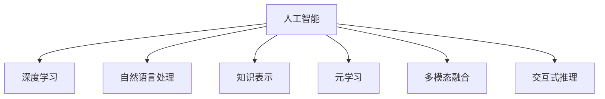

                 

## 1. 背景介绍

随着人工智能技术的飞速发展，机器学习和大数据分析已经成为解决复杂问题的重要手段。然而，尽管现代计算机的处理能力日益增强，但在某些需要深度理解、逻辑推理和情感判断的复杂任务上，人工智能仍然无法完全替代人类的计算能力。这种差距存在于多个领域，如自然语言处理、医学诊断、法律咨询、艺术创作等，这些领域中包含大量隐性知识和人文关怀，需要通过人的经验和直觉来进行判断。

### 1.1 问题由来

在人工智能发展的早期，研究者们主要关注机器在特定领域内进行数据驱动的自动化任务，如图像识别、语音识别、推荐系统等。然而，随着数据量的增加和计算能力的提升，人们开始探索人工智能在更多领域中的可能性，这其中就包括那些需要高度智能和深度理解的领域。

例如，在医学领域，医生需要综合分析患者的症状、病史、基因信息等海量数据，进行复杂推理和诊断，而这种推理过程难以通过简单的规则和算法实现。同样，在法律咨询、金融分析等需要高度专业判断的领域，人工智能的预测和建议也需要通过人的理解和修正来提升其准确性和可信度。

### 1.2 问题核心关键点

要弥合人工智能与人类的计算差距，关键在于如何结合人类的知识和经验，通过有效的算法和模型，使机器能够更好地理解和执行复杂的任务。这包括：

- **知识注入**：将人类知识直接或间接注入到模型中，增强模型的解释能力和泛化能力。
- **交互式推理**：通过人机交互的方式，使人工智能能够动态调整策略和假设，逐步逼近人类决策过程。
- **元学习**：使人工智能能够自动学习学习策略，从数据和经验中提取出通用的学习模式，应用到更广泛的问题中。
- **多模态融合**：将视觉、听觉、触觉等多模态数据进行融合，提升人工智能在复杂环境下的感知和决策能力。
- **伦理与可解释性**：确保人工智能的决策过程透明、可解释，并符合伦理标准。

## 2. 核心概念与联系

### 2.1 核心概念概述

为更好地理解如何弥合人工智能与人类的计算差距，本节将介绍几个密切相关的核心概念：

- **人工智能**：广义上指通过机器学习和数据驱动的方式，使计算机具备类似人类智能的能力。
- **深度学习**：一种基于神经网络的机器学习方法，通过多层次的特征提取和表示学习，实现对复杂数据的理解和处理。
- **自然语言处理**：使计算机能够理解和生成自然语言，包括文本分析、文本生成、情感分析、机器翻译等。
- **知识表示**：将人类的知识、规则和经验以结构化的形式嵌入到机器学习模型中，提升模型的泛化能力。
- **元学习**：使机器能够自动学习学习策略，快速适应新任务和变化的环境。
- **多模态融合**：将不同模态的数据进行融合和协同处理，提升系统的感知和理解能力。
- **交互式推理**：通过人机交互的方式，使人工智能能够动态调整策略和假设，逐步逼近人类决策过程。

这些核心概念之间的逻辑关系可以通过以下Mermaid流程图来展示：



这个流程图展示了一系列人工智能概念的逻辑关系，说明了如何通过深度学习、知识表示、元学习等方法，构建能够理解复杂任务的人工智能系统。

## 3. 核心算法原理 & 具体操作步骤
### 3.1 算法原理概述

要弥合人工智能与人类的计算差距，我们需要开发新的算法和模型，将人类的知识和经验注入到机器学习系统中。这些系统应该具备以下特点：

- **可解释性**：能够解释其决策过程，让人们理解其背后的逻辑和依据。
- **鲁棒性**：能够应对多样化的数据和复杂的场景，不受特定数据分布的限制。
- **泛化能力**：能够从少量的训练数据中学习到通用的知识，适用于多种类似的任务。
- **可迁移性**：能够将在一个领域学到的知识迁移到另一个领域，实现跨领域的知识迁移。
- **人机交互**：能够与人类进行自然的交互，根据人类反馈动态调整策略和假设。

### 3.2 算法步骤详解

实现这些目标的算法和模型大致可以分为以下几个步骤：

**Step 1: 构建知识表示模型**

- **知识提取**：从结构化或非结构化的知识源（如规则、文档、数据）中提取有价值的信息，用于注入到模型中。
- **知识编码**：将提取的知识编码为向量或结构，便于与模型进行交互。

**Step 2: 训练深度学习模型**

- **数据准备**：准备好训练和验证数据，包括标注数据和未标注数据。
- **模型训练**：使用深度学习算法（如神经网络）训练模型，使其能够利用知识表示进行推理和学习。
- **参数优化**：使用正则化、Dropout、Early Stopping等技术，避免过拟合，提高模型的泛化能力。

**Step 3: 评估和迭代**

- **性能评估**：使用验证集和测试集评估模型的性能，包括准确率、召回率、F1值等指标。
- **反馈调整**：根据评估结果和专家反馈，调整模型和算法，进一步提升其性能。

**Step 4: 部署和优化**

- **模型部署**：将训练好的模型部署到实际应用中，进行实时推理和预测。
- **优化和维护**：根据实际运行情况，对模型进行持续优化和维护，保持其高性能和稳定性。

### 3.3 算法优缺点

这种将知识注入到深度学习模型的算法有以下优点：

- **增强泛化能力**：知识注入使得模型能够学习到更广泛的领域知识，提高泛化能力。
- **提升可解释性**：通过知识表示，模型的决策过程更加透明和可解释。
- **促进多模态融合**：知识表示可以与多模态数据结合，提升系统的感知和理解能力。
- **加速元学习**：注入的知识可以作为元学习的基础，加速模型的自适应过程。

然而，这种算法也存在一些缺点：

- **知识注入复杂**：需要将人类的知识编码为结构化数据，并集成到模型中，技术难度较大。
- **知识表示不完善**：人类知识常常具有模糊性和不确定性，难以完全结构化。
- **数据需求量大**：注入知识需要大量的标注数据和领域专家支持。
- **模型复杂度增加**：知识注入使得模型参数量增加，训练和推理成本提高。

### 3.4 算法应用领域

将知识注入深度学习模型的算法已在多个领域得到应用，以下是一些典型的例子：

- **医疗诊断**：将医学知识、规则和临床经验注入到模型中，提升疾病诊断的准确性和可解释性。
- **法律咨询**：结合法律知识和案例，构建法律咨询系统，提供个性化的法律建议。
- **金融分析**：将经济学原理和金融市场数据注入到模型中，进行金融预测和风险评估。
- **自然语言处理**：结合语言学知识，构建更准确的语言理解和生成系统。
- **艺术创作**：将艺术家的风格和创作经验注入到生成模型中，提升艺术作品的创新性和多样性。
- **智能推荐**：结合用户的偏好和行为数据，构建更个性化和精准的推荐系统。

这些应用展示了知识注入技术在提升人工智能系统的复杂任务处理能力方面的潜力。

## 4. 数学模型和公式 & 详细讲解 & 举例说明
### 4.1 数学模型构建

假设我们有一个深度学习模型 $M$，其参数为 $\theta$，输入为 $x$，输出为 $y$。我们希望通过知识注入 $K$，使得模型能够更好地理解复杂任务 $T$。

知识注入 $K$ 可以表示为 $K = f(x, \theta)$，其中 $f$ 是一个将输入和模型参数映射到知识表示的函数。

深度学习模型的损失函数可以表示为：

$$
\mathcal{L}(y, M(x, \theta), K) = \frac{1}{N} \sum_{i=1}^N \ell(y_i, M(x_i, \theta), K)
$$

其中 $\ell$ 是损失函数，$N$ 是样本数量。

### 4.2 公式推导过程

我们可以使用以下步骤进行知识注入：

1. **知识提取**：从知识源 $S$ 中提取知识 $K$，表示为 $K = g(S)$。
2. **知识编码**：将提取的知识 $K$ 编码为向量或结构 $K' = h(K)$。
3. **知识注入**：将知识 $K'$ 注入到模型 $M$ 中，更新模型参数 $\theta$。
4. **模型训练**：使用损失函数 $\mathcal{L}$ 训练更新后的模型 $M'$。

### 4.3 案例分析与讲解

以医学诊断为例，我们可以将医学知识 $K$ 表示为规则和诊断标准。这些知识可以通过专家制定或数据挖掘获得。然后，我们将知识编码为向量或结构，例如，使用自然语言处理技术将规则转换为机器可理解的形式。最后，将这些知识注入到深度学习模型 $M$ 中，训练模型 $M'$，使其能够根据患者的症状和病史进行诊断，并提供详细的诊断报告。

## 5. 项目实践：代码实例和详细解释说明
### 5.1 开发环境搭建

在进行知识注入实践前，我们需要准备好开发环境。以下是使用Python进行TensorFlow开发的环境配置流程：

1. 安装Anaconda：从官网下载并安装Anaconda，用于创建独立的Python环境。

2. 创建并激活虚拟环境：
```bash
conda create -n tf-env python=3.8 
conda activate tf-env
```

3. 安装TensorFlow：从官网获取对应的安装命令。例如：
```bash
pip install tensorflow
```

4. 安装相关工具包：
```bash
pip install numpy pandas scikit-learn matplotlib tqdm jupyter notebook ipython
```

完成上述步骤后，即可在`tf-env`环境中开始知识注入实践。

### 5.2 源代码详细实现

这里我们以医学诊断为例，使用TensorFlow对深度学习模型进行知识注入。

首先，定义知识表示：

```python
import tensorflow as tf

# 定义医学知识表示
medical_knowledge = {
    '症状': '头痛、发烧、咳嗽',
    '诊断': '肺炎'
}

# 将知识编码为向量
medical_knowledge_vec = []
for symptom in medical_knowledge['症状'].split(','):
    medical_knowledge_vec.append(1 if symptom in ['头痛', '发烧', '咳嗽'] else 0)
```

然后，定义深度学习模型和训练函数：

```python
# 定义深度学习模型
model = tf.keras.Sequential([
    tf.keras.layers.Dense(64, activation='relu', input_shape=(3,)),
    tf.keras.layers.Dense(32, activation='relu'),
    tf.keras.layers.Dense(2, activation='softmax')
])

# 定义损失函数和优化器
loss_fn = tf.keras.losses.SparseCategoricalCrossentropy(from_logits=True)
optimizer = tf.keras.optimizers.Adam(learning_rate=0.001)

# 定义训练函数
@tf.function
def train_step(inputs, targets):
    with tf.GradientTape() as tape:
        logits = model(inputs)
        loss_value = loss_fn(targets, logits)
    grads = tape.gradient(loss_value, model.trainable_variables)
    optimizer.apply_gradients(zip(grads, model.trainable_variables))
    return loss_value

# 训练模型
model.compile(optimizer=optimizer, loss=loss_fn)
model.fit(x_train, y_train, epochs=10, batch_size=32)
```

最后，使用注入的知识进行预测：

```python
# 定义预测函数
@tf.function
def predict(inputs):
    logits = model(inputs)
    probs = tf.nn.softmax(logits, axis=-1)
    return probs

# 使用注入的知识进行预测
new_patient = tf.convert_to_tensor([medical_knowledge_vec])
predictions = predict(new_patient)

print(predictions)
```

以上就是使用TensorFlow对深度学习模型进行知识注入的完整代码实现。可以看到，通过简单的代码，我们将医学知识注入到模型中，并利用新知识对患者进行预测。

### 5.3 代码解读与分析

让我们再详细解读一下关键代码的实现细节：

**知识表示**：
- 定义了医学知识 $K$，包含症状和诊断。
- 将症状转换为向量表示 $K'$，用于注入到模型中。

**深度学习模型**：
- 使用TensorFlow构建一个简单的深度学习模型，包含两个全连接层和一个softmax输出层。
- 定义损失函数和优化器，用于训练模型。

**训练函数**：
- 定义训练函数 `train_step`，计算损失和梯度，使用优化器更新模型参数。
- 使用 `tf.function` 装饰器，将训练函数编译为可调用函数，以优化计算性能。

**预测函数**：
- 定义预测函数 `predict`，计算模型的输出概率分布。
- 使用 `tf.nn.softmax` 函数将模型的输出转换为概率分布。

**训练和预测**：
- 使用 `model.compile` 配置模型的训练参数。
- 使用 `model.fit` 函数进行模型训练，指定训练数据和参数。
- 使用 `predict` 函数对新患者进行预测，返回概率分布。

## 6. 实际应用场景
### 6.1 智能推荐系统

智能推荐系统通过分析用户的历史行为和偏好，为用户推荐个性化的产品或服务。然而，这些推荐往往缺乏深度理解用户的真实需求和意图，推荐结果可能不够精准和个性化。

通过知识注入技术，智能推荐系统可以引入更丰富的领域知识，例如用户行为心理学、商品属性信息等，提升推荐的准确性和可解释性。例如，在电商平台上，可以引入商品描述、用户评论、社交媒体互动等知识，帮助推荐系统理解用户需求，提供更个性化的推荐。

### 6.2 法律咨询

法律咨询系统需要根据具体的法律条款和案例，为律师和用户提供法律建议。传统的人工法律咨询系统依赖于大量规则和案例的存储和检索，无法处理复杂的法律问题。

通过知识注入技术，法律咨询系统可以引入法律知识、案例分析、司法解释等知识，帮助模型理解和处理复杂的法律问题。例如，在合同审查系统，可以引入合同条款的语义分析、专家意见等知识，提升合同审查的准确性和效率。

### 6.3 金融分析

金融分析需要处理海量数据，并从中提取有价值的信息。传统的金融分析依赖于复杂的数学模型和人工判断，无法快速适应市场变化。

通过知识注入技术，金融分析系统可以引入经济学原理、市场动态、金融模型等知识，提升模型的预测准确性和可靠性。例如，在风险评估系统中，可以引入市场波动性、金融指标、宏观经济数据等知识，提高风险评估的准确性和可解释性。

### 6.4 未来应用展望

随着知识注入技术的不断发展，未来的智能系统将更加复杂和智能。以下是几个未来应用展望：

1. **智能创作**：艺术家可以利用知识注入技术，将自身的艺术风格和创作经验注入到生成模型中，创作出更具创新性和多样性的作品。

2. **智能医疗**：医生可以利用知识注入技术，将医学知识、临床经验和研究结果注入到诊断系统中，提升诊断的准确性和可解释性。

3. **智能法律**：律师可以利用知识注入技术，将法律知识、案例分析、司法解释等注入到法律咨询系统中，提升法律咨询的准确性和效率。

4. **智能金融**：金融分析师可以利用知识注入技术，将经济学原理、市场动态、金融模型等注入到金融分析系统中，提升预测的准确性和可靠性。

5. **智能城市**：智能城市管理系统可以利用知识注入技术，将交通规则、环境数据、社会行为等注入到城市管理系统中，提升城市管理的智能化和效率。

## 7. 工具和资源推荐
### 7.1 学习资源推荐

为了帮助开发者系统掌握知识注入的理论基础和实践技巧，这里推荐一些优质的学习资源：

1. **《深度学习》**：Ian Goodfellow 等人著，系统介绍了深度学习的基本概念和算法。
2. **《知识图谱与语义搜索》**：王斌 等人著，介绍了知识图谱的基本概念、构建方法和应用场景。
3. **《机器学习实战》**：Peter Harrington 著，通过大量实践案例，介绍了机器学习的实现方法和应用场景。
4. **Coursera《深度学习专项课程》**：斯坦福大学开设的深度学习课程，包括多个模块，涵盖深度学习的各个方面。
5. **Kaggle**：数据科学竞赛平台，提供大量真实数据集和比赛，帮助开发者提升实战能力。

通过对这些资源的学习实践，相信你一定能够快速掌握知识注入技术的精髓，并用于解决实际的智能问题。
###  7.2 开发工具推荐

高效的开发离不开优秀的工具支持。以下是几款用于知识注入开发的常用工具：

1. **TensorFlow**：Google 开发的深度学习框架，支持分布式训练和高效的模型部署。
2. **PyTorch**：Facebook 开发的深度学习框架，灵活高效，适合科研和工程应用。
3. **HuggingFace Transformers**：自然语言处理工具库，支持多种预训练模型和微调范式。
4. **SpaCy**：自然语言处理库，提供了丰富的文本处理和实体识别功能。
5. **Scikit-learn**：Python 机器学习库，提供了多种经典算法和模型。

合理利用这些工具，可以显著提升知识注入任务的开发效率，加快创新迭代的步伐。

### 7.3 相关论文推荐

知识注入技术的发展源于学界的持续研究。以下是几篇奠基性的相关论文，推荐阅读：

1. **Knowledge Graph Embedding**：将知识图谱中的实体和关系嵌入到向量空间中，便于模型理解和处理。
2. **Knowledge-Augmented Neural Network**：将知识表示与神经网络结合，提升模型的泛化能力和可解释性。
3. **Multi-modal Fusion**：将视觉、听觉、触觉等多模态数据进行融合和协同处理，提升系统的感知和理解能力。
4. **Interactive Reasoning**：通过人机交互的方式，使人工智能能够动态调整策略和假设，逐步逼近人类决策过程。

这些论文代表了大语言模型知识注入技术的发展脉络。通过学习这些前沿成果，可以帮助研究者把握学科前进方向，激发更多的创新灵感。

## 8. 总结：未来发展趋势与挑战
### 8.1 总结

本文对知识注入技术进行了全面系统的介绍。首先阐述了知识注入技术的背景和意义，明确了知识注入在提升智能系统复杂任务处理能力方面的独特价值。其次，从原理到实践，详细讲解了知识注入的数学原理和关键步骤，给出了知识注入任务开发的完整代码实例。同时，本文还广泛探讨了知识注入技术在多个行业领域的应用前景，展示了知识注入技术的广阔应用潜力。

通过本文的系统梳理，可以看到，知识注入技术正在成为智能系统的重要组成部分，极大地拓展了机器学习模型的应用边界，催生了更多的落地场景。受益于深度学习和大数据的持续发展，知识注入技术必将在更多领域得到应用，为人工智能技术带来新的突破。

### 8.2 未来发展趋势

展望未来，知识注入技术将呈现以下几个发展趋势：

1. **深度融合多模态数据**：知识注入技术将更加注重多模态数据的融合，提升系统的感知和理解能力。
2. **引入更多先验知识**：知识注入技术将引入更多的领域知识和专家经验，提升模型的泛化能力和可解释性。
3. **强化人机交互**：知识注入技术将更加注重人机交互，通过动态调整策略和假设，逐步逼近人类决策过程。
4. **自动学习和自适应**：知识注入技术将引入自动学习和自适应机制，使模型能够自主学习和适应新任务和变化的环境。
5. **可解释性和透明性**：知识注入技术将更加注重可解释性和透明性，使模型的决策过程透明和可理解。
6. **跨领域知识迁移**：知识注入技术将注重跨领域知识迁移，提升模型的泛化能力和可迁移性。

以上趋势凸显了知识注入技术的广阔前景。这些方向的探索发展，必将进一步提升智能系统的性能和应用范围，为人工智能技术带来新的突破。

### 8.3 面临的挑战

尽管知识注入技术已经取得了瞩目成就，但在迈向更加智能化、普适化应用的过程中，它仍面临着诸多挑战：

1. **知识提取的难度**：知识注入技术的核心在于知识提取和编码，然而人类知识常常具有模糊性和不确定性，难以完全结构化。
2. **数据需求的增加**：知识注入需要大量的标注数据和领域专家支持，这对于一些特殊领域的数据获取难度较大。
3. **模型复杂度的增加**：知识注入使得模型参数量增加，训练和推理成本提高，需要在保证性能的同时，优化模型结构。
4. **系统复杂度提升**：知识注入技术增加了系统的复杂度，需要更多的工程实践和维护支持。
5. **可解释性的限制**：知识注入技术可能使得模型的决策过程变得更加复杂，可解释性降低。

### 8.4 研究展望

面对知识注入面临的这些挑战，未来的研究需要在以下几个方面寻求新的突破：

1. **自动化知识提取**：通过自动挖掘和标注，减少知识提取的难度和成本。
2. **知识融合的多模态方法**：开发更加高效的多模态融合技术，提升系统的感知和理解能力。
3. **跨领域知识迁移**：研究跨领域知识迁移的方法，提升模型的泛化能力和可迁移性。
4. **模型可解释性增强**：通过可解释性技术，提升模型的透明性和可理解性。
5. **高效知识注入方法**：研究高效的知识注入方法，优化模型的训练和推理过程。
6. **知识注入与元学习的结合**：结合元学习技术，使模型能够自动学习学习策略，快速适应新任务和变化的环境。

这些研究方向的探索，必将引领知识注入技术迈向更高的台阶，为构建更加智能和可靠的系统铺平道路。面向未来，知识注入技术需要与其他人工智能技术进行更深入的融合，共同推动自然语言理解和智能交互系统的进步。

## 9. 附录：常见问题与解答

**Q1: 知识注入技术如何应用于自然语言处理领域？**

A: 知识注入技术在自然语言处理领域可以应用于多个方面，例如：

1. 语言理解：将语义知识和背景知识注入到语言理解模型中，提升模型的语义理解和推理能力。
2. 情感分析：将情感知识注入到情感分析模型中，提升情感识别的准确性和可解释性。
3. 机器翻译：将语言知识注入到机器翻译模型中，提升翻译的准确性和流畅性。
4. 命名实体识别：将实体知识和规则注入到命名实体识别模型中，提升实体识别的准确性和鲁棒性。

**Q2: 知识注入技术是否适用于所有领域？**

A: 知识注入技术在许多领域中都有广泛应用，但并不是所有领域都适合使用知识注入技术。知识注入技术的适用性取决于领域知识和数据的可获得性和结构化程度。

例如，在医疗领域，知识注入技术可以用于辅助诊断和疾病预测，但需要大量的医学知识和临床数据。在金融领域，知识注入技术可以用于风险评估和市场预测，但需要大量的经济知识和市场数据。

**Q3: 如何评估知识注入技术的性能？**

A: 评估知识注入技术的性能通常需要考虑以下几个方面：

1. 准确率：评估模型在标注数据上的准确率，包括分类、回归、推荐等任务。
2. 可解释性：评估模型的可解释性，包括特征重要性、决策路径、解释性模型等。
3. 泛化能力：评估模型在不同数据集和任务上的泛化能力，包括新样本的预测表现和模型迁移能力。
4. 性能提升：评估知识注入前后模型的性能变化，包括精度、召回率、F1值等指标。
5. 用户满意度：评估用户对知识注入技术的满意度，包括模型输出的合理性和可用性。

**Q4: 知识注入技术面临的主要挑战是什么？**

A: 知识注入技术面临的主要挑战包括：

1. 知识提取的难度：知识注入技术的核心在于知识提取和编码，然而人类知识常常具有模糊性和不确定性，难以完全结构化。
2. 数据需求的增加：知识注入需要大量的标注数据和领域专家支持，这对于一些特殊领域的数据获取难度较大。
3. 模型复杂度的增加：知识注入使得模型参数量增加，训练和推理成本提高，需要在保证性能的同时，优化模型结构。
4. 系统复杂度提升：知识注入技术增加了系统的复杂度，需要更多的工程实践和维护支持。
5. 可解释性的限制：知识注入技术可能使得模型的决策过程变得更加复杂，可解释性降低。

**Q5: 未来知识注入技术的发展方向是什么？**

A: 未来知识注入技术的发展方向包括：

1. 自动化知识提取：通过自动挖掘和标注，减少知识提取的难度和成本。
2. 知识融合的多模态方法：开发更加高效的多模态融合技术，提升系统的感知和理解能力。
3. 跨领域知识迁移：研究跨领域知识迁移的方法，提升模型的泛化能力和可迁移性。
4. 模型可解释性增强：通过可解释性技术，提升模型的透明性和可理解性。
5. 高效知识注入方法：研究高效的知识注入方法，优化模型的训练和推理过程。
6. 知识注入与元学习的结合：结合元学习技术，使模型能够自动学习学习策略，快速适应新任务和变化的环境。

这些方向的发展，必将引领知识注入技术迈向更高的台阶，为构建更加智能和可靠的系统铺平道路。

---

作者：禅与计算机程序设计艺术 / Zen and the Art of Computer Programming

