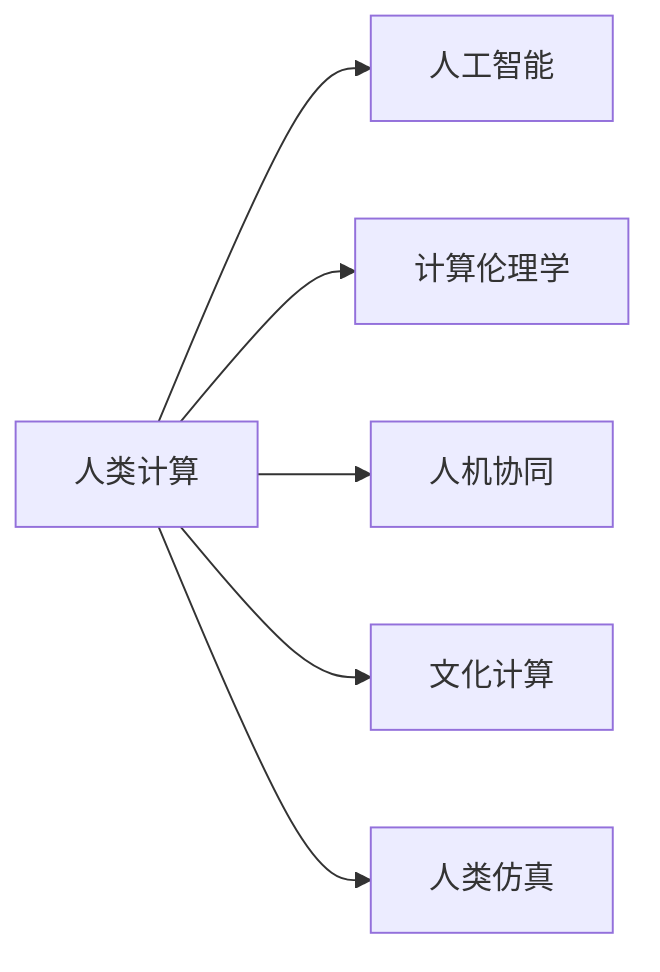

                 

# 人类计算：科技与人文的融合

## 1. 背景介绍

### 1.1 问题由来
近年来，人工智能(AI)技术的迅猛发展，尤其是深度学习、自然语言处理(NLP)、计算机视觉等领域，极大地推动了科技进步，带来了前所未有的便利和效率。但与此同时，技术的快速发展也引发了一系列伦理、社会、文化等方面的问题。如何在这波科技浪潮中保持科技与人文的融合，成为一个亟待解决的重要课题。

### 1.2 问题核心关键点
技术发展与人文融合的问题核心在于如何在技术进步与人类价值之间取得平衡，具体来说，包括：
- **伦理道德**：AI技术应用中涉及的隐私、安全、公正、责任等问题。
- **社会影响**：技术对就业、教育、医疗、政府治理等方面的影响。
- **文化融合**：AI技术如何与人类文化传统、艺术创作、思维方式等相融合。
- **人机交互**：AI系统如何更好地理解人类的情感、意图、价值观等，实现人机协同。

## 2. 核心概念与联系

### 2.1 核心概念概述

为更好地理解人类计算的哲学与实践，本节将介绍几个关键概念：

- **人类计算**：通过计算思维和计算工具，在工程技术、科学研究、社会创新等领域进行问题求解的过程。人类计算强调计算工具的辅助作用，而非取代人类智能。

- **人工智能(AI)**：通过计算机模拟人类智能行为，如学习、推理、感知、决策等。AI技术正逐步在各种领域中替代传统的人工劳动，提高效率，改善生活质量。

- **计算伦理学**：研究计算技术在伦理和道德层面的应用，关注AI技术可能带来的社会、伦理问题，寻求计算与伦理的平衡点。

- **人机协同**：通过人机交互界面、自然语言处理等技术，使得计算机系统能够更好地理解人类意图，提供智能辅助。

- **文化计算**：研究计算机如何在艺术、文学、语言学等领域，理解和生成人类的文化和艺术作品。

- **人类仿真**：利用计算机模拟人类行为、认知等，如虚拟现实、心理仿真等，以探索人类行为的规律和心理机制。

### 2.2 核心概念原理和架构的 Mermaid 流程图



这个流程图展示了人类计算的各个核心概念及其相互关系：

1. **人类计算**：通过AI和其他计算工具，辅助解决各种实际问题，是计算技术的应用层面。
2. **人工智能**：提供计算能力，模拟人类智能，是实现人类计算的技术基础。
3. **计算伦理学**：关注AI技术的应用道德和伦理问题，确保技术发展的健康方向。
4. **人机协同**：通过人机交互技术，提升计算工具的智能化水平，实现高效协同。
5. **文化计算**：利用计算工具研究、生成人类文化和艺术，促进文化传承与创新。
6. **人类仿真**：利用计算工具模拟人类行为和心理，探索人类认知规律。

这些概念共同构成了人类计算的哲学和实践框架，帮助我们理解AI技术如何服务于人类，同时又保持人类的主导地位。

## 3. 核心算法原理 & 具体操作步骤

### 3.1 算法原理概述

人类计算的核心在于通过计算工具和计算思维解决实际问题，其算法原理主要体现在以下几个方面：

1. **算法设计**：设计能够高效解决实际问题的算法，如排序算法、图算法、优化算法等。
2. **数据处理**：通过数据清洗、预处理、特征工程等手段，提升数据质量，支持算法计算。
3. **模型训练**：利用监督学习、无监督学习、强化学习等方法，训练出能够泛化新数据的模型。
4. **计算优化**：通过并行计算、分布式计算、优化算法等手段，提升计算效率，支持大规模数据处理。
5. **人机交互设计**：设计用户友好的界面，支持用户与计算系统的高效互动。

### 3.2 算法步骤详解

基于上述算法原理，人类计算的步骤大致如下：

1. **问题定义**：明确需要解决的问题，如数据分类、路径规划、机器人导航等。
2. **数据收集与处理**：收集相关数据，进行清洗、标注、特征提取等处理，确保数据质量。
3. **算法选择与训练**：根据问题特点，选择合适的算法并训练模型，优化模型性能。
4. **计算部署与优化**：将训练好的模型部署到计算平台上，进行优化和测试。
5. **人机交互设计**：设计用户界面，支持用户与计算系统的交互，提升用户体验。

### 3.3 算法优缺点

人类计算算法的设计和应用，既有其优势，也存在一些局限：

**优点**：
- **高效性**：通过算法设计和计算优化，能够高效解决复杂问题。
- **可扩展性**：算法可以并行计算，支持大规模数据处理。
- **灵活性**：算法可以根据问题特点进行灵活设计，适应性强。

**缺点**：
- **复杂性**：算法设计和模型训练过程复杂，需要大量经验和专业知识。
- **数据依赖**：算法依赖高质量数据，数据不足或质量不高时效果不佳。
- **模型泛化**：模型对新数据泛化能力有限，需要不断更新和优化。
- **伦理风险**：算法可能存在偏见、歧视等问题，需关注计算伦理学。

### 3.4 算法应用领域

人类计算的算法在多个领域得到了广泛应用，例如：

1. **科学研究**：通过计算模拟，支持物理、化学、生物等领域的研究，如分子动力学模拟、量子计算等。
2. **工程设计**：通过计算优化，提升设计效率，如CFD模拟、机器人路径规划等。
3. **金融分析**：通过数据分析，支持风险评估、投资策略等，如机器学习、量化交易等。
4. **医疗健康**：通过数据分析和计算，支持疾病诊断、个性化治疗等，如医学影像分析、基因组学等。
5. **教育培训**：通过计算分析，提升教育质量，如智能辅导、学习路径推荐等。
6. **文化艺术**：通过计算生成和分析，支持文化传承与创新，如文本生成、艺术创作等。
7. **社会治理**：通过数据分析，支持政策制定、公共服务优化等，如智慧城市、大数据治理等。

## 4. 数学模型和公式 & 详细讲解 & 举例说明

### 4.1 数学模型构建

在人类计算中，数学模型是问题求解的基础，以下以机器学习中的线性回归模型为例，展示数学模型的构建过程。

假设要解决一个房屋价格预测问题，已知房屋面积 $x_i$ 和价格 $y_i$ 的样本数据，可以通过线性回归模型 $y_i = w_0 + w_1x_i + \epsilon_i$ 进行预测，其中 $w_0, w_1$ 为模型参数，$\epsilon_i$ 为误差项。

### 4.2 公式推导过程

将上述线性回归模型应用到样本数据上，可以构建如下经验风险函数：

$$
\mathcal{L}(w_0, w_1) = \frac{1}{N} \sum_{i=1}^N (y_i - w_0 - w_1x_i)^2
$$

通过最小化经验风险函数，得到最优的模型参数 $w_0^*, w_1^*$：

$$
\begin{cases}
w_0^* = \frac{1}{N} \sum_{i=1}^N (y_i - w_1^*x_i) \\
w_1^* = \frac{1}{N} \sum_{i=1}^N (x_i - \bar{x})(y_i - w_1^*x_i)
\end{cases}
$$

其中 $\bar{x} = \frac{1}{N} \sum_{i=1}^N x_i$ 为样本数据的均值。

### 4.3 案例分析与讲解

假设某房地产公司有历史销售数据，利用线性回归模型预测新房屋的价格，步骤如下：

1. **数据准备**：收集历史销售数据，并进行清洗、标注等预处理。
2. **模型训练**：根据线性回归模型公式，使用历史数据训练模型，得到最优参数 $w_0^*, w_1^*$。
3. **预测验证**：使用新数据进行模型验证，评估预测结果的准确性。
4. **优化调整**：根据验证结果，调整模型参数，优化预测性能。
5. **部署应用**：将训练好的模型部署到实际系统中，进行价格预测。

## 5. 项目实践：代码实例和详细解释说明

### 5.1 开发环境搭建

在进行人类计算实践前，我们需要准备好开发环境。以下是使用Python进行Scikit-learn开发的环境配置流程：

1. 安装Anaconda：从官网下载并安装Anaconda，用于创建独立的Python环境。

2. 创建并激活虚拟环境：
```bash
conda create -n sklearn-env python=3.8 
conda activate sklearn-env
```

3. 安装Scikit-learn：
```bash
pip install scikit-learn
```

4. 安装各类工具包：
```bash
pip install numpy pandas matplotlib scikit-learn matplotlib scikit-learn jupyter notebook ipython
```

完成上述步骤后，即可在`sklearn-env`环境中开始项目实践。

### 5.2 源代码详细实现

下面我们以线性回归模型为例，给出使用Scikit-learn进行房屋价格预测的PyTorch代码实现。

```python
from sklearn.linear_model import LinearRegression
from sklearn.model_selection import train_test_split
from sklearn.metrics import mean_squared_error
import numpy as np

# 数据准备
X = np.array([[100, 2], [120, 2.5], [130, 3], [150, 3.5], [160, 4]])
y = np.array([3000000, 4000000, 5000000, 6000000, 7000000])

# 划分训练集和测试集
X_train, X_test, y_train, y_test = train_test_split(X, y, test_size=0.2, random_state=42)

# 模型训练
model = LinearRegression()
model.fit(X_train, y_train)

# 模型评估
y_pred = model.predict(X_test)
mse = mean_squared_error(y_test, y_pred)

print(f"MSE: {mse:.2f}")
```

### 5.3 代码解读与分析

让我们再详细解读一下关键代码的实现细节：

**数据准备**：
- `X`为房屋面积，`y`为房价。
- `train_test_split`函数用于将数据集划分为训练集和测试集。

**模型训练**：
- 使用`LinearRegression`类训练线性回归模型。
- `fit`方法用于模型拟合，训练得到模型参数。

**模型评估**：
- `predict`方法用于模型预测，得到测试集上的预测值。
- `mean_squared_error`函数用于计算预测值与真实值之间的均方误差。

**结果展示**：
- 输出均方误差，评估模型预测效果。

## 6. 实际应用场景

### 6.1 科学研究

在科学研究领域，计算思维和计算工具广泛应用于各类问题的求解和验证。例如，在化学领域，通过分子动力学模拟，可以预测分子结构和反应机理；在天文学领域，通过计算模型，可以模拟宇宙大尺度结构演化；在生物学领域，通过计算基因组学，可以揭示生命起源和演化机制。

### 6.2 工程设计

工程设计中，计算工具和算法也发挥了重要作用。例如，CFD计算可以模拟流体流动和热交换过程，CFD优化可以提升设计效率和性能；机器人路径规划可以通过计算生成最优路径，提升机器人作业效率；工业控制可以通过计算优化生产流程，降低能耗和成本。

### 6.3 金融分析

在金融分析领域，计算工具和算法广泛用于风险评估、投资策略等。例如，机器学习算法可以分析股票市场趋势，预测股票价格变化；量化交易算法可以通过计算优化交易策略，提升投资收益；信用评估模型可以计算个人信用风险，进行信用评估和贷款审批。

### 6.4 医疗健康

在医疗健康领域，计算工具和算法广泛用于疾病诊断、个性化治疗等。例如，医学影像分析可以通过计算生成和分析图像，辅助医生诊断疾病；基因组学可以通过计算分析基因数据，发现疾病基因突变；个性化治疗可以通过计算生成个性化治疗方案，提升治疗效果。

### 6.5 教育培训

在教育培训领域，计算工具和算法广泛用于学生评估、课程设计等。例如，学习路径推荐可以通过计算生成个性化学习路径，提升学习效果；智能辅导可以通过计算生成答疑解惑，辅助学生学习；教育数据分析可以通过计算分析学生学习行为，提升教育质量。

### 6.6 文化艺术

在文化艺术领域，计算工具和算法广泛用于艺术创作、文化传承等。例如，文本生成算法可以创作诗歌、小说等文学作品；图像生成算法可以生成艺术画作；音乐生成算法可以创作音乐作品。

### 6.7 社会治理

在社会治理领域，计算工具和算法广泛用于公共服务优化、政策制定等。例如，智慧城市可以通过计算分析城市数据，优化城市管理；大数据治理可以通过计算分析社会数据，辅助政策制定；舆情分析可以通过计算分析社交媒体数据，监测社会舆情。

## 7. 工具和资源推荐

### 7.1 学习资源推荐

为了帮助开发者系统掌握人类计算的理论基础和实践技巧，这里推荐一些优质的学习资源：

1. 《计算思维导论》书籍：深入浅出地介绍了计算思维的概念、原理和应用，适合初学者入门。
2. 《人工智能导论》课程：斯坦福大学开设的AI课程，涵盖机器学习、深度学习、自然语言处理等内容。
3. 《人工智能伦理》书籍：探讨AI技术在伦理和道德层面的应用，关注AI技术可能带来的社会、伦理问题。
4. 《人机协同设计》书籍：介绍人机交互设计的基本原理和实践方法，支持人机协同应用开发。
5. 《文化计算》课程：斯坦福大学开设的文化计算课程，涵盖计算与文化的多领域融合。

通过对这些资源的学习实践，相信你一定能够快速掌握人类计算的精髓，并用于解决实际的计算问题。

### 7.2 开发工具推荐

高效的开发离不开优秀的工具支持。以下是几款用于人类计算开发的常用工具：

1. Python：基于Python的开源编程语言，语法简洁，支持科学计算和数据分析。
2. Scikit-learn：基于Python的机器学习库，提供丰富的算法实现和工具支持。
3. TensorFlow：由Google主导开发的开源深度学习框架，支持分布式计算和大规模模型训练。
4. PyTorch：由Facebook主导的开源深度学习框架，支持动态计算图和高效训练。
5. R语言：基于R的开源数据分析语言，广泛应用于统计分析和数据可视化。
6. MATLAB：基于MATLAB的科学计算软件，提供强大的数学计算和图形化界面支持。

合理利用这些工具，可以显著提升人类计算的开发效率，加快创新迭代的步伐。

### 7.3 相关论文推荐

人类计算和人工智能技术的发展源于学界的持续研究。以下是几篇奠基性的相关论文，推荐阅读：

1. Alan Turing的《计算机器与智能》：探讨了人工智能的概念和计算能力。
2. John McCarthy的《什么是人工智能》：定义了人工智能的概念和应用领域。
3. 马文·明斯基的《心智社会》：探讨了计算机与人类认知的关系。
4. Judea Pearl的《因果推理》：介绍了因果推理的基本概念和方法。
5. Tim Roughgarden的《算法设计》：介绍了算法设计和优化的基本原理和实践方法。
6. Rodney Brooks的《智能机器》：探讨了智能机器的设计和应用。

这些论文代表了大计算和人工智能技术的发展脉络。通过学习这些前沿成果，可以帮助研究者把握学科前进方向，激发更多的创新灵感。

## 8. 总结：未来发展趋势与挑战

### 8.1 总结

本文对人类计算的哲学和实践进行了全面系统的介绍。首先阐述了人类计算的概念和哲学基础，明确了计算技术在科学研究、工程设计、社会治理等领域的广泛应用。其次，从原理到实践，详细讲解了线性回归模型的构建和训练过程，给出了代码实例和详细解释。同时，本文还广泛探讨了人类计算在各个行业领域的应用前景，展示了计算技术的强大潜力。最后，本文精选了计算技术和人工智能的相关学习资源，力求为读者提供全方位的技术指引。

通过本文的系统梳理，可以看到，人类计算通过计算工具和计算思维，极大地提升了各类问题的求解效率，为科学研究、工程设计、社会治理等领域带来了深刻的变革。未来，伴随计算技术的不断演进，计算思维的应用将更加广泛，计算工具的智能化水平将不断提升，人类计算将逐步成为各个领域创新的重要手段。

### 8.2 未来发展趋势

展望未来，人类计算的发展趋势包括以下几个方面：

1. **计算工具智能化**：未来的计算工具将更加智能化，能够自动进行数据处理、算法优化、结果解释等，提升计算效率和用户体验。
2. **跨领域融合**：计算技术与不同领域的应用将更加紧密融合，如计算生物学、计算社会学、计算美学等，推动多学科交叉创新。
3. **计算伦理规范化**：随着计算技术的应用越来越广泛，计算伦理和法律规范将更加完善，确保技术应用的社会责任和伦理安全。
4. **人机协同优化**：未来的人机交互将更加智能和自然，人机协同将更加高效和稳定，提升系统的智能化水平。
5. **计算环境生态化**：未来的计算环境将更加开放和协作，计算工具和算法将更加标准化和规范化，支持大规模计算和数据共享。
6. **计算技术普及化**：未来的计算技术将更加普及，普通用户能够更方便地使用计算工具和算法，解决实际问题。

### 8.3 面临的挑战

尽管人类计算技术已经取得了瞩目成就，但在迈向更加智能化、普适化应用的过程中，它仍面临着诸多挑战：

1. **数据质量瓶颈**：计算工具依赖高质量数据，数据不足或质量不高时效果不佳，需进一步提升数据采集和处理能力。
2. **模型泛化能力**：计算模型对新数据泛化能力有限，需不断更新和优化模型，提升模型泛化性。
3. **伦理道德问题**：计算技术的应用可能带来隐私、安全、偏见等问题，需关注计算伦理学，确保技术应用的伦理安全。
4. **计算资源需求**：大规模计算和数据处理需要大量计算资源，需优化计算工具和算法，提高计算效率。
5. **人机协同难度**：人机协同需要理解人类意图和行为，需进一步提升人机交互界面和算法设计，提升协同效率。
6. **跨领域融合复杂度**：跨领域融合需要融合不同领域的数据和知识，需进一步提升跨领域融合的算法和工具。

### 8.4 研究展望

面对人类计算面临的挑战，未来的研究需要在以下几个方面寻求新的突破：

1. **计算技术优化**：开发更加高效、易用的计算工具和算法，提升计算效率和用户体验。
2. **数据质量提升**：提升数据采集和处理能力，确保计算模型能够充分利用高质量数据。
3. **模型泛化优化**：开发更加泛化的计算模型，提升模型的泛化能力和适应性。
4. **计算伦理保障**：建立计算伦理和法律规范，确保计算技术应用的伦理安全和社会责任。
5. **人机协同创新**：开发更加智能的人机交互界面和算法，提升人机协同的效率和质量。
6. **跨领域融合技术**：开发跨领域融合的计算工具和算法，支持多学科交叉创新。

这些研究方向将推动人类计算技术的不断发展，为科学研究、工程设计、社会治理等领域带来更加深刻的变革，为人类的未来发展提供强有力的技术支持。

## 9. 附录：常见问题与解答

**Q1：人类计算与人工智能的区别是什么？**

A: 人类计算强调计算工具和计算思维的辅助作用，通过计算工具解决实际问题。而人工智能强调通过计算机模拟人类智能，具有自主学习、推理、决策等能力。两者的区别在于，人类计算以人类为主导，人工智能以机器为主导。

**Q2：人类计算是否适用于所有领域？**

A: 人类计算适用于需要大量数据处理和计算分析的领域，如科学研究、工程设计、社会治理等。但对于一些需要人类创造力和情感体验的领域，如艺术创作、文学创作等，计算工具的辅助作用有限，仍需依赖人类创意。

**Q3：人类计算面临的最大挑战是什么？**

A: 人类计算面临的最大挑战是数据质量和伦理道德问题。高质量的数据是计算工具有效运行的基础，伦理道德问题则关系到计算技术应用的伦理安全和社会责任。

**Q4：如何提升计算模型的泛化能力？**

A: 提升计算模型的泛化能力需要进一步优化算法和模型设计，增加模型训练数据的多样性，进行迁移学习和跨领域融合等。

**Q5：未来人类计算的发展方向是什么？**

A: 未来人类计算的发展方向包括计算工具智能化、跨领域融合、计算伦理规范化、人机协同优化、计算环境生态化、计算技术普及化等。这些方向将推动人类计算技术的不断演进，带来更加深刻的社会变革。

---

作者：禅与计算机程序设计艺术 / Zen and the Art of Computer Programming

