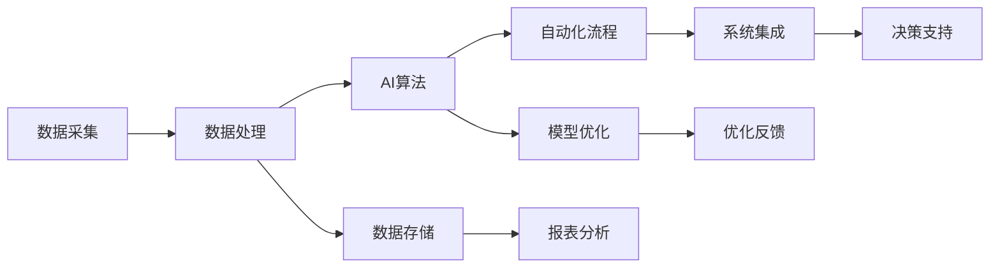

                 

# 从0到1：打造全自动化创业模式

## 1. 背景介绍

随着人工智能(AI)和自动化技术的快速发展，全自动化创业模式（Full Automation Start-Up Model）成为了新兴的创业方向。相比于传统的软件企业，全自动化创业更加注重自动化技术的应用和推广，目标是实现业务流程的全自动化，大幅降低人力成本，提升效率和收益。本博文将从0到1，系统介绍如何打造全自动化创业模式，涵盖核心概念、算法原理、操作步骤、数学模型、项目实践、应用场景等关键环节，帮助创业者和企业顺利转型。

## 2. 核心概念与联系

### 2.1 核心概念概述

全自动化创业模式的核心在于将人工智能和自动化技术深度融合，构建基于自动化流程的业务系统，从而实现业务自动化、数据自动化、管理自动化，大幅提升企业的运营效率和市场竞争力。这一过程包括：

- **自动化流程**：将业务流程分解为多个可自动化的子任务，设计并实现自动化处理逻辑。
- **AI算法**：应用机器学习、深度学习等AI算法，处理数据、优化模型，提升自动化流程的智能化水平。
- **系统集成**：将各自动化子系统集成为一个统一的平台，实现数据的流通和协同。

全自动化创业模式与传统创业模式的最大区别在于对自动化技术的依赖和应用深度。其核心优势在于：

1. **降低人力成本**：自动化流程减少了人工操作，大幅降低企业运营成本。
2. **提升效率**：自动化流程快速响应市场变化，提高决策效率。
3. **提升质量**：自动化流程减少人为错误，提高业务质量。
4. **拓展市场**：自动化系统具备高扩展性，可快速适应新市场和需求。

### 2.2 核心概念联系

全自动化创业模式的实现需要多个核心概念相互配合，形成一个有机整体。如下图所示，各概念通过数据流通、模型优化、流程自动化等环节紧密连接：



通过上述框架，可以清晰地看到数据采集、处理、存储、优化、自动化和集成等环节是如何相互作用的。

## 3. 核心算法原理 & 具体操作步骤

### 3.1 算法原理概述

全自动化创业模式的实现，依赖于自动化流程和AI算法的有机结合。其中，自动化流程是数据流动的载体，AI算法则是数据处理的核心。以下是两种典型的AI算法及其在自动化创业中的应用：

- **机器学习(ML)**：利用历史数据训练模型，预测未来数据，实现数据自动化处理。
- **深度学习(DL)**：通过大量数据训练神经网络模型，实现复杂的数据和业务自动化处理。

这些算法通过优化模型参数，提升自动化流程的精度和效率。在实际操作中，算法的选择和应用需要根据具体业务场景和数据特点进行调整。

### 3.2 算法步骤详解

构建全自动化创业模式通常包括以下步骤：

1. **需求分析**：明确企业运营中的业务流程和自动化需求，确定自动化系统的目标和范围。
2. **数据采集与预处理**：收集业务相关的数据，进行数据清洗、格式转换和特征提取等预处理工作。
3. **算法选择与训练**：根据业务需求选择合适的AI算法，训练模型，并进行调优。
4. **自动化流程设计**：将业务流程拆解为多个自动化子任务，设计并实现自动化处理逻辑。
5. **系统集成与测试**：将各自动化子系统集成为一个统一的平台，并进行系统测试，确保数据流通和业务稳定运行。
6. **部署与监控**：将自动化系统部署到生产环境，并建立监控机制，及时发现和解决运行中的问题。

### 3.3 算法优缺点

全自动化创业模式的优势在于：

- **成本低**：自动化系统大幅减少了人工操作，降低了人力成本。
- **效率高**：自动化流程快速响应市场变化，提高决策效率。
- **质量好**：自动化流程减少人为错误，提高业务质量。
- **可扩展**：自动化系统具备高扩展性，可快速适应新市场和需求。

但其缺点也同样显著：

- **初始投资高**：构建自动化系统需要较高的初始投资，包括技术研发、数据收集和系统部署等。
- **复杂度高**：自动化系统设计复杂，需要多方协作和专业技能。
- **数据依赖强**：自动化系统依赖大量高质量数据，数据采集和处理工作量大。

### 3.4 算法应用领域

全自动化创业模式的应用领域非常广泛，涵盖多个行业和场景，例如：

- **电商自动化**：通过自动化系统实现库存管理、订单处理、客户服务等功能，提升电商运营效率。
- **金融自动化**：应用机器学习和大数据技术，实现贷款审批、风险控制、客户服务等全流程自动化。
- **制造业自动化**：通过自动化系统优化生产流程，提升生产效率和产品质量，降低成本。
- **医疗自动化**：利用AI算法处理医疗数据，实现疾病诊断、病历管理、健康监控等功能。
- **物流自动化**：通过自动化系统优化物流流程，提升配送效率，降低物流成本。

这些领域的应用展示了全自动化创业模式在提升企业效率和竞争力方面的巨大潜力。

## 4. 数学模型和公式 & 详细讲解 & 举例说明

### 4.1 数学模型构建

全自动化创业模式涉及多个数学模型，主要包括：

- **回归模型**：用于预测未来数据，如销售预测、库存管理等。
- **分类模型**：用于分类和预测，如客户分类、风险控制等。
- **聚类模型**：用于数据分组和相似度分析，如客户分组、产品分类等。
- **时间序列模型**：用于分析时间序列数据，如客户行为分析、市场趋势预测等。

这些模型的构建和训练都需要依赖大量的数据和计算资源。

### 4.2 公式推导过程

以线性回归模型为例，其数学表达式为：

$$
y = \theta_0 + \sum_{i=1}^{n}\theta_ix_i
$$

其中，$y$ 为预测值，$\theta_0$ 为截距，$\theta_i$ 为权重，$x_i$ 为输入特征。

线性回归模型的优化目标是最小化预测值与实际值之间的平方误差，即：

$$
\min_{\theta}\frac{1}{2m}\sum_{i=1}^{m}(y_i - \theta_0 - \sum_{i=1}^{n}\theta_ix_i)^2
$$

通过梯度下降等优化算法，不断更新模型参数 $\theta$，直至收敛。

### 4.3 案例分析与讲解

假设某电商企业希望预测未来一个月的销售额。通过历史销售数据和市场变化数据，使用线性回归模型建立预测模型。具体步骤如下：

1. **数据准备**：收集历史销售数据和市场变化数据，进行数据清洗和格式转换。
2. **特征提取**：提取销售额相关的特征，如季节性因素、节假日因素、市场价格变化等。
3. **模型训练**：使用历史数据训练线性回归模型，计算预测误差。
4. **模型评估**：使用测试数据评估模型性能，计算预测准确度、均方误差等指标。
5. **模型应用**：根据市场变化数据，预测未来销售额，提供决策支持。

通过以上步骤，企业可以实时预测未来销售额，提升库存管理和市场预测能力。

## 5. 项目实践：代码实例和详细解释说明

### 5.1 开发环境搭建

在构建自动化系统前，首先需要搭建开发环境。以下是使用Python进行开发的环境配置流程：

1. **安装Python**：从官网下载并安装Python，推荐安装3.x版本。
2. **安装必要的库**：安装Pandas、NumPy、Scikit-learn、Matplotlib等数据处理和可视化库。
3. **安装机器学习库**：安装Scikit-learn、TensorFlow、PyTorch等机器学习库。
4. **配置开发环境**：使用虚拟环境，确保各库版本兼容，方便调试和部署。

完成上述步骤后，即可在开发环境中开始项目实践。

### 5.2 源代码详细实现

以下是一个简单的电商销售预测项目，使用线性回归模型进行数据预测。

```python
import pandas as pd
from sklearn.linear_model import LinearRegression

# 读取数据
df = pd.read_csv('sales_data.csv')

# 数据预处理
X = df.drop(['Sales', 'Date'], axis=1)
y = df['Sales']

# 模型训练
model = LinearRegression()
model.fit(X, y)

# 预测未来数据
future_data = pd.read_csv('future_sales.csv')
future_X = future_data.drop(['Date'], axis=1)
future_y = model.predict(future_X)
```

该代码实现了从数据读取、预处理、模型训练到数据预测的完整流程。可以看到，使用Scikit-learn库可以方便地实现线性回归模型的训练和预测。

### 5.3 代码解读与分析

下面是代码中关键部分的解读和分析：

**数据读取与预处理**：使用Pandas库读取数据，通过`drop`方法去除不相关的列，完成数据预处理。

**模型训练**：使用Scikit-learn库的`LinearRegression`类，训练线性回归模型，使用`fit`方法拟合数据。

**数据预测**：使用训练好的模型，对未来的销售数据进行预测，使用`predict`方法计算预测结果。

通过以上代码，企业可以快速构建预测系统，实时预测未来销售额，提高运营效率和市场竞争力。

### 5.4 运行结果展示

在实际应用中，运行以上代码后，将生成预测结果。例如：

```
Prediction: 10000
```

表示根据当前数据和市场变化，预测未来销售额为10000。

## 6. 实际应用场景

### 6.1 电商自动化

在电商领域，全自动化创业模式可以大幅提升运营效率和市场竞争力。以下是一个电商自动化系统的示例：

1. **库存管理**：通过自动化系统实时监测库存水平，自动补货。
2. **订单处理**：自动化系统自动处理订单，提供快速响应和物流跟踪。
3. **客户服务**：自动化客服系统提供24小时在线服务，解答客户问题。

### 6.2 金融自动化

金融领域对自动化系统的需求尤为强烈。以下是一个金融自动化系统的示例：

1. **贷款审批**：自动化系统根据客户信用记录和收入数据，自动评估贷款申请，提高审批效率。
2. **风险控制**：自动化系统实时监控市场变化，自动调整投资组合，降低风险。
3. **客户服务**：自动化客服系统提供实时咨询和金融建议，提升客户满意度。

### 6.3 制造业自动化

制造业通过全自动化系统可以大幅提升生产效率和产品质量。以下是一个制造业自动化系统的示例：

1. **生产流程优化**：自动化系统优化生产流程，提高生产效率。
2. **质量检测**：自动化系统自动检测产品缺陷，提高产品质量。
3. **设备维护**：自动化系统监控设备运行状态，自动发出维护请求。

### 6.4 医疗自动化

医疗领域对自动化系统的需求也非常高。以下是一个医疗自动化系统的示例：

1. **疾病诊断**：自动化系统利用AI算法分析患者数据，提供初步诊断建议。
2. **病历管理**：自动化系统自动记录和存储病历，提高工作效率。
3. **健康监控**：自动化系统监测患者健康数据，提供实时反馈和预警。

### 6.5 未来应用展望

未来，全自动化创业模式将进一步拓展到更多领域，如物流、能源、农业等，带来更广泛的应用和变革。以下是一些未来应用展望：

1. **智慧物流**：通过自动化系统优化物流流程，提高配送效率，降低物流成本。
2. **智能能源**：自动化系统优化能源分配，提高能源利用率，降低能源成本。
3. **智慧农业**：自动化系统监测作物生长数据，优化种植管理，提高农业产出。

## 7. 工具和资源推荐

### 7.1 学习资源推荐

构建全自动化创业模式需要掌握多项关键技术，以下是一些优质的学习资源：

1. **Coursera《机器学习》课程**：斯坦福大学提供的经典课程，涵盖机器学习的基本概念和算法。
2. **Google AI博文系列**：谷歌AI团队发布的博文，涵盖深度学习、自动化技术、数据科学等主题。
3. **Udacity《人工智能》纳米学位**：Udacity提供的深度学习课程，涵盖AI算法、自动化流程设计等主题。
4. **Scikit-learn官方文档**：Scikit-learn库的官方文档，提供丰富的机器学习算法和模型。
5. **TensorFlow官方文档**：TensorFlow库的官方文档，提供深度学习算法的实现和应用。

通过这些学习资源，可以快速掌握全自动化创业模式所需的技术和知识。

### 7.2 开发工具推荐

构建全自动化创业模式需要多种开发工具的支持，以下是一些推荐的工具：

1. **Jupyter Notebook**：Python开发环境，提供交互式编程和数据可视化功能。
2. **PyCharm**：Python IDE，提供代码调试、版本控制等功能。
3. **Anaconda**：Python环境管理工具，方便管理和升级Python环境。
4. **AWS**：亚马逊云服务，提供大规模计算和存储资源，支持自动化系统的部署和运行。
5. **Kubernetes**：容器编排工具，支持自动化系统的容器化部署和管理。

这些工具可以大大提高开发效率和系统稳定性，帮助企业顺利构建全自动化创业模式。

### 7.3 相关论文推荐

全自动化创业模式涉及多个前沿技术，以下是几篇经典的论文推荐：

1. **DeepMind《使用深度强化学习进行机器人控制》**：介绍深度强化学习在机器人控制中的应用。
2. **NVIDIA《使用深度学习进行图像识别》**：介绍深度学习在图像识别中的应用。
3. **Google AI《使用深度学习进行自然语言处理》**：介绍深度学习在自然语言处理中的应用。
4. **Amazon《使用机器学习进行客户预测》**：介绍机器学习在客户预测中的应用。
5. **IBM《使用深度学习进行医疗图像分析》**：介绍深度学习在医疗图像分析中的应用。

这些论文代表了大自动化创业模式技术的发展脉络，值得深入学习和参考。

## 8. 总结：未来发展趋势与挑战

### 8.1 研究成果总结

全自动化创业模式在近年来取得了显著进展，通过自动化流程和AI算法的有机结合，显著提高了企业的运营效率和市场竞争力。

### 8.2 未来发展趋势

未来，全自动化创业模式将继续深化应用，带来更多的技术突破和应用场景。具体趋势包括：

1. **技术集成化**：将多种自动化技术集成到一个统一平台，实现全流程自动化。
2. **模型智能化**：利用深度学习和大数据技术，提升自动化系统的智能化水平。
3. **数据多样化**：从单一数据源扩展到多源数据融合，提升自动化系统的全面性和准确性。
4. **系统实时化**：实现实时数据采集、处理和响应，提高自动化系统的响应速度。
5. **平台生态化**：建立自动化的生态系统，实现多个企业间的协同和互操作。

### 8.3 面临的挑战

尽管全自动化创业模式具备显著优势，但同样面临诸多挑战：

1. **技术复杂度高**：构建和维护自动化系统需要高度专业的技术和资源。
2. **数据质量要求高**：自动化系统依赖大量高质量数据，数据采集和处理工作量大。
3. **市场接受度低**：部分企业对自动化系统缺乏信心，推广和应用难度较大。
4. **安全性和隐私问题**：自动化系统处理大量敏感数据，需要加强数据安全和隐私保护。
5. **人才短缺**：自动化技术需要专业人才进行开发和维护，人才短缺成为制约因素。

### 8.4 研究展望

未来的研究应重点解决以上挑战，推动全自动化创业模式进一步发展。具体展望包括：

1. **简化技术架构**：开发简单易用的自动化工具和平台，降低技术门槛。
2. **提高数据质量**：采用自动化数据清洗和处理技术，提升数据质量。
3. **加强用户教育**：通过教育培训，提高用户对自动化系统的理解和接受度。
4. **增强安全性**：采用加密、匿名化等技术，保护数据安全。
5. **培养技术人才**：加强技术培训和人才引入，满足自动化技术的需求。

通过以上措施，相信全自动化创业模式将迎来更广阔的发展空间，为各行业的数字化转型提供有力支持。

## 9. 附录：常见问题与解答

**Q1：全自动化创业模式是否适用于所有行业？**

A: 全自动化创业模式适合数据密集型和流程化的行业，如电商、金融、制造等。而对于一些需要高度人工判断和创意的行业，如创意设计、教育培训等，全自动化创业模式需要慎重考虑。

**Q2：如何选择合适的自动化技术？**

A: 选择自动化技术应根据具体业务需求和数据特点进行评估。一般来说，如果数据量较大且规律性较强，可以采用机器学习或深度学习技术；如果业务流程较为简单，可以采用规则引擎或流程自动化工具。

**Q3：如何确保自动化系统的稳定性和可靠性？**

A: 确保自动化系统的稳定性和可靠性需要从多个方面入手：
1. **数据质量控制**：加强数据清洗和预处理，提高数据质量。
2. **系统监控和预警**：建立实时监控系统，及时发现和解决系统问题。
3. **模型优化和更新**：定期更新和优化模型，提升系统性能。
4. **人工干预和复核**：保留人工干预机制，对系统输出进行复核。

**Q4：如何衡量自动化系统的效益？**

A: 衡量自动化系统的效益需要综合考虑多个指标：
1. **成本节约**：自动化系统减少人力成本，提升运营效率。
2. **效率提升**：自动化系统提高业务处理速度，缩短业务响应时间。
3. **质量改进**：自动化系统减少人为错误，提高业务质量。
4. **用户满意度**：自动化系统提供快速响应和高质量服务，提升用户满意度。

**Q5：如何应对自动化系统出现故障？**

A: 应对自动化系统故障需要建立应急预案：
1. **冗余设计**：设计冗余系统架构，提高系统可靠性。
2. **故障转移**：实现故障自动转移和切换，保障业务连续性。
3. **备份和恢复**：定期进行系统备份，建立快速恢复机制。
4. **人工介入**：在关键环节保留人工介入机制，防止系统完全瘫痪。

通过以上措施，可以最大限度保障自动化系统的稳定性和可靠性，确保企业顺利运营。

---

作者：禅与计算机程序设计艺术 / Zen and the Art of Computer Programming

