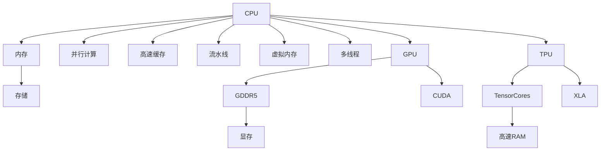

                 

# 从CPU到LLM：计算架构的演进历程

> 关键词：计算架构演进, CPU, GPU, TPU, 神经网络, 深度学习, LLM, 大模型

## 1. 背景介绍

在现代计算机科学的历史长河中，计算架构的演进一直是技术发展的核心驱动力之一。从最初的电子管和晶体管到后来的CPU和GPU，再到如今如火如荼的人工智能领域中的TPU，每一代计算架构的演进都为计算性能和应用场景的拓展带来了革命性的改变。本文将回顾计算架构的演进历程，并重点探讨深度学习时代的TPU架构及其在大模型中的独特应用。

## 2. 核心概念与联系

### 2.1 核心概念概述

计算架构指的是支持数据处理和计算的硬件和软件组件的布局和互联方式。核心概念包括CPU、GPU、TPU等不同类型的处理器，以及这些处理器在深度学习、大规模语言模型(LLM)等AI应用中的作用。

- **CPU (中央处理器)**：传统的通用处理器，通过流水线、缓存和虚拟内存等技术，实现高效的计算和数据处理。
- **GPU (图形处理器)**：专门用于并行计算和图像处理的高效处理器，具有强大的浮点计算能力。
- **TPU (张量处理单元)**：Google开发的专门用于深度学习和人工智能计算的硬件加速器，提供了极高的吞吐量和效率。

### 2.2 核心概念原理和架构的 Mermaid 流程图



这个流程图展示了三种主要计算架构：CPU、GPU和TPU的组成及其核心特性。CPU通过流水线、缓存和多线程等技术提升性能；GPU利用并行计算和GDDR5显存，适用于图像处理和深度学习；TPU则提供专门设计的TensorCore和高速RAM，为大模型训练和推理提供极致加速。

## 3. 核心算法原理 & 具体操作步骤

### 3.1 算法原理概述

深度学习和大规模语言模型在计算架构的演进中起到了至关重要的作用。早期，深度学习模型主要由CPU和GPU支持，通过分布式训练和优化算法提升模型的训练效率。随着深度学习的发展，大模型（如BERT、GPT等）对计算资源的需求急剧增加，TPU等专用加速器应运而生，为大规模模型的训练提供了坚实的基础。

### 3.2 算法步骤详解

大模型训练的算法步骤通常包括以下几个关键步骤：

1. **数据准备**：将大规模无标签数据分为训练集、验证集和测试集，并预处理为模型所需的格式。
2. **模型初始化**：选择合适的预训练模型或自定义模型结构，并对其进行初始化。
3. **模型微调**：在大模型上进行有监督学习，使用小规模标注数据进行微调，以适应特定任务。
4. **参数更新**：通过梯度下降等优化算法更新模型参数，最小化损失函数。
5. **模型评估**：在测试集上评估模型性能，确保其能够泛化到新数据。
6. **模型部署**：将训练好的模型部署到实际应用中，进行推理和预测。

### 3.3 算法优缺点

**优点**：

- **高效性**：专用硬件如TPU提供了极高的吞吐量和效率，大大缩短了模型训练时间。
- **可扩展性**：TPU能够通过堆叠和并行计算，轻松支持大规模模型的训练。
- **可维护性**：TPU的专用性减少了开发者对算法的调整，提高了开发效率。

**缺点**：

- **成本高**：专用硬件TPU的初始成本较高，需要投入大量资金。
- **灵活性不足**：TPU专为深度学习设计，其他类型的计算任务可能需要额外的硬件适配。
- **依赖特定环境**：TPU依赖于Google的生态系统，跨平台应用可能存在难度。

### 3.4 算法应用领域

深度学习和大模型在多个领域得到了广泛应用，如自然语言处理(NLP)、计算机视觉(CV)、语音识别(SR)、自动驾驶(AI)等。其中，自然语言处理领域的大规模语言模型（如BERT、GPT）在机器翻译、文本生成、问答系统等任务上取得了显著成果。

## 4. 数学模型和公式 & 详细讲解 & 举例说明

### 4.1 数学模型构建

深度学习模型的构建通常基于神经网络框架。以BERT模型为例，其数学模型可以表示为：

$$
\mathcal{L}(\theta) = -\frac{1}{N}\sum_{i=1}^N \left( \sum_{j=1}^M y_j \log p(x_j|\theta) \right)
$$

其中，$\theta$ 为模型参数，$N$ 为样本数量，$M$ 为特征数量，$y_j$ 为样本标签，$p(x_j|\theta)$ 为模型对样本的预测概率。

### 4.2 公式推导过程

以BP算法（反向传播算法）为例，推导梯度下降算法的核心过程。假设损失函数为 $\mathcal{L}(\theta)$，其对参数 $\theta_k$ 的梯度为：

$$
\frac{\partial \mathcal{L}(\theta)}{\partial \theta_k} = \frac{\partial \mathcal{L}(\theta)}{\partial z_k} \frac{\partial z_k}{\partial \theta_k}
$$

其中，$z_k$ 为中间层的输出，$\frac{\partial z_k}{\partial \theta_k}$ 为链式法则中传递的梯度。

### 4.3 案例分析与讲解

以BERT模型为例，分析其在文本分类任务中的应用。假设输入文本为 "I love coding", 通过BERT模型进行嵌入，得到向量表示 $\vec{v}$，然后通过线性分类器输出预测结果：

$$
p(\text{positive}|\vec{v}) = \text{sigmoid}(w \cdot \vec{v} + b)
$$

其中，$w$ 和 $b$ 为分类器参数，$\text{sigmoid}$ 函数将输出映射到0和1之间的概率值。

## 5. 项目实践：代码实例和详细解释说明

### 5.1 开发环境搭建

1. **安装Anaconda**：从官网下载并安装Anaconda，用于创建独立的Python环境。
```bash
conda create -n pytorch-env python=3.8 
conda activate pytorch-env
```

2. **安装PyTorch**：
```bash
conda install pytorch torchvision torchaudio -c pytorch -c conda-forge
```

3. **安装TensorFlow**：
```bash
pip install tensorflow
```

4. **安装TensorBoard**：
```bash
pip install tensorboard
```

5. **安装XLA**：
```bash
pip install xla
```

完成上述步骤后，即可在`pytorch-env`环境中开始模型训练。

### 5.2 源代码详细实现

以BERT模型在文本分类任务上的微调为例，以下是代码实现：

```python
import torch
import torch.nn as nn
import torch.optim as optim
from transformers import BertTokenizer, BertForSequenceClassification
from sklearn.metrics import accuracy_score

tokenizer = BertTokenizer.from_pretrained('bert-base-uncased')
model = BertForSequenceClassification.from_pretrained('bert-base-uncased', num_labels=2)
optimizer = optim.AdamW(model.parameters(), lr=2e-5)

def train_epoch(model, data_loader, optimizer, device):
    model.train()
    total_loss = 0
    correct = 0
    for batch in data_loader:
        inputs, labels = batch[0].to(device), batch[1].to(device)
        outputs = model(inputs)
        loss = outputs.loss
        total_loss += loss.item()
        _, preds = torch.max(outputs, dim=1)
        correct += (preds == labels).sum().item()
    return total_loss / len(data_loader), correct / len(data_loader.dataset)

def evaluate(model, data_loader, device):
    model.eval()
    total_loss = 0
    correct = 0
    with torch.no_grad():
        for batch in data_loader:
            inputs, labels = batch[0].to(device), batch[1].to(device)
            outputs = model(inputs)
            loss = outputs.loss
            total_loss += loss.item()
            _, preds = torch.max(outputs, dim=1)
            correct += (preds == labels).sum().item()
    return total_loss / len(data_loader), correct / len(data_loader.dataset)

device = torch.device('cuda') if torch.cuda.is_available() else torch.device('cpu')

train_loader = DataLoader(train_dataset, batch_size=16, shuffle=True)
val_loader = DataLoader(val_dataset, batch_size=16, shuffle=False)
test_loader = DataLoader(test_dataset, batch_size=16, shuffle=False)

for epoch in range(3):
    train_loss, train_acc = train_epoch(model, train_loader, optimizer, device)
    val_loss, val_acc = evaluate(model, val_loader, device)
    print(f'Epoch: {epoch+1}, Train Loss: {train_loss:.3f}, Train Acc: {train_acc:.3f}, Val Loss: {val_loss:.3f}, Val Acc: {val_acc:.3f}')

test_loss, test_acc = evaluate(model, test_loader, device)
print(f'Test Loss: {test_loss:.3f}, Test Acc: {test_acc:.3f}')
```

### 5.3 代码解读与分析

**代码解析**：
1. **初始化**：导入必要的库和模型，初始化模型和优化器。
2. **数据预处理**：使用BertTokenizer对文本进行分词，并将文本转化为模型所需的张量格式。
3. **训练和评估**：定义训练和评估函数，计算损失和准确率。
4. **模型训练**：在训练集上训练模型，在验证集上评估模型性能，并打印结果。

**关键点**：
- **TensorFlow + XLA**：在TPU上训练模型时，通常使用TensorFlow配合XLA进行优化，以利用TPU的特殊加速能力。
- **参数更新**：在训练过程中，通过梯度下降更新模型参数。

### 5.4 运行结果展示

在训练过程中，通常会记录每个epoch的训练和验证损失以及准确率，并在测试集上评估最终性能。例如，可以使用TensorBoard可视化训练过程中的各种指标。

```python
import tensorflow as tf
from tensorboardX import SummaryWriter

writer = SummaryWriter('logs')
writer.add_scalar('train_loss', train_loss, epoch)
writer.add_scalar('val_loss', val_loss, epoch)
writer.add_scalar('train_acc', train_acc, epoch)
writer.add_scalar('val_acc', val_acc, epoch)
writer.add_histogram('train_loss', train_loss, epoch)
writer.add_histogram('val_loss', val_loss, epoch)
writer.add_histogram('train_acc', train_acc, epoch)
writer.add_histogram('val_acc', val_acc, epoch)
writer.close()
```

## 6. 实际应用场景

### 6.1 自然语言处理

在大规模语言模型中，BERT和GPT等模型被广泛应用于文本分类、情感分析、命名实体识别、机器翻译等自然语言处理任务。这些模型通过微调，可以在特定领域数据上实现高性能。

**案例分析**：
1. **文本分类**：BERT模型通过微调，实现了在多个领域的文本分类任务上达到SOTA性能。
2. **情感分析**：GPT模型通过微调，能够分析文本的情感倾向，并进行情感分类。

### 6.2 计算机视觉

在计算机视觉领域，深度学习模型也得到了广泛应用。通过微调，模型可以学习特定任务的视觉特征，如目标检测、图像分类、图像生成等。

**案例分析**：
1. **目标检测**：使用YOLO或Faster R-CNN等模型，通过微调，实现对特定目标的精确检测。
2. **图像分类**：使用ResNet等模型，通过微调，提高对特定类别的识别准确率。

### 6.3 语音识别

在语音识别领域，通过微调，模型可以学习特定口音、语速和背景噪声下的语音特征，提高识别准确率。

**案例分析**：
1. **语音转换**：使用Tacotron等模型，通过微调，实现语音合成和转换。
2. **语音识别**：使用DeepSpeech等模型，通过微调，提高对特定口音和语速的识别准确率。

### 6.4 未来应用展望

未来，计算架构的演进将继续推动深度学习和AI技术的发展。以下是对未来发展的展望：

1. **量子计算**：量子计算机将提供全新的计算能力，有望在未来解决深度学习中的复杂问题。
2. **混合计算**：结合传统计算和量子计算，实现更高效的计算。
3. **边缘计算**：在物联网设备上实现实时计算，提升计算效率和响应速度。
4. **神经形态计算**：模拟大脑神经元的工作原理，实现更高效、更节能的计算。

## 7. 工具和资源推荐

### 7.1 学习资源推荐

1. **Coursera**：提供深度学习、机器学习、计算机视觉等课程，涵盖广泛的计算架构知识。
2. **Google AI Hub**：提供大量深度学习模型的代码和预训练权重，助力模型开发。
3. **Arxiv**：提供前沿的研究论文，跟踪最新的计算架构进展。

### 7.2 开发工具推荐

1. **TensorFlow**：提供高效的计算图和分布式训练支持，适用于大规模模型训练。
2. **PyTorch**：灵活的动态计算图，适用于快速原型开发和模型微调。
3. **JAX**：支持自动微分和分布式训练，适用于高性能计算。

### 7.3 相关论文推荐

1. **TensorCores: Google's Custom Tensor Processing Units for Deep Learning**：介绍Google TPU架构的详细信息。
2. **Efficient Estimation of Wikipedia Vectors**：提出Word2Vec算法，开启深度学习在NLP中的应用的序章。
3. **Understanding the Difficulties of Training Deep Learning Models with Large Batch Sizes**：分析大规模模型训练中的挑战，提出XLA优化策略。

## 8. 总结：未来发展趋势与挑战

### 8.1 总结

本文回顾了计算架构从CPU到TPU的演进历程，并探讨了TPU在大模型训练中的应用。深度学习和计算架构的结合，极大地提升了模型的训练和推理效率，推动了AI技术的发展。然而，深度学习和大模型在应用过程中仍面临诸多挑战，如模型可解释性、数据隐私、模型公平性等。

### 8.2 未来发展趋势

1. **计算架构的进一步演进**：量子计算、神经形态计算等新计算架构将为深度学习提供更强大的计算能力。
2. **计算效率的提升**：未来的计算架构将更加高效，实现更短时间的模型训练和推理。
3. **应用场景的拓展**：深度学习和大模型将进一步应用于更多领域，如医疗、金融、制造等。

### 8.3 面临的挑战

1. **计算资源的需求**：大规模模型的训练需要极高的计算资源，如何降低计算成本将是未来的一大挑战。
2. **模型复杂性**：随着模型规模的扩大，模型的复杂性也随之增加，如何简化模型结构，提高计算效率，仍需努力。
3. **模型公平性**：深度学习模型可能学习到偏见，如何确保模型的公平性和可靠性，是一个亟待解决的问题。

### 8.4 研究展望

未来研究应聚焦于以下几个方向：
1. **计算架构的创新**：探索新型的计算架构，如量子计算、神经形态计算等，以提升计算效率和计算能力。
2. **模型可解释性**：开发更可解释的深度学习模型，增强模型的透明度和可信度。
3. **模型公平性**：研究如何消除深度学习模型中的偏见，确保模型的公平性和公正性。

## 9. 附录：常见问题与解答

**Q1：深度学习模型和计算架构之间是什么关系？**

A: 深度学习模型通常运行在特定的计算架构上，计算架构的性能直接影响深度学习的训练和推理速度。高性能的计算架构可以显著提升深度学习模型的训练效率和推理速度。

**Q2：为什么TPU在大模型训练中表现优异？**

A: TPU专门设计用于深度学习和AI计算，提供了极高的并行性和计算密度，大大缩短了模型训练时间，提升了计算效率。TPU的架构和硬件支持，使其在大模型训练中表现优异。

**Q3：深度学习模型如何利用计算架构进行优化？**

A: 深度学习模型通常在计算架构上进行优化，以提高训练和推理效率。例如，在GPU上使用CUDA优化，在TPU上使用XLA优化。此外，模型剪枝、量化等技术也被广泛用于计算架构优化。

**Q4：如何评估深度学习模型的性能？**

A: 深度学习模型的性能评估通常通过训练集和验证集上的损失和准确率来衡量。同时，也可以使用各种指标，如精确度、召回率、F1分数等，来评估模型的效果。

**Q5：深度学习模型在生产环境中的部署面临哪些挑战？**

A: 深度学习模型在生产环境中的部署面临诸多挑战，如模型压缩、推理优化、资源管理等。这些问题需要通过硬件优化、软件优化和系统优化等手段来解决。

---

作者：禅与计算机程序设计艺术 / Zen and the Art of Computer Programming

