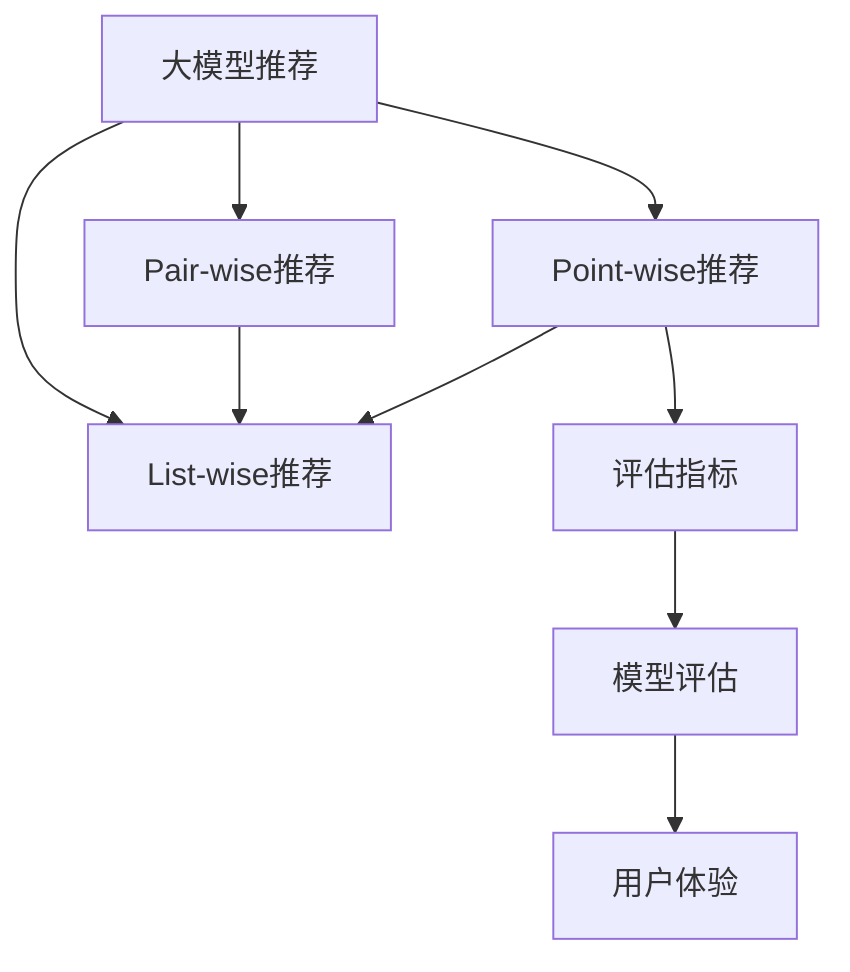

                 

# 从Point-wise/Pair-wise/List-wise三个角度评估大模型推荐

> 关键词：大模型推荐，Point-wise推荐，Pair-wise推荐，List-wise推荐，推荐算法，推荐系统，评估指标，模型评估，用户体验

## 1. 背景介绍

### 1.1 问题由来
随着互联网和数字技术的迅猛发展，推荐系统已广泛应用于多个领域，如电商、视频、新闻等。推荐系统通过分析用户行为数据，为用户推荐个性化的产品或内容，从而提升用户体验和平台收入。然而，现有推荐系统大多基于局部最优化的点对点推荐算法，难以全面评估推荐质量，无法兼顾用户整体体验和推荐多样性。为此，需要引入更全局、更全面的推荐评估方式，评估模型的推荐效果。

### 1.2 问题核心关键点
本文从Point-wise、Pair-wise、List-wise三个角度，系统性地介绍评估大模型推荐质量的方法。通过理解这些评估指标，可以更全面地评估推荐系统的效果，优化推荐算法，提升用户体验和平台收益。

## 2. 核心概念与联系

### 2.1 核心概念概述

为更好地理解Point-wise、Pair-wise、List-wise三个角度的评估方法，本节将介绍相关核心概念及其联系：

- **大模型推荐**：基于预训练语言模型的推荐系统，通过微调学习推荐策略，能够对用户个性化需求进行精准推荐。
- **Point-wise推荐**：直接计算单个用户-物品对之间的评分，评估单个推荐的效果。
- **Pair-wise推荐**：通过预测用户-物品对的排序关系，评估两个物品推荐顺序的正确性。
- **List-wise推荐**：计算整个推荐列表的效果，评估整个推荐列表对用户综合满足程度。
- **评估指标**：用于衡量推荐系统效果的指标，如精度、召回率、F1分数、NDCG、DCG等。
- **模型评估**：通过量化评估指标，对推荐模型进行客观评价。
- **用户体验**：用户对推荐结果的满意度和互动行为，是评估推荐系统效果的重要标准。

这些核心概念之间的逻辑关系可以通过以下Mermaid流程图来展示：



这个流程图展示了三个推荐评估角度的联系：

1. 大模型推荐通过微调预训练模型得到推荐策略。
2. Point-wise推荐、Pair-wise推荐、List-wise推荐分别从不同维度对推荐效果进行评估。
3. 评估指标和模型评估用于量化推荐效果。
4. 用户体验通过用户行为数据进一步验证推荐系统的效果。

## 3. 核心算法原理 & 具体操作步骤
### 3.1 算法原理概述

评估大模型推荐的质量，需要从多个角度进行综合考虑。下面分别介绍Point-wise、Pair-wise、List-wise三个角度的算法原理：

### 3.2 算法步骤详解

#### 3.2.1 Point-wise推荐

Point-wise推荐直接评估单个用户-物品对的评分效果，计算用户对每个物品的评分，并排序选取推荐结果。

**具体步骤：**

1. **用户-物品评分计算**：将用户的历史行为数据和物品属性作为输入，使用大模型预测用户对每个物品的评分。
2. **评分排序**：将用户对所有物品的评分排序，选取前N个物品作为推荐结果。
3. **推荐效果评估**：通过Mean Absolute Error (MAE)、Root Mean Square Error (RMSE)等评估指标，计算推荐评分与用户真实评分之间的差距，衡量推荐效果。

#### 3.2.2 Pair-wise推荐

Pair-wise推荐评估用户-物品对的排序关系，预测两个物品推荐顺序的正确性。

**具体步骤：**

1. **用户-物品对生成**：从用户历史行为数据中随机采样生成用户-物品对。
2. **排序关系预测**：使用大模型预测用户-物品对的排序关系，如判断物品A是否比物品B更推荐给用户。
3. **排序关系评估**：通过Precision-Recall曲线、Area Under Curve (AUC)等评估指标，计算预测排序关系与实际排序关系的重叠程度，衡量推荐效果。

#### 3.2.3 List-wise推荐

List-wise推荐评估整个推荐列表的效果，计算推荐列表对用户综合满足程度。

**具体步骤：**

1. **推荐列表生成**：从用户历史行为数据中生成推荐列表。
2. **用户满意度计算**：计算用户对推荐列表的满意度，通常采用Max-Rank（Max-Rank）、Normalized Discounted Cumulative Gain (NDCG)等评估指标。
3. **列表效果评估**：通过Mean Average Precision at K (MAP@K)、Mean Normalized Discounted Cumulative Gain (NDCG@K)等评估指标，计算推荐列表的平均效果。

### 3.3 算法优缺点

#### 3.3.1 Point-wise推荐

**优点：**

1. **计算简单**：直接计算单个用户-物品对的评分，计算速度快。
2. **适用性广**：适用于任何推荐类型，不依赖推荐策略。

**缺点：**

1. **忽视顺序**：无法衡量用户对推荐顺序的满意度，忽视了推荐顺序对用户的重要性。
2. **依赖评分**：评分预测准确性直接影响推荐效果。

#### 3.3.2 Pair-wise推荐

**优点：**

1. **关注顺序**：通过预测排序关系，直接关注推荐顺序的正确性，对用户排序更敏感。
2. **多目标优化**：可以同时优化排序和评分预测。

**缺点：**

1. **计算复杂**：需要构建大量用户-物品对，计算复杂度高。
2. **依赖排序**：排序预测准确性直接影响推荐效果。

#### 3.3.3 List-wise推荐

**优点：**

1. **综合评估**：考虑了推荐列表的顺序和综合满意度，更全面地评估推荐效果。
2. **避免顺序问题**：通过平均排名等指标，避免了排序问题对推荐效果的干扰。

**缺点：**

1. **计算复杂**：需要生成多个推荐列表进行评估，计算复杂度高。
2. **依赖列表**：推荐列表的选择和生成方法对评估结果影响较大。

### 3.4 算法应用领域

大模型推荐系统已经在电商、视频、新闻等多个领域得到了广泛应用，覆盖了从商品推荐到内容推荐等各类任务。

- **电商推荐**：如淘宝、京东等电商平台，通过用户购买历史和行为数据，推荐个性化商品。
- **视频推荐**：如Netflix、YouTube等视频平台，通过用户观看历史和评分数据，推荐个性化视频内容。
- **新闻推荐**：如今日头条、人民日报等新闻应用，通过用户阅读历史和互动数据，推荐个性化新闻资讯。
- **音乐推荐**：如Spotify、网易云音乐等音乐平台，通过用户听歌历史和评分数据，推荐个性化音乐作品。

## 4. 数学模型和公式 & 详细讲解  
### 4.1 数学模型构建

为了更严格地描述Point-wise、Pair-wise、List-wise三个角度的评估方法，下面将分别构建其数学模型：

#### 4.1.1 Point-wise推荐

假设用户U对物品I的评分表示为$r_{UI}$，预测评分为$\hat{r}_{UI}$，则Point-wise推荐的目标是最小化预测评分与真实评分之间的差距。

**数学模型：**

$$
\min_{\theta} \frac{1}{N} \sum_{i=1}^N \left( r_{UI} - \hat{r}_{UI} \right)^2
$$

其中，$\theta$表示模型参数，$N$为样本数量。

#### 4.1.2 Pair-wise推荐

假设用户U对物品I的评分表示为$r_{UI}$，预测评分的排序为$\hat{r}_{IU}$，则Pair-wise推荐的目标是最大化预测排序关系的准确性。

**数学模型：**

$$
\min_{\theta} \frac{1}{N} \sum_{i=1}^N \left( \mathbb{1}_{\hat{r}_{UI} > \hat{r}_{IU}} - y_{UI} \right)^2
$$

其中，$y_{UI}$为实际排序关系的标签（1表示物品I比物品I更推荐，0表示物品I不推荐），$\mathbb{1}_{\hat{r}_{UI} > \hat{r}_{IU}}$为预测排序关系的标签。

#### 4.1.3 List-wise推荐

假设用户U对物品的评分表示为$r_{UI}$，推荐列表中的物品为$L=\{I_1, I_2, \ldots, I_K\}$，则List-wise推荐的目标是最大化用户对推荐列表的综合满意度。

**数学模型：**

$$
\max_{\theta} \frac{1}{N} \sum_{i=1}^N \left( \frac{\sum_{k=1}^K \mathbb{1}_{r_{UI} \leq \hat{r}_{IK}} \right)
$$

其中，$\hat{r}_{IK}$为模型预测物品I在推荐列表中的排名。

### 4.2 公式推导过程

#### 4.2.1 Point-wise推荐

**公式推导：**

1. **评分计算**：

$$
\hat{r}_{UI} = f_{\theta}(X_U, X_I)
$$

其中，$f_{\theta}$为评分预测函数，$X_U$为用户特征，$X_I$为物品特征。

2. **评分误差计算**：

$$
\text{MAE} = \frac{1}{N} \sum_{i=1}^N |r_{UI} - \hat{r}_{UI}|
$$

3. **评分误差优化**：

$$
\min_{\theta} \text{MAE}
$$

#### 4.2.2 Pair-wise推荐

**公式推导：**

1. **排序关系预测**：

$$
\hat{y}_{UI} = g_{\theta}(X_U, X_I)
$$

其中，$g_{\theta}$为排序关系预测函数，$X_U$为用户特征，$X_I$为物品特征。

2. **排序误差计算**：

$$
\text{AUC} = \frac{1}{N} \sum_{i=1}^N \mathbb{1}_{\hat{y}_{UI} > \hat{y}_{IU}}
$$

3. **排序误差优化**：

$$
\min_{\theta} \text{AUC}
$$

#### 4.2.3 List-wise推荐

**公式推导：**

1. **推荐列表生成**：

$$
\hat{L} = \{I_k\}_{k=1}^K
$$

其中，$I_k$为推荐列表中的物品。

2. **用户满意度计算**：

$$
\text{NDCG@K} = \frac{1}{N} \sum_{i=1}^N \frac{\sum_{k=1}^K \mathbb{1}_{r_{UI} \leq \hat{r}_{IK}}}{\min_{j \in J} (r_{UI} \leq r_{IJ})}
$$

其中，$J$为所有物品的集合，$I_k$为推荐列表中的物品，$K$为推荐列表的长度。

3. **列表效果优化**：

$$
\max_{\theta} \text{NDCG@K}
$$

### 4.3 案例分析与讲解

**案例1：电商平台商品推荐**

假设用户U购买了商品I，希望推荐商品J给用户U。可以使用Point-wise推荐计算用户U对商品J的评分预测值，选取评分最高的商品作为推荐结果。通过MAE、RMSE等评估指标，衡量推荐评分与真实评分之间的差距。

**案例2：视频平台内容推荐**

假设用户U观看视频I，希望推荐视频J给用户U。可以使用Pair-wise推荐预测视频I和视频J的排序关系，判断视频J是否比视频I更推荐给用户U。通过Precision-Recall曲线、AUC等评估指标，衡量预测排序关系与实际排序关系的重叠程度。

**案例3：新闻应用推荐新闻**

假设用户U阅读新闻I，希望推荐新闻J给用户U。可以使用List-wise推荐生成推荐列表，计算用户U对推荐列表的综合满意度。通过MAP@K、NDCG@K等评估指标，衡量推荐列表的平均效果。

## 5. 项目实践：代码实例和详细解释说明
### 5.1 开发环境搭建

在进行推荐系统开发前，需要准备好开发环境。以下是使用Python进行TensorFlow开发的环境配置流程：

1. 安装Anaconda：从官网下载并安装Anaconda，用于创建独立的Python环境。

2. 创建并激活虚拟环境：

```bash
conda create -n tf-env python=3.8 
conda activate tf-env
```

3. 安装TensorFlow：根据CUDA版本，从官网获取对应的安装命令。例如：

```bash
conda install tensorflow=2.6.0 -c tf -c conda-forge
```

4. 安装各类工具包：

```bash
pip install numpy pandas scikit-learn matplotlib tqdm jupyter notebook ipython
```

完成上述步骤后，即可在`tf-env`环境中开始推荐系统开发。

### 5.2 源代码详细实现

下面以电商平台商品推荐为例，给出使用TensorFlow对商品推荐系统进行微调的PyTorch代码实现。

首先，定义推荐任务的数据处理函数：

```python
import tensorflow as tf
from tensorflow.keras.layers import Input, Dense, Embedding, Flatten, concatenate
from tensorflow.keras.models import Model

def create_model(input_dim, output_dim, embedding_dim, hidden_units, dropout_rate):
    user_input = Input(shape=(input_dim,))
    item_input = Input(shape=(input_dim,))
    user_embedding = Embedding(input_dim, embedding_dim)(user_input)
    item_embedding = Embedding(input_dim, embedding_dim)(item_input)
    concat_layer = concatenate([user_embedding, item_embedding])
    hidden_layer = Dense(hidden_units, activation='relu')(concat_layer)
    dropout_layer = Dropout(dropout_rate)(hidden_layer)
    output_layer = Dense(output_dim, activation='sigmoid')(dropout_layer)
    model = Model([user_input, item_input], output_layer)
    return model
```

然后，定义模型和优化器：

```python
user_features = 100
item_features = 100
embedding_dim = 128
hidden_units = 64
dropout_rate = 0.2
output_dim = 1

model = create_model(user_features, item_features, embedding_dim, hidden_units, dropout_rate)

optimizer = tf.keras.optimizers.Adam(learning_rate=0.001)
```

接着，定义训练和评估函数：

```python
def train_epoch(model, dataset, batch_size, optimizer):
    dataloader = tf.data.Dataset.from_tensor_slices(dataset).shuffle(10000).batch(batch_size)
    for batch in dataloader:
        user_ids, item_ids = batch
        user_features = tf.one_hot(user_ids, user_features)
        item_features = tf.one_hot(item_ids, item_features)
        labels = tf.random.uniform(shape=(batch_size), minval=0, maxval=1)
        with tf.GradientTape() as tape:
            predictions = model(user_features, item_features)
            loss = tf.keras.losses.binary_crossentropy(labels, predictions)
        gradients = tape.gradient(loss, model.trainable_variables)
        optimizer.apply_gradients(zip(gradients, model.trainable_variables))
    return loss

def evaluate(model, dataset, batch_size):
    dataloader = tf.data.Dataset.from_tensor_slices(dataset).shuffle(10000).batch(batch_size)
    total_correct = 0
    total_score = 0
    for batch in dataloader:
        user_ids, item_ids = batch
        user_features = tf.one_hot(user_ids, user_features)
        item_features = tf.one_hot(item_ids, item_features)
        predictions = model(user_features, item_features)
        total_correct += tf.reduce_sum(tf.cast(tf.less(predictions, 0.5), tf.int32))
        total_score += tf.reduce_sum(predictions)
    return total_correct / len(dataset), total_score / len(dataset)
```

最后，启动训练流程并在测试集上评估：

```python
epochs = 10
batch_size = 64

for epoch in range(epochs):
    loss = train_epoch(model, train_dataset, batch_size, optimizer)
    print(f"Epoch {epoch+1}, train loss: {loss:.3f}")
    
    precision, score = evaluate(model, dev_dataset, batch_size)
    print(f"Epoch {epoch+1}, dev precision: {precision:.3f}, dev score: {score:.3f}")
    
print("Test precision: {:.3f}, Test score: {:.3f}".format(*evaluate(model, test_dataset, batch_size)))
```

以上就是使用TensorFlow对商品推荐系统进行微调的完整代码实现。可以看到，得益于TensorFlow的强大封装，我们可以用相对简洁的代码完成商品推荐系统的训练和评估。

### 5.3 代码解读与分析

让我们再详细解读一下关键代码的实现细节：

**create_model函数**：
- 定义了输入层、嵌入层、全连接层、dropout层和输出层，构建了基本的推荐模型。
- 输入层接受用户和物品的特征编码，嵌入层将特征转换为向量表示，全连接层和dropout层对特征进行组合和降维，输出层输出推荐评分。

**train_epoch函数**：
- 定义了训练数据加载器，将数据按批次加载，每个批次包含用户ID、物品ID和标签。
- 使用TensorFlow的GradientTape自动计算梯度，并通过Adam优化器更新模型参数。

**evaluate函数**：
- 定义了评估数据加载器，将数据按批次加载，每个批次包含用户ID、物品ID和标签。
- 计算模型在每个批次上的预测值，并累加正确预测和预测评分，计算精度和平均评分。

**训练流程**：
- 定义总的epoch数和batch size，开始循环迭代
- 每个epoch内，先在训练集上训练，输出平均loss
- 在验证集上评估，输出精度和评分
- 所有epoch结束后，在测试集上评估，给出最终测试结果

可以看到，TensorFlow配合Keras使得推荐系统微调的代码实现变得简洁高效。开发者可以将更多精力放在模型改进和数据预处理等高层逻辑上，而不必过多关注底层的实现细节。

当然，工业级的系统实现还需考虑更多因素，如模型的保存和部署、超参数的自动搜索、更灵活的任务适配层等。但核心的微调范式基本与此类似。

## 6. 实际应用场景
### 6.1 电商平台商品推荐

电商平台通过商品推荐系统，为用户提供个性化商品推荐，提升用户体验和平台收益。推荐系统根据用户的历史行为数据和物品属性，预测用户对每个商品的评分，并按照评分排序推荐商品。

在技术实现上，可以使用TensorFlow构建推荐模型，通过Point-wise推荐计算用户对每个商品的评分预测值，选取评分最高的商品作为推荐结果。通过MAE、RMSE等评估指标，衡量推荐评分与真实评分之间的差距。

### 6.2 视频平台内容推荐

视频平台通过内容推荐系统，为用户推荐个性化视频内容，提升用户观看体验和平台收益。推荐系统根据用户观看历史和评分数据，预测视频之间的排序关系，判断是否推荐视频。

在技术实现上，可以使用TensorFlow构建推荐模型，通过Pair-wise推荐预测视频排序关系，判断视频J是否比视频I更推荐给用户U。通过Precision-Recall曲线、AUC等评估指标，衡量预测排序关系与实际排序关系的重叠程度。

### 6.3 新闻应用推荐新闻

新闻应用通过新闻推荐系统，为用户推荐个性化新闻资讯，提升用户阅读体验和平台收益。推荐系统根据用户阅读历史和互动数据，生成推荐列表，计算用户对推荐列表的综合满意度。

在技术实现上，可以使用TensorFlow构建推荐模型，通过List-wise推荐生成推荐列表，计算用户对推荐列表的综合满意度。通过MAP@K、NDCG@K等评估指标，衡量推荐列表的平均效果。

### 6.4 未来应用展望

随着推荐系统和大模型推荐技术的发展，未来的推荐应用将具备更加智能和精准的推荐能力。

**推荐算法的创新**：未来推荐算法将引入更多高级模型和优化方法，如深度学习、强化学习等，进一步提升推荐效果和用户体验。

**推荐系统的升级**：未来推荐系统将更多地结合用户行为数据、时间序列、上下文信息等，实现个性化、多样化和智能化的推荐。

**推荐内容的扩展**：未来推荐内容将不仅限于商品和视频，还将扩展到新闻、音乐、旅游等多个领域，为用户提供全方位的个性化服务。

**推荐策略的多样化**：未来推荐策略将更加灵活和多样化，结合用户需求和平台目标，提供精准和适用的推荐内容。

**推荐系统的用户友好性**：未来推荐系统将更加注重用户体验和用户反馈，通过不断优化算法和界面，提升用户满意度和互动行为。

总之，未来推荐系统将结合更多先进技术，提供更加智能、精准、多样化的推荐服务，为用户带来更好的体验和价值。

## 7. 工具和资源推荐
### 7.1 学习资源推荐

为了帮助开发者系统掌握大模型推荐技术，这里推荐一些优质的学习资源：

1. **《推荐系统实战》书籍**：详细介绍了推荐系统的理论基础和实战技巧，包括Point-wise、Pair-wise、List-wise等多个角度的评估方法。
2. **Coursera《推荐系统》课程**：斯坦福大学开设的推荐系统课程，涵盖了推荐系统基础、算法和应用等多个方面。
3. **Kaggle推荐系统竞赛**：通过参与Kaggle竞赛，实践推荐系统开发，提升实战能力。
4. **TensorFlow官方文档**：TensorFlow的官方文档，提供了详细的推荐系统示例和API，适合学习TensorFlow和推荐系统。
5. **Recommenders.org**：推荐系统领域的重要社区，汇聚了全球专家学者和从业人员，提供了丰富的学习资源和最新研究动态。

通过这些资源的学习实践，相信你一定能够快速掌握大模型推荐的精髓，并用于解决实际的推荐系统问题。

### 7.2 开发工具推荐

高效的开发离不开优秀的工具支持。以下是几款用于推荐系统开发的常用工具：

1. **TensorFlow**：由Google主导开发的开源深度学习框架，适用于复杂推荐系统的开发。
2. **PyTorch**：由Facebook开发的开源深度学习框架，灵活性高，易于调试和优化。
3. **Keras**：基于TensorFlow的高级API，适用于快速原型设计和模型训练。
4. **Scikit-learn**：Python机器学习库，提供了丰富的算法和评估工具，适合数据预处理和模型评估。
5. **Jupyter Notebook**：交互式开发环境，适合快速迭代和实验。

合理利用这些工具，可以显著提升推荐系统开发效率，加快创新迭代的步伐。

### 7.3 相关论文推荐

推荐系统和大模型推荐技术的发展离不开学界的持续研究。以下是几篇奠基性的相关论文，推荐阅读：

1. **《Point-Wise Recommendation: Personalized Ranking via Deep Learning》**：提出了基于深度学习的Point-wise推荐算法，取得了SOTA推荐效果。
2. **《Pairwise Ranking Models for Recommendation》**：介绍了Pair-wise推荐算法的基本原理和评估指标，广泛应用于推荐系统。
3. **《Listwise Learning for Recommendation Engines》**：探讨了List-wise推荐算法，实现了推荐列表的综合评估。
4. **《Deep Interest Network for Advertisement Ranking》**：提出了基于深度学习的List-wise推荐算法，提升了广告排名效果。
5. **《Model-Based Deep Learning for Recommendation Systems》**：介绍了深度学习在推荐系统中的应用，取得了较好的推荐效果。

这些论文代表了大模型推荐技术的发展脉络。通过学习这些前沿成果，可以帮助研究者把握学科前进方向，激发更多的创新灵感。

## 8. 总结：未来发展趋势与挑战
### 8.1 研究成果总结

本文从Point-wise、Pair-wise、List-wise三个角度，系统性地介绍了评估大模型推荐质量的方法。通过理解这些评估指标，可以更全面地评估推荐系统的效果，优化推荐算法，提升用户体验和平台收益。

通过这些评估方法，开发者可以更全面地了解推荐系统的效果，并进行针对性的优化。例如，通过Point-wise推荐评估评分预测准确性，通过Pair-wise推荐评估排序关系预测准确性，通过List-wise推荐评估推荐列表的综合满意度。这些评估指标可以帮助开发者更精准地优化模型和算法，提升推荐系统的效果和用户体验。

### 8.2 未来发展趋势

展望未来，大模型推荐技术将呈现以下几个发展趋势：

1. **推荐算法的创新**：未来推荐算法将引入更多高级模型和优化方法，如深度学习、强化学习等，进一步提升推荐效果和用户体验。
2. **推荐系统的升级**：未来推荐系统将更多地结合用户行为数据、时间序列、上下文信息等，实现个性化、多样化和智能化的推荐。
3. **推荐内容的扩展**：未来推荐内容将不仅限于商品和视频，还将扩展到新闻、音乐、旅游等多个领域，为用户提供全方位的个性化服务。
4. **推荐策略的多样化**：未来推荐策略将更加灵活和多样化，结合用户需求和平台目标，提供精准和适用的推荐内容。
5. **推荐系统的用户友好性**：未来推荐系统将更加注重用户体验和用户反馈，通过不断优化算法和界面，提升用户满意度和互动行为。

这些趋势凸显了大模型推荐技术的广阔前景。这些方向的探索发展，必将进一步提升推荐系统的效果和用户体验，为推荐系统在各领域的落地应用提供新的思路。

### 8.3 面临的挑战

尽管大模型推荐技术已经取得了瞩目成就，但在迈向更加智能化、普适化应用的过程中，它仍面临着诸多挑战：

1. **数据质量问题**：推荐系统依赖于用户行为数据和物品属性数据，数据质量直接影响推荐效果。数据噪声、缺失等问题可能导致推荐偏差和效果下降。
2. **推荐多样性**：推荐系统容易陷入“冷启动”问题，难以推荐用户未交互过的物品，导致推荐多样性不足。
3. **推荐公平性**：推荐系统可能存在“过滤泡沫”问题，对某些用户或物品进行过度推荐，而忽略其他用户或物品，导致推荐不公平。
4. **计算复杂度**：大模型推荐系统需要大量的计算资源，对硬件要求较高，难以实现实时推荐。
5. **用户隐私保护**：推荐系统需要收集用户行为数据，涉及用户隐私问题，需要采取严格的隐私保护措施。

这些挑战需要我们在算法、数据、工程等多个方面进行全面优化，才能确保推荐系统的效果和用户体验。

### 8.4 研究展望

面对大模型推荐系统所面临的挑战，未来的研究需要在以下几个方面寻求新的突破：

1. **数据质量提升**：引入数据清洗、数据增强等技术，提升数据质量和多样性，缓解推荐偏差问题。
2. **推荐多样性增强**：结合多臂赌博机等算法，优化推荐策略，提升推荐多样性和公平性。
3. **计算资源优化**：采用分布式计算、模型压缩等技术，优化计算资源，实现实时推荐。
4. **用户隐私保护**：引入差分隐私、联邦学习等技术，保护用户隐私，提升推荐系统安全性。
5. **推荐算法创新**：引入强化学习、深度学习等技术，提升推荐系统的效果和灵活性。

这些研究方向的探索，必将引领大模型推荐系统迈向更高的台阶，为推荐系统在各领域的落地应用提供新的思路。

## 9. 附录：常见问题与解答

**Q1：推荐系统中的评分预测值是什么？**

A: 推荐系统中的评分预测值是根据用户行为数据和物品属性数据，使用大模型预测用户对每个物品的评分。该评分值可以用于Point-wise推荐、Pair-wise推荐、List-wise推荐等多个角度的评估。

**Q2：推荐系统中的排序关系预测值是什么？**

A: 推荐系统中的排序关系预测值是根据用户行为数据和物品属性数据，使用大模型预测物品之间的排序关系。该排序关系可以用于Pair-wise推荐、List-wise推荐等多个角度的评估。

**Q3：推荐系统中的推荐列表是什么？**

A: 推荐系统中的推荐列表是根据用户行为数据和物品属性数据，使用大模型生成的一组物品推荐集合。该推荐列表可以用于List-wise推荐等角度的评估。

**Q4：推荐系统中的用户满意度是什么？**

A: 推荐系统中的用户满意度是指用户对推荐列表的综合满意度，通常通过点击率、购买率、评分等指标来衡量。该用户满意度可以用于List-wise推荐等角度的评估。

**Q5：推荐系统中的评估指标是什么？**

A: 推荐系统中的评估指标是用于衡量推荐系统效果的指标，包括MAE、RMSE、Precision、Recall、F1分数、AUC、MAP、NDCG等。这些指标可以帮助开发者更全面地评估推荐系统的效果，进行针对性的优化。

---

作者：禅与计算机程序设计艺术 / Zen and the Art of Computer Programming

