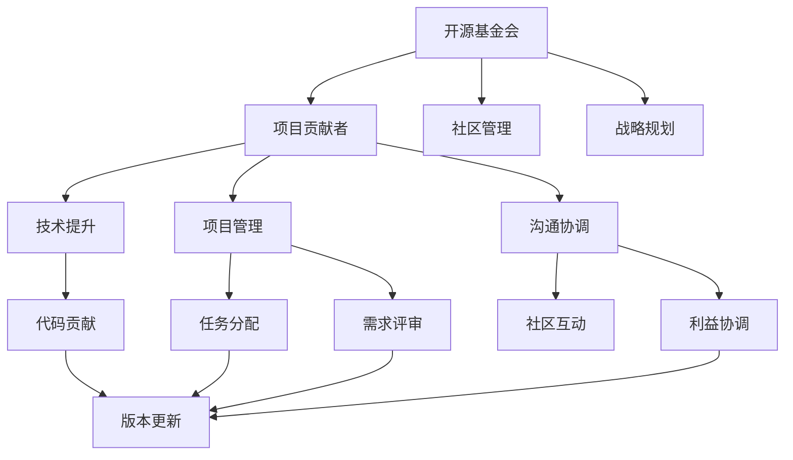

                 

## 1. 背景介绍

### 1.1 问题由来

在开源技术领域，代码贡献者通常专注于解决技术难题，推进项目进展。然而，随着开源社区的规模不断扩大，技术复杂度的不断提升，单一的代码贡献者模式已难以满足社区发展的需求。开源基金会的出现，成为了组织和协调开源项目的重要力量。基金会不仅负责项目的持续维护，还统筹开源生态的合作和交流，推动技术的社会化应用。

对于技术贡献者而言，如何从代码贡献者转型为开源基金会领导者，不仅是职业发展的关键一步，也是实现更大社会影响力的重要途径。本文旨在探讨从代码贡献者到开源基金会领导者的转变路径，剖析相关核心概念，提供实用的操作指南和实际案例分析。

### 1.2 问题核心关键点

从代码贡献者到开源基金会领导者的转变涉及多个关键领域：技术能力、项目管理、社区互动、沟通协调、战略规划等。如何在这些领域不断提升自己的能力和影响力，是成功转型的核心挑战。

- **技术能力**：持续学习和掌握前沿技术，保持对项目的深度理解和贡献。
- **项目管理**：从具体的技术问题，转向全局的社区管理和项目规划。
- **社区互动**：建立和维护良好的社区关系，增强与开发者、利益相关者的互动。
- **沟通协调**：学会有效沟通和协调，推动项目高效运作。
- **战略规划**：制定长远发展战略，带领项目和社区走向新的高度。

本文将从这些关键点出发，系统性地讨论如何实现这一转变。

## 2. 核心概念与联系

### 2.1 核心概念概述

开源基金会在开源项目的治理中扮演着重要角色。其核心概念包括：

- **开源基金会**：由社区成员、项目发起人、资金支持者等组成的组织，负责维护项目、制定决策、促进交流和合作。
- **项目贡献者**：活跃于开源项目的开发者，专注于代码实现和改进，推动技术发展。
- **社区管理**：包括技术讨论、版本控制、安全审查、文档维护、资源管理等，确保项目和社区的有序运行。
- **战略规划**：制定长远发展目标和路径，明确项目的发展方向和重点。

这些核心概念之间的联系可以通过以下Mermaid流程图来展示：

这个流程图展示了开源基金会与项目贡献者在社区管理、技术提升、战略规划等各方面的关系和互动。

## 3. 核心算法原理 & 具体操作步骤

### 3.1 算法原理概述

从代码贡献者到开源基金会领导者的转变，本质上是从技术层面转向战略和社区管理层面的转变。这一过程涉及多个阶段和关键步骤：

1. **技术积累**：持续学习和贡献，成为社区中的技术专家。
2. **项目管理**：从个体贡献转向项目协调，成为项目管理者。
3. **社区互动**：建立社区关系，成为社区的活跃成员。
4. **沟通协调**：提高沟通能力，成为团队和项目的桥梁。
5. **战略规划**：制定和执行项目战略，成为项目的领导者。

### 3.2 算法步骤详解

以下是详细的步骤详解：

**Step 1: 技术积累**

- **深入学习**：持续学习新技术、新框架，保持技术敏感度。
- **参与项目**：积极参与社区项目，贡献代码、修复问题。
- **开源贡献**：在GitHub等平台上发布自己的开源项目，建立技术影响力。

**Step 2: 项目管理**

- **理解项目**：深入理解项目的目标、架构、技术难点。
- **任务分配**：组织和分配任务，推动项目进展。
- **需求评审**：参与需求讨论，提出建设性意见。

**Step 3: 社区互动**

- **参与讨论**：积极参与技术讨论、问题解答，提升社区声誉。
- **建立关系**：与社区成员、贡献者建立良好的关系。
- **引导合作**：推动跨项目、跨领域的合作，扩大社区影响力。

**Step 4: 沟通协调**

- **有效沟通**：学会清晰、准确地表达技术观点，协调团队协作。
- **解决问题**：面对冲突和挑战，提出解决方案，保持项目稳定。
- **定期反馈**：定期向社区成员反馈项目进展，增强透明度和信任度。

**Step 5: 战略规划**

- **分析现状**：分析项目的现状、优势和挑战。
- **制定战略**：制定长远发展计划，明确项目目标。
- **执行规划**：推动战略实施，不断优化和调整。

### 3.3 算法优缺点

从代码贡献者到开源基金会领导者的转变，有以下优点：

- **提升影响力**：通过管理和领导开源项目，能够影响更广泛的技术生态和社区成员。
- **职业发展**：在项目管理、社区互动、战略规划等方面的提升，为职业发展提供更多机会。
- **贡献社区**：为开源社区贡献更多价值，推动技术和社会的发展。

同时，这一过程也面临以下挑战：

- **时间投入**：项目管理、战略规划等需要大量时间投入，可能与日常技术工作产生冲突。
- **复杂决策**：需要具备较强的战略思维和决策能力，面对复杂问题时难以快速找到最佳解决方案。
- **多角色转换**：从技术专家到管理者的角色转换，需要不断学习和适应。

### 3.4 算法应用领域

开源基金会的领导者在各个开源项目和社区中均有广泛应用，例如：

- **Apache Foundation**：负责多个开源项目的协调和管理，推动技术发展和社区合作。
- **Linux Foundation**：推动Linux操作系统和相关技术的标准化和推广。
- **Mozilla Foundation**：负责Firefox浏览器的维护和推广，支持Web开发和隐私保护。
- **OpenStack Foundation**：推动云计算技术的标准化和应用，促进云基础设施的合作和发展。

这些案例展示了开源基金会领导者在技术、项目、社区管理等方面的重要作用。

## 4. 数学模型和公式 & 详细讲解 & 举例说明

### 4.1 数学模型构建

开源基金会的运作和项目管理可以视为一个复杂的系统，其模型构建可以包括以下部分：

- **组织模型**：描述基金会和项目之间的层级关系，包括基金会治理结构、项目管理团队等。
- **项目模型**：定义项目的生命周期、阶段和里程碑，以及各阶段的任务和目标。
- **社区模型**：描述社区成员的角色和关系，包括贡献者、开发者、用户等。

### 4.2 公式推导过程

以一个简单的项目生命周期为例，其数学模型构建可以如下：

1. **项目启动阶段**：
   - 定义项目的背景、目标和里程碑。
   - 确定项目的初始任务和资源需求。

2. **项目执行阶段**：
   - 根据项目计划，分配任务和资源。
   - 跟踪项目进展，定期评估任务完成情况。

3. **项目收尾阶段**：
   - 评估项目成果，总结经验教训。
   - 制定项目的维护和升级计划。

这些阶段的数学模型可以表示为：

$$
\begin{aligned}
&\text{启动阶段} = (背景, 目标, 里程碑) \\
&\text{执行阶段} = \{ (任务, 资源, 进展, 评估) \} \\
&\text{收尾阶段} = (成果, 总结, 维护)
\end{aligned}
$$

### 4.3 案例分析与讲解

以Apache Kafka项目为例，Apache Kafka是一个分布式流处理平台，由Apache Foundation负责管理和推广。其项目管理过程如下：

1. **启动阶段**：
   - 背景：解决分布式数据流处理的需求。
   - 目标：提供一个高性能、高可靠性的流处理平台。
   - 里程碑：完成初步架构设计，发布第一个版本。

2. **执行阶段**：
   - 任务分配：项目组划分任务，包括开发、测试、文档等。
   - 资源需求：确定所需的硬件、软件资源，以及人才需求。
   - 进展跟踪：通过GitHub、邮件列表等方式，定期更新项目进展。
   - 评估反馈：收集社区反馈，持续改进项目。

3. **收尾阶段**：
   - 成果发布：发布新版本，评估性能和稳定性。
   - 总结经验：总结项目开发过程中的经验和教训。
   - 维护升级：制定维护计划，发布更新和补丁。

通过以上案例，可以看出开源基金会领导者在项目管理和推广中起着关键作用。

## 5. 项目实践：代码实例和详细解释说明

### 5.1 开发环境搭建

开源基金会的管理和推广主要依赖于在线平台和工具，以下是一些常用的开发环境：

- **GitHub**：源代码管理平台，支持版本控制和协作。
- **Jira**：项目管理工具，支持任务分配和进度跟踪。
- **Slack**：即时通信工具，支持社区成员交流和沟通。
- **Confluence**：文档管理工具，支持知识共享和项目文档。

### 5.2 源代码详细实现

以Kafka项目为例，其源代码详细实现可以包括以下步骤：

1. **版本控制**：
   - 在GitHub上创建Kafka项目仓库。
   - 设置分支管理，如master、develop、feature等。

2. **任务分配**：
   - 在Jira上创建任务，定义任务描述、优先级、负责人和截止日期。
   - 使用Jira的看板功能，跟踪任务进展。

3. **代码实现**：
   - 贡献者通过GitHub提交代码，进行代码审查。
   - 代码审查通过后，合并到master分支。

4. **测试和部署**：
   - 使用单元测试、集成测试等方法，确保代码质量。
   - 在生产环境中部署Kafka，监控系统性能。

### 5.3 代码解读与分析

Kafka项目代码实现的核心在于其分布式流处理架构，主要包括以下组件：

- **生产者**：发送数据到Kafka集群。
- **中间件**：存储和管理数据流。
- **消费者**：从Kafka集群中读取数据。

通过Kafka项目的代码实现，可以理解分布式系统的设计和实现过程，为自身项目管理提供参考。

### 5.4 运行结果展示

Kafka项目的运行结果展示了其高性能和可靠性。例如，通过GitHub的提交记录和Jira的任务进展，可以清晰地看到项目进展和贡献者活跃度。使用Confluence发布的文档和Slack的交流记录，可以全面了解项目的知识管理和社区互动。

## 6. 实际应用场景

### 6.1 智慧城市管理

开源基金会在智慧城市管理中的应用，体现在城市数据采集、处理和应用上。通过开源基金会领导者的协调和管理，可以实现跨部门、跨领域的数据共享和集成，提升城市管理的智能化水平。

例如，Linux Foundation负责的Open City项目，致力于推动城市数据标准化和开放共享，提升城市治理效率和透明度。Apache Foundation的Prelude项目，则提供了城市事件监控和分析工具，支持城市应急响应和公共安全管理。

### 6.2 教育科技应用

开源基金会在教育科技中的应用，体现在推动教育资源的数字化和共享上。通过开源基金会领导者的管理和推广，可以实现教育资源的跨区域、跨学校的共享，提升教育质量和公平性。

例如，Mozilla Foundation的Open edX项目，致力于提供在线课程和教育资源，推动全球教育普及。Apache Foundation的OARDC项目，则提供了科研数据共享和存储的解决方案，支持科研数据的开放和合作。

### 6.3 开源软件推广

开源基金会在开源软件推广中的应用，体现在提升开源软件的知名度和影响力上。通过开源基金会领导者的管理和推广，可以实现开源软件的广泛应用和标准化。

例如，Apache Foundation的Apache HTTP Server、Hadoop等项目，通过基金会管理和推广，已经成为全球最流行的开源软件之一。Linux Foundation的Linux Kernel项目，则通过基金会管理和推广，成为全球操作系统的基础组件。

### 6.4 未来应用展望

随着开源基金会的不断发展和壮大，其在技术、项目、社区管理等方面的作用将更加显著。未来，开源基金会将在更多领域发挥重要作用：

1. **人工智能和机器学习**：推动人工智能和机器学习技术的标准化和应用，提升技术水平和效率。
2. **物联网和边缘计算**：推动物联网和边缘计算技术的发展，支持设备和数据的互联互通。
3. **可持续发展**：推动可持续发展技术的应用，支持绿色环保和可持续性发展。
4. **跨领域合作**：促进跨领域技术的合作和创新，推动技术生态的协同发展。

## 7. 工具和资源推荐

### 7.1 学习资源推荐

为了帮助开发者系统掌握开源基金会领导者的相关知识和技能，这里推荐一些优质的学习资源：

1. **《开源基金会管理》课程**：在线教育平台上的开源基金会管理课程，涵盖基金会的治理、项目管理、社区互动等内容。
2. **Apache Foundation官方文档**：Apache Foundation提供的管理手册和最佳实践，帮助基金会成员提升管理能力。
3. **Linux Foundation官网**：Linux Foundation提供的开源项目管理、社区互动等资源，帮助开源基金会的领导者提升管理水平。
4. **GitHub开发者文档**：GitHub提供的版本控制、协作等资源，帮助开发者掌握开源项目的管理技能。
5. **Slack用户手册**：Slack提供的即时通信工具的使用手册，帮助开发者建立良好的社区互动。

通过这些资源的学习实践，相信你一定能够快速掌握开源基金会领导者的核心技能，并应用于实际的开源项目中。

### 7.2 开发工具推荐

高效的开发离不开优秀的工具支持。以下是几款用于开源基金会管理开发的常用工具：

1. **GitHub**：版本控制平台，支持代码协作、版本管理等。
2. **Jira**：项目管理工具，支持任务分配、进度跟踪等。
3. **Slack**：即时通信工具，支持社区互动、交流等。
4. **Confluence**：文档管理工具，支持知识共享、项目管理等。
5. **Conda**：环境管理工具，支持多种编程语言的依赖管理和版本控制。

合理利用这些工具，可以显著提升开源基金会管理的效率，加速项目的进展和社区的发展。

### 7.3 相关论文推荐

开源基金会的管理和推广涉及多个领域的技术和知识，以下是几篇奠基性的相关论文，推荐阅读：

1. **《开源基金会管理和运营》论文**：详细介绍开源基金会治理结构和管理模式。
2. **《开源社区的协作与激励机制》论文**：分析开源社区的协作和激励机制，提出改进建议。
3. **《开源项目的可持续发展和维护》论文**：讨论开源项目的可持续发展和维护策略。
4. **《开源项目的管理和推广》论文**：分析开源项目的管理和推广方法，提出创新思路。

这些论文代表了大语言模型微调技术的发展脉络。通过学习这些前沿成果，可以帮助研究者把握学科前进方向，激发更多的创新灵感。

## 8. 总结：未来发展趋势与挑战

### 8.1 总结

本文对从代码贡献者到开源基金会领导者的转变过程进行了全面系统的介绍。首先阐述了开源基金会在开源项目中的重要作用，明确了基金会的核心概念和运作模式。其次，从技术积累、项目管理、社区互动、沟通协调、战略规划等五个关键点出发，详细讲解了转变的步骤和策略。最后，结合实际应用场景和未来发展趋势，探讨了开源基金会在多个领域的广阔应用前景。

通过本文的系统梳理，可以看到，从代码贡献者到开源基金会领导者的转变，不仅是职业发展的关键一步，更是实现更大社会影响力的重要途径。未来，随着开源技术的不断发展和壮大，开源基金会的领导者将发挥越来越重要的作用，推动技术的社会化应用和生态建设。

### 8.2 未来发展趋势

展望未来，开源基金会的领导者在开源技术的生态建设和管理推广中将呈现以下几个发展趋势：

1. **跨领域合作**：开源基金会将促进跨领域的合作和创新，推动技术的协同发展。
2. **社区治理**：开源基金会将加强社区治理，提升社区的参与度和活跃度。
3. **技术标准化**：开源基金会将推动技术的标准化和规范化，提升技术水平和效率。
4. **可持续发展**：开源基金会将支持可持续发展技术的应用，推动绿色环保和可持续性发展。
5. **开源文化和理念**：开源基金会将推广开源文化和理念，提升技术的社会价值。

这些趋势凸显了开源基金会领导者的重要地位和作用，预示着开源技术将在未来社会中发挥更大的影响力。

### 8.3 面临的挑战

尽管开源基金会的领导者在开源技术的推广和管理中发挥着重要作用，但在实现这一转变的过程中，仍面临诸多挑战：

1. **时间投入**：从技术贡献者到管理者的角色转换，需要大量时间投入，可能导致日常工作受到影响。
2. **技能提升**：项目管理、社区互动、战略规划等技能需要不断学习和提升，可能存在学习曲线陡峭的问题。
3. **利益协调**：需要平衡各方的利益和需求，面对冲突和挑战时难以快速找到最佳解决方案。
4. **资源调配**：需要统筹和协调资源，面对复杂环境时难以快速响应。

### 8.4 研究展望

面对开源基金会领导者在开源技术推广和管理中面临的挑战，未来的研究需要在以下几个方面寻求新的突破：

1. **角色转换的路径和策略**：研究从技术贡献者到开源基金会的领导者转变路径，提供可行的策略和方法。
2. **项目管理工具和实践**：开发和推广更加高效的项目管理工具和实践，提升项目管理效率。
3. **社区互动和激励机制**：研究社区互动和激励机制，提升社区成员的参与度和活跃度。
4. **技术标准化和推广**：推动技术的标准化和推广，提升技术的普适性和应用价值。
5. **可持续发展和社会责任**：推动可持续发展技术的应用，提升技术的社会价值和责任。

这些研究方向的探索，必将引领开源基金会领导者在开源技术的推广和管理中实现新的突破，推动开源技术生态的协同发展和创新应用。总之，开源基金会领导者的角色和作用，将在未来开源技术的推广和管理中发挥越来越重要的作用，为技术生态和社会发展注入新的动力。

## 9. 附录：常见问题与解答

**Q1：开源基金会的领导者在项目管理中应如何平衡资源和任务？**

A: 开源基金会的领导者在项目管理中，需要平衡资源和任务，可以考虑以下策略：

1. **优先级划分**：根据项目的重要性和紧急程度，优先处理高优先级任务。
2. **资源调配**：根据项目进展，动态调整资源配置，优化资源利用效率。
3. **任务分配**：合理分配任务，明确责任人，确保任务按时完成。
4. **进度跟踪**：定期跟踪项目进展，及时发现和解决潜在问题。
5. **反馈机制**：建立有效的反馈机制，及时收集和处理项目反馈。

通过以上策略，可以实现资源的有效利用和任务的按时完成，提升项目管理效率。

**Q2：开源基金会的领导者如何提高社区互动和参与度？**

A: 开源基金会的领导者提高社区互动和参与度，可以考虑以下策略：

1. **建立社区平台**：创建社区平台，如Slack、Discord等，方便社区成员交流和互动。
2. **定期活动**：定期组织线上线下活动，如技术讨论会、分享会等，增强社区凝聚力。
3. **激励机制**：建立激励机制，如开源贡献奖励、技术贡献表彰等，提升社区成员的参与度。
4. **反馈渠道**：建立反馈渠道，及时收集和处理社区成员的意见和建议。
5. **透明度**：提高项目透明度，定期发布项目进展和成果，增强社区成员的信任感。

通过以上策略，可以实现社区成员的高参与度，提升社区的活跃度和影响力。

**Q3：开源基金会的领导者如何处理项目管理中的冲突和挑战？**

A: 开源基金会的领导者处理项目管理中的冲突和挑战，可以考虑以下策略：

1. **沟通协商**：建立有效的沟通机制，及时发现和解决冲突。
2. **寻求共识**：通过协商和讨论，寻找各方共识，解决分歧。
3. **决策透明**：决策过程透明，确保决策的公正和公平。
4. **利益协调**：平衡各方利益，确保项目目标的实现。
5. **应急预案**：制定应急预案，及时应对突发情况，保持项目稳定。

通过以上策略，可以实现项目的稳定运行和高效管理，提升项目管理能力。

**Q4：开源基金会的领导者如何在技术贡献者和管理者之间寻找平衡？**

A: 开源基金会的领导者需要在技术贡献者和管理者之间寻找平衡，可以考虑以下策略：

1. **时间管理**：合理分配时间，确保既能参与技术贡献，又能管理项目和社区。
2. **技能提升**：持续学习和提升管理技能，提升项目管理能力。
3. **任务分配**：合理分配任务，确保技术贡献和管理任务的平衡。
4. **团队协作**：建立高效的团队协作机制，提升团队工作效率。
5. **角色明确**：明确角色和职责，确保技术贡献和管理工作的顺利进行。

通过以上策略，可以实现技术贡献和管理角色的平衡，提升开源基金会的领导能力。

---

作者：禅与计算机程序设计艺术 / Zen and the Art of Computer Programming

