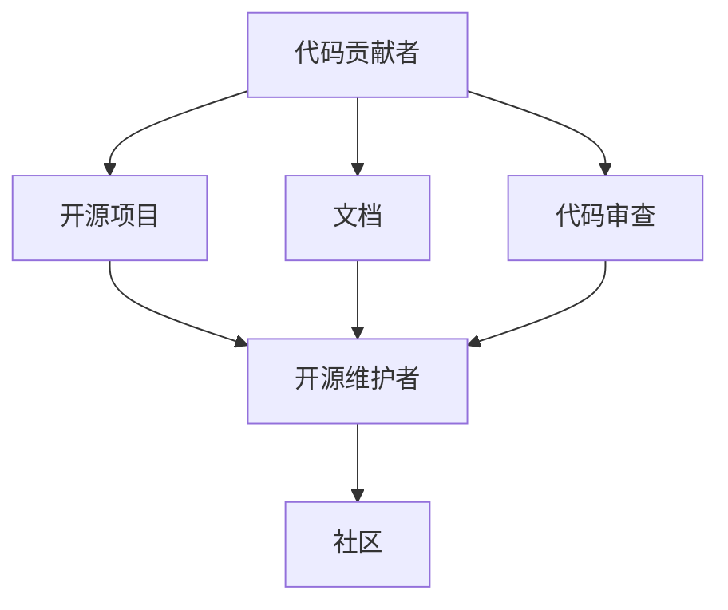

                 

# 从代码贡献者到开源项目维护者

从一名代码贡献者逐步成长为开源项目维护者，不仅需要扎实的基础技术能力，还需要具备良好的沟通协调能力、项目管理经验以及持续的学习能力。本文将从背景介绍、核心概念、算法原理、项目实践、应用场景、工具和资源推荐等多个维度，全面解析开源项目维护者的成长路径，并提供系统性的指导。

## 1. 背景介绍

### 1.1 问题由来

随着开源软件的广泛应用，越来越多开发者参与到开源社区，贡献代码、修复bug、添加功能。但随着开源项目的规模和复杂性不断增加，单一的代码贡献者往往难以维持项目的长期稳定和繁荣。因此，项目维护者成为开源社区中不可或缺的角色，负责项目的整体规划、技术决策、社区管理、安全审核等工作，确保项目高质量地持续迭代。

### 1.2 问题核心关键点

成为开源项目维护者，不仅需要具备强大的技术实力，还要拥有丰富的项目管理经验、良好的社区沟通能力以及持续的学习热情。关键点包括：

- 技术深度：在特定领域具备深入的技术理解，能够识别和解决复杂技术问题。
- 项目管理：能够协调社区资源，制定合理的项目计划，推进任务进展。
- 社区管理：通过文档、会议、邮件等方式，有效沟通协调社区成员。
- 持续学习：跟随技术发展，不断更新知识体系，掌握新技术和新工具。

## 2. 核心概念与联系

### 2.1 核心概念概述

为了更好地理解开源项目维护者的角色，这里列出几个关键概念及其相互联系：

- **代码贡献者(Contributor)**：向开源项目提交代码、文档或修复bug的开发者。
- **开源项目(Open Source Project)**：公开源码、遵守开源协议、鼓励社区协作的软件项目。
- **开源维护者(Maintainer)**：负责开源项目日常管理、技术决策、社区沟通的开发者。
- **社区(Community)**：由开发者、用户、顾问等组成的开源项目支持网络。
- **项目管理(Project Management)**：规划、执行、监督和控制项目工作的过程。
- **文档(Documentation)**：描述项目设计、架构、使用和维护的文档。
- **代码审查(Code Review)**：代码贡献者在合并前，由其他开发者对其进行审阅和反馈。

这些概念之间的逻辑关系可以通过以下Mermaid流程图来展示：



### 2.2 核心概念原理和架构

从上述概念可以看出，开源项目维护者的角色是连接代码贡献者和社区的桥梁，不仅需要具备技术深度，还需要协调各方资源，推进项目进展。其核心原理和架构可以总结如下：

1. **技术深度**：在特定领域具备深入的技术理解，能够解决复杂技术问题。
2. **项目管理**：制定合理的项目计划，推进任务进展，确保项目按时交付。
3. **社区沟通**：通过文档、邮件、会议等方式，有效沟通协调社区成员。
4. **持续学习**：不断更新知识体系，掌握新技术和新工具。

## 3. 核心算法原理 & 具体操作步骤

### 3.1 算法原理概述

开源项目维护者的成长过程中，涉及的核心算法和原理主要包括项目管理、代码审查和社区沟通等。以下是这些关键算法的原理概述：

- **项目管理**：使用敏捷开发方法论，如Scrum、Kanban等，制定项目计划，监控任务进展，确保项目按时交付。
- **代码审查**：使用代码审查工具如GitHub Review，评审代码质量，反馈修改意见，提升代码规范性和可维护性。
- **社区沟通**：使用邮件、即时通讯工具如Slack、GitHub Issues等，进行有效沟通，协调社区资源，提升社区凝聚力。

### 3.2 算法步骤详解

开源项目维护者的成长过程可以分为以下几个关键步骤：

**Step 1: 选择合适的开源项目**
- 确定自己的兴趣领域，选择适合自己的开源项目。
- 研究项目维护者的技术栈、社区活跃度、代码质量等因素。

**Step 2: 贡献代码和文档**
- 阅读项目代码和文档，了解项目结构和规范。
- 提交代码和文档，遵循项目贡献指南。
- 积极参与项目讨论，回答问题和提供反馈。

**Step 3: 参与代码审查**
- 学习代码审查技能，如代码风格、性能优化、安全性检查等。
- 主动参与代码审查，提出建设性反馈。
- 根据反馈修改代码，提升代码质量。

**Step 4: 承担管理职责**
- 参与项目规划和项目管理，协调社区资源。
- 推动任务进展，解决技术难题。
- 维护社区秩序，处理冲突和争议。

**Step 5: 持续学习和贡献**
- 跟踪技术发展，学习新技术和新工具。
- 提交高质量的代码和文档，提升项目质量。
- 参与社区活动，提升影响力。

### 3.3 算法优缺点

开源项目维护者角色具有以下优点：

- **技术提升**：通过解决复杂技术问题，提升技术深度和广度。
- **社区影响力**：作为项目核心成员，可以影响社区发展方向，提升自身影响力。
- **职业发展**：维护经验丰富者往往成为企业或开源社区的核心技术领导者。

同时，也存在一些局限性：

- **时间成本**：项目管理、社区沟通需要大量时间，可能影响个人项目进展。
- **高责任压力**：维护者需要面对项目的长期稳定性和社区压力。
- **持续学习**：需要不断更新知识体系，保持技术敏锐性。

## 4. 数学模型和公式 & 详细讲解

### 4.1 数学模型构建

假设开源项目有$N$个任务，每个任务需要完成的时间为$i$，维护者有$M$个可用时间单元，项目管理的目标是在时间约束下最大化任务完成数量。数学模型可以表示为：

$$
\max_{x} \sum_{i=1}^{N} x_i
$$

约束条件为：

$$
\begin{aligned}
    & \sum_{i=1}^{N} x_i \leq M \\
    & x_i \geq 0, i \in [1, N]
\end{aligned}
$$

### 4.2 公式推导过程

使用贪心算法求解上述模型，每次选择完成时间最短的任务，直至时间用完或所有任务完成。具体步骤如下：

1. 排序任务完成时间$i$，从小到大排序。
2. 选择完成时间最短的任务$i_1$，完成$x_1$个任务。
3. 选择完成时间次短的任务$i_2$，完成$x_2$个任务，以此类推。
4. 当时间用完或所有任务完成时，返回任务完成数量。

### 4.3 案例分析与讲解

假设有一个项目有3个任务，分别为任务A、B、C，完成时间分别为2天、5天、3天。维护者有8个时间单元，根据贪心算法，任务优先级排序为A、C、B，最终任务完成数量应为3。

## 5. 项目实践：代码实例和详细解释说明

### 5.1 开发环境搭建

开源项目维护者通常使用开源开发环境进行项目管理，以下是一些常用的开发环境搭建流程：

1. **安装Git**：安装Git版本控制工具。
2. **安装GitHub**：下载GitHub客户端，创建GitHub账号。
3. **安装CI/CD工具**：安装如Jenkins、Travis CI等持续集成工具。
4. **安装代码审查工具**：安装如GitHub Review等代码审查工具。
5. **安装项目管理工具**：安装如JIRA、Trello等项目管理工具。

### 5.2 源代码详细实现

以下是一个简单的开源项目贡献代码示例，详细解释其实现过程：

1. 克隆项目到本地：
```bash
git clone https://github.com/username/project.git
```

2. 创建新分支并提交代码：
```bash
git checkout -b my-feature
vi my_feature.py
```

3. 编写代码并提交：
```bash
git add my_feature.py
git commit -m "Add my_feature.py"
git push origin my-feature
```

4. 发起代码审查：
```bash
github review my-feature
```

5. 合并代码：
```bash
git merge my-feature
git push origin main
```

### 5.3 代码解读与分析

上述代码实例中，维护者通过Git进行版本控制，利用GitHub发起代码审查，并使用Jenkins进行持续集成测试。这些工具的使用能够显著提升代码质量和项目效率。

## 6. 实际应用场景

### 6.1 开源社区维护

开源社区维护者负责项目的日常管理工作，包括项目规划、代码审查、社区沟通等。如Linux内核维护者负责内核版本的发布、Bug修复、社区协调等。

### 6.2 企业开源项目管理

企业开源项目维护者负责企业内部开源项目的日常管理工作，包括项目规划、代码审查、技术决策等。如Google的开源项目维护者负责管理Google所有开源项目，推动项目进展，提升社区参与度。

### 6.3 开源生态系统建设

开源生态系统建设者负责开源社区的整体生态建设，包括项目推广、社区活动组织、开源资金筹集等。如Apache Foundation的开源项目维护者负责推广Apache开源项目，组织开源会议和培训，筹集开源资金。

### 6.4 未来应用展望

开源项目维护者将随着技术的进步和社区的发展，面临更多挑战和机遇：

- **自动化工具**：使用自动化工具提升项目效率，如自动代码审查、持续集成等。
- **社区管理**：利用社区管理工具提升社区凝聚力，如Slack、GitHub Issues等。
- **技术决策**：参与项目的技术决策，推动技术发展，提升项目影响力。
- **跨项目合作**：与其他开源项目进行跨项目合作，共同推动技术进步。

## 7. 工具和资源推荐

### 7.1 学习资源推荐

1. **《敏捷项目管理》系列书籍**：介绍敏捷开发方法论，提升项目管理能力。
2. **《开源社区管理》系列课程**：提供开源社区管理的基本知识和实践技能。
3. **《代码审查实战》书籍**：介绍代码审查技能和最佳实践，提升代码质量。
4. **《开源项目维护者手册》**：系统介绍开源项目维护者的职责和技能。
5. **GitHub官方文档**：提供GitHub的使用和开发工具，提升代码贡献效率。

### 7.2 开发工具推荐

1. **GitHub**：版本控制和代码审查工具，支持社区协作和项目管理。
2. **Jenkins**：持续集成工具，支持自动化测试和部署。
3. **JIRA**：项目管理工具，支持任务分配、进度跟踪等。
4. **Slack**：即时通讯工具，支持社区沟通和协作。
5. **GitHub Review**：代码审查工具，支持代码审查和反馈。

### 7.3 相关论文推荐

1. **《开源社区管理和协作》**：探讨开源社区管理和协作的最佳实践。
2. **《敏捷开发方法论》**：介绍敏捷开发方法论的基本概念和实施技巧。
3. **《代码审查和质量保证》**：介绍代码审查和质量保证的最佳实践。
4. **《开源项目维护者技能提升》**：提升开源项目维护者的技能和经验。
5. **《社区技术治理》**：探讨开源社区技术治理和决策的策略。

## 8. 总结：未来发展趋势与挑战

### 8.1 总结

本文系统介绍了开源项目维护者的成长路径，从代码贡献者逐步成为开源项目维护者。通过技术深度、项目管理、社区沟通和持续学习等多个维度的深入解析，帮助读者更好地理解开源项目维护者的角色和技能要求。

### 8.2 未来发展趋势

开源项目维护者的未来发展趋势包括：

- **技术创新**：通过技术创新提升项目质量，推动技术进步。
- **社区建设**：通过社区管理提升社区凝聚力，增强社区活力。
- **跨领域应用**：将开源项目应用于更多领域，推动技术应用。
- **自动化提升**：利用自动化工具提升项目效率和质量。

### 8.3 面临的挑战

开源项目维护者在成长过程中面临的挑战包括：

- **技术复杂性**：项目规模和复杂性不断增加，技术问题日益复杂。
- **社区协作**：社区成员多样性高，协作难度大。
- **持续学习**：需要不断更新知识体系，保持技术敏锐性。
- **资源限制**：时间和资源有限，需要合理规划。

### 8.4 研究展望

未来，开源项目维护者的研究应关注以下方向：

- **自动化工具**：开发自动化工具提升项目效率。
- **社区管理**：利用社区管理工具提升社区凝聚力。
- **跨领域应用**：将开源项目应用于更多领域，推动技术应用。
- **技术决策**：参与项目的技术决策，推动技术发展。

## 9. 附录：常见问题与解答

**Q1：如何成为一名优秀的开源项目维护者？**

A: 成为一名优秀的开源项目维护者需要持续学习和实践，以下是几个关键步骤：

1. **深入技术**：在特定领域具备深入的技术理解，解决复杂技术问题。
2. **项目管理**：学习敏捷开发方法论，提升项目管理能力。
3. **社区沟通**：使用邮件、即时通讯工具等进行有效沟通，提升社区凝聚力。
4. **持续学习**：跟踪技术发展，不断更新知识体系，保持技术敏锐性。

**Q2：开源项目维护者如何进行有效的项目管理？**

A: 开源项目维护者可以通过以下步骤进行有效的项目管理：

1. **制定项目计划**：使用敏捷开发方法论，如Scrum、Kanban等，制定项目计划。
2. **任务分配**：使用项目管理工具如JIRA、Trello等进行任务分配。
3. **进度跟踪**：定期检查任务进展，确保项目按时交付。
4. **技术决策**：参与项目的技术决策，推动技术发展。

**Q3：开源项目维护者在社区管理中需要注意哪些方面？**

A: 开源项目维护者在社区管理中需要注意以下方面：

1. **文档维护**：确保项目的文档及时更新，方便社区成员使用。
2. **问题处理**：及时处理社区成员的问题和反馈，提升社区满意度。
3. **冲突协调**：处理社区成员之间的冲突和争议，维护社区秩序。
4. **社区活动**：组织社区活动，提升社区凝聚力。

**Q4：开源项目维护者如何提升代码质量？**

A: 开源项目维护者可以通过以下方法提升代码质量：

1. **代码审查**：使用代码审查工具如GitHub Review，评审代码质量，反馈修改意见。
2. **代码风格**：遵循项目代码风格指南，提升代码规范性。
3. **性能优化**：优化代码性能，提升运行效率。
4. **安全性检查**：检查代码安全性，防范潜在风险。

**Q5：开源项目维护者在持续学习中需要注意哪些方面？**

A: 开源项目维护者在持续学习中需要注意以下方面：

1. **跟踪技术发展**：关注最新的技术趋势和研究进展。
2. **参加技术会议**：参加行业技术会议和讲座，获取最新技术信息。
3. **阅读技术论文**：阅读前沿技术论文，提升技术深度。
4. **实践新工具**：尝试使用新工具和技术，提升工作效率。

以上是开源项目维护者成长路径的全面解析，希望能为开源社区的技术人员提供有价值的参考和指导。

---

作者：禅与计算机程序设计艺术 / Zen and the Art of Computer Programming

