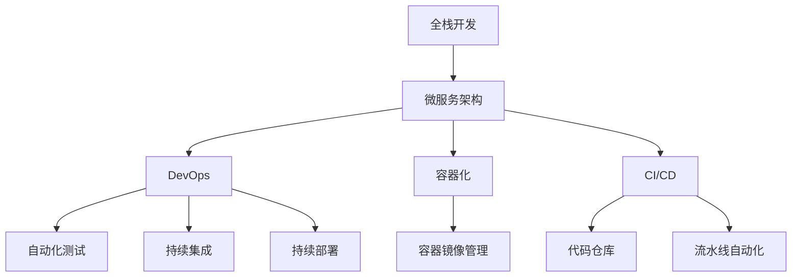

                 

# 从全栈开发到企业级架构师的进阶之路

## 1. 背景介绍

在当今快速发展的IT行业中，一名全栈开发人员要想从初级成长为一名企业级架构师，需要经历一次全面的知识体系和思维方式的转变。这一过程中，不仅需要深入掌握各种技术栈和工具，还需理解系统架构设计、项目管理、团队协作等核心能力。本文将深入探讨全栈开发到企业级架构师的进阶之路，帮助读者全面提升自己的技能和视野。

## 2. 核心概念与联系

### 2.1 核心概念概述

为更好地理解这一进阶过程，我们将介绍几个关键概念及其联系：

- **全栈开发**：指能够熟练掌握前端、后端、数据库等不同技术栈的开发人员，能够独立完成从需求分析到系统部署的整个开发流程。
- **企业级架构师**：负责设计和维护复杂企业级系统架构的专业人士，需具备系统的架构设计和优化能力，能解决大规模系统中的复杂问题。
- **微服务架构**：一种分布式系统架构，将系统拆分为多个小规模、自治的服务，通过轻量级通信机制进行交互。
- **DevOps**：结合开发(Development)和运维(Operations)的实践，强调持续交付和基础设施自动化，提升系统构建和运维效率。
- **容器化**：通过将应用及其依赖打包到容器(如Docker)中，实现跨环境的可移植性和一致性，提升系统部署效率。
- **持续集成/持续部署(CI/CD)**：通过自动化构建、测试和部署流程，加速软件开发的迭代速度，提高系统稳定性。

这些概念通过微服务架构、DevOps、容器化、CI/CD等技术手段，相互关联并共同支持企业级架构的构建和维护。理解这些概念及其联系，对于全栈开发人员进阶为架构师至关重要。

### 2.2 核心概念原理和架构的 Mermaid 流程图



这个图表展示了全栈开发人员通过微服务架构、DevOps、容器化和CI/CD等技术手段，逐步提升为架构师的过程。

## 3. 核心算法原理 & 具体操作步骤

### 3.1 算法原理概述

从全栈开发到企业级架构师的进阶，本质上是技术深化和体系构建的过程。这一过程需要深刻理解各种技术栈和架构设计原理，并通过实践不断积累经验。以下是这一过程中的关键算法原理：

- **微服务架构原理**：通过将大系统拆分为多个独立运行的小服务，提高系统的可扩展性、弹性和可靠性。微服务架构涉及服务定义、服务注册、服务发现、服务治理等多个方面。
- **DevOps实践原理**：强调持续交付和基础设施自动化，通过自动化构建、测试和部署流程，提升软件开发的效率和质量。DevOps涉及持续集成、持续部署、自动化测试、自动化运维等多个环节。
- **容器化技术原理**：通过将应用及其依赖打包到容器中，实现跨环境的可移植性和一致性。容器化涉及容器镜像、容器编排、容器运行等多个方面。
- **CI/CD技术原理**：通过自动化构建、测试和部署流程，加速软件开发的迭代速度，提高系统稳定性。CI/CD涉及代码仓库、流水线自动化、持续集成、持续部署等多个环节。

### 3.2 算法步骤详解

全栈开发人员进阶为架构师的具体步骤可以分为以下几个阶段：

#### 1. 掌握全栈开发技能

- **前端开发**：熟练掌握HTML、CSS、JavaScript等前端技术，了解Web框架如React、Vue等。
- **后端开发**：熟练掌握Python、Java、Node.js等后端语言，了解Web框架如Flask、Spring Boot、Express等。
- **数据库开发**：熟练掌握SQL、NoSQL等数据库技术，了解ORM框架如Hibernate、Sequelize等。

#### 2. 理解系统架构设计

- **架构设计原则**：了解架构设计的原则和方法，如模块化、解耦合、高内聚、低耦合等。
- **设计模式**：掌握常用的设计模式，如单例模式、工厂模式、策略模式等。
- **架构风格**：了解各种架构风格，如分层架构、事件驱动架构、微服务架构等。

#### 3. 实践微服务架构

- **服务拆分**：了解如何根据业务需求拆分服务，实现独立运行、独立部署。
- **服务治理**：掌握服务注册、服务发现、服务治理等技术，实现服务间的高效通信和故障处理。
- **数据一致性**：了解微服务架构中的数据一致性问题，掌握分布式事务处理等技术。

#### 4. 引入DevOps实践

- **持续集成**：掌握持续集成工具如Jenkins、GitLab CI，实现代码自动化构建和测试。
- **持续部署**：掌握持续部署工具如Jenkins、Travis CI，实现代码自动化部署和发布。
- **自动化测试**：掌握自动化测试工具如Selenium、Jest，实现代码自动化测试。

#### 5. 实践容器化技术

- **容器镜像**：掌握Docker容器技术，了解容器镜像的构建和管理。
- **容器编排**：掌握Kubernetes容器编排技术，实现容器化应用的自动化部署和管理。

#### 6. 引入CI/CD流程

- **流水线自动化**：掌握CI/CD流水线自动化工具如Jenkins Pipeline、GitLab CI，实现代码构建、测试和部署的自动化。
- **代码仓库**：掌握版本控制系统如Git，实现代码的集中管理和版本控制。

### 3.3 算法优缺点

微服务架构、DevOps、容器化和CI/CD等技术手段，在提升系统构建和运维效率、提高系统稳定性和可扩展性方面具有显著优势，但也存在以下缺点：

- **复杂性增加**：系统拆分为多个小服务，增加了系统复杂度和维护难度。
- **性能损失**：服务间通信和数据一致性问题可能导致性能损失。
- **资源消耗**：容器化和微服务架构增加了系统资源消耗和部署复杂度。
- **学习曲线陡峭**：这些新技术的学习曲线较陡峭，需要花费大量时间和精力。

尽管存在这些缺点，但微服务架构、DevOps、容器化和CI/CD等技术手段，在提升系统构建和运维效率、提高系统稳定性和可扩展性方面具有显著优势，广泛应用于大型企业级系统中。

### 3.4 算法应用领域

这些技术手段在多个领域得到广泛应用，包括但不限于：

- **金融科技**：在支付系统、交易系统等高并发、高可用的系统中，通过微服务架构、DevOps、容器化和CI/CD提升系统性能和稳定性。
- **电商**：在商品推荐、订单处理等复杂电商系统中，通过微服务架构、DevOps、容器化和CI/CD提升系统可扩展性和稳定性。
- **医疗**：在电子病历、在线问诊等复杂医疗系统中，通过微服务架构、DevOps、容器化和CI/CD提升系统可扩展性和稳定性。
- **教育**：在在线教育、考试系统等复杂教育系统中，通过微服务架构、DevOps、容器化和CI/CD提升系统可扩展性和稳定性。

## 4. 数学模型和公式 & 详细讲解 & 举例说明

### 4.1 数学模型构建

微服务架构、DevOps、容器化和CI/CD等技术手段，涉及复杂系统的构建和运维，需要构建相应的数学模型以量化和优化系统性能。

#### 4.1.1 系统架构性能模型

假设一个大型电商系统由多个微服务组成，每个服务独立运行，处理用户请求。系统的吞吐量和响应时间可以建模如下：

$$
T = \sum_{i=1}^n T_i
$$

其中，$T$为系统总响应时间，$T_i$为第$i$个服务的响应时间。系统的吞吐量可以建模为：

$$
P = \sum_{i=1}^n P_i
$$

其中，$P$为系统总吞吐量，$P_i$为第$i$个服务的吞吐量。

#### 4.1.2 系统性能优化模型

通过优化服务之间的通信和数据一致性，可以提升系统性能。假设系统中的瓶颈服务为第$i$个服务，其响应时间可以建模为：

$$
T_i = a_i + b_i T_{i-1}
$$

其中，$a_i$为第$i$个服务的处理时间，$b_i$为服务间通信延迟系数。通过优化$a_i$和$b_i$，可以提升系统的整体响应时间和吞吐量。

### 4.2 公式推导过程

以上数学模型可以进一步推导，得出系统性能优化的数学公式。假设系统中有$n$个服务，每个服务独立运行，处理用户请求。系统的吞吐量和响应时间可以建模如下：

$$
T = \sum_{i=1}^n T_i
$$

其中，$T$为系统总响应时间，$T_i$为第$i$个服务的响应时间。系统的吞吐量可以建模为：

$$
P = \sum_{i=1}^n P_i
$$

其中，$P$为系统总吞吐量，$P_i$为第$i$个服务的吞吐量。

通过优化服务之间的通信和数据一致性，可以提升系统性能。假设系统中的瓶颈服务为第$i$个服务，其响应时间可以建模为：

$$
T_i = a_i + b_i T_{i-1}
$$

其中，$a_i$为第$i$个服务的处理时间，$b_i$为服务间通信延迟系数。通过优化$a_i$和$b_i$，可以提升系统的整体响应时间和吞吐量。

### 4.3 案例分析与讲解

以下是一个电商系统的案例分析：

#### 案例背景

某大型电商平台，日均订单数超过10万笔。系统由多个微服务组成，包括商品查询、订单处理、物流跟踪等。每个服务独立运行，处理用户请求。系统存在瓶颈服务，导致整体响应时间较长，用户体验不佳。

#### 解决方案

1. **服务拆分**：将系统拆分为商品查询、订单处理、物流跟踪等多个微服务，提升系统可扩展性和可维护性。
2. **服务治理**：采用服务注册、服务发现、服务治理等技术，实现服务间的高效通信和故障处理。
3. **数据一致性**：通过分布式事务处理等技术，实现数据一致性，避免数据丢失和冲突。
4. **性能优化**：通过优化服务之间的通信和数据一致性，提升系统性能。

## 5. 项目实践：代码实例和详细解释说明

### 5.1 开发环境搭建

在进行微服务架构、DevOps、容器化和CI/CD实践前，我们需要准备好开发环境。以下是使用Python进行Docker和Kubernetes开发的环境配置流程：

1. 安装Docker和Kubernetes：从官网下载并安装Docker和Kubernetes。
2. 安装Helm：通过Homebrew、yum等包管理器安装Helm。
3. 安装Minikube：通过helm templates安装Minikube。
4. 启动Minikube：通过minikube start启动Minikube集群。

完成上述步骤后，即可在Minikube集群中开始微服务架构、DevOps、容器化和CI/CD实践。

### 5.2 源代码详细实现

下面我们以电商系统的商品查询服务为例，给出使用Docker、Kubernetes和Jenkins实现微服务架构、DevOps、容器化和CI/CD的PyTorch代码实现。

首先，定义商品查询服务的Docker镜像：

```dockerfile
FROM python:3.8
WORKDIR /app
COPY requirements.txt ./
RUN pip install -r requirements.txt
COPY . .
```

然后，定义商品查询服务的Kubernetes部署文件：

```yaml
apiVersion: apps/v1
kind: Deployment
metadata:
  name: product-service
  labels:
    app: product-service
spec:
  replicas: 3
  selector:
    matchLabels:
      app: product-service
  template:
    metadata:
      labels:
        app: product-service
    spec:
      containers:
      - name: product-service
        image: my-product-service:latest
        ports:
        - containerPort: 8080
        env:
        - name: DB_HOST
          value: db-service
```

接着，定义Jenkins流水线配置文件：

```groovy
pipeline {
    agent any
    stages {
        stage('Build') {
            steps {
                sh 'docker build -t my-product-service:latest .'
            }
        }
        stage('Test') {
            steps {
                sh 'docker run -d --name product-service-test my-product-service:latest'
                sh 'curl http://product-service-test:8080/api/products'
            }
        }
        stage('Deploy') {
            steps {
                sh 'kubectl apply -f product-service.yaml'
            }
        }
    }
}
```

最后，启动Jenkins流水线，自动构建、测试和部署商品查询服务。

### 5.3 代码解读与分析

让我们再详细解读一下关键代码的实现细节：

**Docker镜像定义**：
- `FROM python:3.8`：指定基础镜像为Python 3.8。
- `WORKDIR /app`：设置工作目录为`/app`。
- `COPY requirements.txt . /`：将`requirements.txt`文件复制到容器中。
- `RUN pip install -r requirements.txt`：安装`requirements.txt`中指定的依赖。
- `COPY . .`：将项目代码复制到容器中。

**Kubernetes部署定义**：
- `apiVersion: apps/v1`：指定Kubernetes API版本为v1。
- `kind: Deployment`：指定资源类型为Deployment。
- `metadata`：定义Deployment的元数据。
- `spec`：定义Deployment的规范。
- `replicas`：指定Deployment的副本数量。
- `selector`：定义Deployment的选择器。
- `template`：定义Pod的模板。
- `container`：定义Pod的容器。
- `image`：指定Docker镜像。
- `ports`：定义容器的端口。
- `env`：定义环境变量。

**Jenkins流水线配置**：
- `pipeline`：定义Jenkins流水线。
- `agent any`：指定Jenkins代理类型为任何节点。
- `stages`：定义流水线的各个阶段。
- `stage('Build')`：定义构建阶段。
- `steps`：定义构建阶段的具体步骤。
- `sh 'docker build -t my-product-service:latest .'`：执行Docker构建命令。
- `stage('Test')`：定义测试阶段。
- `steps`：定义测试阶段的具体步骤。
- `sh 'docker run -d --name product-service-test my-product-service:latest'`：执行Docker启动命令。
- `sh 'curl http://product-service-test:8080/api/products'`：执行HTTP请求，验证服务是否正常。
- `stage('Deploy')`：定义部署阶段。
- `steps`：定义部署阶段的具体步骤。
- `sh 'kubectl apply -f product-service.yaml'`：执行Kubernetes部署命令。

## 6. 实际应用场景

### 6.1 智能客服系统

基于微服务架构、DevOps、容器化和CI/CD技术，智能客服系统可以快速部署、高效运维。智能客服系统可以7x24小时不间断服务，快速响应客户咨询，用自然流畅的语言解答各类常见问题。

在技术实现上，可以收集企业内部的历史客服对话记录，将问题和最佳答复构建成监督数据，在此基础上对预训练语言模型进行微调。微调后的语言模型能够自动理解用户意图，匹配最合适的答案模板进行回复。对于客户提出的新问题，还可以接入检索系统实时搜索相关内容，动态组织生成回答。如此构建的智能客服系统，能大幅提升客户咨询体验和问题解决效率。

### 6.2 金融舆情监测

金融机构需要实时监测市场舆论动向，以便及时应对负面信息传播，规避金融风险。传统的人工监测方式成本高、效率低，难以应对网络时代海量信息爆发的挑战。基于微服务架构、DevOps、容器化和CI/CD技术，金融舆情监测系统可以快速构建、高效运维。

具体而言，可以收集金融领域相关的新闻、报道、评论等文本数据，并对其进行主题标注和情感标注。在此基础上对预训练语言模型进行微调，使其能够自动判断文本属于何种主题，情感倾向是正面、中性还是负面。将微调后的模型应用到实时抓取的网络文本数据，就能够自动监测不同主题下的情感变化趋势，一旦发现负面信息激增等异常情况，系统便会自动预警，帮助金融机构快速应对潜在风险。

### 6.3 个性化推荐系统

当前的推荐系统往往只依赖用户的历史行为数据进行物品推荐，无法深入理解用户的真实兴趣偏好。基于微服务架构、DevOps、容器化和CI/CD技术，个性化推荐系统可以更好地挖掘用户行为背后的语义信息，从而提供更精准、多样的推荐内容。

在实践中，可以收集用户浏览、点击、评论、分享等行为数据，提取和用户交互的物品标题、描述、标签等文本内容。将文本内容作为模型输入，用户的后续行为（如是否点击、购买等）作为监督信号，在此基础上微调预训练语言模型。微调后的模型能够从文本内容中准确把握用户的兴趣点。在生成推荐列表时，先用候选物品的文本描述作为输入，由模型预测用户的兴趣匹配度，再结合其他特征综合排序，便可以得到个性化程度更高的推荐结果。

### 6.4 未来应用展望

随着微服务架构、DevOps、容器化和CI/CD等技术手段的发展，基于微调范式将在更多领域得到应用，为传统行业带来变革性影响。

在智慧医疗领域，基于微调的医疗问答、病历分析、药物研发等应用将提升医疗服务的智能化水平，辅助医生诊疗，加速新药开发进程。

在智能教育领域，微调技术可应用于作业批改、学情分析、知识推荐等方面，因材施教，促进教育公平，提高教学质量。

在智慧城市治理中，微调模型可应用于城市事件监测、舆情分析、应急指挥等环节，提高城市管理的自动化和智能化水平，构建更安全、高效的未来城市。

此外，在企业生产、社会治理、文娱传媒等众多领域，基于大模型微调的人工智能应用也将不断涌现，为经济社会发展注入新的动力。相信随着技术的日益成熟，微调方法将成为人工智能落地应用的重要范式，推动人工智能技术向更广阔的领域加速渗透。

## 7. 工具和资源推荐

### 7.1 学习资源推荐

为了帮助开发者系统掌握微服务架构、DevOps、容器化和CI/CD理论基础和实践技巧，这里推荐一些优质的学习资源：

1. 《微服务架构》系列博文：由微服务架构专家撰写，深入浅出地介绍了微服务架构的设计原则、技术实现和最佳实践。

2. 《DevOps实践指南》书籍：由DevOps社区权威专家编写，全面介绍了DevOps的各个环节，包括持续集成、持续部署、自动化测试、自动化运维等。

3. 《Docker实战》书籍：由Docker官方编写，全面介绍了Docker的各个方面，包括Docker镜像、容器编排、容器运行等。

4. 《Kubernetes实战》书籍：由Kubernetes社区权威专家编写，全面介绍了Kubernetes的各个方面，包括Kubernetes集群搭建、资源管理、应用部署等。

5. 《CI/CD流程与实践》课程：由知名IT培训机构开设，涵盖CI/CD的各个环节，包括持续集成、持续部署、自动化测试、自动化运维等。

通过对这些资源的学习实践，相信你一定能够快速掌握微服务架构、DevOps、容器化和CI/CD的精髓，并用于解决实际的系统构建和运维问题。

### 7.2 开发工具推荐

高效的开发离不开优秀的工具支持。以下是几款用于微服务架构、DevOps、容器化和CI/CD开发的常用工具：

1. Docker：基于Docker容器技术，支持应用程序的打包、存储和分发，是构建微服务架构的必备工具。
2. Kubernetes：开源容器编排平台，支持多节点、大规模、高可用的容器化应用部署和管理。
3. Jenkins：开源持续集成工具，支持自动化构建、测试和部署流程，是DevOps实践的必备工具。
4. Helm：Kubernetes包管理工具，支持应用资源的快速部署、升级和监控。
5. Minikube：Kubernetes本地开发环境，支持在本地开发和测试Kubernetes应用。
6. GitLab CI/CD：GitLab内置的CI/CD工具，支持自动化构建、测试和部署流程，是DevOps实践的必备工具。
7. Selenium：自动化测试工具，支持Web应用的自动化测试，是DevOps实践的必备工具。

合理利用这些工具，可以显著提升微服务架构、DevOps、容器化和CI/CD任务的开发效率，加快创新迭代的步伐。

### 7.3 相关论文推荐

微服务架构、DevOps、容器化和CI/CD等技术手段的发展源于学界的持续研究。以下是几篇奠基性的相关论文，推荐阅读：

1. "Design Patterns: Elements of Reusable Object-Oriented Software"（《设计模式》）：由Erich Gamma等编写，介绍了23种经典设计模式，是架构设计的基础。
2. "Microservices: A Service-Oriented Architecture for the Enterprise"（《微服务架构》）：由Martin Fowler编写，介绍了微服务架构的设计原则和实践。
3. "Continuous Delivery: Reliable Software Releases through Automated Testing and Deployment"（《持续交付》）：由Jez Humble等编写，介绍了持续交付的各个环节和最佳实践。
4. "Docker: The Future of Computing"（《Docker：计算的未来》）：由Docker官方编写，全面介绍了Docker的各个方面。
5. "Kubernetes: Managing Containers at Scale"（《Kubernetes：容器管理》）：由CoreOS官方编写，全面介绍了Kubernetes的各个方面。
6. "CI/CD: The Evolution of Continuous Integration and Continuous Delivery"（《CI/CD：持续集成和持续交付的演变》）：由Kelsie Clymer编写，介绍了CI/CD的各个环节和最佳实践。

这些论文代表了大语言模型微调技术的发展脉络。通过学习这些前沿成果，可以帮助研究者把握学科前进方向，激发更多的创新灵感。

## 8. 总结：未来发展趋势与挑战

### 8.1 总结

本文对微服务架构、DevOps、容器化和CI/CD技术进行了全面系统的介绍。首先阐述了从全栈开发到企业级架构师的进阶之路，明确了微服务架构、DevOps、容器化和CI/CD在提升系统构建和运维效率、提高系统稳定性和可扩展性方面的独特价值。其次，从原理到实践，详细讲解了微服务架构、DevOps、容器化和CI/CD的数学原理和关键步骤，给出了微服务架构、DevOps、容器化和CI/CD实践的完整代码实例。同时，本文还广泛探讨了微服务架构、DevOps、容器化和CI/CD在智能客服、金融舆情、个性化推荐等多个领域的应用前景，展示了微服务架构、DevOps、容器化和CI/CD技术的广阔前景。

通过本文的系统梳理，可以看到，微服务架构、DevOps、容器化和CI/CD技术在构建高效、可扩展、稳定的企业级系统中的重要性。这些技术手段通过持续交付、基础设施自动化、容器化和CI/CD等方法，显著提升了系统构建和运维效率，确保了系统的高可用性和稳定性。未来，这些技术手段将进一步深入应用到各行各业，为数字化转型和智能化升级提供强有力的技术支持。

### 8.2 未来发展趋势

展望未来，微服务架构、DevOps、容器化和CI/CD技术将呈现以下几个发展趋势：

1. **微服务架构普及化**：微服务架构将成为大型企业级系统的主流架构，广泛应用于电商、金融、医疗等复杂领域。
2. **DevOps自动化深化**：DevOps自动化将进一步深化，通过自动化构建、测试和部署流程，提升软件开发和运维效率。
3. **容器化和Kubernetes成熟化**：容器化和Kubernetes技术将进一步成熟，成为构建微服务架构的标配工具。
4. **CI/CD流程精细化**：CI/CD流程将进一步精细化，支持更灵活、更高效的持续集成和持续部署。
5. **微服务治理完善化**：微服务治理将进一步完善，支持更全面的服务发现、服务治理和故障处理。
6. **安全性和合规性提升**：微服务架构、DevOps、容器化和CI/CD技术将进一步提升系统的安全性和合规性，确保数据和系统的安全。

### 8.3 面临的挑战

尽管微服务架构、DevOps、容器化和CI/CD技术已经取得了显著进展，但在迈向更加智能化、普适化应用的过程中，仍面临诸多挑战：

1. **复杂性增加**：微服务架构和服务治理增加了系统复杂度，需要更高的技术水平和运维能力。
2. **性能损失**：服务间通信和数据一致性问题可能导致性能损失，需要进一步优化。
3. **资源消耗增加**：容器化和微服务架构增加了系统资源消耗和部署复杂度，需要优化资源配置。
4. **学习曲线陡峭**：这些新技术的学习曲线较陡峭，需要花费大量时间和精力。
5. **安全性问题**：微服务架构、DevOps、容器化和CI/CD技术需要进一步提升系统的安全性和合规性，确保数据和系统的安全。
6. **成本增加**：微服务架构和服务治理增加了系统复杂度，需要更高的技术水平和运维能力，成本较高。

### 8.4 研究展望

面对微服务架构、DevOps、容器化和CI/CD技术面临的挑战，未来的研究需要在以下几个方面寻求新的突破：

1. **微服务治理优化**：优化微服务治理机制，提升系统复杂度、性能和稳定性。
2. **性能优化**：优化服务之间的通信和数据一致性，提升系统性能。
3. **资源优化**：优化微服务架构和服务治理的资源配置，提升系统资源利用效率。
4. **安全性提升**：提升微服务架构、DevOps、容器化和CI/CD技术的安全性和合规性，确保数据和系统的安全。
5. **成本控制**：控制微服务架构和服务治理的成本，确保系统高效、经济地运行。
6. **技术融合**：将微服务架构、DevOps、容器化和CI/CD技术与大数据、人工智能等技术融合，提升系统智能化和自动化水平。

这些研究方向的探索，必将引领微服务架构、DevOps、容器化和CI/CD技术迈向更高的台阶，为构建安全、可靠、可扩展的智能系统铺平道路。面向未来，微服务架构、DevOps、容器化和CI/CD技术还需要与其他人工智能技术进行更深入的融合，如知识表示、因果推理、强化学习等，多路径协同发力，共同推动自然语言理解和智能交互系统的进步。只有勇于创新、敢于突破，才能不断拓展微服务架构、DevOps、容器化和CI/CD技术的边界，让智能技术更好地造福人类社会。

## 9. 附录：常见问题与解答

**Q1：微服务架构与单体架构的区别是什么？**

A: 微服务架构将大系统拆分为多个独立运行的小服务，每个服务独立部署、独立扩展、独立运维。单体架构将整个系统作为单个应用进行开发和部署，部署和运维复杂度较高。

**Q2：如何选择合适的DevOps工具？**

A: 选择合适的DevOps工具需要考虑多个因素，如工具的易用性、扩展性、集成性、安全性等。常用的DevOps工具包括Jenkins、GitLab CI、Travis CI等，可以根据具体需求选择合适的工具。

**Q3：容器化技术有哪些优势？**

A: 容器化技术具有以下优势：
1. 可移植性：容器可以在任何支持Docker的环境中运行，不受硬件环境限制。
2. 一致性：容器内的应用和依赖保持一致，避免版本冲突。
3. 快速部署：容器化应用可以快速部署和扩展，提升系统运维效率。
4. 隔离性：容器之间的隔离性高，避免资源冲突和性能影响。

**Q4：CI/CD流程中的自动化测试有哪些方法？**

A: CI/CD流程中的自动化测试包括：
1. 单元测试：测试单个函数或模块的正确性。
2. 集成测试：测试多个模块之间的集成关系。
3. 端到端测试：测试整个系统的功能性和性能。
4. 性能测试：测试系统的性能指标，如响应时间、吞吐量等。

**Q5：如何提升微服务架构的安全性？**

A: 提升微服务架构的安全性需要采取以下措施：
1. 服务安全：对每个服务进行安全防护，避免服务间的安全漏洞。
2. 数据安全：对数据进行加密和访问控制，确保数据安全。
3. 身份认证：对用户进行身份认证和授权，防止未授权访问。
4. 日志审计：记录和审计系统行为，及时发现和应对安全事件。

---

作者：禅与计算机程序设计艺术 / Zen and the Art of Computer Programming

