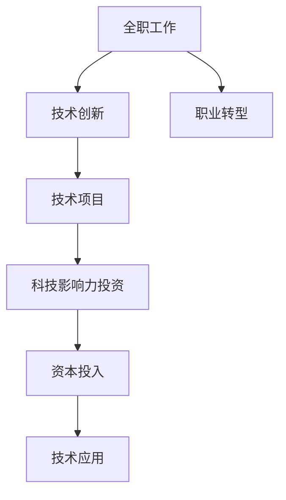

                 

# 从全职工作到科技影响力投资者的转变

在这个快速变化的世界里，技术创新正在重新塑造经济和社会结构。对于许多技术专家来说，他们不仅仅是创新的创造者，更是在驱动这些变革的力量。在技术的海洋中，一些人开始超越传统的全职工作模式，转型成为科技影响力投资者，在这个新时代中扮演关键角色。本文将深入探讨这一转变，分析其背景、核心概念、操作方法以及应用领域，并展望未来发展趋势与挑战。

## 1. 背景介绍

### 1.1 技术发展的驱动
科技行业的迅猛发展，特别是在人工智能、大数据、区块链等领域，为个人提供了前所未有的机遇。技术的成熟和应用场景的扩展，使得一些资深技术专家有机会将其专长转化为投资，进一步推动技术的商业化和社会应用。

### 1.2 经济转型与投资需求
全球经济正在从传统的制造业向服务化、数字化转型，新兴技术和高增长领域对资本的需求日益增加。科技影响力投资者正是这种转型的重要参与者，他们能够识别和推动那些具有高成长潜力的科技项目。

### 1.3 个人职业发展的需求
对于那些希望在技术领域继续成长和实现更大价值的技术专家来说，成为科技影响力投资者提供了一个全新的发展方向。这种职业转型不仅能够提供更高的收入和更大的影响力，还能够带来更广阔的职业视野和丰富的经验。

## 2. 核心概念与联系

### 2.1 核心概念概述

- **科技影响力投资者**：指那些通过投资科技项目，在推动技术创新和市场应用方面具有显著影响的专业投资者。
- **全职工作**：指传统的工作模式，技术专家在这些岗位上通常专注于技术研发、产品开发或系统运维等特定领域的工作。
- **技术创新**：指通过技术研发和应用，创造新的产品、服务和商业模式的过程。
- **资本**：指用于推动技术项目发展的资金，包括风险投资、天使投资、政府资助等。
- **风险与回报**：投资科技项目往往伴随着高风险，但同时也蕴含着高回报。

### 2.2 核心概念原理和架构的 Mermaid 流程图



这个流程图展示了从全职工作到科技影响力投资的基本路径。全职工作通过技术创新推动技术项目，这些项目需要资本投入才能实现技术应用，最终成为新的增长点。职业转型允许技术专家在这一过程中扮演重要角色。

## 3. 核心算法原理 & 具体操作步骤

### 3.1 算法原理概述

科技影响力投资者的核心任务是识别和评估具有潜力的科技项目，并将资本投入到这些项目中。这一过程可以分为以下几个步骤：

1. **市场调研**：了解当前技术趋势和市场需求，识别新兴技术领域。
2. **项目评估**：分析技术项目的可行性、市场潜力、团队实力等因素，做出投资决策。
3. **投资执行**：与项目团队合作，提供资金和资源支持，推动项目发展。
4. **风险管理**：监控项目进展，在必要时提供指导和支持，降低投资风险。
5. **退出策略**：在项目达到预定目标后，通过上市、并购等方式退出投资，实现资本增值。

### 3.2 算法步骤详解

1. **市场调研**
   - 分析行业趋势和竞争格局
   - 评估市场需求和技术成熟度
   - 识别新兴技术机会

2. **项目评估**
   - 技术验证：验证技术的可行性
   - 商业模式：评估商业模式的创新性和可行性
   - 团队实力：考察创始团队的背景和能力

3. **投资执行**
   - 设计投资条款
   - 提供资金和资源支持
   - 制定合作协议

4. **风险管理**
   - 定期跟踪项目进展
   - 提供专业指导和资源
   - 监控市场和行业变化

5. **退出策略**
   - 制定退出计划
   - 选择合适的退出时机和方式
   - 实现资本增值和风险控制

### 3.3 算法优缺点

#### 优点
- **高回报潜力**：科技项目往往具有高成长性，投资回报率较高。
- **多领域涉猎**：科技投资者可以在不同行业和技术领域进行投资，积累广泛经验。
- **社会影响力**：推动技术创新和社会应用，对社会进步有积极影响。

#### 缺点
- **高风险性**：科技投资存在较高的不确定性，风险较大。
- **专业要求高**：需要具备深厚的技术背景和投资经验。
- **时间投入大**：项目筛选、尽职调查、投资执行等环节耗时较长。

### 3.4 算法应用领域

科技影响力投资覆盖了多个领域，主要包括：

- **人工智能**：包括机器学习、自然语言处理、计算机视觉等方向。
- **大数据**：涉及数据挖掘、数据存储、数据分析等技术。
- **区块链**：涵盖区块链技术、加密货币、智能合约等。
- **云计算**：包括IaaS、PaaS、SaaS等云服务解决方案。
- **医疗健康**：利用AI、大数据等技术改善医疗服务。
- **智能制造**：通过物联网、工业互联网等技术实现智能制造。

## 4. 数学模型和公式 & 详细讲解 & 举例说明

### 4.1 数学模型构建

科技影响力投资的数学模型可以基于风险和回报的关系构建。假设投资金额为 $I$，项目的成功概率为 $p$，成功后的市场估值为 $V$，失败后的市场估值为 $0$。则投资者的预期回报 $R$ 可以表示为：

$$
R = pV - (1-p)0 = pV
$$

其中，$p$ 和 $V$ 是关键参数，需要通过市场调研和项目评估来确定。

### 4.2 公式推导过程

1. **市场调研**
   - 收集行业报告、市场研究、技术专利等数据
   - 分析技术趋势和市场需求

2. **项目评估**
   - 确定技术项目的成功概率 $p$
   - 估计成功后的市场估值 $V$

3. **投资决策**
   - 根据预期回报 $R$ 和投资金额 $I$，计算期望收益率

4. **风险管理**
   - 监控项目进展，评估项目风险
   - 调整投资策略，降低风险

5. **退出策略**
   - 选择合适的退出时机和方式
   - 实现资本增值和风险控制

### 4.3 案例分析与讲解

假设投资 $1M 到一个有望实现 $1B 估值的 AI 公司，成功概率为 50%。则预期回报为：

$$
R = 0.5 \times 1B = 500M
$$

即预期收益率为 500 倍。这种高回报率吸引了许多科技投资者。

## 5. 项目实践：代码实例和详细解释说明

### 5.1 开发环境搭建

1. **环境配置**
   - 安装 Python 3.x、Jupyter Notebook 等开发环境。
   - 配置 Git、Github 等版本控制工具。

2. **数据集准备**
   - 收集行业报告、市场研究等数据，构建数据集。

### 5.2 源代码详细实现

以下是使用 Python 进行科技投资项目评估的示例代码：

```python
import pandas as pd
from sklearn.model_selection import train_test_split

# 准备数据集
data = pd.read_csv('investment_data.csv')

# 数据预处理
features = ['market_size', 'growth_rate', 'team_quality', 'technological_vision']
X = data[features]
y = data['success_probability']

# 模型训练和测试
X_train, X_test, y_train, y_test = train_test_split(X, y, test_size=0.2)

# 使用逻辑回归进行评估
from sklearn.linear_model import LogisticRegression
model = LogisticRegression()
model.fit(X_train, y_train)
y_pred = model.predict(X_test)

# 计算评估指标
from sklearn.metrics import accuracy_score
accuracy = accuracy_score(y_test, y_pred)
print(f'评估指标：{accuracy:.2f}')
```

### 5.3 代码解读与分析

这段代码展示了如何使用逻辑回归模型对科技项目进行评估。通过训练和测试数据集，计算模型准确率等评估指标，可以为投资决策提供依据。

### 5.4 运行结果展示

运行上述代码，输出评估指标，可以直观地了解模型的预测准确率，辅助投资决策。

## 6. 实际应用场景

### 6.1 人工智能项目投资
通过对人工智能技术的深入理解，科技投资者可以识别出具有潜力的 AI 项目，如机器学习算法、自然语言处理、计算机视觉等。

### 6.2 大数据项目投资
大数据项目包括数据挖掘、数据分析、数据可视化等技术，科技投资者可以参与这些项目，推动大数据在金融、医疗、电商等领域的实际应用。

### 6.3 区块链项目投资
区块链技术应用广泛，包括数字货币、智能合约、去中心化应用等。科技投资者可以投资这些前沿项目，分享技术变革带来的红利。

### 6.4 未来应用展望

未来，科技影响力投资者的角色将更加多样化，他们不仅在技术项目中扮演关键角色，还将参与到科技政策和法规的制定中。随着技术创新的加速，科技投资者将成为推动社会进步的重要力量。

## 7. 工具和资源推荐

### 7.1 学习资源推荐

1. **技术博客和论坛**：如Medium、GitHub、Stack Overflow 等，获取最新技术动态和社区讨论。
2. **在线课程和讲座**：如Coursera、Udacity、edX 等平台，系统学习技术知识和投资技能。
3. **专业书籍和报告**：如《深度学习》、《人工智能投资》等书籍，提供深入的理论和实践指导。

### 7.2 开发工具推荐

1. **Python 和 Jupyter Notebook**：强大的数据处理和分析工具，适合科技项目评估和投资决策。
2. **Git 和 Github**：版本控制工具，便于项目管理和协作。
3. **数据分析和可视化工具**：如Pandas、NumPy、Matplotlib 等，提升数据分析和展示能力。

### 7.3 相关论文推荐

1. **《深度学习与人工智能投资》**：探讨深度学习在投资决策中的应用。
2. **《科技投资与创新》**：分析科技投资对创新和技术进步的影响。
3. **《区块链投资：机遇与挑战》**：研究区块链技术的投资价值和风险。

## 8. 总结：未来发展趋势与挑战

### 8.1 研究成果总结

科技影响力投资已成为推动技术创新和商业化的重要力量。通过这一职业转型，许多技术专家不仅获得了更高的经济回报，还提升了社会影响力。

### 8.2 未来发展趋势

1. **跨领域融合**：科技投资者将更多地参与跨领域的项目投资，如AI与医疗、区块链与金融等。
2. **新兴技术投资**：随着新兴技术的快速发展，科技投资者将加大对这些领域的投资力度。
3. **全球化布局**：全球化投资将带来更多机会，科技投资者将在全球范围内寻找优质项目。

### 8.3 面临的挑战

1. **市场变化快**：新兴技术发展迅速，市场变化不确定性大。
2. **投资风险高**：高回报往往伴随高风险，需要具备较强的风险管理能力。
3. **专业要求高**：需要掌握多学科知识，如技术、市场、金融等。

### 8.4 研究展望

未来，科技投资者需要不断提升自身的专业能力，紧跟技术趋势，加强跨领域合作，推动技术创新和社会应用。只有如此，才能在快速变化的市场中脱颖而出，实现自身价值和投资回报。

## 9. 附录：常见问题与解答

### Q1：如何评估科技项目的风险和回报？

A: 通过市场调研和项目评估，可以初步判断项目的风险和回报。具体方法包括：

- 收集行业报告和市场数据
- 分析项目的技术可行性、市场需求、团队背景等
- 利用历史数据和案例分析，评估成功概率和市场估值

### Q2：科技投资者需要具备哪些专业技能？

A: 科技投资者需要具备以下专业技能：

- 技术背景：了解前沿技术，具备编程、数据分析等技能。
- 市场分析：理解市场需求和技术趋势，能够评估项目的商业潜力。
- 金融知识：掌握投资和财务知识，能够评估项目的投资价值。
- 风险管理：具备风险识别和控制能力，能够制定有效的投资策略。

### Q3：科技投资者如何寻找优质项目？

A: 科技投资者可以通过以下途径寻找优质项目：

- 行业报告和市场研究
- 科技创业加速器和孵化器
- 科技竞赛和创业活动
- 科技社区和投资论坛
- 网络和社交媒体平台

### Q4：科技投资者如何管理投资风险？

A: 科技投资者可以通过以下方法管理投资风险：

- 多元化投资：投资多个项目，分散风险。
- 尽职调查：深入了解项目团队和技术细节。
- 监控和评估：定期跟踪项目进展，及时调整投资策略。
- 退出计划：制定清晰的退出策略，降低风险。

通过不断学习和实践，科技投资者可以在这一职业转型中取得成功，实现个人价值和社会影响力的双重提升。

