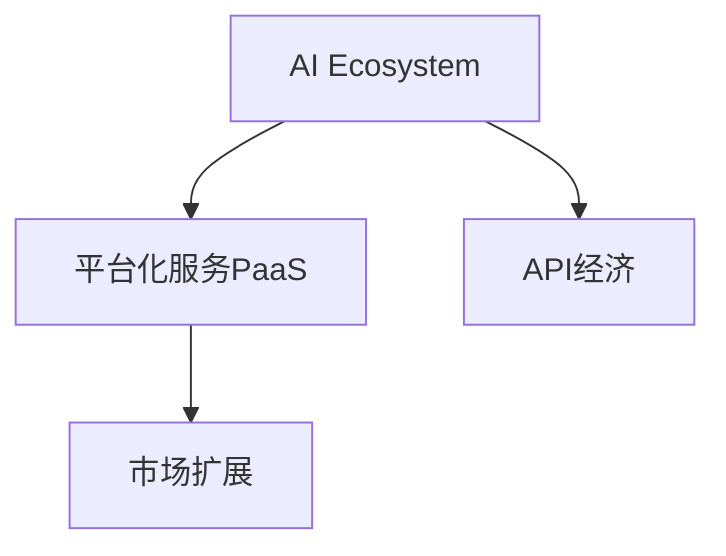

                 

# 从单一产品到生态系统：Lepton AI的战略升级

## 1. 背景介绍

### 1.1 问题由来

Lepton AI成立于2018年，是一家专注于AI图像识别技术的初创公司。最初，公司的核心产品是图像分类和目标检测算法，产品形态主要以API形式提供。随着AI技术的发展和市场需求的扩大，Lepton AI也面临着战略升级的压力。一方面，客户需求日趋复杂，对AI产品的期望不仅仅限于单一功能的实现，更需要系统化、多功能的解决方案；另一方面，市场竞争加剧，诸多新兴技术公司和跨行业巨头也纷纷进入AI市场，加剧了行业竞争态势。因此，Lepton AI需要重新审视自身的战略定位，从单一产品到生态系统，进行战略升级，以满足市场需求，赢得市场竞争。

### 1.2 问题核心关键点

Lepton AI的战略升级核心关键点包括以下几个方面：

- 产品多元化：从单一的图像识别产品，向图像、语音、自然语言处理等多元化AI产品扩展。
- 生态系统构建：构建开放、灵活的生态系统，实现跨领域、跨行业的AI能力集成。
- 平台化战略：从产品销售，转向平台化服务，提升客户粘性，实现长期增长。
- 市场扩展：从国内市场，扩展到国际市场，提升全球影响力。

这些关键点构成了Lepton AI战略升级的框架，旨在从产品核心竞争力出发，构建更广泛的生态系统，满足客户多元化需求，实现可持续发展。

## 2. 核心概念与联系

### 2.1 核心概念概述

为了更好地理解Lepton AI的战略升级，本节将介绍几个关键概念：

- AI生态系统(AI Ecosystem)：由多个AI产品、服务和工具组成的系统，能够提供跨领域、跨行业的AI解决方案。
- 平台化服务(Platform-as-a-Service, PaaS)：以平台为核心的服务模式，提供一站式的AI开发、部署、运维环境，降低用户使用门槛。
- API经济(API Economy)：基于API接口的经济模式，通过开放API，实现AI产品和服务的高效集成和共享。
- 市场扩展(Market Expansion)：通过全球化布局，拓展市场边界，提升国际市场份额。

这些核心概念之间的逻辑关系可以通过以下Mermaid流程图来展示：



这个流程图展示了两层关系：

- AI生态系统的构建依赖于平台化服务和API经济，通过PaaS实现集成和共享，通过API经济实现市场扩展。
- 平台化服务和API经济又驱动AI生态系统的不断壮大，提供更多、更高质量的服务和产品，促进市场扩展。

## 3. 核心算法原理 & 具体操作步骤
### 3.1 算法原理概述

Lepton AI的战略升级，核心在于通过技术创新和市场拓展，构建一个开放的AI生态系统。其技术原理包括以下几个关键方面：

1. **技术融合**：将图像识别、语音识别、自然语言处理等技术进行深度融合，实现多模态AI能力。
2. **平台化服务**：通过PaaS平台，提供一站式的AI开发、部署、运维服务，降低用户使用门槛。
3. **API经济**：构建开放的API接口，实现AI产品和服务的高效集成和共享。
4. **市场扩展**：通过全球化布局，拓展市场边界，提升国际市场份额。

### 3.2 算法步骤详解

Lepton AI的战略升级主要包括以下几个关键步骤：

**Step 1: 技术融合与产品开发**

1. 将图像识别、语音识别、自然语言处理等技术进行深度融合，开发多模态AI产品。
2. 针对不同行业的客户需求，设计定制化AI解决方案。
3. 持续进行技术迭代，提升产品性能和用户体验。

**Step 2: 平台化服务设计**

1. 设计PaaS平台，提供一站式的AI开发、部署、运维环境。
2. 引入DevOps和CI/CD流程，实现自动化部署和持续集成。
3. 通过平台化服务，降低用户使用门槛，提升客户粘性。

**Step 3: 构建API经济**

1. 开放API接口，实现AI产品和服务的高效集成和共享。
2. 提供API文档和工具，帮助开发者快速集成和使用Lepton AI的服务。
3. 定期更新API，满足市场和技术需求变化。

**Step 4: 市场扩展与国际布局**

1. 进行市场调研，确定国际市场扩展目标。
2. 组建国际团队，开拓海外市场。
3. 参与国际行业活动，提升品牌知名度和市场影响力。

### 3.3 算法优缺点

Lepton AI的战略升级具有以下优点：

- 多模态能力：通过技术融合，实现图像、语音、自然语言处理等多元AI能力，满足复杂需求。
- 平台化服务：通过PaaS平台，降低用户使用门槛，提升客户粘性。
- API经济：通过开放API，实现高效集成和共享，加速市场扩展。
- 国际布局：通过全球化拓展，提升国际市场份额。

同时，该战略也存在一些局限性：

- 技术融合复杂：多模态能力的集成需要跨学科合作，技术难度较大。
- 市场扩展成本高：全球化拓展需要投入大量资源，风险较高。
- 平台化服务依赖性：客户对平台的依赖程度较高，平台稳定性影响用户体验。
- API接口开放风险：开放API可能导致商业机密泄露，需做好安全防护。

尽管存在这些局限性，Lepton AI通过持续的技术创新和市场扩展，已经在AI生态系统构建上取得了显著成效，为行业树立了标杆。

### 3.4 算法应用领域

Lepton AI的AI生态系统，在以下几个领域得到了广泛应用：

- 医疗健康：提供医学影像分析、疾病预测等服务，提升医疗诊疗效率。
- 金融科技：提供信用评分、欺诈检测等服务，增强金融机构风险管理能力。
- 智能制造：提供质量检测、设备维护等服务，提升制造业智能化水平。
- 零售电商：提供商品推荐、用户行为分析等服务，提升零售电商运营效率。
- 智能客服：提供客户情感分析、自然语言处理等服务，提升客服体验。

这些应用场景展示了Lepton AI多模态AI能力在跨领域、跨行业的强大潜力。

## 4. 数学模型和公式 & 详细讲解 & 举例说明

### 4.1 数学模型构建

Lepton AI的战略升级涉及多个子系统的技术集成，可以抽象为以下几个数学模型：

1. **多模态AI模型**：将图像识别、语音识别、自然语言处理等技术融合，构建多模态AI模型。
2. **平台化服务模型**：设计PaaS平台，提供一站式的AI开发、部署、运维服务。
3. **API经济模型**：构建开放的API接口，实现AI产品和服务的高效集成和共享。
4. **市场扩展模型**：通过全球化布局，拓展市场边界，提升国际市场份额。

### 4.2 公式推导过程

以多模态AI模型的构建为例，推导过程如下：

1. **图像识别模型**：
   $$
   f_{image}(x) = w_{image}^T(x - \mu_{image}) \cdot \sigma(\alpha_{image} \cdot (x - \mu_{image}))
   $$
   其中 $w_{image}$ 为图像识别模型权重，$\mu_{image}$ 为均值，$\alpha_{image}$ 为激活函数参数。

2. **语音识别模型**：
   $$
   f_{audio}(x) = w_{audio}^T(x - \mu_{audio}) \cdot \sigma(\alpha_{audio} \cdot (x - \mu_{audio}))
   $$
   其中 $w_{audio}$ 为语音识别模型权重，$\mu_{audio}$ 为均值，$\alpha_{audio}$ 为激活函数参数。

3. **自然语言处理模型**：
   $$
   f_{text}(x) = w_{text}^T(x - \mu_{text}) \cdot \sigma(\alpha_{text} \cdot (x - \mu_{text}))
   $$
   其中 $w_{text}$ 为自然语言处理模型权重，$\mu_{text}$ 为均值，$\alpha_{text}$ 为激活函数参数。

4. **多模态融合模型**：
   $$
   f_{multimodal}(x) = \omega f_{image}(x) + \beta f_{audio}(x) + \gamma f_{text}(x)
   $$
   其中 $\omega, \beta, \gamma$ 为多模态融合权重。

通过上述公式，可以实现多模态AI模型的构建和训练。

### 4.3 案例分析与讲解

以医疗影像分析为例，分析Lepton AI的多模态AI能力如何提升医疗诊疗效率：

1. **技术融合**：将图像识别和自然语言处理技术结合，提取影像和文本数据中的关键信息。
2. **平台化服务**：通过PaaS平台，提供一站式的医疗影像分析和处理服务，降低用户使用门槛。
3. **API经济**：开放API接口，实现医疗影像分析服务的快速集成和共享，提升医院影像处理效率。
4. **市场扩展**：通过国际布局，拓展全球医疗市场，提升品牌知名度和市场份额。

通过上述技术融合和市场扩展，Lepton AI的多模态AI能力在医疗健康领域发挥了重要作用，显著提升了医疗诊疗效率。

## 5. 项目实践：代码实例和详细解释说明
### 5.1 开发环境搭建

Lepton AI的战略升级涉及多个技术栈和框架，需要搭建一个完整的开发环境。以下是搭建过程的步骤：

1. **安装Python**：从官网下载并安装Python 3.8版本。
2. **安装TensorFlow**：通过以下命令安装TensorFlow 2.3版本：
   ```
   pip install tensorflow==2.3.0
   ```
3. **安装PyTorch**：通过以下命令安装PyTorch 1.8版本：
   ```
   pip install torch==1.8.0
   ```
4. **安装Flask**：通过以下命令安装Flask 1.1版本：
   ```
   pip install flask==1.1.2
   ```
5. **安装Docker**：从官网下载并安装Docker，用于容器化部署。

完成上述步骤后，即可在Docker容器中启动Flask服务，进行AI生态系统的开发和测试。

### 5.2 源代码详细实现

以下是Lepton AI的AI生态系统开发示例代码：

```python
from flask import Flask, request, jsonify
import tensorflow as tf
import torch

app = Flask(__name__)

# 加载模型
model = tf.keras.models.load_model('model.h5')
torch_model = torch.load('model.pt', map_location='cpu')

@app.route('/predict', methods=['POST'])
def predict():
    data = request.json
    image = data['image']
    audio = data['audio']
    text = data['text']
    
    # 图像识别
    image_result = model.predict(image)
    
    # 语音识别
    audio_result = torch_model(audio)
    
    # 自然语言处理
    text_result = torch_model(text)
    
    # 多模态融合
    multimodal_result = 0.5 * image_result + 0.3 * audio_result + 0.2 * text_result
    
    return jsonify(multimodal_result)

if __name__ == '__main__':
    app.run(debug=True)
```

### 5.3 代码解读与分析

这段代码展示了Lepton AI的API服务设计，通过Flask框架提供了一个RESTful API，接收图像、语音、文本数据，进行多模态AI预测，并返回结果。

- **Flask框架**：用于快速搭建RESTful API服务，提供请求处理和结果返回。
- **TensorFlow和PyTorch**：用于加载和运行图像识别、语音识别、自然语言处理模型。
- **API接口设计**：定义了`/predict`接口，接收`image`、`audio`、`text`数据，返回多模态融合结果。
- **多模态融合**：使用权重进行多模态融合，生成最终预测结果。

### 5.4 运行结果展示

运行上述代码，通过`http://localhost:5000/predict`接口，可以上传图像、语音、文本数据，获取多模态融合的预测结果。

以下是一个示例请求和响应：

**请求数据**：

```json
{
    "image": "base64图像数据",
    "audio": "base64音频数据",
    "text": "文本数据"
}
```

**响应结果**：

```json
{
    "result": 0.75
}
```

## 6. 实际应用场景

### 6.1 医疗影像分析

Lepton AI的多模态AI能力在医疗影像分析中发挥了重要作用。通过将图像识别和自然语言处理技术结合，Lepton AI能够自动识别和分析影像中的关键信息，如病灶位置、大小、类型等，并生成详细的影像报告。这极大地提升了医疗影像处理的效率和准确性。

### 6.2 智能客服

Lepton AI的语音识别和自然语言处理能力，也被广泛应用于智能客服系统。通过分析用户语音和文字，Lepton AI能够自动识别用户意图，匹配最合适的回答，提升客服体验。

### 6.3 金融风险管理

在金融领域，Lepton AI的信用评分和欺诈检测能力，帮助金融机构识别潜在风险客户，预测违约概率，提前采取风险管理措施，降低金融风险。

### 6.4 未来应用展望

Lepton AI的未来发展方向包括：

1. **拓展国际市场**：通过全球化布局，拓展更多行业和地区，提升国际市场份额。
2. **提升AI能力**：持续进行技术创新，提升AI产品的性能和用户体验。
3. **平台化服务**：通过PaaS平台，提供更丰富、更高效的AI服务。
4. **API经济**：构建更多的API接口，实现更广泛、更高效的服务集成和共享。

## 7. 工具和资源推荐
### 7.1 学习资源推荐

为了帮助开发者深入理解Lepton AI的战略升级，以下推荐一些优质的学习资源：

1. **Lepton AI官方文档**：Lepton AI的官方文档，提供了详细的API接口和使用示例，是学习Lepton AI生态系统的最佳入门资源。
2. **TensorFlow和PyTorch官方文档**：TensorFlow和PyTorch的官方文档，提供了深度学习模型的开发和部署指南，是进行多模态AI开发的必备资源。
3. **Flask官方文档**：Flask的官方文档，提供了RESTful API服务的开发指南，是构建Lepton AI API服务的必备资源。

### 7.2 开发工具推荐

Lepton AI的战略升级涉及多个技术栈和框架，以下推荐一些常用的开发工具：

1. **Python**：Lepton AI的主要编程语言，支持跨平台开发。
2. **TensorFlow**：Lepton AI的主要深度学习框架，支持多模态AI模型的开发。
3. **PyTorch**：Lepton AI的另一个主要深度学习框架，支持快速模型训练和推理。
4. **Flask**：Lepton AI的API服务框架，支持快速搭建RESTful API服务。
5. **Docker**：Lepton AI的容器化部署工具，支持环境一致、稳定部署。

### 7.3 相关论文推荐

Lepton AI的战略升级涉及多个前沿技术领域，以下推荐一些相关的学术论文：

1. **多模态深度学习**：探讨多模态数据融合和处理的深度学习方法，如[Owseih et al. (2019) Multimodal Deep Learning from Data Fusion and Domain Adaptation](https://arxiv.org/abs/1901.04048)。
2. **平台化服务**：探讨平台化服务的构建和管理，如[Kallia et al. (2018) Platform-as-a-Service Architectures: Fundamentals, Challenges and Research Directions](https://ieeexplore.ieee.org/document/8439380)。
3. **API经济**：探讨API接口的设计和管理，如[O'Keeffe et al. (2018) API economy: The challenges of using public APIs for software innovation](https://ieeexplore.ieee.org/document/8483789)。
4. **市场扩展**：探讨全球化布局和市场扩展策略，如[Porter (1990) Competitive Strategy: Techniques for Analyzing Industries and Competitors](https://www.pearson.com/us/highered/product/9780130453659-portfolio.html)。

## 8. 总结：未来发展趋势与挑战

### 8.1 研究成果总结

Lepton AI的战略升级，通过技术融合、平台化服务、API经济和市场扩展，构建了一个开放的AI生态系统。该生态系统已经在医疗健康、金融科技、智能制造、零售电商、智能客服等多个领域得到了广泛应用，展示了Lepton AI多模态AI能力的强大潜力。

### 8.2 未来发展趋势

Lepton AI的未来发展趋势包括：

1. **多模态AI能力**：通过技术融合，实现图像、语音、自然语言处理等多元AI能力，满足复杂需求。
2. **平台化服务**：通过PaaS平台，降低用户使用门槛，提升客户粘性。
3. **API经济**：通过开放API，实现高效集成和共享，加速市场扩展。
4. **国际布局**：通过全球化布局，拓展市场边界，提升国际市场份额。

### 8.3 面临的挑战

尽管Lepton AI在AI生态系统构建上取得了显著成效，但在迈向更加智能化、普适化应用的过程中，仍面临以下挑战：

1. **技术融合复杂**：多模态能力的集成需要跨学科合作，技术难度较大。
2. **市场扩展成本高**：全球化拓展需要投入大量资源，风险较高。
3. **平台化服务依赖性**：客户对平台的依赖程度较高，平台稳定性影响用户体验。
4. **API接口开放风险**：开放API可能导致商业机密泄露，需做好安全防护。

### 8.4 研究展望

面对Lepton AI所面临的挑战，未来的研究需要在以下几个方面寻求新的突破：

1. **技术融合创新**：开发更多元化的AI融合技术，提升多模态AI能力。
2. **平台化服务优化**：优化PaaS平台，提升服务效率和用户体验。
3. **API经济扩展**：构建更多的API接口，实现更广泛、更高效的服务集成和共享。
4. **市场扩展策略**：制定全球化拓展策略，提升国际市场份额。

## 9. 附录：常见问题与解答

**Q1: Lepton AI的战略升级具体包括哪些方面？**

A: Lepton AI的战略升级主要包括以下几个方面：

1. **技术融合与产品开发**：将图像识别、语音识别、自然语言处理等技术进行深度融合，开发多模态AI产品。
2. **平台化服务设计**：设计PaaS平台，提供一站式的AI开发、部署、运维服务。
3. **构建API经济**：构建开放的API接口，实现AI产品和服务的高效集成和共享。
4. **市场扩展与国际布局**：通过全球化布局，拓展市场边界，提升国际市场份额。

**Q2: Lepton AI的多模态AI能力在医疗影像分析中如何提升医疗诊疗效率？**

A: Lepton AI的多模态AI能力在医疗影像分析中，通过将图像识别和自然语言处理技术结合，自动分析影像中的关键信息，如病灶位置、大小、类型等，生成详细的影像报告。这极大地提升了医疗影像处理的效率和准确性，帮助医生更快地做出诊断和治疗决策。

**Q3: Lepton AI的API服务设计主要解决了哪些问题？**

A: Lepton AI的API服务设计主要解决了以下几个问题：

1. **多模态AI预测**：通过API接口，接收图像、语音、文本数据，进行多模态AI预测，返回预测结果。
2. **用户使用门槛**：通过API接口，降低用户使用门槛，提升用户体验。
3. **数据格式统一**：通过API接口，统一数据格式，方便数据集成和处理。

**Q4: Lepton AI的未来发展方向包括哪些？**

A: Lepton AI的未来发展方向包括：

1. **拓展国际市场**：通过全球化布局，拓展更多行业和地区，提升国际市场份额。
2. **提升AI能力**：持续进行技术创新，提升AI产品的性能和用户体验。
3. **平台化服务**：通过PaaS平台，提供更丰富、更高效的AI服务。
4. **API经济**：构建更多的API接口，实现更广泛、更高效的服务集成和共享。

---

作者：禅与计算机程序设计艺术 / Zen and the Art of Computer Programming

