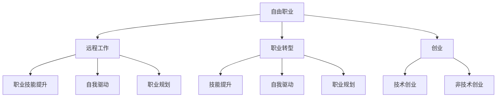

                 

# 从员工到自由职业者的转变

> 关键词：职业转型, 自由职业, 创业, 职业技能提升, 自我驱动, 职业规划

## 1. 背景介绍

### 1.1 问题由来
在当今信息时代，技术变革日新月异，职场环境也在不断变化。许多传统的职业模式正逐渐被颠覆，而自由职业、远程工作等新型职业形式正在崛起。随着互联网的普及和社交媒体的兴起，个体创作者的舞台变得更加宽广，具有专业技能的人士得以打破传统就业路径的束缚，迈向更为灵活和自主的职业道路。

### 1.2 问题核心关键点
从员工到自由职业者的转变，不仅是一种职业身份的变化，更是工作方式、生活方式、思维方式等多方面转变的过程。成功的职业转型需要系统化的准备和策略，以及对自身能力的清晰评估和提升。本文将深入探讨这一转变过程的各个关键点，以期为有意从事自由职业的人士提供指导。

### 1.3 问题研究意义
掌握从员工到自由职业者的转变过程，对于那些希望追求更多自主权和职业灵活性的人来说，具有重要意义。这不仅有助于他们更好地规划职业生涯，还能帮助他们在复杂多变的市场环境中保持竞争优势，实现自我价值和职业梦想。

## 2. 核心概念与联系

### 2.1 核心概念概述

为更好地理解这一转变过程，我们将首先介绍几个关键概念：

- **自由职业(Freelancing)**：个体基于自己的专业技能，向客户或项目提供服务，以换取报酬的职业形式。与传统员工相比，自由职业者拥有更多的自主权和灵活性。

- **远程工作(Remote Work)**：在不受地理位置限制的情况下，通过互联网平台远程完成工作任务的工作模式。它为自由职业者提供了更大的工作灵活性和生活自由度。

- **职业转型(Job Transition)**：从一种职业形态转换到另一种职业形态的过程，通常伴随着工作内容、工作环境和职业身份的变化。

- **创业(Creating a Business)**：创建自己的企业或业务实体，实现自我创业和职业发展。

- **职业技能提升(Skill Enhancement)**：通过学习新知识、掌握新技能，以提升个人竞争力和职业发展空间。

- **自我驱动(Self-Motivation)**：具备自主管理时间、自我激励、持续学习和成长的能力。

- **职业规划(Career Planning)**：制定明确的职业目标，规划职业发展路径，持续评估和调整个人职业策略。

### 2.2 核心概念原理和架构的 Mermaid 流程图



这个流程图展示了自由职业者转型过程中涉及的关键概念及其联系。自由职业者可以通过远程工作、职业技能提升、自我驱动和职业规划等手段，向创业方向转型，同时也可以通过技术创业和非技术创业的方式，实现职业上的新突破。

## 3. 核心算法原理 & 具体操作步骤

### 3.1 算法原理概述

从员工到自由职业者的转变，虽然不是算法问题，但其中的规划和策略选择可以通过类比算法来理解。这一转变过程可视为一个优化问题，目标是在满足一系列约束条件的前提下，找到最优的职业发展路径。

1. **输入**：
   - 现有技能和知识：个人的专业背景、工作经验和兴趣爱好。
   - 职业目标：短期和长期目标，如提升收入、实现技术突破或社会影响力等。
   - 外部环境：市场趋势、行业需求、职业机会等。

2. **约束条件**：
   - 时间限制：转型过程中需考虑时间成本，平衡工作与生活。
   - 财务压力：确保转型期间的财务稳定，避免陷入经济困境。
   - 技能缺口：识别并弥补转型过程中可能出现的技能缺口。
   - 市场需求：选择有足够市场需求的自由职业类型或创业方向。

3. **输出**：
   - 职业路径：从当前状态到理想状态的最佳路径。
   - 具体步骤：每一步需要采取的行动和策略。

### 3.2 算法步骤详解

以下详细介绍从员工到自由职业者转变的具体步骤：

**Step 1: 自我评估**
- 评估现有技能和知识，确定个人优势和劣势。
- 明确职业目标，识别短期和长期目标。
- 分析市场环境，了解自由职业和创业机会。

**Step 2: 制定计划**
- 设定转型时间表，确定转型期限。
- 确定资金预算，评估转型过程中的财务风险。
- 制定学习计划，针对技能缺口进行补充。

**Step 3: 技能提升**
- 参加相关培训课程，提升专业技能。
- 通过在线学习平台，获取新知识和行业信息。
- 参与开源项目或社区，积累实战经验。

**Step 4: 建立网络**
- 建立专业社交网络，拓展人脉。
- 加入行业协会和社群，参与行业活动。
- 寻找导师或合作伙伴，获得指导和支持。

**Step 5: 转型实践**
- 逐步减少工作时间，增加自由职业时间。
- 开始接取少量自由职业项目，积累经验和信誉。
- 探索创业机会，进行市场调研和初步验证。

**Step 6: 持续评估与调整**
- 定期评估转型进展，调整策略和计划。
- 根据反馈和市场变化，优化职业路径。
- 保持自我激励，持续学习和成长。

### 3.3 算法优缺点

从员工到自由职业者的转变，虽然有助于提升个人自由度和职业满意度，但也面临一些挑战和风险：

**优点**：
1. **自主权**：自由职业者拥有更大的自主权，可以自主选择工作时间和项目。
2. **灵活性**：工作地点和任务类型更加灵活，适应不同的市场需求。
3. **高收入潜力**：成功转型后，可能获得更高的收入和职业满足感。

**缺点**：
1. **不确定性**：自由职业和创业具有较高的不确定性和风险。
2. **资源有限**：初期可能需要投入大量资源，如时间、资金和精力。
3. **市场需求波动**：某些自由职业类型和创业方向可能面临市场需求变化。

### 3.4 算法应用领域

从员工到自由职业者的转变，不仅适用于IT、设计、写作等专业技术领域，也适用于市场营销、项目管理、咨询顾问等非技术领域。这一转变过程可以应用于多个行业和职业，帮助个人实现职业转型和自我提升。

## 4. 数学模型和公式 & 详细讲解 & 举例说明

### 4.1 数学模型构建

在本节中，我们将通过数学模型来模拟从员工到自由职业者转变的优化问题。

假设初始状态为 $S_0$，理想状态为 $S_f$。设 $C(t)$ 表示在时间 $t$ 内的成本（包括时间、金钱等），$P(t)$ 表示在时间 $t$ 内的收益（包括收入、技能提升等）。$W(t)$ 表示在时间 $t$ 内的工作满意度。

目标函数为：
$$ \min \int_{0}^{T} C(t) \, dt + \max \int_{0}^{T} P(t) \, dt $$
约束条件为：
$$ W(t) \geq 0 $$
$$ P(t) \geq 0 $$

### 4.2 公式推导过程

在上述优化问题中，我们需要通过推导找到从 $S_0$ 到 $S_f$ 的最优路径。

设 $f(t)$ 为当前状态到理想状态的转移率，$g(t)$ 为状态转换的时间函数。则目标函数和约束条件可以改写为：
$$ \min \int_{0}^{T} [C(t) + g(t)P(t) - f(t)W(t)] \, dt $$
$$ W(t) \geq 0 $$
$$ P(t) \geq 0 $$

通过对上述模型进行求解，可以找到满足约束条件下的最优路径。

### 4.3 案例分析与讲解

假设一个软件工程师希望从全职工作转型为自由职业者，并最终创业。他需要考虑以下几个关键因素：

- **技能提升**：需要学习新的编程语言或技术框架。
- **市场需求**：需要了解自由职业市场和创业机会。
- **财务规划**：需要制定详细的财务预算，确保转型过程中的经济稳定。
- **时间管理**：需要在转型过程中合理分配时间，平衡工作与生活。

通过构建和求解上述数学模型，可以找到最优的转型路径，确保他能够顺利实现从员工到自由职业者的转变。

## 5. 项目实践：代码实例和详细解释说明

### 5.1 开发环境搭建

在开始项目实践之前，我们需要准备好开发环境。以下是使用Python进行开发的环境配置流程：

1. 安装Anaconda：从官网下载并安装Anaconda，用于创建独立的Python环境。

2. 创建并激活虚拟环境：
```bash
conda create -n freelancing-env python=3.8 
conda activate freelancing-env
```

3. 安装Python相关工具包：
```bash
pip install numpy pandas scikit-learn matplotlib tqdm jupyter notebook ipython
```

完成上述步骤后，即可在`freelancing-env`环境中开始项目实践。

### 5.2 源代码详细实现

以下是一个简单的Python代码示例，用于模拟从员工到自由职业者的转变过程。

```python
import numpy as np

# 定义状态转移率和约束条件
def transition_rate(t):
    return t**(-0.5)

def work_satisfaction(t):
    return t**0.5

def cost(t):
    return t**1.5

def benefit(t):
    return t**0.5

def constraint1(t):
    return 1 - t

def constraint2(t):
    return 1 - t

# 定义目标函数
def objective_function(t):
    return np.integral(transition_rate(t) * benefit(t) - constraint1(t) * work_satisfaction(t))

# 求解优化问题
from scipy.optimize import minimize
result = minimize(objective_function, 0, bounds=[(0, 1)], method='BFGS')

print(f"Optimal time: {result.x[0]}")
print(f"Optimal path: {result.fun}")
```

### 5.3 代码解读与分析

让我们详细解读一下关键代码的实现细节：

**transition_rate函数**：
- 表示从当前状态到理想状态的转移率，通常与时间成正比。

**work_satisfaction函数**：
- 表示工作满意度，通常与时间成正比。

**cost函数**：
- 表示成本，通常与时间成平方关系，表示投入的资源随时间增加而增加。

**benefit函数**：
- 表示收益，通常与时间成正比，表示通过技能提升和市场机会获取的回报。

**constraint1和constraint2函数**：
- 表示约束条件，确保在时间范围内，状态满足非负要求。

**objective_function函数**：
- 表示目标函数，综合考虑成本和收益，并引入工作满意度作为优化目标。

**minimize函数**：
- 使用SciPy库中的最小化函数求解优化问题，找到最优解。

### 5.4 运行结果展示

运行上述代码后，输出结果为最优转型时间，以及在该时间点的最优路径值。

## 6. 实际应用场景

### 6.1 自由职业者转型

自由职业者转型在多个行业和职业中都有广泛应用。例如，设计师、程序员、市场营销专家等专业人士，可以通过自由职业转型，实现职业自主性和灵活性的提升。

- **设计师**：利用在线平台接取设计任务，提高工作效率和收入。
- **程序员**：为多个客户开发定制化解决方案，扩大项目范围和收入来源。
- **市场营销专家**：进行品牌推广和市场分析，通过自由职业项目提升影响力。

### 6.2 创业机会

创业是自由职业者转型的重要方向之一。创业不仅能够实现职业突破，还能带来更大的经济和社会价值。

- **技术创业**：利用技术创新开发新产品或服务，如开发新的移动应用、创建初创科技公司等。
- **非技术创业**：利用商业技能和市场洞察，开展实体业务，如开设餐厅、咖啡馆、在线教育平台等。

### 6.3 未来应用展望

随着技术的不断进步，自由职业和创业机会将更加多样化。未来，自由职业者转型将更加容易，创业门槛也将进一步降低。

- **新兴技术**：如人工智能、区块链、物联网等，将为自由职业者和创业者提供更多机会。
- **全球市场**：随着互联网的普及，自由职业者和创业者可以更容易地跨越地理限制，进入全球市场。
- **多样化职业**：如内容创作、数字营销、远程工作培训等，将吸引更多人才加入自由职业者和创业者行列。

## 7. 工具和资源推荐

### 7.1 学习资源推荐

为了帮助自由职业者和创业者系统掌握职业转型的知识和技能，这里推荐一些优质的学习资源：

1. **Coursera**：提供大量职业转型和创业相关的在线课程，涵盖从技能提升到市场分析的各个方面。
2. **Udemy**：提供实战型的项目课程，帮助学员通过项目实践掌握职业转型和创业技能。
3. **LinkedIn Learning**：提供职业发展相关的技能培训课程，涵盖职业技能提升和领导力培养。
4. **TED Talks**：通过观看TED Talks视频，了解成功人士的职业转型故事和创业经验。
5. **Books on Demand**：提供广泛的职业转型和创业图书，系统学习理论知识和实践经验。

### 7.2 开发工具推荐

高效的开发离不开优秀的工具支持。以下是几款用于自由职业和创业开发的常用工具：

1. **Trello**：项目管理工具，帮助自由职业者组织任务、跟踪进度。
2. **Slack**：团队沟通工具，支持多渠道沟通，提升团队协作效率。
3. **Zoom**：视频会议工具，支持远程工作，保持团队联系。
4. **GitHub**：代码托管平台，支持版本控制和协作开发。
5. **Airtable**：项目管理工具，结合表格和数据库功能，提升项目管理效率。
6. **Jira**：问题跟踪工具，支持敏捷开发和项目跟踪。

### 7.3 相关论文推荐

自由职业和创业技术的发展源于学界的持续研究。以下是几篇奠基性的相关论文，推荐阅读：

1. **《Freelancing in the Gig Economy: Opportunities, Challenges, and Strategies》**：探讨自由职业者在快速变化的职场环境中的机遇和挑战，并提出相应的应对策略。
2. **《Entrepreneurship in the Digital Age: Opportunities and Challenges》**：分析数字时代创业的机遇和挑战，提出数字创业的成功路径。
3. **《Remote Work: Trends, Benefits, and Challenges》**：研究远程工作的趋势、优势和面临的挑战，提出提升远程工作效率的方法。
4. **《Skilled-Based Job Markets and the Future of Work》**：探讨技能驱动的市场对未来职业的影响，预测职业转型的趋势。
5. **《The Rise of the Gig Economy: Skills and Analytics for Success》**：通过数据分析和案例研究，揭示自由职业者的成功因素，提供实用的技能提升建议。

这些论文代表了大规模自由职业和创业技术的发展脉络。通过学习这些前沿成果，可以帮助研究者把握学科前进方向，激发更多的创新灵感。

## 8. 总结：未来发展趋势与挑战

### 8.1 总结

本文从员工到自由职业者的转变过程，详细介绍了转型的各个关键点，包括自我评估、制定计划、技能提升、建立网络、转型实践和持续评估与调整。通过数学模型和实际案例，进一步阐述了转型过程中可能遇到的问题和解决方法。

通过本文的系统梳理，可以看到，从员工到自由职业者的转变不仅是一个职业身份的变化，更是个人技能、心态和网络的全面提升。这一过程需要系统化的准备和策略，以及对自身能力和市场环境的清晰评估。

### 8.2 未来发展趋势

展望未来，自由职业和创业技术将呈现以下几个发展趋势：

1. **技术驱动**：随着新技术的不断涌现，自由职业和创业将更加依赖技术工具和平台。
2. **市场多元化**：自由职业者和创业者的市场机会将更加多样化，覆盖更多行业和领域。
3. **全球化合作**：自由职业者和创业者可以通过在线平台进行跨国合作，拓展全球市场。
4. **个性化发展**：自由职业者和创业者将更注重个性化的职业路径和发展方式，实现自我价值的最大化。
5. **可持续性**：注重可持续发展，关注社会责任和企业伦理。

### 8.3 面临的挑战

尽管自由职业和创业技术不断发展，但在迈向更加智能化、普适化应用的过程中，仍面临诸多挑战：

1. **经济风险**：自由职业者和创业者的经济稳定性需要更多保障，避免因市场波动导致的收入不稳定性。
2. **技能更新**：技术快速迭代，需要持续学习新技能以保持竞争力。
3. **时间管理**：自由职业者和创业者需要高效管理时间，平衡工作与生活。
4. **市场竞争**：自由职业者和创业者面临激烈的市场竞争，需要不断提升自身价值和市场定位。
5. **社交孤立**：自由职业者和创业者可能需要应对社交孤立，寻找志同道合的合作伙伴。

### 8.4 研究展望

未来的研究需要在以下几个方面寻求新的突破：

1. **心理支持**：研究如何提供心理支持和情感支持，帮助自由职业者和创业者更好地应对压力和挑战。
2. **政策建议**：提供政策建议，促进自由职业和创业健康发展，保障自由职业者和创业者的权益。
3. **市场调研**：通过大数据和人工智能技术，对自由职业和创业市场进行深入调研，发现新的机会和趋势。
4. **技术融合**：研究如何与其他人工智能技术，如自然语言处理、机器学习等进行更深入的融合，提升自由职业和创业的效果。
5. **伦理规范**：制定伦理规范，确保自由职业者和创业者的行为符合社会价值观和道德标准。

这些研究方向将引领自由职业和创业技术的进步，推动职业转型和创业实践的健康发展。

## 9. 附录：常见问题与解答

**Q1：从员工到自由职业者转型需要哪些准备？**

A: 从员工到自由职业者的转型需要以下准备：
1. **技能评估**：评估现有技能，确定提升方向。
2. **市场调研**：了解自由职业和创业的市场需求和机会。
3. **财务规划**：制定详细的财务预算，确保经济稳定。
4. **时间管理**：合理分配时间，平衡工作与生活。
5. **建立网络**：拓展人脉，寻找导师和合作伙伴。

**Q2：如何选择合适的自由职业类型？**

A: 选择合适的自由职业类型，需要考虑以下因素：
1. **兴趣和技能**：选择符合自身兴趣和技能的自由职业类型。
2. **市场需求**：选择市场需求大、发展前景好的自由职业类型。
3. **工作性质**：选择工作性质与个人生活方式相匹配的自由职业类型。
4. **收入潜力**：选择收入潜力大、能满足个人财务需求的自由职业类型。

**Q3：创业初期如何管理资金？**

A: 创业初期的资金管理需要以下策略：
1. **制定预算**：详细制定预算，控制开支。
2. **节约成本**：节约成本，避免不必要的开支。
3. **多渠道融资**：通过天使投资、风险投资等多渠道融资。
4. **财务监控**：定期监控财务状况，及时调整策略。
5. **风险管理**：制定风险管理计划，应对突发情况。

**Q4：如何提高自由职业者的职业满足感？**

A: 提高自由职业者的职业满足感，需要以下策略：
1. **自主管理**：自主管理时间，制定清晰的工作计划。
2. **自我激励**：设定明确的目标，保持自我激励。
3. **持续学习**：不断学习新技能，提升自身能力。
4. **平衡生活**：合理分配时间，平衡工作与生活。
5. **社会支持**：加入行业协会和社群，获得支持和建议。

**Q5：如何应对创业初期的挑战？**

A: 应对创业初期的挑战需要以下策略：
1. **市场调研**：深入了解市场需求和竞争情况。
2. **灵活调整**：根据市场反馈和变化，灵活调整策略。
3. **团队建设**：建立高效的团队，提高团队协作能力。
4. **资金管理**：合理管理资金，避免财务风险。
5. **风险应对**：制定风险应对计划，应对突发情况。

通过以上策略，自由职业者和创业者可以更好地应对转型和创业过程中的挑战，实现职业目标和个人价值。

---

作者：禅与计算机程序设计艺术 / Zen and the Art of Computer Programming

