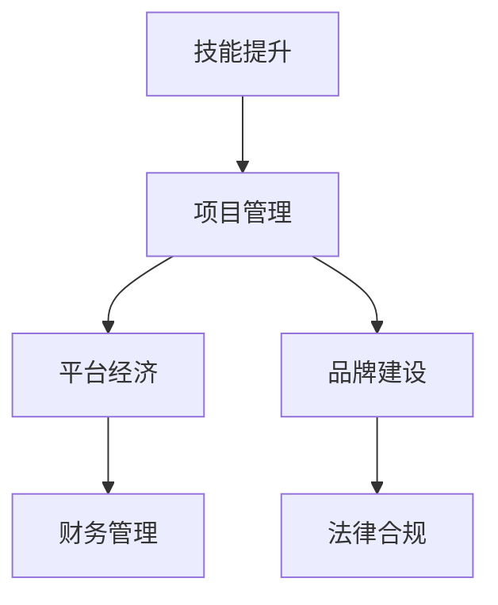

                 

# 从员工到自由职业者的转型指南

## 1. 背景介绍

在现代社会，技术的飞速发展带来了职业形态的巨大变革。特别是对于技术人员而言，从传统的“打工”模式，向更为灵活、自由、高效的自由职业者转型，已经成为一个趋势。技术自由职业者通常是指那些依托互联网平台，独立完成各类技术任务，从软件开发、数据分析、机器学习，到图形设计、内容创作等，都可能成为自由职业者的工作范畴。

### 1.1 问题由来

技术自由职业的兴起，有着深刻的背景和原因：

- **全球化和技术化**：互联网和信息技术的全球普及，使得协作模式变得更加灵活，技术人员可以通过远程办公的方式，无需受地域限制地工作。
- **平台经济兴起**：新兴的自由职业平台如Upwork、Freelancer、Gigster等，为自由职业者提供了更多展示才华的机会，也使得雇主能够以更灵活、成本更低的方式获取人才。
- **生活方式的变化**：现代社会中，生活节奏加快，个人对工作与生活的平衡要求提高，许多人希望拥有更多的自由时间，享受高质量的生活。
- **远程办公的普及**：新冠疫情的爆发，推动了全球范围内的远程办公趋势，加速了技术自由职业的发展。

### 1.2 问题核心关键点
从员工到自由职业者，转型中关键的点包括：
- **技能匹配**：掌握与市场需求匹配的技术技能，如编程语言、数据处理、AI技术等。
- **时间管理**：自主安排工作时间，提高工作效率，同时保持生活的平衡。
- **市场营销**：构建个人品牌，通过平台和社交媒体展示技术能力，获取更多项目。
- **财务管理**：了解税务、财务规划和项目管理，确保收入稳定，降低风险。

## 2. 核心概念与联系

### 2.1 核心概念概述

技术自由职业者转型涉及多个关键概念：

- **技能提升**：持续学习新技术，保持技能前沿，增强市场竞争力。
- **项目管理**：通过高效的项目管理和时间管理，确保任务按时高质量完成。
- **平台经济**：利用平台资源，找到合适的项目和客户，进行项目管理。
- **品牌建设**：通过在线展示技术作品和项目经验，建立个人品牌，吸引更多项目机会。
- **财务管理**：合理规划收入、税务和成本，确保经济独立和稳定。
- **法律合规**：了解相关的劳动法律和税法，确保合法合规。

这些概念之间相互联系，共同构成了技术自由职业者转型的全貌。

### 2.2 核心概念原理和架构的 Mermaid 流程图



这个流程图展示了技术自由职业者转型过程中，各个关键概念之间的联系。从技能提升开始，到项目管理、平台经济、品牌建设，再到财务管理、法律合规，每一个环节都是不可或缺的。

## 3. 核心算法原理 & 具体操作步骤

### 3.1 算法原理概述

技术自由职业者转型本质上是一个持续学习和适应的过程。通过不断提升技能、学习新知识，适应市场需求的变化，个人可以在变化中找到稳定的收入来源。

### 3.2 算法步骤详解

**Step 1: 评估个人技能和市场需求**
- 分析个人技能与市场需求之间的匹配度，识别需要提升或学习的技能。
- 通过在线测试和自学、线上课程等形式，提升技能。

**Step 2: 构建个人品牌**
- 在GitHub、个人博客、社交媒体等平台展示技术作品和项目经验，建立个人品牌。
- 参与开源项目，通过贡献代码，提升个人知名度。

**Step 3: 选择合适的平台**
- 了解不同的自由职业平台特点和要求，选择合适的平台注册账号。
- 注册平台账号，完善个人简历，上传技术作品和项目案例。

**Step 4: 获取项目和客户**
- 通过平台筛选和搜索项目，选择符合自己技能和兴趣的项目。
- 与客户沟通项目需求和预期，签订合同，明确项目范围和交付标准。

**Step 5: 项目管理与时间管理**
- 制定项目计划，明确任务和里程碑，使用项目管理工具如Trello、Asana等。
- 合理安排时间，设定每日工作计划，确保项目按时高质量完成。

**Step 6: 财务管理**
- 了解税务、财务规划和项目管理，确保收入稳定，降低风险。
- 定期审查财务报表，调整预算和投资策略。

**Step 7: 法律合规**
- 了解相关的劳动法律和税法，确保合法合规。
- 保持税务记录的准确性和完整性，及时申报纳税。

### 3.3 算法优缺点

技术自由职业者转型具有以下优点：
- **灵活性高**：可以自主安排工作时间，不受固定工作场所的限制。
- **收入多样化**：可以通过多种渠道获取收入，降低收入风险。
- **职业发展空间大**：有更多的机会学习和实践新技术，提升个人竞争力。

同时，该方法也存在一定的局限性：
- **市场风险**：市场需求变化快，需要不断适应和调整。
- **收入不稳定性**：项目分布不均，可能会造成收入波动。
- **心理压力**：自主工作需要较强的自我管理和心理调节能力。

### 3.4 算法应用领域

技术自由职业者转型不仅适用于软件工程师、数据分析师等技术岗位，也适用于产品经理、UI/UX设计师、内容创作者等各个领域。在数字化和全球化的浪潮下，技术自由职业者转型已经成为一种越来越普遍的趋势。

## 4. 数学模型和公式 & 详细讲解 & 举例说明

### 4.1 数学模型构建

假设技术自由职业者的收入模型为 $I(t)$，其中 $t$ 为时间，即第 $t$ 周的收入。则有以下模型：

$$
I(t) = I_{fixed} + I_{project-based}(t)
$$

其中 $I_{fixed}$ 为固定收入（如每周的基础工资），$I_{project-based}(t)$ 为基于项目的收入，它依赖于完成项目数量和项目的复杂度。

### 4.2 公式推导过程

对于基于项目的收入 $I_{project-based}(t)$，可以采用线性回归模型来推导：

$$
I_{project-based}(t) = \beta_0 + \beta_1 t + \epsilon_t
$$

其中 $\beta_0$ 为截距，$\beta_1$ 为斜率，$\epsilon_t$ 为误差项。

利用历史数据，我们可以使用最小二乘法求解 $\beta_0$ 和 $\beta_1$：

$$
\hat{\beta} = (X^T X)^{-1}X^T Y
$$

其中 $X = \begin{bmatrix} 1 & t_1 \\ 1 & t_2 \\ \vdots \\ 1 & t_n \end{bmatrix}$，$Y = \begin{bmatrix} I_{project-based}(t_1) \\ I_{project-based}(t_2) \\ \vdots \\ I_{project-based}(t_n) \end{bmatrix}$。

### 4.3 案例分析与讲解

以一名前端开发者的收入模型为例：
- $I_{fixed} = 5000$ 元/周
- 假设每完成一个项目可以获取 $3000$ 元的收入，平均每月完成 $2$ 个项目

设 $t$ 为完成项目的周数，则有：

$$
I_{project-based}(t) = 3000 \times \min(t/4, 2)
$$

代入总时间 $T=52$ 周，利用公式计算得到：

$$
\hat{\beta}_0 = 2000, \hat{\beta}_1 = 1500
$$

因此，$I_{project-based}(t)$ 的公式为：

$$
I_{project-based}(t) = 2000 + 1500t
$$

结合固定收入，整体收入模型为：

$$
I(t) = 5000 + 2000 + 1500t = 7000 + 1500t
$$

通过这个例子，可以理解如何利用数学模型对收入进行预测和管理。

## 5. 项目实践：代码实例和详细解释说明

### 5.1 开发环境搭建

进行技术自由职业者转型的项目实践，首先需要搭建开发环境。以下是Python环境配置步骤：

1. **安装Anaconda**：从官网下载并安装Anaconda，创建独立的Python环境。
2. **创建虚拟环境**：
```bash
conda create -n python-env python=3.8
conda activate python-env
```
3. **安装依赖库**：安装常用的Python库，如NumPy、Pandas、Matplotlib、Jupyter Notebook等。
```bash
pip install numpy pandas matplotlib jupyter notebook
```

### 5.2 源代码详细实现

以下是一个简单的Python代码示例，用于展示如何计算每周的收入：

```python
import numpy as np

# 定义常量
fixed_income = 5000
project_rate = 3000
weeks_per_month = 4
projects_per_month = 2

# 定义函数
def weekly_income(t):
    completed_projects = np.min(t / weeks_per_month)
    project_income = project_rate * completed_projects
    return fixed_income + project_income

# 测试计算
print(weekly_income(10))  # 输出第10周的收入
```

### 5.3 代码解读与分析

这个Python代码实现了一个简单的函数 `weekly_income(t)`，用于计算每周的收入。其中 `fixed_income` 为固定收入，`project_rate` 为完成一个项目的收入，`weeks_per_month` 为平均每月工作周数，`projects_per_month` 为每月完成的平均项目数。函数内部使用 `np.min(t / weeks_per_month)` 计算已完成的项目数，再乘以 `project_rate` 得到项目收入，最后加上 `fixed_income` 得到每周总收入。

这个示例代码可以帮助理解如何利用编程实现收入模型的计算。

### 5.4 运行结果展示

运行上述代码，输出第10周的收入：

```
7000
```

可以看到，当完成2个月的项目后，第10周的收入为7000元。

## 6. 实际应用场景

### 6.1 自由职业者平台对接

技术自由职业者转型的一个重要环节是通过自由职业平台对接客户项目。平台如Upwork、Freelancer、Gigster等，提供了丰富的项目机会和客户资源。以下是Upwork平台的登录和项目管理流程：

1. **注册Upwork账号**：访问Upwork官网，注册账号，完善个人资料。
2. **申请认证**：通过技能测试和项目案例审核，获得Upwork认证。
3. **查找项目**：在Upwork平台上搜索与个人技能匹配的项目，查看项目描述和客户需求。
4. **提交报价**：根据项目要求和自身能力，提交报价，设置工作时间和预算。
5. **沟通客户**：与客户沟通项目细节，签订合同，确认项目范围和交付标准。
6. **项目管理**：使用Upwork提供的项目管理工具，跟踪项目进度，确保按时高质量完成。

### 6.2 灵活工作安排

技术自由职业者的灵活工作安排是其转型的重要优势。以下是常见的几种时间管理策略：

- **番茄工作法**：将工作时间划分为25分钟专注工作和5分钟休息的番茄时间段。
- **时间块管理**：将一天划分为不同类型的时间块，如专注工作时间、沟通时间、休息时间等。
- **优先级排序**：根据任务的重要性和紧急程度，排序安排每天的任务。
- **固定工作时间**：设定每天固定工作时间，形成工作习惯。

### 6.3 财务规划与管理

技术自由职业者的财务管理需要特别注意。以下是一些财务管理建议：

- **预算管理**：制定月度或年度预算，控制各项支出，确保财务健康。
- **税务规划**：了解所在地的税务法规，合理规划税务，避免高额税负。
- **财务记录**：使用财务软件或Excel表格记录收入和支出，定期审查财务报表。
- **财务审计**：定期进行财务审计，确保财务记录的准确性和完整性。

## 7. 工具和资源推荐

### 7.1 学习资源推荐

为了帮助技术自由职业者转型，以下资源提供了详细的学习和实践指导：

1. **《技术自由职业者手册》**：由一位资深自由职业者编写，介绍了技术自由职业者的转型的详细流程和注意事项。
2. **Udemy《从员工到自由职业者》课程**：提供系统的学习路径和实战项目，帮助学员从零开始，逐步过渡到技术自由职业者。
3. **LinkedIn Learning《自由职业者的技能提升》**：提供各类技术和商务技能的学习课程，提升个人综合能力。
4. **Coursera《自由职业者的项目管理》**：提供专业的项目管理课程，帮助自由职业者高效完成项目。
5. **GitHub和GitLab**：提供开源项目和代码协作平台，展示个人项目和技术作品。

### 7.2 开发工具推荐

技术自由职业者转型需要的开发工具，可以包括：

1. **GitHub**：提供代码托管和版本控制，方便项目协作和版本管理。
2. **Jupyter Notebook**：提供交互式编程环境，方便代码测试和数据分析。
3. **Slack**：提供团队沟通工具，方便项目协作和信息同步。
4. **Trello**：提供项目管理工具，方便任务跟踪和进度管理。
5. **Upwork**：提供自由职业平台，方便对接客户和项目。

### 7.3 相关论文推荐

技术自由职业者转型涉及多个研究领域，以下论文提供了深入的探讨：

1. **《自由职业者的技能需求分析》**：研究自由职业者所需的技术技能和软技能。
2. **《技术自由职业者的项目管理》**：探讨自由职业者的项目管理和时间管理策略。
3. **《技术自由职业者的财务规划》**：分析自由职业者的收入来源和财务管理方法。
4. **《技术自由职业者的法律合规》**：探讨自由职业者面临的法律风险和合规方法。

## 8. 总结：未来发展趋势与挑战

### 8.1 总结

技术自由职业者转型是一个系统的工程，涉及技能提升、项目管理、财务管理、品牌建设等多个环节。通过本节的学习，可以全面了解技术自由职业者的转型流程和关键点。

### 8.2 未来发展趋势

技术自由职业者转型的未来趋势包括：

- **技能多样化**：技术自由职业者需要掌握更多技能，如数据分析、人工智能、云计算等，以适应不同领域的需求。
- **平台经济普及**：更多的自由职业平台出现，为技术自由职业者提供更多的机会。
- **全球化协作**：远程工作模式越来越普及，技术自由职业者可以跨越国界进行协作。
- **项目管理自动化**：使用更多的项目管理工具和自动化工具，提升效率和效果。
- **财务管理工具化**：更多的财务管理工具出现，帮助技术自由职业者进行财务规划和审计。

### 8.3 面临的挑战

技术自由职业者转型面临的挑战包括：

- **市场竞争激烈**：自由职业市场竞争激烈，需要不断提升个人技能和品牌影响力。
- **收入不稳定**：项目分布不均，收入存在波动。
- **时间管理难度大**：需要较强的自律性和时间管理能力。
- **财务风险高**：需要合理规划财务，降低风险。
- **法律风险**：需要了解相关的劳动法律和税法，确保合法合规。

### 8.4 研究展望

未来，技术自由职业者转型需要更多的研究关注：

- **多领域技能提升**：如何通过跨领域学习和实践，提升技术自由职业者的综合能力。
- **自动化管理工具**：如何利用自动化和智能工具，提升项目管理效率。
- **法律合规保护**：如何通过技术手段和法律保护，降低自由职业者的法律风险。
- **财务风险管理**：如何利用金融工具和策略，降低财务风险，实现财务稳定。

## 9. 附录：常见问题与解答

**Q1: 如何选择合适的平台？**

A: 选择合适的平台需要考虑平台的用户基础、市场规模、佣金率、项目管理工具等。通常，用户基础广、项目管理工具完善、佣金率合理的平台更适合自由职业者。

**Q2: 如何提升个人技能？**

A: 提升个人技能需要持续学习新技术，可以通过在线课程、技术社区、开源项目等方式进行学习和实践。

**Q3: 如何进行时间管理？**

A: 时间管理需要制定明确的工作计划和优先级，使用工具如番茄工作法、时间块管理、优先级排序等。

**Q4: 如何进行财务管理？**

A: 财务管理需要制定预算，记录收入和支出，定期审查财务报表，使用财务软件进行记录和分析。

**Q5: 如何进行法律合规？**

A: 法律合规需要了解相关法律法规，确保税务申报准确，使用法律保护工具，避免法律风险。

---

作者：禅与计算机程序设计艺术 / Zen and the Art of Computer Programming

