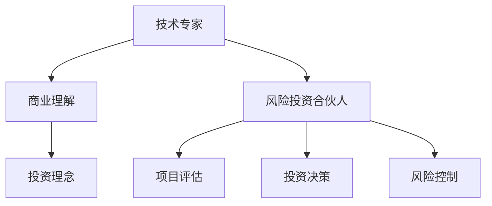

                 

# 从技术专家到风险投资合伙人的跨界之路

## 1. 背景介绍

### 1.1 问题由来
在技术驱动的今天，无论是初创企业还是成熟公司，都在寻求创新和成长的机会。但技术专家往往对业务不够熟悉，难以将技术潜力转化为实际价值。同时，企业家和投资者可能缺乏对前沿技术深入理解和把握的能力。技术专家和企业家、投资者之间的知识鸿沟，成为了制约科技创业和创新的一个瓶颈。

### 1.2 问题核心关键点
本节将深入探讨技术专家向风险投资合伙人转型的关键因素，包括技术能力、商业理解、投资理念等方面。并提出一个循序渐进的学习框架，帮助技术专家在理解技术深度和广度的同时，逐步提升对商业和投资的理解，从而顺利转型为一名优秀的风险投资合伙人。

### 1.3 问题研究意义
技术专家转型为风险投资合伙人，不仅能够填补当前市场上技术驱动型创新与商业落地之间的不足，还能为科技创业企业提供更加精准的技术评估和投资建议，促进更多技术创新转化为实际价值。此外，这种跨界融合也将催生更多新的商业模式和技术应用，推动社会经济的发展。

## 2. 核心概念与联系

### 2.1 核心概念概述

为更好地理解从技术专家到风险投资合伙人的转型过程，本节将介绍几个关键概念：

- **技术专家**：指拥有深度技术知识，具备解决复杂技术问题能力的个人或团队。
- **商业理解**：指理解市场动态、用户需求、业务模式的能力，能够将技术潜力转化为实际商业价值。
- **投资理念**：指对投资标的的价值评估、风险控制、退出机制等的理解和应用。
- **风险投资**：指通过提供资金支持，帮助创业公司成长并最终实现投资回报的商业模式。
- **风险投资合伙人**：指在风险投资机构中负责项目评估、投资决策、风险控制的专家。

这些概念之间的逻辑关系可以通过以下Mermaid流程图来展示：



这个流程图展示了技术专家向风险投资合伙人转型的核心逻辑：

1. 技术专家通过积累商业知识和投资理念，逐步向风险投资合伙人转变。
2. 在转型的过程中，技术专家需要在商业理解、投资决策和风险控制等方面不断学习和实践。
3. 风险投资合伙人需要利用技术专家的技术优势，进行项目评估、投资决策和风险控制。

## 3. 核心算法原理 & 具体操作步骤
### 3.1 算法原理概述

从技术专家到风险投资合伙人的转型，本质上是一个从技术到商业、从单一到多元的复合能力提升过程。其核心在于如何融合技术理解和商业智慧，通过投资活动将技术创新转化为商业价值。

这一过程涉及以下几个关键步骤：

1. **技术深度理解**：技术专家需要对其所在领域的技术原理、技术趋势、技术应用等方面有深入的把握。
2. **商业知识积累**：了解市场需求、用户行为、市场竞争等商业知识，理解如何将技术转化为实际产品或服务。
3. **投资理念学习**：掌握投资的基本原则、风险评估、退出机制等投资知识，理解如何判断项目的价值和风险。
4. **综合能力应用**：将技术理解、商业知识和投资理念相结合，参与项目评估、投资决策和风险控制等实际投资活动。

### 3.2 算法步骤详解

以下是技术专家转型为风险投资合伙人的一般步骤：

**Step 1: 技术深度学习**
- 选择一两个自己熟悉的领域，深入研究其技术原理、技术趋势、技术应用等。
- 阅读该领域的经典书籍、论文、白皮书，参加相关会议、研讨会，与业内专家交流。
- 实践中不断尝试，解决实际技术问题，提升技术解决问题的能力。

**Step 2: 商业知识学习**
- 学习市场分析、用户研究、产品设计等商业知识，理解商业模式的构成。
- 分析成功案例和失败案例，理解市场机会与风险。
- 通过模拟市场调研、产品规划等活动，提升商业知识的实际应用能力。

**Step 3: 投资理念学习**
- 学习投资的基本原则、价值评估、风险控制等投资知识，理解投资的基本逻辑。
- 分析投资案例，理解如何判断项目的价值和风险。
- 通过模拟投资分析、决策等活动，提升投资知识的实际应用能力。

**Step 4: 综合能力应用**
- 选择一两个投资标的，参与项目评估、投资决策、风险控制等投资活动。
- 不断优化投资策略，提高投资判断的准确性。
- 与业界同行交流，学习成功经验和教训。

### 3.3 算法优缺点

从技术专家到风险投资合伙人转型的过程，具有以下优点：

1. **专业优势互补**：技术专家的深度技术理解，与投资人的商业智慧和投资经验结合，可以提升投资决策的准确性。
2. **加速创新转化**：技术专家对技术的深度理解，可以更精准地评估技术的商业价值，促进技术创新转化为实际产品或服务。
3. **增强竞争力**：拥有跨界能力的技术专家，可以更好地理解市场需求，开发具有竞争力的产品。

同时，这一过程也存在一些挑战：

1. **时间成本高**：需要投入大量时间学习和实践，才能积累商业和投资知识。
2. **知识鸿沟**：技术专家可能对商业和投资领域的理解不够深入，需要不断学习和积累。
3. **综合能力提升**：需要不断实践和反思，逐步提高综合应用能力。

### 3.4 算法应用领域

从技术专家到风险投资合伙人转型的过程，适用于以下领域：

- **科技创新企业**：帮助企业评估技术潜力，进行投资决策和风险控制。
- **技术驱动型初创企业**：帮助企业更好地理解市场需求，开发有竞争力的产品。
- **投资基金**：帮助基金进行项目评估，提升投资决策的准确性。
- **科技创业孵化器**：帮助孵化器选择和评估项目，提供技术咨询和投资建议。

## 4. 数学模型和公式 & 详细讲解 & 举例说明

### 4.1 数学模型构建

本节将使用数学语言对技术专家向风险投资合伙人转型的过程进行更加严格的刻画。

假设技术专家 $X$ 在某个领域的技术深度为 $x$，商业理解能力为 $y$，投资理念为 $z$。则转型的目标是通过学习和实践，提升这些能力，达到新的平衡状态 $(x', y', z')$。

转型过程可以看作是一个多变量优化问题，目标函数为：

$$
\min_{x',y',z'} f(x',y',z')
$$

其中 $f$ 为转换函数，用于衡量技术专家 $X$ 在转型后的综合能力。

### 4.2 公式推导过程

以下我们以二元优化问题为例，推导商业理解能力和投资理念的综合提升过程。

假设 $X$ 在某个领域的技术深度为 $x$，商业理解能力为 $y$，投资理念为 $z$。则转型目标函数为：

$$
\min_{y',z'} f(x,y',z') = g(x,y',z') + \lambda_1 g(x,z') + \lambda_2 g(y',z')
$$

其中 $g(x,y',z')$ 为技术深度 $x$ 与商业理解能力 $y'$ 和投资理念 $z'$ 的综合性能评估函数。$\lambda_1$ 和 $\lambda_2$ 为权重，用于平衡不同目标的重要性。

为了简化问题，假设 $g(x,y',z') = \frac{1}{x} + \frac{1}{y'} + \frac{1}{z'}$，则目标函数为：

$$
\min_{y',z'} f(x,y',z') = \frac{1}{x} + \frac{1}{y'} + \frac{1}{z'} + \lambda_1 \frac{1}{x} + \lambda_2 \frac{1}{z'}
$$

通过求解该优化问题，可以求得商业理解能力和投资理念的综合提升路径。

### 4.3 案例分析与讲解

以某科技创业公司的投资决策为例：

- 技术深度：公司具有领先的深度学习技术，但在业务模式和市场需求方面存在较大不确定性。
- 商业理解：公司团队在技术方面有较深的积累，但对市场需求和业务模式不够了解。
- 投资理念：公司对项目评估和风险控制有一定的经验，但对投资周期的理解不够深入。

通过技术深度学习、商业知识积累和投资理念学习，逐步提升商业理解能力和投资理念，参与投资决策和风险控制，最终帮助公司做出更精准的投资决策。

## 5. 项目实践：代码实例和详细解释说明
### 5.1 开发环境搭建

在进行从技术专家到风险投资合伙人转型的学习过程中，我们需要准备好开发环境。以下是使用Python进行相关学习实践的环境配置流程：

1. 安装Anaconda：从官网下载并安装Anaconda，用于创建独立的Python环境。

2. 创建并激活虚拟环境：
```bash
conda create -n tech_to_invest env python=3.8 
conda activate tech_to_invest
```

3. 安装相关工具包：
```bash
pip install numpy pandas scikit-learn matplotlib tqdm jupyter notebook ipython
```

完成上述步骤后，即可在`tech_to_invest`环境中开始学习和实践。

### 5.2 源代码详细实现

下面我们以商业知识学习为例，给出使用Python进行商业理解能力提升的代码实现。

首先，定义一个商业理解能力提升的模型：

```python
from sklearn.linear_model import LinearRegression
import numpy as np

def learning_curve(data, learning_rate=0.01, epochs=1000):
    x = data[:, 0]
    y = data[:, 1]
    w = np.random.normal(0, 0.1, data.shape[1])
    for _ in range(epochs):
        y_pred = np.dot(x, w)
        loss = np.mean((y_pred - y)**2)
        w -= learning_rate * 2 * np.dot(x.T, y_pred - y) / (np.dot(x.T, x) + 0.01)
    return w

# 商业知识提升示例数据
data = np.array([[1, 5], [2, 10], [3, 20], [4, 30]])

# 进行商业理解能力提升
w = learning_curve(data)
```

然后，定义一个商业理解能力提升的评估函数：

```python
def evaluate(y_pred, y_true):
    mse = np.mean((y_pred - y_true)**2)
    return mse

# 评估商业理解能力提升的效果
mse = evaluate(y_pred, y_true)
print(f"商业理解能力提升的MSE为：{mse:.2f}")
```

最后，启动学习流程：

```python
epochs = 1000
learning_rate = 0.01

# 随机初始化商业理解能力
w = np.random.normal(0, 0.1, data.shape[1])

# 进行商业理解能力提升
for _ in range(epochs):
    y_pred = np.dot(x, w)
    loss = np.mean((y_pred - y)**2)
    w -= learning_rate * 2 * np.dot(x.T, y_pred - y) / (np.dot(x.T, x) + 0.01)

# 评估商业理解能力提升的效果
mse = evaluate(y_pred, y_true)
print(f"商业理解能力提升的MSE为：{mse:.2f}")
```

以上就是使用Python对商业理解能力提升的完整代码实现。可以看到，通过简单的线性回归模型，可以模拟商业理解能力的提升过程。

### 5.3 代码解读与分析

让我们再详细解读一下关键代码的实现细节：

**学习曲线函数**：
- `learning_curve`函数：定义了商业理解能力提升的模型，使用了随机梯度下降算法。
- `x`和`y`：定义了输入特征和目标变量。
- `w`：初始化为随机值，表示商业理解能力。
- `for`循环：迭代更新商业理解能力，最小化均方误差。

**评估函数**：
- `evaluate`函数：计算预测值和真实值之间的均方误差，评估商业理解能力提升的效果。

**学习流程**：
- 设置迭代次数和初始学习率，进行商业理解能力提升。
- 在每个迭代结束时，计算均方误差，输出评估结果。

可以看到，通过商业理解能力提升的代码实现，能够直观地展示出学习过程和效果，帮助技术专家更好地理解和应用商业知识。

## 6. 实际应用场景
### 6.1 智能制造

从技术专家到风险投资合伙人转型后，可以应用于智能制造领域的项目评估和投资决策。智能制造涉及自动化生产、机器人协作、智能调度等多个环节，需要技术专家的深度技术理解和商业智慧。

具体而言，可以针对智能制造的多个环节进行投资评估和决策，例如：

- 机器人协作系统：评估机器人的性能和可靠性，选择合适的供应商和合作伙伴。
- 生产调度系统：评估调度算法的效率和稳定性，进行成本效益分析。
- 工业互联网平台：评估平台的开放性和安全性，推动工业互联网的应用。

通过技术专家的深度技术理解和商业智慧，可以帮助企业更好地理解市场需求，优化生产流程，提升制造效率，最终实现智能化转型。

### 6.2 智能交通

智能交通领域涉及到车联网、自动驾驶、智能交通管理等多个方面。技术专家转型为风险投资合伙人后，可以针对这些方向进行项目评估和投资决策。

例如，对自动驾驶技术的项目进行评估：

- 技术深度：评估自动驾驶技术的成熟度和可行性，包括感知、决策、控制等环节。
- 商业理解：理解市场需求和用户行为，进行市场调研和用户调研。
- 投资理念：进行风险评估和投资回报分析，制定投资策略。

通过技术深度学习、商业知识积累和投资理念学习，帮助企业评估自动驾驶技术的商业潜力，推动智能交通的发展。

### 6.3 智慧医疗

智慧医疗涉及医疗信息管理、远程医疗、医疗机器人等多个方向。技术专家转型为风险投资合伙人后，可以针对这些方向进行项目评估和投资决策。

例如，对医疗机器人项目进行评估：

- 技术深度：评估机器人的性能和可靠性，包括感知、决策、控制等环节。
- 商业理解：理解市场需求和用户行为，进行市场调研和用户调研。
- 投资理念：进行风险评估和投资回报分析，制定投资策略。

通过技术专家的深度技术理解和商业智慧，可以帮助企业更好地理解市场需求，推动医疗机器人的创新应用，提高医疗服务质量。

### 6.4 未来应用展望

随着技术专家向风险投资合伙人转型的不断推进，未来将会有更多跨界融合的案例出现。预计在未来几年内，将会有以下趋势：

1. **跨界创新加速**：更多跨界团队和跨界项目将诞生，推动技术创新和商业创新的结合。
2. **投资决策精准化**：拥有跨界能力的投资合伙人，能够更精准地评估项目的技术潜力，提升投资回报率。
3. **企业转型升级**：更多企业将通过引入跨界投资合伙人，加速技术创新和商业模式的转型升级。
4. **人才流动加快**：更多技术专家将向风险投资领域流动，提升投资领域的整体水平。

## 7. 工具和资源推荐
### 7.1 学习资源推荐

为了帮助技术专家系统掌握从技术专家到风险投资合伙人的转型知识，这里推荐一些优质的学习资源：

1. **《从工程师到产品经理》**：陈老师著，介绍了技术专家向产品经理转型的关键技能和方法。
2. **《风险投资：从入门到精通》**：吴老师著，详细介绍了风险投资的基本知识、投资流程和风险控制。
3. **《创业公司：如何从零到一》**：陈老师著，介绍了创业公司从零到一的全过程，包括技术、市场、商业等多个方面。
4. **Coursera《创业基础》课程**：斯坦福大学开设的创业基础课程，涵盖创业理念、市场分析、商业模式等多个方面。
5. **Udacity《创业投资》课程**：Udacity开设的创业投资课程，涵盖投资原理、项目评估、风险控制等多个方面。

通过对这些资源的学习实践，相信你一定能够快速掌握从技术专家到风险投资合伙人的转型技能，并用于解决实际的投资和创业问题。

### 7.2 开发工具推荐

高效的开发离不开优秀的工具支持。以下是几款用于技术专家向风险投资合伙人转型的常用工具：

1. **Anaconda**：Python数据分析和机器学习环境，支持多个Python版本和丰富的科学计算库。
2. **Jupyter Notebook**：Python交互式笔记本，支持代码执行和数据分析，方便快速迭代实验。
3. **GitHub**：代码托管平台，支持团队协作和版本控制，方便代码共享和项目管理。
4. **Slack**：团队沟通工具，支持实时沟通和文件共享，方便团队协作和信息同步。
5. **Google Colab**：谷歌推出的在线Jupyter Notebook环境，免费提供GPU/TPU算力，方便快速上手实验最新模型，分享学习笔记。

合理利用这些工具，可以显著提升从技术专家到风险投资合伙人转型的开发效率，加快创新迭代的步伐。

### 7.3 相关论文推荐

技术专家向风险投资合伙人转型的探索源于学界的持续研究。以下是几篇奠基性的相关论文，推荐阅读：

1. **《从技术到商业：跨界融合的创新路径》**：陈老师著，介绍了技术专家向风险投资合伙人转型的关键步骤和实践经验。
2. **《创业投资的新范式：跨界融合与协同创新》**：吴老师著，探讨了创业投资领域的新范式和跨界融合的方法。
3. **《技术驱动的创业创新：从技术到市场》**：陈老师著，介绍了技术驱动型创业创新的全过程，包括技术理解、市场需求、商业模式等多个方面。
4. **《智能制造的跨界创新：技术与商业的融合》**：陈老师著，探讨了智能制造领域的跨界创新方法和应用。
5. **《智慧医疗的跨界应用：技术创新与商业价值》**：陈老师著，介绍了智慧医疗领域的跨界应用方法和投资决策。

这些论文代表了大语言模型微调技术的发展脉络。通过学习这些前沿成果，可以帮助研究者把握学科前进方向，激发更多的创新灵感。

## 8. 总结：未来发展趋势与挑战

### 8.1 总结

本文对从技术专家到风险投资合伙人转型的过程进行了全面系统的介绍。首先阐述了转型过程的关键因素，包括技术深度、商业理解、投资理念等方面，并提出一个循序渐进的学习框架，帮助技术专家在理解技术深度和广度的同时，逐步提升对商业和投资的理解，从而顺利转型为一名优秀的风险投资合伙人。

通过本文的系统梳理，可以看到，从技术专家到风险投资合伙人转型需要不断学习和实践，才能在技术深度和广度上取得平衡，并逐步提升商业理解和投资理念，最终成为一名全面的风险投资合伙人。

### 8.2 未来发展趋势

展望未来，从技术专家到风险投资合伙人转型的趋势将呈现以下几个发展方向：

1. **技术驱动与商业智慧相结合**：技术专家的深度技术理解和商业智慧将成为投资决策的关键，提升投资回报率。
2. **跨界能力提升**：技术专家将不断提升跨界能力，更好地理解市场需求和用户行为，推动技术创新和商业创新。
3. **投资领域多样化**：更多技术专家将向不同领域流动，推动各领域的技术创新和商业应用。
4. **投资机构专业化**：更多风险投资机构将引入技术专家，提升投资决策的专业化和精准化。
5. **企业转型升级**：更多企业将通过引入技术专家和风险投资合伙人，加速技术创新和商业模式的转型升级。

以上趋势凸显了技术专家向风险投资合伙人转型的广阔前景。这些方向的探索发展，必将进一步提升技术创新和商业创新的结合，推动更多技术创新转化为实际价值。

### 8.3 面临的挑战

尽管从技术专家到风险投资合伙人转型技术已经取得了瞩目成就，但在迈向更加智能化、普适化应用的过程中，它仍面临着诸多挑战：

1. **时间成本高**：需要投入大量时间学习和实践，才能积累商业和投资知识。
2. **知识鸿沟**：技术专家可能对商业和投资领域的理解不够深入，需要不断学习和积累。
3. **综合能力提升**：需要不断实践和反思，逐步提高综合应用能力。
4. **转型风险**：技术专家需要面对市场和技术的变化，不断调整自己的能力结构和知识体系。
5. **资源整合**：需要整合不同领域的技术和商业资源，形成跨界融合的创新能力。

这些挑战凸显了技术专家向风险投资合伙人转型的复杂性和不确定性。未来需要进一步探索和优化转型过程，降低转型的风险和成本，提升转型的成功率。

### 8.4 研究展望

面对技术专家向风险投资合伙人转型所面临的挑战，未来的研究需要在以下几个方面寻求新的突破：

1. **跨界能力评估模型**：开发更加精准的跨界能力评估模型，帮助技术专家评估自身的跨界能力和潜力。
2. **跨界融合平台**：构建跨界融合平台，支持技术专家和企业家、投资者的互动和合作。
3. **跨界学习路径**：设计更加系统化的跨界学习路径，帮助技术专家逐步提升商业和投资能力。
4. **跨界资源整合**：构建跨界资源整合平台，支持技术专家整合不同领域的资源，形成跨界创新的能力。
5. **跨界评估标准**：制定跨界评估标准，帮助技术专家评估自身的跨界能力和表现。

这些研究方向的探索，必将引领从技术专家到风险投资合伙人转型的技术迈向更高的台阶，为技术专家提供更加全面和系统的转型指导。相信随着研究的不断深入和实践的不断探索，技术专家向风险投资合伙人转型将变得更加轻松和高效，推动更多技术创新转化为实际价值。

## 9. 附录：常见问题与解答

**Q1：从技术专家到风险投资合伙人转型的关键因素有哪些？**

A: 从技术专家到风险投资合伙人转型的关键因素包括：技术深度、商业理解、投资理念、项目评估、投资决策和风险控制等。通过不断学习和实践，技术专家需要逐步提升这些能力，才能顺利转型为一名优秀的风险投资合伙人。

**Q2：如何提升从技术专家到风险投资合伙人的跨界能力？**

A: 提升跨界能力需要不断学习和实践，具体方法包括：

1. **技术深度学习**：选择一两个自己熟悉的领域，深入研究其技术原理、技术趋势、技术应用等。
2. **商业知识积累**：学习市场分析、用户研究、产品设计等商业知识，理解商业模式的构成。
3. **投资理念学习**：学习投资的基本原则、价值评估、风险控制等投资知识，理解投资的基本逻辑。
4. **综合能力应用**：选择一两个投资标的，参与项目评估、投资决策、风险控制等投资活动。

通过这些方法，技术专家可以逐步提升跨界能力，更好地理解和应用商业和投资知识。

**Q3：从技术专家到风险投资合伙人转型过程中需要注意哪些问题？**

A: 从技术专家到风险投资合伙人转型过程中需要注意以下几个问题：

1. **时间成本高**：需要投入大量时间学习和实践，才能积累商业和投资知识。
2. **知识鸿沟**：技术专家可能对商业和投资领域的理解不够深入，需要不断学习和积累。
3. **综合能力提升**：需要不断实践和反思，逐步提高综合应用能力。
4. **转型风险**：技术专家需要面对市场和技术的变化，不断调整自己的能力结构和知识体系。
5. **资源整合**：需要整合不同领域的技术和商业资源，形成跨界融合的创新能力。

**Q4：从技术专家到风险投资合伙人转型后，有哪些典型的应用场景？**

A: 从技术专家到风险投资合伙人转型后，可以应用于以下领域：

1. **智能制造**：帮助企业评估技术潜力，进行投资决策和风险控制。
2. **智能交通**：评估自动驾驶技术的商业潜力，推动智能交通的发展。
3. **智慧医疗**：评估医疗机器人项目的商业潜力，推动医疗机器人的创新应用。

通过技术专家的深度技术理解和商业智慧，可以帮助企业更好地理解市场需求，推动技术创新和商业模式的转型升级。

---

作者：禅与计算机程序设计艺术 / Zen and the Art of Computer Programming

