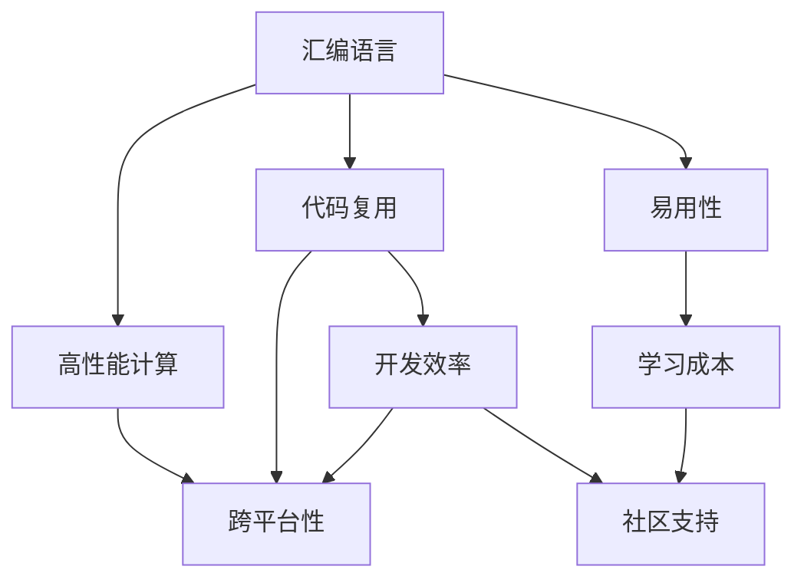

                 

# 从汇编到Python：AI开发中的编程语言选择

> 关键词：AI开发,编程语言选择,汇编语言,Python,混合编程,代码复用,低级语言,高级语言,效率优化,易用性

## 1. 背景介绍

### 1.1 问题由来
在AI开发中，编程语言的选择是一个令人困扰的问题。开发人员必须权衡性能、易用性、社区支持等因素，以确定最适合其需求的编程语言。本文将探讨从汇编到Python的编程语言选择问题，探讨在不同AI开发场景下如何选择最合适的语言。

### 1.2 问题核心关键点
在AI开发中，编程语言的选择需要考虑多个因素，包括但不限于：
- **性能**：某些AI任务需要极高的计算性能，例如深度学习和计算机视觉任务。
- **易用性**：某些任务需要快速迭代，简单易用的编程语言可以显著提高开发效率。
- **社区支持**：丰富的社区资源和开源工具可以加速开发进程，降低学习成本。
- **代码复用**：能够在不同任务之间共享代码的编程语言可以减少开发时间和成本。
- **硬件支持**：某些编程语言可以在特定硬件（如GPU、TPU）上实现高效的并行计算。

## 2. 核心概念与联系

### 2.1 核心概念概述

在AI开发中，编程语言的选择是一个复杂的问题，涉及多个层面的考量。以下是几个核心概念及其相互关系：

- **汇编语言**：一种直接访问硬件的低级编程语言，具有极高的性能，但编写和维护难度大，适用范围有限。
- **Python**：一种高级编程语言，具有易用性高、社区支持丰富等优势，但性能通常低于汇编语言。
- **混合编程**：结合低级语言和高级语言的优势，利用低级语言的性能和高级语言的易用性，实现高效的AI开发。

这些概念之间的关系可以通过以下Mermaid流程图来展示：



该流程图展示了不同编程语言的特点及其在AI开发中的作用。汇编语言具有高性能和代码复用性，但易用性和社区支持较差。Python具有易用性和社区支持丰富，但性能较差。混合编程结合了两种语言的优点，可以实现高性能和易用性的平衡。

## 3. 核心算法原理 & 具体操作步骤
### 3.1 算法原理概述

在AI开发中，编程语言的选择主要基于性能和易用性的权衡。以下是几种常见的编程语言及其在AI开发中的优势和劣势：

- **汇编语言**：
  - **优势**：高性能、可访问硬件、代码复用性好。
  - **劣势**：易用性差、学习成本高、开发周期长。

- **Python**：
  - **优势**：易用性好、社区支持丰富、开发效率高。
  - **劣势**：性能相对较低、内存占用较大。

- **C++**：
  - **优势**：性能优秀、可以与Python混合使用。
  - **劣势**：学习成本高、开发复杂、社区相对较小。

- **Rust**：
  - **优势**：性能优秀、内存安全、并发能力强。
  - **劣势**：学习成本高、开发复杂、社区较小。

### 3.2 算法步骤详解

选择编程语言的过程可以分为以下几个步骤：

1. **需求分析**：明确AI任务的需求，包括性能要求、开发时间、易用性等。
2. **语言选择**：根据需求分析结果，选择适合的编程语言。
3. **实施开发**：根据选择的编程语言进行AI模型开发和优化。
4. **性能测试**：对开发出的模型进行性能测试，评估其满足需求的程度。
5. **迭代优化**：根据测试结果，对模型和代码进行优化，直到满足需求。

### 3.3 算法优缺点

不同编程语言在AI开发中的优缺点如下：

- **汇编语言**：
  - **优点**：性能极高、适合需要高性能计算的任务。
  - **缺点**：易用性差、学习成本高、开发周期长。

- **Python**：
  - **优点**：易用性好、开发效率高、社区支持丰富。
  - **缺点**：性能相对较低、内存占用较大。

- **C++**：
  - **优点**：性能优秀、可以与Python混合使用。
  - **缺点**：学习成本高、开发复杂、社区相对较小。

- **Rust**：
  - **优点**：性能优秀、内存安全、并发能力强。
  - **缺点**：学习成本高、开发复杂、社区较小。

### 3.4 算法应用领域

编程语言的选择在不同AI应用领域中的具体应用如下：

- **深度学习**：
  - **汇编语言**：适用于需要极高性能的深度学习模型训练和推理。
  - **Python**：适用于深度学习模型的开发和调试。

- **计算机视觉**：
  - **C++**：适用于需要高性能计算的计算机视觉任务，如图像处理、目标检测。
  - **Python**：适用于计算机视觉任务的开发和调试。

- **自然语言处理**：
  - **Rust**：适用于需要高性能计算的自然语言处理任务，如大规模语言模型训练。
  - **Python**：适用于自然语言处理任务的开发和调试。

## 4. 数学模型和公式 & 详细讲解 & 举例说明

### 4.1 数学模型构建

在AI开发中，编程语言的选择需要考虑数学模型的计算需求。以下是几种常见的数学模型及其计算需求：

- **线性回归**：
  - **计算需求**：线性代数计算、矩阵乘法。
  - **编程语言选择**：Python，因为Python有丰富的线性代数库，如NumPy和SciPy。

- **卷积神经网络**：
  - **计算需求**：大量矩阵乘法和卷积操作。
  - **编程语言选择**：C++或Python，C++可以实现高性能计算，Python可以实现快速迭代开发。

- **深度学习模型**：
  - **计算需求**：大量矩阵乘法、梯度计算。
  - **编程语言选择**：C++或Python，C++可以实现高性能计算，Python可以实现快速迭代开发。

### 4.2 公式推导过程

以线性回归模型为例，其数学模型为：

$$
\hat{y} = \theta_0 + \theta_1x_1 + \theta_2x_2 + \ldots + \theta_nx_n
$$

其中，$\theta_0, \theta_1, \ldots, \theta_n$ 为模型参数，$x_1, x_2, \ldots, x_n$ 为输入特征，$\hat{y}$ 为模型输出。

线性回归模型的梯度下降优化公式为：

$$
\theta_k = \theta_k - \eta \frac{\partial}{\partial \theta_k} \frac{1}{2m} \sum_{i=1}^m (y_i - \hat{y}_i)^2
$$

其中，$\eta$ 为学习率，$m$ 为样本数量。

### 4.3 案例分析与讲解

以TensorFlow为例，分析其编程语言的混合使用。

TensorFlow 是一个开源的机器学习框架，使用C++实现底层计算，同时提供Python接口，方便用户进行模型开发和调试。C++的底层计算可以提供极高的性能，Python的高级接口可以提供快速迭代开发。

## 5. 项目实践：代码实例和详细解释说明

### 5.1 开发环境搭建

在进行AI开发前，需要准备好开发环境。以下是使用Python进行TensorFlow开发的环境配置流程：

1. 安装Anaconda：从官网下载并安装Anaconda，用于创建独立的Python环境。
2. 创建并激活虚拟环境：
```bash
conda create -n tensorflow-env python=3.8 
conda activate tensorflow-env
```
3. 安装TensorFlow：根据CUDA版本，从官网获取对应的安装命令。例如：
```bash
conda install tensorflow -c tensorflow -c conda-forge
```

4. 安装各类工具包：
```bash
pip install numpy pandas scikit-learn matplotlib tqdm jupyter notebook ipython
```

完成上述步骤后，即可在`tensorflow-env`环境中开始TensorFlow项目开发。

### 5.2 源代码详细实现

以下是使用TensorFlow进行线性回归模型开发的PyTorch代码实现：

```python
import tensorflow as tf
import numpy as np

# 创建数据集
x_data = np.array([[1.0], [2.0], [3.0], [4.0]])
y_data = np.array([[2.0], [4.0], [6.0], [8.0]])

# 定义模型
def linear_regression(x):
    W = tf.Variable(tf.random.normal([1]))
    b = tf.Variable(tf.zeros([1]))
    y_pred = W * x + b
    return y_pred

# 定义损失函数
def mean_squared_error(y_true, y_pred):
    loss = tf.reduce_mean(tf.square(y_true - y_pred))
    return loss

# 定义优化器
optimizer = tf.optimizers.SGD(learning_rate=0.01)

# 训练模型
for epoch in range(1000):
    with tf.GradientTape() as tape:
        y_pred = linear_regression(x_data)
        loss = mean_squared_error(y_data, y_pred)
    gradients = tape.gradient(loss, [W, b])
    optimizer.apply_gradients(zip(gradients, [W, b]))
```

### 5.3 代码解读与分析

让我们再详细解读一下关键代码的实现细节：

**创建数据集**：
- 使用NumPy创建输入特征`x_data`和目标值`y_data`。

**定义模型**：
- 使用TensorFlow定义线性回归模型。

**定义损失函数**：
- 使用TensorFlow定义均方误差损失函数。

**定义优化器**：
- 使用TensorFlow定义随机梯度下降优化器。

**训练模型**：
- 在每个epoch中，计算损失函数和梯度，并使用优化器更新模型参数。

**运行结果展示**：
- 训练完成后，可以使用`y_pred`和`y_data`计算模型的均方误差。

可以看到，TensorFlow通过混合使用C++和Python，可以高效地实现线性回归模型的开发和训练。开发者可以将更多精力放在模型设计、算法优化等高层逻辑上，而不必过多关注底层的实现细节。

## 6. 实际应用场景

### 6.1 智能推荐系统

智能推荐系统是AI开发中的典型应用场景之一。基于深度学习模型的推荐系统可以通过混合编程语言实现高性能和易用性的平衡。

在实践中，可以使用C++实现模型的底层计算，如卷积神经网络、注意力机制等，同时使用Python实现模型的开发和调试。这样的混合编程方法可以充分利用C++的性能优势，同时保持Python的易用性和快速迭代开发。

### 6.2 医疗影像分析

医疗影像分析是另一个典型的AI应用场景。由于医疗影像数据量巨大，计算需求高，因此可以使用汇编语言实现底层计算。

在实践中，可以使用汇编语言实现卷积神经网络模型，同时使用Python实现模型的开发和调试。这种混合编程方法可以充分利用汇编语言的性能优势，同时保持Python的易用性和快速迭代开发。

### 6.3 金融风险评估

金融风险评估是另一个需要高性能计算的AI应用场景。由于金融数据需要实时处理，因此可以使用C++实现底层计算。

在实践中，可以使用C++实现卷积神经网络模型，同时使用Python实现模型的开发和调试。这种混合编程方法可以充分利用C++的性能优势，同时保持Python的易用性和快速迭代开发。

### 6.4 未来应用展望

随着AI技术的不断发展，编程语言的选择将变得更加多样化。未来的AI开发可能会更多地使用混合编程语言，结合低级语言和高级语言的优势，实现高性能和易用性的平衡。

## 7. 工具和资源推荐

### 7.1 学习资源推荐

为了帮助开发者系统掌握AI开发中的编程语言选择问题，这里推荐一些优质的学习资源：

1. 《Python深度学习》：通过实际案例讲解Python在AI开发中的广泛应用。
2. 《深度学习》：斯坦福大学开设的深度学习课程，讲解深度学习模型的数学基础和实现方法。
3. 《C++编程语言》：经典C++教材，讲解C++的基本语法和高级特性。
4. 《Rust语言设计与哲学》：讲解Rust的设计理念和编程风格，适合想要深入学习Rust的开发者。

通过对这些资源的学习实践，相信你一定能够快速掌握AI开发中的编程语言选择问题，并用于解决实际的AI问题。

### 7.2 开发工具推荐

高效的开发离不开优秀的工具支持。以下是几款用于AI开发中编程语言选择的常用工具：

1. PyTorch：基于Python的深度学习框架，灵活动态的计算图，适合快速迭代研究。
2. TensorFlow：由Google主导开发的开源深度学习框架，生产部署方便，适合大规模工程应用。
3. PyTorch Lightning：基于PyTorch的轻量级框架，简化模型训练流程。
4. TensorFlow Extended (TFX)：Google的端到端机器学习平台，包括数据管道、模型构建、部署等环节。
5. VS Code：轻量级的代码编辑器，支持多种编程语言，适合混合编程开发。
6. Jupyter Notebook：交互式编程环境，支持Python和C++等多种编程语言，适合混合编程开发。

合理利用这些工具，可以显著提升AI开发的效率，加快创新迭代的步伐。

### 7.3 相关论文推荐

AI开发中的编程语言选择问题是一个持续研究的热点，以下是几篇奠基性的相关论文，推荐阅读：

1. 《TensorFlow: A System for Large-Scale Machine Learning》：介绍TensorFlow的架构和应用。
2. 《A Survey of Machine Learning in Python》：介绍Python在机器学习中的广泛应用。
3. 《C++ High Performance Programs》：讲解C++在高性能计算中的应用。
4. 《Rust for System Programmers》：讲解Rust在操作系统和系统编程中的应用。
5. 《The Use of High-Performance Languages in Machine Learning》：讨论不同编程语言在机器学习中的选择和使用。

这些论文代表了大语言模型微调技术的发展脉络。通过学习这些前沿成果，可以帮助研究者把握学科前进方向，激发更多的创新灵感。

## 8. 总结：未来发展趋势与挑战

### 8.1 总结

本文对AI开发中的编程语言选择问题进行了全面系统的介绍。首先阐述了汇编语言、Python等编程语言的特点及其在AI开发中的应用，明确了混合编程语言的优缺点。其次，从原理到实践，详细讲解了混合编程语言的算法原理和操作步骤，给出了混合编程语言的代码实例。同时，本文还探讨了混合编程语言在不同AI应用场景中的应用，展示了混合编程语言的巨大潜力。最后，本文推荐了多种学习资源、开发工具和相关论文，帮助开发者系统掌握AI开发中的编程语言选择问题。

通过本文的系统梳理，可以看到，混合编程语言在大语言模型微调技术中的应用前景广阔，可以结合不同编程语言的优点，实现高效、易用的AI开发。未来，伴随着混合编程语言的不断发展，相信AI开发会变得更加高效、灵活，为人工智能技术的落地应用提供更坚实的技术基础。

### 8.2 未来发展趋势

展望未来，混合编程语言在大语言模型微调技术中的应用将呈现以下几个发展趋势：

1. **混合编程的普及**：随着混合编程语言的不断发展和完善，混合编程将被广泛应用于AI开发，成为主流范式。
2. **编程语言的融合**：未来的混合编程语言将更加注重语言的融合和互操作性，提供更加便捷的开发环境。
3. **编译器的优化**：编译器将在混合编程语言中扮演更重要的角色，优化代码的性能和可读性。
4. **云计算的支持**：云计算平台将提供混合编程语言的支持，提供高性能计算资源，加速AI开发。
5. **新编程语言的崛起**：新的编程语言将不断涌现，提供更好的性能、易用性和社区支持。

以上趋势凸显了混合编程语言的广阔前景，这些方向的探索发展，必将进一步提升AI开发的效率和质量，为人工智能技术的落地应用提供更坚实的技术基础。

### 8.3 面临的挑战

尽管混合编程语言在大语言模型微调技术中的应用已经取得了显著进展，但在迈向更加智能化、普适化应用的过程中，仍面临诸多挑战：

1. **编程语言的复杂性**：混合编程语言需要开发人员掌握多种编程语言，增加了开发难度和维护成本。
2. **代码的可移植性**：混合编程语言需要开发人员进行代码的重构和适配，增加了开发难度和维护成本。
3. **编译器的瓶颈**：编译器的性能和优化能力将直接影响混合编程语言的开发效率。
4. **生态系统的建设**：混合编程语言需要建立完整的生态系统，包括开发工具、库函数、社区支持等。
5. **性能的平衡**：在性能和易用性之间找到平衡，提供高效、易用的混合编程语言。

这些挑战需要开发人员、编译器开发人员和社区共同努力，逐步克服。只有从技术、生态、社区等多个维度协同发力，才能真正实现混合编程语言在AI开发中的广泛应用。

### 8.4 研究展望

未来的研究需要在以下几个方面寻求新的突破：

1. **编程语言的优化**：开发更加优化、高效的混合编程语言，提供更好的性能和易用性。
2. **编译器的优化**：开发更加优化、高效的编译器，提高混合编程语言的开发效率。
3. **代码生成技术**：开发更加智能的代码生成技术，减少开发人员的工作量，提高开发效率。
4. **编程语言的融合**：开发更加融合、互操作性强的混合编程语言，提供更好的开发环境和用户体验。
5. **新编程语言的开发**：开发新的编程语言，提供更好的性能、易用性和社区支持。

这些研究方向的探索，必将引领混合编程语言技术迈向更高的台阶，为人工智能技术的落地应用提供更坚实的技术基础。

## 9. 附录：常见问题与解答

**Q1：汇编语言和Python的混合编程如何实现？**

A: 汇编语言和Python的混合编程可以通过使用不同的编程语言实现不同的计算任务。例如，使用C++实现模型的底层计算，如卷积神经网络、注意力机制等，同时使用Python实现模型的开发和调试。这样的混合编程方法可以充分利用C++的性能优势，同时保持Python的易用性和快速迭代开发。

**Q2：在混合编程中，Python和汇编语言各有哪些优势和劣势？**

A: 在混合编程中，Python和汇编语言各有其优势和劣势。Python的优势在于易用性好、开发效率高、社区支持丰富，但性能相对较低。汇编语言的劣势在于学习成本高、开发复杂、社区相对较小，但性能极高、适合需要高性能计算的任务。

**Q3：混合编程语言在实际应用中的使用场景有哪些？**

A: 混合编程语言在实际应用中的使用场景包括：深度学习、计算机视觉、自然语言处理、智能推荐系统、医疗影像分析、金融风险评估等。

**Q4：在混合编程中，如何选择编程语言？**

A: 在混合编程中，选择编程语言需要考虑任务的需求、性能要求、易用性、社区支持等因素。例如，对于需要高性能计算的任务，可以选择汇编语言或C++；对于需要快速迭代开发的任务，可以选择Python。

**Q5：混合编程语言的优势是什么？**

A: 混合编程语言的优势在于可以结合低级语言和高级语言的优势，实现高性能和易用性的平衡。低级语言可以提供高性能计算能力，高级语言可以提供易用性和快速迭代开发。

---

作者：禅与计算机程序设计艺术 / Zen and the Art of Computer Programming

