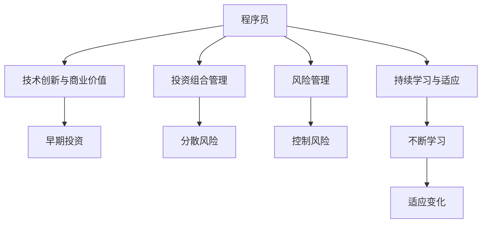

                 

# 从程序员到天使投资人的转变

在技术快速演进和商业环境日新月异的今天，程序员职业的边界正在不断拓展。程序员已经不再局限于传统的软件开发，而是逐渐向更高层次的领域延伸，其中最引人注目的是向天使投资人的转变。本文将深入探讨从程序员到天使投资人的转型之路，包括核心概念、算法原理、具体操作步骤，以及实际应用场景和未来展望。

## 1. 背景介绍

### 1.1 问题由来

程序员向天使投资人转型，是技术人才在职业发展中迈向更高层次的体现。这一转变不仅能够利用已有的技术能力和行业经验，更能在投资领域挖掘新的机会，为创新项目提供资金和方向。然而，这一转变也面临着从技术技能到商业判断的巨大跨越，以及从微观执行到宏观决策的重大调整。

### 1.2 问题核心关键点

这一转变的主要挑战包括：

1. **技术认知到商业理解的转变**：程序员通常具备深厚的技术背景，但缺乏对市场、用户需求和商业模式的深入理解。
2. **投资策略的制定**：了解不同行业、不同阶段企业的特点，制定有效的投资策略。
3. **风险管理和回报预期**：如何在保证投资安全的同时，获取合理的回报。
4. **投资组合管理**：如何构建多元化的投资组合，分散风险。
5. **持续学习和适应**：技术、市场和政策环境的变化，需要不断学习和适应。

### 1.3 问题研究意义

从程序员到天使投资人的转变，不仅是个人职业发展的重要里程碑，更是推动技术创新和产业发展的关键力量。转型后的技术人才能够以新的视角，为创业公司提供宝贵的技术指导和资源支持，加速技术转化为商业价值的过程。此外，投资领域的经验积累，也使得他们在未来有机会进一步发展为风险投资人或创业公司高管，实现职业生涯的全面提升。

## 2. 核心概念与联系

### 2.1 核心概念概述

为了更好地理解从程序员到天使投资人的转变过程，本节将介绍几个关键概念：

1. **程序员**：拥有计算机科学或相关领域背景，擅长软件开发、技术架构、算法实现等技术相关工作的专业人才。
2. **天使投资人**：提供早期投资，支持创业公司发展的投资者。天使投资通常以较小金额起步，但对早期项目有较高的期望。
3. **技术创新与商业价值**：如何将技术创新转化为商业价值，是转型过程中需要解决的核心问题。
4. **投资组合管理**：构建多元化投资组合，以降低风险，提高投资回报。
5. **风险管理**：评估和控制投资风险，确保投资回报的稳定性。
6. **持续学习与适应**：在不断变化的技术和市场环境中，持续学习和适应是必不可少的。

这些核心概念之间的逻辑关系可以通过以下Mermaid流程图来展示：



这个流程图展示了一些关键概念及其之间的关系：

1. 程序员通过技术创新找到商业价值，为创业公司提供技术支持。
2. 通过投资组合管理，分散风险，提高投资回报。
3. 风险管理确保投资的安全性。
4. 持续学习和适应是贯穿转型始终的重要环节。

## 3. 核心算法原理 & 具体操作步骤
### 3.1 算法原理概述

从程序员到天使投资人的转变，本质上是一种从技术领域向商业领域的跨越。这一过程涉及多个阶段，包括项目评估、投资决策、风险控制、投资组合管理等。

### 3.2 算法步骤详解

1. **项目评估**：
   - **初步筛选**：基于行业趋势、市场规模、团队背景等因素进行初步筛选。
   - **深度分析**：进行详细的市场调研、财务分析、技术评估等，确保项目具有可行性和潜力。

2. **投资决策**：
   - **投资策略制定**：确定投资方向、投资阶段、投资额度等。
   - **谈判条款**：制定投资条款，包括股份分配、董事会席位、反稀释条款等。

3. **风险控制**：
   - **风险评估**：评估项目的市场风险、技术风险、团队风险等。
   - **风险缓解**：制定风险缓解措施，如设定止损点、多元化投资组合等。

4. **投资组合管理**：
   - **多元化投资**：在不同的行业、不同的企业阶段、不同的地区等进行投资，分散风险。
   - **持续优化**：根据投资表现和市场变化，不断调整投资组合。

5. **持续学习和适应**：
   - **市场研究**：持续关注行业动态、技术发展、政策变化等，不断更新知识。
   - **经验积累**：总结投资经验，完善投资策略，提高投资决策的准确性。

### 3.3 算法优缺点

**优点**：

1. **双重优势**：利用技术背景和投资经验，能够更深入地理解项目，做出更准确的投资决策。
2. **灵活性强**：技术背景使得对新兴技术有较快的理解和适应能力，能够灵活应对市场变化。
3. **风险控制**：通过技术评估和风险管理，能够有效控制投资风险。

**缺点**：

1. **商业知识不足**：技术背景往往缺乏对市场、营销、管理等商业知识的深度理解。
2. **时间成本高**：从项目评估到投资决策再到风险控制，每一步都需要大量的时间和精力。
3. **心理压力大**：投资失败的可能性较高，心理承受压力较大。

### 3.4 算法应用领域

从程序员到天使投资人转型的关键在于找到技术创新与商业价值的结合点，这一过程在多个领域都有广泛的应用：

1. **科技创业**：利用技术背景，投资早期科技创业公司，推动技术转化为商业应用。
2. **新兴技术**：关注新兴技术趋势，投资相关初创公司，提前布局未来市场。
3. **传统行业转型**：利用技术优化传统行业，如利用AI、大数据等技术提升传统行业的效率和竞争力。
4. **社会创新**：投资与社会责任相关的项目，如可持续发展、环境保护等，推动社会创新。

## 4. 数学模型和公式 & 详细讲解 & 举例说明（备注：数学公式请使用latex格式，latex嵌入文中独立段落使用 $$，段落内使用 $)
### 4.1 数学模型构建

本节将使用数学语言对从程序员到天使投资人的转型过程进行更加严格的刻画。

记投资资金为 $F$，投资期为 $T$，假设每年投资的回报率为 $r$。则总投资的终值 $F_T$ 可以通过以下公式计算：

$$
F_T = F(1 + r)^T
$$

其中，$1 + r$ 为年复利因子，$T$ 为投资期（年）。

### 4.2 公式推导过程

假设初始投资金额为 $F_0$，投资期为 $T$，年回报率为 $r$，则每年的现金流 $C_t$ 为：

$$
C_t = F_0(1 + r)^{t - 1}
$$

其中 $t$ 为第 $t$ 年，$1 + r$ 为年复利因子。

投资期结束后，投资的总回报 $R$ 为所有现金流的现值之和：

$$
R = \sum_{t=1}^T C_t = F_0 \sum_{t=1}^T (1 + r)^{t - 1}
$$

通过求和公式，可进一步简化为：

$$
R = F_0 \frac{1 - (1 + r)^T}{1 - (1 + r)} = F_0 \frac{1 - (1 + r)^T}{r}
$$

通过上述公式，可以计算出投资的总回报 $R$。

### 4.3 案例分析与讲解

假设初始投资金额为 $F_0 = 100$ 万元，年回报率为 $r = 10\%$，投资期为 $T = 5$ 年，则总投资的终值为：

$$
F_T = 100(1 + 0.1)^5 = 161.05 \text{ 万元}
$$

这意味着，在上述假设条件下，5年后的投资总回报约为 $61.05$ 万元。

## 5. 项目实践：代码实例和详细解释说明
### 5.1 开发环境搭建

在进行项目实践前，我们需要准备好开发环境。以下是使用Python进行金融投资模型的环境配置流程：

1. 安装Anaconda：从官网下载并安装Anaconda，用于创建独立的Python环境。

2. 创建并激活虚拟环境：
```bash
conda create -n finance-env python=3.8 
conda activate finance-env
```

3. 安装必要的Python库：
```bash
pip install numpy pandas scipy scikit-learn statsmodels
```

4. 安装金融分析工具包：
```bash
conda install yfinance
```

5. 安装机器学习工具包：
```bash
pip install scikit-learn xgboost lightgbm catboost
```

完成上述步骤后，即可在`finance-env`环境中开始项目实践。

### 5.2 源代码详细实现

下面以一个简单的股票投资模型为例，给出使用Python进行金融投资决策的代码实现。

首先，导入必要的库和数据：

```python
import pandas as pd
import numpy as np
from sklearn.model_selection import train_test_split
from sklearn.linear_model import LogisticRegression
from sklearn.metrics import accuracy_score
import yfinance as yf

# 下载股票数据
ticker = yf.Ticker("AAPL")
data = ticker.history(period="1y")
```

然后，构建模型并进行训练：

```python
# 将数据集分为训练集和测试集
X = data['Close']
y = data['Open'] > data['Close']
X_train, X_test, y_train, y_test = train_test_split(X, y, test_size=0.2, random_state=42)

# 定义模型并拟合
model = LogisticRegression()
model.fit(X_train, y_train)
```

接着，进行模型评估：

```python
# 预测测试集
y_pred = model.predict(X_test)

# 计算准确率
accuracy = accuracy_score(y_test, y_pred)
print(f"模型准确率: {accuracy}")
```

最后，进行投资模拟：

```python
# 初始投资金额
initial_investment = 100000

# 设定年回报率
annual_return_rate = 0.1

# 计算5年后的投资总回报
final_investment = initial_investment * (1 + annual_return_rate)**5
print(f"5年后的投资总回报: {final_investment}")
```

### 5.3 代码解读与分析

让我们再详细解读一下关键代码的实现细节：

**股票数据下载**：
- 使用yfinance库下载指定股票的历史数据。

**数据处理**：
- 将数据集分为训练集和测试集。
- 定义模型并训练，这里使用逻辑回归模型。

**模型评估**：
- 使用测试集评估模型的准确率。

**投资模拟**：
- 设定初始投资金额和年回报率。
- 计算5年后的投资总回报。

可以看到，通过Python的金融分析库和机器学习库，能够方便地进行股票投资的模拟和评估。这为从程序员到天使投资人的转型提供了有力的技术支持。

当然，实际的金融投资决策涉及更多的因素，如市场动态、政策变化、企业经营状况等。以上代码仅为简单的案例演示，实际应用中需要结合更多的数据和分析方法。

## 6. 实际应用场景
### 6.1 金融行业投资

从程序员到天使投资人转型的一个重要应用场景是金融行业投资。传统的金融分析师通常需要丰富的金融知识和长期的经验积累，才能做出准确的投资决策。而利用编程技能和数据分析能力，可以更快速、更准确地进行市场分析和投资预测。

在技术实现上，可以借助量化交易、算法交易等技术，构建自动化的投资策略，提高投资效率和准确性。利用机器学习模型，可以挖掘历史数据中的规律，预测市场走势，从而做出更科学合理的投资决策。

### 6.2 科技创新投资

科技创新是推动社会进步和经济发展的关键力量。从程序员到天使投资人转型后，可以更深入地理解技术前沿，把握科技创新趋势，为初创科技公司提供投资支持。

在实际应用中，可以关注新兴技术如人工智能、区块链、量子计算等领域，投资相关初创公司，推动技术创新应用。利用编程技能和数据分析能力，能够更快速地评估技术创新项目的可行性和潜力，做出更准确的风险评估和投资决策。

### 6.3 社会公益投资

社会公益事业是社会责任的重要体现，能够推动社会进步和可持续发展。从程序员到天使投资人转型后，可以关注社会公益项目，投资于可持续发展、环境保护、教育扶贫等领域。

在技术实现上，可以利用大数据、人工智能等技术，挖掘社会公益项目的潜力，评估其社会效益和经济效益。通过投资支持，推动公益事业的发展，提升社会福祉。

### 6.4 未来应用展望

随着技术的发展和社会的进步，从程序员到天使投资人转型的应用场景将更加广泛。未来，这一转型将成为技术人才职业发展的重要方向，为更多行业带来创新和变革。

在智慧医疗领域，投资于基于AI的诊断和治疗技术，能够提升医疗服务的智能化水平，帮助医生进行更精准的诊断和治疗。

在智慧教育领域，投资于基于AI的教育平台和应用，能够提升教育资源的利用效率，实现个性化教育和因材施教。

在智慧城市治理中，投资于基于AI的智能交通、智能安防等应用，能够提升城市管理的智能化水平，构建更安全、高效的未来城市。

此外，在企业生产、社会治理、文娱传媒等众多领域，从程序员到天使投资人转型的技术人才，将不断拓展应用场景，为更多行业带来创新和变革。

## 7. 工具和资源推荐
### 7.1 学习资源推荐

为了帮助开发者系统掌握从程序员到天使投资人的转型之路，这里推荐一些优质的学习资源：

1. **《金融市场分析与量化投资》**：一本系统介绍金融市场分析和量化投资的经典书籍，适合编程和金融背景的读者。

2. **Coursera的《金融工程与风险管理》课程**：由耶鲁大学开设的在线课程，涵盖金融工程、风险管理、投资策略等内容，适合具备编程背景的读者。

3. **Kaggle**：一个数据科学竞赛平台，提供大量金融、科技、公益等领域的竞赛，通过实际项目锻炼投资决策能力。

4. **AngelList**：一个创业公司融资平台，能够了解不同行业的创业公司，进行投资实践。

5. **YCombinator**：一个知名的创业加速器，提供创业资源和网络，帮助投资者和创业者建立联系。

通过对这些资源的学习实践，相信你一定能够快速掌握从程序员到天使投资人的精髓，并用于解决实际的投资问题。

### 7.2 开发工具推荐

高效的开发离不开优秀的工具支持。以下是几款用于金融投资和科技创新项目开发的常用工具：

1. **Python**：作为编程语言，Python具有丰富的金融分析、机器学习和数据分析库，适合进行投资和科技项目开发。

2. **R**：作为统计分析语言，R具有强大的数据分析和可视化能力，适合进行金融分析和投资模拟。

3. **Tableau**：一个数据可视化工具，能够将复杂的数据转化为直观的图表，帮助进行市场分析和投资决策。

4. **Quandl**：一个金融数据平台，提供大量的金融数据和分析工具，适合进行市场研究和投资分析。

5. **GitHub**：一个代码托管平台，适合进行项目管理和版本控制，便于团队协作。

合理利用这些工具，可以显著提升从程序员到天使投资人的投资实践效率，加快创新迭代的步伐。

### 7.3 相关论文推荐

从程序员到天使投资人转型的研究涉及金融、科技、社会等多个领域，以下是几篇奠基性的相关论文，推荐阅读：

1. **《算法交易:从理论到实践》**：介绍算法交易的原理、策略和实现方法，适合技术背景的读者。

2. **《机器学习在金融中的应用》**：系统介绍机器学习在金融领域的各种应用，包括风险管理、投资策略、信用评估等。

3. **《金融市场中的行为经济学》**：探讨行为经济学在金融市场中的应用，分析人类行为对投资决策的影响。

4. **《科技创新的投资策略》**：介绍科技创新的投资策略和风险管理，适合科技和投资背景的读者。

5. **《社会责任投资》**：探讨社会责任投资的理论和实践，分析其在可持续发展、环境保护等领域的应用。

这些论文代表了大语言模型微调技术的发展脉络。通过学习这些前沿成果，可以帮助研究者把握学科前进方向，激发更多的创新灵感。

## 8. 总结：未来发展趋势与挑战
### 8.1 总结

本文对从程序员到天使投资人的转变过程进行了全面系统的介绍。首先阐述了这一转型的背景和意义，明确了转型过程中需要掌握的核心概念和关键步骤。其次，从原理到实践，详细讲解了转型的数学模型和操作步骤，给出了具体的代码实例和分析。同时，本文还广泛探讨了转型的实际应用场景和未来展望，展示了转型的广泛前景。

通过本文的系统梳理，可以看到，从程序员到天使投资人的转变，不仅是职业发展的重大跨越，更是技术创新和产业发展的关键动力。这一转型过程涉及技术、金融、社会等多个领域，要求不断学习和适应，同时也提供了广阔的发展空间和机遇。

### 8.2 未来发展趋势

展望未来，从程序员到天使投资人转型的发展趋势将呈现以下几个方向：

1. **跨界融合**：技术、金融、社会等领域的交叉融合将更加深入，投资者需要具备多学科的知识和技能。
2. **智能化升级**：借助大数据、人工智能等技术，进行更科学、更精准的投资决策。
3. **风险管理**：智能化和跨界融合将带来新的风险点，需要制定更有效的风险管理策略。
4. **全球化布局**：全球化经济环境下，投资者需要具备全球视野，进行跨国的投资布局。
5. **可持续发展**：投资于可持续发展、环境保护等领域，推动社会责任和可持续发展。

这些趋势凸显了从程序员到天使投资人转型的广阔前景。未来的投资者将不仅关注技术创新和投资回报，还将关注社会责任和可持续发展，实现多维度的价值最大化。

### 8.3 面临的挑战

尽管从程序员到天使投资人转型具有广阔的前景，但在迈向更高层次的过程中，仍然面临诸多挑战：

1. **跨界适应困难**：技术背景与金融、商业等领域的知识和技能存在较大差异，需要不断学习和适应。
2. **心理承受压力**：投资失败的可能性较高，需要具备较强的心理承受能力和风险管理能力。
3. **市场变化快**：金融市场和技术市场变化快，需要具备敏锐的市场洞察力和灵活的应变能力。
4. **资源投入大**：转型过程中需要大量的学习资源和实践机会，资源投入较大。
5. **法律合规风险**：投资活动涉及大量法律和合规问题，需要具备相关知识和技能。

这些挑战需要通过不断学习、积累经验、建立网络等方式，逐步克服。只有克服了这些挑战，才能真正实现从程序员到天使投资人的成功转型。

### 8.4 研究展望

未来的研究应在以下几个方向上寻求新的突破：

1. **多学科交叉研究**：推动技术、金融、社会等多个学科的交叉融合，提供更全面的知识体系。
2. **智能化投资系统**：开发更智能、更高效的投资系统，提高投资决策的准确性和效率。
3. **风险管理算法**：研究更有效的风险管理算法，降低投资风险。
4. **跨界合作平台**：搭建跨界合作平台，促进技术、金融、社会等领域的交流和合作。
5. **社会责任投资**：推动社会责任投资的发展，实现商业价值和社会价值的统一。

这些研究方向的探索，将引领从程序员到天使投资人转型的深入发展，为更多技术人才提供新的职业路径和广阔的发展空间。

## 9. 附录：常见问题与解答

**Q1: 从程序员到天使投资人转型是否需要具备金融背景？**

A: 虽然具备金融背景有助于理解金融市场和投资策略，但并不绝对。具备编程和数据分析能力，通过学习和实践，也可以掌握相关的金融知识和技能。

**Q2: 投资决策有哪些关键因素？**

A: 投资决策的关键因素包括市场趋势、行业前景、企业经营状况、团队背景、财务状况等。需要综合考虑这些因素，做出科学的投资决策。

**Q3: 如何评估投资项目的风险？**

A: 评估投资项目的风险需要考虑市场风险、技术风险、团队风险、财务风险等因素。可以通过数据分析、模型模拟等方式，进行全面的风险评估。

**Q4: 投资组合管理有哪些策略？**

A: 投资组合管理的策略包括多元化投资、风险分散、动态调整等。需要根据市场变化和投资目标，制定合理的投资策略。

**Q5: 从程序员到天使投资人转型需要多久？**

A: 转型时间因人而异，取决于个人学习能力、资源投入和实践机会。通常需要数年时间，不断学习和积累经验。

---

作者：禅与计算机程序设计艺术 / Zen and the Art of Computer Programming

