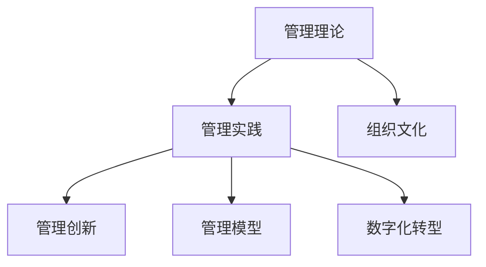

                 

# 从经典到实践：管理理论的落地

## 1. 背景介绍

### 1.1 问题由来
管理理论一直是组织管理和商业实践的核心指南，诸如泰勒的科学管理、韦伯的行政组织理论、马斯洛的需求层次理论等经典理论，至今仍然指导着各行各业的管理实践。然而，随着时代的发展，特别是数字化和互联网技术的普及，传统的管理理论是否依然适用，如何在实践中落地，成为当前管理学者和企业面临的重要课题。

### 1.2 问题核心关键点
管理理论的落地关键在于如何将抽象的理论和方法，转化为具体的管理实践，从而提升组织的效率、增强竞争力。这需要深入理解理论背后的原理和逻辑，同时结合企业的实际情况，进行创造性的应用。

### 1.3 问题研究意义
研究管理理论的落地，对于提升企业管理的科学性和系统性，提高员工的工作满意度和组织绩效，具有重要意义：

1. 提升管理科学性：将管理理论进行深入实践，能够帮助企业找到更为科学合理的管理方式，提高管理效率。
2. 增强组织竞争力：科学的管理实践能够带来更高的生产效率和创新能力，增强企业在市场中的竞争力。
3. 提高员工满意度：科学合理的管理措施能够营造良好的工作环境，提升员工的工作满意度和忠诚度。
4. 推动商业创新：管理理论的落地应用，能够帮助企业发现新的商业模式和业务机会，推动商业创新。

## 2. 核心概念与联系

### 2.1 核心概念概述

为更好地理解管理理论的落地实践，本节将介绍几个密切相关的核心概念：

- **管理理论**：包括科学管理、行为科学、系统管理、组织行为学等理论，为组织管理提供理论支持和实践指导。
- **管理实践**：包括战略规划、运营管理、人力资源管理、财务管理等具体的管理活动，是理论指导下的具体操作。
- **管理创新**：在管理理论的基础上，通过不断优化管理流程和方法，创造性地解决管理问题，实现组织管理能力的提升。
- **管理模型**：如平衡计分卡、OKR、精益管理等，提供结构化的管理方法，帮助企业实现科学管理。
- **数字化转型**：结合数字化技术，通过信息化手段，优化管理流程，提高管理效率。
- **组织文化**：企业内共同认同和遵循的价值观念和行为规范，影响着管理实践的有效性。

这些核心概念之间的逻辑关系可以通过以下Mermaid流程图来展示：



这个流程图展示了大语言模型的核心概念及其之间的关系：

1. 管理理论是管理实践的理论基础。
2. 管理实践是将管理理论应用于企业管理的实际操作。
3. 管理创新是企业通过优化管理流程，创造性地解决管理问题。
4. 管理模型为管理实践提供了结构化的方法。
5. 数字化转型通过技术手段优化管理流程。
6. 组织文化影响管理实践的有效性。

这些概念共同构成了管理理论的落地实践框架，使其能够在各种场景下发挥指导作用。通过理解这些核心概念，我们可以更好地把握管理理论的精髓和落地实践的途径。

## 3. 核心算法原理 & 具体操作步骤
### 3.1 算法原理概述

管理理论的落地实践，本质上是一个理论应用于实际管理过程的过程。其核心思想是：根据管理理论的指导，设计相应的管理流程和方法，通过具体的管理实践，提升组织的绩效和竞争力。

形式化地，假设一个企业管理理论为 $T$，其核心思想和方法为 $\phi$。给定企业的管理实践 $P$，目标是找到一组具体的管理活动 $A$，使得：

$$
P = A \circ T
$$

即管理实践 $P$ 是管理理论 $T$ 的函数，表示理论指导下的实践活动。

### 3.2 算法步骤详解

管理理论的落地实践一般包括以下几个关键步骤：

**Step 1: 理解管理理论**
- 深入学习理论的核心思想、基本原理和具体方法。
- 分析理论的适用场景和限制条件。
- 了解理论在实际应用中的优缺点。

**Step 2: 设计管理模型**
- 根据管理理论，设计具体的管理模型或框架。
- 明确管理目标和关键指标。
- 确定具体的管理活动和流程。

**Step 3: 实施管理实践**
- 根据管理模型，制定具体的执行计划。
- 安排管理活动的实施时间和地点。
- 分配相应的资源和人员。

**Step 4: 监测和反馈**
- 实时监测管理实践的效果，收集相关数据。
- 根据监测结果进行评估和调整。
- 进行持续的改进和优化。

**Step 5: 持续改进**
- 根据评估结果和反馈信息，不断优化管理模型和方法。
- 引入新的管理工具和技术。
- 持续更新和完善管理实践。

以上是管理理论落地实践的一般流程。在实际应用中，还需要针对具体企业的特点，对各个环节进行优化设计，如改进管理流程、引入先进的数字化工具、优化管理文化等，以进一步提升管理实践的效果。

### 3.3 算法优缺点

管理理论的落地实践具有以下优点：
1. 理论指导下的实践更具系统性和科学性。
2. 有助于提高组织管理的标准化和规范化水平。
3. 能够增强企业的核心竞争力和市场地位。
4. 有助于提高员工的工作满意度和组织文化凝聚力。

同时，该方法也存在一定的局限性：
1. 对管理理论的理解和应用要求较高，需要专业的理论知识。
2. 实施和管理成本较高，需要投入大量的时间和资源。
3. 管理实践的改进和优化需要不断迭代和调整，过程较为复杂。
4. 理论应用的效果可能因企业实际情况的不同而有所差异。

尽管存在这些局限性，但就目前而言，管理理论的落地实践仍然是提升企业管理水平的重要途径。未来相关研究的重点在于如何更好地结合企业管理实际情况，优化管理流程，提升管理实践的效果。

### 3.4 算法应用领域

管理理论的落地实践已经在诸多行业领域得到广泛应用，例如：

- **制造行业**：通过实施精益管理、六西格玛等理论，优化生产流程，提高生产效率和产品质量。
- **金融行业**：采用平衡计分卡、OKR等管理模型，进行战略管理和绩效评估，提升企业的市场响应能力和运营效率。
- **零售行业**：通过实施供应链管理、客户关系管理等理论，优化供应链流程，提升客户体验和销售额。
- **服务行业**：引入服务蓝图、流程改进等理论，优化服务流程，提高服务质量和客户满意度。
- **IT行业**：采用敏捷管理、DevOps等理论，提升软件开发和交付效率，缩短产品上市时间。

除了上述这些经典应用领域外，管理理论的落地实践也在更多场景中得到应用，如医疗、教育、物流等，为企业发展提供了科学的管理指南。

## 4. 数学模型和公式 & 详细讲解 & 举例说明

### 4.1 数学模型构建

本节将使用数学语言对管理理论的落地实践进行更加严格的刻画。

假设企业管理理论为 $T$，其核心思想和方法为 $\phi$。假设企业管理实践为 $P$，其管理目标和关键指标为 $K$。则管理理论的落地实践过程可以形式化为：

$$
P = f(T, K)
$$

其中 $f$ 为将管理理论 $T$ 和关键指标 $K$ 映射为具体管理实践 $P$ 的函数。

### 4.2 公式推导过程

以下我们以精益管理为例，推导管理模型和关键指标的计算公式。

精益管理的核心思想是消除浪费、优化流程，提高效率和质量。其管理模型可以形式化为：

$$
P = \{V, T, M, L\}
$$

其中 $V$ 为价值流程图，$T$ 为任务流程图，$M$ 为管理流程图，$L$ 为管理指标体系。

价值流程图 $V$ 可以表示为：

$$
V = \{V_1, V_2, \ldots, V_n\}
$$

其中 $V_i$ 为第 $i$ 个价值节点，表示对客户有价值的环节。

任务流程图 $T$ 可以表示为：

$$
T = \{T_1, T_2, \ldots, T_m\}
$$

其中 $T_j$ 为第 $j$ 个任务节点，表示具体的工作任务。

管理流程图 $M$ 可以表示为：

$$
M = \{M_1, M_2, \ldots, M_k\}
$$

其中 $M_l$ 为第 $l$ 个管理节点，表示具体的管理措施。

管理指标体系 $L$ 可以表示为：

$$
L = \{L_1, L_2, \ldots, L_s\}
$$

其中 $L_p$ 为第 $p$ 个指标，表示具体的衡量标准。

通过上述模型，我们可以将精益管理的实施过程具体化，从而进行系统的管理实践。

### 4.3 案例分析与讲解

**案例1：制造行业精益管理落地**

假设某制造企业希望实施精益管理，首先需要分析其价值流程图，识别出对客户有价值的环节，去除不必要的环节。例如，对于组装车间，可以发现工人等待物料、物料运输不顺畅等问题，通过重新设计流程，减少等待时间，提高物料运输效率，从而提升效率和质量。

然后，针对这些改进措施，制定具体的管理流程图和指标体系。例如，引入看板管理，每天记录物料使用情况，实时监测库存，避免物料积压和短缺。通过设定物料周转率、停机时间等指标，进行持续的监控和评估，不断优化流程和措施。

**案例2：金融行业OKR落地**

假设某金融公司希望实施OKR（目标与关键结果）管理，首先需要明确公司的战略目标和关键指标。例如，提升市场份额、降低运营成本等。然后，根据这些目标和指标，制定具体的行动计划和关键结果。例如，设定在一年内提升市场份额10%的目标，关键结果包括开发新产品、增加营销预算、拓展市场渠道等。

通过将OKR管理模型应用于实际管理实践，公司可以确保各部门的目标一致性，并通过持续的监控和反馈，及时调整策略，确保目标的实现。

以上案例展示了管理理论在实际应用中的具体实践，通过系统的模型设计和关键指标监控，可以有效地提升管理实践的效果。

## 5. 项目实践：代码实例和详细解释说明
### 5.1 开发环境搭建

在进行管理理论的落地实践前，我们需要准备好开发环境。以下是使用Python进行项目管理的环境配置流程：

1. 安装Anaconda：从官网下载并安装Anaconda，用于创建独立的Python环境。

2. 创建并激活虚拟环境：
```bash
conda create -n management-env python=3.8 
conda activate management-env
```

3. 安装必要的工具包：
```bash
pip install pandas numpy matplotlib jupyter notebook ipython
```

完成上述步骤后，即可在`management-env`环境中开始管理理论的落地实践。

### 5.2 源代码详细实现

下面我们以精益管理为例，给出使用Python进行管理理论落地的代码实现。

首先，定义精益管理模型的基本组件：

```python
import pandas as pd
import matplotlib.pyplot as plt

# 定义价值流程图
value_map = {
    '生产': 'V1',
    '检验': 'V2',
    '包装': 'V3'
}

# 定义任务流程图
task_map = {
    '物料准备': 'T1',
    '生产': 'T2',
    '检验': 'T3',
    '包装': 'T4',
    '物流': 'T5'
}

# 定义管理流程图
management_map = {
    '看板管理': 'M1',
    '物料定期盘点': 'M2',
    '设备维护': 'M3'
}

# 定义管理指标体系
metric_map = {
    '物料周转率': 'L1',
    '停机时间': 'L2',
    '生产效率': 'L3'
}

# 创建管理模型
class LeanManagementModel:
    def __init__(self):
        self.value_map = value_map
        self.task_map = task_map
        self.management_map = management_map
        self.metric_map = metric_map

    def process_value(self):
        # 分析价值流程图，识别优化节点
        pass

    def process_task(self):
        # 分析任务流程图，制定优化措施
        pass

    def process_management(self):
        # 分析管理流程图，进行监控和评估
        pass

    def process_metric(self):
        # 分析管理指标体系，设定监控指标
        pass
```

然后，定义具体的管理实践函数：

```python
# 分析价值流程图，识别优化节点
def process_value(value_map, value_nodes):
    optimized_nodes = []
    for node in value_nodes:
        # 根据业务逻辑，进行优化分析
        if node in value_map:
            optimized_nodes.append(value_map[node])
    return optimized_nodes

# 分析任务流程图，制定优化措施
def process_task(task_map, task_nodes):
    optimized_measures = []
    for node in task_nodes:
        if node in task_map:
            optimized_measures.append(task_map[node])
    return optimized_measures

# 分析管理流程图，进行监控和评估
def process_management(management_map, management_measures):
    monitoring_indicators = []
    for measure in management_measures:
        if measure in management_map:
            monitoring_indicators.append(management_map[measure])
    return monitoring_indicators

# 分析管理指标体系，设定监控指标
def process_metric(metric_map, metric_nodes):
    monitoring_nodes = []
    for node in metric_nodes:
        if node in metric_map:
            monitoring_nodes.append(metric_map[node])
    return monitoring_nodes
```

最后，进行具体的管理实践操作：

```python
# 初始化管理模型
model = LeanManagementModel()

# 定义管理实践数据
value_nodes = ['物料准备', '生产', '检验', '包装', '物流']
task_nodes = ['物料准备', '生产', '检验', '包装', '物流']
management_measures = ['看板管理', '物料定期盘点', '设备维护']
metric_nodes = ['物料周转率', '停机时间', '生产效率']

# 进行管理实践操作
optimized_value_nodes = model.process_value(model.value_map, value_nodes)
optimized_task_measures = model.process_task(model.task_map, task_nodes)
optimized_management_indicators = model.process_management(model.management_map, management_measures)
optimized_monitoring_nodes = model.process_metric(model.metric_map, metric_nodes)

# 输出管理实践结果
print(f"优化后的价值流程图节点：{optimized_value_nodes}")
print(f"优化后的任务流程图措施：{optimized_task_measures}")
print(f"优化后的管理指标：{optimized_management_indicators}")
print(f"设定监控指标：{optimized_monitoring_nodes}")
```

以上就是使用Python进行精益管理落地的完整代码实现。可以看到，通过定义具体的管理模型和实践函数，可以系统地进行管理理论的落地实践。

### 5.3 代码解读与分析

让我们再详细解读一下关键代码的实现细节：

**LeanManagementModel类**：
- `__init__`方法：初始化管理模型所需的各个组件。
- `process_value`方法：分析价值流程图，识别优化节点。
- `process_task`方法：分析任务流程图，制定优化措施。
- `process_management`方法：分析管理流程图，进行监控和评估。
- `process_metric`方法：分析管理指标体系，设定监控指标。

**process_value方法**：
- 根据业务逻辑，对价值流程图进行分析，识别出需要优化的节点，并返回优化后的节点列表。

**process_task方法**：
- 根据任务流程图，分析需要优化的任务，并制定具体的优化措施，返回优化后的措施列表。

**process_management方法**：
- 根据管理流程图，分析需要监控和评估的管理措施，并返回对应的监控指标列表。

**process_metric方法**：
- 根据管理指标体系，设定需要监控的管理指标，并返回对应的监控指标列表。

可以看到，通过封装管理模型的基本组件和方法，可以方便地进行管理理论的落地实践。这不仅能够提升管理实践的科学性和系统性，还能够显著提高管理效率和效果。

## 6. 实际应用场景
### 6.1 智能制造

精益管理在智能制造领域得到了广泛应用。通过应用精益管理理论，企业可以优化生产流程，减少浪费，提高生产效率和产品质量。

在技术实现上，可以构建精益管理平台，集成价值流程图、任务流程图、管理流程图等管理模型，提供实时的数据监测和优化建议。通过与物联网、自动化设备等技术结合，可以实现全面的生产过程监控和管理，提升智能制造的效率和质量。

### 6.2 金融风控

在金融风控领域，OKR管理模型可以帮助企业制定战略目标，并通过关键结果的监控和反馈，及时调整策略，规避风险。

通过将OKR管理模型应用于实际管理实践，企业可以构建科学的决策机制，提升市场响应能力和运营效率，降低经营风险。例如，通过设定交易风险、信贷风险等关键指标，进行持续的监控和评估，及时调整风险管理策略。

### 6.3 零售供应链

在零售供应链管理中，精益管理可以帮助企业优化供应链流程，减少库存积压和物流成本，提高客户满意度。

通过应用精益管理理论，企业可以优化采购、库存、物流等环节，减少库存积压和物流成本，提升供应链效率。例如，通过实施看板管理，实时监测库存情况，避免过度采购和缺货现象。通过优化物流路径，减少运输时间和成本，提高物流效率。

### 6.4 服务运营

在服务运营中，服务蓝图管理可以帮助企业优化服务流程，提升服务质量和客户满意度。

通过应用服务蓝图管理理论，企业可以优化服务流程，减少服务环节中的冗余和浪费，提升服务效率和质量。例如，通过构建服务流程图，识别出需要优化的服务环节，并进行流程改进。通过设定服务质量指标，进行持续的监控和评估，确保服务质量。

### 6.5 科技创新

在科技创新领域，敏捷管理和DevOps等管理理论可以帮助企业提升研发效率，缩短产品上市时间。

通过应用敏捷管理理论，企业可以优化项目管理和团队协作，提升研发效率和质量。例如，通过构建敏捷项目流程，进行持续的迭代和改进，及时调整项目方向。通过实施DevOps，实现开发和运维的紧密协作，提高产品的稳定性和可维护性。

## 7. 工具和资源推荐
### 7.1 学习资源推荐

为了帮助企业系统掌握管理理论的落地实践，这里推荐一些优质的学习资源：

1. **《管理学原理》**：管理学经典教材，涵盖管理学基本概念和理论，适合企业管理人员学习。
2. **《精益管理实践》**：介绍精益管理的基本原理和实践方法，适合制造企业参考。
3. **《OKR：目标与关键结果管理》**：介绍OKR管理模型的基本原理和实践方法，适合金融、零售等行业参考。
4. **《敏捷管理实践》**：介绍敏捷管理的基本原理和实践方法，适合IT、科技行业参考。
5. **《数字化转型实践指南》**：介绍数字化转型的基本概念和实践方法，适合所有行业参考。

通过对这些资源的学习实践，相信企业能够快速掌握管理理论的精髓，并用于解决实际的管理问题。

### 7.2 开发工具推荐

高效的开发离不开优秀的工具支持。以下是几款用于管理理论落地实践开发的常用工具：

1. **Anaconda**：Python环境的搭建和管理工具，方便管理和部署Python项目。
2. **Jupyter Notebook**：Python交互式开发环境，方便编写和调试Python代码。
3. **Git**：版本控制工具，方便进行代码管理和团队协作。
4. **Google Colab**：在线Python开发环境，方便免费试用和管理Python项目。
5. **Confluence**：企业知识管理平台，方便记录和分享项目管理信息。

合理利用这些工具，可以显著提升管理理论的落地实践效率，加速管理创新和流程优化。

### 7.3 相关论文推荐

管理理论的落地实践源于学界的持续研究。以下是几篇奠基性的相关论文，推荐阅读：

1. **《精益管理的实践》**：介绍精益管理的基本原理和实践方法，由管理学专家撰写。
2. **《OKR管理模型》**：介绍OKR管理模型的基本原理和实践方法，由管理咨询公司撰写。
3. **《敏捷项目管理实践》**：介绍敏捷管理的基本原理和实践方法，由软件开发公司撰写。
4. **《数字化转型的管理实践》**：介绍数字化转型的基本概念和实践方法，由企业咨询公司撰写。

这些论文代表了大语言模型微调技术的发展脉络。通过学习这些前沿成果，可以帮助企业把握学科前进方向，激发更多的创新灵感。

## 8. 总结：未来发展趋势与挑战
### 8.1 总结

本文对管理理论的落地实践进行了全面系统的介绍。首先阐述了管理理论落地实践的背景和意义，明确了落地实践在提升企业管理水平、提高竞争力和员工满意度的重要性。其次，从原理到实践，详细讲解了管理理论的落地实践流程，给出了具体的代码实现。同时，本文还广泛探讨了管理理论在智能制造、金融风控、零售供应链等多个行业领域的应用前景，展示了落地实践的广泛适用性。此外，本文精选了管理理论落地的学习资源、开发工具和相关论文，力求为读者提供全方位的技术指引。

通过本文的系统梳理，可以看到，管理理论的落地实践已经成为企业管理的重要手段，极大地提升了企业的管理效率和竞争力。未来，伴随管理理论的持续发展和创新，落地实践必将在更广泛的应用领域大放异彩。

### 8.2 未来发展趋势

展望未来，管理理论的落地实践将呈现以下几个发展趋势：

1. **数字化与智能化**：随着数字化技术的普及，管理理论将与大数据、人工智能等技术深度融合，实现更加智能化的管理实践。
2. **个性化与柔性化**：管理理论将更加注重个性化和柔性化，根据企业实际情况进行灵活调整，实现最优管理效果。
3. **全球化与跨文化**：管理理论将更加注重全球化和跨文化适应性，适用于跨国公司和多元文化环境。
4. **可持续发展**：管理理论将更加注重可持续发展，实现绿色管理和生态友好型管理。
5. **价值驱动**：管理理论将更加注重价值驱动，通过优化管理流程，提升企业价值和竞争力。

以上趋势凸显了管理理论落地实践的广阔前景。这些方向的探索发展，必将进一步提升企业管理水平，推动企业在数字化时代的持续成长。

### 8.3 面临的挑战

尽管管理理论的落地实践已经取得了显著成效，但在迈向更加智能化、普适化应用的过程中，它仍面临诸多挑战：

1. **理论和方法的普适性**：管理理论和方法在不同企业中的应用效果存在差异，难以适应所有企业的实际情况。
2. **数字化转型复杂性**：数字化转型的过程复杂，涉及多个业务系统的整合和数据共享，需要跨部门协作和系统集成。
3. **资源和成本**：数字化转型的实施需要投入大量的资源和成本，特别是技术和人才的投入。
4. **安全与隐私**：数字化转型的过程中，企业需要关注数据安全和隐私保护，防止数据泄露和滥用。
5. **文化与变革**：数字化转型和精益管理等新管理模式的引入，可能导致组织文化与变革的冲突，需要有效的沟通和引导。

正视落地实践面临的这些挑战，积极应对并寻求突破，将是大语言模型微调技术迈向成熟的必由之路。相信随着学界和产业界的共同努力，这些挑战终将一一被克服，落地实践必将在构建人机协同的智能时代中扮演越来越重要的角色。

### 8.4 研究展望

面对管理理论落地实践所面临的种种挑战，未来的研究需要在以下几个方面寻求新的突破：

1. **管理理论创新**：开发更加灵活、可扩展的管理理论，以适应不同企业的实际情况。
2. **数字化工具的优化**：开发更加高效、易用的数字化工具，降低数字化转型的实施成本和技术门槛。
3. **数据驱动的管理**：通过大数据和人工智能技术，实现更加科学、精准的管理决策。
4. **跨部门协作机制**：建立有效的跨部门协作机制，推动数字化转型和精益管理等新管理模式的顺利实施。
5. **组织文化的建设**：通过文化引导和管理变革，实现数字化转型和精益管理等新管理模式的有效落地。

这些研究方向的探索，必将引领管理理论落地实践技术的不断进步，为企业的管理创新和数字化转型提供更加科学、高效的方法和工具。

## 9. 附录：常见问题与解答

**Q1：管理理论的落地实践是否适用于所有企业？**

A: 管理理论的落地实践在绝大多数企业中都能取得一定的效果，但也需结合企业实际情况进行适当的调整和优化。如在制造企业中，精益管理可以大大提升生产效率和产品质量；在金融企业中，OKR管理模型能够提升市场响应能力和运营效率。但对于一些特殊领域的企业，如高科技企业、文化创意企业等，可能需要结合行业特点进行创新。

**Q2：如何选择合适的管理理论？**

A: 选择管理理论应结合企业的实际情况，考虑企业所处的行业、规模、文化等因素。例如，小企业可能更适合灵活、低成本的管理理论，如精益管理、OKR管理等；大企业可能需要更加复杂、系统的管理理论，如敏捷管理、ERP等。同时，可以通过企业试点等方式，逐步引入和管理理论。

**Q3：管理理论的落地实践需要哪些资源和成本？**

A: 管理理论的落地实践需要投入一定的人力、物力和财力，如培训员工、购买软件系统、实施变革等。具体资源和成本取决于企业的规模和需求。例如，制造业的精益管理需要投入设备和人员进行流程改进，零售业的供应链管理需要投入技术和管理人员进行数据分析。

**Q4：如何进行有效的管理实践监控和评估？**

A: 有效的管理实践监控和评估需要建立科学的指标体系和评估机制。例如，在精益管理中，可以使用价值流程图、任务流程图、管理指标等进行监控和评估。在OKR管理中，可以使用OKR目标达成率、关键结果达成率等进行监控和评估。通过持续的监测和反馈，及时调整管理策略，确保管理目标的实现。

**Q5：如何应对管理理论落地实践中的变革阻力？**

A: 管理理论的落地实践可能会引起组织文化的变革，带来员工的抵触情绪和阻力。应对变革阻力的方法包括：

1. **沟通与培训**：通过充分沟通和培训，让员工理解变革的意义和必要性。
2. **领导支持**：获得高层领导的支持，确保变革有足够的资源和动力。
3. **逐步推进**：逐步引入和推广管理理论，让员工有足够的时间和空间适应变革。
4. **激励机制**：通过激励机制，激发员工的积极性和参与度，增强变革的推动效果。

通过这些方法，可以最大限度地减少变革阻力，推动管理理论的落地实践。

---

作者：禅与计算机程序设计艺术 / Zen and the Art of Computer Programming

