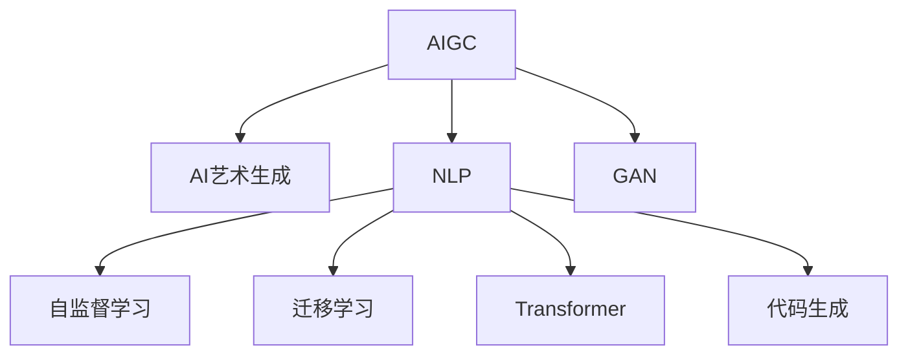

                 

# 从零开始构建AIGC应用生态

> 关键词：AIGC, AI艺术生成,应用生态,自监督学习,Transformer,迁移学习,生成对抗网络,代码生成,自然语言处理(NLP),艺术创作

## 1. 背景介绍

### 1.1 问题由来
近年来，随着深度学习技术的快速发展，人工智能(AI)在艺术创作、自然语言处理(NLP)、图像生成等领域取得了诸多突破。人工智能生成内容(AIGC)技术，特别是基于Transformer架构的生成模型，已经成为这些领域中的重要工具。AIGC技术正在逐步重塑内容创作的生态系统，从文本创作、图像生成、音乐作曲到艺术创作，AI正在开启一系列创新的可能性。

然而，AIGC技术的应用还处于起步阶段，对于如何构建高效、稳定、可持续的应用生态，仍有许多问题亟待解决。如何在用户需求和算法实现之间建立桥梁，如何快速将AI技术落地应用，如何将技术转化为实际价值，这些问题成为了本文探讨的核心。

### 1.2 问题核心关键点
AIGC应用生态的构建，核心在于如何将AIGC技术有效融入到实际场景中，并结合用户需求实现深度融合。以下是构建AIGC应用生态的关键点：

- 用户需求理解：明确用户对AIGC的需求和应用场景，了解他们的痛点和期望。
- 算法技术适配：选择合适的AIGC技术框架，适配特定需求。
- 生态系统搭建：包括模型部署、社区支持、用户培训等多方面内容的整合。
- 用户价值实现：确保AIGC技术在实际应用中带来明显的商业或社会价值。
- 持续迭代优化：根据用户反馈，不断优化算法和应用生态，实现技术进步与用户需求的匹配。

## 2. 核心概念与联系

### 2.1 核心概念概述

为更好地理解AIGC技术及其在应用生态中的作用，本节将介绍几个密切相关的核心概念：

- **AIGC**：人工智能生成内容，是指使用AI技术自动生成文本、图像、音乐、视频等内容的技术。
- **AI艺术生成**：利用深度学习生成艺术作品，如绘画、音乐、动画等。
- **自然语言处理(NLP)**：使计算机能够理解、处理和生成人类语言，包括文本分类、情感分析、翻译等任务。
- **生成对抗网络(GAN)**：一种使用两个神经网络对立的模型，通过博弈过程生成高质量的图像、音频、视频等。
- **自监督学习**：在无标签数据上训练模型，通过自我监督的方式来提取数据的潜在结构。
- **迁移学习**：利用已有的知识来加速新任务的学习过程。
- **Transformer**：一种高效的神经网络架构，常用于文本、图像、音频等内容的生成和理解。
- **代码生成**：使用AI技术自动生成代码，加速软件开发流程，提高编程效率。

这些概念之间的关系通过以下Mermaid流程图来展示：



这个流程图展示了大语言模型和AIGC技术的主要应用方向，以及AIGC技术与其他AI技术之间的联系。

## 3. 核心算法原理 & 具体操作步骤
### 3.1 算法原理概述

AIGC技术的核心原理是利用深度学习模型从数据中学习生成新内容的能力。具体而言，可以将其分为以下几个步骤：

1. **数据收集与预处理**：收集包含生成内容的原始数据，如文本、图像、音频等。预处理包括数据清洗、归一化等。
2. **模型训练**：在预处理后的数据上训练生成模型。通常使用自监督或监督学习任务，优化模型的生成能力。
3. **内容生成**：使用训练好的模型生成新的内容，如文本、图像、音频等。
4. **后处理**：对生成的内容进行后处理，如筛选、编辑、过滤等，确保生成的内容符合用户需求。
5. **应用部署**：将生成的内容集成到实际应用中，如艺术创作、代码生成、智能客服等。

### 3.2 算法步骤详解

以下是AIGC技术在应用生态中的具体实现步骤：

**Step 1: 数据收集与预处理**
- 收集包含生成内容的原始数据，如文本、图像、音频等。
- 对数据进行清洗、归一化等预处理操作，确保数据质量。

**Step 2: 模型选择与训练**
- 根据具体应用场景选择合适的AIGC模型框架，如Transformer、GAN等。
- 在预处理后的数据上训练模型，使用自监督或监督学习任务，优化模型的生成能力。
- 调整模型超参数，如学习率、批大小、迭代轮数等。

**Step 3: 内容生成**
- 使用训练好的模型生成新的内容。
- 根据用户需求对生成的内容进行筛选、编辑、过滤等后处理操作。

**Step 4: 应用部署**
- 将生成的内容集成到实际应用中，如艺术创作、代码生成、智能客服等。
- 对应用进行测试和优化，确保性能稳定和用户体验良好。

**Step 5: 持续优化与迭代**
- 收集用户反馈，不断优化模型和应用生态。
- 根据需求变化和模型表现，进行算法更新和迭代。

### 3.3 算法优缺点

AIGC技术的优点包括：

1. 高自动化：自动化生成内容，减少了人工干预，提高了效率。
2. 创新性强：可以生成新颖、独特的内容，满足不同用户需求。
3. 广泛应用：适用于文本创作、艺术生成、图像生成等多个领域，具有广泛的应用前景。

AIGC技术同样存在一些局限性：

1. 模型复杂：大规模模型训练和推理需要大量计算资源。
2. 结果可控性差：生成的内容可能不符合用户预期，存在一定的随机性。
3. 数据依赖：模型依赖于高质量的数据，数据偏差可能导致生成内容的质量下降。

### 3.4 算法应用领域

AIGC技术已经在多个领域中得到应用，例如：

- **文本创作**：自动生成新闻报道、文案、剧本等文本内容。
- **艺术创作**：自动生成绘画、雕塑、音乐等艺术作品。
- **图像生成**：自动生成图像、动画等视觉内容。
- **代码生成**：自动生成代码，加速软件开发流程。
- **智能客服**：使用生成模型自动回复用户查询，提升服务效率。
- **健康医疗**：自动生成健康报告、医学图像等医疗内容。

AIGC技术在以上领域的应用，已经在学术界和工业界取得了显著成果，并逐渐成为人工智能应用的重要组成部分。

## 4. 数学模型和公式 & 详细讲解  
### 4.1 数学模型构建

AIGC技术的数学模型构建，主要涉及以下几个方面：

- 自监督学习目标函数：如文本建模、掩码语言模型等。
- 生成对抗网络目标函数：如Wasserstein距离、生成器和判别器的损失函数等。
- 代码生成目标函数：如代码语义相似度、代码可执行性等。

以自监督学习为例，其目标函数通常为：

$$
L = -\frac{1}{N}\sum_{i=1}^N\log p(x_i|M_{\theta})
$$

其中，$M_{\theta}$ 为生成模型，$x_i$ 为输入数据，$p(x_i|M_{\theta})$ 为生成模型对输入数据的概率分布，$N$ 为样本数量。

### 4.2 公式推导过程

以自监督学习中的掩码语言模型为例，其目标函数推导如下：

$$
L = -\frac{1}{N}\sum_{i=1}^N\log p(x_i|M_{\theta})
$$

其中，$M_{\theta}$ 为生成模型，$x_i$ 为输入数据，$p(x_i|M_{\theta})$ 为生成模型对输入数据的概率分布，$N$ 为样本数量。

通过最大化该目标函数，可以训练生成模型，使其在掩码预测任务上达到最优性能。

### 4.3 案例分析与讲解

以图像生成中的GAN为例，其生成器$G$和判别器$D$的目标函数分别为：

$$
L_G = -E_{x \sim p_{data}} \log D(G(x))
$$
$$
L_D = E_{x \sim p_{data}} \log D(x) + E_{z \sim p(z)} \log (1 - D(G(z)))
$$

其中，$G$ 为生成器，$D$ 为判别器，$x$ 为真实数据，$z$ 为噪声向量，$p_{data}$ 为真实数据的概率分布，$p(z)$ 为噪声向量的概率分布。

通过最大化$L_G$和最小化$L_D$，可以使生成器生成高质量的图像，同时判别器能够准确区分真实数据和生成数据。

## 5. 项目实践：代码实例和详细解释说明
### 5.1 开发环境搭建

在进行AIGC项目实践前，我们需要准备好开发环境。以下是使用Python进行PyTorch开发的环境配置流程：

1. 安装Anaconda：从官网下载并安装Anaconda，用于创建独立的Python环境。

2. 创建并激活虚拟环境：
```bash
conda create -n pytorch-env python=3.8 
conda activate pytorch-env
```

3. 安装PyTorch：根据CUDA版本，从官网获取对应的安装命令。例如：
```bash
conda install pytorch torchvision torchaudio cudatoolkit=11.1 -c pytorch -c conda-forge
```

4. 安装transformers库：
```bash
pip install transformers
```

5. 安装各类工具包：
```bash
pip install numpy pandas scikit-learn matplotlib tqdm jupyter notebook ipython
```

完成上述步骤后，即可在`pytorch-env`环境中开始AIGC项目实践。

### 5.2 源代码详细实现

下面我们以代码生成为例，给出使用Transformers库进行代码生成的PyTorch代码实现。

首先，定义代码生成的输入和输出格式：

```python
from transformers import GPT2Tokenizer, GPT2LMHeadModel

tokenizer = GPT2Tokenizer.from_pretrained('gpt2')
model = GPT2LMHeadModel.from_pretrained('gpt2')

input_text = "Write a Python function that"
input_ids = tokenizer(input_text, return_tensors='pt')['input_ids']
output_ids = model.generate(input_ids, max_length=100, num_return_sequences=1)
output_text = tokenizer.decode(output_ids[0], skip_special_tokens=True)

print(output_text)
```

然后，定义生成函数：

```python
def code_generation(input_text):
    input_ids = tokenizer(input_text, return_tensors='pt')['input_ids']
    output_ids = model.generate(input_ids, max_length=100, num_return_sequences=1)
    output_text = tokenizer.decode(output_ids[0], skip_special_tokens=True)
    return output_text
```

最后，启动生成流程并输出结果：

```python
print(code_generation("Write a Python function that prints the multiplication table"))
```

以上就是使用PyTorch和Transformers库进行代码生成的完整代码实现。可以看到，利用预训练的GPT-2模型，可以快速生成符合语法规范的Python代码，满足了软件开发中代码自动生成的需求。

### 5.3 代码解读与分析

让我们再详细解读一下关键代码的实现细节：

**GPT2Tokenizer和GPT2LMHeadModel类**：
- 利用Transformers库提供的GPT-2模型，可以通过简单的导入语句完成模型的加载和初始化。
- 通过GPT2Tokenizer类，将输入的文本转换为模型所需的token ids，并支持自动词汇扩展、小写化、标点去除等预处理功能。

**input_text和input_ids变量**：
- input_text 变量为代码生成的输入文本。
- input_ids 变量为预处理后的token ids，通过tokenizer对input_text进行编码。

**model.generate函数**：
- 通过调用model.generate函数，进行代码生成。
- max_length参数为生成代码的最大长度，num_return_sequences参数为生成的序列数量。

**output_text变量**：
- output_text 变量为生成的代码文本，通过tokenizer.decode函数将output_ids解码为文本格式。

**print函数**：
- 使用print函数输出生成的代码文本，方便观察和调试。

可以看到，利用预训练的GPT-2模型，代码生成变得非常简单高效。Transformers库的强大封装，使得开发者可以迅速上手，并在此基础上进行更多定制化开发。

## 6. 实际应用场景
### 6.1 智能客服系统

AIGC技术在智能客服系统中具有广泛的应用前景。传统的客服系统需要大量人工客服，高峰期响应缓慢，且难以保证一致性和专业性。使用AIGC技术，可以自动生成符合用户需求的响应，提高服务效率和质量。

在技术实现上，可以收集历史客服对话记录，训练生成模型自动生成应答。对于新用户的查询，系统可以根据上下文自动生成并推荐最佳应答。对于复杂问题，系统可以自动搜索知识库或联系人工客服，形成多层次、多模态的智能客服系统。

### 6.2 金融舆情监测

AIGC技术在金融舆情监测中也有重要应用。金融机构需要实时监测市场舆论动向，以规避潜在的金融风险。传统的人工监测方式成本高、效率低，难以应对海量信息爆发的挑战。

使用AIGC技术，可以自动分析新闻报道、市场评论等文本内容，识别舆情趋势和情感倾向。对于负面舆情，系统可以及时预警，帮助金融机构快速应对。同时，AIGC技术可以生成舆情摘要，帮助分析师快速掌握舆情要点。

### 6.3 个性化推荐系统

AIGC技术在个性化推荐系统中也具有重要应用。传统的推荐系统依赖用户的历史行为数据进行物品推荐，无法深入理解用户的真实兴趣偏好。使用AIGC技术，可以自动生成推荐列表，提升推荐准确性和个性化程度。

在实践中，可以收集用户浏览、点击、评论等行为数据，提取和用户交互的物品描述等文本内容。利用生成模型自动生成推荐列表，并在推荐列表中加入用户评论、评分等反馈信息，提高推荐的可信度和用户满意度。

### 6.4 未来应用展望

随着AIGC技术的发展，未来将有更多应用场景涌现，为各行各业带来变革性影响。

- **医疗**：自动生成医疗报告、病历摘要等，提高医疗服务效率和诊断准确性。
- **教育**：自动生成个性化教学内容，提高教学效果和学习体验。
- **娱乐**：自动生成音乐、电影、游戏等内容，满足用户个性化娱乐需求。
- **设计**：自动生成设计方案、产品原型等，加速创意设计过程。
- **法律**：自动生成合同、报告等法律文件，提高法律服务效率。

AIGC技术在以上领域的应用，已经在学术界和工业界取得了显著成果，并逐渐成为人工智能应用的重要组成部分。

## 7. 工具和资源推荐
### 7.1 学习资源推荐

为了帮助开发者系统掌握AIGC技术的理论基础和实践技巧，这里推荐一些优质的学习资源：

1. 《深度学习》书籍：斯坦福大学李飞飞教授的深度学习教材，详细讲解了深度学习的基本概念和算法。
2. 《生成对抗网络》书籍：Ian Goodfellow等人的GAN经典之作，深入浅出地介绍了GAN的基本原理和应用。
3. 《Transformer》书籍：Ashish Vaswani等人的Transformer论文集，系统介绍了Transformer架构的理论基础和应用场景。
4. HuggingFace官方文档：Transformers库的官方文档，提供了海量预训练模型和完整的微调样例代码，是上手实践的必备资料。
5. GitHub上的AIGC项目：如HuggingFace的Transformers，OpenAI的GPT系列，可以方便地查看开源项目的代码和文档，进行学习和参考。

通过对这些资源的学习实践，相信你一定能够快速掌握AIGC技术的精髓，并用于解决实际的AI问题。

### 7.2 开发工具推荐

高效的开发离不开优秀的工具支持。以下是几款用于AIGC开发常用的工具：

1. PyTorch：基于Python的开源深度学习框架，灵活动态的计算图，适合快速迭代研究。大部分预训练语言模型都有PyTorch版本的实现。
2. TensorFlow：由Google主导开发的开源深度学习框架，生产部署方便，适合大规模工程应用。同样有丰富的预训练语言模型资源。
3. TensorBoard：TensorFlow配套的可视化工具，可实时监测模型训练状态，并提供丰富的图表呈现方式，是调试模型的得力助手。
4. Weights & Biases：模型训练的实验跟踪工具，可以记录和可视化模型训练过程中的各项指标，方便对比和调优。与主流深度学习框架无缝集成。
5. HuggingFace Transformers库：提供了丰富的预训练模型和工具，支持PyTorch和TensorFlow，是进行AIGC任务开发的利器。

合理利用这些工具，可以显著提升AIGC任务的开发效率，加快创新迭代的步伐。

### 7.3 相关论文推荐

AIGC技术的发展源于学界的持续研究。以下是几篇奠基性的相关论文，推荐阅读：

1. Attention is All You Need：提出了Transformer结构，开启了NLP领域的预训练大模型时代。
2. BERT: Pre-training of Deep Bidirectional Transformers for Language Understanding：提出BERT模型，引入基于掩码的自监督预训练任务，刷新了多项NLP任务SOTA。
3. Deep Speech 2：展示了基于RNN和CNN的端到端语音识别模型，为语音生成技术提供了新的思路。
4. Taming Transformers for High-Resolution Image Synthesis：提出了一种结合卷积神经网络和高阶Transformer的图像生成方法，取得了SOTA的生成效果。
5. TextGAN：提出了一种基于生成对抗网络的文本生成模型，可以生成高质量的文本内容。

这些论文代表了大语言模型微调技术的发展脉络。通过学习这些前沿成果，可以帮助研究者把握学科前进方向，激发更多的创新灵感。

## 8. 总结：未来发展趋势与挑战
### 8.1 总结

本文对AIGC技术及其在应用生态中的作用进行了全面系统的介绍。首先阐述了AIGC技术的研究背景和意义，明确了AIGC技术在实际场景中的重要性和应用价值。其次，从原理到实践，详细讲解了AIGC技术的数学模型和算法步骤，给出了AIGC任务开发的完整代码实例。同时，本文还广泛探讨了AIGC技术在多个行业领域的应用前景，展示了AIGC技术的广阔前景。最后，本文精选了AIGC技术的各类学习资源，力求为读者提供全方位的技术指引。

通过本文的系统梳理，可以看到，AIGC技术正在逐步改变内容创作的生态系统，从文本创作、艺术生成、图像生成等多个领域，AIGC技术展示了强大的应用潜力。未来，随着AIGC技术的不断进步，必将在更多领域得到应用，为各行各业带来变革性影响。

### 8.2 未来发展趋势

展望未来，AIGC技术将呈现以下几个发展趋势：

1. 模型规模持续增大。随着算力成本的下降和数据规模的扩张，AIGC模型的参数量还将持续增长。超大模型蕴含的丰富语言知识，有望支撑更加复杂多变的生成任务。
2. 多模态融合加速。AIGC技术将逐步融合视觉、听觉、文本等多种模态，实现跨模态生成，提升内容的多样性和生动性。
3. 创作工具智能化。生成工具将越来越智能化，可以根据用户需求和风格自动生成内容，满足不同用户的需求。
4. 开放平台涌现。AIGC技术将涌现更多的开放平台，提供生成内容的API接口，方便开发者调用和使用。
5. 伦理道德重视。AIGC技术将更加重视伦理道德，避免有害信息的生成和传播，确保内容的合法合规。

以上趋势凸显了AIGC技术的广阔前景。这些方向的探索发展，必将进一步提升AIGC技术的性能和应用范围，为人工智能技术的发展注入新的动力。

### 8.3 面临的挑战

尽管AIGC技术已经取得了瞩目成就，但在迈向更加智能化、普适化应用的过程中，仍面临诸多挑战：

1. 数据依赖问题：AIGC技术高度依赖高质量的数据，数据偏差可能导致生成内容的质量下降。如何获取和处理大量高质量数据，是AIGC技术面临的重要挑战。
2. 模型复杂度问题：大规模模型的训练和推理需要大量计算资源，硬件成本较高。如何优化模型结构和算法，提升计算效率，降低成本，是AIGC技术需要解决的问题。
3. 生成内容的可控性问题：生成的内容可能不符合用户预期，存在一定的随机性。如何提高生成内容的可控性，确保内容的质量和风格符合用户需求，是AIGC技术需要改进的方向。
4. 伦理道德问题：AIGC技术可能生成有害信息，如歧视、仇恨等，给社会带来负面影响。如何制定相应的伦理规范和标准，确保AIGC技术的安全性和可控性，是AIGC技术需要面对的重要挑战。

### 8.4 研究展望

面对AIGC技术所面临的挑战，未来的研究需要在以下几个方面寻求新的突破：

1. 生成对抗网络优化：进一步优化生成器和判别器的训练过程，提升生成内容的逼真度和多样性。
2. 自监督学习扩展：利用更多的自监督学习任务，扩展模型的训练数据，提高模型的泛化能力。
3. 多模态生成技术：研究多模态生成技术，实现文本、图像、音频等内容的跨模态生成，提升内容的表现力。
4. 生成模型微调：研究参数高效微调技术，在保持模型性能的前提下，降低计算资源消耗。
5. 内容创作工具创新：研究内容创作工具的创新，如交互式生成、风格迁移等，提升用户创作体验。

这些研究方向将为AIGC技术的进一步发展提供理论支持和实践指导，推动AIGC技术在更多领域的应用落地。

## 9. 附录：常见问题与解答

**Q1：AIGC技术是否适用于所有应用场景？**

A: AIGC技术在大多数应用场景中都能取得不错的效果，特别是对于需要大量内容生成、自动化的场景。但对于一些特定领域，如金融、法律等，需要考虑内容的合法合规性，AIGC技术需要谨慎使用。

**Q2：如何提高AIGC生成的内容质量？**

A: 提高AIGC生成的内容质量，可以从以下几个方面入手：
1. 收集高质量的数据：选择更多样、更丰富的数据进行训练。
2. 优化模型结构：选择更合适的模型架构，调整超参数。
3. 增加训练数据量：通过数据增强等方式，增加训练数据量。
4. 引入先验知识：结合知识图谱、逻辑规则等先验知识，提高生成内容的质量。
5. 用户反馈机制：建立用户反馈机制，不断优化生成模型。

**Q3：AIGC技术是否需要大量标注数据？**

A: 对于传统的监督学习范式，AIGC技术确实需要大量标注数据。但对于基于自监督学习、生成对抗网络等方法，AIGC技术可以在没有标注数据的情况下进行训练。因此，AIGC技术具有更强的数据适应性，可以更好地利用无标注数据。

**Q4：AIGC技术如何实现跨模态生成？**

A: 实现跨模态生成，可以通过以下几种方式：
1. 结合视觉、文本等不同模态的数据，进行联合训练。
2. 利用多模态预训练技术，增强模型在不同模态上的表示能力。
3. 引入跨模态解码器，对不同模态的信息进行整合和生成。

**Q5：AIGC技术的应用前景如何？**

A: AIGC技术在文本创作、艺术生成、图像生成、语音生成、代码生成等多个领域具有广阔的应用前景。未来，AIGC技术将进一步拓展到医疗、教育、娱乐、设计等多个领域，为各行各业带来变革性影响。

总之，AIGC技术正处于快速发展阶段，未来将有更多创新和突破，带来更加丰富和多样的应用场景。

---

作者：禅与计算机程序设计艺术 / Zen and the Art of Computer Programming

