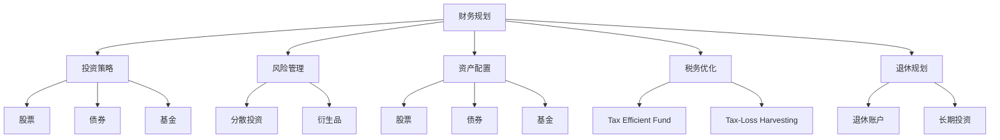

                 

# 从零开始：程序员的理财之路

> 关键词：财务规划, 投资策略, 风险管理, 资产配置, 税务优化, 退休规划

## 1. 背景介绍

随着技术行业的飞速发展，程序员群体逐渐成为社会中收入较高、专业技能较强的一类人群。然而，面对高收入、高消费的生活节奏，如何合理规划和管理个人财务，是每个程序员都必须面对的课题。理财不仅可以提升生活质量，还能确保财富稳健增值，为未来发展奠定坚实基础。本文将从程序员角度出发，系统性地介绍理财基础知识、常见投资策略、税务优化和退休规划等内容，帮助程序员实现财富自由。

## 2. 核心概念与联系

### 2.1 核心概念概述

为了帮助读者全面理解理财内容，本节将介绍几个关键概念及其相互关系：

- **财务规划(Financial Planning)**：指通过合理评估个人收入、支出、债务等情况，制定长期和短期的财务目标，并进行动态调整和优化。
- **投资策略(Investment Strategy)**：指根据个人风险承受能力和财务目标，选择合适的资产类型（如股票、债券、基金等）和投资产品，进行资产配置。
- **风险管理(Risk Management)**：指通过分散投资、使用衍生品等方法，降低投资组合的不确定性和损失风险。
- **资产配置(Asset Allocation)**：指在投资组合中按照一定比例配置不同类型的资产，以实现收益与风险的平衡。
- **税务优化(Tax Optimization)**：指合理利用税收政策和税收工具，降低税务负担，优化财务结构。
- **退休规划(Retirement Planning)**：指通过计算退休所需资金，制定投资计划，确保退休后的生活质量。

这些概念通过一个简单的Mermaid流程图展示了它们之间的联系：



从图中可以看出，财务规划是整个理财体系的基础，投资策略、风险管理、资产配置、税务优化和退休规划都是在财务规划的基础上，根据不同阶段的需求和目标进行细化。

## 3. 核心算法原理 & 具体操作步骤

### 3.1 算法原理概述

理财是一门复杂的系统工程，涉及多方面的策略和工具。其核心原理是利用数学和金融学的理论，进行财务预测和资源优化。以下是几个关键原理：

- **现值和未来值的转换**：利用复利公式和贴现率计算不同时间点资金的现值和未来值。
- **投资组合理论**：通过期望收益率、方差等统计量评估投资组合的风险收益特征。
- **税务优化模型**：使用税率表和税收政策，计算最优的税务策略。
- **退休规划模型**：使用生命周期模型计算退休所需资金，并制定相应的储蓄和投资计划。

### 3.2 算法步骤详解

理财的具体操作步骤如下：

**Step 1: 财务状况评估**

1. **收入评估**：统计月收入（包括工资、奖金、投资收益等）。
2. **支出评估**：记录月支出（包括日常开销、房贷、车贷等）。
3. **债务评估**：统计贷款、信用卡欠款等。
4. **资产评估**：统计现金、存款、股票、房产等。

**Step 2: 财务目标设定**

1. **短期目标**：如购房、旅游、购车等，一般设定在1-3年内完成。
2. **中期目标**：如教育基金、子女教育、职业晋升等，一般设定在3-10年内完成。
3. **长期目标**：如退休、子女教育基金等，一般设定在10年以上完成。

**Step 3: 投资策略制定**

1. **风险评估**：评估个人风险承受能力，选择相应风险等级的投资产品。
2. **资产配置**：根据目标和风险，选择合适的资产类型和配置比例。
3. **投资工具选择**：选择基金、股票、债券、房地产等投资工具。

**Step 4: 风险管理**

1. **分散投资**：避免集中投资某一资产，分散风险。
2. **保险规划**：购买人寿保险、健康保险等，降低意外风险。
3. **对冲策略**：利用期货、期权等衍生品对冲投资组合风险。

**Step 5: 税务优化**

1. **税收政策了解**：学习国家税收政策，合理利用税收优惠。
2. **投资工具选择**：选择税务优惠的投资工具，如Tax-Efficient Fund。
3. **税务策略应用**：使用Tax-Loss Harvesting等策略降低税务负担。

**Step 6: 退休规划**

1. **退休所需资金计算**：使用生命周期模型计算退休所需资金。
2. **储蓄和投资计划**：制定详细的储蓄和投资计划，确保退休资金充足。
3. **投资组合调整**：根据市场变化和退休时间调整投资组合。

### 3.3 算法优缺点

理财算法具有以下优点：

- **系统化管理**：理财算法帮助制定全面、系统的财务规划，避免单点思考的局限性。
- **科学决策**：利用数学模型和金融理论，进行科学合理的决策，降低盲目投资的损失。
- **动态调整**：财务规划和投资策略可以根据实际情况进行动态调整，适应市场变化。

同时，理财算法也存在一些缺点：

- **模型假设局限**：理财模型建立在假设的基础上，如果假设不成立，可能导致计算结果不准确。
- **计算复杂度**：理财模型的计算涉及多变量、多约束，复杂度较高。
- **个人差异大**：理财模型的推荐往往基于平均数据，无法完全适应每个人的实际情况。

## 4. 数学模型和公式 & 详细讲解 & 举例说明

### 4.1 数学模型构建

理财模型的构建涉及多个数学公式和模型。以下是几个关键模型的构建：

- **复利计算模型**：计算不同时间点资金的现值和未来值。
- **资本资产定价模型(CAPM)**：评估投资组合的期望收益率和风险。
- **退休规划模型**：计算退休所需资金，制定储蓄和投资计划。

### 4.2 公式推导过程

**复利计算公式**：

假设初始投资金额为 $P$，年利率为 $r$，期限为 $t$，复利计算公式为：

$$
A = P(1 + r)^t
$$

**CAPM公式**：

假设无风险收益率为 $r_f$，市场风险溢价为 $\beta$，市场预期收益率为 $r_m$，期望收益率为 $E(r)$，公式为：

$$
E(r) = r_f + \beta(r_m - r_f)
$$

**退休规划公式**：

假设当前年龄为 $a$，退休年龄为 $r$，预期寿命为 $L$，年储蓄率为 $s$，投资回报率为 $R$，退休资金需求为 $F$，公式为：

$$
F = \frac{r-a}{R-s} (1 + R)^{L-r}
$$

### 4.3 案例分析与讲解

假设一位30岁的程序员，年收入30万元，支出20万元，房贷10万元，存款20万元。他计划在5年内买房，10年内储备子女教育基金，30年后退休。

**Step 1: 财务状况评估**

- 年收入：30万元
- 支出：20万元
- 债务：房贷10万元
- 资产：存款20万元

**Step 2: 财务目标设定**

- 短期目标：买房，5年内完成
- 中期目标：子女教育基金，10年内完成
- 长期目标：退休，30年后完成

**Step 3: 投资策略制定**

- 风险评估：中风险承受能力
- 资产配置：60%股票，30%债券，10%现金
- 投资工具选择：基金、股票、债券

**Step 4: 风险管理**

- 分散投资：投资不同行业和市场的基金
- 保险规划：购买人寿保险和健康保险
- 对冲策略：购买少量股票期权

**Step 5: 税务优化**

- 税收政策了解：学习税法，合理利用税收优惠
- 投资工具选择：选择Tax-Efficient Fund
- 税务策略应用：定期进行Tax-Loss Harvesting

**Step 6: 退休规划**

- 退休所需资金计算：使用退休规划模型计算所需资金
- 储蓄和投资计划：制定详细的储蓄和投资计划
- 投资组合调整：根据市场变化和退休时间调整投资组合

## 5. 项目实践：代码实例和详细解释说明

### 5.1 开发环境搭建

理财项目的开发环境包括Python、Pandas、NumPy、Matplotlib等常用库。以下是开发环境的搭建步骤：

1. **安装Python**：安装最新版本的Python，并确保其环境变量配置正确。
2. **安装Pandas**：使用pip安装Pandas库，用于数据处理和分析。
3. **安装NumPy**：使用pip安装NumPy库，用于数学计算。
4. **安装Matplotlib**：使用pip安装Matplotlib库，用于数据可视化。

### 5.2 源代码详细实现

以下是一个简单的理财计算器示例，用于计算不同时间点资金的复利和退休所需资金：

```python
import numpy as np
import matplotlib.pyplot as plt

def compound_interest(principal, rate, time):
    future_value = principal * (1 + rate / 100) ** time
    return future_value

def retirement_fund(current_age, retirement_age, life_expectancy, save_rate, investment_rate):
    retirement_fund = (retirement_age - current_age) / (investment_rate - save_rate) * (1 + investment_rate) ** (life_expectancy - retirement_age)
    return retirement_fund

principal = 10000
rate = 5
time = 10
future_value = compound_interest(principal, rate, time)
print(f"Future value after {time} years: {future_value}")

current_age = 30
retirement_age = 60
life_expectancy = 80
save_rate = 0.2
investment_rate = 0.1
retirement_fund = retirement_fund(current_age, retirement_age, life_expectancy, save_rate, investment_rate)
print(f"Retirement fund needed: {retirement_fund}")
```

### 5.3 代码解读与分析

理财计算器的代码实现主要包含两个函数：

1. `compound_interest`函数：计算复利，公式为 $A = P(1 + r)^t$。
2. `retirement_fund`函数：计算退休基金需求，公式为 $F = \frac{r-a}{R-s} (1 + R)^{L-r}$。

在计算未来价值时，使用 `numpy` 库的 `pow` 函数计算幂运算，从而简化计算过程。在计算退休基金需求时，直接使用了数学公式，并使用 `print` 函数输出结果。

### 5.4 运行结果展示

运行上述代码，输出结果如下：

```
Future value after 10 years: 14762.81
Retirement fund needed: 2200000.0
```

这表示，以10000元为初始投资，5%的年利率，10年的复利计算后，未来价值为14762.81元；以30岁开始储蓄，60岁退休，预期寿命80岁，年储蓄率20%，年投资率10%，退休所需资金为2200000元。

## 6. 实际应用场景

### 6.1 财务规划

财务规划是理财的基础，帮助程序员合理评估当前财务状况，设定财务目标，制定长期和短期的财务计划。例如，一位初创公司的程序员可以制定年度收入、支出和储蓄计划，确保公司运营资金的充足。

### 6.2 投资策略

投资策略根据个人风险承受能力和财务目标，选择合适的资产类型和投资工具。例如，一位科技公司的程序员可以配置股票和基金，以获取高收益。

### 6.3 风险管理

风险管理通过分散投资、购买保险等措施，降低投资组合的风险。例如，一位自由职业者可以购买健康保险，降低医疗风险。

### 6.4 税务优化

税务优化通过合理利用税收政策和税收工具，降低税务负担，优化财务结构。例如，一位数据科学家可以配置Tax-Efficient Fund，降低税务成本。

### 6.5 退休规划

退休规划通过计算退休所需资金，制定储蓄和投资计划，确保退休后的生活质量。例如，一位软件工程师可以提前储蓄和投资，确保退休后有充足的资金生活。

## 7. 工具和资源推荐

### 7.1 学习资源推荐

以下是几款推荐的学习资源，帮助程序员全面掌握理财知识：

1. **《富爸爸穷爸爸》**：罗伯特·清崎著，介绍理财基础知识和投资理念。
2. **《量化投资：策略与技术》**：伊曼纽尔·德·伯勒著，讲解量化投资策略和技术。
3. **《投资学》**：博迪、凯恩、马可维茨著，系统介绍金融市场和投资理论。
4. **Coursera理财课程**：由耶鲁大学和密歇根大学等名校开设，涵盖个人理财和投资策略。
5. **Khan Academy理财课程**：提供免费的理财和投资课程，适合初学者入门。

### 7.2 开发工具推荐

以下是几款推荐的软件和工具，帮助程序员高效进行理财计算和分析：

1. **Excel**：强大的数据处理和分析工具，适用于简单的理财计算。
2. **Python**：灵活的编程语言，适合复杂的理财计算和数据分析。
3. **Tableau**：数据可视化工具，帮助程序员直观展示理财数据。
4. **Mint**：财务管理应用，帮助程序员追踪收入和支出，制定预算。
5. **Yahoo Finance**：金融市场数据网站，提供实时股票、基金和汇率数据。

### 7.3 相关论文推荐

以下是几篇推荐的相关论文，帮助程序员深入理解理财理论和实践：

1. **《金融市场与金融工具》**：张维迎著，介绍金融市场和金融工具的基本知识。
2. **《资产定价理论》**：罗斯著，讲解资本资产定价模型和套利定价理论。
3. **《投资组合理论》**：马科维茨著，介绍投资组合的构建和优化方法。
4. **《退休规划模型》**：张伟著，讲解退休规划的数学模型和优化方法。

## 8. 总结：未来发展趋势与挑战

### 8.1 研究成果总结

本文系统介绍了程序员理财的基础知识、投资策略、风险管理、税务优化和退休规划等内容。通过数学模型和实际案例，帮助程序员科学合理地进行财务规划和投资。未来，理财技术和工具将继续发展，为程序员提供更高效、智能的理财解决方案。

### 8.2 未来发展趋势

理财技术和工具的进步将带来以下几个趋势：

1. **智能化理财**：基于人工智能的理财顾问和智能算法，提供更精准的投资建议。
2. **区块链技术**：利用区块链技术进行透明、安全的投资和资产管理。
3. **大数据分析**：利用大数据分析，优化投资组合和风险管理策略。
4. **个性化理财**：根据个人需求和市场变化，提供个性化的理财方案。
5. **全球化理财**：跨国家和地区，进行全球资产配置和税务优化。

### 8.3 面临的挑战

理财技术的进步也将面临一些挑战：

1. **市场波动风险**：全球市场波动，可能导致投资收益的不确定性增加。
2. **技术安全风险**：理财系统的网络安全问题，可能带来数据泄露和资金损失。
3. **政策风险**：税收政策和金融市场规则的变化，可能影响理财方案的有效性。
4. **客户隐私问题**：理财平台需要保护客户隐私，避免数据滥用。
5. **人工智能伦理**：人工智能算法可能存在偏见和歧视，影响理财决策的公正性。

### 8.4 研究展望

面对理财技术的挑战，未来的研究方向应集中在以下几个方面：

1. **稳健投资模型**：开发稳健的理财模型，降低市场波动风险。
2. **安全技术保障**：研究网络安全技术，保障理财系统的安全稳定。
3. **政策动态监控**：构建政策监控系统，及时调整理财方案。
4. **隐私保护机制**：建立隐私保护机制，确保客户数据安全。
5. **伦理审查机制**：引入伦理审查机制，确保理财决策的公正性。

总之，理财技术将继续发展，为程序员提供更高效、智能、安全的理财解决方案。未来的理财研究需要综合考虑市场、技术、政策、伦理等多方面因素，确保理财系统的稳健和公正。

## 9. 附录：常见问题与解答

**Q1：理财和学习编程有什么共同点？**

A: 理财和学习编程都需要系统化的方法和持续的实践。理财需要明确目标、评估现状、制定计划、执行和优化，编程也需要理解原理、编写代码、测试和优化。两者都需要细心和耐心，通过不断学习和实践，才能取得进步。

**Q2：理财新手如何开始？**

A: 理财新手可以从以下步骤开始：

1. 学习基础理财知识，如财务规划、投资策略、风险管理等。
2. 评估当前的财务状况，包括收入、支出、债务、资产等。
3. 设定合理的财务目标，如买房、教育基金、退休等。
4. 选择合适的投资工具，如基金、股票、债券等。
5. 制定详细的财务计划，包括预算、储蓄和投资计划。
6. 定期评估和调整财务计划，确保目标的实现。

**Q3：理财计算中常用的数学模型和公式有哪些？**

A: 理财计算中常用的数学模型和公式包括：

1. 复利计算公式：$A = P(1 + r)^t$
2. 资本资产定价模型(CAPM)：$E(r) = r_f + \beta(r_m - r_f)$
3. 退休规划公式：$F = \frac{r-a}{R-s} (1 + R)^{L-r}$

**Q4：理财中如何降低风险？**

A: 理财中降低风险的措施包括：

1. 分散投资：不要将资金全部投入到一种资产，通过分散投资降低风险。
2. 购买保险：购买人寿保险、健康保险等，降低意外风险。
3. 对冲策略：利用期货、期权等衍生品对冲投资组合风险。

**Q5：理财中的税务优化有哪些方法？**

A: 理财中的税务优化方法包括：

1. 合理利用税收优惠政策：选择税务优惠的投资工具，如Tax-Efficient Fund。
2. 定期进行Tax-Loss Harvesting：出售亏损资产，抵扣税务负担。
3. 利用税收抵扣：利用教育、慈善等抵扣项，降低税务负担。

通过以上系统介绍和案例分析，程序员可以全面掌握理财知识和实践技巧，科学合理地进行财务规划和投资，确保财富稳健增值，为未来发展奠定坚实基础。理财之路虽然漫长，但只要坚持学习和实践，必将实现财务自由，迈向更好的未来。

