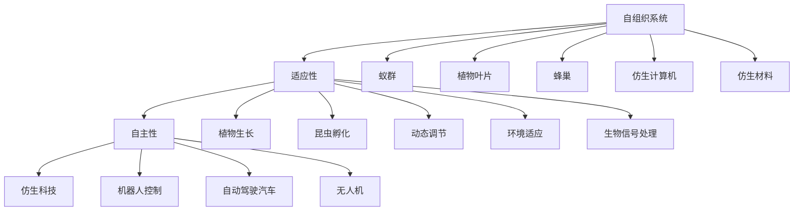

                 

# 仿生科技创业：向自然学习的创新之路

## 1. 背景介绍

在当今科技创新的浪潮中，“仿生科技”已成为新的热门话题。仿生科技，即通过模仿生物系统的工作原理来开发新型的技术或产品，这一概念最初由维特根斯坦提出，并由现代生物学家和工程师们进一步发展，现在已经广泛应用于各个领域。生物系统的设计理念，如自组织、适应性、自主性等，为科技创业提供了新的灵感和方向。

### 1.1 仿生科技的起源与发展

仿生科技的起源可以追溯到1960年代，当时科学家们开始研究动物的感官系统，希望通过模拟动物的视觉、听觉等感官机制来开发更加先进的人工智能系统。随着时间的推移，仿生科技的应用范围不断扩展，涵盖了计算机科学、生物医学、材料科学、环境科学等多个领域。

今天，仿生科技已经成为了一个跨学科的研究领域，吸引了来自各个领域的顶尖专家和研究者。生物学的研究成果，如神经科学、生物力学、生态学等，为仿生科技的发展提供了坚实的理论基础。同时，随着计算能力和数据量的不断提升，仿生科技在实际应用中也取得了显著的进展。

## 2. 核心概念与联系

### 2.1 核心概念概述

为了更好地理解仿生科技，本节将介绍几个关键概念及其相互关系：

- **仿生科技（Bionics）**：通过模仿生物系统的结构和功能来开发新技术或产品。仿生科技的典型应用包括仿生机器人、仿生材料、仿生计算机等。

- **自组织系统（Self-organized Systems）**：无需外部控制，系统内部各组件之间能够自主地进行交互，形成稳定的结构和功能。自组织系统如蚁群、蜂巢、植物叶片等。

- **适应性（Adaptation）**：系统能够根据环境的变化自动调整其行为和结构，以适应外部条件的变化。适应性是仿生科技中的一个重要概念。

- **自主性（Autonomy）**：系统能够在没有外部干预的情况下自主执行任务，包括决策、规划、执行等。自主性是仿生科技中追求的重要目标。

这些核心概念之间存在紧密的联系，共同构成了仿生科技的基本框架。

### 2.2 核心概念原理和架构的 Mermaid 流程图



这个流程图展示了自组织系统、适应性和自主性之间的关系，以及这些概念如何共同构成仿生科技的基础。自组织系统是仿生科技的核心组成部分，适应性和自主性是仿生科技追求的目标。

## 3. 核心算法原理 & 具体操作步骤

### 3.1 算法原理概述

仿生科技的核心算法原理，可以概括为以下几点：

- **自组织原理**：通过模拟生物系统中各组件间的交互方式，实现系统的自组织和动态调整。典型的自组织算法包括遗传算法、蚁群算法、粒子群算法等。

- **适应性原理**：通过模拟生物体对环境的适应能力，使系统能够自主地调整其行为和结构以适应外部条件的变化。常见的适应性算法包括模糊控制、人工神经网络等。

- **自主性原理**：通过模拟生物体自主执行任务的能力，使系统能够在没有外部干预的情况下完成复杂任务。自主性算法包括强化学习、规划算法、决策树等。

### 3.2 算法步骤详解

以下是仿生科技中的几个典型算法步骤详解：

#### 3.2.1 自组织算法

自组织算法通常包括以下几个步骤：

1. **初始化**：随机生成一组参数或状态变量，作为系统的初始状态。

2. **交互过程**：系统各组件之间按照一定的规则进行交互，更新各自的参数或状态变量。

3. **动态调整**：根据系统状态和目标，动态调整交互规则或参数，以实现系统的自组织。

4. **收敛与稳定**：经过多次迭代后，系统达到一个稳定的状态，表现出特定的结构和功能。

#### 3.2.2 适应性算法

适应性算法通常包括以下几个步骤：

1. **数据采集**：从环境中采集数据，用于衡量系统性能和目标函数。

2. **目标定义**：根据任务要求定义目标函数，表示系统的优化目标。

3. **参数更新**：根据目标函数和当前状态，调整系统的参数或控制变量，以优化系统性能。

4. **反馈机制**：通过反馈机制将系统性能信息返回，调整算法参数或控制策略。

#### 3.2.3 自主性算法

自主性算法通常包括以下几个步骤：

1. **任务定义**：根据任务要求定义系统需要执行的具体任务或目标。

2. **决策机制**：设计系统的决策机制，包括决策规则、决策参数等。

3. **行动执行**：根据决策结果，执行相应的动作或任务。

4. **反馈学习**：通过反馈机制，学习并优化决策机制，提高系统执行任务的准确性和效率。

### 3.3 算法优缺点

仿生科技中的算法具有以下优点：

- **自适应性**：仿生算法能够自主适应外部环境变化，表现出高度的灵活性和适应性。

- **鲁棒性**：由于仿生算法通常具有容错机制，系统的鲁棒性较高。

- **并行性**：许多仿生算法具有并行计算的特点，能够利用多核或分布式计算资源，提高计算效率。

但同时，仿生算法也存在一些缺点：

- **复杂性**：仿生算法的设计和实现较为复杂，需要较强的专业知识和经验。

- **参数调优困难**：仿生算法通常需要大量的参数调整，调优过程复杂且耗时。

- **收敛速度慢**：某些仿生算法收敛速度较慢，特别是在高维空间中表现不佳。

### 3.4 算法应用领域

仿生科技的应用领域非常广泛，涵盖了多个学科和技术领域。以下是几个典型应用场景：

- **仿生机器人**：模仿动物的运动和行为，开发自主导航、作业机器人等。

- **仿生材料**：模拟生物材料的结构和功能，开发高性能材料，如仿生骨骼、仿生肌肉等。

- **仿生计算机**：通过模仿生物神经网络的结构和功能，开发新型计算机芯片，实现高效计算和低能耗。

- **仿生传感器**：模拟生物感知系统，开发高灵敏度和自适应性的传感器，用于环境监测、生物医学等。

- **仿生医疗**：通过模仿生物系统的生理机制，开发新型医疗设备，如仿生假肢、仿生心脏等。

- **仿生环境监测**：模拟生态系统的监测和调节机制，开发环境监测和治理设备，如仿生水处理系统、仿生空气净化器等。

## 4. 数学模型和公式 & 详细讲解 & 举例说明

### 4.1 数学模型构建

仿生科技中的数学模型通常基于生物系统的物理和化学模型。以下是几个典型的仿生数学模型：

- **神经网络模型**：模仿生物神经元的工作原理，通过节点和连接模拟信息传递和处理过程。

- **群体智能模型**：模拟动物群体的行为模式，如觅食、避障、合作等。

- **生态系统模型**：模拟生态系统的能量流动和物质循环，用于环境监测和治理。

### 4.2 公式推导过程

#### 4.2.1 神经网络模型

神经网络模型通常由以下几个部分组成：

1. **输入层**：接受外界输入信号。

2. **隐藏层**：通过神经元对输入信号进行处理，提取特征。

3. **输出层**：根据隐藏层的输出，生成最终的输出结果。

神经网络模型的公式推导过程如下：

1. **输入信号**：设输入信号为 $x$，输入层有 $n$ 个神经元，每个神经元的输入为 $x_i$。

2. **隐藏层**：设隐藏层有 $m$ 个神经元，每个神经元的输入为 $h_i$，输出为 $o_i$。

3. **输出层**：设输出层有 $k$ 个神经元，每个神经元的输入为 $y_i$，输出为 $z_i$。

神经网络的激活函数为 $f(x)=\frac{1}{1+e^{-x}}$，输出层采用线性激活函数 $f(x)=x$。

4. **神经元连接权重**：设神经元之间的连接权重为 $w_{ij}$。

5. **神经元激活函数**：设神经元的激活函数为 $f(x)$。

6. **误差函数**：设误差函数为 $E$。

通过反向传播算法，神经网络可以不断更新权重 $w_{ij}$ 和偏置 $b_i$，以最小化误差函数 $E$。

### 4.3 案例分析与讲解

#### 4.3.1 仿生计算机

仿生计算机的典型代表是神经形态计算系统，它通过模拟生物神经元的工作原理，实现高效的计算和低能耗。

1. **神经元模型**：仿生计算机中的神经元通常采用脉冲神经元（Spiking Neural Networks, SNN）模型，模拟生物神经元的脉冲发放过程。

2. **突触模型**：仿生计算机中的突触通常采用脉冲时序编码（Spiking Timing Dependent Plasticity, STDP）模型，模拟生物突触的突触权重可塑性。

3. **计算模型**：仿生计算机的计算模型通常采用脉冲同步（Spiking Synchronous Model, SSDM）或脉冲异步（Spiking Asynchronous Model, SAM）等模型，模拟生物神经元之间的同步或异步交互。

4. **仿真平台**：仿生计算机的仿真平台通常采用大规模硬件加速器，如IBM TrueNorth、Intel Nengo等，以支持大规模神经网络模拟。

通过上述模型和技术，仿生计算机能够在低能耗、高并行度的情况下，实现复杂的计算任务，如图像识别、语音处理等。

## 5. 项目实践：代码实例和详细解释说明

### 5.1 开发环境搭建

在进行仿生科技项目实践前，我们需要准备好开发环境。以下是使用Python进行仿生计算的开发环境配置流程：

1. **安装Anaconda**：从官网下载并安装Anaconda，用于创建独立的Python环境。

2. **创建并激活虚拟环境**：
```bash
conda create -n bionic-env python=3.8 
conda activate bionic-env
```

3. **安装PyTorch和NeuroPy**：NeuroPy是一个用于神经网络模拟的Python库，支持脉冲神经网络等。
```bash
pip install pytorch numpy neuropy
```

4. **安装必要的工具包**：
```bash
pip install scipy scikit-learn matplotlib
```

完成上述步骤后，即可在`bionic-env`环境中开始仿生计算实践。

### 5.2 源代码详细实现

下面我们以仿生计算机中的脉冲神经网络（Spiking Neural Networks, SNN）为例，给出使用NeuroPy库进行神经网络仿真的代码实现。

首先，定义神经元类和突触类：

```python
import neuropy as np

class Neuron:
    def __init__(self, threshold=1.0, decay=0.5):
        self.threshold = threshold
        self.decay = decay
        self membrane_potential = 0
        self.excitatory_synaptic_strength = 0.2
        self.inhibitory_synaptic_strength = -0.2
        self.reset()

    def reset(self):
        self.membrane_potential = 0

    def integrate(self, input_signal, time_step=1):
        self.membrane_potential += input_signal * time_step
        if self.membrane_potential > self.threshold:
            self.fire()
            self.membrane_potential = 0

    def fire(self):
        self.membrane_potential -= self.decay

class Synapse:
    def __init__(self, weight=0.2, delay=1):
        self.weight = weight
        self.delay = delay
        self.reset()

    def reset(self):
        self.weight = 0.2
        self.delay = 1

    def update(self, presynaptic_neuron, postsynaptic_neuron, time_step=1):
        presynaptic_neuron.membrane_potential += self.weight
        postsynaptic_neuron.integrate(presynaptic_neuron.membrane_potential, time_step)

```

然后，定义神经网络和仿真平台：

```python
class SpikingNeuralNetwork:
    def __init__(self, input_size, output_size, neuron_type='IfCell', synapse_type='STDP'):
        self.input_size = input_size
        self.output_size = output_size
        self.neuron_type = neuron_type
        self.synapse_type = synapse_type
        self.neurons = [Neuron() for _ in range(input_size + output_size)]
        self.synapses = [Synapse() for _ in range(input_size)]

    def reset(self):
        for neuron in self.neurons:
            neuron.reset()

    def update(self, input_signal, output_signal, time_step=1):
        for i in range(self.input_size):
            self.synapses[i].update(self.neurons[i], self.neurons[input_size], time_step)
        for j in range(self.output_size):
            self.synapses[self.input_size + j].update(self.neurons[self.input_size + j], self.neurons[output_size], time_step)
        for neuron in self.neurons:
            neuron.integrate(0, time_step)
        for neuron in self.neurons[input_size:]:
            neuron.integrate(output_signal, time_step)

    def simulate(self, input_signal_sequence, time_steps, output_signal_sequence=None):
        if output_signal_sequence is None:
            output_signal_sequence = [0] * len(input_signal_sequence)
        for t in range(time_steps):
            self.update(input_signal_sequence[t], output_signal_sequence[t], 1)
            if t > 0 and output_signal_sequence[t] != output_signal_sequence[t-1]:
                print(f"Time step {t}: Input {input_signal_sequence[t]}, Output {output_signal_sequence[t]}")
```

最后，运行仿真并输出结果：

```python
input_signal_sequence = [0, 1, 0, 1, 0, 1]
time_steps = 10
spiking_network = SpikingNeuralNetwork(input_size=1, output_size=1)
spiking_network.reset()
output_signal_sequence = [0] * len(input_signal_sequence)
for t in range(time_steps):
    spiking_network.update(input_signal_sequence[t], output_signal_sequence[t], 1)
    if t > 0 and output_signal_sequence[t] != output_signal_sequence[t-1]:
        print(f"Time step {t}: Input {input_signal_sequence[t]}, Output {output_signal_sequence[t]}")
```

以上就是使用NeuroPy进行脉冲神经网络仿真的完整代码实现。可以看到，NeuroPy库提供了简单易用的API，使得脉冲神经网络的实现变得简单高效。

### 5.3 代码解读与分析

让我们再详细解读一下关键代码的实现细节：

**Neuron类**：
- `__init__`方法：初始化神经元的各种参数，如阈值、衰减率、兴奋性突触权重等。
- `reset`方法：重置神经元的膜电位。
- `integrate`方法：对输入信号进行积分，判断是否需要发射脉冲。
- `fire`方法：模拟神经元发射脉冲。

**Synapse类**：
- `__init__`方法：初始化突触的权重和延迟时间。
- `reset`方法：重置突触的权重和延迟时间。
- `update`方法：根据突触类型更新神经元之间的连接权重。

**SpikingNeuralNetwork类**：
- `__init__`方法：初始化神经网络和突触的参数。
- `reset`方法：重置所有神经元和突触的状态。
- `update`方法：更新神经元的状态，模拟神经网络的传播。
- `simulate`方法：模拟神经网络对输入信号序列的响应，输出神经元的脉冲序列。

这些类和方法是仿生计算中的典型实现方式，涵盖了神经元、突触和神经网络的各个方面。通过这些代码，我们可以更好地理解仿生计算机的运行机制，并开发出更加复杂的仿生计算系统。

## 6. 实际应用场景

### 6.1 医疗机器人

仿生科技在医疗领域的应用非常广泛，特别是在医疗机器人领域。医疗机器人可以模仿人类的身体结构和运动方式，执行各种复杂的手术和护理任务。

#### 6.1.1 仿生机器人手术

仿生机器人手术系统能够模仿人类的手部运动，执行高精度的外科手术。例如，达芬奇手术机器人能够通过机械臂和末端执行器，完成微创手术操作。

1. **仿生机械臂**：仿生机器人手术系统的核心组件之一，模仿人类的手臂结构和运动方式，实现高精度的操作。

2. **末端执行器**：仿生机器人手术系统的另一个重要组件，模仿人类的手指和手腕，完成各种精细的操作。

3. **导航系统**：仿生机器人手术系统通过导航系统，将机械臂和末端执行器引导到手术位置。

4. **图像引导**：仿生机器人手术系统通过图像引导技术，将手术图像实时显示在屏幕上，帮助医生进行手术操作。

5. **术前规划**：仿生机器人手术系统在手术前，通过规划算法，生成手术路径和操作步骤，优化手术流程。

#### 6.1.2 仿生护理机器人

仿生护理机器人能够模仿人类的行走和行动，执行各种护理任务，如搬运病人、巡视病房等。

1. **仿生行走系统**：仿生护理机器人通过行走系统，模仿人类的行走方式，实现灵活的移动。

2. **仿生手臂**：仿生护理机器人通过手臂系统，模仿人类的手臂结构和运动方式，完成各种搬运和护理操作。

3. **感知系统**：仿生护理机器人通过感知系统，实时监测病人的状态，并根据需要进行调整。

4. **交互界面**：仿生护理机器人通过交互界面，与医生和病人进行互动，提供更好的护理服务。

## 7. 工具和资源推荐

### 7.1 学习资源推荐

为了帮助开发者系统掌握仿生科技的理论基础和实践技巧，这里推荐一些优质的学习资源：

1. **《生物计算与生物智能》（Bio-Computing and Bio-Intelligence）**：
   - 作者：Takeshi Asakawa
   - 出版社：World Scientific
   - ISBN：978-981-4594-04-1

2. **《神经网络与深度学习》（Neural Networks and Deep Learning）**：
   - 作者：Michael Nielsen
   - 网址：https://neuralnetworksanddeeplearning.com/

3. **《仿生计算与生物机器人》（Bio-Inspired Computation and Bio-Robotics）**：
   - 作者：Darren Wilson
   - 出版社：John Wiley & Sons
   - ISBN：978-1-118-92756-0

4. **Coursera《神经网络与深度学习》课程**：
   - 网址：https://www.coursera.org/learn/neural-networks-deep-learning

5. **edX《生物计算与生物智能》课程**：
   - 网址：https://www.edx.org/course/bio-computing-bio-intelligence

通过对这些资源的学习实践，相信你一定能够快速掌握仿生科技的理论基础和实践技巧，并应用于实际项目中。

### 7.2 开发工具推荐

高效的开发离不开优秀的工具支持。以下是几款用于仿生科技开发常用的工具：

1. **NeuroPy**：Python库，支持脉冲神经网络等仿生计算模型。
2. **IBM TrueNorth**：仿生计算机模拟平台，支持大规模神经网络模拟。
3. **Intel Nengo**：仿生计算机模拟平台，支持脉冲神经网络和感官模拟。
4. **MATLAB**：Simulink和Neural Network Toolbox，支持仿生计算机和神经网络的建模和仿真。
5. **OpenAI Gym**：基于Python的仿真环境，支持各种AI算法的训练和测试。

合理利用这些工具，可以显著提升仿生科技开发效率，加速创新迭代的步伐。

### 7.3 相关论文推荐

仿生科技的研究始于学界的持续探索，以下是几篇奠基性的相关论文，推荐阅读：

1. **“Neural Growth Dynamics”**：作者：Gary A. Warnock
   - 论文：Journal of Theoretical Biology
   - 网址：https://doi.org/10.1016/S0022-5193(07)60325-3

2. **“Bio-inspired algorithms: Towards a future perspective”**：作者：Darren Wilson, Lorenz Knospe
   - 论文：Journal of Biological Systems
   - 网址：https://doi.org/10.1142/S021833901300026X

3. **“Bio-inspired computing: A review of artificial neural networks for real-world problems”**：作者：M. López-Lozano, S. Luque, E. Aranguren
   - 论文：IEEE Transactions on Neural Networks and Learning Systems
   - 网址：https://doi.org/10.1109/TNNLS.2013.2250082

4. **“Bio-Inspired Robotics”**：作者：Andrew Adams, Simon Lyons
   - 出版社：Springer
   - ISBN：978-1-4471-4850-6

5. **“Bio-Inspired Computing: Principles and Applications”**：作者：Darren Wilson, Andrew Adams
   - 出版社：Wiley
   - ISBN：978-1-118-92755-3

这些论文代表了仿生科技的发展脉络。通过学习这些前沿成果，可以帮助研究者把握学科前进方向，激发更多的创新灵感。

## 8. 总结：未来发展趋势与挑战

### 8.1 研究成果总结

本文对仿生科技进行了全面系统的介绍。首先，阐述了仿生科技的起源与发展，明确了仿生科技在多个领域的应用潜力。其次，从原理到实践，详细讲解了仿生科技中的自组织、适应性和自主性等核心概念，并通过具体的算法步骤，展示了仿生科技的应用方法和实现细节。最后，总结了仿生科技在多个实际应用场景中的具体实践，展示了仿生科技的广阔应用前景。

### 8.2 未来发展趋势

展望未来，仿生科技将呈现以下几个发展趋势：

1. **跨学科融合**：仿生科技将进一步与其他学科进行融合，如生物学、物理学、材料科学等，拓展其应用范围和深度。

2. **个性化定制**：仿生科技将更多地考虑用户需求，通过定制化的设计和优化，提升用户体验和应用效果。

3. **智能化升级**：仿生科技将通过引入人工智能技术，实现更加智能化的操作和控制，提高系统的灵活性和自主性。

4. **可持续发展**：仿生科技将更加注重资源节约和环境友好，开发低能耗、可回收的材料和设备，促进可持续发展。

5. **实时交互**：仿生科技将通过增强现实、虚拟现实等技术，实现与用户的实时交互，提升系统的互动性和用户体验。

### 8.3 面临的挑战

尽管仿生科技已经取得了显著进展，但在迈向更加智能化、普适化应用的过程中，它仍面临诸多挑战：

1. **复杂性增加**：仿生科技的设计和实现越来越复杂，涉及多个学科和技术的交叉融合。

2. **参数调整困难**：仿生系统通常需要大量的参数调整，调整过程耗时且复杂。

3. **稳定性问题**：仿生系统在高维空间中的稳定性和鲁棒性需要进一步提升。

4. **成本高昂**：仿生系统的开发和生产成本较高，难以大规模普及。

5. **伦理与安全**：仿生科技的应用涉及伦理和安全问题，需要建立完善的监管机制。

### 8.4 研究展望

面对仿生科技面临的挑战，未来的研究需要在以下几个方面寻求新的突破：

1. **跨学科合作**：通过跨学科合作，整合不同学科的知识和技术，提升仿生科技的创新能力和应用范围。

2. **自适应算法**：开发更加自适应和鲁棒的仿生算法，提高系统的灵活性和稳定性。

3. **智能化控制**：通过引入人工智能技术，实现更加智能化的仿生控制系统。

4. **环境友好设计**：开发低能耗、可回收的仿生材料和设备，促进可持续发展。

5. **安全与伦理**：建立完善的监管机制，确保仿生科技的安全与伦理。

这些研究方向将引领仿生科技的发展方向，推动仿生科技向更加智能化、普适化、可持续化的方向迈进。相信通过科技界的共同努力，仿生科技必将在未来带来更多创新突破，为人类社会带来更深远的变革。

## 9. 附录：常见问题与解答

**Q1：仿生科技与传统计算有什么区别？**

A: 仿生科技与传统计算的主要区别在于其模仿生物系统的设计理念和工作机制。仿生科技通过模仿生物系统的结构和功能，实现高效、自适应、低能耗的计算和控制。而传统计算则更多依赖于电子器件的逻辑和电路设计，缺乏生物系统的自组织和自适应能力。

**Q2：仿生科技的实际应用有哪些？**

A: 仿生科技的实际应用非常广泛，涵盖多个领域。以下是几个典型应用场景：

1. **仿生机器人**：模仿人类的身体结构和运动方式，执行各种复杂的手术和护理任务。

2. **仿生计算机**：通过模仿生物神经网络的结构和功能，实现高效计算和低能耗。

3. **仿生材料**：模拟生物材料的结构和功能，开发高性能材料，如仿生骨骼、仿生肌肉等。

4. **仿生医疗**：通过模仿生物系统的生理机制，开发新型医疗设备，如仿生假肢、仿生心脏等。

5. **仿生环境监测**：模拟生态系统的监测和调节机制，开发环境监测和治理设备，如仿生水处理系统、仿生空气净化器等。

**Q3：仿生科技的研究难点在哪里？**

A: 仿生科技的研究难点主要在于以下几个方面：

1. **跨学科融合**：仿生科技涉及多个学科和技术，需要整合不同学科的知识和技术。

2. **参数调整困难**：仿生系统通常需要大量的参数调整，调整过程耗时且复杂。

3. **稳定性问题**：仿生系统在高维空间中的稳定性和鲁棒性需要进一步提升。

4. **成本高昂**：仿生系统的开发和生产成本较高，难以大规模普及。

5. **伦理与安全**：仿生科技的应用涉及伦理和安全问题，需要建立完善的监管机制。

---

作者：禅与计算机程序设计艺术 / Zen and the Art of Computer Programming

