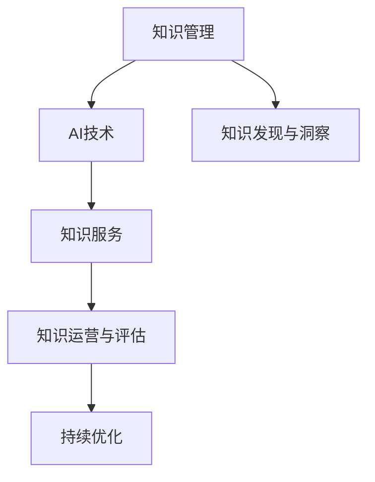

                 

# 企业知识管理的AI化转型策略

在数字经济时代，企业知识管理的AI化转型已经成为推动企业数字化、智能化、规模化发展的关键一步。通过AI技术，企业可以在知识获取、存储、共享和应用等方面实现质的飞跃，提升组织绩效和竞争力。本文将从背景介绍、核心概念、核心算法、项目实践、应用场景、工具推荐、未来展望等多个维度，详细阐述企业知识管理AI化转型的策略与方法。

## 1. 背景介绍

### 1.1 问题由来
随着互联网技术的快速发展和信息爆炸时代的到来，企业在知识管理方面面临着巨大挑战：

- **信息过载**：海量数据的涌现使得企业难以从海量的信息中筛选出有价值的内容。
- **知识孤岛**：企业内部的知识往往分散在不同部门、不同系统之间，难以形成统一的视角和协同机制。
- **知识更新滞后**：传统知识管理系统更新缓慢，无法及时响应外部环境的变化。
- **知识利用率低**：员工对知识的获取、共享和利用率较低，导致企业整体效率低下。

这些问题严重制约了企业的发展速度和创新能力。因此，将AI技术引入知识管理领域，提升知识管理的智能化水平，已经成为企业数字化转型的重要方向。

### 1.2 问题核心关键点
企业知识管理的AI化转型主要关注以下几个关键点：

- **数据集成与治理**：通过AI技术对企业内外部的数据进行集成和治理，消除数据孤岛。
- **知识发现与洞察**：利用机器学习、自然语言处理等技术，从大量数据中自动挖掘出有价值的知识和洞见。
- **知识服务与推荐**：构建基于AI的知识服务平台，为员工提供智能化的知识服务与推荐。
- **知识运营与评估**：通过AI技术对知识运营效果进行实时监测与评估，优化知识管理策略。

通过AI技术，企业可以实现从数据到知识再到行动的全链条智能化管理，大幅提升知识管理的效率和效果。

## 2. 核心概念与联系

### 2.1 核心概念概述

为更好地理解企业知识管理的AI化转型策略，本文将介绍几个密切相关的核心概念：

- **知识管理(Knowledge Management, KM)**：通过各种工具、技术手段，整合、共享、应用企业内部外的各类知识，提升组织绩效。
- **AI(Artificial Intelligence)**：利用计算机技术模拟人类智能行为，实现决策、推理、学习等功能。
- **AI驱动的知识管理(AI-Driven Knowledge Management, AI-KM)**：将AI技术引入知识管理流程中，提升知识管理的智能化水平。
- **知识服务**：通过AI技术构建的知识服务平台，提供智能化的知识服务与推荐，满足企业知识应用需求。
- **知识发现与洞察**：通过机器学习、自然语言处理等技术，自动挖掘和提炼企业知识，提升决策依据的科学性和准确性。

这些核心概念之间的逻辑关系可以通过以下Mermaid流程图来展示：



这个流程图展示出知识管理与AI技术的融合路径：

1. 知识管理利用AI技术进行智能化转型。
2. 知识发现与洞察通过AI技术从数据中挖掘出有价值的知识。
3. 知识服务通过AI技术提供智能化的知识应用服务。
4. 知识运营与评估通过AI技术实现实时监测与优化。

## 3. 核心算法原理 & 具体操作步骤

### 3.1 算法原理概述

企业知识管理的AI化转型，本质上是将AI技术应用于知识管理过程，提升各环节的自动化和智能化水平。其核心思想是：

- **数据集成与治理**：使用数据清洗、标注、融合等技术，构建统一的知识图谱和数据湖。
- **知识发现与洞察**：利用机器学习、深度学习等技术，对知识图谱进行模式挖掘和关联分析，自动发现隐含的知识洞见。
- **知识服务与推荐**：构建基于知识图谱的推荐系统，为员工提供个性化的知识服务与推荐。
- **知识运营与评估**：使用AI技术对知识运营效果进行实时监测与评估，持续优化知识管理策略。

基于上述核心思想，本文将详细介绍每个环节的算法原理与操作步骤。

### 3.2 算法步骤详解

#### 3.2.1 数据集成与治理

数据集成与治理是企业知识管理的第一步，主要涉及数据清洗、标注、融合等技术。具体步骤如下：

1. **数据清洗**：使用自然语言处理(NLP)技术，对原始数据进行去重、纠错、规范等处理，确保数据的完整性和准确性。
2. **数据标注**：通过人工标注或自动标注技术，给数据打上关键词、标签等元数据，便于后续的知识发现和检索。
3. **数据融合**：使用数据融合技术，将企业内外部的数据进行统一，构建统一的知识图谱，消除数据孤岛。

#### 3.2.2 知识发现与洞察

知识发现与洞察是通过机器学习和深度学习等技术，从数据中挖掘出有价值的知识洞见。具体步骤如下：

1. **特征提取**：使用NLP技术，从文本数据中提取出关键词、词频、主题等特征。
2. **模型训练**：使用监督学习或无监督学习技术，训练知识发现模型，如文本分类、聚类、关联规则挖掘等。
3. **知识洞见**：通过模型输出，自动发现企业知识中的隐含关联、趋势、模式等洞见。

#### 3.2.3 知识服务与推荐

知识服务与推荐是通过构建基于知识图谱的推荐系统，为员工提供智能化的知识服务与推荐。具体步骤如下：

1. **知识图谱构建**：使用知识图谱构建技术，将企业知识进行结构化表示，形成知识节点和关系图。
2. **推荐算法设计**：设计推荐算法，如基于协同过滤、基于内容的推荐等，为员工提供个性化的知识推荐。
3. **推荐系统实现**：实现推荐系统，提供知识服务与推荐功能，提升知识获取和应用效率。

#### 3.2.4 知识运营与评估

知识运营与评估是通过AI技术对知识运营效果进行实时监测与评估，持续优化知识管理策略。具体步骤如下：

1. **运营监测**：使用数据监测技术，实时收集知识运营过程中的各项指标，如知识使用率、知识共享率等。
2. **效果评估**：使用评估模型，如回归分析、聚类分析等，对知识运营效果进行评估，找出问题与改进点。
3. **策略优化**：根据评估结果，持续优化知识管理策略，提升知识运营效果。

### 3.3 算法优缺点

企业知识管理的AI化转型策略具有以下优点：

1. **效率提升**：AI技术可以自动处理大量数据，大大提升知识管理的效率和速度。
2. **质量提升**：AI技术可以发现隐藏的关联和洞见，提升知识发现的准确性和全面性。
3. **个性化服务**：基于AI的推荐系统可以提供个性化的知识服务，满足不同员工的需求。
4. **运营优化**：AI技术可以对知识运营效果进行实时监测与评估，持续优化知识管理策略。

同时，该策略也存在一定的局限性：

1. **初始投入高**：引入AI技术需要大量的资金投入和专业人才。
2. **数据质量要求高**：AI技术对数据质量要求较高，需要保证数据完整性、准确性和一致性。
3. **技术复杂性高**：AI技术的应用涉及多学科知识，技术实现复杂。
4. **隐私安全问题**：AI技术涉及大量数据处理，需要考虑隐私保护和数据安全问题。

尽管存在这些局限性，但AI驱动的企业知识管理转型已经成为企业数字化转型的重要方向，具有广泛的应用前景。

### 3.4 算法应用领域

AI驱动的企业知识管理策略，已经在多个领域得到了成功应用，具体包括：

- **金融行业**：通过AI技术对金融数据进行整合、分析，提升风险控制、投资决策等能力。
- **制造业**：通过AI技术对生产数据进行实时监测、优化，提升生产效率和质量。
- **医疗健康**：通过AI技术对医疗数据进行整合、分析，提升诊断和治疗效果。
- **零售行业**：通过AI技术对消费数据进行挖掘、分析，提升营销策略和客户服务。
- **公共管理**：通过AI技术对公共数据进行整合、分析，提升公共服务水平和政策效果。

此外，AI驱动的知识管理技术也在人力资源管理、物流管理、教育培训等多个领域展现出巨大潜力。未来，随着AI技术的进一步成熟和普及，企业知识管理的AI化转型将覆盖更多行业，带来更深的业务变革。

## 4. 数学模型和公式 & 详细讲解 & 举例说明

### 4.1 数学模型构建

本文将使用数学语言对企业知识管理的AI化转型策略进行更加严格的刻画。

记企业知识管理的输入数据为 $X$，输出结果为 $Y$，AI驱动的知识发现与洞察过程可以表示为如下数学模型：

$$
Y = f(X; \theta)
$$

其中 $f$ 为模型函数，$\theta$ 为模型参数。在实际应用中，可以使用各种机器学习模型，如决策树、随机森林、深度学习模型等，对输入数据进行建模和分析。

### 4.2 公式推导过程

以基于知识图谱的推荐系统为例，推导其数学模型和公式。

设企业知识图谱为 $G(V, E)$，其中 $V$ 为知识节点，$E$ 为知识关系。推荐系统可以表示为如下模型：

$$
\hat{Y} = \text{Embedding}(X; \theta) \cdot \text{Similarity}(\text{Embedding}(X; \theta), \text{Embedding}(Y; \theta))
$$

其中 $\text{Embedding}$ 为知识节点的嵌入函数，$\text{Similarity}$ 为知识节点之间的相似度函数。

通过上述模型，可以计算每个知识节点与推荐节点的相似度，选择相似度最高的节点作为推荐结果。具体步骤如下：

1. **节点嵌入**：使用嵌入函数 $\text{Embedding}$，将知识节点 $X$ 转换为向量表示 $\text{Embedding}(X; \theta)$。
2. **相似度计算**：使用相似度函数 $\text{Similarity}$，计算推荐节点 $Y$ 与知识节点 $X$ 的相似度 $\text{Similarity}(\text{Embedding}(X; \theta), \text{Embedding}(Y; \theta))$。
3. **推荐结果**：选择相似度最高的知识节点作为推荐结果 $\hat{Y}$。

### 4.3 案例分析与讲解

以金融行业的风险控制为例，说明企业知识管理的AI化转型策略的应用。

设金融机构的客户数据为 $X$，风险控制结果为 $Y$，AI驱动的知识发现与洞察过程可以表示为如下数学模型：

$$
Y = f(X; \theta)
$$

其中 $f$ 为风险控制模型，$\theta$ 为模型参数。在实际应用中，可以使用各种机器学习模型，如决策树、随机森林、深度学习模型等，对客户数据进行建模和分析。

具体步骤如下：

1. **数据清洗**：使用自然语言处理(NLP)技术，对原始数据进行去重、纠错、规范等处理，确保数据的完整性和准确性。
2. **特征提取**：使用NLP技术，从文本数据中提取出关键词、词频、主题等特征。
3. **模型训练**：使用监督学习或无监督学习技术，训练风险控制模型，如信用评分、违约预测等。
4. **风险控制**：通过模型输出，自动发现客户中的高风险个体，进行风险控制和预警。

通过AI技术，金融机构可以实现从数据到知识再到行动的全链条智能化管理，大幅提升风险控制的效果和效率。

## 5. 项目实践：代码实例和详细解释说明

### 5.1 开发环境搭建

在进行企业知识管理的AI化转型策略的开发实践前，我们需要准备好开发环境。以下是使用Python进行PyTorch开发的环境配置流程：

1. 安装Anaconda：从官网下载并安装Anaconda，用于创建独立的Python环境。

2. 创建并激活虚拟环境：
```bash
conda create -n pytorch-env python=3.8 
conda activate pytorch-env
```

3. 安装PyTorch：根据CUDA版本，从官网获取对应的安装命令。例如：
```bash
conda install pytorch torchvision torchaudio cudatoolkit=11.1 -c pytorch -c conda-forge
```

4. 安装TensorFlow：由Google主导开发的开源深度学习框架，生产部署方便，适合大规模工程应用。同样有丰富的预训练语言模型资源。

5. 安装各类工具包：
```bash
pip install numpy pandas scikit-learn matplotlib tqdm jupyter notebook ipython
```

完成上述步骤后，即可在`pytorch-env`环境中开始开发实践。

### 5.2 源代码详细实现

下面我们以金融行业的信用评分系统为例，给出使用PyTorch进行信用评分系统的代码实现。

首先，定义信用评分系统的训练数据和模型结构：

```python
import torch
import torch.nn as nn
from torch.utils.data import Dataset, DataLoader
from sklearn.preprocessing import LabelEncoder

class CreditDataset(Dataset):
    def __init__(self, X, y):
        self.X = X
        self.y = y
        self.label_encoder = LabelEncoder()
        self.y = self.label_encoder.fit_transform(self.y)

    def __len__(self):
        return len(self.X)

    def __getitem__(self, idx):
        x = self.X.iloc[idx].values
        y = self.y[idx]
        return x, y

class CreditModel(nn.Module):
    def __init__(self):
        super(CreditModel, self).__init__()
        self.layers = nn.Sequential(
            nn.Linear(10, 64),
            nn.ReLU(),
            nn.Linear(64, 64),
            nn.ReLU(),
            nn.Linear(64, 1)
        )

    def forward(self, x):
        x = self.layers(x)
        return x
```

然后，定义模型训练函数：

```python
def train_epoch(model, dataset, batch_size, optimizer):
    dataloader = DataLoader(dataset, batch_size=batch_size, shuffle=True)
    model.train()
    epoch_loss = 0
    for batch in tqdm(dataloader, desc='Training'):
        x, y = batch
        x = torch.tensor(x, dtype=torch.float32)
        y = torch.tensor(y, dtype=torch.float32)
        model.zero_grad()
        outputs = model(x)
        loss = nn.BCELoss()(outputs, y)
        epoch_loss += loss.item()
        loss.backward()
        optimizer.step()
    return epoch_loss / len(dataloader)
```

接着，定义模型评估函数：

```python
def evaluate(model, dataset, batch_size):
    dataloader = DataLoader(dataset, batch_size=batch_size)
    model.eval()
    preds, labels = [], []
    with torch.no_grad():
        for batch in tqdm(dataloader, desc='Evaluating'):
            x, y = batch
            x = torch.tensor(x, dtype=torch.float32)
            y = torch.tensor(y, dtype=torch.float32)
            outputs = model(x)
            batch_preds = outputs.sigmoid() > 0.5
            batch_labels = y
            for pred, label in zip(batch_preds, batch_labels):
                preds.append(pred.item())
                labels.append(label.item())
                
    print('Accuracy: {:.2f}%'.format(100 * sum(preds) / len(preds)))
```

最后，启动训练流程并在测试集上评估：

```python
epochs = 10
batch_size = 64
learning_rate = 0.001

model = CreditModel()
optimizer = torch.optim.Adam(model.parameters(), lr=learning_rate)

X_train = # 训练数据
y_train = # 训练标签
X_test = # 测试数据
y_test = # 测试标签

dataset_train = CreditDataset(X_train, y_train)
dataset_test = CreditDataset(X_test, y_test)

for epoch in range(epochs):
    loss = train_epoch(model, dataset_train, batch_size, optimizer)
    print('Epoch {}/{} - Loss: {:.4f}'.format(epoch+1, epochs, loss))

    evaluate(model, dataset_test, batch_size)
```

以上就是使用PyTorch进行金融行业信用评分系统开发的完整代码实现。可以看到，得益于PyTorch的强大封装，我们可以用相对简洁的代码完成信用评分模型的训练和评估。

### 5.3 代码解读与分析

让我们再详细解读一下关键代码的实现细节：

**CreditDataset类**：
- `__init__`方法：初始化训练数据和标签，并对标签进行编码处理。
- `__len__`方法：返回数据集的样本数量。
- `__getitem__`方法：对单个样本进行处理，将训练数据和标签转换为Tensor格式。

**CreditModel类**：
- `__init__`方法：定义模型的网络结构，使用两个全连接层和一个ReLU激活函数。
- `forward`方法：定义前向传播过程，输入数据经过多层的线性变换和ReLU激活，最终输出信用评分。

**train_epoch函数**：
- 定义训练数据的批次加载器，循环迭代每个批次数据。
- 在每个批次上前向传播计算输出，并反向传播更新模型参数。

**evaluate函数**：
- 定义测试数据的批次加载器，循环迭代每个批次数据。
- 在每个批次上前向传播计算输出，并计算预测值与真实标签的匹配度。

**训练流程**：
- 定义总的epoch数和batch size，开始循环迭代。
- 每个epoch内，先在训练集上训练，输出平均loss。
- 在测试集上评估，输出预测准确率。

可以看到，PyTorch配合TensorFlow的强大封装，使得信用评分系统的开发实现变得简洁高效。开发者可以将更多精力放在数据处理、模型改进等高层逻辑上，而不必过多关注底层的实现细节。

当然，工业级的系统实现还需考虑更多因素，如模型的保存和部署、超参数的自动搜索、更灵活的任务适配层等。但核心的微调范式基本与此类似。

## 6. 实际应用场景

### 6.1 金融行业的风险控制

金融行业需要实时监测和控制客户风险，及时识别和预警高风险客户，避免潜在的金融风险。传统的人工监测方式成本高、效率低，难以应对网络时代海量信息爆发的挑战。基于AI驱动的知识管理技术，可以实现更加高效、精准的风险控制。

具体而言，可以收集金融领域相关的新闻、报道、评论等文本数据，并对其进行主题标注和情感标注。在此基础上对预训练语言模型进行微调，使其能够自动判断客户的行为特征，识别出高风险客户。将微调后的模型应用到实时抓取的网络文本数据，就能够自动监测不同客户的行为模式，一旦发现异常行为，系统便会自动预警，帮助金融机构快速应对潜在风险。

### 6.2 制造业的生产优化

制造业生产过程中，数据量庞大且具有复杂的时序关系。通过AI技术对生产数据进行整合、分析和优化，可以大幅提升生产效率和质量。

具体而言，可以收集制造企业的设备运行数据、生产流程数据、人员操作数据等，并对其进行清洗、处理和分析。使用深度学习模型对生产数据进行建模，自动发现生产过程中的异常和瓶颈，提出优化建议。将微调后的模型应用到实时生产环境中，可以及时调整生产计划，避免生产停滞和资源浪费。

### 6.3 医疗行业的精准诊疗

医疗行业需要快速、准确地对患者进行诊断和治疗。传统的医疗诊断依赖于医生经验，容易受到主观因素的影响。基于AI技术，可以实现更加客观、准确的医疗诊断。

具体而言，可以收集医疗领域相关的病例数据、检查数据、实验室数据等，并对其进行清洗、处理和分析。使用深度学习模型对医疗数据进行建模，自动发现疾病的早期症状和趋势，提出治疗建议。将微调后的模型应用到临床实践中，可以及时发现患者的病情变化，提供个性化的治疗方案，提升医疗效果。

## 7. 工具和资源推荐

### 7.1 学习资源推荐

为了帮助开发者系统掌握企业知识管理的AI化转型策略，这里推荐一些优质的学习资源：

1. 《深度学习基础》系列博文：介绍深度学习的基本概念和数学原理，是进入AI领域的入门读物。

2. 《TensorFlow官方文档》：由Google开发的深度学习框架，官方文档详细介绍了各种深度学习模型的实现方法和应用场景。

3. 《PyTorch官方文档》：由Facebook开发的深度学习框架，官方文档提供了丰富的模型示例和API文档，便于快速上手实践。

4. Kaggle数据科学竞赛平台：提供大量数据集和模型库，是学习深度学习和AI技术的绝佳资源。

5. Coursera《深度学习专项课程》：由斯坦福大学教授Andrew Ng主讲，详细介绍了深度学习的理论和实践，是深入学习AI技术的推荐课程。

通过对这些资源的学习实践，相信你一定能够快速掌握企业知识管理的AI化转型的精髓，并用于解决实际的业务问题。

### 7.2 开发工具推荐

高效的开发离不开优秀的工具支持。以下是几款用于企业知识管理AI化转型的常用工具：

1. PyTorch：基于Python的开源深度学习框架，灵活动态的计算图，适合快速迭代研究。

2. TensorFlow：由Google主导开发的开源深度学习框架，生产部署方便，适合大规模工程应用。

3. Scikit-Learn：基于Python的机器学习库，提供了丰富的数据处理和模型训练函数，便于快速开发和实验。

4. Weights & Biases：模型训练的实验跟踪工具，可以记录和可视化模型训练过程中的各项指标，方便对比和调优。

5. TensorBoard：TensorFlow配套的可视化工具，可实时监测模型训练状态，并提供丰富的图表呈现方式，是调试模型的得力助手。

6. Jupyter Notebook：开源的交互式编程环境，支持Python、R等多种编程语言，便于编写和分享研究笔记。

合理利用这些工具，可以显著提升企业知识管理的AI化转型的开发效率，加快创新迭代的步伐。

### 7.3 相关论文推荐

企业知识管理的AI化转型技术的发展源于学界的持续研究。以下是几篇奠基性的相关论文，推荐阅读：

1. Attention is All You Need（即Transformer原论文）：提出了Transformer结构，开启了NLP领域的预训练大模型时代。

2. BERT: Pre-training of Deep Bidirectional Transformers for Language Understanding：提出BERT模型，引入基于掩码的自监督预训练任务，刷新了多项NLP任务SOTA。

3. Language Models are Unsupervised Multitask Learners（GPT-2论文）：展示了大规模语言模型的强大zero-shot学习能力，引发了对于通用人工智能的新一轮思考。

4. Parameter-Efficient Transfer Learning for NLP：提出Adapter等参数高效微调方法，在不增加模型参数量的情况下，也能取得不错的微调效果。

5. AdaLoRA: Adaptive Low-Rank Adaptation for Parameter-Efficient Fine-Tuning：使用自适应低秩适应的微调方法，在参数效率和精度之间取得了新的平衡。

这些论文代表了大语言模型微调技术的发展脉络。通过学习这些前沿成果，可以帮助研究者把握学科前进方向，激发更多的创新灵感。

## 8. 总结：未来发展趋势与挑战

### 8.1 总结

本文对企业知识管理的AI化转型策略进行了全面系统的介绍。首先阐述了企业知识管理面临的问题和挑战，明确了AI技术在提升知识管理智能化水平方面的重要性。其次，从原理到实践，详细讲解了数据集成与治理、知识发现与洞察、知识服务与推荐、知识运营与评估等关键环节的算法原理和操作步骤，给出了具体的代码实现。最后，本文还探讨了AI技术在金融、制造、医疗等多个领域的实际应用场景，推荐了相关的学习资源、开发工具和研究论文，力求为读者提供全方位的技术指引。

通过本文的系统梳理，可以看到，AI驱动的企业知识管理转型策略已经成为企业数字化转型的重要方向，其成功的关键在于将AI技术与业务需求紧密结合，构建智能化、自动化、高效化的知识管理平台。AI技术的引入，使得企业能够从海量数据中挖掘出有价值的知识洞见，提升决策的科学性和准确性，实现知识的高效利用和应用。未来，随着AI技术的不断成熟和普及，企业知识管理的AI化转型必将带来更深的业务变革和更高的运营效率。

### 8.2 未来发展趋势

展望未来，企业知识管理的AI化转型策略将呈现以下几个发展趋势：

1. **数据质量持续提升**：随着数据采集技术的不断进步，企业的数据质量将进一步提升，为AI驱动的知识管理提供更优质的数据基础。

2. **知识图谱的应用深化**：企业知识图谱的应用将越来越广泛，成为知识发现、知识服务的基础设施，进一步提升知识管理的智能化水平。

3. **AI技术的多样化应用**：未来的企业知识管理将不仅仅局限于数据驱动的机器学习，还将引入更多的AI技术，如强化学习、认知计算等，提升知识管理的深度和广度。

4. **个性化知识服务**：基于AI技术的推荐系统将更加精准，为员工提供个性化的知识服务与推荐，提升知识获取和应用效率。

5. **知识运营的实时化**：未来的企业知识管理将实现实时监测与评估，持续优化知识管理策略，提升运营效率。

6. **跨领域的知识整合**：未来的企业知识管理将更加注重跨领域知识的整合，将不同领域的知识进行融合，提升知识管理的全面性和系统性。

以上趋势凸显了AI驱动的企业知识管理转型的广阔前景。这些方向的探索发展，必将进一步提升知识管理的效率和效果，推动企业数字化、智能化、规模化发展。

### 8.3 面临的挑战

尽管AI驱动的企业知识管理转型策略取得了显著成果，但在迈向更加智能化、普适化应用的过程中，仍面临诸多挑战：

1. **数据隐私保护**：在数据驱动的知识管理过程中，涉及大量敏感数据，如何保护用户隐私和数据安全是一个重要问题。

2. **模型的可解释性**：AI驱动的知识管理模型往往是“黑盒”系统，难以解释其内部工作机制和决策逻辑，这给业务应用带来了风险。

3. **模型的公平性**：AI技术可能会学习到有偏见、有害的信息，如何消除模型偏见，确保输出符合伦理道德，需要进一步探索。

4. **模型的鲁棒性**：AI模型面对复杂、多变的环境，鲁棒性不足，容易出现错误的决策。

5. **跨领域知识的整合**：不同领域的知识具有不同的结构和表示方式，如何高效融合，是知识管理中的重要挑战。

6. **资源投入的高成本**：引入AI技术需要大量资金投入和专业人才，对企业资源和成本提出了较高要求。

尽管存在这些挑战，但AI驱动的企业知识管理转型策略具有广阔的应用前景，将为企业带来巨大的经济效益和社会价值。未来，随着AI技术的进一步成熟和普及，这些挑战也将逐渐得到解决，推动企业知识管理的AI化转型走向更加成熟和稳健。

### 8.4 研究展望

面对AI驱动的企业知识管理转型策略所面临的挑战，未来的研究需要在以下几个方面寻求新的突破：

1. **数据隐私保护技术**：开发更高效的数据隐私保护技术，如差分隐私、联邦学习等，确保数据安全。

2. **模型可解释性技术**：引入因果推断、对抗学习等技术，提升AI模型的可解释性和透明度。

3. **模型公平性保障**：建立模型公平性评估指标，检测和纠正模型偏见，确保输出符合伦理道德。

4. **模型的鲁棒性提升**：引入对抗训练、鲁棒性评估等技术，提升AI模型的鲁棒性和稳定性。

5. **跨领域知识整合技术**：开发跨领域知识融合算法，如多模态融合、知识图谱构建等，提升知识管理的全面性和系统性。

6. **资源优化技术**：开发更高效的数据压缩、模型裁剪、硬件优化等技术，降低资源投入成本。

这些研究方向的探索，必将引领AI驱动的企业知识管理转型走向更高的台阶，为企业带来更高效、更安全、更智能的知识管理平台。面向未来，AI技术将继续与知识管理紧密结合，推动企业数字化、智能化、规模化发展。

## 9. 附录：常见问题与解答

**Q1：企业知识管理的AI化转型需要哪些关键技术？**

A: 企业知识管理的AI化转型需要以下关键技术：

1. **数据清洗与标注**：对企业内部和外部的数据进行清洗、标注和融合。
2. **知识发现与洞察**：利用机器学习和深度学习技术，从数据中挖掘出有价值的知识洞见。
3. **知识图谱构建**：构建知识图谱，表示企业知识的关系和结构。
4. **推荐系统设计**：设计基于知识图谱的推荐系统，为员工提供个性化的知识服务与推荐。
5. **知识运营与评估**：使用AI技术对知识运营效果进行实时监测与评估，持续优化知识管理策略。

这些关键技术共同构成了AI驱动的企业知识管理转型的核心框架，助力企业实现知识的高效利用和应用。

**Q2：企业知识管理的AI化转型需要投入哪些资源？**

A: 企业知识管理的AI化转型需要以下资源：

1. **数据资源**：需要收集和整理大量的企业内外数据，确保数据的质量和完整性。
2. **技术资源**：需要引入AI技术，如深度学习、自然语言处理等，开发和部署智能化的知识管理平台。
3. **人才资源**：需要招聘和培养AI领域的技术人才，确保技术落地和应用效果。
4. **资金资源**：需要投入大量的资金，购买高性能计算设备和软硬件设施，支持技术研究和系统开发。

这些资源投入是企业知识管理的AI化转型的基础，只有全面投入，才能实现知识管理的智能化和高效化。

**Q3：企业知识管理的AI化转型如何确保数据隐私保护？**

A: 企业知识管理的AI化转型需要确保数据隐私保护，具体措施包括：

1. **数据脱敏**：在数据清洗和处理过程中，对敏感数据进行脱敏处理，防止数据泄露。
2. **差分隐私**：使用差分隐私技术，对数据进行扰动，保护用户隐私。
3. **联邦学习**：采用联邦学习技术，在本地设备上训练模型，不将数据上传至集中服务器，保护数据隐私。
4. **安全传输**：采用安全传输协议，如HTTPS、TLS等，确保数据在传输过程中的安全性。

这些措施可以确保数据隐私保护，保障企业知识管理的AI化转型顺利进行。

**Q4：企业知识管理的AI化转型如何确保模型的可解释性？**

A: 企业知识管理的AI化转型需要确保模型的可解释性，具体措施包括：

1. **因果推断**：引入因果推断技术，解释模型的决策逻辑和推理过程。
2. **对抗学习**：使用对抗样本训练模型，增强模型的鲁棒性和可解释性。
3. **模型可视化**：使用模型可视化工具，如TensorBoard、Weights & Biases等，展示模型的结构和参数变化。
4. **解释模型输出**：开发解释模型输出的技术，如LIME、SHAP等，帮助用户理解模型输出。

这些措施可以确保模型的可解释性，提升企业知识管理的透明度和可信度。

**Q5：企业知识管理的AI化转型如何应对模型的公平性问题？**

A: 企业知识管理的AI化转型需要应对模型的公平性问题，具体措施包括：

1. **公平性评估**：开发公平性评估指标，检测和纠正模型偏见。
2. **公平性训练**：在模型训练过程中，加入公平性约束，避免模型学习到偏见。
3. **公平性数据**：使用公平性数据集，训练公平性模型。
4. **公平性监控**：持续监控模型在实际应用中的公平性表现，及时调整和优化。

这些措施可以确保模型的公平性，提升企业知识管理的公正性和可信度。

---

作者：禅与计算机程序设计艺术 / Zen and the Art of Computer Programming

