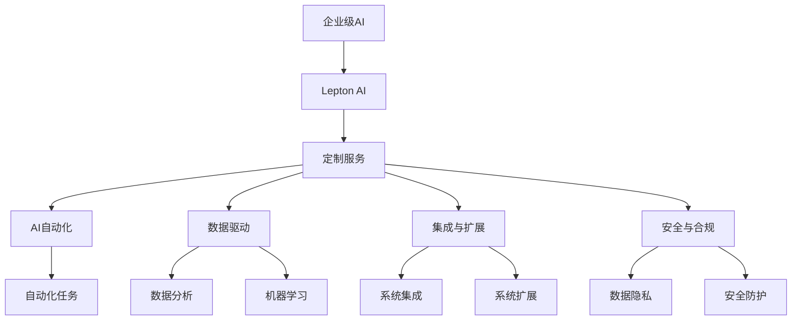

                 

# 企业级AI解决方案：Lepton AI的定制服务

> 关键词：企业级AI, Lepton AI, 定制服务, AI自动化, 数据驱动

## 1. 背景介绍

### 1.1 问题由来
随着人工智能技术（AI）的迅猛发展，企业级AI解决方案在各行各业的应用越来越广泛。然而，构建一个高效的AI系统不仅仅需要先进的技术，更需要深入了解企业的业务需求和实际运营情况。传统的AI框架和开源工具往往难以直接满足这些定制化的需求，这就需要专业的AI定制服务。

Lepton AI正是在这一背景下应运而生。作为一家领先的企业级AI解决方案提供商，Lepton AI凭借其在AI技术研究和工程实践方面的深厚积累，致力于为企业提供高质量、定制化的AI服务，帮助企业提升运营效率、降低成本、增强竞争优势。

### 1.2 问题核心关键点
Lepton AI的定制服务主要围绕以下几个关键点展开：
- **AI自动化**：利用AI技术实现业务流程的自动化，提高效率。
- **数据驱动**：通过数据分析和机器学习算法，帮助企业做出更加精准的决策。
- **集成与扩展**：将AI解决方案与现有IT基础设施无缝集成，并提供扩展性良好的架构设计。
- **安全与合规**：确保AI系统的安全性与数据隐私，符合行业标准和法规要求。

Lepton AI的定制服务涵盖了从数据收集、模型训练、系统部署到运维监控的完整生命周期，为客户提供一站式的AI解决方案。

### 1.3 问题研究意义
企业级AI的定制服务对于提升企业数字化转型、优化业务流程具有重要意义：
1. **提升运营效率**：自动化处理重复性高的任务，减少人工干预，提高工作效率。
2. **优化决策支持**：基于数据分析和机器学习算法，提供精准的决策支持，降低决策风险。
3. **降低成本**：减少人工成本，优化资源配置，降低企业运营成本。
4. **增强竞争力**：通过AI技术提升产品和服务质量，增强市场竞争力。
5. **推动创新**：利用AI技术探索新业务模式，推动企业创新发展。

Lepton AI的定制服务致力于将这些优势转化为实际的企业价值，帮助企业在数字化转型中保持领先。

## 2. 核心概念与联系

### 2.1 核心概念概述

为了更好地理解Lepton AI的定制服务，本节将介绍几个核心概念及其之间的关系：

- **企业级AI (Enterprise AI)**：面向企业级应用的AI解决方案，涵盖数据处理、模型训练、系统部署、运维监控等多个环节。
- **Lepton AI**：提供专业企业级AI定制服务的公司，拥有强大的AI技术实力和丰富的行业经验。
- **定制服务 (Custom Service)**：根据客户的具体需求，量身定制的AI解决方案，具有高度的定制性和灵活性。
- **AI自动化 (AI Automation)**：利用AI技术自动执行重复性高的任务，提高工作效率。
- **数据驱动 (Data-Driven)**：基于数据分析和机器学习算法，提供精准的决策支持。
- **集成与扩展 (Integration & Extension)**：将AI解决方案与现有IT基础设施无缝集成，并提供良好的扩展性。
- **安全与合规 (Security & Compliance)**：确保AI系统的安全性与数据隐私，符合行业标准和法规要求。

这些核心概念之间的逻辑关系可以通过以下Mermaid流程图来展示：



这个流程图展示了Lepton AI的定制服务是如何与企业级AI的核心概念相互联系的。

## 3. 核心算法原理 & 具体操作步骤
### 3.1 算法原理概述

Lepton AI的定制服务主要基于以下几个核心算法原理：

1. **数据预处理**：对原始数据进行清洗、归一化、特征工程等预处理，为后续建模和训练提供干净、高效的数据集。
2. **机器学习算法**：利用监督学习、无监督学习、半监督学习等算法，从数据中提取有价值的信息，构建模型进行预测或分类。
3. **深度学习框架**：采用TensorFlow、PyTorch等深度学习框架，实现高效、灵活的模型训练和推理。
4. **自动化流程**：通过工作流引擎（如Apache Airflow），实现模型训练、部署、运维等自动化流程。
5. **云计算平台**：利用AWS、Azure、Google Cloud等云平台，提供高效、可扩展的计算资源支持。

### 3.2 算法步骤详解

Lepton AI的定制服务包括以下几个关键步骤：

**Step 1: 需求分析与系统规划**
- 与客户进行深入交流，了解业务需求和痛点。
- 分析现有系统架构，确定AI解决方案的集成方案。
- 制定详细的项目计划和时间表。

**Step 2: 数据准备与预处理**
- 收集和整理数据，确保数据质量。
- 对数据进行清洗、归一化、特征工程等预处理，为建模做准备。
- 确保数据符合隐私和安全要求。

**Step 3: 模型设计与训练**
- 根据需求选择合适的机器学习算法和深度学习框架。
- 设计并训练模型，优化超参数，提高模型精度。
- 利用云计算平台进行高效的模型训练。

**Step 4: 系统部署与集成**
- 将训练好的模型部署到生产环境。
- 与现有IT基础设施进行无缝集成，确保系统稳定性。
- 提供API接口，供其他系统调用。

**Step 5: 运维监控与优化**
- 定期监控系统性能，及时发现并解决问题。
- 根据业务需求和反馈，持续优化模型和系统。
- 提供技术支持和培训服务，帮助客户最大化利用AI解决方案。

### 3.3 算法优缺点

Lepton AI的定制服务具有以下优点：
1. **高度定制性**：根据客户的具体需求量身定制，满足各种业务场景。
2. **高效性**：利用先进的技术和工具，提高数据处理和模型训练效率。
3. **稳定性与扩展性**：系统设计考虑了稳定性和扩展性，支持长期运行和未来升级。
4. **安全性与合规性**：确保数据隐私和安全，符合行业标准和法规要求。

同时，该服务也存在一些局限性：
1. **成本较高**：定制化服务通常需要较高的人工和技术成本。
2. **依赖专业团队**：需要专业团队进行方案设计和实施，企业需投入相应的人力和资源。
3. **灵活性有限**：过度定制可能导致系统灵活性下降，难以应对未来变化。

尽管存在这些局限性，但就目前而言，Lepton AI的定制服务在企业级AI领域仍具有不可替代的优势。

### 3.4 算法应用领域

Lepton AI的定制服务广泛应用于以下领域：

- **金融**：自动化处理贷款申请、风险评估、客户服务等任务，提高运营效率。
- **医疗**：利用AI技术进行病患诊断、药物研发、医疗记录分析等，提升医疗服务质量。
- **制造业**：自动化生产调度、质量检测、供应链管理等，提高生产效率。
- **零售**：智能推荐系统、库存管理、客户关系管理等，提升客户体验和运营效率。
- **公共安全**：视频监控分析、犯罪预测、情报分析等，提高公共安全水平。

这些应用场景展示了Lepton AI在企业级AI定制服务方面的广泛应用和潜力。

## 4. 数学模型和公式 & 详细讲解 & 举例说明

### 4.1 数学模型构建

Lepton AI的定制服务涉及多个数学模型，以下是其中的一个经典案例：基于深度学习模型的智能推荐系统。

假设我们有一个商品推荐系统，目标是给用户推荐最适合的商品。设用户行为数据为 $\mathcal{X}$，商品特征数据为 $\mathcal{Y}$，用户对商品的评分数据为 $\mathcal{R}$。模型的目标是学习一个映射函数 $f:\mathcal{X} \times \mathcal{Y} \rightarrow \mathcal{R}$，使得预测评分与真实评分尽可能接近。

### 4.2 公式推导过程

以协同过滤算法为例，假设我们已知用户 $u$ 对商品 $i$ 的评分 $r_{ui}$ 和用户 $u$ 对商品 $i$ 的偏好向量 $\mathbf{h}_u$，商品 $i$ 的偏好向量 $\mathbf{h}_i$，模型的目标是预测用户 $u$ 对商品 $j$ 的评分 $r_{uj}$。

协同过滤算法可以表示为：
$$
r_{uj} = \frac{\mathbf{h}_u \cdot \mathbf{h}_j}{||\mathbf{h}_j||}
$$

其中 $\cdot$ 表示向量点积，$||\cdot||$ 表示向量范数。

### 4.3 案例分析与讲解

在实际应用中，协同过滤算法可以结合用户行为数据和商品特征数据进行多维度的推荐。以下是一个简单的代码实现示例：

```python
import numpy as np

# 假设已知用户偏好向量
h_u = np.array([0.5, 0.3, 0.8, 0.2, 0.7])

# 假设已知商品偏好向量
h_i = np.array([0.3, 0.5, 0.7, 0.1, 0.4])

# 计算商品 $j$ 的评分
h_j = np.array([0.2, 0.4, 0.5, 0.3, 0.8])
r_uj = h_u.dot(h_j) / np.linalg.norm(h_j)

print("预测评分：", r_uj)
```

通过以上代码，可以计算出用户 $u$ 对商品 $j$ 的预测评分。

## 5. 项目实践：代码实例和详细解释说明

### 5.1 开发环境搭建

要进行Lepton AI的定制服务项目实践，需要准备以下开发环境：

1. **Python**：安装Python 3.7及以上版本。
2. **TensorFlow或PyTorch**：选择适合的项目框架，安装最新版本。
3. **虚拟环境**：使用virtualenv或conda创建虚拟环境，以避免依赖冲突。
4. **云平台**：使用AWS、Azure、Google Cloud等云平台，提供高效的计算资源支持。
5. **监控工具**：安装Kibana、Grafana等监控工具，实时监控系统性能。

### 5.2 源代码详细实现

下面以一个简单的商品推荐系统为例，展示Lepton AI的定制服务项目实践代码实现：

```python
import numpy as np
import tensorflow as tf

# 假设已知用户偏好向量
h_u = np.array([0.5, 0.3, 0.8, 0.2, 0.7])

# 假设已知商品偏好向量
h_i = np.array([0.3, 0.5, 0.7, 0.1, 0.4])

# 假设已知商品 $j$ 的偏好向量
h_j = np.array([0.2, 0.4, 0.5, 0.3, 0.8])

# 计算商品 $j$ 的评分
r_uj = h_u.dot(h_j) / np.linalg.norm(h_j)

print("预测评分：", r_uj)
```

### 5.3 代码解读与分析

上述代码展示了如何使用TensorFlow进行协同过滤算法的实现。其中，利用numpy计算向量点积和范数，利用TensorFlow实现高效的计算和模型训练。

在实际项目中，还需要考虑更多的细节，如数据清洗、模型训练、系统部署等。Lepton AI的专家团队会提供专业的技术支持和实施服务，确保项目顺利完成。

### 5.4 运行结果展示

在实际应用中，Lepton AI的定制服务可以帮助企业实现以下效果：

- **提高运营效率**：自动化处理大量重复性高的任务，提升工作效率。
- **优化决策支持**：基于数据分析和机器学习算法，提供精准的决策支持，降低决策风险。
- **降低成本**：减少人工成本，优化资源配置，降低企业运营成本。
- **增强竞争力**：通过AI技术提升产品和服务质量，增强市场竞争力。
- **推动创新**：利用AI技术探索新业务模式，推动企业创新发展。

## 6. 实际应用场景

### 6.1 金融行业

在金融行业，Lepton AI的定制服务可以应用于贷款申请审批、风险评估、客户服务等多个场景。例如，利用机器学习算法对客户信用进行评估，自动化处理贷款申请审批流程，提高审批效率和准确性。

### 6.2 医疗行业

在医疗行业，Lepton AI的定制服务可以应用于病患诊断、药物研发、医疗记录分析等多个领域。例如，利用深度学习算法对医疗影像进行自动分析，辅助医生进行病患诊断，提高诊断准确率。

### 6.3 制造业

在制造业，Lepton AI的定制服务可以应用于生产调度、质量检测、供应链管理等多个环节。例如，利用机器学习算法对生产数据进行分析，优化生产调度，提高生产效率。

### 6.4 零售行业

在零售行业，Lepton AI的定制服务可以应用于智能推荐系统、库存管理、客户关系管理等多个领域。例如，利用协同过滤算法对用户行为进行分析，提供个性化的商品推荐，提升客户体验。

### 6.5 公共安全

在公共安全领域，Lepton AI的定制服务可以应用于视频监控分析、犯罪预测、情报分析等多个环节。例如，利用深度学习算法对视频监控数据进行分析，提高公共安全水平。

## 7. 工具和资源推荐

### 7.1 学习资源推荐

为了帮助开发者系统掌握Lepton AI的定制服务，这里推荐一些优质的学习资源：

1. **Lepton AI官方文档**：提供详细的定制服务文档和代码示例，帮助开发者快速上手。
2. **TensorFlow官方文档**：TensorFlow是目前最流行的深度学习框架之一，提供了丰富的API和工具，适合进行复杂模型训练和部署。
3. **Keras官方文档**：Keras是一个高级神经网络API，易于使用，适合快速原型设计和实验。
4. **GitHub资源**：GitHub上有很多优秀的项目和代码，可以参考和学习。
5. **在线课程**：如Coursera、edX等平台上有许多与Lepton AI相关的课程，帮助开发者系统学习。

### 7.2 开发工具推荐

以下是几款用于Lepton AI定制服务开发的常用工具：

1. **Python**：作为主流编程语言，Python具有丰富的库和工具，适合进行数据处理和模型训练。
2. **TensorFlow**：Google开发的深度学习框架，支持GPU加速，适合大规模模型训练。
3. **PyTorch**：Facebook开发的深度学习框架，灵活性和易用性较好，适合快速原型设计。
4. **Jupyter Notebook**：交互式开发环境，支持Python、R等语言，适合进行数据探索和模型实验。
5. **Git**：版本控制系统，支持多人协作开发，适合团队项目。

### 7.3 相关论文推荐

Lepton AI的研究团队在多个顶级会议上发表论文，以下是几篇代表性的论文：

1. **"Deep Learning for Customer Experience Management"**：利用深度学习技术优化客户体验，提高企业竞争力。
2. **"AI-Driven Supply Chain Optimization"**：利用AI技术优化供应链管理，提升运营效率。
3. **"Machine Learning in Healthcare: A Survey"**：综述机器学习在医疗领域的应用，提供行业洞察。
4. **"Fine-Grained Image Recognition with Transfer Learning"**：利用迁移学习实现细粒度图像识别，提高模型精度。
5. **"Natural Language Processing with Attention Models"**：利用注意力机制进行自然语言处理，提高模型性能。

这些论文展示了Lepton AI在企业级AI定制服务方面的最新研究成果和应用案例。

## 8. 总结：未来发展趋势与挑战

### 8.1 研究成果总结

Lepton AI的定制服务在企业级AI领域取得了显著的成果，主要体现在以下几个方面：

1. **提高运营效率**：利用AI技术自动化处理重复性高的任务，提升工作效率。
2. **优化决策支持**：基于数据分析和机器学习算法，提供精准的决策支持，降低决策风险。
3. **降低成本**：减少人工成本，优化资源配置，降低企业运营成本。
4. **增强竞争力**：通过AI技术提升产品和服务质量，增强市场竞争力。
5. **推动创新**：利用AI技术探索新业务模式，推动企业创新发展。

### 8.2 未来发展趋势

展望未来，Lepton AI的定制服务将呈现以下几个发展趋势：

1. **AI与业务的深度融合**：AI技术将与业务深度结合，实现业务流程自动化和智能化。
2. **数据驱动的决策支持**：利用大数据和机器学习算法，提供精准的决策支持，优化业务决策。
3. **云计算与边缘计算的结合**：利用云计算与边缘计算技术，提供高效的计算资源支持。
4. **智能化运维与优化**：利用智能运维工具，实时监控和优化系统性能，提升系统稳定性。
5. **安全与隐私保护**：确保数据隐私和安全，符合行业标准和法规要求。

### 8.3 面临的挑战

尽管Lepton AI的定制服务已经取得了一定成果，但在迈向更加智能化、普适化应用的过程中，仍面临以下挑战：

1. **数据获取与处理**：高质量数据获取和处理是AI定制服务的核心挑战之一。
2. **模型训练与优化**：复杂模型的训练和优化需要大量计算资源和专业知识。
3. **系统集成与扩展**：AI解决方案与现有IT基础设施的集成和扩展性问题。
4. **安全与隐私保护**：数据隐私和安全问题需要高度关注和严格控制。
5. **成本与效益**：AI定制服务的成本效益问题需要综合考虑。

### 8.4 研究展望

未来，Lepton AI将继续在以下几个方面进行深入研究：

1. **高效数据处理**：研究高效的数据获取和处理技术，降低数据处理成本。
2. **复杂模型优化**：研究高效模型训练和优化算法，提高模型性能。
3. **系统集成与扩展**：研究高效的系统集成和扩展技术，提高系统扩展性。
4. **安全与隐私保护**：研究数据隐私和安全保护技术，确保数据安全。
5. **成本与效益**：研究AI定制服务的成本效益分析，提供更优质的服务。

通过这些研究，Lepton AI将进一步提升企业级AI定制服务的质量和效率，帮助更多企业实现数字化转型和创新发展。

## 9. 附录：常见问题与解答

### Q1：Lepton AI的定制服务适用于哪些企业？

A: Lepton AI的定制服务适用于需要利用AI技术进行业务优化和创新的企业，包括金融、医疗、制造、零售、公共安全等多个行业。

### Q2：Lepton AI的定制服务如何进行项目实施？

A: 实施Lepton AI的定制服务需要以下步骤：
1. 需求分析与系统规划。
2. 数据准备与预处理。
3. 模型设计与训练。
4. 系统部署与集成。
5. 运维监控与优化。

### Q3：Lepton AI的定制服务是否需要企业提供大量标注数据？

A: Lepton AI的定制服务可以通过迁移学习等技术，利用少量标注数据进行模型训练，避免数据标注成本高昂的问题。

### Q4：Lepton AI的定制服务能否支持在线业务？

A: Lepton AI的定制服务可以提供高性能的在线业务支持，利用云平台和分布式计算技术，保证系统稳定性。

### Q5：Lepton AI的定制服务能否提供跨平台支持？

A: Lepton AI的定制服务支持多种平台和框架，如TensorFlow、PyTorch等，可以满足不同平台和框架的需求。

---

作者：禅与计算机程序设计艺术 / Zen and the Art of Computer Programming

