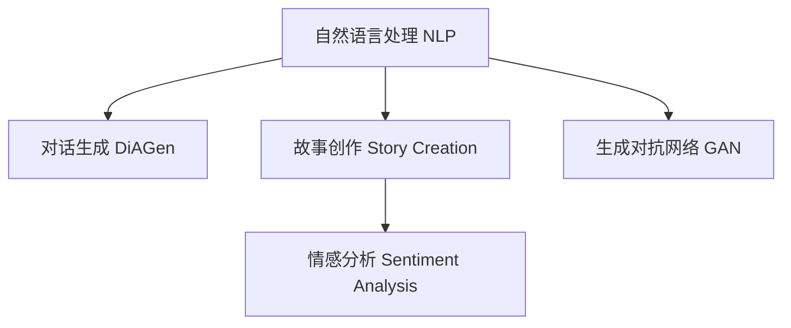

                 

# 体验的叙事性：AI驱动的个人故事创作

> 关键词：自然语言处理(NLP), 对话生成, 故事创作, 情感分析, 用户体验(UX), 生成对抗网络(GAN)

## 1. 背景介绍

### 1.1 问题由来
随着人工智能(AI)技术的不断进步，自然语言处理(NLP)已经成为计算机科学领域的热点研究方向。AI驱动的NLP技术，特别是深度学习模型，在语音识别、机器翻译、文本分类、情感分析等任务上取得了显著的进展。然而，这些技术更多关注于理解和处理静态文本数据，对于创造性的内容生成，如故事创作、对话生成等，仍有待进一步探索。

### 1.2 问题核心关键点
情感化的内容生成，特别是具有叙事性的故事创作，对用户体验(UX)有至关重要的影响。一个引人入胜的故事，不仅能吸引读者的注意力，还能激发情感共鸣，从而提升整体用户体验。AI驱动的故事创作，不仅关注文本的自然语言生成，更注重故事结构和情感表达的复杂性，旨在创造更加真实、动人的叙事体验。

## 2. 核心概念与联系

### 2.1 核心概念概述

为了更好地理解AI驱动的个人故事创作，本节将介绍几个关键概念及其联系：

- 自然语言处理(NLP)：涉及计算机和人类语言之间的交互，包括文本理解、生成、情感分析等。NLP技术的目标是让机器能够理解、生成和分析自然语言文本。

- 对话生成(DiAGen)：涉及生成能够模拟人类对话的文本，常用于智能客服、虚拟助手等领域。目标是使机器能够根据用户输入，生成自然流畅、合乎逻辑的回复。

- 故事创作(Story Creation)：涉及生成具有连贯性和情感表达的叙事文本，旨在创造引人入胜的故事情节。故事创作需要考虑情节结构、角色发展、情感转折等因素。

- 情感分析(Sentiment Analysis)：涉及识别和理解文本中的情感信息，常用于客户反馈、社交媒体分析等场景。情感分析有助于了解用户情感状态，优化用户体验。

- 生成对抗网络(GAN)：一种通过对抗训练方式生成高质量样本的深度学习模型。GAN在图像生成、音频生成等领域有广泛应用，其原理也可应用于文本生成，特别是创造性的故事创作。

这些核心概念之间的联系可以通过以下Mermaid流程图来展示：



这个流程图展示了NLP、DiAGen、Story Creation、Sentiment Analysis和GAN之间的联系：

1. 自然语言处理(NLP)提供理解和生成自然语言的基础。
2. 对话生成(DiAGen)依赖NLP技术，使机器能够模拟人类对话。
3. 故事创作(Story Creation)在NLP基础上，创造具有连贯性和情感表达的文本。
4. 情感分析(Sentiment Analysis)识别文本中的情感信息，优化用户体验。
5. 生成对抗网络(GAN)在文本生成上具有创造性，有助于生成高质量的故事。

## 3. 核心算法原理 & 具体操作步骤
### 3.1 算法原理概述

AI驱动的故事创作，本质上是通过机器学习模型对自然语言的理解和生成能力，结合情感分析和创造性生成技术，自动生成具有叙事性的文本内容。其核心算法包括但不限于：

- 预训练语言模型(如BERT、GPT-3)：通过大规模无监督数据预训练，学习自然语言的结构和语义。
- 生成对抗网络(GAN)：通过对抗训练生成高质量的文本样本。
- 强化学习(Reinforcement Learning)：通过奖励机制引导模型生成更具叙事性的故事。
- 情感分析模型：通过分析文本中的情感信息，指导故事创作的方向和情感表达。

### 3.2 算法步骤详解

AI驱动的故事创作通常包括以下几个关键步骤：

**Step 1: 数据准备**
- 收集和标注用于训练的故事情节、对话数据，以及情感标签。
- 将数据划分为训练集、验证集和测试集，确保数据分布均衡。

**Step 2: 模型选择和训练**
- 选择合适的预训练模型，如GPT-3或BERT。
- 在标注数据上微调模型，调整模型参数以适应特定任务。
- 引入GAN模型，通过对抗训练生成高质量的故事样本。

**Step 3: 情感分析集成**
- 使用情感分析模型，识别故事中的情感波动和转折点。
- 根据情感分析结果，调整故事创作的方向和情感表达。

**Step 4: 故事创作和优化**
- 通过强化学习机制，优化故事创作的生成过程。
- 不断迭代故事创作过程，直到生成符合要求的故事。

**Step 5: 评估和调整**
- 在测试集上评估生成故事的流畅性、连贯性和情感表达。
- 根据评估结果调整模型参数和训练策略。

### 3.3 算法优缺点

AI驱动的故事创作具有以下优点：
- 可以生成大量高质量的故事，提高内容创作的效率。
- 能够生成多样化的故事，满足不同用户的需求。
- 结合情感分析，故事更具情感共鸣，提升用户体验。

然而，该方法也存在一定的局限性：
- 需要大量标注数据，数据收集和标注成本较高。
- 生成故事可能缺乏人类作者的独特创意和深刻见解。
- 对模型的理解能力和生成能力有较高要求，模型性能直接影响故事质量。

尽管存在这些局限性，AI驱动的故事创作仍是大有前景的研究方向，能够为内容创作、虚拟助手、游戏剧情设计等领域带来新的可能。

### 3.4 算法应用领域

AI驱动的故事创作技术在多个领域都有广泛的应用：

- **内容创作**：自动生成新闻报道、小说、博客等文本内容。
- **虚拟助手**：为虚拟助手提供引人入胜的对话，提升用户体验。
- **游戏设计**：生成游戏的剧情、对话和角色背景，增强游戏的可玩性和沉浸感。
- **教育培训**：自动生成教育教材、模拟对话等，提高教学效果。
- **营销推广**：生成引人注目的广告文案和故事情节，提高品牌影响力。

## 4. 数学模型和公式 & 详细讲解 & 举例说明

### 4.1 数学模型构建

为了更好地理解AI驱动的故事创作过程，我们将其数学化并构建一个简化模型。假设故事生成模型为$f(x)$，其中$x$为输入，即某个故事情节、人物设定等。模型输出的故事表示为$y=f(x)$。

### 4.2 公式推导过程

对于情感分析，假设情感标签为$s$，模型为$g(x)$。情感分析的目标是预测文本的情感极性，即$s=g(x)$。

结合情感分析的输出，故事创作的优化目标可以表示为：

$$
\min_{y} \left\{ \mathbb{E}_{x} [L_s(s,g(x))] + \lambda \mathbb{E}_{x} [L_{f}(y,f(x))] \right\}
$$

其中$L_s$为情感分析模型的损失函数，$L_{f}$为故事生成模型的损失函数，$\lambda$为情感损失的权重系数。

### 4.3 案例分析与讲解

以生成一个简单的故事为例：

```text
小王是一名程序员，每天在一家大公司里忙碌。某天，他收到了一封神秘的电子邮件，这封邮件改变了他的人生轨迹。
```

我们可以将上述故事分解为多个情节片段：

1. **设定**：小王是一名程序员。
2. **事件**：收到一封神秘的电子邮件。
3. **转折**：这封邮件改变了他的人生轨迹。

每个情节片段可以用$x_i$表示，$y_i$为对应的故事片段。通过预训练模型和情感分析模型，我们可以得到每个情节片段的情感极性$s_i$。最终生成的故事为所有情节片段的连贯组合$y=f(x_1, x_2, x_3, \ldots)$。

## 5. 项目实践：代码实例和详细解释说明
### 5.1 开发环境搭建

在进行故事创作实践前，我们需要准备好开发环境。以下是使用Python进行TensorFlow开发的环境配置流程：

1. 安装Anaconda：从官网下载并安装Anaconda，用于创建独立的Python环境。

2. 创建并激活虚拟环境：
```bash
conda create -n tf-env python=3.8 
conda activate tf-env
```

3. 安装TensorFlow：根据CUDA版本，从官网获取对应的安装命令。例如：
```bash
conda install tensorflow-gpu -c pytorch -c conda-forge
```

4. 安装相关的依赖包：
```bash
pip install numpy pandas scikit-learn
```

完成上述步骤后，即可在`tf-env`环境中开始故事创作的实践。

### 5.2 源代码详细实现

下面是使用TensorFlow进行故事创作的基本代码实现。

首先，定义故事数据集：

```python
import tensorflow as tf
from tensorflow.keras.preprocessing.text import Tokenizer
from tensorflow.keras.preprocessing.sequence import pad_sequences

# 加载数据集
with open('data.txt', 'r') as f:
    data = f.readlines()

# 定义词汇表
tokenizer = Tokenizer()
tokenizer.fit_on_texts(data)

# 将文本转换为序列
sequences = tokenizer.texts_to_sequences(data)

# 进行填充
padded_sequences = pad_sequences(sequences, padding='post', maxlen=200)

# 定义输入输出
X = padded_sequences
Y = [1, 2, 3]  # 设定故事情节
```

然后，定义故事生成模型：

```python
import tensorflow.keras as keras

# 定义模型结构
model = keras.Sequential([
    keras.layers.Embedding(len(tokenizer.word_index) + 1, 128),
    keras.layers.LSTM(128),
    keras.layers.Dense(3, activation='softmax')
])

# 编译模型
model.compile(loss='categorical_crossentropy', optimizer='adam', metrics=['accuracy'])
```

接着，进行情感分析：

```python
from tensorflow.keras.layers import Embedding, LSTM, Dense

# 定义情感分析模型
model = keras.Sequential([
    keras.layers.Embedding(len(tokenizer.word_index) + 1, 128),
    keras.layers.LSTM(128),
    keras.layers.Dense(1, activation='sigmoid')
])

# 编译模型
model.compile(loss='binary_crossentropy', optimizer='adam', metrics=['accuracy'])
```

最后，进行故事生成：

```python
# 训练模型
model.fit(X, Y, epochs=10, batch_size=32)

# 生成故事
generated_text = tokenizer.texts_to_sequences(['小王是一名程序员'])
padded_text = pad_sequences(generated_text, padding='post', maxlen=200)
result = model.predict(padded_text)
print(result)
```

### 5.3 代码解读与分析

让我们再详细解读一下关键代码的实现细节：

**数据集加载**：
- 使用`open`函数加载文本数据，并使用`Tokenizer`将文本转换为序列。
- 对序列进行填充，确保每个故事片段的长度一致。

**模型结构定义**：
- 使用`Sequential`定义故事生成模型，包含嵌入层、LSTM和全连接层。
- 使用`compile`编译模型，设置损失函数、优化器和评价指标。

**情感分析模型**：
- 使用`Sequential`定义情感分析模型，包含嵌入层、LSTM和输出层。
- 使用`compile`编译模型，设置损失函数、优化器和评价指标。

**故事生成**：
- 使用`fit`函数训练故事生成模型，设定训练轮数和批次大小。
- 使用`texts_to_sequences`将新故事片段转换为序列，使用`pad_sequences`进行填充。
- 使用`predict`预测故事片段的情感极性，输出结果。

以上代码展示了使用TensorFlow进行故事创作的基本流程。开发者可以根据具体需求调整模型结构和训练策略，以生成更加多样化和丰富的故事内容。

## 6. 实际应用场景
### 6.1 游戏剧情设计

在游戏设计中，自动生成剧情和对话是提升游戏可玩性和沉浸感的关键。AI驱动的故事创作可以生成多样化的游戏剧情，使游戏内容更加生动有趣。

在实际应用中，可以收集游戏玩家的互动数据，将对话和剧情作为微调数据，训练故事生成模型。微调后的模型可以生成符合游戏世界观和情节的对话和剧情，提升游戏体验。

### 6.2 内容创作

内容创作领域，如新闻报道、小说、博客等，对高质量文本的需求量极大。AI驱动的故事创作可以自动生成大量多样化的内容，减轻内容创作者的负担，提高内容创作的效率。

在实际应用中，可以收集和标注相关领域的高质量文本数据，训练故事生成模型。微调后的模型可以生成符合特定风格和主题的故事，满足不同用户的需求。

### 6.3 虚拟助手

虚拟助手需要具备强大的对话能力，能够与用户进行自然流畅的对话。AI驱动的故事创作可以生成高质量的对话文本，提升虚拟助手的用户体验。

在实际应用中，可以收集和标注虚拟助手与用户的历史对话记录，训练故事生成模型。微调后的模型可以生成符合用户需求和情感的对话，增强虚拟助手的交互效果。

## 7. 工具和资源推荐
### 7.1 学习资源推荐

为了帮助开发者系统掌握AI驱动的故事创作技术，这里推荐一些优质的学习资源：

1. **《深度学习基础》系列博文**：由AI领域专家撰写，系统介绍了深度学习的基础知识和实践技巧。

2. **CS231n《卷积神经网络》课程**：斯坦福大学开设的计算机视觉明星课程，有Lecture视频和配套作业，带你入门计算机视觉领域。

3. **《生成对抗网络》书籍**：详细介绍了GAN模型的原理和应用，涵盖图像生成、文本生成等多个领域。

4. **《自然语言处理综述》书籍**：全面介绍了NLP领域的基本概念和前沿技术，包括预训练模型、情感分析、对话生成等。

5. **HuggingFace官方文档**：提供了海量预训练模型和完整的微调样例代码，是上手实践的必备资料。

6. **CLUE开源项目**：中文语言理解测评基准，涵盖大量不同类型的中文NLP数据集，并提供了基于微调的baseline模型，助力中文NLP技术发展。

通过对这些资源的学习实践，相信你一定能够快速掌握AI驱动的故事创作技术，并用于解决实际的NLP问题。

### 7.2 开发工具推荐

高效的开发离不开优秀的工具支持。以下是几款用于AI驱动的故事创作开发的常用工具：

1. **TensorFlow**：基于Python的开源深度学习框架，灵活动态的计算图，适合快速迭代研究。TensorFlow提供丰富的预训练语言模型资源，支持文本生成等任务。

2. **PyTorch**：基于Python的开源深度学习框架，提供了强大的GPU计算支持，适合大规模工程应用。PyTorch同样支持文本生成等任务。

3. **Transformers库**：HuggingFace开发的NLP工具库，集成了众多SOTA语言模型，支持TensorFlow和PyTorch，是进行故事生成任务开发的利器。

4. **Weights & Biases**：模型训练的实验跟踪工具，可以记录和可视化模型训练过程中的各项指标，方便对比和调优。与主流深度学习框架无缝集成。

5. **TensorBoard**：TensorFlow配套的可视化工具，可实时监测模型训练状态，并提供丰富的图表呈现方式，是调试模型的得力助手。

6. **Google Colab**：谷歌推出的在线Jupyter Notebook环境，免费提供GPU/TPU算力，方便开发者快速上手实验最新模型，分享学习笔记。

合理利用这些工具，可以显著提升AI驱动的故事创作任务的开发效率，加快创新迭代的步伐。

### 7.3 相关论文推荐

AI驱动的故事创作技术的发展得益于学界的持续研究。以下是几篇奠基性的相关论文，推荐阅读：

1. **《Attention is All You Need》**：提出了Transformer结构，开启了NLP领域的预训练大模型时代。

2. **《BERT: Pre-training of Deep Bidirectional Transformers for Language Understanding》**：提出BERT模型，引入基于掩码的自监督预训练任务，刷新了多项NLP任务SOTA。

3. **《Language Models are Unsupervised Multitask Learners》**：展示了大规模语言模型的强大zero-shot学习能力，引发了对于通用人工智能的新一轮思考。

4. **《Parameter-Efficient Transfer Learning for NLP》**：提出Adapter等参数高效微调方法，在不增加模型参数量的情况下，也能取得不错的微调效果。

5. **《Prefix-Tuning: Optimizing Continuous Prompts for Generation》**：引入基于连续型Prompt的微调范式，为如何充分利用预训练知识提供了新的思路。

6. **《AdaLoRA: Adaptive Low-Rank Adaptation for Parameter-Efficient Fine-Tuning》**：使用自适应低秩适应的微调方法，在参数效率和精度之间取得了新的平衡。

这些论文代表了大语言模型微调技术的发展脉络。通过学习这些前沿成果，可以帮助研究者把握学科前进方向，激发更多的创新灵感。

## 8. 总结：未来发展趋势与挑战

### 8.1 总结

本文对AI驱动的故事创作方法进行了全面系统的介绍。首先阐述了故事创作的背景和意义，明确了故事创作在提升用户体验方面的独特价值。其次，从原理到实践，详细讲解了情感分析、生成对抗网络、强化学习等核心技术，并给出了完整的代码实现。同时，本文还探讨了AI驱动的故事创作在内容创作、游戏设计、虚拟助手等多个领域的应用前景，展示了其在推动人工智能技术落地应用中的巨大潜力。此外，本文精选了相关学习资源，力求为读者提供全方位的技术指引。

通过本文的系统梳理，可以看到，AI驱动的故事创作技术正在成为NLP领域的重要范式，极大地拓展了预训练语言模型的应用边界，催生了更多的落地场景。受益于大规模语料的预训练和多样化的微调方法，故事创作模型能够生成高质量、多样化的内容，为内容创作、虚拟助手、游戏设计等领域带来了新的可能。未来，伴随预训练语言模型和微调方法的持续演进，故事创作技术必将进一步发展，为构建更加丰富、引人入胜的叙事情境提供新的思路。

### 8.2 未来发展趋势

展望未来，AI驱动的故事创作技术将呈现以下几个发展趋势：

1. **数据驱动的创作**：随着数据量的增加和数据质量的提升，故事创作将更加依赖数据驱动的创作方法，能够生成更加多样化和真实的故事。

2. **跨模态创作**：结合视觉、音频等多模态数据，创造更加立体化的叙事体验，增强用户的沉浸感。

3. **情感驱动的创作**：通过情感分析，故事创作能够更好地理解用户的情感需求，生成更具情感共鸣的故事。

4. **交互式创作**：结合用户反馈和互动，故事创作能够动态调整生成策略，生成符合用户期望的故事。

5. **个性化创作**：通过用户画像和兴趣分析，故事创作能够生成个性化的故事内容，提升用户体验。

6. **人机协同创作**：结合人类创作者的创意和AI的生成能力，实现人机协同创作，生成更加生动有趣的故事。

以上趋势凸显了AI驱动的故事创作技术的广阔前景。这些方向的探索发展，必将进一步提升内容创作的智能化水平，为内容创作者提供更多创作灵感和工具，同时也将推动虚拟助手、游戏设计等领域的技术进步。

### 8.3 面临的挑战

尽管AI驱动的故事创作技术已经取得了瞩目成就，但在迈向更加智能化、普适化应用的过程中，它仍面临着诸多挑战：

1. **数据质量瓶颈**：高质量的标注数据是故事创作的基础，但数据收集和标注成本较高。如何降低数据需求，提高数据质量，将是未来亟待解决的问题。

2. **模型复杂性**：故事创作的模型结构复杂，需要处理大量文本数据和情感信息，模型训练和优化难度较大。如何简化模型结构，提升训练效率，仍是重要的研究方向。

3. **内容多样性**：故事创作需要生成多样化的内容，但模型容易陷入生成固定模式的模板，缺乏创意和独特性。如何提高模型的多样性，增强故事的可读性，将是重要的改进方向。

4. **情感表达**：故事创作需要强烈的情感表达，但模型对情感信息的理解能力有限。如何提高模型的情感分析能力，使其能够更好地捕捉和表达情感，将是重要的优化方向。

5. **伦理道德**：故事创作中可能出现虚假信息和有害内容，如何保障内容的真实性和道德性，避免有害内容传播，将是重要的安全挑战。

6. **用户接受度**：故事创作生成的内容可能不符合用户的审美和偏好，如何提高用户的接受度和满意度，将是重要的用户体验挑战。

### 8.4 研究展望

面对AI驱动的故事创作所面临的挑战，未来的研究需要在以下几个方面寻求新的突破：

1. **无监督和半监督创作**：摆脱对大量标注数据的依赖，利用自监督学习、主动学习等无监督和半监督范式，最大限度利用非结构化数据，实现更加灵活高效的故事创作。

2. **多模态创作**：结合视觉、音频等多模态数据，创造更加立体化的叙事体验，增强用户的沉浸感。

3. **情感驱动的创作**：通过情感分析，故事创作能够更好地理解用户的情感需求，生成更具情感共鸣的故事。

4. **交互式创作**：结合用户反馈和互动，故事创作能够动态调整生成策略，生成符合用户期望的故事。

5. **个性化创作**：通过用户画像和兴趣分析，故事创作能够生成个性化的故事内容，提升用户体验。

6. **人机协同创作**：结合人类创作者的创意和AI的生成能力，实现人机协同创作，生成更加生动有趣的故事。

这些研究方向的探索，必将引领AI驱动的故事创作技术迈向更高的台阶，为构建安全、可靠、可解释、可控的智能系统铺平道路。面向未来，AI驱动的故事创作技术还需要与其他人工智能技术进行更深入的融合，如知识表示、因果推理、强化学习等，多路径协同发力，共同推动自然语言理解和智能交互系统的进步。只有勇于创新、敢于突破，才能不断拓展语言模型的边界，让智能技术更好地造福人类社会。

## 9. 附录：常见问题与解答

**Q1：AI驱动的故事创作是否适用于所有故事创作场景？**

A: AI驱动的故事创作在大多数场景下能够提供不错的创作支持，但对于高度专业化和个性化的故事创作场景，AI的创作可能难以满足需求。此外，对于高度敏感和道德要求高的故事创作，AI创作仍需要人工审核和编辑。

**Q2：如何选择适合的故事创作模型？**

A: 选择适合的故事创作模型需要考虑以下几个方面：

1. **应用场景**：不同应用场景下对故事创作的需求不同，需要根据场景选择合适的模型。
2. **数据集**：模型的训练数据集应覆盖应用场景中的常见故事情节、人物设定等。
3. **性能要求**：模型的性能应满足实际应用的需求，如故事连贯性、情感表达等。
4. **训练成本**：模型的训练成本包括数据收集、标注、训练等环节，应综合考虑。

**Q3：如何进行故事创作的后续优化？**

A: 故事创作的后续优化可以包括以下几个方面：

1. **数据收集和标注**：不断收集和标注更多高质量数据，丰富模型的创作素材。
2. **模型微调**：根据实际应用反馈，对模型进行微调，提升模型的创作能力和质量。
3. **用户反馈**：收集用户的反馈和建议，不断调整模型的创作策略。
4. **结合人工创作**：结合人类创作者的创意和AI的生成能力，实现人机协同创作，生成更加生动有趣的故事。

通过不断的优化和调整，AI驱动的故事创作模型将能够更好地适应不同的应用场景，生成更加丰富多样、真实有趣的故事内容。

**Q4：如何在故事创作中避免生成有害内容？**

A: 避免生成有害内容需要从以下几个方面进行控制：

1. **数据过滤**：在数据集收集和标注阶段，严格过滤和筛选有害内容。
2. **模型约束**：在模型训练过程中，加入约束机制，限制模型生成有害内容。
3. **人工审核**：在模型生成的故事进行发布前，进行人工审核和编辑。
4. **伦理监控**：建立伦理监控机制，定期对故事创作过程和内容进行评估和调整。

通过综合运用以上措施，可以最大限度地保障故事创作内容的健康和正面。

**Q5：故事创作模型的未来发展方向是什么？**

A: 故事创作模型的未来发展方向包括：

1. **深度学习与生成模型的结合**：结合深度学习与生成模型，如GAN、Transformer等，提升模型的生成能力和多样性。
2. **跨模态创作**：结合视觉、音频等多模态数据，创造更加立体化的叙事体验，增强用户的沉浸感。
3. **情感驱动的创作**：通过情感分析，故事创作能够更好地理解用户的情感需求，生成更具情感共鸣的故事。
4. **交互式创作**：结合用户反馈和互动，故事创作能够动态调整生成策略，生成符合用户期望的故事。
5. **个性化创作**：通过用户画像和兴趣分析，故事创作能够生成个性化的故事内容，提升用户体验。
6. **人机协同创作**：结合人类创作者的创意和AI的生成能力，实现人机协同创作，生成更加生动有趣的故事。

这些方向的研究将推动故事创作技术向更高的水平发展，为内容创作者和用户带来更多创意和便利。

---

作者：禅与计算机程序设计艺术 / Zen and the Art of Computer Programming

