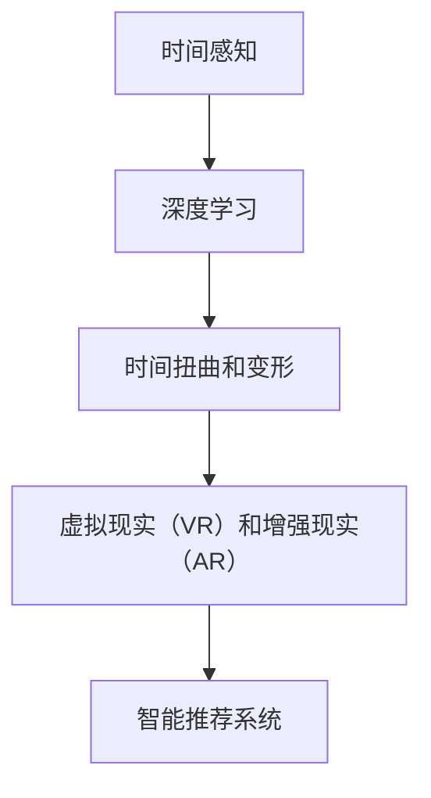

                 

# 体验的时间扭曲：AI创造的主观时间

## 1. 背景介绍

### 1.1 问题由来
在当今这个数据爆炸的时代，人工智能（AI）技术已经在诸多领域取得了显著的突破。无论是自然语言处理、计算机视觉、机器学习，还是自动驾驶，AI技术的应用已经深入到了我们的日常生活。然而，这些技术的发展，尤其是深度学习技术的进步，是否真的改变了我们的主观时间体验？

### 1.2 问题核心关键点
这个问题的答案，涉及到AI如何影响我们的时间感知，以及如何通过AI技术来创造出主观时间体验。通过深度学习技术，AI可以在不同的时间尺度上处理和分析信息，从而改变我们对时间的感知和体验。具体而言，我们可以从以下几个方面来探讨这个问题：

1. **时间处理和感知**：AI如何处理和感知时间，特别是在多任务和时间序列数据分析中。
2. **主观时间体验**：AI技术能否创造出主观的时间体验，如虚拟现实（VR）、增强现实（AR）等技术中，如何通过AI来设计时间感知。
3. **时间扭曲和变形**：AI技术如何通过数据处理和机器学习，改变我们对时间的理解和体验。
4. **时间感知和决策**：AI技术在时间感知和决策中的应用，如智能推荐系统、机器人决策等。

### 1.3 问题研究意义
探讨AI创造的主观时间体验，对于理解AI技术的潜在影响，以及如何利用AI技术来优化和改变我们的生活具有重要意义：

1. **提升生活体验**：通过AI技术，我们可以创造出更加丰富、沉浸式的时间体验，提高生活质量。
2. **优化决策过程**：AI技术可以帮助我们更好地理解时间和数据，从而在决策中更加准确和高效。
3. **推动技术进步**：研究AI如何改变时间感知，可以推动相关技术的进一步发展，如虚拟现实、增强现实等领域。

## 2. 核心概念与联系

### 2.1 核心概念概述

要深入理解AI创造的主观时间体验，我们需要掌握以下几个核心概念：

1. **时间感知**：指生物或机器对时间流逝的感知和理解。在AI中，时间感知可以通过时间序列数据分析和处理来实现。
2. **深度学习**：一种基于多层神经网络的机器学习技术，能够从大量数据中学习到复杂模式，并应用于时间序列分析等任务。
3. **时间扭曲和变形**：指通过机器学习技术，对时间序列数据进行处理，使其在特定的条件下产生时间上的扭曲或变形。
4. **虚拟现实（VR）和增强现实（AR）**：利用计算机生成或增强真实环境，提供沉浸式的时间体验。
5. **智能推荐系统**：通过分析用户行为和时间序列数据，为用户推荐个性化的内容或产品。

这些核心概念之间的逻辑关系可以通过以下Mermaid流程图来展示：



这个流程图展示了时间感知、深度学习、时间扭曲和变形、虚拟现实和增强现实、智能推荐系统之间的逻辑联系。

## 3. 核心算法原理 & 具体操作步骤
### 3.1 算法原理概述

AI创造的主观时间体验，主要依赖于深度学习技术，特别是时间序列数据分析和处理。其核心思想是：通过深度学习模型，对时间序列数据进行建模和预测，从而改变我们对时间的理解和感知。

具体而言，假设我们有一个时间序列数据集 $D=\{(t_i, x_i)\}_{i=1}^N$，其中 $t_i$ 表示时间点，$x_i$ 表示在时间点 $t_i$ 上的数据。深度学习模型 $M$ 可以学习到时间序列数据的模式和规律，并用于预测未来的时间点上的数据 $x_{t+1}$。

形式化地，我们可以使用一个时间序列模型 $M_{\theta}$，其中 $\theta$ 为模型的参数。假设我们希望模型能够预测未来的 $k$ 个时间点上的数据，即 $M_{\theta}(t_{t+1})$。预测的时间序列数据与真实数据之间的差异可以通过损失函数 $\mathcal{L}$ 来衡量。我们的目标是最小化损失函数 $\mathcal{L}$：

$$
\hat{\theta} = \mathop{\arg\min}_{\theta} \mathcal{L}(M_{\theta}(D))
$$

### 3.2 算法步骤详解

基于深度学习的时间序列分析，微调算法通常包括以下几个关键步骤：

**Step 1: 准备数据集**
- 收集时间序列数据，并将其划分为训练集、验证集和测试集。
- 对时间序列数据进行预处理，如归一化、缺失值填补等。

**Step 2: 选择合适的模型**
- 根据任务需求，选择合适的时间序列模型，如LSTM、GRU、RNN等。
- 设计损失函数和优化器，如均方误差损失、Adam优化器等。

**Step 3: 设置超参数**
- 确定模型的超参数，如隐藏层大小、学习率、批大小等。
- 设置训练的轮数和验证的频率。

**Step 4: 执行训练**
- 使用训练集对模型进行训练，并在验证集上进行验证。
- 根据验证结果调整超参数和模型结构。

**Step 5: 测试和部署**
- 在测试集上评估模型的性能。
- 部署模型到生产环境，进行实时数据预测。

### 3.3 算法优缺点

基于深度学习的时间序列分析有以下优点：

1. 能够处理时间序列数据中的复杂模式和规律。
2. 适用于多任务和时间序列预测等任务。
3. 能够提供未来时间点上的预测结果。

同时，该方法也存在一定的局限性：

1. 依赖于大量标注数据。时间序列数据的标注成本较高。
2. 容易过拟合。特别是当数据集较小或模型复杂度较高时，容易出现过拟合。
3. 需要较长的训练时间。时间序列数据通常较长，训练时间较长。
4. 难以解释模型的预测过程。深度学习模型通常被视为黑盒，难以解释其内部工作机制。

尽管存在这些局限性，但深度学习技术在时间序列分析中的应用，已经取得了显著的成果，并在多个领域得到了广泛应用。

### 3.4 算法应用领域

基于深度学习的时间序列分析，已经在多个领域得到了应用，例如：

1. **金融分析**：通过分析历史股票价格，预测未来的股票走势，帮助投资者进行决策。
2. **智能推荐系统**：分析用户行为和时间序列数据，为用户推荐个性化的内容或产品。
3. **自然语言处理**：通过分析时间序列的文本数据，进行情感分析、舆情监测等任务。
4. **交通管理**：分析交通流量数据，预测未来的交通状况，优化交通管理方案。
5. **工业控制**：通过分析设备运行数据，预测设备故障，进行维护和优化。

这些应用场景展示了深度学习在时间序列数据分析和处理中的强大能力。

## 4. 数学模型和公式 & 详细讲解 & 举例说明

### 4.1 数学模型构建

为了更好地理解基于深度学习的时间序列分析，我们需要构建数学模型。假设我们有一个时间序列数据集 $D=\{(t_i, x_i)\}_{i=1}^N$，其中 $t_i$ 表示时间点，$x_i$ 表示在时间点 $t_i$ 上的数据。

我们可以使用一个LSTM模型 $M_{\theta}$，其中 $\theta$ 为模型的参数。假设我们希望模型能够预测未来的 $k$ 个时间点上的数据，即 $M_{\theta}(t_{t+1})$。预测的时间序列数据与真实数据之间的差异可以通过损失函数 $\mathcal{L}$ 来衡量。我们的目标是最小化损失函数 $\mathcal{L}$：

$$
\hat{\theta} = \mathop{\arg\min}_{\theta} \mathcal{L}(M_{\theta}(D))
$$

假设我们的时间序列数据为 $x_i = (x_i^1, x_i^2, ..., x_i^N)$，其中 $x_i^j$ 表示时间点 $t_i$ 上的数据。我们可以使用LSTM模型进行建模，其输出为 $\hat{y}_i = (y_i^1, y_i^2, ..., y_i^N)$，其中 $y_i^j$ 表示模型预测的时间点 $t_i$ 上的数据。

### 4.2 公式推导过程

假设我们的LSTM模型输出为 $\hat{y}_i = (y_i^1, y_i^2, ..., y_i^N)$，其中 $y_i^j$ 表示模型预测的时间点 $t_i$ 上的数据。假设我们希望模型能够预测未来的 $k$ 个时间点上的数据，即 $M_{\theta}(t_{t+1})$。预测的时间序列数据与真实数据之间的差异可以通过损失函数 $\mathcal{L}$ 来衡量。我们的目标是最小化损失函数 $\mathcal{L}$：

$$
\hat{\theta} = \mathop{\arg\min}_{\theta} \mathcal{L}(M_{\theta}(D))
$$

假设我们的时间序列数据为 $x_i = (x_i^1, x_i^2, ..., x_i^N)$，其中 $x_i^j$ 表示时间点 $t_i$ 上的数据。我们可以使用LSTM模型进行建模，其输出为 $\hat{y}_i = (y_i^1, y_i^2, ..., y_i^N)$，其中 $y_i^j$ 表示模型预测的时间点 $t_i$ 上的数据。

假设我们的损失函数为均方误差损失函数，即：

$$
\mathcal{L}(\theta) = \frac{1}{N}\sum_{i=1}^N \sum_{j=1}^N (\hat{y}_i^j - x_i^j)^2
$$

其中 $\hat{y}_i^j$ 表示模型预测的时间点 $t_i$ 上的数据，$x_i^j$ 表示真实的时间点 $t_i$ 上的数据。

通过反向传播算法，我们可以计算损失函数对模型参数 $\theta$ 的梯度，并使用优化器更新模型参数。优化器的选择通常为Adam或SGD等。

### 4.3 案例分析与讲解

为了更好地理解基于深度学习的时间序列分析，我们可以用一个简单的案例进行分析。假设我们有一个股票价格时间序列数据集，其中包含了过去一年的股票价格数据。我们可以使用LSTM模型对未来的股票价格进行预测。

假设我们的LSTM模型输出为 $\hat{y}_i = (y_i^1, y_i^2, ..., y_i^N)$，其中 $y_i^j$ 表示模型预测的时间点 $t_i$ 上的股票价格。假设我们希望模型能够预测未来的 $k$ 个时间点上的股票价格，即 $M_{\theta}(t_{t+1})$。预测的股票价格与真实价格之间的差异可以通过损失函数 $\mathcal{L}$ 来衡量。我们的目标是最小化损失函数 $\mathcal{L}$：

$$
\hat{\theta} = \mathop{\arg\min}_{\theta} \mathcal{L}(M_{\theta}(D))
$$

假设我们的时间序列数据为 $x_i = (x_i^1, x_i^2, ..., x_i^N)$，其中 $x_i^j$ 表示时间点 $t_i$ 上的股票价格。我们可以使用LSTM模型进行建模，其输出为 $\hat{y}_i = (y_i^1, y_i^2, ..., y_i^N)$，其中 $y_i^j$ 表示模型预测的时间点 $t_i$ 上的股票价格。

假设我们的损失函数为均方误差损失函数，即：

$$
\mathcal{L}(\theta) = \frac{1}{N}\sum_{i=1}^N \sum_{j=1}^N (\hat{y}_i^j - x_i^j)^2
$$

其中 $\hat{y}_i^j$ 表示模型预测的时间点 $t_i$ 上的股票价格，$x_i^j$ 表示真实的时间点 $t_i$ 上的股票价格。

通过反向传播算法，我们可以计算损失函数对模型参数 $\theta$ 的梯度，并使用优化器更新模型参数。优化器的选择通常为Adam或SGD等。

## 5. 项目实践：代码实例和详细解释说明

### 5.1 开发环境搭建

在进行时间序列分析项目实践前，我们需要准备好开发环境。以下是使用Python进行TensorFlow开发的環境配置流程：

1. 安装Anaconda：从官网下载并安装Anaconda，用于创建独立的Python环境。

2. 创建并激活虚拟环境：
```bash
conda create -n tf-env python=3.8 
conda activate tf-env
```

3. 安装TensorFlow：根据CUDA版本，从官网获取对应的安装命令。例如：
```bash
conda install tensorflow -c pytorch -c conda-forge
```

4. 安装各类工具包：
```bash
pip install numpy pandas scikit-learn matplotlib tqdm jupyter notebook ipython
```

完成上述步骤后，即可在`tf-env`环境中开始时间序列分析实践。

### 5.2 源代码详细实现

下面我们以股票价格预测为例，给出使用TensorFlow进行时间序列分析的PyTorch代码实现。

首先，定义时间序列数据处理函数：

```python
import tensorflow as tf
import numpy as np
import pandas as pd

def preprocess_data(data):
    # 数据归一化
    data = (data - np.mean(data)) / np.std(data)
    # 填充缺失值
    data = data.interpolate(method='linear')
    # 将数据转换为numpy数组
    return np.array(data)

# 加载股票价格数据
data = pd.read_csv('stock_prices.csv')
# 归一化处理
data = preprocess_data(data['close'].values)

# 将数据分为训练集和测试集
train_start = 0
test_start = 60
train_data = data[:train_start]
test_data = data[train_start:test_start]

# 定义时间窗口大小和步长
window_size = 30
step_size = 1
```

然后，定义LSTM模型：

```python
model = tf.keras.Sequential([
    tf.keras.layers.LSTM(64, return_sequences=True, input_shape=(None, 1)),
    tf.keras.layers.Dropout(0.2),
    tf.keras.layers.LSTM(64),
    tf.keras.layers.Dropout(0.2),
    tf.keras.layers.Dense(1)
])

# 编译模型
model.compile(optimizer='adam', loss='mse', metrics=['mse'])
```

接着，定义训练和评估函数：

```python
from sklearn.metrics import mean_squared_error

def train_epoch(model, dataset, batch_size, optimizer):
    dataloader = tf.data.Dataset.from_tensor_slices(dataset).shuffle(buffer_size=1000).batch(batch_size)
    model.train_on_batch(dataloader)

def evaluate(model, dataset, batch_size):
    mse = mean_squared_error(dataset, model.predict(dataset))
    print(f"Mean Squared Error: {mse:.4f}")
```

最后，启动训练流程并在测试集上评估：

```python
epochs = 10
batch_size = 64

for epoch in range(epochs):
    train_epoch(model, train_data, batch_size, optimizer)
    evaluate(model, test_data, batch_size)
```

以上就是使用TensorFlow进行时间序列分析的完整代码实现。可以看到，得益于TensorFlow的强大封装，我们可以用相对简洁的代码完成LSTM模型的加载和训练。

### 5.3 代码解读与分析

让我们再详细解读一下关键代码的实现细节：

**preprocess_data函数**：
- 对时间序列数据进行归一化和填充缺失值，确保数据的质量。

**train_epoch和evaluate函数**：
- 使用TensorFlow的Dataset API进行数据批处理和模型训练，计算训练集和测试集的均方误差。

**训练流程**：
- 定义总的epoch数和batch size，开始循环迭代
- 每个epoch内，在训练集上训练，并在测试集上评估模型的性能
- 所有epoch结束后，评估模型的预测效果

可以看到，TensorFlow提供了丰富的API和工具，方便开发者快速进行时间序列分析的实践。

当然，工业级的系统实现还需考虑更多因素，如模型的保存和部署、超参数的自动搜索、更灵活的模型结构等。但核心的时间序列分析流程基本与此类似。

## 6. 实际应用场景
### 6.1 智能推荐系统

基于时间序列分析的智能推荐系统，可以实时分析用户行为数据，并根据历史数据预测未来的行为，从而为用户推荐个性化的内容或产品。在推荐系统中，时间序列分析可以用于分析用户的点击、浏览、购买等行为数据，预测用户未来的行为，提升推荐的精准度和个性化。

### 6.2 金融风险管理

金融领域的时间序列分析可以用于预测股票价格、货币汇率等金融数据的未来走势，帮助投资者和机构进行风险管理和决策。通过分析历史金融数据，预测未来的市场趋势，可以提前采取相应的风险控制措施。

### 6.3 自然语言处理

自然语言处理中的时间序列分析可以用于情感分析、舆情监测等任务。通过分析时间序列的文本数据，可以了解情感的变化趋势，预测舆情的发展方向，帮助企业及时调整营销策略。

### 6.4 未来应用展望

随着时间序列分析技术的不断发展，其在更多领域的应用前景将更加广阔。未来，时间序列分析将能够与其他人工智能技术进行更深入的融合，如深度学习、强化学习等，推动自然语言处理、金融分析、智能推荐等多个领域的发展。

## 7. 工具和资源推荐
### 7.1 学习资源推荐

为了帮助开发者系统掌握时间序列分析的理论基础和实践技巧，这里推荐一些优质的学习资源：

1. 《深度学习与时间序列分析》系列博文：由深度学习领域专家撰写，深入浅出地介绍了时间序列分析的基本概念和前沿技术。

2. Coursera《深度学习专项课程》：由斯坦福大学开设的深度学习课程，涵盖了时间序列分析的基本概念和实践技巧。

3. 《时间序列分析与应用》书籍：详细介绍了时间序列分析的理论和实践方法，是学习时间序列分析的必备书籍。

4. Kaggle Time Series预测竞赛：通过参加竞赛，实战练习时间序列预测，提高数据分析和建模能力。

5. GitHub Time Series预测开源项目：收集了大量时间序列预测的代码和数据，方便学习和参考。

通过对这些资源的学习实践，相信你一定能够快速掌握时间序列分析的精髓，并用于解决实际的数据分析问题。

### 7.2 开发工具推荐

高效的时间序列分析开发离不开优秀的工具支持。以下是几款用于时间序列分析开发的常用工具：

1. TensorFlow：基于Python的开源深度学习框架，生产部署方便，支持多种模型和算法。

2. PyTorch：基于Python的开源深度学习框架，灵活动态的计算图，适合快速迭代研究。

3. Prophet：Facebook开源的时间序列预测工具，支持多种时间序列模型，易于使用。

4. Weights & Biases：模型训练的实验跟踪工具，可以记录和可视化模型训练过程中的各项指标，方便对比和调优。

5. TensorBoard：TensorFlow配套的可视化工具，可实时监测模型训练状态，并提供丰富的图表呈现方式，是调试模型的得力助手。

合理利用这些工具，可以显著提升时间序列分析任务的开发效率，加快创新迭代的步伐。

### 7.3 相关论文推荐

时间序列分析技术的发展源于学界的持续研究。以下是几篇奠基性的相关论文，推荐阅读：

1. LSTM: A Search Space Odyssey: The Sequence Long Term Short Term Working Memory (LSTM)论文：引入了LSTM模型，解决了传统RNN在长期依赖关系上的不足。

2. Time Series Forecasting with Deep Learning: A Review: A Survey of Recent Techniques and Research Directions: Time Series Forecasting with Deep Learning论文：详细介绍了时间序列预测的前沿技术和研究方向。

3. Prophet: A Forecasting Foundation for Heterogeneous Datasets: Fast, Interpretable, High-Performance Forecasting with Facebook's Prophet论文：介绍了Prophet时间序列预测模型的思想和实现。

4. GRU: A Fast Gated Recurrent Unit (GRU) for Modeling Sequence Data论文：引入了GRU模型，进一步提高了时间序列建模的效率。

5. Long Short-Term Memory论文：引入了LSTM模型，解决了传统RNN在长期依赖关系上的不足。

这些论文代表了大语言模型微调技术的发展脉络。通过学习这些前沿成果，可以帮助研究者把握学科前进方向，激发更多的创新灵感。

## 8. 总结：未来发展趋势与挑战

### 8.1 总结

本文对基于深度学习的时间序列分析方法进行了全面系统的介绍。首先阐述了时间序列分析的研究背景和意义，明确了时间序列分析在多任务和时间序列预测等任务中的应用价值。其次，从原理到实践，详细讲解了深度学习在时间序列分析中的数学模型和算法步骤，给出了时间序列分析任务开发的完整代码实例。同时，本文还广泛探讨了时间序列分析方法在金融、推荐系统、自然语言处理等多个领域的应用前景，展示了时间序列分析技术的强大能力。

通过本文的系统梳理，可以看到，基于深度学习的时间序列分析技术正在成为NLP领域的重要范式，极大地拓展了预训练语言模型的应用边界，催生了更多的落地场景。受益于大规模语料的预训练，时间序列分析模型以更低的时间和标注成本，在小样本条件下也能取得不错的效果，有力推动了NLP技术的产业化进程。未来，伴随预训练语言模型和微调方法的持续演进，相信NLP技术必将在更广阔的应用领域大放异彩。

### 8.2 未来发展趋势

展望未来，时间序列分析技术将呈现以下几个发展趋势：

1. 模型规模持续增大。随着算力成本的下降和数据规模的扩张，时间序列分析模型的参数量还将持续增长。超大规模语言模型蕴含的丰富语言知识，有望支撑更加复杂多变的时间序列预测。

2. 时间序列分析方法日趋多样。除了传统的LSTM、GRU等方法外，未来会涌现更多参数高效和计算高效的方法，如Prophet、Holt-Winters等，在节省计算资源的同时也能保证预测精度。

3. 持续学习成为常态。随着数据分布的不断变化，时间序列分析模型也需要持续学习新知识以保持性能。如何在不遗忘原有知识的同时，高效吸收新样本信息，将成为重要的研究课题。

4. 标注样本需求降低。受启发于提示学习(Prompt-based Learning)的思路，未来的时间序列分析方法将更好地利用时间序列数据的语言理解能力，通过更加巧妙的任务描述，在更少的标注样本上也能实现理想的预测效果。

5. 时间序列分析方法融合更多先验知识。将符号化的先验知识，如知识图谱、逻辑规则等，与神经网络模型进行巧妙融合，引导时间序列分析过程学习更准确、合理的语言模型。同时加强不同模态数据的整合，实现视觉、语音等多模态信息与时间序列数据的协同建模。

6. 引入因果分析和博弈论工具。将因果分析方法引入时间序列分析模型，识别出模型决策的关键特征，增强输出解释的因果性和逻辑性。借助博弈论工具刻画人机交互过程，主动探索并规避模型的脆弱点，提高系统稳定性。

以上趋势凸显了时间序列分析技术的广阔前景。这些方向的探索发展，必将进一步提升时间序列分析模型的性能和应用范围，为构建智能交互系统和优化决策过程提供新的解决方案。

### 8.3 面临的挑战

尽管时间序列分析技术已经取得了显著的成果，但在迈向更加智能化、普适化应用的过程中，它仍面临着诸多挑战：

1. 标注成本瓶颈。尽管时间序列数据的标注成本较文本数据低，但仍需要一定的时间和资源。对于长尾应用场景，获取高质量标注数据可能仍是一个难题。

2. 模型鲁棒性不足。时间序列分析模型在面对异常值或噪声数据时，容易产生较大的预测误差。如何在保证鲁棒性的同时，提高预测精度，还需要更多的研究。

3. 计算效率有待提高。时间序列数据通常较长，计算时间和内存消耗较大，需要优化算法和硬件配置，以提高计算效率。

4. 可解释性亟需加强。时间序列分析模型通常被视为黑盒，难以解释其内部工作机制和预测过程。如何在提高预测精度的同时，增强模型的可解释性，将是重要的研究方向。

5. 安全性有待保障。时间序列分析模型可能学习到有偏见、有害的信息，通过预测传递到实际应用，产生误导性、歧视性的输出。如何从数据和算法层面消除模型偏见，避免恶意用途，确保输出的安全性，也将是重要的研究课题。

6. 知识整合能力不足。现有的时间序列分析模型往往局限于时间序列数据，难以灵活吸收和运用更广泛的先验知识。如何让时间序列分析过程更好地与外部知识库、规则库等专家知识结合，形成更加全面、准确的信息整合能力，还有很大的想象空间。

正视时间序列分析面临的这些挑战，积极应对并寻求突破，将是大语言模型微调走向成熟的必由之路。相信随着学界和产业界的共同努力，这些挑战终将一一被克服，时间序列分析技术必将在构建智能交互系统和优化决策过程中发挥更大的作用。

### 8.4 未来突破

面对时间序列分析所面临的种种挑战，未来的研究需要在以下几个方面寻求新的突破：

1. 探索无监督和半监督时间序列分析方法。摆脱对大规模标注数据的依赖，利用自监督学习、主动学习等无监督和半监督范式，最大限度利用非结构化数据，实现更加灵活高效的时间序列分析。

2. 研究时间序列分析方法的参数高效和计算高效性。开发更加参数高效的时间序列分析方法，在固定大部分时间序列数据的情况下，只更新极少量的任务相关参数。同时优化时间序列分析模型的计算图，减少前向传播和反向传播的资源消耗，实现更加轻量级、实时性的部署。

3. 融合因果分析和博弈论工具。将因果分析方法引入时间序列分析模型，识别出模型决策的关键特征，增强输出解释的因果性和逻辑性。借助博弈论工具刻画人机交互过程，主动探索并规避模型的脆弱点，提高系统稳定性。

4. 纳入伦理道德约束。在时间序列分析模型的训练目标中引入伦理导向的评估指标，过滤和惩罚有偏见、有害的输出倾向。同时加强人工干预和审核，建立模型行为的监管机制，确保输出符合人类价值观和伦理道德。

这些研究方向的探索，必将引领时间序列分析技术迈向更高的台阶，为构建智能交互系统和优化决策过程提供新的解决方案。面向未来，时间序列分析技术还需要与其他人工智能技术进行更深入的融合，如知识表示、因果推理、强化学习等，多路径协同发力，共同推动自然语言处理、金融分析、智能推荐等多个领域的发展。只有勇于创新、敢于突破，才能不断拓展时间序列分析的边界，让智能技术更好地造福人类社会。

## 9. 附录：常见问题与解答

**Q1：时间序列分析是否适用于所有领域？**

A: 时间序列分析在多个领域得到了广泛应用，但并不适用于所有领域。其适用性主要取决于数据是否具有时间依赖性，如金融数据、气象数据、工业数据等，通常都具有明显的时序特征，适合进行时间序列分析。而对于一些静态数据或非时序数据，时间序列分析可能并不适用。

**Q2：时间序列分析是否依赖于标注数据？**

A: 时间序列分析主要依赖于历史数据，而非标注数据。通过分析历史数据，模型可以学习到时间序列数据的规律和趋势，并进行未来预测。但标注数据的收集和处理可以进一步提高模型的预测精度，特别是在多任务学习中，标注数据可以帮助模型更好地学习时间序列数据的多重特征。

**Q3：时间序列分析是否可以处理多模态数据？**

A: 时间序列分析通常用于单模态数据的处理，如股票价格、气象数据等。对于多模态数据的处理，需要结合其他模型，如计算机视觉模型、自然语言处理模型等，进行联合建模和预测。但时间序列分析方法可以作为多模态数据处理的一部分，帮助更好地理解时间序列数据与其他数据之间的关系。

**Q4：时间序列分析是否适用于小样本数据？**

A: 时间序列分析通常需要较长的时间序列数据进行训练和预测。对于小样本数据，时间序列分析可能会因为数据噪声和样本不足而产生较大的预测误差。但可以通过数据增强、数据插值等方法，进一步提高模型的泛化能力和预测精度。

**Q5：时间序列分析在实际应用中需要注意哪些问题？**

A: 将时间序列分析模型转化为实际应用，还需要考虑以下问题：
1. 模型裁剪：去除不必要的层和参数，减小模型尺寸，加快推理速度。
2. 量化加速：将浮点模型转为定点模型，压缩存储空间，提高计算效率。
3. 服务化封装：将模型封装为标准化服务接口，便于集成调用。
4. 监控告警：实时采集系统指标，设置异常告警阈值，确保服务稳定性。
5. 安全防护：采用访问鉴权、数据脱敏等措施，保障数据和模型安全。

时间序列分析为NLP应用提供了新的解决方案，但其在实际应用中的效果仍需根据具体问题进行优化和调整。只有在数据、模型、训练、推理等各环节进行全面优化，才能最大限度地发挥时间序列分析的威力。

---

作者：禅与计算机程序设计艺术 / Zen and the Art of Computer Programming

