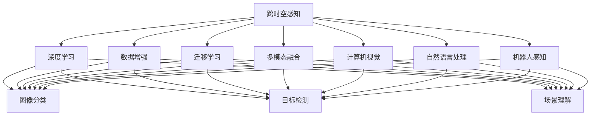

                 

# 体验跨时空探险：AI创造的感知边界拓展

> 关键词：跨时空感知, 人工智能, 深度学习, 感知边界, 数据增强, 迁移学习, 计算机视觉, 自然语言处理, 机器人感知, 多模态融合

## 1. 背景介绍

在人类历史的长河中，我们通过不断探索和发现，拓展了自身的感知边界。从古至今，不论是物理空间还是信息空间，我们的感知都得到了极大的提升。而今，随着人工智能技术的飞速发展，特别是深度学习技术的兴起，我们正在经历一场新的"跨时空"探险。在这场探险中，AI以其独特的技术优势，正逐渐突破我们的感知边界，为我们带来更加广阔和丰富的认知体验。

本文旨在深入探讨AI在感知领域的发展历程、核心概念和技术原理，通过具体案例展示AI在跨时空感知中的应用，并对未来AI感知的展望进行展望。希望通过本文，读者能够对AI感知的未来有更清晰的认识，并在实践中不断探索和创新。

## 2. 核心概念与联系

### 2.1 核心概念概述

为更全面了解AI在感知领域的应用和原理，本文将介绍几个核心概念：

- **跨时空感知**：跨时空感知是指利用AI技术在物理空间和时间空间中获取和理解信息的能力。具体应用包括计算机视觉、自然语言处理、机器人感知等。

- **深度学习**：深度学习是利用神经网络模型对数据进行层次化表示和学习的一种机器学习方法。深度学习通过多层次的特征提取和抽象，能够在各种感知任务上取得显著效果。

- **数据增强**：数据增强是通过对训练数据进行变换和扩充，提升模型鲁棒性和泛化能力的技术。常见的方法包括随机裁剪、翻转、旋转、加噪声等。

- **迁移学习**：迁移学习是利用一个领域学到的知识，迁移到另一个相关领域的学习方法。通过迁移学习，可以在较少标注数据的情况下，快速构建高性能的感知模型。

- **多模态融合**：多模态融合是指结合不同感知模态（如视觉、听觉、触觉等）的信息，提高综合感知能力的技术。多模态融合在复杂环境下的感知任务中具有重要应用。

- **计算机视觉**：计算机视觉是研究如何让计算机通过图像、视频等视觉信息理解和识别世界的技术。计算机视觉的应用领域包括图像分类、目标检测、场景理解等。

- **自然语言处理**：自然语言处理是研究如何让计算机理解、生成和处理自然语言的技术。自然语言处理的应用领域包括文本分类、信息抽取、机器翻译等。

- **机器人感知**：机器人感知是指让机器人能够通过传感器获取环境信息，并进行理解和决策的技术。机器人感知的应用领域包括导航、避障、交互等。

这些概念通过AI技术实现了彼此间的紧密联系，共同构成了AI感知技术的全貌。以下通过Mermaid流程图展示这些概念之间的联系：



## 3. 核心算法原理 & 具体操作步骤

### 3.1 算法原理概述

AI在感知领域的技术原理，主要是通过深度学习模型对输入数据进行层次化表示和学习。深度学习模型通过多层次的特征提取和抽象，能够逐步学习到数据的高级特征，从而在各种感知任务上取得显著效果。

以计算机视觉中的图像分类任务为例，其核心算法原理可以总结如下：

1. 将输入的图像经过一系列的卷积、池化等操作，得到一组特征图。
2. 将特征图通过一系列全连接层进行分类。
3. 通过反向传播算法，优化模型参数，最小化分类误差。

### 3.2 算法步骤详解

以下以自然语言处理中的文本分类任务为例，详细介绍AI在感知领域的具体操作步骤：

**Step 1: 数据准备**
- 收集标注数据，划分为训练集、验证集和测试集。
- 对文本数据进行预处理，包括分词、去除停用词、词向量化等。

**Step 2: 模型选择**
- 选择合适的深度学习模型，如卷积神经网络(CNN)、循环神经网络(RNN)、Transformer等。
- 设计任务适配层，如全连接层、分类层等，用于模型输出。

**Step 3: 模型训练**
- 将训练集数据分批次输入模型，前向传播计算损失函数。
- 反向传播计算参数梯度，根据设定的优化算法和学习率更新模型参数。
- 周期性在验证集上评估模型性能，根据性能指标决定是否触发Early Stopping。
- 重复上述步骤直到满足预设的迭代轮数或Early Stopping条件。

**Step 4: 模型评估**
- 在测试集上评估模型性能，使用常见的评估指标如准确率、精确率、召回率等。
- 使用模型进行推理预测，输出分类结果。

### 3.3 算法优缺点

AI感知技术的优点包括：

- 数据驱动：AI通过大量标注数据进行训练，能够自动学习复杂特征，提升了感知任务的性能。
- 鲁棒性：AI模型具有较好的泛化能力，能够在不同的应用场景中保持稳定性能。
- 自动化：AI感知技术可以自动处理大规模数据，显著减少了人工干预的负担。
- 灵活性：AI模型可以通过迁移学习、多模态融合等方法，灵活应对各种感知任务。

然而，AI感知技术也存在一些缺点：

- 数据依赖：AI感知技术对标注数据的需求较高，获取高质量数据成本较大。
- 计算资源消耗：深度学习模型需要大量计算资源进行训练和推理，硬件成本较高。
- 模型黑箱：深度学习模型通常是"黑箱"，难以解释其内部决策逻辑，可解释性较弱。
- 伦理和安全：AI感知技术可能存在偏见、歧视等问题，需要重视伦理和安全问题。

### 3.4 算法应用领域

AI感知技术在多个领域中得到了广泛应用，以下是几个典型应用：

- **计算机视觉**：图像分类、目标检测、场景理解等。
- **自然语言处理**：文本分类、信息抽取、机器翻译等。
- **机器人感知**：视觉导航、避障、语音交互等。
- **增强现实**：环境感知、目标识别等。
- **自动驾驶**：路况识别、障碍物检测、行人识别等。
- **智能监控**：异常检测、行为识别等。
- **医疗影像**：病变检测、手术辅助等。

## 4. 数学模型和公式 & 详细讲解 & 举例说明

### 4.1 数学模型构建

以下以图像分类任务为例，介绍AI感知模型的数学模型构建。

设输入图像为 $x \in \mathbb{R}^m$，输出类别为 $y \in \{1,2,\dots,C\}$。假设使用卷积神经网络模型，网络结构如图1所示。


模型包括多个卷积层和池化层，最终输出一组特征图 $h \in \mathbb{R}^n$。

### 4.2 公式推导过程

将输入图像 $x$ 经过一系列卷积和池化操作，得到特征图 $h$，然后通过全连接层进行分类，输出概率分布 $p(y|h)$。

其中，卷积层和池化层的具体实现方式可以参考深度学习中的卷积神经网络相关资料。

### 4.3 案例分析与讲解

以图像分类任务为例，使用深度学习模型对图像进行分类。假设使用卷积神经网络模型，其结构如图1所示。

设输入图像 $x$ 经过多个卷积和池化操作后，得到特征图 $h \in \mathbb{R}^n$。将特征图 $h$ 通过全连接层进行分类，输出概率分布 $p(y|h)$。

对于分类任务，我们通常使用交叉熵损失函数进行训练。设损失函数为 $L$，训练目标是最小化损失函数 $L$，即：

$$
\min_{\theta} L = -\frac{1}{N}\sum_{i=1}^N \sum_{j=1}^C p(y_j|x_i) \log p(y_j|x_i)
$$

其中，$p(y_j|x_i)$ 为模型在图像 $x_i$ 下输出类别 $j$ 的概率。

## 5. 项目实践：代码实例和详细解释说明

### 5.1 开发环境搭建

在进行AI感知任务开发前，需要先准备好开发环境。以下是Python环境下使用TensorFlow搭建环境的步骤：

1. 安装Anaconda：从官网下载并安装Anaconda，用于创建独立的Python环境。
2. 创建并激活虚拟环境：
```bash
conda create -n tf-env python=3.8 
conda activate tf-env
```
3. 安装TensorFlow：
```bash
pip install tensorflow==2.4.0
```
4. 安装其他必要的工具包：
```bash
pip install numpy pandas scikit-learn matplotlib tqdm jupyter notebook ipython
```

完成上述步骤后，即可在 `tf-env` 环境中开始AI感知任务开发。

### 5.2 源代码详细实现

以下是使用TensorFlow对图像分类任务进行训练和评估的Python代码实现。

```python
import tensorflow as tf
from tensorflow.keras import layers, models

# 加载数据
(x_train, y_train), (x_test, y_test) = tf.keras.datasets.mnist.load_data()

# 数据预处理
x_train, x_test = x_train / 255.0, x_test / 255.0
x_train = tf.expand_dims(x_train, axis=-1)
x_test = tf.expand_dims(x_test, axis=-1)

# 构建模型
model = models.Sequential([
    layers.Conv2D(32, (3, 3), activation='relu', input_shape=(28, 28, 1)),
    layers.MaxPooling2D((2, 2)),
    layers.Conv2D(64, (3, 3), activation='relu'),
    layers.MaxPooling2D((2, 2)),
    layers.Flatten(),
    layers.Dense(64, activation='relu'),
    layers.Dense(10, activation='softmax')
])

# 编译模型
model.compile(optimizer='adam',
              loss='sparse_categorical_crossentropy',
              metrics=['accuracy'])

# 训练模型
model.fit(x_train, y_train, epochs=5, validation_data=(x_test, y_test))

# 评估模型
model.evaluate(x_test, y_test)
```

### 5.3 代码解读与分析

**数据准备**：
- 使用TensorFlow内置的MNIST数据集，包含手写数字图片和对应的标签。
- 将图像像素值归一化到0-1之间，并进行通道扩展，使输入数据符合模型要求。

**模型构建**：
- 构建一个简单的卷积神经网络模型，包含多个卷积层和全连接层。
- 使用 `Sequential` 模型进行模型组装。

**模型训练**：
- 使用 `fit` 方法进行模型训练，指定训练轮数、验证集和损失函数。

**模型评估**：
- 使用 `evaluate` 方法对模型在测试集上进行评估，输出准确率。

## 6. 实际应用场景

### 6.1 智能监控系统

智能监控系统利用AI感知技术，能够自动检测异常行为和环境变化，提高安全性和效率。例如，利用计算机视觉技术，可以自动检测入侵者、火灾等异常事件，及时发出警报。

**案例分析**：
- 在监控摄像头中集成深度学习模型，对实时采集的视频流进行分析和处理。
- 模型可以对监控图像进行目标检测、行为识别等操作，识别出异常事件并自动报警。

**技术实现**：
- 使用YOLO、Faster R-CNN等目标检测算法，对监控图像进行目标检测。
- 使用RNN等模型，对目标的行为进行分析，识别异常事件。

### 6.2 医疗影像诊断

医疗影像诊断是AI感知技术的典型应用场景之一。AI能够通过图像识别技术，帮助医生诊断疾病，提高诊断准确率和效率。

**案例分析**：
- 利用计算机视觉技术，对医疗影像进行病变检测、分割等操作。
- 使用自然语言处理技术，对影像报告进行文本理解和生成。

**技术实现**：
- 使用U-Net、Mask R-CNN等模型，对医学影像进行病变分割和检测。
- 使用BERT等模型，对影像报告进行文本分析和生成。

### 6.3 智能驾驶

智能驾驶利用AI感知技术，能够自动感知周围环境和车辆状态，辅助驾驶员进行驾驶决策。

**案例分析**：
- 使用计算机视觉技术，对道路和车辆进行实时感知和理解。
- 使用自然语言处理技术，对导航和控制指令进行理解和执行。

**技术实现**：
- 使用卷积神经网络等模型，对道路和车辆进行实时感知和理解。
- 使用自然语言处理技术，对导航和控制指令进行理解和执行。

## 7. 工具和资源推荐

### 7.1 学习资源推荐

为帮助读者深入了解AI感知技术的原理和应用，以下是一些优质的学习资源：

1. 《深度学习》书籍：由Ian Goodfellow等人编写，系统介绍了深度学习的原理和应用，包括计算机视觉、自然语言处理等内容。

2. 《TensorFlow官方文档》：TensorFlow官方提供的详细文档，包括深度学习模型构建和训练的详细介绍。

3. 《计算机视觉：算法与应用》书籍：由Richard Szeliski编写，全面介绍了计算机视觉的原理和应用。

4. 《自然语言处理综论》书籍：由Daniel Jurafsky和James H. Martin编写，介绍了自然语言处理的原理和应用。

5. 《机器人学导论》书籍：由William G. Pavlovic编写，介绍了机器人感知和智能决策的原理和应用。

6. CS231n《卷积神经网络》课程：斯坦福大学开设的深度学习课程，涵盖卷积神经网络的基本原理和应用。

通过这些学习资源，读者可以全面了解AI感知技术的基本原理和应用场景，为进一步实践打下坚实基础。

### 7.2 开发工具推荐

为高效开发AI感知任务，以下是一些常用的开发工具：

1. TensorFlow：由Google主导开发的深度学习框架，适合构建大规模深度学习模型。

2. PyTorch：由Facebook主导开发的深度学习框架，灵活高效，适合研究和实验。

3. OpenCV：开源计算机视觉库，提供了丰富的图像处理和计算机视觉算法。

4. scikit-learn：Python科学计算库，提供了多种机器学习算法和工具。

5. Jupyter Notebook：交互式笔记本环境，支持Python代码的快速开发和调试。

6. Weights & Biases：模型训练实验跟踪工具，记录和可视化模型训练过程中的各项指标。

这些工具为开发AI感知任务提供了强有力的支持，能够显著提升开发效率和模型性能。

### 7.3 相关论文推荐

AI感知技术的发展得益于学界的不懈努力，以下是一些奠基性的相关论文：

1. ImageNet Large Scale Visual Recognition Challenge：提出了大规模图像分类任务ImageNet，推动了计算机视觉的发展。

2. AlexNet：提出了第一个大规模卷积神经网络模型，开启了深度学习在图像识别领域的广泛应用。

3. ResNet：提出了残差网络结构，解决了深度学习模型中的梯度消失问题，使得更深层次的模型成为可能。

4. RNNs for Sequence Modeling：提出了循环神经网络，使得序列数据建模成为可能，广泛应用于自然语言处理中。

5. Transformer：提出了自注意力机制，改变了自然语言处理领域的研究方向，带来了Transformer等创新模型。

6. GANs：提出了生成对抗网络，为图像生成和视觉感知带来了新的思路和方法。

这些论文展示了AI感知技术的发展历程，是深入理解AI感知技术的重要参考资料。

## 8. 总结：未来发展趋势与挑战

### 8.1 研究成果总结

AI感知技术在过去几年中取得了显著进展，主要体现在以下几个方面：

1. 深度学习模型的不断优化和改进，提升了感知任务的性能。
2. 数据增强和迁移学习等技术的广泛应用，提升了模型的鲁棒性和泛化能力。
3. 多模态融合和跨领域感知等前沿技术的出现，拓展了感知任务的应用场景。
4. 开源社区和框架的快速发展，促进了AI感知技术的普及和应用。

### 8.2 未来发展趋势

展望未来，AI感知技术的发展趋势包括：

1. 模型规模和复杂度的不断提升：随着算力成本的下降和数据规模的增长，更大规模、更复杂的模型将成为主流。
2. 跨领域和多模态融合的进一步深化：AI感知技术将越来越多地结合不同感知模态的信息，提升综合感知能力。
3. 数据增强和迁移学习等技术的进一步创新：新的数据增强方法和迁移学习技术将不断涌现，提升模型的泛化能力和效率。
4. 边缘计算和分布式计算的应用：AI感知技术将越来越多地应用到边缘计算和分布式计算环境中，提升实时性和可靠性。
5. 伦理和安全问题的关注：随着AI感知技术的普及，伦理和安全问题将受到更多关注，需要在技术上做出相应改进。

### 8.3 面临的挑战

尽管AI感知技术取得了显著进展，但仍面临一些挑战：

1. 数据获取和标注成本高：高质量标注数据的需求，限制了AI感知技术的发展。
2. 计算资源消耗大：深度学习模型对计算资源的需求较高，需要投入大量的硬件资源。
3. 模型黑箱问题：深度学习模型的可解释性较弱，难以解释其内部决策逻辑。
4. 伦理和安全问题：AI感知技术可能存在偏见、歧视等问题，需要重视伦理和安全问题。

### 8.4 研究展望

面对这些挑战，未来的研究方向包括：

1. 低成本数据获取和标注方法：研究新的数据获取和标注技术，降低高质量标注数据的获取成本。
2. 轻量级和高效模型：开发轻量级、高效能的感知模型，减少对计算资源的需求。
3. 模型可解释性和透明性：研究可解释性和透明性技术，增强模型的可解释性和可控性。
4. 伦理和安全问题：研究伦理和安全问题，确保AI感知技术的透明性和安全性。

## 9. 附录：常见问题与解答

**Q1: 如何提升AI感知模型的性能？**

A: 提升AI感知模型的性能可以从以下几个方面入手：

1. 数据增强：通过数据增强技术，如旋转、裁剪、加噪声等，扩充训练数据集，提升模型泛化能力。
2. 模型优化：使用更优的网络结构、更合适的优化器和损失函数，提升模型训练效果。
3. 正则化和Dropout：通过正则化和Dropout技术，防止过拟合，提升模型鲁棒性。
4. 迁移学习：利用已有的预训练模型，进行微调或迁移学习，加速模型训练和提高性能。

**Q2: AI感知模型在实际应用中需要注意哪些问题？**

A: 在实际应用中，AI感知模型需要注意以下几个问题：

1. 数据质量：数据质量和标注质量直接影响模型性能，需要确保输入数据的准确性和完整性。
2. 模型鲁棒性：模型需要具备良好的鲁棒性，能够处理各种异常情况和噪声数据。
3. 可解释性：模型的可解释性需要强，以便于解释其内部决策逻辑，提升用户信任度。
4. 伦理和安全问题：模型需要符合伦理和安全标准，避免偏见、歧视等问题，确保应用场景的安全性。

**Q3: 如何选择合适的AI感知模型？**

A: 选择合适的AI感知模型需要考虑以下几个因素：

1. 任务类型：根据任务类型选择合适的模型，如图像分类选择CNN，文本分类选择RNN或Transformer。
2. 数据规模：根据数据规模选择合适的模型，数据量较大可以选择更深层次的模型，数据量较小可以选择轻量级模型。
3. 计算资源：根据计算资源选择合适的模型，计算资源充足可以选择更复杂的模型，计算资源有限可以选择轻量级模型。
4. 实时性要求：根据实时性要求选择合适的模型，实时性要求高可以选择轻量级模型，实时性要求低可以选择复杂模型。

**Q4: AI感知技术的发展趋势有哪些？**

A: AI感知技术的发展趋势包括：

1. 模型规模和复杂度的不断提升：更大规模、更复杂的模型将成为主流。
2. 跨领域和多模态融合的进一步深化：AI感知技术将越来越多地结合不同感知模态的信息，提升综合感知能力。
3. 数据增强和迁移学习等技术的进一步创新：新的数据增强方法和迁移学习技术将不断涌现，提升模型的泛化能力和效率。
4. 边缘计算和分布式计算的应用：AI感知技术将越来越多地应用到边缘计算和分布式计算环境中，提升实时性和可靠性。

**Q5: 如何应对AI感知技术的伦理和安全问题？**

A: 应对AI感知技术的伦理和安全问题需要从以下几个方面入手：

1. 透明性：增强模型的透明性，让用户了解模型的内部决策逻辑。
2. 可解释性：开发可解释性技术，增强模型的可解释性，确保决策的透明性。
3. 伦理审查：在模型开发过程中进行伦理审查，确保模型符合伦理和安全标准。
4. 安全防护：在模型应用过程中进行安全防护，确保应用场景的安全性。

希望本文能够帮助读者深入了解AI感知技术的发展历程、核心概念和应用场景，为未来的研究和实践提供指导。

