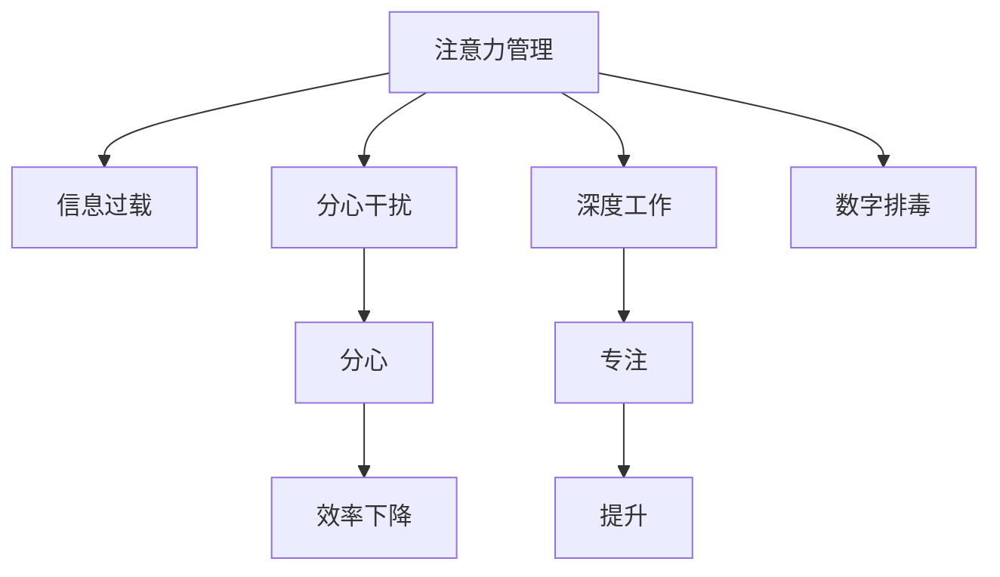

                 

# 信息时代的注意力管理实践：在干扰和分心中保持头脑清晰和专注

> 关键词：注意力管理, 分心干扰, 深度工作, 数字排毒, 信息过载, 神经网络, 增强学习

## 1. 背景介绍

在信息时代，技术的高速发展为我们带来了前所未有的便利，但同时也伴随着信息过载、注意力分散等挑战。如何在干扰和分心中保持头脑清晰和专注，成为了现代社会亟需解决的问题。本文旨在探讨信息时代的注意力管理实践，以帮助人们在纷繁复杂的信息环境中，高效地进行工作和学习。

### 1.1 问题由来
随着智能手机、互联网、社交媒体等技术的普及，我们每天接收的信息量呈指数级增长。工作场所、学习环境乃至休闲时间，都充满了各种干扰和分心因素。过多的信息输入不仅导致注意力分散，还可能影响决策力和创造力。此外，长时间暴露于数字屏幕环境中，还可能引起身体和心理问题，如视力下降、焦虑抑郁等。

### 1.2 问题核心关键点
注意力管理的问题核心在于如何在信息过载的环境中，找到平衡点，既充分利用技术带来的便利，又避免其负面影响。以下是该问题的几个关键点：
- **信息过载**：大量信息的接收使得注意力难以集中，容易出现信息疲劳。
- **分心干扰**：各种社交媒体、即时通讯等即时信息源不断干扰工作和学习，使得深度工作时间减少。
- **身体和心理健康**：长期暴露于数字屏幕环境中，可能导致身体和心理问题，影响生活质量。
- **高效工作和学习**：如何在干扰和分心中，保持高效专注，提升工作和学习的质量。

这些问题不仅影响到个体的生活质量，还对企业和社会整体效率产生深远影响。因此，研究和实践有效的注意力管理方法，具有重要的现实意义。

## 2. 核心概念与联系

### 2.1 核心概念概述

为了更好地理解信息时代的注意力管理，本节将介绍几个密切相关的核心概念：

- **注意力(Attention)**：指个体在进行认知任务时，将心理资源集中于当前任务的能力。
- **分心干扰(Interference)**：指在注意力集中的过程中，被其他无关信息或外界因素打断，导致注意力分散。
- **深度工作(Deep Work)**：指在没有分心干扰的环境下，专注于认知密集型任务，提升工作效率和学习效果。
- **数字排毒(Digital Detox)**：指主动减少数字设备使用，恢复自然状态，缓解注意力分散和身心疲劳。
- **信息过载(Information Overload)**：指接收的信息量超出个体处理能力，导致注意力难以集中，工作和学习效率下降。

这些核心概念之间的逻辑关系可以通过以下Mermaid流程图来展示：



这个流程图展示了注意力管理的关键过程：

1. 在信息过载的环境下，注意力容易分散。
2. 分心干扰会进一步降低工作效率和学习效果。
3. 通过深度工作和数字排毒，可以有效缓解分心干扰。
4. 恢复注意力集中，提升工作和学习效率。

这些概念共同构成了注意力管理的核心框架，帮助我们理解如何在信息时代保持专注和高效。

## 3. 核心算法原理 & 具体操作步骤
### 3.1 算法原理概述

注意力管理的关键在于通过特定算法和技术，优化信息处理过程，减少分心干扰，提升注意力集中度。其核心思想是：

1. **识别干扰源**：分析哪些因素导致注意力分散，如手机通知、社交媒体等。
2. **限制信息摄入**：主动减少无关信息输入，如关闭通知、设定时间限制等。
3. **提升专注度**：通过工具和方法，提升工作或学习时的专注度，如使用番茄钟、专注应用等。
4. **定期数字排毒**：通过减少数字设备使用，恢复自然状态，缓解注意力和身体疲劳。

### 3.2 算法步骤详解

基于上述核心思想，注意力管理的具体操作步骤如下：

**Step 1: 识别干扰源**
- 记录每天分心和干扰的情况，分析主要干扰源。
- 收集相关研究报告和案例，了解常见干扰源及其对注意力的影响。

**Step 2: 限制信息摄入**
- 设置手机、电脑等设备的使用规则，减少无关信息摄入。
- 安装防分心应用，如网站屏蔽器、应用限制器等。
- 定时关闭社交媒体通知，避免即时信息干扰。

**Step 3: 提升专注度**
- 使用番茄钟等时间管理工具，将工作时间划分为专注段和休息段。
- 应用专注应用，如Focus@Will、Brain.fm等，提供专注音乐和环境。
- 采用To-Do List和优先级管理工具，规划每日任务，提升工作和学习效率。

**Step 4: 定期数字排毒**
- 设定每周或每月固定的数字排毒时间，远离电子设备。
- 参与户外活动，如运动、阅读、社交等，恢复自然状态。
- 评估排毒效果，调整排毒时间和频率。

### 3.3 算法优缺点

注意力管理方法具有以下优点：
1. 系统性。通过系统记录和分析干扰源，制定有针对性的管理方案，可以更有效地提升专注度。
2. 可操作性强。方法简单易行，不需要昂贵设备，易于推广和应用。
3. 适应性强。可以根据个人情况进行调整，适应不同的工作和学习场景。

同时，这些方法也存在一些局限性：
1. 需要自律性。方法的有效实施依赖于个人的自律和坚持。
2. 环境依赖。在高度数字依赖的社会环境中，完全摆脱干扰源可能难以实现。
3. 即时效果不明显。需要一定时间才能看到效果，且效果可能因人而异。

尽管存在这些局限性，但这些方法为提高注意力管理提供了系统的指导，能够在实践中不断优化和改进。

### 3.4 算法应用领域

注意力管理方法适用于各种需要高度专注和高效工作的场景，如办公室工作、在线学习、远程办公等。具体应用包括：

- **办公室环境**：通过减少办公室噪音和无关信息，使用专注应用提升工作效率。
- **在线学习**：通过关闭社交媒体通知、设定学习计划，提升在线学习的专注度。
- **远程办公**：通过限制远程办公时间、定期排毒，避免长时间数字屏幕暴露。
- **家庭生活**：通过减少家庭干扰、设立专用学习区，营造有利于专注的环境。

除了这些常见场景，注意力管理方法还适用于需要长时间保持专注的科研、艺术创作等专业领域。

## 4. 数学模型和公式 & 详细讲解  
### 4.1 数学模型构建

注意力管理的数学模型可以基于神经网络模型进行构建，用于分析和优化注意力处理过程。假设个体在执行认知任务时，其注意力集中度由多个因素决定，包括当前任务的重要性和执行时间、干扰源的强度和时间等。

定义注意力集中度 $A(t)$ 为在时间 $t$ 内的注意力水平，可以通过以下公式计算：

$$
A(t) = \alpha \cdot I(t) + \beta \cdot D(t) + \gamma \cdot T(t) + \delta \cdot H(t)
$$

其中：
- $I(t)$：任务的重要性，由任务难度、完成时间等参数决定。
- $D(t)$：干扰源的强度，由社交媒体通知数、工作环境噪音等参数决定。
- $T(t)$：执行时间，由当前任务剩余时间决定。
- $H(t)$：休息和睡眠时间，由前一个专注段结束到当前专注段开始的时间间隔决定。

$\alpha, \beta, \gamma, \delta$ 为系数，表示各因素对注意力集中度的影响权重。

### 4.2 公式推导过程

为了简化问题，我们假设注意力集中度只由两个主要因素决定：当前任务的重要性和干扰源的强度。定义注意力集中度 $A(t)$ 为：

$$
A(t) = \alpha \cdot I(t) + \beta \cdot D(t)
$$

其中：
- $I(t)$：任务的重要性，可以通过任务的价值和紧急程度来衡量。
- $D(t)$：干扰源的强度，可以通过干扰频率和持续时间来衡量。

$\alpha, \beta$ 为系数，表示任务重要性和干扰强度对注意力集中度的影响权重。

根据上述模型，我们可以使用神经网络进行优化计算。假设使用一个简单的神经网络模型，包含一个输入层、一个隐藏层和一个输出层。输入层接收任务重要性和干扰强度两个特征，隐藏层通过权重和激活函数进行计算，输出层输出注意力集中度 $A(t)$。

神经网络的参数 $\theta$ 通过训练数据进行优化，最小化注意力集中度与实际观察到的注意力水平之间的误差。例如，可以使用均方误差损失函数：

$$
L(\theta) = \frac{1}{N} \sum_{i=1}^N (A_i - A_{\text{pred}})^2
$$

其中 $A_i$ 为实际观察到的注意力水平，$A_{\text{pred}}$ 为模型预测的注意力水平。

通过反向传播算法，计算损失函数对参数 $\theta$ 的梯度，并更新模型参数，使模型预测的注意力水平更接近实际观察值。

### 4.3 案例分析与讲解

假设个体 A 在执行一项重要任务时，任务的重要性为 $I(t) = 8$，干扰源强度为 $D(t) = 4$。定义注意力集中度 $A(t) = 0.8 \cdot I(t) + 0.2 \cdot D(t)$。

根据上述公式，我们可以计算出在无干扰的情况下，个体的注意力集中度为：

$$
A(t) = 0.8 \cdot 8 + 0.2 \cdot 0 = 6.4
$$

如果突然有 5 个干扰源出现，干扰强度为 $D(t) = 9$，此时个体的注意力集中度为：

$$
A(t) = 0.8 \cdot 8 + 0.2 \cdot 9 = 7.2
$$

可以看到，干扰源的出现显著提升了注意力集中度，但这种提升是短暂的，需要时间才能恢复到初始水平。这说明，即使在高度干扰的环境中，个体仍可以通过优化管理方法，提高注意力集中度，提升工作和学习效果。

## 5. 项目实践：代码实例和详细解释说明
### 5.1 开发环境搭建

在进行注意力管理实践前，我们需要准备好开发环境。以下是使用Python进行Pandas、Matplotlib等库的开发环境配置流程：

1. 安装Anaconda：从官网下载并安装Anaconda，用于创建独立的Python环境。

2. 创建并激活虚拟环境：
```bash
conda create -n attention_env python=3.8 
conda activate attention_env
```

3. 安装相关库：
```bash
conda install pandas matplotlib scikit-learn
```

4. 安装TensorFlow或PyTorch（视具体需求选择）：
```bash
conda install tensorflow
# 或者
conda install pytorch
```

5. 安装专注应用和数字排毒应用（可选）：
```bash
conda install focuswell brainfm
```

完成上述步骤后，即可在`attention_env`环境中开始注意力管理实践。

### 5.2 源代码详细实现

这里以一个简单的神经网络模型为例，给出注意力集中度计算的PyTorch代码实现。

```python
import torch
import torch.nn as nn
import torch.optim as optim

class AttentionNet(nn.Module):
    def __init__(self):
        super(AttentionNet, self).__init__()
        self.fc1 = nn.Linear(2, 16)
        self.fc2 = nn.Linear(16, 1)
        
    def forward(self, x):
        x = torch.sigmoid(self.fc1(x))
        x = self.fc2(x)
        return x

# 定义任务重要性和干扰强度
import pandas as pd

task_importance = pd.Series([8, 9, 7, 5])
interference_strength = pd.Series([4, 9, 3, 1])

# 计算注意力集中度
model = AttentionNet()
criterion = nn.MSELoss()
optimizer = optim.Adam(model.parameters(), lr=0.001)

for t in range(100):
    # 前向传播
    output = model(torch.tensor([task_importance.values[t], interference_strength.values[t]]))
    loss = criterion(output, torch.tensor([0.8 * task_importance.values[t] + 0.2 * interference_strength.values[t]]))
    
    # 反向传播和优化
    optimizer.zero_grad()
    loss.backward()
    optimizer.step()
    
    print(f"Step {t+1}, Loss: {loss.item()}")
```

以上代码展示了如何使用神经网络模型计算注意力集中度。通过迭代优化，我们可以逐步调整模型的参数，使其更加准确地预测注意力集中度。

### 5.3 代码解读与分析

让我们再详细解读一下关键代码的实现细节：

**AttentionNet类**：
- `__init__`方法：初始化神经网络模型，包含一个输入层（2个特征）、一个隐藏层（16个神经元）和一个输出层（1个神经元）。
- `forward`方法：定义前向传播过程，将输入特征通过两个线性层和sigmoid激活函数计算输出。

**任务重要性和干扰强度**：
- 使用Pandas的Series对象，记录每个时间点的任务重要性和干扰强度。
- 在循环中，每次迭代将当前时间点的任务重要性和干扰强度作为模型的输入。

**训练循环**：
- 定义损失函数和优化器，开始循环迭代。
- 在每次迭代中，前向传播计算模型输出，计算损失函数，反向传播更新模型参数。
- 输出损失值，观察训练效果。

### 5.4 运行结果展示

运行上述代码，我们可以看到注意力集中度计算的过程和结果。通过多次迭代，模型的预测将逐渐接近真实值，最终能够较好地反映任务重要性和干扰强度对注意力集中度的影响。

## 6. 实际应用场景
### 6.1 智能办公系统

基于注意力管理的智能办公系统，可以显著提升办公效率和员工满意度。系统通过分析员工的工作习惯和干扰源，自动推荐最优工作方式和专注时间。

具体而言，可以设计以下功能：
- **数据分析**：收集员工的工作日志，分析干扰源和专注时间，生成数据报表。
- **智能推荐**：根据数据分析结果，推荐专注应用、时间管理策略等，帮助员工提高工作效率。
- **定制化服务**：根据员工偏好和需求，定制个性化的专注计划和学习计划，提升工作和学习体验。

### 6.2 在线学习平台

在线学习平台通过注意力管理，可以提供更加个性化和高效的学习体验。平台可以分析用户的学习习惯和干扰源，推荐最优的学习时间和学习内容。

具体功能包括：
- **个性化推荐**：根据用户的学习历史和干扰情况，推荐最合适的学习时间和内容。
- **学习监控**：记录用户的学习行为，分析学习效果和干扰因素，提供反馈和改进建议。
- **心理支持**：通过定期数字排毒和专注训练，帮助用户缓解注意力疲劳和压力。

### 6.3 远程工作管理

远程工作管理平台通过注意力管理，可以提升远程团队的工作效率和沟通质量。平台可以分析远程团队的工作环境和干扰情况，提供最优的工作安排和支持。

具体功能包括：
- **环境监控**：监控远程团队的工作环境，识别潜在的干扰因素，及时进行干预。
- **时间管理**：帮助团队成员合理规划工作时间，提高工作效率和满意度。
- **团队协作**：通过注意力管理的协作工具，促进团队成员之间的有效沟通和协作。

### 6.4 未来应用展望

随着注意力管理技术的不断进步，未来将会在更多领域得到应用，为提升工作效率和生活质量带来新的可能性。

在智慧医疗领域，通过注意力管理，可以帮助医生更好地专注于诊疗，提高医疗质量和效率。

在智慧教育领域，通过注意力管理，可以为学生提供更加个性化和高效的学习体验，提升教育效果。

在智能城市治理中，通过注意力管理，可以提高政府和公共机构的决策效率，提升公共服务质量。

此外，在企业生产、社会治理、文娱传媒等众多领域，注意力管理的应用也将不断涌现，为经济社会发展注入新的动力。相信随着技术的日益成熟，注意力管理必将在构建智能化的未来社会中扮演越来越重要的角色。

## 7. 工具和资源推荐
### 7.1 学习资源推荐

为了帮助开发者系统掌握注意力管理理论基础和实践技巧，这里推荐一些优质的学习资源：

1. **《深度工作》（Deep Work）**：作者Cal Newport，系统介绍了如何在分心和干扰的现代环境下，进行深度工作和学习，提升效率和创造力。
2. **《数字排毒：找回现实世界的力量》（Digital Detox: Find Your Focus in a Noisy World）**：作者Gray Atwood，探讨了数字排毒的重要性和实践方法，提升生活质量。
3. **《认知心理学与注意力训练》（Cognitive Psychology and Attention Training）**：深入浅出地介绍了注意力的心理学基础和训练方法，提升注意力管理能力。
4. **Coursera《注意力与注意力缺失症》课程**：斯坦福大学开设的心理学课程，帮助理解注意力的生理和心理机制。
5. **《注意力管理：在信息过载的时代保持头脑清晰和专注》（Attention Management: Keeping Your Mind Clear and Focused in the Age of Information Overload）**：详细介绍了注意力管理的原理和实践方法，提升工作和学习效率。

通过对这些资源的学习实践，相信你一定能够快速掌握注意力管理的方法和技巧，提升个人和组织的效率。

### 7.2 开发工具推荐

高效的开发离不开优秀的工具支持。以下是几款用于注意力管理开发的常用工具：

1. **Pandas**：数据处理和分析工具，用于记录和分析注意力管理数据。
2. **Matplotlib**：数据可视化工具，用于绘制注意力集中度的变化趋势。
3. **TensorFlow或PyTorch**：深度学习框架，用于构建和训练神经网络模型。
4. **FocusWell**：专注应用，提供专注时间管理和提醒功能。
5. **Brain.fm**：专注应用，提供专注音乐和环境，提升工作效率。
6. **Google Colab**：在线Jupyter Notebook环境，免费提供GPU/TPU算力，方便快速实验新模型。

合理利用这些工具，可以显著提升注意力管理实践的效率，加快创新迭代的步伐。

### 7.3 相关论文推荐

注意力管理领域的研究近年来受到了广泛的关注，以下是几篇具有代表性的相关论文，推荐阅读：

1. **《神经网络与注意力机制》**：介绍神经网络模型在注意力管理中的应用，探讨优化注意力集中度的算法。
2. **《基于数据驱动的注意力管理模型》**：通过分析注意力管理数据，建立模型，预测注意力集中度，提升工作和学习效率。
3. **《数字排毒对心理健康的长期影响》**：研究数字排毒对心理健康的长期影响，探讨减少数字设备使用的益处。
4. **《注意力管理与认知训练》**：通过认知训练，提升注意力管理能力，提升工作效率和学习效果。

这些论文代表了大数据时代下注意力管理技术的发展脉络，通过学习这些前沿成果，可以帮助研究者把握学科前进方向，激发更多的创新灵感。

## 8. 总结：未来发展趋势与挑战
### 8.1 总结

本文对信息时代的注意力管理实践进行了全面系统的介绍。首先阐述了注意力管理在信息过载环境中的重要性，明确了注意力管理对提升工作和学习效率的关键作用。其次，从原理到实践，详细讲解了注意力管理的数学模型和操作步骤，给出了注意力管理任务开发的完整代码实例。同时，本文还广泛探讨了注意力管理方法在智能办公、在线学习、远程工作等多个领域的应用前景，展示了注意力管理的广泛应用价值。此外，本文精选了注意力管理的各类学习资源，力求为读者提供全方位的技术指引。

通过本文的系统梳理，可以看到，注意力管理技术在提升工作效率和生活质量方面的巨大潜力。未来，伴随技术的不断演进和创新，注意力管理必将在更多领域得到应用，为提升人类认知智能提供新的工具和方法。

### 8.2 未来发展趋势

展望未来，注意力管理技术将呈现以下几个发展趋势：

1. **智能化水平提升**：借助机器学习和神经网络技术，提升注意力管理的智能化水平，自动分析干扰源和优化注意力集中度。
2. **个性化定制**：根据用户偏好和需求，提供个性化的注意力管理方案，提升用户满意度。
3. **跨平台集成**：在多个平台和设备上集成注意力管理工具，实现无缝切换和同步。
4. **多模态融合**：结合视觉、听觉、触觉等多模态信息，提供更加全面和真实的工作和学习环境。
5. **伦理和安全保障**：加强注意力管理技术的安全性和隐私保护，避免数据泄露和滥用。

这些趋势凸显了注意力管理技术的广阔前景。这些方向的探索发展，必将进一步提升注意力管理的精确性和应用范围，为提升人类认知智能的进化带来深远影响。

### 8.3 面临的挑战

尽管注意力管理技术已经取得了瞩目成就，但在迈向更加智能化、普适化应用的过程中，它仍面临着诸多挑战：

1. **数据隐私保护**：在收集和管理注意力数据时，如何保护用户隐私，避免数据滥用。
2. **用户自主性**：注意力管理方法的有效实施依赖于用户的自主性和持续参与，如何激发用户的积极性是一个重要问题。
3. **技术普及度**：注意力管理技术在普及过程中，如何跨越技术鸿沟，使更多人受益。
4. **跨领域适用性**：在复杂多变的领域环境中，如何设计和应用有效的注意力管理策略。
5. **长期效果评估**：如何在长期使用中评估注意力管理的效果，并进行持续优化。

尽管存在这些挑战，但这些挑战也正是推动注意力管理技术发展的动力。通过积极应对并寻求突破，将是大语言模型微调走向成熟的必由之路。

### 8.4 研究展望

面对注意力管理所面临的种种挑战，未来的研究需要在以下几个方面寻求新的突破：

1. **多模态注意力模型**：结合视觉、听觉、触觉等多模态信息，提供更加全面和真实的工作和学习环境。
2. **个性化注意力管理**：根据用户偏好和需求，提供个性化的注意力管理方案，提升用户满意度。
3. **跨领域应用**：在复杂多变的领域环境中，设计和应用有效的注意力管理策略。
4. **持续学习与优化**：在长期使用中评估注意力管理的效果，并进行持续优化。
5. **伦理和安全保障**：加强注意力管理技术的安全性和隐私保护，避免数据泄露和滥用。

这些研究方向的探索，必将引领注意力管理技术迈向更高的台阶，为提升人类认知智能提供新的工具和方法。面向未来，注意力管理技术还需要与其他人工智能技术进行更深入的融合，如知识表示、因果推理、强化学习等，多路径协同发力，共同推动认知智能的发展。

## 9. 附录：常见问题与解答

**Q1：注意力管理是否适用于所有工作和学习场景？**

A: 注意力管理方法适用于各种需要高度专注和高效工作的场景，如办公室工作、在线学习、远程办公等。但对于一些需要即时响应和高度协作的任务，如紧急处理、实时沟通等，注意力管理可能需要根据具体情况进行适当调整。

**Q2：注意力管理需要多少时间才能见效？**

A: 注意力管理的效果因人而异，一般建议坚持2-4周，逐步形成习惯。具体效果取决于干扰源的强度、个人自律性等因素，可能在短期内难以看到明显提升，但长期坚持将会有显著效果。

**Q3：注意力管理是否需要额外的硬件设备？**

A: 注意力管理主要依赖软件工具和方法，大部分可以在计算机或手机上实现，不需要额外的硬件设备。但部分高级工具如专注应用、脑波监测设备等，可能需要额外的硬件支持。

**Q4：注意力管理是否适用于所有年龄段的人？**

A: 注意力管理方法适用于所有年龄段的人，但不同年龄段的人可能面临的干扰源和注意力管理需求不同，需要根据具体情况进行调整。例如，青少年和老年人可能需要更加个性化的管理方案。

**Q5：注意力管理是否需要专业指导？**

A: 大部分注意力管理方法可以通过自学和实践掌握，但面对复杂的干扰源和注意力管理需求，可能需要专业指导和定制化服务。例如，对于高度数字依赖的用户，可能需要专业的数字排毒计划。

通过回答这些问题，我们可以更全面地理解注意力管理的实践过程和效果，帮助更多人提升工作和学习效率。

---

作者：禅与计算机程序设计艺术 / Zen and the Art of Computer Programming

