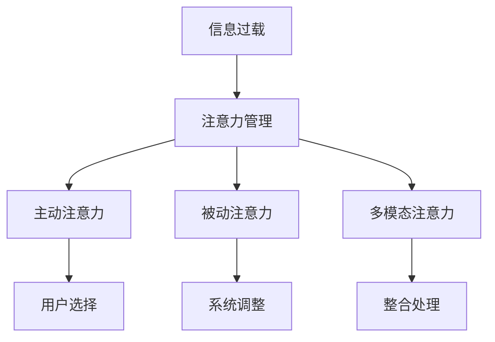

                 

# 信息时代的注意力管理技术与策略：在干扰和信息过载中保持专注

## 1. 背景介绍

在信息时代，信息过载和注意力干扰已经成为现代人面临的重大挑战。每天海量的数据和信息源不断涌入我们的生活，我们如何在其中筛选出真正有用的信息，并保持专注，成为了一个值得深入研究的问题。本文将探讨信息时代的注意力管理技术，从核心概念入手，深入分析算法原理，并通过实践案例，提出有效的注意力管理策略，帮助我们在干扰和信息过载中保持专注。

## 2. 核心概念与联系

### 2.1 核心概念概述

为了更好地理解注意力管理技术，本节将介绍几个核心概念：

- **注意力管理**：通过算法和技术手段，帮助用户筛选和管理信息，在干扰和信息过载中保持专注。
- **信息过载**：信息时代的一个显著问题，用户接收的信息量远超其处理能力，导致注意力分散，影响效率。
- **注意力模型**：通过数学和计算模型，模拟人类注意力的分配和聚焦过程，从而引导信息处理。
- **主动注意力**：用户通过主动选择和调整，控制信息输入和输出，提升信息处理效果。
- **被动注意力**：系统根据用户的行为和特征，自动调整信息展示策略，提升信息发现和筛选效果。
- **多模态注意力**：将视觉、听觉、触觉等多模态信息进行整合，提高信息的综合处理能力。

这些核心概念之间的逻辑关系可以通过以下Mermaid流程图来展示：



这个流程图展示了这个过程的关键步骤：

1. 信息过载需要通过注意力管理技术进行控制。
2. 用户可以通过主动注意力选择重要信息。
3. 系统可以通过被动注意力调整信息展示策略。
4. 多模态注意力将多种信息形式进行整合。

这些概念共同构成了注意力管理的核心框架，帮助我们理解和应用注意力管理技术。

## 3. 核心算法原理 & 具体操作步骤
### 3.1 算法原理概述

注意力管理技术的核心在于通过计算模型，模拟人类注意力的分配和聚焦过程。其基本原理可以概括为以下几个步骤：

1. **注意力计算**：通过计算模型，评估每个信息点对用户的价值和重要性。
2. **信息排序**：根据注意力计算结果，对信息进行排序，优先处理重要的信息。
3. **信息筛选**：根据排序结果，选择和展示重要的信息，同时屏蔽干扰信息。
4. **反馈调整**：根据用户反馈，调整注意力计算和信息排序策略，提升信息管理效果。

### 3.2 算法步骤详解

一个典型的注意力管理算法流程如下：

**Step 1: 数据预处理**
- 收集用户行为数据，如点击、阅读、观看等。
- 对数据进行清洗和标注，构建信息元组，包括信息点、时间戳、用户标识等。

**Step 2: 注意力计算**
- 定义注意力计算模型，如CTC模型、深度学习模型等。
- 将信息元组输入模型，计算每个信息点的注意力值。
- 根据注意力值排序，确定重要信息。

**Step 3: 信息展示**
- 根据排序结果，选择和展示重要的信息，屏蔽干扰信息。
- 根据用户反馈，动态调整信息展示策略。

**Step 4: 反馈调整**
- 收集用户反馈，如点击、点赞、评论等。
- 根据反馈，调整注意力计算模型和信息排序策略。

### 3.3 算法优缺点

注意力管理技术在信息时代有着广泛的应用，但也存在一些局限性：

**优点：**
- **高效筛选**：能够快速识别和筛选重要信息，提升信息处理效率。
- **个性化推荐**：根据用户行为和特征，提供个性化信息推荐，提升用户体验。
- **系统自适应**：通过反馈机制，系统能够自适应调整信息展示策略，提升信息管理效果。

**缺点：**
- **数据依赖**：注意力管理技术的有效性高度依赖于用户行为数据的质量和完整性。
- **算法复杂性**：注意力计算模型和信息排序算法通常较为复杂，需要大量计算资源。
- **用户隐私**：注意力管理技术需要收集和分析用户行为数据，可能涉及用户隐私问题。

### 3.4 算法应用领域

注意力管理技术在多个领域都有广泛应用，主要包括以下几个方面：

1. **智能推荐系统**：通过分析用户行为数据，提供个性化信息推荐，提升用户体验。
2. **信息过滤系统**：帮助用户过滤掉干扰信息，提升信息处理效率。
3. **新闻聚合平台**：通过注意力计算，推荐重要新闻，提升信息发现能力。
4. **社交网络**：通过注意力模型，推荐好友动态，提升社交体验。
5. **内容管理系统**：通过注意力管理，优化内容展示策略，提升内容消费效率。

## 4. 数学模型和公式 & 详细讲解 & 举例说明

### 4.1 数学模型构建

本节将使用数学语言对注意力管理技术进行更加严格的刻画。

假设用户每天接收的信息数量为 $N$，每个信息点 $i$ 的重要性由注意力值 $a_i$ 表示。注意力值的计算依赖于用户行为数据 $X_i$，如点击次数、阅读时长等。我们定义注意力计算模型为 $f: X_i \rightarrow a_i$。

根据注意力值，我们可以对信息进行排序，选择前 $K$ 个重要信息进行展示。排序算法可以采用快速排序、归并排序等常见算法，也可以采用堆排序等高效算法。

信息展示的目标是最小化用户对展示信息的满意度，即最大化 $K$ 个重要信息的展示效果。我们可以定义满意度函数 $S(X_i, a_i)$，并通过最大化 $S(X_i, a_i)$ 来优化信息展示策略。

### 4.2 公式推导过程

以CTC(Click-Through-Cost)模型为例，计算信息点 $i$ 的注意力值 $a_i$。CTC模型通过计算点击成本，评估信息的重要性：

$$
a_i = \frac{C}{N} \sum_{j=1}^{N} X_{ij} \log f(X_i)
$$

其中 $C$ 为点击成本常数，$X_{ij}$ 表示信息点 $i$ 是否被用户点击过，$f(X_i)$ 为注意力计算函数。

### 4.3 案例分析与讲解

假设我们有一个新闻聚合平台，需要为用户推荐前5条重要新闻。平台收集了用户每天的点击行为数据，并使用CTC模型计算每条新闻的注意力值。计算结果如下：

| 新闻编号 | 点击次数 | 注意力值 |
| --------- | -------- | -------- |
| 1         | 10       | 0.05     |
| 2         | 5        | 0.03     |
| 3         | 8        | 0.04     |
| 4         | 12       | 0.06     |
| 5         | 7        | 0.02     |
| 6         | 2        | 0.01     |

根据注意力值排序，我们选择了前5条重要新闻进行展示，即新闻1、新闻2、新闻3、新闻4和新闻5。

## 5. 项目实践：代码实例和详细解释说明
### 5.1 开发环境搭建

在进行注意力管理技术实践前，我们需要准备好开发环境。以下是使用Python进行TensorFlow开发的环境配置流程：

1. 安装Anaconda：从官网下载并安装Anaconda，用于创建独立的Python环境。

2. 创建并激活虚拟环境：
```bash
conda create -n attention-env python=3.8 
conda activate attention-env
```

3. 安装TensorFlow：根据CUDA版本，从官网获取对应的安装命令。例如：
```bash
conda install tensorflow tensorflow-gpu -c conda-forge
```

4. 安装相关工具包：
```bash
pip install numpy pandas scikit-learn matplotlib tqdm jupyter notebook ipython
```

完成上述步骤后，即可在`attention-env`环境中开始注意力管理技术开发。

### 5.2 源代码详细实现

下面以信息推荐系统为例，给出使用TensorFlow进行注意力管理技术的PyTorch代码实现。

首先，定义信息元组：

```python
import tensorflow as tf

class InformationTuple:
    def __init__(self, id, click_count, title, content):
        self.id = id
        self.click_count = click_count
        self.title = title
        self.content = content
```

然后，定义注意力计算模型：

```python
class AttentionModel(tf.keras.Model):
    def __init__(self):
        super(AttentionModel, self).__init__()
        self.feature_extractor = tf.keras.layers.Embedding(input_dim=1000, output_dim=128, input_length=512)
        self.attention_layer = tf.keras.layers.Dense(128, activation='relu')
        self.max_pooling_layer = tf.keras.layers.MaxPooling1D(pool_size=1000)

    def call(self, input_ids):
        embeddings = self.feature_extractor(input_ids)
        attention_scores = self.attention_layer(embeddings)
        return self.max_pooling_layer(attention_scores)
```

接着，定义信息排序和展示策略：

```python
class RecommendationSystem:
    def __init__(self, model, num_recommendations=5):
        self.model = model
        self.num_recommendations = num_recommendations

    def recommend(self, input_ids):
        predictions = self.model(input_ids)
        sorted_indices = tf.argsort(predictions, axis=1, direction='DESCENDING')
        recommendations = [input_ids[i] for i in sorted_indices[:self.num_recommendations]]
        return recommendations
```

最后，启动推荐系统并测试：

```python
# 创建模型实例
model = AttentionModel()

# 构建信息元组
info1 = InformationTuple(1, 10, "新闻1", "这是新闻1的内容")
info2 = InformationTuple(2, 5, "新闻2", "这是新闻2的内容")
info3 = InformationTuple(3, 8, "新闻3", "这是新闻3的内容")
info4 = InformationTuple(4, 12, "新闻4", "这是新闻4的内容")
info5 = InformationTuple(5, 7, "新闻5", "这是新闻5的内容")
info6 = InformationTuple(6, 2, "新闻6", "这是新闻6的内容")

# 输入信息元组
input_ids = [info1.id, info2.id, info3.id, info4.id, info5.id, info6.id]

# 推荐信息
recommendations = RecommendationSystem(model).recommend(input_ids)

print("推荐信息：")
for info in recommendations:
    print(info.title)
```

以上就是使用TensorFlow对信息推荐系统进行注意力管理技术开发的完整代码实现。可以看到，借助TensorFlow的强大封装，我们可以快速构建并测试信息推荐系统，实现高效的信息展示策略。

### 5.3 代码解读与分析

让我们再详细解读一下关键代码的实现细节：

**InformationTuple类**：
- `__init__`方法：初始化信息元组的各个属性，包括ID、点击次数、标题、内容等。

**AttentionModel类**：
- `__init__`方法：定义模型的各个层，包括特征提取器、注意力层和最大池化层。
- `call`方法：对输入的信息元组进行前向传播，计算注意力值，并返回排序结果。

**RecommendationSystem类**：
- `__init__`方法：初始化推荐系统，指定推荐条数。
- `recommend`方法：对输入的信息元组进行注意力计算，并返回排序后的推荐结果。

**测试代码**：
- 创建模型实例，构建信息元组，输入信息元组，调用推荐系统，并输出推荐结果。

可以看到，TensorFlow和PyTorch的结合，使得注意力管理技术的代码实现变得简洁高效。开发者可以将更多精力放在数据处理、模型改进等高层逻辑上，而不必过多关注底层的实现细节。

当然，工业级的系统实现还需考虑更多因素，如模型的保存和部署、超参数的自动搜索、更灵活的展示策略等。但核心的注意力计算和信息排序算法基本与此类似。

## 6. 实际应用场景
### 6.1 智能推荐系统

智能推荐系统是注意力管理技术的重要应用场景。通过分析用户行为数据，智能推荐系统可以为用户提供个性化推荐，提升用户体验。

在技术实现上，可以收集用户的浏览、点击、购买等行为数据，构建信息元组，输入到注意力模型中计算注意力值，并根据排序结果进行推荐。推荐系统可以根据用户的反馈，动态调整注意力计算模型和展示策略，进一步提升推荐效果。

### 6.2 信息过滤系统

信息过滤系统通过注意力管理技术，帮助用户过滤掉干扰信息，提升信息处理效率。

在信息过滤系统的设计中，需要收集用户的行为数据，如浏览时间、点击次数等，计算每条信息的注意力值，并根据排序结果进行信息过滤。用户可以根据系统推荐的结果，选择是否查看，同时可以反馈自己的选择，进一步优化信息过滤策略。

### 6.3 新闻聚合平台

新闻聚合平台通过注意力计算，推荐重要新闻，提升信息发现能力。

在新闻聚合平台的设计中，需要收集用户的行为数据，如浏览时长、点击次数等，计算每条新闻的注意力值，并根据排序结果进行信息展示。用户可以查看推荐的新闻，同时可以反馈自己的选择，系统根据反馈调整信息展示策略，进一步提升信息发现效果。

### 6.4 未来应用展望

随着注意力管理技术的不断发展，其应用场景将进一步扩展，为信息时代带来更多创新应用。

在智慧城市中，注意力管理技术可以帮助城市管理者实时监控舆情，识别关键事件，提升应急响应能力。

在金融领域，注意力管理技术可以帮助投资者实时监控市场动态，发现投资机会，提升投资决策效果。

在教育领域，注意力管理技术可以帮助学生有效管理学习资源，提升学习效率，优化学习体验。

此外，在社交网络、电子商务、智能家居等众多领域，注意力管理技术都将有更广泛的应用，为信息时代带来更多创新应用。相信随着技术的不断进步，注意力管理技术将在构建智能系统、提升用户体验等方面发挥越来越重要的作用。

## 7. 工具和资源推荐
### 7.1 学习资源推荐

为了帮助开发者系统掌握注意力管理技术的理论基础和实践技巧，这里推荐一些优质的学习资源：

1. 《深度学习理论与实践》系列博文：由深度学习专家撰写，深入浅出地介绍了深度学习的基本原理和实际应用。

2. TensorFlow官方文档：TensorFlow的官方文档，提供了海量的API文档和案例，是学习TensorFlow的重要资源。

3. 《深度学习与人工智能》书籍：深度学习领域的经典教材，涵盖了深度学习的理论和实践。

4. PyTorch官方文档：PyTorch的官方文档，提供了丰富的教程和样例代码，是学习PyTorch的重要资源。

5. Coursera深度学习课程：斯坦福大学和deeplearning.ai联合开设的深度学习课程，涵盖深度学习的基本概念和实际应用。

通过对这些资源的学习实践，相信你一定能够快速掌握注意力管理技术的精髓，并用于解决实际的NLP问题。
###  7.2 开发工具推荐

高效的开发离不开优秀的工具支持。以下是几款用于注意力管理技术开发的常用工具：

1. TensorFlow：由Google主导开发的开源深度学习框架，生产部署方便，适合大规模工程应用。

2. PyTorch：基于Python的开源深度学习框架，灵活动态的计算图，适合快速迭代研究。

3. Jupyter Notebook：基于Web的交互式计算环境，支持Python、R等多种编程语言，方便进行研究实验和协作开发。

4. Matplotlib：Python的绘图库，支持丰富的图表展示方式，是数据可视化的重要工具。

5. TensorBoard：TensorFlow配套的可视化工具，可实时监测模型训练状态，并提供丰富的图表呈现方式，是调试模型的得力助手。

合理利用这些工具，可以显著提升注意力管理技术的开发效率，加快创新迭代的步伐。

### 7.3 相关论文推荐

注意力管理技术的发展源于学界的持续研究。以下是几篇奠基性的相关论文，推荐阅读：

1. Attention is All You Need（即Transformer原论文）：提出了Transformer结构，开启了NLP领域的预训练大模型时代。

2. Click-Through-Cost model for Sequential Click Data：提出CTC模型，用于评估信息的重要性。

3. Multi-task Learning for Information Retrieval：探讨了多任务学习在信息检索中的应用。

4. Deep Learning-based Information Retrieval：介绍了深度学习在信息检索中的最新进展。

5. Transfer Learning for Information Retrieval：探讨了迁移学习在信息检索中的应用。

这些论文代表了大语言模型微调技术的发展脉络。通过学习这些前沿成果，可以帮助研究者把握学科前进方向，激发更多的创新灵感。

## 8. 总结：未来发展趋势与挑战

### 8.1 总结

本文对注意力管理技术的理论基础和实践应用进行了全面系统的介绍。首先阐述了注意力管理技术的研究背景和意义，明确了注意力管理在信息时代的重要性。其次，从原理到实践，详细讲解了注意力计算模型的构建和信息排序策略的设计，给出了注意力管理技术开发的完整代码实例。同时，本文还探讨了注意力管理技术在智能推荐、信息过滤、新闻聚合等多个领域的应用前景，展示了注意力管理技术的广泛应用价值。

通过本文的系统梳理，可以看到，注意力管理技术正在成为信息时代的重要工具，极大地提升了信息处理和用户服务的效率。未来，伴随技术的发展和应用的深入，注意力管理技术将有更多创新应用，进一步推动信息时代的进步。

### 8.2 未来发展趋势

展望未来，注意力管理技术将呈现以下几个发展趋势：

1. **多模态信息融合**：将视觉、听觉、触觉等多模态信息进行整合，提高信息的综合处理能力。

2. **个性化推荐**：通过深度学习和多任务学习等技术，进一步提升推荐系统的个性化和精准度。

3. **实时动态调整**：根据用户反馈和行为数据，实时动态调整信息展示策略，提升用户体验。

4. **跨平台协同**：通过跨平台信息共享和协同处理，提升信息管理的效率和效果。

5. **增强现实和虚拟现实**：利用增强现实和虚拟现实技术，提升信息展示的互动性和沉浸感。

这些趋势将使注意力管理技术在信息时代发挥更大的作用，进一步提升信息处理和用户服务的效率。

### 8.3 面临的挑战

尽管注意力管理技术已经取得了一定的进展，但在迈向更加智能化、普适化应用的过程中，它仍面临诸多挑战：

1. **数据质量和隐私问题**：注意力管理技术需要大量的用户行为数据，数据质量的高低和隐私问题将直接影响技术的效果和可靠性。

2. **模型复杂性和资源消耗**：注意力计算模型和信息排序算法通常较为复杂，需要大量的计算资源，可能面临硬件瓶颈的问题。

3. **用户行为多样性**：不同用户的兴趣和行为模式差异较大，如何设计通用的模型，适应多样化的用户需求，仍然是一个难题。

4. **多模态数据整合**：多模态信息的整合处理复杂度较高，需要更高效的算法和模型。

5. **算法鲁棒性和泛化性**：注意力管理技术在面对不同领域和场景时，其鲁棒性和泛化性需要进一步提升。

6. **用户反馈机制**：如何设计有效的用户反馈机制，及时获取用户反馈，进一步优化信息展示策略，仍然是一个挑战。

解决这些挑战需要学界和产业界的共同努力，不断优化算法模型，提升数据质量，完善隐私保护机制，才能使注意力管理技术更好地服务于信息时代。

### 8.4 研究展望

未来，针对以上挑战，注意力管理技术需要从以下几个方向进行研究：

1. **数据增强和隐私保护**：通过数据增强技术，提高数据的泛化性和多样性，同时采用隐私保护技术，保护用户隐私。

2. **多模态数据融合**：研究高效的跨模态数据融合算法，提升多模态信息的处理能力。

3. **深度学习模型的优化**：通过深度学习模型优化，提高注意力计算模型的复杂度和鲁棒性。

4. **用户行为分析**：通过分析用户行为模式，设计更灵活的注意力管理策略。

5. **跨平台协同**：研究跨平台信息共享和协同处理的技术，提升信息管理的效率和效果。

6. **算法鲁棒性提升**：研究鲁棒性更好的注意力计算算法，提升模型在不同领域和场景下的泛化能力。

7. **用户反馈机制优化**：设计更有效的用户反馈机制，及时获取用户反馈，进一步优化信息展示策略。

这些研究方向将引领注意力管理技术迈向更高的台阶，为构建智能系统、提升用户体验等方面带来更多创新应用。

## 9. 附录：常见问题与解答

**Q1：注意力管理技术是否适用于所有信息处理场景？**

A: 注意力管理技术在大部分信息处理场景中都能取得不错的效果，特别是对于数据量较小的场景。但对于一些特定领域的场景，如医疗、金融等，需要注意数据质量和隐私问题。此外，对于需要实时动态调整的场景，如社交网络、实时推荐等，注意力管理技术也需进行优化。

**Q2：注意力计算模型如何选择？**

A: 选择合适的注意力计算模型需要考虑应用场景和数据特征。常用的注意力计算模型包括CTC模型、Transformer模型等。CTC模型适用于简单的信息检索任务，Transformer模型适用于复杂的推荐和过滤任务。此外，还需要根据数据特征和用户行为选择不同的注意力计算方法。

**Q3：注意力管理技术在部署时需要注意哪些问题？**

A: 将注意力管理技术部署到实际应用中，还需要考虑以下问题：
1. 模型裁剪：去除不必要的层和参数，减小模型尺寸，加快推理速度。
2. 量化加速：将浮点模型转为定点模型，压缩存储空间，提高计算效率。
3. 服务化封装：将模型封装为标准化服务接口，便于集成调用。
4. 弹性伸缩：根据请求流量动态调整资源配置，平衡服务质量和成本。
5. 监控告警：实时采集系统指标，设置异常告警阈值，确保服务稳定性。
6. 安全防护：采用访问鉴权、数据脱敏等措施，保障数据和模型安全。

## 总结：未来发展趋势与挑战

### 8.1 研究成果总结

本文对注意力管理技术的研究背景、理论基础和实践应用进行了全面系统的介绍。首先，阐述了注意力管理技术在信息时代的意义和应用价值。其次，从原理到实践，详细讲解了注意力计算模型的构建和信息排序策略的设计，给出了注意力管理技术开发的完整代码实例。同时，本文还探讨了注意力管理技术在智能推荐、信息过滤、新闻聚合等多个领域的应用前景，展示了注意力管理技术的广泛应用价值。

### 8.2 未来发展趋势

展望未来，注意力管理技术将呈现以下几个发展趋势：

1. **多模态信息融合**：将视觉、听觉、触觉等多模态信息进行整合，提高信息的综合处理能力。
2. **个性化推荐**：通过深度学习和多任务学习等技术，进一步提升推荐系统的个性化和精准度。
3. **实时动态调整**：根据用户反馈和行为数据，实时动态调整信息展示策略，提升用户体验。
4. **跨平台协同**：通过跨平台信息共享和协同处理，提升信息管理的效率和效果。
5. **增强现实和虚拟现实**：利用增强现实和虚拟现实技术，提升信息展示的互动性和沉浸感。

### 8.3 面临的挑战

尽管注意力管理技术已经取得了一定的进展，但在迈向更加智能化、普适化应用的过程中，它仍面临诸多挑战：

1. **数据质量和隐私问题**：注意力管理技术需要大量的用户行为数据，数据质量的高低和隐私问题将直接影响技术的效果和可靠性。
2. **模型复杂性和资源消耗**：注意力计算模型和信息排序算法通常较为复杂，需要大量的计算资源，可能面临硬件瓶颈的问题。
3. **用户行为多样性**：不同用户的兴趣和行为模式差异较大，如何设计通用的模型，适应多样化的用户需求，仍然是一个难题。
4. **多模态数据整合**：多模态信息的整合处理复杂度较高，需要更高效的算法和模型。
5. **算法鲁棒性和泛化性**：注意力管理技术在面对不同领域和场景时，其鲁棒性和泛化性需要进一步提升。
6. **用户反馈机制**：如何设计有效的用户反馈机制，及时获取用户反馈，进一步优化信息展示策略，仍然是一个挑战。

### 8.4 研究展望

未来，针对以上挑战，注意力管理技术需要从以下几个方向进行研究：

1. **数据增强和隐私保护**：通过数据增强技术，提高数据的泛化性和多样性，同时采用隐私保护技术，保护用户隐私。
2. **多模态数据融合**：研究高效的跨模态数据融合算法，提升多模态信息的处理能力。
3. **深度学习模型的优化**：通过深度学习模型优化，提高注意力计算模型的复杂度和鲁棒性。
4. **用户行为分析**：通过分析用户行为模式，设计更灵活的注意力管理策略。
5. **跨平台协同**：研究跨平台信息共享和协同处理的技术，提升信息管理的效率和效果。
6. **算法鲁棒性提升**：研究鲁棒性更好的注意力计算算法，提升模型在不同领域和场景下的泛化能力。
7. **用户反馈机制优化**：设计更有效的用户反馈机制，及时获取用户反馈，进一步优化信息展示策略。

这些研究方向将引领注意力管理技术迈向更高的台阶，为构建智能系统、提升用户体验等方面带来更多创新应用。

---

作者：禅与计算机程序设计艺术 / Zen and the Art of Computer Programming

