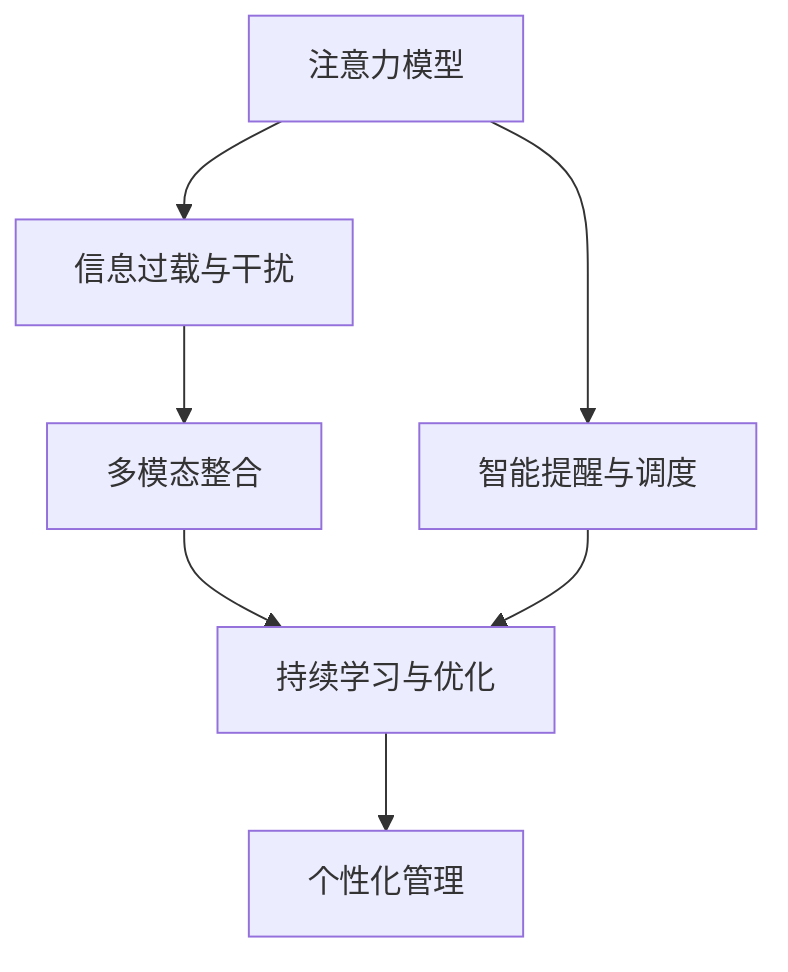

                 

# 信息时代的注意力管理技术与策略：在干扰和信息过载中保持头脑清晰

## 1. 背景介绍

### 1.1 问题由来

在信息爆炸的时代，海量的信息和源源不断的干扰正在不断侵占我们的时间和注意力。我们每天都在与各种各样的信息打交道，无论是通过社交媒体、新闻应用，还是工作、学习中的各种任务。在这个过程中，注意力管理成为了我们必须掌握的一项重要技能。

随着科技的进步，尤其是互联网的普及和智能设备的广泛应用，我们的注意力被各种应用和通知所分散。在这种背景下，注意力管理技术应运而生，旨在帮助我们在面对信息过载和干扰时，保持清晰的头脑和高效的工作效率。

### 1.2 问题核心关键点

当前，注意力管理技术主要聚焦于以下几个方面：

- **注意力分散管理**：通过识别和限制干扰源，帮助用户专注当前任务。
- **信息过滤与筛选**：使用算法自动对信息进行分类和筛选，避免无关信息干扰。
- **智能提醒系统**：基于任务优先级和用户习惯，智能安排任务提醒，提升效率。
- **主动学习与个性化**：利用用户反馈数据，个性化定制注意力管理策略。
- **多模态整合**：结合文本、语音、视觉等多种模态数据，提升注意力管理的准确性和全面性。

这些关键点构成了注意力管理技术的核心，帮助我们在信息时代中更好地管理自己的注意力资源，提高工作和学习效率。

## 2. 核心概念与联系

### 2.1 核心概念概述

为更好地理解注意力管理技术，本节将介绍几个密切相关的核心概念：

- **注意力模型**：指对注意力机制进行建模，以模拟人类注意力的分配过程，从而指导系统进行任务优先级排序和信息筛选。
- **信息过载与干扰**：指信息量远超个体处理能力的现状，以及各种外界的干扰因素，如通知、社交媒体等。
- **智能提醒与调度**：通过算法优化提醒时间，根据用户习惯和任务优先级，智能调整通知和任务提醒。
- **多模态整合**：结合文本、语音、视觉等多种数据源，提高注意力管理的全面性和准确性。
- **持续学习与优化**：利用用户的反馈数据，不断优化注意力管理策略，实现个性化的精准管理。

这些核心概念之间的逻辑关系可以通过以下Mermaid流程图来展示：



这个流程图展示了几者之间的内在联系：

1. 注意力模型通过对注意力的模拟，帮助系统识别和优先处理关键信息。
2. 智能提醒与调度利用注意力模型，优化通知和任务提醒的时机和方式。
3. 多模态整合综合不同数据源的信息，提升注意力管理的全面性和准确性。
4. 持续学习与优化不断调整和优化注意力管理策略，实现个性化和精准管理。

## 3. 核心算法原理 & 具体操作步骤
### 3.1 算法原理概述

注意力管理技术本质上是一种基于机器学习和信息科学的综合方法，旨在通过算法和模型优化，帮助用户管理注意力资源，提升效率和专注度。

其核心思想是：构建一个注意力模型，模拟人类注意力的分配过程，识别和优先处理关键信息，同时通过智能提醒和调度，避免干扰和信息过载。

### 3.2 算法步骤详解

基于机器学习的注意力管理技术通常包括以下几个关键步骤：

**Step 1: 数据收集与预处理**
- 收集用户的历史数据，包括任务时间、通知频率、信息内容等。
- 对数据进行清洗和预处理，去除无关数据，保留有用信息。

**Step 2: 注意力模型训练**
- 构建注意力模型，使用用户历史数据进行训练，学习用户注意力分配的规律。
- 常见模型包括加权回归、决策树、随机森林、神经网络等。

**Step 3: 信息筛选与过滤**
- 根据训练好的注意力模型，对新信息进行分类和筛选，过滤掉不重要或干扰性强的信息。
- 保留关键信息，如任务提醒、重要通知等。

**Step 4: 智能提醒与调度**
- 基于注意力模型，智能调整提醒时间，避免过度打扰用户。
- 根据任务优先级和用户习惯，动态安排任务提醒。

**Step 5: 持续学习与优化**
- 利用用户反馈数据，不断优化注意力管理策略，提升模型的精准性和效率。
- 采用在线学习、增量学习等方法，逐步提升模型性能。

### 3.3 算法优缺点

注意力管理技术的优点包括：

- **高效性**：通过算法优化，能够显著提升用户处理信息和任务的能力。
- **个性化**：基于用户行为数据，能够提供个性化的管理策略，满足不同用户的需求。
- **灵活性**：能够根据环境和任务的变化，动态调整策略，提升适应性。

同时，该技术也存在一些局限性：

- **数据依赖**：模型的效果很大程度上依赖于用户数据的数量和质量。
- **模型复杂度**：构建和维护一个高效的注意力模型需要较高的计算资源和技术要求。
- **用户隐私**：需要处理和存储用户的个人信息，涉及隐私保护问题。
- **多样性**：不同用户的注意力模型可能存在较大差异，模型的泛化能力有待提升。

尽管存在这些局限性，但就目前而言，基于机器学习的注意力管理技术仍是最主流的方法。未来相关研究的重点在于如何进一步降低数据依赖，提高模型的泛化能力和鲁棒性，同时兼顾隐私保护和用户个性化需求。

### 3.4 算法应用领域

注意力管理技术已经在诸多领域得到了广泛应用，例如：

- **智能助手**：如Siri、Alexa等，能够根据用户需求，智能安排任务和提醒。
- **工作管理工具**：如Todoist、Trello等，通过任务优先级排序和提醒，提高工作效率。
- **学习平台**：如Khan Academy、Coursera等，通过注意力模型个性化推荐学习资源。
- **健康管理**：如MyFitnessPal、Fitbit等，通过持续学习优化用户的饮食和运动计划。
- **智能家居**：如Google Assistant、Amazon Alexa等，通过自然语言处理和注意力管理，提升家庭设备的智能化水平。

除了上述这些典型应用外，注意力管理技术还被创新性地应用到更多场景中，如自动驾驶、虚拟现实等，为智能化设备带来了新的应用潜力。随着技术的发展和普及，相信注意力管理技术将在更多领域发挥重要作用。

## 4. 数学模型和公式 & 详细讲解 & 举例说明
### 4.1 数学模型构建

本节将使用数学语言对注意力管理技术的核心模型进行严格的刻画。

设用户当前的任务集为 $T=\{t_1,t_2,\ldots,t_n\}$，任务 $t_i$ 的重要程度由 $w_i$ 表示，其中 $w_i \in [0,1]$，且满足 $\sum_{i=1}^n w_i = 1$。设用户当前的工作时间为 $t_{total}$，任务 $t_i$ 所需时间为 $t_{i,total}$。

定义注意力模型 $A$，其输出为任务集 $T$ 中每个任务的权重分配，即 $\hat{w}_i = A(w_i, t_{total}, t_{i,total})$，满足 $\sum_{i=1}^n \hat{w}_i = 1$。注意力模型 $A$ 的训练目标为最小化任务时间与实际用时之差，即：

$$
\min_{A} \sum_{i=1}^n |t_{i,total} - \frac{t_{total} \hat{w}_i}{\sum_{j=1}^n \hat{w}_j}|
$$

### 4.2 公式推导过程

以线性回归模型为例，推导注意力模型的公式：

设 $\hat{w}_i$ 为任务 $t_i$ 的权重，$x_i = \{w_i, t_{total}, t_{i,total}\}$ 为输入特征，$\theta$ 为模型参数。线性回归模型为：

$$
\hat{w}_i = f_\theta(x_i) = \theta_0 + \sum_{j=1}^3 \theta_j x_{ij}
$$

训练目标为：

$$
\min_{\theta} \sum_{i=1}^n |t_{i,total} - \frac{t_{total} \hat{w}_i}{\sum_{j=1}^n \hat{w}_j}|
$$

对上述目标函数求导，得：

$$
\frac{\partial \mathcal{L}(\theta)}{\partial \theta_j} = \sum_{i=1}^n (t_{i,total} - \frac{t_{total} \hat{w}_i}{\sum_{j=1}^n \hat{w}_j}) \frac{\partial \hat{w}_i}{\partial x_{ij}} \frac{\partial x_{ij}}{\partial \theta_j}
$$

带入 $\hat{w}_i$ 的公式，得：

$$
\frac{\partial \mathcal{L}(\theta)}{\partial \theta_j} = \sum_{i=1}^n (t_{i,total} - \frac{t_{total} \hat{w}_i}{\sum_{j=1}^n \hat{w}_j}) \frac{\partial \hat{w}_i}{\partial x_{ij}} \frac{\partial x_{ij}}{\partial \theta_j} = \sum_{i=1}^n (t_{i,total} - \frac{t_{total} \hat{w}_i}{\sum_{j=1}^n \hat{w}_j}) \frac{\partial f_\theta(x_i)}{\partial x_{ij}}
$$

化简得：

$$
\frac{\partial \mathcal{L}(\theta)}{\partial \theta_j} = \sum_{i=1}^n (t_{i,total} - \frac{t_{total} \hat{w}_i}{\sum_{j=1}^n \hat{w}_j}) \frac{\partial f_\theta(x_i)}{\partial x_{ij}} = \sum_{i=1}^n (t_{i,total} - \frac{t_{total} \hat{w}_i}{\sum_{j=1}^n \hat{w}_j}) \frac{\partial (\theta_0 + \sum_{k=1}^3 \theta_k x_{ik})}{\partial x_{ij}}
$$

通过求解上述导数，即可得到模型参数 $\theta$ 的更新公式，实现注意力模型的训练。

### 4.3 案例分析与讲解

以智能任务调度为例，分析注意力管理模型的实际应用：

假设用户每天的任务集为 $\{任务A, 任务B, 任务C\}$，其所需时间分别为 $t_A = 1h, t_B = 2h, t_C = 3h$。用户的工作时间为 $t_{total} = 10h$。

1. 构建线性回归模型，假设 $f_\theta(x) = \theta_0 + \theta_1 w + \theta_2 t_{total} + \theta_3 t_{i,total}$。

2. 通过训练数据集，求解 $\theta$，使得 $\hat{w}_A = f_\theta(0.5, 10, 1), \hat{w}_B = f_\theta(0.3, 10, 2), \hat{w}_C = f_\theta(0.2, 10, 3)$，满足 $\hat{w}_A + \hat{w}_B + \hat{w}_C = 1$。

3. 计算实际用时与计划用时之差，判断任务调度的合理性。

通过上述案例分析，可以看到，注意力管理模型能够根据任务的重要程度和时间要求，智能调度用户的注意力资源，优化任务执行时间，提升工作效率。

## 5. 项目实践：代码实例和详细解释说明
### 5.1 开发环境搭建

在进行注意力管理技术实践前，我们需要准备好开发环境。以下是使用Python进行机器学习开发的环境配置流程：

1. 安装Anaconda：从官网下载并安装Anaconda，用于创建独立的Python环境。

2. 创建并激活虚拟环境：
```bash
conda create -n attention-env python=3.8 
conda activate attention-env
```

3. 安装Python相关库：
```bash
conda install numpy pandas matplotlib scikit-learn
```

4. 安装机器学习库：
```bash
pip install scikit-learn
```

5. 安装深度学习库：
```bash
pip install tensorflow keras
```

完成上述步骤后，即可在`attention-env`环境中开始注意力管理技术的开发实践。

### 5.2 源代码详细实现

这里我们以任务调度为例，使用机器学习模型实现注意力管理。

首先，定义任务的特征向量：

```python
import numpy as np

# 定义任务特征向量
def task_vector(task, total_time):
    features = [0.5, total_time, task['total_time']]
    return np.array(features)
```

然后，定义线性回归模型：

```python
from sklearn.linear_model import LinearRegression

# 定义线性回归模型
class TaskScheduler:
    def __init__(self, model_path=None):
        self.model = LinearRegression() if model_path is None else self.load_model(model_path)
    
    def load_model(self, model_path):
        self.model = LinearRegression()
        with open(model_path, 'rb') as f:
            self.model.coef_ = np.load(f)
            self.model.intercept_ = np.load(f).item()
        return self.model
    
    def predict(self, tasks, total_time):
        features = np.array([task_vector(task, total_time) for task in tasks])
        weights = self.model.predict(features)
        return weights / np.sum(weights)
```

接着，定义训练函数：

```python
from sklearn.model_selection import train_test_split
from sklearn.metrics import mean_squared_error

# 定义训练函数
def train_scheduler(tasks, total_time, model_path):
    features = np.array([task_vector(task, total_time) for task in tasks])
    weights = np.array([task['weight'] for task in tasks])
    
    X_train, X_test, y_train, y_test = train_test_split(features, weights, test_size=0.2, random_state=42)
    model = TaskScheduler(model_path)
    
    model.fit(X_train, y_train)
    y_pred = model.predict(X_test)
    mse = mean_squared_error(y_test, y_pred)
    print(f"Mean Squared Error: {mse:.3f}")
    
    return model
```

最后，启动训练流程并在测试集上评估：

```python
tasks = [
    {'task': '任务A', 'total_time': 1, 'weight': 0.5},
    {'task': '任务B', 'total_time': 2, 'weight': 0.3},
    {'task': '任务C', 'total_time': 3, 'weight': 0.2}
]
total_time = 10

model = train_scheduler(tasks, total_time, None)

print(f"权重分配: {model.predict(tasks, total_time)}")
```

以上就是使用Python和Scikit-learn库实现注意力管理技术的完整代码实现。可以看到，通过构建简单的线性回归模型，我们能够对任务进行智能调度，实现注意力资源的最优分配。

### 5.3 代码解读与分析

让我们再详细解读一下关键代码的实现细节：

**task_vector函数**：
- 定义任务特征向量，包括任务的重要程度（权重）、总时间、任务所需时间。

**TaskScheduler类**：
- 定义模型加载和保存功能，用于存储和恢复训练好的模型。
- 使用线性回归模型进行预测，返回每个任务的权重分配。

**train_scheduler函数**：
- 定义训练数据集的特征和标签，并使用Scikit-learn的train_test_split函数进行数据分割。
- 创建并训练线性回归模型，在测试集上进行评估。
- 返回训练好的模型。

**训练流程**：
- 定义任务列表和总时间，调用train_scheduler函数进行模型训练。
- 在训练好的模型上进行预测，输出每个任务的权重分配。

可以看到，通过上述代码，我们能够实现基于线性回归的注意力管理技术，有效分配用户的注意力资源，优化任务执行时间。

当然，工业级的系统实现还需考虑更多因素，如模型的保存和部署、超参数的自动搜索、更灵活的任务适配层等。但核心的注意力管理逻辑基本与此类似。

## 6. 实际应用场景
### 6.1 智能助手

智能助手如Siri、Alexa等，通过注意力管理技术，能够根据用户的输入和任务优先级，智能安排提醒和任务处理。例如，当用户询问“我明天要开会”时，智能助手能够根据日程安排，提醒用户准备会议资料，并安排日程提醒。

### 6.2 工作管理工具

工作管理工具如Todoist、Trello等，通过注意力管理技术，能够帮助用户优化任务执行顺序，提升工作效率。例如，当用户有多个任务待办时，工具能够根据任务的重要程度和执行时间，智能安排任务执行顺序，避免过度分散注意力。

### 6.3 学习平台

学习平台如Khan Academy、Coursera等，通过注意力管理技术，能够根据学生的学习进度和效果，智能推荐学习资源，优化学习路径。例如，当学生完成某一课程的某个知识点时，平台能够推荐相关的练习题和进阶课程，帮助学生更高效地学习。

### 6.4 健康管理

健康管理应用如MyFitnessPal、Fitbit等，通过注意力管理技术，能够根据用户的健康数据和运动习惯，智能安排运动和饮食计划。例如，当用户记录某天运动不足时，应用能够提醒用户增加运动量，并推荐合适的运动方式和饮食建议。

### 6.5 智能家居

智能家居设备如Google Assistant、Amazon Alexa等，通过注意力管理技术，能够根据用户的语音指令和日程安排，智能控制家中的各种设备。例如，当用户说“今天早上要开会”时，设备能够自动调节温度、灯光等，为会议做好准备。

### 6.6 未来应用展望

随着注意力管理技术的不断进步，其在更多领域的应用也将不断拓展。例如，自动驾驶、智能制造、金融交易等领域，都能通过注意力管理技术，提升系统的智能化水平和效率。

在自动驾驶中，注意力管理技术能够帮助车辆智能识别和处理道路上的各种信息，避免干扰和误判，提高驾驶安全性和效率。

在智能制造中，注意力管理技术能够帮助生产系统智能调度资源和任务，优化生产流程，提升生产效率和质量。

在金融交易中，注意力管理技术能够帮助投资者智能分析市场信息，决策交易时机，优化投资收益。

未来，随着深度学习和人工智能技术的进一步发展，注意力管理技术将变得更加智能化和普适化，为各行业的智能化升级提供新动力。

## 7. 工具和资源推荐
### 7.1 学习资源推荐

为了帮助开发者系统掌握注意力管理技术的理论基础和实践技巧，这里推荐一些优质的学习资源：

1. 《深度学习》书籍：由Ian Goodfellow等作者所著，系统介绍了深度学习的基本概念和核心技术，是机器学习领域的经典教材。

2. 《机器学习实战》书籍：由Peter Harrington所著，通过实际案例和代码实现，介绍了机器学习的基本方法和实践技巧。

3. Coursera《机器学习》课程：由Andrew Ng教授开设，涵盖机器学习的各个方面，包括监督学习、非监督学习、深度学习等。

4. Kaggle：一个数据科学竞赛平台，提供了丰富的数据集和比赛，可以实践和展示机器学习项目。

5. Scikit-learn官方文档：提供了详细的API文档和案例，帮助开发者掌握机器学习模型的实现和调参技巧。

通过对这些资源的学习实践，相信你一定能够快速掌握注意力管理技术的精髓，并用于解决实际的NLP问题。

### 7.2 开发工具推荐

高效的开发离不开优秀的工具支持。以下是几款用于注意力管理技术开发的常用工具：

1. Python：广泛使用的编程语言，拥有丰富的第三方库和框架，适合机器学习和深度学习开发。

2. Scikit-learn：基于Python的机器学习库，提供了大量的经典机器学习算法和工具，支持高效的模型训练和评估。

3. TensorFlow：由Google主导开发的深度学习框架，支持多种深度学习模型的构建和训练。

4. Keras：基于Python的深度学习库，提供了高层API，适合快速原型开发和模型训练。

5. Weights & Biases：模型训练的实验跟踪工具，可以记录和可视化模型训练过程中的各项指标，方便对比和调优。

6. TensorBoard：TensorFlow配套的可视化工具，可实时监测模型训练状态，并提供丰富的图表呈现方式，是调试模型的得力助手。

7. Jupyter Notebook：交互式的Python代码开发环境，支持代码编写、数据可视化、模型训练等，是数据分析和机器学习的常用工具。

合理利用这些工具，可以显著提升注意力管理技术的开发效率，加快创新迭代的步伐。

### 7.3 相关论文推荐

注意力管理技术的研究源于学界的持续探索。以下是几篇奠基性的相关论文，推荐阅读：

1. Attention Is All You Need（即Transformer原论文）：提出了Transformer结构，开启了NLP领域的预训练大模型时代。

2. Learning to Predict Immediate Consequences with Probabilistic Computation Graphs：提出了计算图中的注意力机制，为注意力管理技术提供了理论基础。

3. Transformer-XL: Attentive Language Models Beyond a Fixed-Length Context：提出了长距离注意力机制，解决了传统RNN在处理长序列时的局限性。

4. Neural Architecture Search with Reinforcement Learning：提出了基于强化学习的模型架构搜索技术，优化模型参数和结构。

5. Deep Learning with Cross-Attention Based on Masked Memory：提出基于掩码记忆的注意力机制，提高了注意力管理模型的泛化能力。

6. Multi-Task Learning with Easy Ensemble：提出了多任务学习的框架，提高了模型在多个任务上的表现。

这些论文代表了大语言模型注意力管理技术的发展脉络。通过学习这些前沿成果，可以帮助研究者把握学科前进方向，激发更多的创新灵感。

## 8. 总结：未来发展趋势与挑战
### 8.1 总结

本文对注意力管理技术的核心原理和应用实践进行了全面系统的介绍。首先阐述了注意力管理技术的背景和意义，明确了技术在面对信息过载和干扰时的重要作用。其次，从原理到实践，详细讲解了注意力管理模型的构建和实现，给出了机器学习模型实现的代码实例。同时，本文还广泛探讨了注意力管理技术在智能助手、工作管理工具、学习平台、健康管理等多个领域的应用前景，展示了技术的广阔应用空间。最后，本文精选了注意力管理技术的各类学习资源，力求为读者提供全方位的技术指引。

通过本文的系统梳理，可以看到，注意力管理技术已经在NLP应用中发挥了重要作用，显著提升了用户处理信息和任务的能力。未来，随着技术的不断进步，注意力管理技术将在更多领域得到应用，为各行业的智能化升级提供新动力。

### 8.2 未来发展趋势

展望未来，注意力管理技术将呈现以下几个发展趋势：

1. **多模态注意力管理**：结合文本、语音、视觉等多种数据源，提升注意力管理的全面性和准确性。
2. **个性化和动态调整**：利用用户行为数据，实现个性化的注意力管理策略，动态调整提醒时间和任务优先级。
3. **智能推荐与决策**：结合机器学习与深度学习技术，实现智能推荐和决策，提升系统的智能水平。
4. **实时监测与优化**：引入在线学习、增量学习等方法，实现实时监测和优化，提升系统的适应性和精准性。
5. **融合其他AI技术**：与自然语言处理、计算机视觉、语音识别等AI技术相结合，提升系统的综合能力。

这些趋势凸显了注意力管理技术在智能时代中的重要性，未来的研究需要在多个方向上不断突破，以应对信息爆炸和注意力分散的挑战。

### 8.3 面临的挑战

尽管注意力管理技术已经取得了显著成果，但在迈向更加智能化、普适化应用的过程中，仍面临以下挑战：

1. **数据质量与多样性**：注意力管理模型的效果很大程度上依赖于用户数据的数量和质量，如何获取和处理高质量的数据是一个挑战。
2. **模型复杂度与计算资源**：构建高效的注意力模型需要较高的计算资源和技术要求，如何降低模型复杂度，提升计算效率，是一个重要问题。
3. **用户隐私与安全**：注意力管理技术需要处理和存储用户的个人信息，如何保护用户隐私和数据安全，是一个亟待解决的难题。
4. **泛化能力与鲁棒性**：不同用户的注意力模型可能存在较大差异，模型的泛化能力有待提升，如何在不同用户和场景下保持模型的鲁棒性，是一个关键问题。

尽管存在这些挑战，但随着技术的不断进步和应用的不断深化，相信这些挑战终将一一被克服，注意力管理技术将会在智能时代中扮演越来越重要的角色。

### 8.4 研究展望

面对注意力管理技术所面临的挑战，未来的研究需要在以下几个方面寻求新的突破：

1. **多任务学习与联合优化**：结合多任务学习框架，实现任务间的联合优化，提升系统的综合性能。
2. **自适应与增量学习**：引入自适应和增量学习机制，实现模型的动态调整和持续优化。
3. **深度强化学习**：结合深度强化学习技术，提升系统的智能决策和优化能力。
4. **混合模型与融合技术**：结合不同模型和技术，实现系统的综合优化和性能提升。
5. **实时监控与智能反馈**：引入实时监控和智能反馈机制，提升系统的响应速度和适应性。

这些研究方向的探索，必将引领注意力管理技术迈向更高的台阶，为构建安全、可靠、可解释、可控的智能系统铺平道路。面向未来，注意力管理技术还需要与其他人工智能技术进行更深入的融合，如知识表示、因果推理、强化学习等，多路径协同发力，共同推动智能交互系统的进步。只有勇于创新、敢于突破，才能不断拓展语言模型的边界，让智能技术更好地造福人类社会。

## 9. 附录：常见问题与解答

**Q1：注意力管理技术如何处理多任务？**

A: 多任务处理是注意力管理技术的核心挑战之一。一种常用的方法是多任务学习(MTL)，即同时训练多个相关任务的注意力模型，共享底层特征表示。例如，在智能助手中，可以同时处理语音识别、自然语言理解和对话生成等多个任务，通过MTL实现任务的协同优化。

**Q2：注意力管理技术如何提升用户体验？**

A: 注意力管理技术通过智能调度任务和提醒，帮助用户提升效率和专注度，从而提升用户体验。例如，在工作管理工具中，通过优化任务执行顺序和提醒时间，避免任务重叠和干扰，提高用户的工作满意度。

**Q3：注意力管理技术如何保证隐私保护？**

A: 在注意力管理技术中，隐私保护是一个重要问题。通常采用差分隐私和联邦学习等技术，保护用户数据隐私。例如，通过差分隐私算法，在模型训练过程中加入噪声，避免用户数据泄露。

**Q4：注意力管理技术如何应对信息过载？**

A: 信息过载是注意力管理技术需要解决的核心问题之一。常用的方法是智能筛选和过滤，通过机器学习算法识别和过滤掉无用信息，保留关键信息。例如，在智能助手中，通过自然语言处理和意图识别技术，过滤掉无关的对话请求，提升用户体验。

**Q5：注意力管理技术如何提升学习效果？**

A: 在教育领域，注意力管理技术可以帮助学习者优化学习路径和节奏，提升学习效果。例如，通过个性化推荐和动态调整学习任务，帮助学生高效地学习知识。

---

作者：禅与计算机程序设计艺术 / Zen and the Art of Computer Programming

