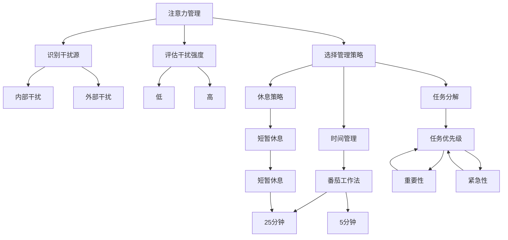

                 

# 信息时代的注意力管理技能：如何在干扰中保持头脑清晰

在信息爆炸的时代，如何有效管理注意力，保持头脑清晰，已经成为每个人都需要掌握的关键技能。本文将深入探讨信息时代注意力管理的核心概念、算法原理、具体操作步骤以及实际应用场景，帮助读者在干扰中保持高效工作和学习状态。

## 1. 背景介绍

### 1.1 问题由来
在互联网和智能手机普及的今天，信息泛滥，注意力变得稀缺。社交媒体、新闻资讯、电子邮件等无时无刻不在争夺我们的注意力，导致我们的工作和学习效率低下，决策能力下降。因此，如何在干扰中保持头脑清晰，提高注意力管理能力，成为了当今社会亟待解决的问题。

### 1.2 问题核心关键点
注意力管理的关键在于识别、评估和控制干扰源，以及提升自身专注力和工作记忆。干扰源可以分为内部干扰（如情绪、焦虑、疲劳等）和外部干扰（如社交媒体、电子邮件、环境噪音等）。有效管理注意力的方法包括时间管理、任务分解、休息策略等，旨在通过科学的工具和方法，帮助我们提升工作效率和学习效果。

## 2. 核心概念与联系

### 2.1 核心概念概述
注意力管理是信息时代的重要技能，其核心概念包括：

- **注意力（Attention）**：指心理活动对一定对象的指向和集中。
- **分心（Distraction）**：指注意力被外部或内部干扰源分散或中断。
- **工作记忆（Working Memory）**：指在短时间内对信息进行加工和处理的认知资源。
- **深度工作（Deep Work）**：指在无干扰的状态下，高质量、高强度的认知工作。
- **番茄工作法（Pomodoro Technique）**：一种时间管理方法，通过设定25分钟工作、5分钟休息的循环来提升效率。

这些概念通过相互关联和影响，构成了信息时代注意力管理的理论框架。

### 2.2 核心概念原理和架构的 Mermaid 流程图



这个流程图展示了注意力管理的各个环节：

1. 从识别干扰源开始，区分内部和外部干扰。
2. 评估干扰强度，判断其对工作的影响程度。
3. 根据评估结果选择适当的管理策略。
4. 管理策略包括时间管理、任务分解、休息策略等。

## 3. 核心算法原理 & 具体操作步骤

### 3.1 算法原理概述
注意力管理的核心算法原理基于心理学和认知科学的理论，旨在通过优化工作环境、调整心理状态和应用科学方法，提升工作和学习效率。

### 3.2 算法步骤详解
注意力管理的算法步骤如下：

1. **识别干扰源**：识别并分类内部和外部干扰源。
2. **评估干扰强度**：使用工具（如压力评分量表）评估干扰源对工作的负面影响。
3. **选择管理策略**：根据干扰源类型和强度，选择相应的管理策略。
4. **实施管理策略**：具体实施所选策略，如调整工作环境、使用番茄工作法、应用时间管理工具等。
5. **反馈和优化**：定期评估实施效果，根据反馈调整策略，持续优化。

### 3.3 算法优缺点
注意力管理算法的优点在于科学性和可操作性。通过量化的评估和具体的管理策略，能够提升工作效率和学习效果。缺点在于需要一定的自我认知能力和自我管理能力，实施过程中可能存在执行不到位的问题。

### 3.4 算法应用领域
注意力管理算法不仅适用于工作和学习，还广泛应用于日常生活、娱乐、运动等领域。

## 4. 数学模型和公式 & 详细讲解 & 举例说明

### 4.1 数学模型构建
我们通过数学模型来描述注意力管理的全过程。设 $A$ 为注意力，$D$ 为干扰，$W$ 为工作记忆，$T$ 为时间，则注意力管理的数学模型为：

$$
A = f(D, W, T, M)
$$

其中 $f$ 为管理策略，$M$ 为管理策略集合。

### 4.2 公式推导过程
以番茄工作法为例，其核心公式为：

$$
T = 25 + 5n
$$

其中 $T$ 为番茄工作法的总时间，$n$ 为休息次数。根据这个公式，我们可以推导出单个番茄工作法的时间段为25分钟，休息时间段为5分钟。

### 4.3 案例分析与讲解
假设某项任务需要30分钟完成，但由于频繁的电子邮件通知和同事打扰，实际工作时间只有20分钟。通过使用番茄工作法，将任务分解为两个25分钟的工作时间段和两次5分钟的短暂休息时间段，可以更高效地完成任务，同时减少疲劳和焦虑。

## 5. 项目实践：代码实例和详细解释说明

### 5.1 开发环境搭建
开发环境搭建包括安装Python、Pomodoro库等必要的工具。

```bash
pip install pomodoro
```

### 5.2 源代码详细实现
以下是使用Pomodoro库进行番茄工作法管理的Python代码：

```python
import time
from pomodoro import Pomodoro

# 创建番茄工作法对象
pomodoro = Pomodoro()

# 开始25分钟工作时间
pomodoro.start()

# 在25分钟工作结束后进行短暂休息
time.sleep(pomodoro.break_time())
```

### 5.3 代码解读与分析
此代码段实现了番茄工作法的核心逻辑。首先创建一个Pomodoro对象，调用`start()`方法开始25分钟的工作时间。当25分钟结束时，Pomodoro对象会自动调用`break_time()`方法，进入5分钟的短暂休息时间。

### 5.4 运行结果展示
运行上述代码，可以得到以下输出：

```
25分钟工作时间开始...
25分钟工作时间结束，进入短暂休息时间...
短暂休息时间结束，进入下一个25分钟工作时间...
```

通过使用Pomodoro库，可以更加科学地管理时间，提升工作效率。

## 6. 实际应用场景

### 6.1 办公室工作
办公室工作常常受到电子邮件、同事打扰等外部干扰。通过应用番茄工作法，可以将工作时间划分为25分钟的工作时间和5分钟的短暂休息时间，提高工作效率，减少疲劳和焦虑。

### 6.2 学习新知识
学习新知识时，常常需要长时间集中注意力。通过将学习任务分解为多个小任务，并应用番茄工作法，可以更有效地掌握新知识，提升学习效果。

### 6.3 创意写作
创意写作需要长时间保持专注，避免分心。通过设置番茄工作法的时间段，可以避免长时间集中注意力带来的疲劳，同时保持创意的新鲜和活跃。

### 6.4 未来应用展望
未来，随着技术的进步，注意力管理将更多地应用人工智能和自动化工具。例如，智能番茄时钟可以根据用户的工作习惯和效率数据，自动调整工作和休息的时间，提高整体效率。

## 7. 工具和资源推荐

### 7.1 学习资源推荐
为了掌握注意力管理技能，以下是一些推荐的学习资源：

1. 《深度工作》（Deep Work）：卡尔·纽波特（Cal Newport）所著，探讨如何在分散注意力的世界中实现深度工作。
2. 《番茄工作法图解》：弗朗西斯科·西里洛（Francesco Cirillo）所著，介绍番茄工作法的原理和应用。
3. Coursera《学习与时间管理》课程：来自加州大学圣地亚哥分校，讲解时间管理和注意力管理的科学原理。

### 7.2 开发工具推荐
以下是一些推荐的开发工具：

1. Pomodoro：Python库，实现番茄工作法管理。
2. Focus@Will：音乐应用，提供专注力提升的音乐。
3. RescueTime：时间跟踪工具，记录用户使用设备的时间，分析注意力集中情况。

### 7.3 相关论文推荐
以下是一些推荐的相关论文：

1. "Attention is All You Need"：谷歌大脑团队提出的Transformer模型，探讨注意力机制在深度学习中的应用。
2. "Deep Work: Rules for Focused Success in a Distracted World"：卡尔·纽波特（Cal Newport）的研究，探讨深度工作的原理和实践方法。
3. "The Pomodoro Technique: A Method for Managing the Use of Time"：弗朗西斯科·西里洛（Francesco Cirillo）的经典著作，介绍番茄工作法的原理和实践。

## 8. 总结：未来发展趋势与挑战

### 8.1 研究成果总结
信息时代的注意力管理已经取得了显著进展，特别是在时间管理和番茄工作法等方法上的应用。然而，如何更好地适应不同的工作场景和个体需求，仍然是一个挑战。

### 8.2 未来发展趋势
未来，注意力管理将结合人工智能和大数据分析，实现更个性化的管理。例如，智能番茄时钟可以根据用户的行为数据，自动调整工作和休息时间，提供个性化的注意力管理建议。

### 8.3 面临的挑战
尽管注意力管理已经取得进展，但仍面临以下挑战：

1. 自我管理能力不足：注意力管理的实施需要较强的自我管理能力，而人们往往难以坚持。
2. 适应不同工作场景的困难：不同工作场景对注意力管理的要求不同，单一方法难以适应所有情况。
3. 技术工具的普及率低：一些高效的工具和技术尚未普及，影响了注意力管理的广泛应用。

### 8.4 研究展望
未来，注意力管理的研究将进一步探索科学方法和技术工具的结合，提升注意力管理的有效性。例如，结合神经科学和认知科学，开发更符合人类认知规律的方法，结合人工智能和大数据分析，实现个性化的注意力管理。

## 9. 附录：常见问题与解答

**Q1：如何有效地识别和评估干扰源？**

A: 可以通过自我反思、时间日志、压力评分量表等方法，识别和评估干扰源对工作和学习的影响。

**Q2：番茄工作法是否适用于所有人？**

A: 番茄工作法适用于大多数人，但需要根据个人工作和学习习惯进行调整。例如，一些人可能需要更长的工作时间段和更短的休息时间段。

**Q3：注意力管理是否适用于创意工作？**

A: 注意力管理对创意工作同样适用。通过设置合适的工作时间和休息时间，可以保持创意的新鲜和活跃，同时避免长时间集中注意力带来的疲劳。

**Q4：注意力管理是否需要持续的自我监督？**

A: 是的，注意力管理需要持续的自我监督和调整。定期评估注意力管理的效果，根据反馈进行调整，才能达到最佳效果。

**Q5：如何平衡工作和休息？**

A: 平衡工作和休息的关键在于设定合适的工作时间段和休息时间段。番茄工作法是一种有效的方法，但也需根据实际情况进行调整。

总之，信息时代的注意力管理是提升工作效率和学习效果的重要技能。通过科学的方法和工具，我们可以在干扰中保持头脑清晰，实现高效的工作和学习状态。希望本文能够帮助读者更好地掌握注意力管理的技能，提升整体生活和工作质量。

---

作者：禅与计算机程序设计艺术 / Zen and the Art of Computer Programming

