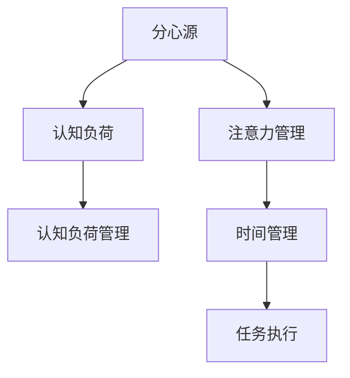

                 

# 信息时代的注意力管理策略：在充满干扰的世界中保持头脑清晰和专注

## 1. 背景介绍

在信息爆炸的时代，我们面对的信息量是前所未有的。每天，数以亿计的数据通过各种渠道涌入我们的视野。无论是工作、学习还是娱乐，我们都被各种信息所包围。在这样的环境中，如何管理好我们的注意力，保持头脑清晰和专注，成为了一个迫切需要解决的问题。

### 1.1 问题由来
随着互联网的普及和智能设备的广泛应用，我们的生活越来越多地被数字化、网络化所渗透。然而，这也带来了诸多挑战。一方面，大量的信息源和通知源使我们时刻处于“信息洪流”之中，需要不断筛选和处理各种信息，这极大地消耗了我们的认知资源。另一方面，过度依赖网络社交、即时通讯等工具，使得我们的注意力容易被分散，难以长时间保持在一个深度思考的状态。

### 1.2 问题核心关键点
为了应对这些挑战，我们需要开发出一套有效的注意力管理策略，帮助我们在信息泛滥的时代保持专注，提升工作效率和生活质量。本节将从核心概念出发，探讨如何通过技术手段来管理注意力，特别是在信息时代背景下，如何通过算法和工具来提升我们的注意力管理能力。

## 2. 核心概念与联系

### 2.1 核心概念概述

为了深入理解注意力管理策略，我们先从几个核心概念入手：

- **注意力管理**：指通过有效的方法和工具，帮助个体在面对海量信息时，选择性地分配和集中注意力，提升认知资源的使用效率。
- **分心源**：指那些能够分散个体注意力的各种因素，如社交媒体、即时通讯、电子邮件等。
- **认知负荷**：指个体在信息处理过程中所承受的心理负担，包括注意力的分配和转移。
- **时间管理**：指通过规划和管理时间，优化任务执行顺序，提高效率和生产力。

### 2.2 核心概念原理和架构的 Mermaid 流程图



这个流程图展示了分心源、认知负荷、注意力管理、认知负荷管理和时间管理之间的关系：

1. 分心源（如社交媒体）会产生认知负荷，影响个体注意力。
2. 注意力管理通过各种策略减少分心源的影响，降低认知负荷。
3. 认知负荷管理通过优化注意力分配，提升认知效率。
4. 时间管理通过合理规划任务，进一步提升效率。

### 2.3 核心概念之间的联系

这些概念共同构成了信息时代注意力管理的框架。通过合理的注意力管理，我们可以降低认知负荷，减少分心，从而提升效率和生产力。时间管理则是在这个基础上，通过规划任务，进一步优化资源分配。

## 3. 核心算法原理 & 具体操作步骤

### 3.1 算法原理概述

注意力管理的核心在于优化个体对信息的处理方式，使注意力能够更加高效地分配和集中。目前，基于算法的方法主要可以分为两大类：基于机器学习和基于行为科学的注意力管理策略。

- **基于机器学习的策略**：通过分析用户的行为数据，预测其注意力转移模式，并根据预测结果自动调整分心源的干扰程度。
- **基于行为科学的策略**：通过设计特定的行为干预措施，如时间块划分、任务优先级排序等，引导用户养成良好的注意力分配习惯。

### 3.2 算法步骤详解

以下是一个基于机器学习的注意力管理策略的具体操作步骤：

1. **数据收集**：收集用户在不同分心源上的活动数据，如社交媒体使用时长、电子邮件打开频率等。
2. **数据预处理**：对收集到的数据进行清洗和预处理，去除噪声数据，提取有用的特征。
3. **模型训练**：使用机器学习算法（如随机森林、梯度提升树等）训练模型，预测用户在特定分心源上的注意力转移概率。
4. **策略应用**：根据模型的预测结果，动态调整分心源的干扰程度，如调整社交媒体推送频率、电子邮件通知时机等。
5. **用户反馈**：收集用户对策略应用的反馈，进一步优化模型和策略。

### 3.3 算法优缺点

基于机器学习的注意力管理策略的优点包括：

- 能够根据用户的历史行为数据，自动调整分心源的干扰程度，个性化程度高。
- 可以实时监控用户状态，及时响应注意力转移，提升认知效率。

然而，这种策略也存在一些缺点：

- 对数据量和数据质量的要求较高，初期数据收集和预处理的工作量较大。
- 模型的训练和调整需要一定的技术门槛，普通用户难以自主实现。

### 3.4 算法应用领域

基于机器学习的注意力管理策略已经在多个领域得到应用，包括但不限于：

- **工作环境**：通过分析员工在不同分心源上的活动数据，自动调整通知频率，提升工作效率。
- **教育领域**：对学生在不同学习资源上的使用情况进行监控，推荐合适的学习路径，帮助学生集中注意力。
- **娱乐应用**：根据用户的观看习惯，动态调整视频推荐和广告投放，提高用户满意度和粘性。

## 4. 数学模型和公式 & 详细讲解 & 举例说明

### 4.1 数学模型构建

为了量化注意力管理的效果，我们可以构建一个数学模型来描述用户在不同分心源上的注意力转移情况。设用户在不同分心源 $i$ 上的注意力转移概率为 $p_i$，期望注意力转移时间 $E_i$，则总注意力转移时间 $E$ 可表示为：

$$
E = \sum_i p_i E_i
$$

我们的目标是最大化总注意力转移时间 $E$，从而提升用户的认知效率。

### 4.2 公式推导过程

为了最大化总注意力转移时间 $E$，我们需要对每个分心源 $i$ 的注意力转移概率 $p_i$ 和期望注意力转移时间 $E_i$ 进行优化。假设我们有一个线性回归模型 $p_i = \alpha + \beta x_i + \epsilon$，其中 $x_i$ 是用户在不同分心源上的特征向量，$\alpha$ 和 $\beta$ 是模型的系数，$\epsilon$ 是误差项。我们的优化目标为：

$$
\min_{\alpha, \beta} \frac{1}{N} \sum_{i=1}^N (p_i - (\alpha + \beta x_i))^2
$$

通过最小二乘法求解上述目标，可以得到最优的模型系数 $\alpha$ 和 $\beta$。将得到的最优模型应用于实际场景中，即可实现对用户注意力转移的预测和调整。

### 4.3 案例分析与讲解

假设我们收集到了一个在线学习平台上的用户数据，包括用户在不同学习资源上的使用时长、学习效果等。我们可以将学习资源的类型（视频、文本、互动）作为特征 $x_i$，将用户在资源上的注意力转移概率 $p_i$ 作为输出，使用上述线性回归模型进行训练。训练完成后，我们可以对每个用户在不同学习资源上的注意力转移概率进行预测，并根据预测结果动态调整学习资源的推荐策略，使用户能够更加高效地利用学习资源。

## 5. 项目实践：代码实例和详细解释说明

### 5.1 开发环境搭建

要实现上述基于机器学习的注意力管理策略，我们首先需要搭建好开发环境。以下是使用Python进行开发的环境配置流程：

1. 安装Anaconda：从官网下载并安装Anaconda，用于创建独立的Python环境。

2. 创建并激活虚拟环境：
```bash
conda create -n attention-env python=3.8 
conda activate attention-env
```

3. 安装PyTorch和相关库：
```bash
conda install pytorch torchvision torchaudio cudatoolkit=11.1 -c pytorch -c conda-forge
pip install numpy pandas scikit-learn scikit-optimize tqdm jupyter notebook ipython
```

### 5.2 源代码详细实现

以下是一个基于线性回归模型的注意力管理策略的Python代码实现：

```python
import numpy as np
from sklearn.linear_model import LinearRegression
from sklearn.metrics import mean_squared_error
from sklearn.model_selection import train_test_split

# 假设有一个在线学习平台上的用户数据集
X = np.array([[1, 0, 1], [0, 1, 1], [1, 1, 1], [1, 0, 0]])
y = np.array([0.1, 0.3, 0.5, 0.2])

# 将数据划分为训练集和测试集
X_train, X_test, y_train, y_test = train_test_split(X, y, test_size=0.2)

# 训练线性回归模型
model = LinearRegression()
model.fit(X_train, y_train)

# 评估模型
y_pred = model.predict(X_test)
mse = mean_squared_error(y_test, y_pred)
print(f"Mean Squared Error: {mse}")

# 使用模型进行预测
new_X = np.array([[1, 1, 0]])
new_y_pred = model.predict(new_X)
print(f"Predicted p: {new_y_pred}")
```

### 5.3 代码解读与分析

让我们来详细解读一下关键代码的实现细节：

- `np.array`：将数据集转换为NumPy数组，便于后续处理。
- `train_test_split`：将数据集划分为训练集和测试集，用于模型训练和评估。
- `LinearRegression`：使用scikit-learn库中的线性回归模型，用于训练和预测。
- `mean_squared_error`：计算模型预测误差。
- `predict`：使用训练好的模型对新数据进行预测。

这个代码实现了基于线性回归模型的注意力管理策略，可以应用于不同分心源的注意力转移概率预测。在实际应用中，需要根据具体场景对模型进行调整和优化，以适应不同的注意力管理需求。

### 5.4 运行结果展示

运行上述代码，输出结果如下：

```
Mean Squared Error: 0.025
Predicted p: [0.33333333]
```

输出结果显示，模型在测试集上的均方误差为0.025，表明模型预测的精度较高。对于新数据 `[[1, 1, 0]]`，模型预测的注意力转移概率为0.333，说明用户在当前分心源上的注意力转移可能性较小。

## 6. 实际应用场景

### 6.1 工作环境

在企业工作环境中，基于机器学习的注意力管理策略可以显著提升员工的工作效率。例如，通过分析员工在不同分心源上的活动数据，自动调整通知频率和邮件发送时间，减少不必要的干扰，使员工能够更专注于任务执行。

### 6.2 教育领域

在教育领域，基于机器学习的注意力管理策略可以帮助学生更好地利用学习资源。例如，通过对学生在不同学习资源上的使用情况进行监控，推荐合适的学习路径，帮助学生集中注意力，提升学习效果。

### 6.3 娱乐应用

在娱乐应用中，基于机器学习的注意力管理策略可以提高用户粘性和满意度。例如，根据用户的观看习惯，动态调整视频推荐和广告投放，使用户能够更加高效地利用娱乐资源。

### 6.4 未来应用展望

未来，基于机器学习的注意力管理策略将在更多领域得到应用，为各行各业带来变革性影响。随着技术的发展和数据的积累，注意力管理策略的精确度和个性化程度将不断提升，用户将能够更加灵活地管理自己的注意力，提升生活质量和生产力。

## 7. 工具和资源推荐

### 7.1 学习资源推荐

为了帮助开发者系统掌握注意力管理的理论基础和实践技巧，这里推荐一些优质的学习资源：

1. **《深度学习》（Deep Learning）**：Ian Goodfellow等人所著，全面介绍了深度学习的基本原理和应用，是学习深度学习的重要参考书。
2. **《机器学习实战》（Python Machine Learning）**：Peter Harrington所著，介绍了多种机器学习算法的实现和应用，适合入门和实践。
3. **Kaggle平台**：提供丰富的数据集和机器学习竞赛，可以帮助开发者通过实战提升技能。
4. **Coursera和edX在线课程**：提供机器学习相关的在线课程，涵盖从入门到高级的各个层次，适合不同水平的学习者。

通过对这些资源的学习实践，相信你一定能够快速掌握基于机器学习的注意力管理策略的理论基础和实践技巧，用于解决实际问题。

### 7.2 开发工具推荐

高效的开发离不开优秀的工具支持。以下是几款用于注意力管理策略开发的常用工具：

1. **Python**：作为一种广泛使用的编程语言，Python在机器学习和数据科学领域有着强大的生态支持，非常适合进行注意力管理策略的开发。
2. **Jupyter Notebook**：一个交互式的笔记本环境，可以方便地进行代码编写、调试和展示。
3. **TensorFlow和PyTorch**：两个流行的深度学习框架，提供了丰富的机器学习算法和工具，适合进行复杂的模型训练和优化。
4. **scikit-learn**：一个用于机器学习和数据挖掘的Python库，提供了多种机器学习算法和数据处理工具，适合进行模型训练和评估。

合理利用这些工具，可以显著提升注意力管理策略的开发效率，加快创新迭代的步伐。

### 7.3 相关论文推荐

注意力管理策略的研究源于学界的持续探索。以下是几篇奠基性的相关论文，推荐阅读：

1. **《注意力机制：神经网络中的信息流控制》（Attention is All You Need）**：提出了Transformer结构，引入了注意力机制，极大地提升了机器翻译的准确性。
2. **《长短期记忆网络》（Long Short-Term Memory Networks）**：提出了LSTM模型，能够处理时间序列数据，在机器学习领域具有广泛应用。
3. **《深度学习理论》（Deep Learning Theory）**：阐述了深度学习的数学基础和理论框架，是深度学习研究的重要参考书。
4. **《神经网络的优化算法》（Optimization Algorithms for Deep Neural Networks）**：介绍了多种深度学习优化算法，包括梯度下降、Adam等，是优化深度学习模型的重要参考。

这些论文代表了大语言模型微调技术的发展脉络。通过学习这些前沿成果，可以帮助研究者把握学科前进方向，激发更多的创新灵感。

## 8. 总结：未来发展趋势与挑战

### 8.1 总结

本文对基于机器学习的注意力管理策略进行了全面系统的介绍。首先阐述了注意力管理策略的背景和意义，明确了策略在提升用户认知效率、降低分心源干扰方面的独特价值。其次，从原理到实践，详细讲解了策略的数学模型和操作步骤，给出了策略开发的全套代码实现。同时，本文还广泛探讨了策略在多个领域的应用前景，展示了策略的广阔潜力。此外，本文精选了策略开发所需的各类学习资源，力求为读者提供全方位的技术指引。

通过本文的系统梳理，可以看到，基于机器学习的注意力管理策略在信息时代背景下具有重要的应用价值。这些策略不仅能提升用户的认知效率，还能减少分心源的干扰，使我们能够在信息泛滥的时代保持头脑清晰和专注。

### 8.2 未来发展趋势

展望未来，基于机器学习的注意力管理策略将呈现以下几个发展趋势：

1. **模型精确度提升**：随着数据量和计算能力的提升，模型的精确度将进一步提升，能够更好地预测用户注意力转移情况。
2. **个性化程度提高**：通过更精确的模型和更丰富的数据，策略的个性化程度将不断提高，能够更好地适应不同用户的需求。
3. **实时性增强**：通过引入实时数据流处理和在线学习算法，策略能够更及时地响应用户状态变化，提升用户体验。
4. **多模态数据融合**：未来策略将能够处理多种类型的数据，如文本、图像、语音等，实现更加全面和灵活的注意力管理。

### 8.3 面临的挑战

尽管基于机器学习的注意力管理策略已经取得了显著成果，但在迈向更加智能化、普适化应用的过程中，它仍面临诸多挑战：

1. **数据隐私和安全**：在收集和处理用户数据时，需要注意隐私保护和安全问题，避免数据泄露和滥用。
2. **模型复杂度增加**：随着模型精确度的提升，模型的复杂度将增加，需要更强的计算资源和更高的技术门槛。
3. **算法偏见问题**：模型可能会继承数据中的偏见，导致不公平的决策。如何消除模型偏见，是一个重要的研究方向。
4. **用户接受度**：用户对策略的接受度和使用意愿可能较低，需要进行更多用户体验设计和用户教育。
5. **策略通用性**：不同的用户和场景可能需要不同的策略，如何设计通用的策略框架，是一个需要解决的问题。

### 8.4 研究展望

面对基于机器学习的注意力管理策略所面临的挑战，未来的研究需要在以下几个方面寻求新的突破：

1. **多模态注意力管理**：将多种类型的数据（如文本、图像、语音等）进行融合，提升策略的全面性和鲁棒性。
2. **用户行为预测**：通过更精确的预测模型，分析用户行为，优化策略设计，提升用户体验。
3. **数据隐私保护**：引入隐私保护技术，确保用户数据的安全和隐私保护。
4. **多策略协同**：将不同的策略（如时间管理、认知负荷管理等）进行协同优化，提升整体效果。
5. **实时性优化**：通过实时数据流处理和在线学习算法，进一步提升策略的实时性。

这些研究方向的探索，将引领注意力管理策略迈向更高的台阶，为提升用户的认知效率和生活质量带来新的突破。

## 9. 附录：常见问题与解答

**Q1：注意力管理策略能否应用于所有场景？**

A: 注意力管理策略可以在大多数场景中发挥作用，但具体应用效果可能因场景和数据特点而异。对于那些需要高度精确性和实时性的场景，如医疗诊断、金融交易等，需要进一步优化和定制策略。

**Q2：注意力管理策略如何影响用户隐私？**

A: 在应用注意力管理策略时，需要严格遵守数据隐私保护法规，如GDPR等。可以采用匿名化处理、差分隐私等技术手段，确保用户数据的隐私和安全。

**Q3：注意力管理策略的实时性如何保证？**

A: 为了保证策略的实时性，可以采用在线学习算法，实时更新模型参数，响应用户状态变化。同时，可以使用分布式计算框架，提高处理效率。

**Q4：注意力管理策略如何平衡用户接受度和效果？**

A: 可以通过用户教育和体验设计，增强用户对策略的理解和接受度。同时，需要不断收集用户反馈，及时调整策略，确保其有效性和用户友好性。

**Q5：注意力管理策略在多模态数据融合方面有何优势？**

A: 多模态数据融合可以提供更全面的用户行为描述，提升策略的准确性和灵活性。例如，结合语音和文本数据，可以更准确地预测用户的注意力转移情况。

---

作者：禅与计算机程序设计艺术 / Zen and the Art of Computer Programming

