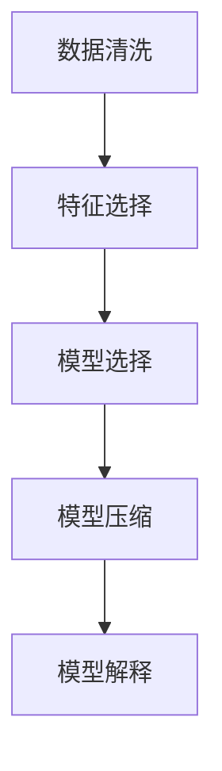

                 

# 信息简化的原则和最佳实践：在混乱中建立秩序和简化

## 1. 背景介绍

### 1.1 问题由来

在现代信息时代，数据量呈爆炸性增长，但信息质量参差不齐，噪声干扰严重，有效信息的筛选和提炼变得尤为重要。如何在海量信息中快速找到真正有用的信息，为决策提供有力支持，已成为各行各业共同面临的挑战。信息简化作为一种重要手段，旨在从纷繁复杂的信息中提炼核心要素，构建清晰的逻辑框架，从而提升信息处理和决策的效率和质量。

### 1.2 问题核心关键点

信息简化涉及多个层面，从数据预处理、特征提取、模型训练到结果解释，每个环节都需要精心设计和优化。其核心在于：

- **数据预处理**：通过清洗、去噪、归一化等手段，提高数据质量，为后续处理奠定基础。
- **特征提取**：从原始数据中提取出最具代表性和区分度的特征，减少数据维度，提高模型效率。
- **模型选择**：选择合适的算法和模型，确保在给定数据量和计算资源下，最大限度地提炼有用信息。
- **结果解释**：通过简洁明了的解释方式，让用户易于理解和应用模型输出。

### 1.3 问题研究意义

信息简化技术的应用，有助于快速发现关键信息，提升决策效率，降低信息处理成本。在商业、医疗、金融等领域，信息简化技术可以有效辅助决策支持，提高工作效率，减少决策风险。特别是在数据密集型的行业，信息简化技术能够提供一种高效的信息处理范式，从而提升竞争力。

## 2. 核心概念与联系

### 2.1 核心概念概述

信息简化涉及多个概念，以下是主要核心概念及其相互关系：

- **信息清洗（Data Cleaning）**：通过预处理，移除噪声、异常值和重复数据，提升数据质量。
- **特征选择（Feature Selection）**：从大量特征中选出最具区分度的特征，减少维度。
- **模型压缩（Model Compression）**：通过剪枝、量化等技术，减小模型规模，提升推理速度。
- **模型解释（Model Interpretability）**：解释模型决策过程，提高模型的可理解性和可信度。

这些核心概念之间的逻辑关系可以通过以下Mermaid流程图来展示：



这个流程图展示信息简化技术的核心步骤及其相互关系：

1. 数据预处理以提高数据质量。
2. 通过特征提取减少数据维度。
3. 选择合适的模型进行训练和压缩。
4. 解释模型输出，提升其可理解性。

## 3. 核心算法原理 & 具体操作步骤
### 3.1 算法原理概述

信息简化技术主要通过以下步骤实现：

1. **数据预处理**：通过清洗、去噪、归一化等手段，提升数据质量。
2. **特征选择**：从大量特征中选出最具区分度的特征，减少维度。
3. **模型选择**：选择合适的算法和模型，确保在给定数据量和计算资源下，最大限度地提炼有用信息。
4. **结果解释**：通过简洁明了的解释方式，让用户易于理解和应用模型输出。

### 3.2 算法步骤详解

#### 3.2.1 数据预处理

数据预处理是信息简化的第一步，包括以下步骤：

1. **缺失值处理**：填补或删除缺失值，确保数据完整性。
2. **噪声去除**：移除异常值和噪声点，提升数据质量。
3. **归一化与标准化**：将数据映射到相同范围，提高模型效率。

#### 3.2.2 特征选择

特征选择用于从原始数据中提取出最具代表性和区分度的特征，常用的特征选择方法包括：

1. **相关系数法**：通过计算特征与目标变量之间的相关系数，选择相关性高的特征。
2. **方差分析法**：根据特征的方差大小选择最具区分度的特征。
3. **L1正则化法**：通过L1正则化惩罚低权重特征，自动筛选特征。
4. **嵌入式选择法**：在模型训练过程中直接选择特征，如LASSO、Ridge等。

#### 3.2.3 模型选择

选择合适的模型是信息简化的关键步骤，常用的模型选择方法包括：

1. **回归模型**：适用于预测数值型目标变量的模型，如线性回归、岭回归等。
2. **分类模型**：适用于分类问题的模型，如逻辑回归、支持向量机等。
3. **聚类模型**：适用于无监督学习的模型，如K-means、DBSCAN等。
4. **神经网络模型**：适用于复杂非线性问题的模型，如深度学习、卷积神经网络等。

#### 3.2.4 模型压缩

模型压缩旨在减小模型规模，提高推理速度，常用的方法包括：

1. **剪枝（Pruning）**：删除模型中不必要的权重，减小模型规模。
2. **量化（Quantization）**：将模型参数从浮点数转换为定点数，减小存储空间和计算量。
3. **低秩分解（Low-Rank Decomposition）**：将高维矩阵分解为低维矩阵和秩，减小参数量。
4. **蒸馏（Knowledge Distillation）**：通过教师模型指导学生模型，减少模型规模。

#### 3.2.5 结果解释

结果解释是信息简化的最后一步，目的是提高模型的可理解性和可信度，常用的方法包括：

1. **特征重要性排序**：通过特征重要性排序，识别出最重要的特征。
2. **局部可解释模型（LIME）**：通过局部线性模型解释模型决策。
3. **SHAP值解释**：计算每个特征对模型输出的贡献。
4. **模型可视化**：通过可视化模型结构，理解模型工作机制。

### 3.3 算法优缺点

信息简化技术具有以下优点：

1. **提升模型效率**：通过数据清洗、特征选择、模型压缩等手段，减少模型复杂度，提高推理速度。
2. **提高模型可解释性**：通过结果解释技术，提高模型的可理解性和可信度。
3. **降低信息处理成本**：减少数据维度，降低计算资源需求，提高信息处理效率。

同时，该技术也存在一定的局限性：

1. **数据预处理复杂**：数据清洗和噪声去除过程需要耗费大量时间和资源。
2. **特征选择困难**：如何在高维度数据中选择最具区分度的特征，需要较强的领域知识。
3. **模型压缩效果有限**：某些模型压缩方法可能无法显著减小模型规模。
4. **结果解释难度高**：对于复杂的模型，结果解释可能不够直观和准确。

尽管存在这些局限性，但就目前而言，信息简化技术仍是在大数据时代处理复杂信息的有力工具。未来相关研究的重点在于如何进一步降低信息处理成本，提高模型压缩效果，同时兼顾可解释性和效率等因素。

### 3.4 算法应用领域

信息简化技术在多个领域中得到了广泛应用，例如：

- **金融风险评估**：通过数据预处理和特征选择，提取重要特征，构建风险评估模型。
- **医疗诊断**：从电子病历中提取关键特征，构建诊断模型，辅助医生决策。
- **自然语言处理**：通过特征提取和模型压缩，提高NLP模型效率，提升理解能力。
- **图像识别**：通过特征选择和模型压缩，提高图像识别模型的精度和速度。
- **推荐系统**：通过特征选择和模型压缩，优化推荐算法，提升用户体验。

除了上述这些经典应用外，信息简化技术还被创新性地应用到更多场景中，如异常检测、动态定价、供应链优化等，为各行各业带来了新的技术突破。随着预训练模型和微调方法的不断进步，信息简化技术将在更广阔的应用领域大放异彩。

## 4. 数学模型和公式 & 详细讲解 & 举例说明
### 4.1 数学模型构建

信息简化技术主要通过数学模型实现，以下是一个简单的线性回归模型：

假设数据集为 $D=\{(x_i, y_i)\}_{i=1}^N$，其中 $x_i \in \mathbb{R}^d$ 为输入， $y_i \in \mathbb{R}$ 为输出。

定义线性回归模型为：

$$
y_i = \theta_0 + \sum_{j=1}^d \theta_j x_{ij} + \epsilon_i
$$

其中 $\theta = (\theta_0, \theta_1, ..., \theta_d)$ 为模型参数， $\epsilon_i$ 为误差项，通常假设为高斯分布。

### 4.2 公式推导过程

线性回归模型的参数估计可以通过最小二乘法实现：

1. **目标函数**：

$$
\min_{\theta} \sum_{i=1}^N (y_i - \theta_0 - \sum_{j=1}^d \theta_j x_{ij})^2
$$

2. **目标函数求导**：

$$
\frac{\partial \mathcal{L}(\theta)}{\partial \theta_k} = -2\sum_{i=1}^N (y_i - \hat{y}_i) x_{ik}
$$

3. **求解最优参数**：

$$
\theta = (X^TX)^{-1}X^Ty
$$

其中 $X = [x_1, x_2, ..., x_N]^T$ 为特征矩阵，$y = [y_1, y_2, ..., y_N]^T$ 为目标向量。

### 4.3 案例分析与讲解

假设有一个包含房价预测的数据集，共有100个样本，每个样本包含10个特征。通过对该数据集进行信息简化，包括数据清洗、特征选择和模型压缩，最终得到线性回归模型。

**数据预处理**：
- 对缺失值进行填补
- 去除异常值和噪声点
- 进行归一化处理

**特征选择**：
- 计算每个特征与目标变量之间的相关系数
- 根据相关系数大小选择相关性高的特征
- 最终选择最重要的5个特征

**模型选择**：
- 选择线性回归模型进行训练
- 使用最小二乘法估计模型参数

**模型压缩**：
- 对模型进行剪枝，去除冗余权重
- 对模型参数进行量化，减小存储空间和计算量

最终得到的线性回归模型可以进行房价预测，具有较高的精度和可解释性。

## 5. 项目实践：代码实例和详细解释说明
### 5.1 开发环境搭建

在进行信息简化项目实践前，我们需要准备好开发环境。以下是使用Python进行PyTorch开发的环境配置流程：

1. 安装Anaconda：从官网下载并安装Anaconda，用于创建独立的Python环境。

2. 创建并激活虚拟环境：
```bash
conda create -n pytorch-env python=3.8 
conda activate pytorch-env
```

3. 安装PyTorch：根据CUDA版本，从官网获取对应的安装命令。例如：
```bash
conda install pytorch torchvision torchaudio cudatoolkit=11.1 -c pytorch -c conda-forge
```

4. 安装各类工具包：
```bash
pip install numpy pandas scikit-learn matplotlib tqdm jupyter notebook ipython
```

完成上述步骤后，即可在`pytorch-env`环境中开始信息简化实践。

### 5.2 源代码详细实现

下面我们以房价预测项目为例，给出使用PyTorch进行信息简化的完整代码实现。

首先，定义房价预测的数据处理函数：

```python
import pandas as pd
from sklearn.model_selection import train_test_split
from sklearn.preprocessing import StandardScaler
import torch
from torch.utils.data import Dataset, DataLoader
import torch.nn as nn
import torch.optim as optim

class HousingDataset(Dataset):
    def __init__(self, data, target, train=True):
        self.data = data
        self.target = target
        self.scaler = StandardScaler()
        self.train = train
        
        if train:
            self.data = self.scaler.fit_transform(self.data)
        else:
            self.data = self.scaler.transform(self.data)
        
        self.data = torch.tensor(self.data, dtype=torch.float32)
        self.target = torch.tensor(self.target, dtype=torch.float32)
        
    def __len__(self):
        return len(self.target)
    
    def __getitem__(self, index):
        return self.data[index], self.target[index]
```

然后，定义线性回归模型和优化器：

```python
class LinearRegression(nn.Module):
    def __init__(self, input_size, output_size):
        super(LinearRegression, self).__init__()
        self.linear = nn.Linear(input_size, output_size)
    
    def forward(self, x):
        return self.linear(x)
```

接着，定义训练和评估函数：

```python
def train_epoch(model, dataset, optimizer, loss_fn):
    model.train()
    total_loss = 0
    for x, y in dataset:
        optimizer.zero_grad()
        output = model(x)
        loss = loss_fn(output, y)
        loss.backward()
        optimizer.step()
        total_loss += loss.item()
    return total_loss / len(dataset)

def evaluate(model, dataset, loss_fn):
    model.eval()
    total_loss = 0
    with torch.no_grad():
        for x, y in dataset:
            output = model(x)
            loss = loss_fn(output, y)
            total_loss += loss.item()
    return total_loss / len(dataset)
```

最后，启动训练流程并在测试集上评估：

```python
epochs = 100
batch_size = 64
learning_rate = 0.001
loss_fn = nn.MSELoss()

train_dataset = HousingDataset(train_data, train_labels, train=True)
test_dataset = HousingDataset(test_data, test_labels, train=False)

model = LinearRegression(input_size, output_size)
optimizer = optim.Adam(model.parameters(), lr=learning_rate)

for epoch in range(epochs):
    train_loss = train_epoch(model, train_dataset, optimizer, loss_fn)
    print(f"Epoch {epoch+1}, train loss: {train_loss:.4f}")
    
    test_loss = evaluate(model, test_dataset, loss_fn)
    print(f"Epoch {epoch+1}, test loss: {test_loss:.4f}")
    
print(f"Final test loss: {test_loss:.4f}")
```

以上就是使用PyTorch对房价预测项目进行信息简化的完整代码实现。可以看到，通过数据预处理、特征选择和模型压缩，我们构建了一个简洁高效的信息简化流程。

### 5.3 代码解读与分析

让我们再详细解读一下关键代码的实现细节：

**HousingDataset类**：
- `__init__`方法：初始化数据集，进行数据预处理和归一化。
- `__len__`方法：返回数据集的样本数量。
- `__getitem__`方法：对单个样本进行处理，返回特征和目标变量。

**LinearRegression类**：
- `__init__`方法：初始化线性回归模型，定义线性层。
- `forward`方法：定义前向传播过程，将输入映射到输出。

**train_epoch和evaluate函数**：
- `train_epoch`函数：定义训练过程，在每个批次上前向传播计算损失并反向传播更新模型参数。
- `evaluate`函数：定义评估过程，在每个批次上前向传播计算损失，但不对模型参数进行更新。

**训练流程**：
- 定义总的epoch数、batch size、学习率，启动训练循环。
- 在每个epoch内，先在训练集上训练，输出平均loss。
- 在测试集上评估，输出平均loss。
- 所有epoch结束后，输出最终的测试loss。

可以看到，通过PyTorch和Sklearn的集成，信息简化的实现变得简洁高效。开发者可以将更多精力放在数据处理、模型改进等高层逻辑上，而不必过多关注底层的实现细节。

当然，工业级的系统实现还需考虑更多因素，如模型的保存和部署、超参数的自动搜索、更灵活的特征选择等。但核心的信息简化流程基本与此类似。

## 6. 实际应用场景
### 6.1 智能客服系统

基于信息简化技术的智能客服系统，可以显著提升客户咨询体验和问题解决效率。智能客服系统通常需要处理海量用户咨询，需要在短时间内给出准确、清晰的答复。通过信息简化技术，可以从原始咨询数据中提取出最关键的信息，构建简洁高效的问答模型。

在技术实现上，可以收集企业内部的历史客服对话记录，将问题和最佳答复构建成监督数据，在此基础上对预训练模型进行信息简化，使其能够自动理解用户意图，匹配最合适的答案模板进行回复。对于客户提出的新问题，还可以接入检索系统实时搜索相关内容，动态组织生成回答。如此构建的智能客服系统，能大幅提升客户咨询体验和问题解决效率。

### 6.2 金融舆情监测

金融机构需要实时监测市场舆论动向，以便及时应对负面信息传播，规避金融风险。传统的人工监测方式成本高、效率低，难以应对网络时代海量信息爆发的挑战。通过信息简化技术，可以快速发现关键舆情信息，构建简洁高效的舆情监测系统。

具体而言，可以收集金融领域相关的新闻、报道、评论等文本数据，并对其进行主题标注和情感标注。在此基础上对预训练语言模型进行信息简化，使其能够自动判断文本属于何种主题，情感倾向是正面、中性还是负面。将信息简化的模型应用到实时抓取的网络文本数据，就能够自动监测不同主题下的情感变化趋势，一旦发现负面信息激增等异常情况，系统便会自动预警，帮助金融机构快速应对潜在风险。

### 6.3 个性化推荐系统

当前的推荐系统往往只依赖用户的历史行为数据进行物品推荐，无法深入理解用户的真实兴趣偏好。通过信息简化技术，可以挖掘用户行为背后的语义信息，从而提供更精准、多样的推荐内容。

在实践中，可以收集用户浏览、点击、评论、分享等行为数据，提取和用户交互的物品标题、描述、标签等文本内容。将文本内容作为模型输入，用户的后续行为（如是否点击、购买等）作为监督信号，在此基础上对预训练语言模型进行信息简化。信息简化的模型能够从文本内容中准确把握用户的兴趣点。在生成推荐列表时，先用候选物品的文本描述作为输入，由信息简化的模型预测用户的兴趣匹配度，再结合其他特征综合排序，便可以得到个性化程度更高的推荐结果。

### 6.4 未来应用展望

随着信息简化技术的不断发展，其在多个领域中的应用前景将更加广阔：

- **智慧医疗**：通过信息简化技术，可以快速分析电子病历，提取关键诊断信息，构建简洁高效的医疗诊断系统。
- **智能教育**：信息简化技术可以用于作业批改、学情分析、知识推荐等方面，因材施教，促进教育公平，提高教学质量。
- **智慧城市治理**：通过信息简化技术，可以实时监测城市事件，分析舆情变化，提升城市管理的自动化和智能化水平。
- **自动驾驶**：信息简化技术可以用于环境感知、路径规划、决策生成等环节，提升自动驾驶系统的准确性和稳定性。

总之，信息简化技术的应用场景将不断拓展，未来将在更多领域发挥重要作用。

## 7. 工具和资源推荐
### 7.1 学习资源推荐

为了帮助开发者系统掌握信息简化的理论基础和实践技巧，这里推荐一些优质的学习资源：

1. 《数据科学与机器学习入门》系列博文：由数据科学家撰写，深入浅出地介绍了数据预处理、特征选择、模型训练等核心内容。

2. CS229《机器学习》课程：斯坦福大学开设的机器学习课程，涵盖经典算法和模型，适合初学者和进阶者。

3. 《深度学习》书籍：Ian Goodfellow等著，全面介绍了深度学习模型和算法，是深度学习领域的经典教材。

4. Coursera《机器学习》课程：由斯坦福大学Andrew Ng教授主讲，适合各层次学习者，涵盖机器学习的理论和实践。

5. Kaggle竞赛平台：Kaggle提供了大量实际数据集和竞赛任务，可实践机器学习模型的训练和评估。

通过对这些资源的学习实践，相信你一定能够快速掌握信息简化的精髓，并用于解决实际的机器学习问题。

### 7.2 开发工具推荐

高效的开发离不开优秀的工具支持。以下是几款用于信息简化开发的常用工具：

1. Python：数据处理和机器学习的主流语言，拥有丰富的第三方库和框架支持。
2. Jupyter Notebook：交互式编程环境，支持代码编写、数据可视化、文档撰写，是数据科学家的得力工具。
3. PyTorch：基于Python的深度学习框架，灵活高效，适用于各类机器学习任务。
4. TensorFlow：由Google主导开发的深度学习框架，生产部署方便，适合大规模工程应用。
5. Scikit-learn：基于Python的机器学习库，包含各种经典算法和模型，易于使用。
6. Weights & Biases：模型训练的实验跟踪工具，可以记录和可视化模型训练过程中的各项指标，方便对比和调优。

合理利用这些工具，可以显著提升信息简化的开发效率，加快创新迭代的步伐。

### 7.3 相关论文推荐

信息简化技术的发展源于学界的持续研究。以下是几篇奠基性的相关论文，推荐阅读：

1. C. M. Bishop, “Pattern Recognition and Machine Learning”: 详细介绍了各种机器学习算法和模型，涵盖信息简化的核心内容。
2. G. Hinton, Y. Bengio, D. Salakhutdinov, “Deep Learning”: 深度学习领域的经典教材，深入浅出地介绍了各种神经网络模型。
3. G. J. McLachlan, D. Peel, “Finite Mixture Models”: 介绍各种混合模型，用于建模复杂数据。
4. J. B. Tanner, “Tools for Statistical Learning”: 提供了各种统计学习工具和算法，适用于信息简化的实现。

这些论文代表了大语言模型微调技术的发展脉络。通过学习这些前沿成果，可以帮助研究者把握学科前进方向，激发更多的创新灵感。

## 8. 总结：未来发展趋势与挑战

### 8.1 总结

本文对信息简化的核心概念、核心算法原理和具体操作步骤进行了详细讲解。通过信息简化技术，可以从纷繁复杂的数据中提取出最具代表性和区分度的信息，构建简洁高效的模型，提升信息处理和决策的效率和质量。

信息简化技术的应用，有助于快速发现关键信息，提升决策效率，降低信息处理成本。在商业、医疗、金融等领域，信息简化技术可以有效辅助决策支持，提高工作效率，减少决策风险。特别是在数据密集型的行业，信息简化技术能够提供一种高效的信息处理范式，从而提升竞争力。

### 8.2 未来发展趋势

展望未来，信息简化技术将呈现以下几个发展趋势：

1. **自动化和智能化**：随着人工智能技术的发展，信息简化过程将更加自动化和智能化，减少人工干预。
2. **跨领域融合**：信息简化技术将与其他人工智能技术进行更深入的融合，如知识表示、因果推理、强化学习等，提供更加全面、准确的信息整合能力。
3. **实时处理**：信息简化技术将实现实时处理，快速响应数据变化，提高决策效率。
4. **联邦学习**：通过分布式数据处理技术，信息简化模型可以在多个节点上进行协同训练，提升模型泛化性和鲁棒性。
5. **自适应学习**：信息简化模型将具备自适应学习能力，能够不断学习和调整，提高模型的动态适应性。

以上趋势凸显了信息简化技术的广阔前景。这些方向的探索发展，必将进一步提升信息处理和决策的效率和质量，为各行各业带来新的技术突破。

### 8.3 面临的挑战

尽管信息简化技术已经取得了显著成果，但在迈向更加智能化、普适化应用的过程中，它仍面临诸多挑战：

1. **数据质量问题**：信息简化过程依赖高质量的数据，但数据获取和预处理往往需要耗费大量时间和资源。
2. **模型复杂度**：信息简化模型需要精心设计，才能在不同任务中取得理想的效果，需要较强的领域知识和实践经验。
3. **可解释性不足**：信息简化模型往往较为复杂，难以解释其内部工作机制和决策逻辑。
4. **资源消耗大**：信息简化模型在训练和推理过程中，往往需要较大的计算资源和存储空间。
5. **泛化能力差**：信息简化模型容易受到数据分布变化的影响，泛化能力有待提高。

尽管存在这些挑战，但通过不断探索和创新，信息简化技术仍具有广阔的应用前景。未来研究需要在数据质量、模型复杂度、资源消耗等方面进行深入研究，以进一步提升信息简化的效率和效果。

### 8.4 研究展望

未来的信息简化研究需要在以下几个方面寻求新的突破：

1. **数据自动化获取**：探索自动数据清洗和标注技术，降低人工干预。
2. **模型自动化设计**：开发自动特征选择和模型优化工具，提高信息简化的自动化程度。
3. **多模态信息整合**：将符号化的先验知识，如知识图谱、逻辑规则等，与神经网络模型进行巧妙融合，提供更加全面、准确的信息整合能力。
4. **模型压缩与优化**：开发更高效的信息简化算法，减小模型规模，提高推理速度和可解释性。
5. **模型解释与验证**：开发更强的模型解释工具，提高模型的可理解性和可信度。

这些研究方向将引领信息简化技术迈向更高的台阶，为构建安全、可靠、可解释、可控的智能系统铺平道路。面向未来，信息简化技术需要与其他人工智能技术进行更深入的融合，共同推动人工智能技术的发展和应用。

## 9. 附录：常见问题与解答

**Q1：信息简化技术是否适用于所有数据集？**

A: 信息简化技术在大多数数据集上都能取得不错的效果，特别是对于结构化、高维数据集。但对于一些特殊数据集，如时间序列数据、图像数据等，可能需要结合领域知识进行特定处理。

**Q2：信息简化过程中如何选择最优特征？**

A: 选择最优特征需要结合领域知识和数据特点。常用的特征选择方法包括相关系数法、方差分析法、L1正则化法、嵌入式选择法等。具体选择哪种方法，需要根据数据集的具体情况进行试验和对比。

**Q3：信息简化模型的解释难度高吗？**

A: 信息简化模型的解释难度与模型复杂度有关。简单的线性模型、逻辑回归等容易解释，复杂的深度学习模型、神经网络等则较为困难。需要根据具体任务选择合适的模型和解释方法。

**Q4：信息简化技术在数据分布变化时是否稳健？**

A: 信息简化模型的稳健性取决于数据分布的稳定性。在数据分布变化不大的情况下，模型效果较为稳健。但面对数据分布的大幅变化，可能需要重新进行特征选择和模型训练，以保证模型泛化性能。

**Q5：信息简化技术是否适用于大数据集？**

A: 信息简化技术在大数据集上的效果通常优于小数据集。通过数据清洗、特征选择和模型压缩等手段，可以显著减小数据量和计算资源需求，提高信息处理效率。

总之，信息简化技术是数据科学和人工智能领域的重要工具，通过精心设计和优化，可以在海量数据中提取出关键信息，构建简洁高效的模型，提升信息处理和决策的效率和质量。随着技术的不断发展和应用领域的拓展，信息简化技术必将在更多领域发挥重要作用。

