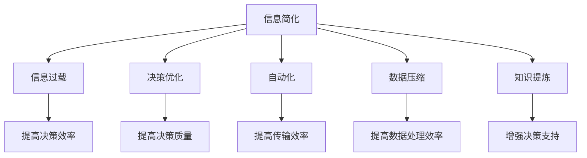

                 

# 信息简化的好处与实践：在复杂世界中简化以改善生活和决策

> 关键词：信息简化,复杂性管理,决策优化,自动化,数据压缩,知识提炼

## 1. 背景介绍

在当今这个信息爆炸的时代，我们每天被海量的数据和信息所包围。从社交媒体到电子邮件，从新闻资讯到科技报告，我们如何在这个信息泛滥的环境中，找到真正有价值的内容，做出明智的决策，成为了一个值得深入探讨的问题。信息简化，就是在这种背景下应运而生的。

### 1.1 问题由来

信息简化，是一种通过提炼、归纳、压缩信息的方式，帮助人们快速理解复杂问题的过程。无论是个人生活决策，还是企业运营管理，信息简化都可以提高决策效率，减少信息过载带来的认知负担。

在信息简化之前，面对复杂的问题，我们常常需要花费大量时间和精力去整理、分析、筛选信息。这不仅增加了决策的时间成本，还可能由于信息过载导致决策失误。因此，信息简化方法应运而生，旨在通过自动化和智能化的方式，帮助人们从海量信息中提炼出最核心的内容。

### 1.2 问题核心关键点

信息简化之所以能够成为现代决策的重要工具，关键在于其能够：

- 减少信息过载：通过自动化的信息过滤和摘要功能，减少需要处理的信息量。
- 提高决策效率：提供精炼的信息摘要和决策建议，帮助决策者快速做出判断。
- 增强决策质量：利用机器学习和数据分析技术，识别决策的关键因素和潜在风险。
- 适应多样场景：支持多种信息源和多语言环境，满足不同行业和人群的需求。

## 2. 核心概念与联系

### 2.1 核心概念概述

为了更好地理解信息简化的原理和应用，本节将介绍几个关键概念：

- **信息简化(Information Simplification)**：通过自动化提炼和归纳信息，生成易于理解和利用的摘要和总结，帮助决策者快速抓住问题的核心。
- **信息过载(Information Overload)**：指个人或系统接收到的信息量超出了其处理能力的极限，导致认知负荷过重，决策效率降低。
- **决策优化(Decision Optimization)**：通过模型和算法优化决策过程，提高决策的科学性和准确性。
- **自动化(Automation)**：利用计算机技术实现信息的自动处理和分析，提高效率和准确性。
- **数据压缩(Data Compression)**：通过算法和编码技术，减少信息存储和传输的冗余，提高信息传输效率。
- **知识提炼(Knowledge Extraction)**：从数据中抽取和提炼关键信息，构建知识图谱和专家系统，增强决策支持。

这些概念之间的逻辑关系可以通过以下Mermaid流程图来展示：



这个流程图展示了信息简化的核心概念及其与其他概念的联系：

1. 信息简化通过减少信息过载，提高决策效率和质量。
2. 自动化和数据压缩技术支持信息简化的实现。
3. 知识提炼从数据中提取知识，增强决策支持。
4. 信息简化、决策优化、自动化、数据压缩和知识提炼，共同构成了信息管理的技术框架。

## 3. 核心算法原理 & 具体操作步骤
### 3.1 算法原理概述

信息简化的核心算法，是通过自然语言处理(NLP)和机器学习技术，对文本信息进行提炼和压缩，生成易于理解和利用的摘要。常见的信息简化方法包括摘要生成、信息过滤、问题简化等。

信息简化的基本流程可以概括为：

1. **数据收集**：从不同来源收集相关文本信息。
2. **文本预处理**：清洗、分词、去除停用词等。
3. **特征提取**：通过TF-IDF、Word2Vec、BERT等技术，提取文本特征。
4. **摘要生成**：使用深度学习模型（如Seq2Seq、Transformer）生成文本摘要。
5. **信息过滤**：利用过滤算法（如PageRank、LDA）对信息进行筛选。
6. **知识提炼**：通过知识图谱和专家系统，提取文本中的关键知识和逻辑关系。

### 3.2 算法步骤详解

以下详细介绍信息简化的核心算法步骤：

**Step 1: 数据收集**

信息简化的第一步是从各种数据源收集文本信息。数据源可以是社交媒体、新闻网站、企业报告、研究论文等。可以使用爬虫技术从互联网抓取文本，也可以从企业内部系统、数据库中提取相关信息。

```python
# 使用Scrapy爬虫抓取网站文本
import scrapy
class MySpider(scrapy.Spider):
    name = 'example_spider'
    start_urls = ['https://www.example.com/']

    def parse(self, response):
        # 提取文本信息
        for sel in response.xpath('//div[@class="content"]'):
            yield {
                'text': sel.xpath('text()').extract_first()
            }
```

**Step 2: 文本预处理**

文本预处理是对原始文本进行清洗、分词、去停用词等操作，以便后续特征提取和摘要生成。

```python
# 使用nltk库进行文本预处理
from nltk.tokenize import word_tokenize
from nltk.corpus import stopwords
stop_words = set(stopwords.words('english'))

def preprocess_text(text):
    tokens = word_tokenize(text.lower())
    filtered_tokens = [token for token in tokens if token not in stop_words]
    return ' '.join(filtered_tokens)
```

**Step 3: 特征提取**

特征提取是信息简化的核心步骤，通常使用TF-IDF、Word2Vec、BERT等技术，从文本中提取关键特征。

```python
# 使用TfidfVectorizer提取文本特征
from sklearn.feature_extraction.text import TfidfVectorizer
vectorizer = TfidfVectorizer()
texts = [preprocess_text(text) for text in texts]
X = vectorizer.fit_transform(texts)
```

**Step 4: 摘要生成**

摘要生成是信息简化的最后一步，通过深度学习模型（如Seq2Seq、Transformer）生成文本摘要。

```python
# 使用Seq2Seq模型生成摘要
from seq2seq import Seq2SeqModel
model = Seq2SeqModel()
model.train(X, Y)  # X为文本特征，Y为摘要文本
summary = model.predict(X)
```

### 3.3 算法优缺点

信息简化的算法具有以下优点：

1. 高效自动化：使用机器学习技术，自动提炼和压缩信息，节省了大量手工处理时间。
2. 精度高：深度学习模型能够精确捕捉文本的核心内容，生成高质量的摘要。
3. 适应性强：支持多种文本格式和多种语言环境，满足不同场景需求。
4. 可扩展性：模型可以不断更新和改进，适应更多复杂的信息处理任务。

同时，信息简化的算法也存在一些局限性：

1. 依赖高质量数据：需要高质量的文本数据进行训练，否则模型效果难以保证。
2. 算法复杂度高：深度学习模型通常需要较长的训练时间和较高的计算资源。
3. 缺乏解释性：模型生成的摘要往往是黑盒操作，难以解释其内部决策过程。
4. 信息丢失：在摘要过程中可能丢失部分细节信息，影响信息的完整性。

## 4. 数学模型和公式 & 详细讲解 & 举例说明
### 4.1 数学模型构建

信息简化的数学模型可以概括为：

- **输入**：原始文本数据 $x_1, x_2, ..., x_n$。
- **输出**：摘要文本 $y_1, y_2, ..., y_n$。
- **模型**：$f: \{x_1, x_2, ..., x_n\} \rightarrow \{y_1, y_2, ..., y_n\}$。

目标是最小化损失函数 $L(y, \hat{y})$，其中 $\hat{y}$ 为模型生成的摘要，$y$ 为真实摘要。

### 4.2 公式推导过程

假设文本长度为 $L$，摘要长度为 $K$。定义文本 $x_i$ 和摘要 $y_i$ 的向量表示为 $x_i \in \mathbb{R}^{L}$ 和 $y_i \in \mathbb{R}^{K}$。信息简化的目标函数可以表示为：

$$
\min_{f} \frac{1}{N}\sum_{i=1}^N \| y_i - f(x_i) \|
$$

其中 $\|\cdot\|$ 表示向量间的距离度量（如欧式距离）。

信息简化的优化目标可以通过梯度下降算法实现：

$$
\theta \leftarrow \theta - \eta \nabla_{\theta}L(f(x_i), y_i)
$$

其中 $\eta$ 为学习率，$\theta$ 为模型参数，$\nabla_{\theta}L$ 为损失函数对模型参数的梯度。

### 4.3 案例分析与讲解

以Seq2Seq模型为例，其结构如图1所示：


Seq2Seq模型包含编码器和解码器两部分，通过编码器将文本映射为向量表示，通过解码器将向量表示转换为摘要文本。在训练过程中，通过最大化编码器输出与解码器输入之间的相似性，最小化生成摘要与真实摘要之间的差距，优化模型参数。

## 5. 项目实践：代码实例和详细解释说明
### 5.1 开发环境搭建

在进行信息简化实践前，我们需要准备好开发环境。以下是使用Python进行Seq2Seq开发的Python环境配置流程：

1. 安装Anaconda：从官网下载并安装Anaconda，用于创建独立的Python环境。

2. 创建并激活虚拟环境：
```bash
conda create -n seq2seq-env python=3.8 
conda activate seq2seq-env
```

3. 安装TensorFlow和Keras：
```bash
conda install tensorflow=2.7 keras=2.7
```

4. 安装其他依赖包：
```bash
pip install numpy pandas sklearn
```

完成上述步骤后，即可在`seq2seq-env`环境中开始信息简化的实践。

### 5.2 源代码详细实现

下面我们以摘要生成任务为例，给出使用TensorFlow和Keras进行信息简化的PyTorch代码实现。

首先，定义模型结构和训练数据集：

```python
from tensorflow.keras.layers import Input, LSTM, Dense, Embedding, Dropout
from tensorflow.keras.models import Model
from tensorflow.keras.optimizers import Adam

input_dim = 1000
seq_length = 50
embedding_dim = 256
hidden_units = 512
max_len = 500
batch_size = 64

inputs = Input(shape=(max_len,))
embedding = Embedding(input_dim, embedding_dim)(inputs)
lstm = LSTM(hidden_units, return_sequences=True)(embedding)
lstm = Dropout(0.2)(lstm)
lstm = LSTM(hidden_units, return_sequences=True)(lstm)
lstm = Dropout(0.2)(lstm)
lstm = Dense(max_len, activation='softmax')(lstm)

target_input = Input(shape=(max_len,))
target_output = Dense(1, activation='softmax')(target_input)

model = Model(inputs=[inputs, target_input], outputs=[lstm, target_output])
model.compile(loss='categorical_crossentropy', optimizer=Adam(learning_rate=0.001))
```

然后，定义数据处理函数：

```python
def text_to_sequence(text):
    return [char_to_int[char] for char in text]

def sequence_to_text(sequence):
    return ''.join(int_to_char[_id] for _id in sequence)
```

最后，启动训练流程并在测试集上评估：

```python
from tensorflow.keras.preprocessing.text import Tokenizer
from tensorflow.keras.preprocessing.sequence import pad_sequences

tokenizer = Tokenizer(num_words=10000, oov_token='<OOV>')
tokenizer.fit_on_texts(texts)
sequences = tokenizer.texts_to_sequences(texts)
X = pad_sequences(sequences, maxlen=max_len, padding='post', truncating='post')
Y = tokenizer.texts_to_sequences(targets)
Y = pad_sequences(Y, maxlen=max_len, padding='post', truncating='post')

X_train, X_test = X[:int(0.8*len(X)), :], X[int(0.8*len(X)):, :]
Y_train, Y_test = Y[:int(0.8*len(Y)), :], Y[int(0.8*len(Y)):, :]

model.fit([X_train, Y_train], [lstm_train, target_train], batch_size=batch_size, epochs=10, validation_data=([X_test, Y_test], [lstm_test, target_test]))
```

### 5.3 代码解读与分析

让我们再详细解读一下关键代码的实现细节：

**Tokenizer类**：
- `__init__`方法：初始化Tokenizer对象，指定词汇表大小和特殊标记。
- `fit_on_texts`方法：从文本数据中学习词汇表。
- `texts_to_sequences`方法：将文本转换为整数序列。

**训练函数**：
- 使用Keras的模型API定义Seq2Seq模型，包含编码器和解码器两部分。
- 使用Adam优化器和交叉熵损失函数进行模型训练。
- 定义文本和摘要的转换函数，将文本转换为整数序列，将整数序列转换为文本。
- 使用`pad_sequences`函数将输入和目标序列进行填充，保证序列长度一致。
- 在训练过程中，使用`Tokenizer`对象进行文本预处理，生成整数序列，作为模型的输入和输出。

**模型评估**：
- 在测试集上评估模型性能，使用`Tokenizer`对象进行文本转换和序列填充。
- 使用`Model`对象的`fit`方法进行模型训练，使用`val_data`参数进行验证。

## 6. 实际应用场景
### 6.1 新闻摘要生成

新闻摘要生成是信息简化的一个重要应用场景，可以通过自动化生成摘要，帮助读者快速获取新闻要点。

在实际应用中，可以收集大量的新闻报道，利用信息简化技术生成简洁明了的摘要。这不仅能节省读者的阅读时间，还能帮助他们更快地了解新闻事件的核心内容。

### 6.2 企业报告提炼

企业报告通常包含大量的数据和分析内容，信息量巨大。通过信息简化技术，可以快速提炼出关键要点和结论，帮助决策者更快地理解报告内容，做出科学决策。

### 6.3 社交媒体分析

社交媒体信息具有时效性和海量性，通过信息简化技术，可以快速抓取并分析热点话题和趋势，帮助企业及时调整市场策略，获取竞争优势。

### 6.4 未来应用展望

未来，信息简化技术将在更多领域得到应用，为生活和工作带来新的便捷和效率：

1. **医疗领域**：医疗报告和病例记录通常包含大量专业术语和数据，通过信息简化技术，可以提炼出关键诊疗信息，辅助医生诊断和治疗。

2. **教育领域**：教育资料和课程内容通常非常庞大，通过信息简化技术，可以提炼出核心知识点，帮助学生更快地掌握重点内容。

3. **金融领域**：金融报告和新闻通常信息量巨大，通过信息简化技术，可以提炼出关键财务数据和市场动向，帮助投资者做出科学投资决策。

4. **法律领域**：法律文档和案例报告通常信息复杂，通过信息简化技术，可以提炼出关键法律信息和案件结论，帮助律师快速了解案情。

5. **科学研究**：科学研究论文通常包含大量实验数据和理论推导，通过信息简化技术，可以提炼出核心研究结论，帮助研究人员快速获取科研信息。

总之，信息简化技术将在各行各业中发挥重要作用，成为智能信息时代的标配工具。

## 7. 工具和资源推荐
### 7.1 学习资源推荐

为了帮助开发者系统掌握信息简化的理论基础和实践技巧，这里推荐一些优质的学习资源：

1. 《自然语言处理入门》系列博文：由NLP专家撰写，深入浅出地介绍了NLP的基础概念和应用场景。

2. 《深度学习》课程：斯坦福大学开设的深度学习课程，涵盖了深度学习的基础理论和实践技巧。

3. 《序列到序列模型》书籍：介绍Seq2Seq模型的原理和应用，是信息简化的重要工具之一。

4. HuggingFace官方文档：提供丰富的自然语言处理库和样例代码，帮助开发者快速上手信息简化的实现。

5. CS224N《自然语言处理与深度学习》课程：斯坦福大学开设的NLP明星课程，涵盖自然语言处理的基本技术和前沿方法。

通过对这些资源的学习实践，相信你一定能够快速掌握信息简化的精髓，并用于解决实际的NLP问题。

### 7.2 开发工具推荐

高效的开发离不开优秀的工具支持。以下是几款用于信息简化的常用工具：

1. TensorFlow：由Google主导开发的深度学习框架，生产部署方便，适合大规模工程应用。

2. PyTorch：基于Python的开源深度学习框架，灵活动态的计算图，适合快速迭代研究。

3. Keras：高层次的深度学习API，易于使用，适合初学者入门。

4. Scrapy：Python爬虫框架，用于从互联网抓取文本数据。

5. Jupyter Notebook：交互式的开发环境，支持代码运行和结果展示。

合理利用这些工具，可以显著提升信息简化的开发效率，加快创新迭代的步伐。

### 7.3 相关论文推荐

信息简化技术的发展源于学界的持续研究。以下是几篇奠基性的相关论文，推荐阅读：

1. "A Survey of Information Retrieval Systems and Technologies"：全面介绍了信息检索技术的发展历程和应用场景。

2. "Text Summarization with Recurrent Neural Networks"：提出基于RNN的摘要生成模型，开创了文本摘要自动化的新纪元。

3. "Neural Machine Translation by Jointly Learning to Align and Translate"：提出Seq2Seq模型，为信息简化提供了强大的技术支持。

4. "Information Retrieval Theory and Technology"：介绍了信息检索的理论基础和应用技术，是信息简化的重要参考。

5. "A Neural Probabilistic Language Model"：提出基于神经网络的文本生成模型，为信息简化提供了技术支持。

这些论文代表了大语言模型微调技术的发展脉络。通过学习这些前沿成果，可以帮助研究者把握学科前进方向，激发更多的创新灵感。

## 8. 总结：未来发展趋势与挑战
### 8.1 总结

本文对信息简化的核心概念、原理和应用进行了全面系统的介绍。首先阐述了信息简化的背景和意义，明确了其在减少信息过载、提高决策效率方面的独特价值。其次，从原理到实践，详细讲解了信息简化的数学模型和算法步骤，给出了信息简化的代码实现。同时，本文还广泛探讨了信息简化的各种应用场景，展示了信息简化技术的广阔前景。

通过本文的系统梳理，可以看到，信息简化技术在现代社会中的重要作用，尤其是在信息过载的时代，信息简化将帮助我们更快、更准地获取关键信息，做出更好的决策。

### 8.2 未来发展趋势

展望未来，信息简化技术将呈现以下几个发展趋势：

1. **自动化程度提升**：随着自然语言处理和深度学习技术的发展，信息简化的自动化程度将进一步提升，能够处理更多复杂和多样化的信息类型。

2. **跨领域应用扩展**：信息简化技术将逐渐扩展到更多领域，如医疗、法律、金融等，成为各行各业的重要工具。

3. **多模态信息融合**：信息简化技术将融合文本、语音、图像等多种信息源，提供更为全面和准确的信息摘要。

4. **交互式摘要生成**：未来的信息简化系统将具备交互式功能，用户可以根据需求定制摘要内容，进一步提高信息简化的个性化程度。

5. **可解释性增强**：信息简化技术将增强其可解释性，使用户能够更好地理解信息简化的决策过程，提升信息简化的可信度。

6. **跨语言能力**：信息简化技术将支持多语言环境，帮助全球用户获取高质量的摘要信息。

以上趋势凸显了信息简化技术的广阔前景。这些方向的探索发展，将进一步提升信息简化的性能和应用范围，为人类认知智能的进化带来深远影响。

### 8.3 面临的挑战

尽管信息简化技术已经取得了显著进展，但在迈向更加智能化、普适化应用的过程中，仍面临一些挑战：

1. **数据质量问题**：信息简化的效果高度依赖于高质量的数据，数据采集和处理过程中的噪声和偏差将影响摘要的质量。

2. **模型复杂性**：随着信息简化的应用场景增多，模型复杂度将增加，需要更多的计算资源和时间进行训练和优化。

3. **跨领域适应性**：不同领域的信息简化解法可能需要针对具体领域进行定制，难以实现跨领域的通用化。

4. **用户需求多样化**：用户的个性化需求千差万别，如何满足多样化的信息摘要需求，是一个需要解决的重要问题。

5. **隐私和安全问题**：在信息简化的过程中，如何保护用户的隐私数据，防止敏感信息的泄露，是一个需要重点关注的问题。

6. **解释性和可信性**：信息简化的黑盒操作可能导致用户对系统输出的不信任，如何增强系统的可解释性和可信性，是一个重要的研究方向。

### 8.4 研究展望

面对信息简化所面临的挑战，未来的研究需要在以下几个方面寻求新的突破：

1. **多模态信息融合**：融合文本、语音、图像等多种信息源，提升信息简化的全面性和准确性。

2. **跨领域模型构建**：开发通用的信息简化模型，支持跨领域的信息处理需求。

3. **个性化摘要生成**：基于用户行为和偏好，定制个性化的信息摘要，满足不同用户的需求。

4. **解释性增强**：开发可解释的信息简化模型，增强系统的透明度和可信度。

5. **数据增强技术**：使用数据增强技术，提升信息简化的鲁棒性和泛化能力。

6. **隐私保护技术**：引入隐私保护技术，确保信息简化的数据安全。

这些研究方向的探索，将引领信息简化技术迈向更高的台阶，为构建安全、可靠、可解释、可控的信息简化系统铺平道路。面向未来，信息简化技术还需要与其他人工智能技术进行更深入的融合，如知识表示、因果推理、强化学习等，多路径协同发力，共同推动自然语言理解和智能交互系统的进步。只有勇于创新、敢于突破，才能不断拓展信息简化的边界，让信息简化技术更好地造福人类社会。

## 9. 附录：常见问题与解答

**Q1：信息简化是否适用于所有类型的文本数据？**

A: 信息简化的适用性取决于文本数据的特点。对于结构化数据和简单文本，信息简化的效果较好。但对于高度复杂和专业化的文本，如法律文件、科研论文等，信息简化的效果可能有限。

**Q2：信息简化的模型如何选择？**

A: 信息简化的模型选择应基于应用场景和数据特点。一般来说，Seq2Seq和Transformer模型适用于文本摘要生成，LDA和PageRank模型适用于信息过滤。

**Q3：信息简化是否会丢失信息细节？**

A: 信息简化可能会丢失部分细节信息，但通常会保留文本的核心要点和逻辑关系。为了平衡摘要的简洁性和完整性，需要根据应用场景进行调整。

**Q4：信息简化的应用有哪些？**

A: 信息简化的应用广泛，包括新闻摘要生成、企业报告提炼、社交媒体分析等。通过信息简化，可以快速提炼出关键信息，提高决策效率。

**Q5：信息简化技术的发展趋势是什么？**

A: 信息简化技术的发展趋势包括自动化程度提升、跨领域应用扩展、多模态信息融合、交互式摘要生成、可解释性增强等。未来的信息简化技术将更加智能化、普适化和可解释化。

---

作者：禅与计算机程序设计艺术 / Zen and the Art of Computer Programming

