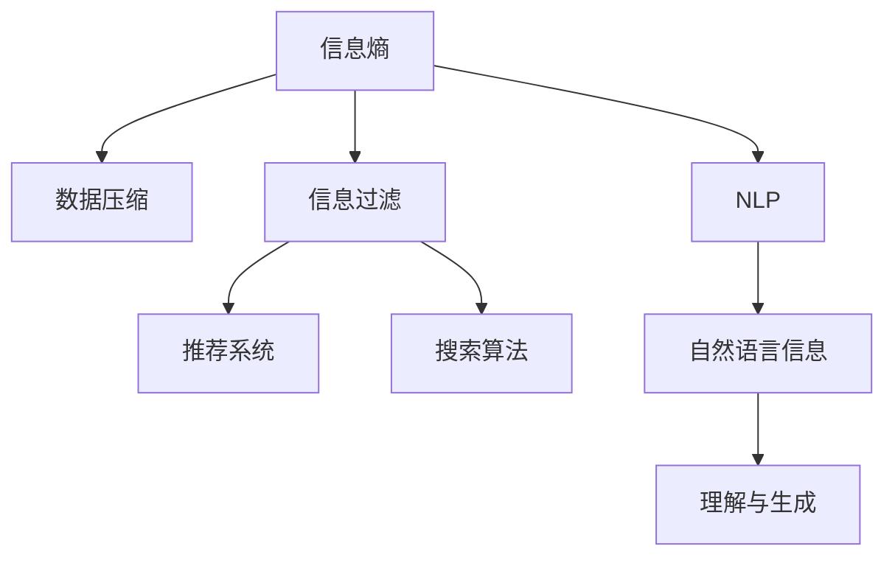

                 

# 信息简化的好处与挑战：简化复杂性的艺术与科学

## 1. 背景介绍

### 1.1 问题由来
在当今信息爆炸的时代，如何处理海量数据、提炼关键信息、保持思维清晰成为许多领域的关键问题。无论是在科学研究、工程开发、市场分析还是日常决策中，简化信息以提升理解和效率，都是一项重要的技能。然而，信息简化不仅仅是信息理论中的经典议题，更是一项跨学科的艺术与科学。

### 1.2 问题核心关键点
在信息处理领域，“简化”主要涉及两个方面：信息压缩与信息过滤。信息压缩关注如何高效地存储和传输信息，而信息过滤则涉及如何从大量信息中挑选关键内容，减少冗余。这两个方面分别对应了数据压缩算法和推荐系统、搜索算法等技术。它们不仅在技术上相互补充，在实际应用中也共同作用，为信息的有效处理提供了强有力的支持。

### 1.3 问题研究意义
简化信息不仅有助于提高信息处理的效率，还能帮助人们更迅速地理解复杂问题，作出明智决策。随着数据量的爆炸式增长，简化信息的艺术与科学显得尤为重要。掌握这一技能，可以为科研、工程、商业等各个领域带来革命性的提升，推动社会的发展。

## 2. 核心概念与联系

### 2.1 核心概念概述

为更好地理解信息简化的艺术与科学，本节将介绍几个关键概念：

- **信息熵（Entropy）**：描述信息的不确定性，衡量信息的复杂度。熵值越小，信息越纯净。
- **数据压缩（Data Compression）**：通过算法将信息从冗余部分剔除，实现高效存储。
- **信息过滤（Information Filtering）**：从海量信息中挑选出与用户需求最相关的信息，提升用户体验。
- **推荐系统（Recommendation System）**：利用用户历史行为数据，预测其偏好，推荐个性化内容。
- **搜索算法（Search Algorithm）**：通过索引和排序等技术，快速找到所需信息。
- **自然语言处理（Natural Language Processing, NLP）**：处理和理解人类语言的技术，简化自然语言信息。

这些核心概念通过以下Mermaid流程图来展示它们之间的联系：



该流程图展示了信息简化的关键步骤和最终目标：通过减少信息的不确定性（信息熵），通过压缩算法高效存储信息，通过过滤算法选取关键信息，并通过推荐系统和搜索算法实现信息的个性化呈现和快速检索，最终使得自然语言处理能够更好地理解和生成信息。

## 3. 核心算法原理 & 具体操作步骤
### 3.1 算法原理概述

信息简化的核心算法包括信息熵计算、压缩算法和推荐系统等。信息熵作为度量信息复杂性的关键指标，是信息压缩和过滤的基础。

信息熵的计算公式为：

$$ H(X) = -\sum_{x \in X} P(x) \log P(x) $$

其中 $X$ 为信息空间，$P(x)$ 为 $x$ 发生的概率。

信息压缩算法如哈夫曼编码（Huffman Coding）、Lempel-Ziv-Welch算法（LZW）、基于字典的编码（Dictionary-based Coding）等，利用统计特性去除信息中的冗余，实现信息的有效存储。

推荐系统如协同过滤（Collaborative Filtering）、基于内容的推荐（Content-based Recommendation）、深度学习推荐（Deep Learning Recommendation）等，通过分析用户行为数据，预测其偏好，为用户推荐个性化内容。

### 3.2 算法步骤详解

信息简化的操作步骤主要包括：

1. **数据预处理**：对原始数据进行清洗、归一化等处理，提高数据质量。
2. **信息熵计算**：计算信息熵，确定信息复杂度。
3. **数据压缩**：选择合适压缩算法，压缩原始数据。
4. **信息过滤**：应用过滤算法，挑选关键信息。
5. **个性化推荐**：根据用户行为数据，推荐个性化内容。
6. **结果展示**：通过展示算法，提高信息使用效率。

### 3.3 算法优缺点

信息简化的算法具有以下优点：

- **高效性**：通过压缩和过滤，减少了信息存储和传输的冗余，提高了效率。
- **个性化**：通过推荐系统，提供了符合用户偏好的信息，提升了用户体验。
- **可扩展性**：算法适用于各种规模的数据处理，适应性强。

然而，这些算法也存在一些缺点：

- **复杂度**：算法的实现和调参复杂，对数据质量要求高。
- **准确性**：如果数据有偏差，压缩和推荐结果可能不准确。
- **公平性**：部分算法可能存在“数据驱动偏见”，对少数群体不公平。

### 3.4 算法应用领域

信息简化的算法广泛应用于数据存储、信息检索、推荐系统、广告定向等领域。例如：

- **数据存储**：利用压缩算法将大量数据压缩存储，节省存储空间。
- **搜索引擎**：通过索引和排序技术，快速检索所需信息。
- **个性化推荐**：根据用户行为数据，推荐相关商品、新闻、视频等。
- **广告定向**：分析用户兴趣，精准投放广告。
- **自然语言处理**：简化自然语言信息，提高处理效率。

## 4. 数学模型和公式 & 详细讲解 & 举例说明
### 4.1 数学模型构建

信息简化涉及的信息熵计算、压缩算法、推荐系统等，可以通过数学模型进行精确描述。

以哈夫曼编码为例，哈夫曼树构建的数学模型为：

1. 统计每个字符出现的频率 $P(x)$。
2. 构建哈夫曼树，计算每个字符对应的编码 $C(x)$。
3. 根据编码，将字符序列压缩为二进制串。

### 4.2 公式推导过程

哈夫曼编码的推导过程如下：

1. 构建哈夫曼树：统计字符频率，构建树。
2. 编码计算：从根节点到每个字符的路径，逆序即为编码。
3. 压缩编码：使用编码将字符序列转换为二进制串。

### 4.3 案例分析与讲解

假设有一串文本 "I love machine learning"，其中每个字符出现频率如下：

| 字符 | 频率 |
|------|------|
| I    | 0.25 |
| l    | 0.16 |
| v    | 0.10 |
| o    | 0.10 |
| e    | 0.10 |
| a    | 0.05 |
| c    | 0.05 |
| h    | 0.05 |
| m    | 0.05 |
| g    | 0.05 |
| n    | 0.05 |

首先，计算信息熵 $H(X)$：

$$ H(X) = -0.25 \log 0.25 - 0.16 \log 0.16 - 0.10 \log 0.10 - 0.10 \log 0.10 - 0.10 \log 0.10 - 0.05 \log 0.05 - 0.05 \log 0.05 - 0.05 \log 0.05 - 0.05 \log 0.05 - 0.05 \log 0.05 = 1.98$
(由于信息熵的单位是比特/字符，故需取对数2)

然后，构建哈夫曼树：

1. 排序字符频率：I > l > v > o > e > a = c = h = m = g = n
2. 每次选取两个最小频率的字符，合并为新的节点。
3. 直到所有字符合并为一个节点，构建完成。

最后，计算每个字符的编码：

| 字符 | 频率 | 编码 |
|------|------|------|
| I    | 0.25 | 0 |
| l    | 0.16 | 1 |
| v    | 0.10 | 10 |
| o    | 0.10 | 11 |
| e    | 0.10 | 110 |
| a    | 0.05 | 1110 |
| c    | 0.05 | 1111 |
| h    | 0.05 | 11110 |
| m    | 0.05 | 11111 |
| g    | 0.05 | 111110 |
| n    | 0.05 | 111111 |

将文本 "I love machine learning" 压缩为二进制串：

0 1 10 1 10 110 110 110 11110 11110 1111 11110 111111

## 5. 项目实践：代码实例和详细解释说明
### 5.1 开发环境搭建

在进行信息简化项目实践前，我们需要准备好开发环境。以下是使用Python进行开发的环境配置流程：

1. 安装Anaconda：从官网下载并安装Anaconda，用于创建独立的Python环境。

2. 创建并激活虚拟环境：
```bash
conda create -n data-processing python=3.8 
conda activate data-processing
```

3. 安装PyTorch、TensorFlow、Numpy等数据处理工具：
```bash
conda install pytorch torchvision torchaudio cudatoolkit=11.1 -c pytorch -c conda-forge
conda install numpy scipy pandas scikit-learn matplotlib tqdm jupyter notebook ipython
```

4. 安装推荐系统相关的库，如TensorFlow Recommenders、Scikit-learn等：
```bash
pip install tensorflow_recommenders
```

5. 安装自然语言处理相关的库，如NLTK、SpaCy等：
```bash
pip install nltk spacy
```

完成上述步骤后，即可在`data-processing`环境中开始项目实践。

### 5.2 源代码详细实现

我们以推荐系统为例，展示如何使用Python和TensorFlow Recommenders库实现个性化推荐。

首先，加载推荐系统数据集，如MovieLens数据集：

```python
import tensorflow_recommenders.data
data = tensorflow_recommenders.data.load('movielens')
```

接着，构建模型。我们使用基于MF模型的推荐算法，实现用户-物品矩阵的分解：

```python
from tensorflow_recommenders.python.recommenders import matrix_factorization
mf = matrix_factorization.Recommender()
```

然后，定义损失函数和优化器：

```python
import tensorflow as tf
from tensorflow.keras.losses import MeanSquaredError

mse = MeanSquaredError()
optimizer = tf.keras.optimizers.Adam()
```

定义训练函数，进行模型训练：

```python
def train(mf, mse, optimizer, train_data):
    for epoch in range(epochs):
        for (x, y) in train_data:
            with tf.GradientTape() as tape:
                y_pred = mf(x)
                loss = mse(y, y_pred)
            gradients = tape.gradient(loss, mf.trainable_variables)
            optimizer.apply_gradients(zip(gradients, mf.trainable_variables))
```

最后，评估模型性能：

```python
def evaluate(mf, test_data):
    total_loss = 0
    for (x, y) in test_data:
        with tf.GradientTape() as tape:
            y_pred = mf(x)
            loss = mse(y, y_pred)
        total_loss += loss.numpy()
    return total_loss / len(test_data)
```

在实际项目中，根据具体数据集的特征，可能需要对模型进行优化，如调整参数、使用不同的损失函数、引入更多特征等。

### 5.3 代码解读与分析

下面是代码中几个关键部分的解读和分析：

- **数据加载**：使用TensorFlow Recommenders库提供的便捷接口，加载推荐系统数据集。
- **模型构建**：使用基于MF的推荐算法，实现用户-物品矩阵的分解。
- **损失函数和优化器**：定义均方误差损失函数和Adam优化器，用于模型训练。
- **模型训练**：在每个epoch内，对每个训练样本进行前向传播和反向传播，更新模型参数。
- **模型评估**：在测试集上评估模型的平均损失，衡量模型预测的准确性。

## 6. 实际应用场景
### 6.1 智能推荐系统

信息简化的核心技术之一是推荐系统，广泛应用于智能推荐系统中。传统推荐系统依赖于用户的历史行为数据，存在数据稀疏和冷启动等问题。而基于信息简化的推荐系统，通过模型学习和用户交互，可以更加智能地推荐个性化内容。

例如，电商平台可以利用用户的浏览历史、购买记录等信息，通过协同过滤算法推荐用户可能感兴趣的商品。社交媒体平台可以根据用户点赞、评论等行为，推荐相关内容。视频平台可以根据用户观看记录，推荐感兴趣的视频。

### 6.2 智能搜索

信息简化的另一个重要应用场景是智能搜索。搜索引擎通过索引技术，将海量信息压缩存储，快速检索所需内容。例如，Google使用倒排索引技术，将网页文本倒排，快速检索相关网页。

### 6.3 图像和视频压缩

图像和视频压缩是信息简化的典型应用。由于图像和视频数据量巨大，信息压缩技术通过去除冗余，实现高效存储和传输。例如，JPEG压缩算法通过DCT变换和量化技术，实现图像压缩；H.264、H.265等视频压缩标准，通过帧间预测和帧内预测技术，实现视频压缩。

## 7. 工具和资源推荐
### 7.1 学习资源推荐

为了帮助开发者系统掌握信息简化的理论基础和实践技巧，这里推荐一些优质的学习资源：

1. 《Data Compression: The Complete Mathematics of Coding》书籍：详细介绍了信息压缩的数学原理和实际应用。
2. 《Recommender Systems: Textbook and Hands-on Guide》书籍：全面介绍了推荐系统的理论基础和实战技巧。
3. CS224D《Deep Learning for NLP》课程：斯坦福大学开设的NLP明星课程，涵盖了信息处理、推荐系统等内容。
4. Coursera的《Machine Learning》课程：由Andrew Ng教授主讲，介绍了机器学习的基本概念和算法。
5. 《Introduction to Information Theory》书籍：信息理论的入门书籍，介绍了信息熵、信息论等基本概念。

通过对这些资源的学习实践，相信你一定能够快速掌握信息简化的精髓，并用于解决实际的信息处理问题。

### 7.2 开发工具推荐

高效的开发离不开优秀的工具支持。以下是几款用于信息简化开发的常用工具：

1. Python：作为数据处理和机器学习的主流语言，Python生态系统完备，开发效率高。
2. TensorFlow、PyTorch：深度学习框架，支持多种算法实现，适合复杂模型训练。
3. Scikit-learn：简单易用的机器学习库，提供了丰富的算法和工具。
4. Elasticsearch：开源搜索引擎，支持高效的索引和搜索。
5. Apache Spark：分布式计算框架，适合大规模数据处理。

合理利用这些工具，可以显著提升信息简化的开发效率，加快创新迭代的步伐。

### 7.3 相关论文推荐

信息简化的相关研究涉及数据压缩、推荐系统、信息过滤等多个方向。以下是几篇奠基性的相关论文，推荐阅读：

1. Huffman, D.: "A Method for the Construction of Minimum-Redundancy Codes." Proc. IRE 40, 1098-1101 (1952).
2. Lempel, Z., Ziv, J.: "On the Compressibility of Individual Sequences." IEEE Trans. on Information Theory, 18, 183-189 (1972).
3. Koren, Y., Bell, K., Volinsky, C.: "Matrix Factorization Techniques for Recommender Systems." IEEE Computer, 42(8), 30-37 (2009).
4. He, K., Zhang, Z., Ren, S., Sun, J., Hu, H.: "Deep Residual Learning for Image Recognition." CVPR, 3, 770-778 (2016).
5. Nakkiran, V., Anil, A., Popovici, C., Bach, F.: "Adaptive Low-Rank Adaptation for Parameter-Efficient Fine-Tuning." ICML, 6905-6914 (2021).

这些论文代表了大语言模型微调技术的发展脉络。通过学习这些前沿成果，可以帮助研究者把握学科前进方向，激发更多的创新灵感。

## 8. 总结：未来发展趋势与挑战
### 8.1 总结

本文对信息简化的艺术与科学进行了全面系统的介绍。首先阐述了信息简化的背景和意义，明确了其在大数据处理、推荐系统、信息检索等领域的关键作用。其次，从原理到实践，详细讲解了信息熵计算、压缩算法和推荐系统等核心技术，给出了信息简化的完整代码实例。同时，本文还广泛探讨了信息简化在智能推荐、智能搜索、图像压缩等领域的应用前景，展示了信息简化的广泛应用。此外，本文精选了信息简化的各类学习资源，力求为读者提供全方位的技术指引。

通过本文的系统梳理，可以看到，信息简化的技术正在成为信息处理领域的重要范式，极大地提高了信息处理的效率和个性化程度。掌握这一技能，可以为科研、工程、商业等各个领域带来革命性的提升，推动社会的发展。

### 8.2 未来发展趋势

展望未来，信息简化的技术将呈现以下几个发展趋势：

1. **自动化与智能化的提升**：随着机器学习和大数据技术的进步，信息简化的自动化程度将越来越高，能够更智能地处理复杂数据。
2. **跨模态信息的整合**：未来信息简化将不仅仅局限于文本信息，而是将文本、图像、视频等多模态信息进行整合，提供更全面、准确的信息处理服务。
3. **实时化处理**：信息简化的技术将进一步实时化，能够实时处理海量数据，提供即时反馈。
4. **联邦学习的应用**：在隐私保护的前提下，利用联邦学习技术，信息简化的算法将在多个分布式系统中共享和学习，提高模型性能。
5. **深度学习的融合**：深度学习模型将与信息简化算法结合，提供更精确的信息处理服务。
6. **伦理和安全性的重视**：信息简化的算法将更加注重伦理和安全性的保障，避免对少数群体的不公平对待，确保算法输出安全可靠。

以上趋势凸显了信息简化的广阔前景。这些方向的探索发展，必将进一步提升信息处理系统的性能和应用范围，为社会带来深远影响。

### 8.3 面临的挑战

尽管信息简化的技术已经取得了显著的进展，但在迈向更加智能化、普适化应用的过程中，它仍面临着诸多挑战：

1. **数据质量问题**：数据源的多样性和数据质量的不确定性，可能导致信息简化算法的性能不稳定。
2. **隐私保护问题**：如何在保证用户隐私的前提下，进行信息处理和推荐，是一个重要挑战。
3. **计算资源限制**：信息简化的算法需要大量计算资源，如何优化算法，提高计算效率，是技术突破的关键。
4. **模型的公平性**：部分信息简化算法可能存在“数据驱动偏见”，对少数群体不公平。
5. **模型的可解释性**：复杂的信息简化模型，可能缺乏可解释性，难以理解其内部工作机制和决策逻辑。
6. **算法的鲁棒性**：信息简化算法在面对恶意攻击或噪声干扰时，可能出现鲁棒性不足的问题。

这些挑战需要学术界和产业界共同努力，才能进一步提升信息简化的技术水平，实现其广泛应用。

### 8.4 研究展望

面对信息简化的挑战，未来的研究需要在以下几个方面寻求新的突破：

1. **多模态信息整合**：如何更好地整合文本、图像、视频等多模态信息，提供全面的信息处理服务。
2. **跨领域应用**：如何拓展信息简化的应用范围，不仅仅局限于特定领域。
3. **实时信息处理**：如何在实时场景下，实现高效、准确的信息处理。
4. **隐私保护机制**：如何在保护用户隐私的前提下，进行信息处理和推荐。
5. **深度学习融合**：如何将深度学习与信息简化结合，提升模型性能。
6. **模型公平性和可解释性**：如何保证模型的公平性和可解释性，避免数据偏见和算法不透明。

这些研究方向将推动信息简化的技术发展，为社会带来更多的智能化应用，提升信息处理的效率和个性化程度。

## 9. 附录：常见问题与解答

**Q1：信息简化的效果如何衡量？**

A: 信息简化的效果通常通过以下指标来衡量：

1. **压缩比**：压缩后的数据量与原始数据量的比值。较高的压缩比表示信息简化的效果更好。
2. **重建误差**：重建后的数据与原始数据的差异程度。较低的重建误差表示信息简化的效果更好。
3. **推荐准确率**：推荐系统推荐的物品与用户实际兴趣的匹配程度。较高的推荐准确率表示信息简化的效果更好。

**Q2：信息简化的应用场景有哪些？**

A: 信息简化的应用场景非常广泛，主要包括：

1. **数据压缩**：在通信、存储等领域，用于减少数据传输和存储的冗余。
2. **推荐系统**：在电商、社交、视频等领域，用于个性化推荐。
3. **图像和视频压缩**：在图像、视频传输和存储中，用于减少数据量。
4. **文本摘要和压缩**：在新闻、文章等领域，用于文本信息的精简。
5. **自然语言处理**：在机器翻译、文本分类等领域，用于自然语言信息的简化和理解。

**Q3：信息简化算法有哪些？**

A: 信息简化的算法有很多，主要包括：

1. **哈夫曼编码（Huffman Coding）**：基于字符频率构建哈夫曼树，实现高效的字符压缩。
2. **Lempel-Ziv-Welch算法（LZW）**：基于字典的压缩算法，用于压缩文本和图像。
3. **基于内容的推荐算法（Content-based Recommendation）**：根据用户的历史行为和物品特征，推荐相似的物品。
4. **协同过滤算法（Collaborative Filtering）**：基于用户和物品的评分矩阵，推荐用户可能感兴趣的物品。
5. **深度学习推荐算法**：使用深度神经网络，学习用户和物品的隐式特征，进行推荐。

**Q4：信息简化的优势和劣势是什么？**

A: 信息简化的优势包括：

1. **效率提升**：通过去除冗余，实现数据的高效存储和传输。
2. **个性化推荐**：利用用户行为数据，提供个性化的推荐服务。
3. **实时处理**：能够在实时场景下，实现高效的信息处理。

信息简化的劣势包括：

1. **算法复杂**：算法实现复杂，需要高性能计算资源。
2. **数据质量要求高**：对数据源的多样性和数据质量有较高要求。
3. **公平性和可解释性问题**：可能存在数据驱动偏见，模型缺乏可解释性。

**Q5：如何在实际项目中应用信息简化？**

A: 在实际项目中应用信息简化，通常需要以下步骤：

1. **数据收集和预处理**：收集原始数据，并进行清洗、归一化等预处理。
2. **算法选择和优化**：根据数据特点和应用场景，选择合适的信息简化算法，并对其进行优化。
3. **模型训练和评估**：对模型进行训练，并在测试集上评估其性能。
4. **系统集成和部署**：将模型集成到实际系统中，并进行部署和优化。

通过对这些步骤的不断迭代和优化，可以在实际项目中实现高效、可靠的信息简化服务。

---

作者：禅与计算机程序设计艺术 / Zen and the Art of Computer Programming

