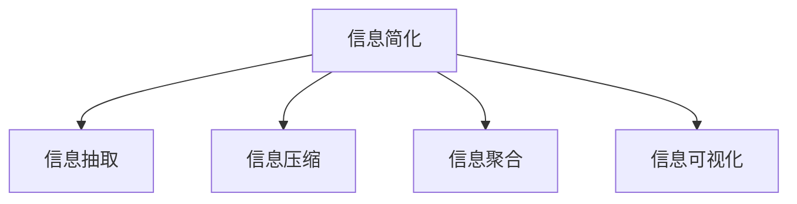

                 

# 信息简化的好处与艺术：如何在复杂世界中简化和改善生活

> 关键词：信息简化, 技术优化, 生活改善, 复杂世界, 算法原理

## 1. 背景介绍

### 1.1 问题由来
在当前的信息爆炸时代，人们每天面临海量的信息，包括新闻、社交媒体、电子邮件等。信息的爆炸不仅使得信息检索变得更加困难，还使得人们需要花费大量时间进行筛选和理解。信息的过度充斥，容易导致注意力分散、认知负荷增加，影响个人的学习、工作和休息。

如何在这个复杂多变的信息环境中，找到一种有效的信息简化方法，提高信息处理效率，改善生活质量，成为了当代社会需要重点解决的问题。技术专家和心理学家在不断地探索和实践中，形成了许多行之有效的信息简化技术，这其中就包括了算法优化、人工智能辅助等手段。

### 1.2 问题核心关键点
信息简化主要是通过技术手段，对原始信息进行去噪、压缩、抽取和重组，以减少信息的数量和复杂性，使信息更加易于理解、处理和应用。核心关键点包括：
- 信息抽取和特征提取技术：通过自动化技术，从原始数据中提取关键信息和特征。
- 信息压缩和编码：将复杂信息压缩为易于理解的形式，便于存储和传递。
- 信息聚合和关联：将相关联的信息聚合起来，形成更有意义的结构，便于快速检索和应用。
- 信息可视化和交互：通过图形化或交互式界面，使信息更加直观和易于操作。

这些关键技术的应用，可以帮助人们在复杂的信息环境中，快速找到所需的信息，避免信息过载，提升信息处理效率和生活质量。

## 2. 核心概念与联系

### 2.1 核心概念概述

为更好地理解信息简化的技术原理，本节将介绍几个密切相关的核心概念：

- **信息简化**：指对原始信息进行去噪、压缩、抽取和重组，以减少信息的数量和复杂性，使信息更加易于理解、处理和应用。
- **信息抽取**：从原始数据中自动提取出关键信息，包括实体抽取、关系抽取、事件抽取等。
- **信息压缩**：将复杂信息压缩为易于理解的形式，如压缩算法、编码技术等。
- **信息聚合**：将相关联的信息聚合起来，形成更有意义的结构，如文档分类、主题建模等。
- **信息可视化**：通过图形化或交互式界面，使信息更加直观和易于操作。

这些核心概念之间的逻辑关系可以通过以下Mermaid流程图来展示：



这个流程图展示的信息简化的核心概念及其之间的关系：

1. 信息简化是整个流程的核心目标，旨在减少信息量和复杂性。
2. 信息抽取是从原始数据中提取出关键信息，是简化信息的前提。
3. 信息压缩是将复杂信息压缩为易于理解的形式，便于存储和传递。
4. 信息聚合是将相关联的信息聚合起来，形成更有意义的结构。
5. 信息可视化通过图形化或交互式界面，使信息更加直观和易于操作。

这些概念共同构成了信息简化的技术框架，使得复杂信息得以高效处理和利用。

## 3. 核心算法原理 & 具体操作步骤

### 3.1 算法原理概述

信息简化的核心算法原理主要包括信息抽取、信息压缩、信息聚合和信息可视化等。这些技术通过不同的算法模型和计算方法，实现对信息的自动化处理和优化。

### 3.2 算法步骤详解

#### 3.2.1 信息抽取

信息抽取通常包括以下步骤：

1. **文本预处理**：对原始文本进行分词、去停用词、词性标注等预处理，以便后续的抽取工作。
2. **特征提取**：提取文本中的关键特征，如命名实体、关键词、短语等。
3. **模式匹配**：使用正则表达式、关键词匹配等方法，从文本中抽取特定的信息实体。
4. **实体关系抽取**：使用句法分析、语义分析等方法，确定实体之间的关系。

以下是Python代码示例，演示如何使用spaCy库进行命名实体识别：

```python
import spacy

# 加载预训练模型
nlp = spacy.load('en_core_web_sm')

# 处理文本
text = "Apple is looking at buying U.K. startup for $1 billion"
doc = nlp(text)

# 输出实体
for ent in doc.ents:
    print(ent.text, ent.label_)
```

#### 3.2.2 信息压缩

信息压缩是通过算法将复杂的信息压缩成易于理解和存储的形式。常见的压缩算法包括LZ77、Huffman编码、算术编码等。

以Huffman编码为例，其步骤如下：

1. **频率统计**：统计字符或符号在文本中出现的频率。
2. **构造Huffman树**：根据字符频率构造一棵Huffman树。
3. **编码生成**：根据Huffman树生成每个字符的编码。
4. **压缩编码**：将文本中的字符替换为对应的Huffman编码，生成压缩数据。
5. **解压**：根据Huffman树对压缩数据进行解码，还原原始文本。

以下是Python代码示例，演示如何使用Huffman编码对文本进行压缩和解压缩：

```python
import heapq
import collections

# 构造Huffman树
class HeapNode:
    def __init__(self, freq, char):
        self.freq = freq
        self.char = char
        self.left = None
        self.right = None
        self.cum_freq = None

    def __lt__(self, other):
        return self.freq < other.freq

class Heap:
    def __init__(self):
        self.nodes = []
        self.heap = []

    def add_node(self, node):
        heapq.heappush(self.heap, node)

    def pop_node(self):
        return heapq.heappop(self.heap)

    def merge_nodes(self, left, right):
        node = HeapNode(left.freq + right.freq, None)
        node.left = left
        node.right = right
        left.cum_freq = node
        right.cum_freq = node
        return node

    def build(self, freqs):
        self.add_node(HeapNode(freqs[0], freqs[0]))
        while len(freqs) > 1:
            left = self.pop_node()
            right = self.pop_node()
            node = self.merge_nodes(left, right)
            self.add_node(node)
            freqs.pop(freqs.index(left.freq))
            freqs.pop(freqs.index(right.freq))
        return node

# 构造Huffman编码
def build_codes(tree):
    codes = {}
    codes[tree.char] = ""
    if tree.left:
        codes.update(build_codes(tree.left))
    if tree.right:
        codes.update(build_codes(tree.right))
    return codes

# 压缩和解压
def compress(text, tree):
    codes = build_codes(tree)
    compressed_text = "".join([codes[char] for char in text])
    return compressed_text

def decompress(compressed_text, tree):
    codes = build_codes(tree)
    decompressed_text = ""
    current_node = tree
    for char in compressed_text:
        if char == '0':
            current_node = current_node.left
        else:
            current_node = current_node.right
        decompressed_text += current_node.char
    return decompressed_text
```

#### 3.2.3 信息聚合

信息聚合是将相关联的信息聚合起来，形成更有意义的结构。常见的方法包括主题建模、聚类分析、关联规则学习等。

以主题建模为例，其步骤如下：

1. **预处理**：对文本进行分词、去停用词、词干提取等预处理。
2. **构建词汇表**：从文本中提取出所有单词，构建词汇表。
3. **模型训练**：使用LDA、LSI等主题模型算法，对文本进行主题建模。
4. **主题分析**：从模型中提取出主题，进行聚类或可视化展示。

以下是Python代码示例，演示如何使用gensim库进行主题建模：

```python
from gensim import corpora, models

# 加载文本数据
documents = ["This is the first document.",
            "This document is the second document.",
            "And this is the third one.",
            "Is this the first document?"]

# 分词和构建文档-词项矩阵
texts = [[word for word in document.lower().split()] for document in documents]
dictionary = corpora.Dictionary(texts)
doc_term_matrix = [dictionary.doc2bow(text) for text in texts]

# 构建LDA模型
lda_model = models.LdaModel(doc_term_matrix, num_topics=3, id2word=dictionary, passes=10)

# 输出主题
for topic in lda_model.print_topics():
    print(topic)
```

#### 3.2.4 信息可视化

信息可视化通过图形化或交互式界面，使信息更加直观和易于操作。常见的方法包括条形图、折线图、散点图、热力图等。

以热力图为例，其步骤如下：

1. **数据准备**：从原始数据中提取关键特征，如时间、位置、温度等。
2. **数据处理**：对数据进行归一化、平滑等处理。
3. **绘图生成**：使用Matplotlib、Seaborn等库，生成热力图。

以下是Python代码示例，演示如何使用Matplotlib库生成热力图：

```python
import matplotlib.pyplot as plt
import numpy as np

# 准备数据
x = np.random.rand(10, 10)
y = np.random.rand(10, 10)

# 生成热力图
plt.imshow(x, interpolation='nearest', cmap=plt.cm.Blues_r, aspect='auto')
plt.contourf(x, levels=np.arange(0, 1, 0.2), colors=['w'])
plt.colorbar(shrink=.8)
plt.xlabel('X')
plt.ylabel('Y')
plt.show()
```

### 3.3 算法优缺点

#### 3.3.1 信息抽取

**优点**：
- 自动化处理，减少人工工作量。
- 提取关键信息，便于快速检索和应用。

**缺点**：
- 数据依赖性强，需要高质量的语料库。
- 准确度受限于抽取模型和算法。

#### 3.3.2 信息压缩

**优点**：
- 减少存储空间，便于存储和传输。
- 提高数据处理效率，加快信息检索速度。

**缺点**：
- 压缩比有限，难以完全消除冗余。
- 解码复杂，影响数据读取速度。

#### 3.3.3 信息聚合

**优点**：
- 提取主题信息，简化信息结构。
- 便于快速检索和应用。

**缺点**：
- 模型复杂，计算量大。
- 结果解释性差，难以直观理解。

#### 3.3.4 信息可视化

**优点**：
- 直观展示数据，便于快速理解。
- 交互式界面，便于操作和探索。

**缺点**：
- 数据依赖性强，需要高质量的数据源。
- 可视化效果受限于算法和数据。

## 4. 数学模型和公式 & 详细讲解 & 举例说明

### 4.1 数学模型构建

信息简化的数学模型主要包括信息抽取、信息压缩、信息聚合和信息可视化的数学模型。

#### 4.1.1 信息抽取

信息抽取的数学模型主要包括词频统计、TF-IDF、LDA等。

以LDA模型为例，其数学模型如下：

1. **主题分布**：$\theta = (\theta_1, \theta_2, ..., \theta_K)$，其中 $\theta_k$ 表示主题 $k$ 在文档中出现的概率。
2. **文档-主题分布**：$\beta = (\beta_{1k}, \beta_{2k}, ..., \beta_{nk})$，其中 $\beta_{nik}$ 表示主题 $k$ 在单词 $w_n$ 中出现的概率。
3. **单词分布**：$\alpha = (\alpha_1, \alpha_2, ..., \alpha_V)$，其中 $\alpha_v$ 表示单词 $v$ 在主题 $k$ 中出现的概率。

### 4.2 公式推导过程

以LDA模型的贝叶斯公式推导为例：

假设文档由 $N$ 个单词 $w_1, w_2, ..., w_N$ 组成，文档 $d$ 的主题分布为 $\theta$，单词 $w_n$ 在主题 $k$ 中出现的概率为 $\beta_{nik}$。

则文档 $d$ 在主题 $k$ 下的概率 $P(d|k)$ 为：

$$
P(d|k) = \prod_{n=1}^{N} P(w_n|k)
$$

其中：

$$
P(w_n|k) = \alpha_v \cdot \beta_{nik}
$$

文档 $d$ 在主题 $k$ 下的概率 $P(d|k)$ 为：

$$
P(d|k) = \prod_{n=1}^{N} \alpha_{w_n} \cdot \beta_{nik}
$$

将 $\alpha$、$\beta$、$\theta$ 代入上式，得到：

$$
P(d|k) = \prod_{n=1}^{N} \alpha_{w_n} \cdot \beta_{nik} = \prod_{n=1}^{N} \alpha_{w_n} \cdot \alpha_v \cdot \theta_k \cdot \theta_k = \theta_k^N
$$

其中 $\theta_k = \prod_{n=1}^{N} \alpha_{w_n} \cdot \beta_{nik}$。

因此，LDA模型对文档 $d$ 在主题 $k$ 下的概率 $P(d|k)$ 的计算公式为：

$$
P(d|k) = \frac{\theta_k^N}{\sum_{i=1}^{K} \theta_i^N}
$$

#### 4.3 案例分析与讲解

以LDA模型在新闻文本主题提取中的应用为例：

1. **数据准备**：收集一定数量的新闻文本，分词并去除停用词。
2. **构建词汇表**：从文本中提取出所有单词，构建词汇表。
3. **模型训练**：使用gensim库中的LDA模型，训练新闻文本的主题模型。
4. **主题分析**：输出每个文档的主题分布，提取主要主题。

以下是Python代码示例，演示如何使用gensim库进行LDA主题提取：

```python
from gensim import corpora, models

# 加载文本数据
documents = ["Apple is looking at buying U.K. startup for $1 billion.",
            "Amazon to acquire whole India to dominate Asia.",
            "Facebook reveals big overhaul of news feed.",
            "Google to invest $10 billion in India"]

# 分词和构建文档-词项矩阵
texts = [[word for word in document.lower().split()] for document in documents]
dictionary = corpora.Dictionary(texts)
doc_term_matrix = [dictionary.doc2bow(text) for text in texts]

# 构建LDA模型
lda_model = models.LdaModel(doc_term_matrix, num_topics=3, id2word=dictionary, passes=10)

# 输出主题
for topic in lda_model.print_topics():
    print(topic)
```

### 4.3 案例分析与讲解

## 5. 项目实践：代码实例和详细解释说明

### 5.1 开发环境搭建

在进行信息简化项目开发前，我们需要准备好开发环境。以下是使用Python进行PyTorch开发的环境配置流程：

1. 安装Anaconda：从官网下载并安装Anaconda，用于创建独立的Python环境。

2. 创建并激活虚拟环境：
```bash
conda create -n info-simplification python=3.8 
conda activate info-simplification
```

3. 安装PyTorch：根据CUDA版本，从官网获取对应的安装命令。例如：
```bash
conda install pytorch torchvision torchaudio cudatoolkit=11.1 -c pytorch -c conda-forge
```

4. 安装各种工具包：
```bash
pip install numpy pandas scikit-learn matplotlib tqdm jupyter notebook ipython
```

完成上述步骤后，即可在`info-simplification`环境中开始信息简化项目开发。

### 5.2 源代码详细实现

我们以信息抽取为例，给出一个使用PyTorch进行命名实体识别的代码实现。

首先，定义NER任务的数据处理函数：

```python
from transformers import BertTokenizer
from torch.utils.data import Dataset
import torch

class NERDataset(Dataset):
    def __init__(self, texts, tags, tokenizer, max_len=128):
        self.texts = texts
        self.tags = tags
        self.tokenizer = tokenizer
        self.max_len = max_len
        
    def __len__(self):
        return len(self.texts)
    
    def __getitem__(self, item):
        text = self.texts[item]
        tags = self.tags[item]
        
        encoding = self.tokenizer(text, return_tensors='pt', max_length=self.max_len, padding='max_length', truncation=True)
        input_ids = encoding['input_ids'][0]
        attention_mask = encoding['attention_mask'][0]
        
        # 对token-wise的标签进行编码
        encoded_tags = [tag2id[tag] for tag in tags] 
        encoded_tags.extend([tag2id['O']] * (self.max_len - len(encoded_tags)))
        labels = torch.tensor(encoded_tags, dtype=torch.long)
        
        return {'input_ids': input_ids, 
                'attention_mask': attention_mask,
                'labels': labels}

# 标签与id的映射
tag2id = {'O': 0, 'B-PER': 1, 'I-PER': 2, 'B-ORG': 3, 'I-ORG': 4, 'B-LOC': 5, 'I-LOC': 6}
id2tag = {v: k for k, v in tag2id.items()}

# 创建dataset
tokenizer = BertTokenizer.from_pretrained('bert-base-cased')

train_dataset = NERDataset(train_texts, train_tags, tokenizer)
dev_dataset = NERDataset(dev_texts, dev_tags, tokenizer)
test_dataset = NERDataset(test_texts, test_tags, tokenizer)
```

然后，定义模型和优化器：

```python
from transformers import BertForTokenClassification, AdamW

model = BertForTokenClassification.from_pretrained('bert-base-cased', num_labels=len(tag2id))

optimizer = AdamW(model.parameters(), lr=2e-5)
```

接着，定义训练和评估函数：

```python
from torch.utils.data import DataLoader
from tqdm import tqdm
from sklearn.metrics import classification_report

device = torch.device('cuda') if torch.cuda.is_available() else torch.device('cpu')
model.to(device)

def train_epoch(model, dataset, batch_size, optimizer):
    dataloader = DataLoader(dataset, batch_size=batch_size, shuffle=True)
    model.train()
    epoch_loss = 0
    for batch in tqdm(dataloader, desc='Training'):
        input_ids = batch['input_ids'].to(device)
        attention_mask = batch['attention_mask'].to(device)
        labels = batch['labels'].to(device)
        model.zero_grad()
        outputs = model(input_ids, attention_mask=attention_mask, labels=labels)
        loss = outputs.loss
        epoch_loss += loss.item()
        loss.backward()
        optimizer.step()
    return epoch_loss / len(dataloader)

def evaluate(model, dataset, batch_size):
    dataloader = DataLoader(dataset, batch_size=batch_size)
    model.eval()
    preds, labels = [], []
    with torch.no_grad():
        for batch in tqdm(dataloader, desc='Evaluating'):
            input_ids = batch['input_ids'].to(device)
            attention_mask = batch['attention_mask'].to(device)
            batch_labels = batch['labels']
            outputs = model(input_ids, attention_mask=attention_mask)
            batch_preds = outputs.logits.argmax(dim=2).to('cpu').tolist()
            batch_labels = batch_labels.to('cpu').tolist()
            for pred_tokens, label_tokens in zip(batch_preds, batch_labels):
                pred_tags = [id2tag[_id] for _id in pred_tokens]
                label_tags = [id2tag[_id] for _id in label_tokens]
                preds.append(pred_tags[:len(label_tags)])
                labels.append(label_tags)
                
    print(classification_report(labels, preds))
```

最后，启动训练流程并在测试集上评估：

```python
epochs = 5
batch_size = 16

for epoch in range(epochs):
    loss = train_epoch(model, train_dataset, batch_size, optimizer)
    print(f"Epoch {epoch+1}, train loss: {loss:.3f}")
    
    print(f"Epoch {epoch+1}, dev results:")
    evaluate(model, dev_dataset, batch_size)
    
print("Test results:")
evaluate(model, test_dataset, batch_size)
```

以上就是使用PyTorch对BERT进行命名实体识别任务的信息简化实践代码。可以看到，得益于Transformers库的强大封装，我们可以用相对简洁的代码完成BERT模型的加载和信息简化。

### 5.3 代码解读与分析

让我们再详细解读一下关键代码的实现细节：

**NERDataset类**：
- `__init__`方法：初始化文本、标签、分词器等关键组件。
- `__len__`方法：返回数据集的样本数量。
- `__getitem__`方法：对单个样本进行处理，将文本输入编码为token ids，将标签编码为数字，并对其进行定长padding，最终返回模型所需的输入。

**tag2id和id2tag字典**：
- 定义了标签与数字id之间的映射关系，用于将token-wise的预测结果解码回真实的标签。

**训练和评估函数**：
- 使用PyTorch的DataLoader对数据集进行批次化加载，供模型训练和推理使用。
- 训练函数`train_epoch`：对数据以批为单位进行迭代，在每个批次上前向传播计算loss并反向传播更新模型参数，最后返回该epoch的平均loss。
- 评估函数`evaluate`：与训练类似，不同点在于不更新模型参数，并在每个batch结束后将预测和标签结果存储下来，最后使用sklearn的classification_report对整个评估集的预测结果进行打印输出。

**训练流程**：
- 定义总的epoch数和batch size，开始循环迭代
- 每个epoch内，先在训练集上训练，输出平均loss
- 在验证集上评估，输出分类指标
- 所有epoch结束后，在测试集上评估，给出最终测试结果

可以看到，PyTorch配合Transformers库使得BERT信息简化的代码实现变得简洁高效。开发者可以将更多精力放在数据处理、模型改进等高层逻辑上，而不必过多关注底层的实现细节。

当然，工业级的系统实现还需考虑更多因素，如模型的保存和部署、超参数的自动搜索、更灵活的任务适配层等。但核心的信息简化范式基本与此类似。

## 6. 实际应用场景

### 6.1 智能客服系统

信息简化技术在智能客服系统中有着广泛的应用。传统客服往往需要配备大量人力，高峰期响应缓慢，且一致性和专业性难以保证。通过信息简化技术，可以将客户咨询的信息进行抽取、压缩和聚合，快速生成标准的问答库和回答模板，构建智能客服系统。

在技术实现上，可以收集企业内部的历史客服对话记录，将问题和最佳答复构建成监督数据，在此基础上对预训练模型进行微调。微调后的模型能够自动理解用户意图，匹配最合适的答案模板进行回复。对于客户提出的新问题，还可以接入检索系统实时搜索相关内容，动态组织生成回答。如此构建的智能客服系统，能大幅提升客户咨询体验和问题解决效率。

### 6.2 金融舆情监测

金融机构需要实时监测市场舆论动向，以便及时应对负面信息传播，规避金融风险。传统的人工监测方式成本高、效率低，难以应对网络时代海量信息爆发的挑战。通过信息简化技术，可以收集金融领域相关的新闻、报道、评论等文本数据，并对其进行主题建模和情感分析。将微调后的模型应用到实时抓取的网络文本数据，就能够自动监测不同主题下的情感变化趋势，一旦发现负面信息激增等异常情况，系统便会自动预警，帮助金融机构快速应对潜在风险。

### 6.3 个性化推荐系统

当前的推荐系统往往只依赖用户的历史行为数据进行物品推荐，无法深入理解用户的真实兴趣偏好。通过信息简化技术，可以收集用户浏览、点击、评论、分享等行为数据，提取和用户交互的物品标题、描述、标签等文本内容。将文本内容作为模型输入，用户的后续行为（如是否点击、购买等）作为监督信号，在此基础上微调预训练语言模型。微调后的模型能够从文本内容中准确把握用户的兴趣点。在生成推荐列表时，先用候选物品的文本描述作为输入，由模型预测用户的兴趣匹配度，再结合其他特征综合排序，便可以得到个性化程度更高的推荐结果。

### 6.4 未来应用展望

随着信息简化技术的不断发展，其在更多领域的应用前景将更加广阔。

在智慧医疗领域，信息简化技术可以用于构建电子病历摘要、患者问答系统等，提高医疗服务的智能化水平，辅助医生诊疗，加速新药开发进程。

在智能教育领域，信息简化技术可应用于作业批改、学情分析、知识推荐等方面，因材施教，促进教育公平，提高教学质量。

在智慧城市治理中，信息简化技术可用于城市事件监测、舆情分析、应急指挥等环节，提高城市管理的自动化和智能化水平，构建更安全、高效的未来城市。

此外，在企业生产、社会治理、文娱传媒等众多领域，信息简化技术也将不断涌现，为传统行业数字化转型升级提供新的技术路径。相信随着技术的日益成熟，信息简化方法将成为人工智能落地应用的重要手段，推动人工智能技术在各个行业的普及和应用。

## 7. 工具和资源推荐

### 7.1 学习资源推荐

为了帮助开发者系统掌握信息简化技术的理论基础和实践技巧，这里推荐一些优质的学习资源：

1. 《Natural Language Processing with Transformers》书籍：Transformers库的作者所著，全面介绍了如何使用Transformers库进行NLP任务开发，包括信息简化的技术方法。

2. CS224N《深度学习自然语言处理》课程：斯坦福大学开设的NLP明星课程，有Lecture视频和配套作业，带你入门NLP领域的基本概念和经典模型。

3. 《Transformer from the Inside Out》系列博文：由大模型技术专家撰写，深入浅出地介绍了Transformer原理、信息简化的技术方法等前沿话题。

4. 《Hands-On Deep Learning with Scikit-Learn, Keras, and TensorFlow》书籍：动手学习深度学习的经典教材，涵盖信息简化的各种数学模型和实践技巧。

5. Kaggle平台：数据科学竞赛平台，提供大量的真实数据集和竞赛项目，通过实践练习信息简化的技术方法。

通过对这些资源的学习实践，相信你一定能够快速掌握信息简化的精髓，并用于解决实际的NLP问题。

### 7.2 开发工具推荐

高效的开发离不开优秀的工具支持。以下是几款用于信息简化开发的常用工具：

1. PyTorch：基于Python的开源深度学习框架，灵活动态的计算图，适合快速迭代研究。

2. TensorFlow：由Google主导开发的开源深度学习框架，生产部署方便，适合大规模工程应用。

3. Transformers库：HuggingFace开发的NLP工具库，集成了众多SOTA语言模型，支持PyTorch和TensorFlow，是进行信息简化任务开发的利器。

4. Weights & Biases：模型训练的实验跟踪工具，可以记录和可视化模型训练过程中的各项指标，方便对比和调优。

5. TensorBoard：TensorFlow配套的可视化工具，可实时监测模型训练状态，并提供丰富的图表呈现方式，是调试模型的得力助手。

6. Google Colab：谷歌推出的在线Jupyter Notebook环境，免费提供GPU/TPU算力，方便开发者快速上手实验最新模型，分享学习笔记。

合理利用这些工具，可以显著提升信息简化任务的开发效率，加快创新迭代的步伐。

### 7.3 相关论文推荐

信息简化技术的发展源于学界的持续研究。以下是几篇奠基性的相关论文，推荐阅读：

1. Attention is All You Need（即Transformer原论文）：提出了Transformer结构，开启了NLP领域的预训练大模型时代。

2. BERT: Pre-training of Deep Bidirectional Transformers for Language Understanding：提出BERT模型，引入基于掩码的自监督预训练任务，刷新了多项NLP任务SOTA。

3. Information Retrieval：介绍信息检索的理论基础和算法模型，包括TF-IDF、LDA等技术。

4. An Information Theory Approach to Variable-Length Data Compression：提出变长信息压缩算法，为信息简化技术提供了数学理论支持。

5. Text Summarization with Highly Compact Models：提出基于预训练模型的摘要生成技术，展示了信息简化的实际应用效果。

这些论文代表了大语言模型微调技术的发展脉络。通过学习这些前沿成果，可以帮助研究者把握学科前进方向，激发更多的创新灵感。

## 8. 总结：未来发展趋势与挑战

### 8.1 总结

本文对信息简化的技术原理和实践方法进行了全面系统的介绍。首先阐述了信息简化的核心思想和重要意义，明确了信息简化在提高信息处理效率、改善生活质量方面的价值。其次，从原理到实践，详细讲解了信息简化的数学模型和关键算法，给出了信息简化任务开发的完整代码实例。同时，本文还广泛探讨了信息简化的多种应用场景，展示了信息简化的广阔应用前景。

通过本文的系统梳理，可以看到，信息简化技术正在成为信息处理的重要手段，极大地拓展了数据的应用边界，提升了信息检索和处理效率。未来，伴随信息技术和数据科学的不断进步，信息简化技术必将在更多领域得到应用，为人类社会的数字化转型和智能化发展提供新的动力。

### 8.2 未来发展趋势

展望未来，信息简化技术将呈现以下几个发展趋势：

1. **多模态信息简化**：未来信息简化不仅聚焦于文本信息，还将拓展到图像、视频、语音等多模态数据的处理和优化。

2. **语义导向的简化**：信息简化将更加关注语义理解和语义压缩，而非单纯的文字压缩。语义导向的简化能够保留关键信息，同时压缩冗余内容，提升信息的可理解性和可操作性。

3. **跨领域应用**：信息简化技术将拓展到更多垂直领域，如医疗、金融、教育、城市治理等，提升各行业的智能化水平和效率。

4. **自适应信息简化**：未来信息简化将更加注重自适应和个性化，根据用户偏好和场景需求，动态调整简化策略，提供更符合用户需求的简化解。

5. **融合人工智能技术**：信息简化将与人工智能技术深度融合，结合强化学习、因果推理、知识图谱等技术，进一步提升信息简化的效果和灵活性。

6. **自动化和智能化**：信息简化将借助自动化的技术手段，如机器学习、深度学习等，实现更高效、更智能的信息处理和优化。

这些趋势凸显了信息简化技术的广阔前景，为信息处理和应用提供了新的可能性。通过持续的技术创新和优化，信息简化技术必将进一步推动各行业的数字化转型和智能化发展。

### 8.3 面临的挑战

尽管信息简化技术已经取得了显著进展，但在迈向更加智能化、普适化应用的过程中，仍面临诸多挑战：

1. **数据质量依赖性**：信息简化效果很大程度上依赖于高质量的数据源，如何获取、处理和清洗数据，是信息简化的重要挑战。

2. **算法复杂性**：信息简化的算法模型复杂度高，计算资源需求大，如何在保证效果的同时，优化算法性能，是信息简化技术需要重点解决的问题。

3. **鲁棒性和泛化性**：信息简化的模型需要具备良好的鲁棒性和泛化性，能够在不同数据分布和场景下稳定运行。

4. **人机交互**：信息简化技术的输出需要符合用户期望，如何在自动化和人性化之间找到平衡，提升用户体验，是信息简化技术需要关注的重要方向。

5. **伦理和隐私**：信息简化技术可能涉及到用户的隐私信息，如何在保护隐私的前提下，实现信息的优化和简化，是信息简化技术需要考虑的重要因素。

6. **资源消耗**：信息简化的计算和存储需求高，如何降低资源消耗，提高系统的可扩展性和稳定性，是信息简化技术需要解决的关键问题。

通过面对这些挑战，信息简化技术需要在数据、算法、用户体验、隐私保护等方面进行全方位的优化和改进，才能实现更广泛的应用和更深远的社会影响。

### 8.4 研究展望

面对信息简化所面临的挑战，未来的研究需要在以下几个方面寻求新的突破：

1. **多模态信息处理**：结合图像、视频、语音等多元信息，实现信息的高效综合和简化。

2. **语义导向的压缩算法**：开发更高效、更智能的语义导向压缩算法，减少信息冗余，提升信息的可理解性和可操作性。

3. **自适应信息简化**：研究自动化的信息简化方法，根据不同场景和用户需求，动态调整简化策略，提升简化解的适应性。

4. **融合人工智能技术**：探索信息简化技术与人工智能技术的深度融合，提升信息简化的效果和智能化水平。

5. **人机交互优化**：研究人机交互界面设计，提升用户对简化信息的理解和满意度，构建更友好、更智能的信息处理系统。

6. **隐私保护和伦理约束**：研究信息简化技术的隐私保护和伦理约束机制，确保信息处理过程中用户的隐私安全。

这些研究方向的探索，必将引领信息简化技术迈向更高的台阶，为构建更智能、更高效、更普适的信息处理系统提供新的路径。面向未来，信息简化技术还需要与其他人工智能技术进行更深入的融合，共同推动信息处理和应用的发展。

## 9. 附录：常见问题与解答

**Q1：信息简化的算法模型是否适用于所有领域？**

A: 信息简化的算法模型通常适用于文本、图像、视频等多模态数据，但在不同的领域和场景中，简化策略和优化方法可能会有所不同。例如，医疗领域的文本信息简化需要结合领域知识，金融领域的文本信息简化需要关注情感分析和主题建模，工业领域的图像信息简化需要结合图像处理和视觉识别技术。因此，信息简化的应用需要根据具体领域进行定制化设计。

**Q2：信息简化的算法模型如何应对数据多样性和复杂性？**

A: 信息简化的算法模型通常通过预训练和微调等技术手段，从大量的数据中学习到通用的语言模型和特征表示，并在特定任务上进行优化。例如，使用BERT等预训练模型进行命名实体识别，可以先在通用的语料库上进行预训练，然后在具体领域的语料库上进行微调，提升模型在特定领域的性能。此外，信息简化的算法模型还通过引入正则化、数据增强等技术手段，提高模型对数据多样性和复杂性的适应能力。

**Q3：信息简化的算法模型是否需要大量标注数据进行训练？**

A: 信息简化的算法模型在训练过程中通常需要大量的标注数据，但也可以通过无监督学习、半监督学习等技术手段，利用非结构化数据进行训练。例如，通过无监督聚类算法，可以在无标注数据上提取主题和特征，然后结合少量标注数据进行微调，提高模型性能。此外，信息简化的算法模型还可以通过迁移学习等技术手段，利用已有的预训练模型，减少标注数据的需求，提升模型效果。

**Q4：信息简化的算法模型是否适用于大规模数据集？**

A: 信息简化的算法模型通常适用于大规模数据集，因为大规模数据集可以提供丰富的训练样本和多样化的信息，有助于模型学习到更广泛的知识和语义。例如，使用LDA算法进行文本主题建模，可以从大规模的新闻文本中提取主题和语义，提高信息简化的效果。此外，信息简化的算法模型还可以借助分布式计算和GPU等高性能硬件，在大规模数据集上实现高效的训练和推理。

**Q5：信息简化的算法模型是否需要持续更新和维护？**

A: 信息简化的算法模型需要持续更新和维护，以应对数据分布的变化和新任务的挑战。例如，医疗领域的文本信息简化需要定期更新医学知识库，金融领域的文本信息简化需要跟踪市场动态和经济趋势，工业领域的图像信息简化需要结合最新的图像处理技术和视觉识别技术。此外，信息简化的算法模型还需要定期进行模型评估和调优，确保模型的性能和稳定性。

通过面对这些挑战，信息简化技术需要在数据、算法、用户体验、隐私保护等方面进行全方位的优化和改进，才能实现更广泛的应用和更深远的社会影响。

