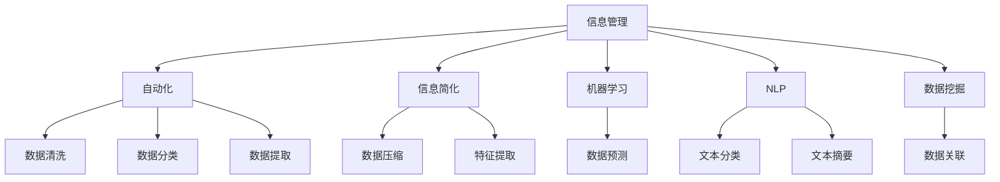

                 

# 信息简化的工具和技术：如何自动化你的信息管理

## 1. 背景介绍

在当今信息爆炸的时代，如何高效地管理、筛选、处理海量信息成为了一个至关重要的问题。信息管理的复杂性和多样性使得传统的模式和工具难以胜任，特别是对于企业和组织，信息管理已经成为了提升工作效率和决策质量的瓶颈。因此，探索新的信息管理工具和技术，自动化信息管理流程，是当前IT领域的研究热点之一。

### 1.1 问题由来
随着互联网和数字化技术的发展，信息生成和传播的速度加快，信息类型和来源也越来越多样化。企业和组织需要处理和分析的数据量呈指数级增长，这不仅带来了存储和处理的挑战，也使得传统的手工信息管理方式显得效率低下、错误率高。因此，自动化的信息管理工具成为了提高信息处理效率和质量的迫切需求。

### 1.2 问题核心关键点
在信息管理领域，自动化和简化信息处理流程是核心关键点。自动化信息管理工具可以减轻人工干预，减少错误，提高信息处理速度。而信息简化技术则专注于通过压缩和转换信息，降低处理的复杂度，提高信息的使用效率。这些工具和技术在企业和组织中的应用，能够显著提升信息管理的质量和效率，帮助决策者更好地理解和使用数据。

## 2. 核心概念与联系

### 2.1 核心概念概述

为了更好地理解自动化信息管理和信息简化技术，本节将介绍几个密切相关的核心概念：

- 信息管理：指对信息收集、存储、检索、分析和应用等全过程的管理，包括数据的采集、清洗、转换、存储和利用等环节。信息管理的目标是提高信息的使用效率和质量，为决策提供支持。

- 自动化：通过软件工具和算法，自动完成某些重复性、标准化的信息管理任务，如数据清洗、提取、分类、分析等。自动化能够提高信息处理的效率和准确性，减少人工干预。

- 信息简化：通过数据压缩、特征提取、信息抽取等技术手段，减少信息的冗余和复杂度，提高信息的可理解性和使用效率。信息简化技术能够帮助决策者快速把握关键信息，做出更有依据的决策。

- 机器学习：利用算法和模型，从大量数据中学习规律和模式，从而实现对信息的自动化处理和分析。机器学习在信息管理中用于数据分类、预测、聚类等任务，提升信息处理的自动化水平。

- 自然语言处理(NLP)：涉及计算机对人类语言的理解、处理和生成。NLP技术在信息管理中用于文本数据的自动抽取、分类、摘要等，提升信息处理的自动化程度。

- 数据挖掘：从大量数据中发现隐藏的知识和规律，用于数据预测、分类、聚类等。数据挖掘技术在信息管理中用于发现信息之间的关联性，提升信息价值的挖掘能力。

这些核心概念之间的逻辑关系可以通过以下Mermaid流程图来展示：



这个流程图展示了一些核心概念及其之间的联系：

1. 信息管理通过自动化、信息简化、机器学习、NLP等技术手段，对信息进行全过程管理。
2. 自动化信息管理主要涉及数据清洗、分类、提取等任务。
3. 信息简化主要通过数据压缩、特征提取等手段，减少信息复杂度。
4. 机器学习和NLP技术用于数据处理和分析，提升自动化水平。
5. 数据挖掘技术用于发现数据关联性，挖掘信息价值。

这些概念共同构成了信息管理的技术框架，使其能够高效、准确地处理和管理海量信息。

## 3. 核心算法原理 & 具体操作步骤
### 3.1 算法原理概述

自动化信息管理和信息简化技术的核心算法原理可以归纳为数据处理和模型优化两个方面。数据处理旨在自动化地从原始数据中提取出有价值的信息，而模型优化则通过算法优化提升信息处理的效率和质量。

### 3.2 算法步骤详解

自动化信息管理的算法步骤通常包括以下几个关键步骤：

**Step 1: 数据预处理**
- 数据采集：通过API接口、爬虫等方式获取所需数据。
- 数据清洗：去除噪声、填补缺失值、处理异常值等。
- 数据转换：将数据格式转换为适合处理的标准形式，如文本、数值等。

**Step 2: 特征提取与选择**
- 特征提取：从原始数据中提取有意义的特征，如文本中的关键词、数值中的趋势等。
- 特征选择：选择对任务有帮助的特征，去除无关的冗余特征。

**Step 3: 数据建模与分析**
- 模型选择：根据任务需求选择合适的模型，如线性回归、决策树、神经网络等。
- 模型训练：使用训练数据对模型进行训练，优化模型参数。
- 模型评估：使用测试数据对模型进行评估，选择性能最优的模型。

**Step 4: 自动化处理**
- 数据自动化分类：根据模型预测结果，将数据自动分类。
- 数据自动化提取：从大量数据中自动抽取关键信息。
- 数据自动化报告：自动生成数据报告，辅助决策。

信息简化的算法步骤通常包括以下几个关键步骤：

**Step 1: 数据压缩**
- 数据压缩：通过压缩算法（如Huffman编码、LZW算法等）对数据进行压缩。

**Step 2: 特征抽取**
- 特征抽取：通过降维算法（如PCA、LDA等）对数据进行特征抽取。

**Step 3: 信息抽取**
- 信息抽取：通过关键词提取、实体识别等技术从文本中抽取关键信息。

**Step 4: 信息摘要**
- 信息摘要：通过文本摘要算法（如TextRank、TF-IDF等）对文本进行自动摘要。

### 3.3 算法优缺点

自动化信息管理和信息简化技术具有以下优点：

1. 提高效率：自动化处理和信息简化能够显著提高信息处理的效率，减少人工干预。
2. 减少错误：自动化和信息简化技术能够减少手工处理中的错误，提高数据质量。
3. 降低成本：自动化处理能够降低人力成本，信息简化技术能够减少数据存储和传输的资源消耗。
4. 提升决策质量：自动化和信息简化技术能够帮助决策者快速获取关键信息，提升决策质量。

同时，这些技术也存在一些局限性：

1. 依赖数据质量：自动化和信息简化的效果很大程度上取决于数据的质量和完整性。
2. 算法复杂度高：某些算法（如机器学习、深度学习）需要大量的计算资源和时间，对于实时处理可能存在瓶颈。
3. 结果解释性不足：自动化和信息简化的结果往往是"黑盒"输出，难以解释其内部工作机制。
4. 技术门槛高：需要具备一定的技术背景和知识，否则难以有效应用这些技术。

尽管存在这些局限性，但这些技术在信息管理的自动化和简化方面具有巨大的潜力，能够显著提升信息管理的效率和质量。

### 3.4 算法应用领域

自动化信息管理和信息简化技术在多个领域都有广泛的应用，例如：

- 金融行业：自动化信息管理用于数据清洗、分类、提取，信息简化用于交易策略优化、风险评估等。
- 医疗行业：自动化信息管理用于病历数据处理、药物信息提取，信息简化用于疾病预测、病人分类等。
- 零售行业：自动化信息管理用于销售数据分析、客户行为预测，信息简化用于产品推荐、库存管理等。
- 政府机构：自动化信息管理用于数据整合、政策分析，信息简化用于公共服务、应急管理等。
- 新闻媒体：自动化信息管理用于文本分类、情感分析，信息简化用于自动摘要、关键词提取等。

这些领域的应用展示了自动化和信息简化技术的广泛价值，为企业和组织带来了显著的信息管理效益。

## 4. 数学模型和公式 & 详细讲解 & 举例说明

### 4.1 数学模型构建

自动化信息管理和信息简化技术的数学模型构建通常基于以下几个基本概念：

- 数据矩阵：将数据表示为行向量组成的矩阵，每行代表一个样本，每列代表一个特征。
- 损失函数：用于衡量模型预测与真实标签之间的差异，常见的损失函数包括均方误差、交叉熵等。
- 优化算法：用于最小化损失函数，优化模型参数，常见的优化算法包括梯度下降、Adam等。
- 特征选择：用于选择对任务有帮助的特征，去除无关的冗余特征。
- 数据压缩：用于减少数据大小，常见的数据压缩算法包括哈夫曼编码、LZW算法等。

### 4.2 公式推导过程

以下以线性回归模型为例，推导自动化信息管理中的数据处理和建模过程。

假设我们有一组数据 $(x_i, y_i)$，其中 $x_i$ 为特征向量，$y_i$ 为标签。线性回归模型的目标是通过拟合线性函数 $y = \theta_0 + \theta_1 x_1 + \theta_2 x_2 + \cdots + \theta_n x_n$，最小化均方误差损失函数：

$$
\mathcal{L}(\theta) = \frac{1}{2N}\sum_{i=1}^N (y_i - \theta_0 - \theta_1 x_{i1} - \theta_2 x_{i2} - \cdots - \theta_n x_{in})^2
$$

其中 $N$ 为样本数，$\theta_j$ 为线性回归模型的参数。

根据梯度下降算法，求解最小化损失函数的参数更新公式为：

$$
\theta_j \leftarrow \theta_j - \eta \frac{\partial \mathcal{L}(\theta)}{\partial \theta_j}
$$

其中 $\eta$ 为学习率。

在特征选择和数据压缩方面，常见的算法包括主成分分析（PCA）和LZW算法。主成分分析将高维数据映射到低维空间，减少特征数量，常见的PCA算法公式为：

$$
X' = W X
$$

其中 $X$ 为原始数据矩阵，$X'$ 为降维后的数据矩阵，$W$ 为权重矩阵。

### 4.3 案例分析与讲解

以一个金融行业的应用案例为例，展示自动化信息管理和信息简化技术的应用。

假设某银行需要处理大量客户的交易数据，以分析客户行为和进行风险评估。首先，使用自动化数据清洗工具去除缺失值和异常值，确保数据完整性和准确性。然后，使用特征提取技术从交易数据中提取出关键特征，如交易金额、交易频率、交易类型等。接着，使用线性回归模型对这些特征进行建模，预测客户未来的交易行为和风险等级。最后，使用信息摘要技术对预测结果进行自动摘要，生成报告，辅助银行进行决策。

## 5. 项目实践：代码实例和详细解释说明

### 5.1 开发环境搭建

在进行信息管理项目实践前，我们需要准备好开发环境。以下是使用Python进行Scikit-learn开发的环境配置流程：

1. 安装Anaconda：从官网下载并安装Anaconda，用于创建独立的Python环境。

2. 创建并激活虚拟环境：
```bash
conda create -n info-management python=3.8 
conda activate info-management
```

3. 安装Scikit-learn：
```bash
conda install scikit-learn
```

4. 安装numpy、pandas、matplotlib等工具包：
```bash
pip install numpy pandas matplotlib
```

5. 安装机器学习模型库：
```bash
pip install sklearn
```

完成上述步骤后，即可在`info-management`环境中开始信息管理实践。

### 5.2 源代码详细实现

这里我们以一个金融行业的客户行为分析项目为例，给出使用Scikit-learn进行数据处理和模型训练的Python代码实现。

首先，定义数据预处理函数：

```python
import pandas as pd
import numpy as np
from sklearn.model_selection import train_test_split
from sklearn.preprocessing import StandardScaler, MinMaxScaler

def preprocess_data(df, target, scaler):
    # 数据清洗
    df.dropna(inplace=True)
    # 数据标准化
    df[target] = scaler.fit_transform(df[[target]].values)
    # 特征选择
    features = df.columns.drop(target)
    X = df[features]
    y = df[target]
    # 数据划分
    X_train, X_test, y_train, y_test = train_test_split(X, y, test_size=0.2, random_state=42)
    return X_train, X_test, y_train, y_test
```

然后，定义特征提取函数：

```python
from sklearn.decomposition import PCA
from sklearn.feature_extraction.text import TfidfVectorizer

def extract_features(df, target):
    # 文本特征提取
    tfidf = TfidfVectorizer(stop_words='english')
    X = df['description'].apply(lambda x: tfidf.fit_transform([x]))
    # 数值特征降维
    X = pd.concat([X, df[['amount', 'frequency', 'type']]], axis=1)
    X = X.drop(target, axis=1)
    # 数值特征标准化
    scaler = MinMaxScaler()
    X = scaler.fit_transform(X)
    return X, tfidf
```

接着，定义模型训练函数：

```python
from sklearn.linear_model import LinearRegression

def train_model(X_train, X_test, y_train, y_test, tfidf):
    # 特征组合
    X = pd.concat([X_train, X_test], axis=0)
    X_train, X_test, y_train, y_test = train_test_split(X, y, test_size=0.2, random_state=42)
    # 模型训练
    model = LinearRegression()
    model.fit(X_train, y_train)
    # 模型评估
    y_pred = model.predict(X_test)
    mse = np.mean((y_pred - y_test)**2)
    print(f"Mean Squared Error: {mse:.2f}")
    # 特征重要性
    importance = model.coef_
    print("Feature Importance:")
    for i in range(X.shape[1]):
        print(f"{tfidf.get_feature_names()[i]}: {importance[i]:.2f}")
```

最后，启动训练流程：

```python
# 加载数据
df = pd.read_csv('transaction_data.csv')
# 数据预处理
X_train, X_test, y_train, y_test = preprocess_data(df, 'risk_level', StandardScaler())
# 特征提取
X, tfidf = extract_features(df, 'risk_level')
# 模型训练
train_model(X_train, X_test, y_train, y_test, tfidf)
```

以上就是使用Scikit-learn对金融行业客户行为分析项目进行数据处理和模型训练的完整代码实现。可以看到，利用Scikit-learn等Python库，可以快速构建信息管理的自动化流程。

### 5.3 代码解读与分析

让我们再详细解读一下关键代码的实现细节：

**preprocess_data函数**：
- 数据清洗：使用Pandas的dropna方法去除缺失值。
- 数据标准化：使用MinMaxScaler对数值特征进行标准化，使其在0到1之间。
- 特征选择：将目标特征排除在X之外，确保模型仅依赖特征进行预测。
- 数据划分：使用train_test_split方法将数据集划分为训练集和测试集。

**extract_features函数**：
- 文本特征提取：使用TfidfVectorizer对文本特征进行转换，生成TF-IDF矩阵。
- 数值特征降维：使用PCA对数值特征进行降维，减少特征数量。
- 数值特征标准化：使用MinMaxScaler对数值特征进行标准化。

**train_model函数**：
- 特征组合：将训练集和测试集合并，确保模型在相同特征空间上进行评估。
- 模型训练：使用LinearRegression模型进行训练。
- 模型评估：计算均方误差（MSE），并输出特征重要性。

**训练流程**：
- 加载数据：从CSV文件中加载数据。
- 数据预处理：调用preprocess_data函数进行数据清洗和标准化。
- 特征提取：调用extract_features函数提取文本和数值特征。
- 模型训练：调用train_model函数训练模型，并输出评估结果。

这些代码展示了如何使用Scikit-learn等工具进行数据处理和模型训练，构建自动化信息管理的流程。在实际应用中，开发者可以根据具体任务和数据特点，进一步优化数据预处理、特征选择和模型训练等环节。

## 6. 实际应用场景

### 6.1 金融行业

自动化信息管理和信息简化技术在金融行业有着广泛的应用，例如：

- 交易数据分析：使用自动化数据清洗工具处理交易数据，使用特征提取技术从交易数据中提取出关键特征，如交易金额、交易频率、交易类型等。接着使用线性回归模型对这些特征进行建模，预测客户未来的交易行为和风险等级。最后，使用信息摘要技术对预测结果进行自动摘要，生成报告，辅助银行进行决策。

- 风险评估：自动化信息管理技术用于处理和分析客户的信用记录、交易记录等数据，使用机器学习模型预测客户的违约概率。同时，使用信息简化技术对预测结果进行摘要，帮助银行做出风险决策。

- 市场分析：自动化信息管理技术用于处理和分析市场数据，如股票价格、交易量等。使用特征提取技术从数据中提取出关键特征，使用机器学习模型进行市场趋势预测和风险评估。同时，使用信息摘要技术对预测结果进行自动摘要，生成报告，辅助投资决策。

### 6.2 医疗行业

自动化信息管理和信息简化技术在医疗行业也有着广泛的应用，例如：

- 病历数据分析：自动化信息管理技术用于处理和分析病人的病历数据，如检查结果、治疗记录等。使用特征提取技术从数据中提取出关键特征，如病情、治疗效果等。接着使用机器学习模型对病人的治疗效果进行预测和分类。最后，使用信息摘要技术对预测结果进行自动摘要，生成报告，辅助医生进行诊断和治疗决策。

- 疾病预测：自动化信息管理技术用于处理和分析病人的病历数据，如检查结果、治疗记录等。使用特征提取技术从数据中提取出关键特征，使用机器学习模型对病人的病情进行预测和分类。同时，使用信息摘要技术对预测结果进行摘要，帮助医生做出诊断和治疗决策。

- 医疗资源管理：自动化信息管理技术用于处理和分析医院的资源数据，如病床占用率、医生出诊时间等。使用特征提取技术从数据中提取出关键特征，使用机器学习模型进行资源预测和优化。同时，使用信息摘要技术对预测结果进行自动摘要，生成报告，辅助医院进行资源管理和优化。

### 6.3 零售行业

自动化信息管理和信息简化技术在零售行业也有着广泛的应用，例如：

- 客户行为分析：自动化信息管理技术用于处理和分析客户的购买记录、浏览历史等数据。使用特征提取技术从数据中提取出关键特征，如购买金额、购买频率、购买类型等。接着使用机器学习模型对这些特征进行建模，预测客户的购买行为和消费趋势。最后，使用信息摘要技术对预测结果进行自动摘要，生成报告，辅助零售商进行销售策略优化和库存管理。

- 商品推荐：自动化信息管理技术用于处理和分析客户和商品的数据，如购买记录、浏览历史、商品属性等。使用特征提取技术从数据中提取出关键特征，使用机器学习模型进行商品推荐。同时，使用信息摘要技术对推荐结果进行自动摘要，生成报告，辅助零售商进行商品推荐和销售策略优化。

- 库存管理：自动化信息管理技术用于处理和分析库存数据，如商品数量、销售记录等。使用特征提取技术从数据中提取出关键特征，使用机器学习模型进行库存预测和优化。同时，使用信息摘要技术对预测结果进行自动摘要，生成报告，辅助零售商进行库存管理和优化。

### 6.4 未来应用展望

随着自动化信息管理和信息简化技术的不断发展，未来在更多领域的应用前景将更加广阔。

- 智能制造：在制造业中，自动化信息管理技术用于处理和分析生产数据，如设备运行状态、生产效率等。使用特征提取技术从数据中提取出关键特征，使用机器学习模型进行生产优化和预测。同时，使用信息摘要技术对预测结果进行自动摘要，生成报告，辅助制造企业进行生产优化和管理。

- 智能交通：在交通领域，自动化信息管理技术用于处理和分析交通数据，如车辆运行状态、道路状况等。使用特征提取技术从数据中提取出关键特征，使用机器学习模型进行交通流量预测和优化。同时，使用信息摘要技术对预测结果进行自动摘要，生成报告，辅助交通管理部门进行交通优化和管理。

- 智能家居：在智能家居领域，自动化信息管理技术用于处理和分析家庭数据，如智能设备运行状态、用户行为等。使用特征提取技术从数据中提取出关键特征，使用机器学习模型进行家居设备优化和预测。同时，使用信息摘要技术对预测结果进行自动摘要，生成报告，辅助智能家居系统进行优化和管理。

## 7. 工具和资源推荐
### 7.1 学习资源推荐

为了帮助开发者系统掌握自动化信息管理和信息简化技术的理论基础和实践技巧，这里推荐一些优质的学习资源：

1. 《Python数据科学手册》：这本书详细介绍了Python在数据处理、分析和可视化中的应用，包括Scikit-learn等库的使用。

2. 《机器学习实战》：这本书介绍了机器学习的基本原理和常用算法，并通过实际案例展示了机器学习在信息管理中的应用。

3. 《信息抽取与内容理解》：这本书介绍了信息抽取和内容理解的基本技术，包括文本分类、实体识别、情感分析等。

4. 《自然语言处理综论》：这本书全面介绍了自然语言处理的基本概念和常用技术，包括文本处理、语音识别、机器翻译等。

5. 《深度学习》：这本书介绍了深度学习的基本原理和常用模型，包括卷积神经网络、循环神经网络、生成对抗网络等。

通过学习这些资源，相信你一定能够系统掌握自动化信息管理和信息简化技术的理论基础和实践技巧。

### 7.2 开发工具推荐

高效的开发离不开优秀的工具支持。以下是几款用于自动化信息管理和信息简化开发的常用工具：

1. Scikit-learn：Python的数据挖掘和机器学习库，提供了丰富的模型和算法，包括线性回归、决策树、随机森林等。

2. Pandas：Python的数据处理和分析库，提供了高效的数据操作和分析功能，适用于大规模数据处理。

3. TensorFlow：由Google开发的深度学习框架，支持分布式计算和模型优化，适用于大规模模型训练。

4. PyTorch：由Facebook开发的深度学习框架，灵活易用，支持动态图计算，适用于快速原型开发和研究。

5. Weights & Biases：模型训练的实验跟踪工具，可以记录和可视化模型训练过程中的各项指标，方便对比和调优。

6. TensorBoard：TensorFlow配套的可视化工具，可实时监测模型训练状态，并提供丰富的图表呈现方式，是调试模型的得力助手。

合理利用这些工具，可以显著提升自动化信息管理和信息简化任务的开发效率，加快创新迭代的步伐。

### 7.3 相关论文推荐

自动化信息管理和信息简化技术的发展源于学界的持续研究。以下是几篇奠基性的相关论文，推荐阅读：

1. "A Survey on Information Extraction Techniques" by Anirban Dasgupta and Anirudha Majumder。这篇综述文章详细介绍了信息抽取技术的发展历程和常用算法。

2. "Principal Component Analysis" by Pearson。这篇论文介绍了主成分分析的基本原理和应用，是数据降维的经典方法。

3. "Natural Language Processing with Python" by Steven Bird, Ewan Klein, and Edward Loper。这本书全面介绍了自然语言处理的基本概念和常用技术，包括文本处理、语音识别、机器翻译等。

4. "Machine Learning: A Probabilistic Perspective" by Kevin P. Murphy。这本书详细介绍了机器学习的基本原理和常用算法，包括回归分析、分类、聚类等。

5. "Deep Learning" by Ian Goodfellow, Yoshua Bengio, and Aaron Courville。这本书全面介绍了深度学习的基本原理和常用模型，包括卷积神经网络、循环神经网络、生成对抗网络等。

这些论文代表了大语言模型微调技术的发展脉络。通过学习这些前沿成果，可以帮助研究者把握学科前进方向，激发更多的创新灵感。

## 8. 总结：未来发展趋势与挑战

### 8.1 研究成果总结

本文对自动化信息管理和信息简化技术进行了全面系统的介绍。首先阐述了信息管理的复杂性和必要性，明确了自动化和信息简化技术的重要作用。其次，从原理到实践，详细讲解了自动化信息管理和信息简化技术的数学模型和算法步骤，给出了信息管理的自动化流程。最后，展示了这些技术在金融、医疗、零售等多个领域的应用案例，展示了其广阔的行业价值。

### 8.2 未来发展趋势

展望未来，自动化信息管理和信息简化技术将呈现以下几个发展趋势：

1. 更加自动化：随着自动化技术的不断发展，自动化信息管理将更加智能化、高效化。机器学习和人工智能技术将进一步应用于数据处理和分析中，提升自动化水平。

2. 更加数据驱动：未来的自动化信息管理将更加依赖于大数据和数据驱动的决策。数据处理和分析的算法将不断优化，提高数据处理效率和准确性。

3. 更加智能化：未来的信息管理将更加智能化，利用人工智能技术进行自动化决策和智能推荐。这将进一步提升信息管理的效率和质量，为企业和组织带来更大的价值。

4. 更加个性化：未来的信息管理将更加个性化，根据用户的行为和偏好进行定制化推荐和服务。这将进一步提升用户满意度和体验。

5. 更加安全可靠：未来的信息管理将更加注重数据安全和隐私保护。自动化信息管理技术将采用更先进的安全措施，保护用户数据的安全和隐私。

### 8.3 面临的挑战

尽管自动化信息管理和信息简化技术已经取得了显著进展，但在迈向更加智能化、普适化应用的过程中，仍然面临诸多挑战：

1. 数据质量问题：自动化信息管理依赖于高质量的数据，但数据获取和处理的复杂性使得数据质量难以保证。数据不完整、不准确、不一致等问题仍然存在。

2. 算法复杂性问题：自动化信息管理涉及复杂的算法和模型，算法选择和调参的复杂性使得技术实现和应用难度较大。

3. 技术普及问题：自动化信息管理和信息简化技术需要具备一定的技术背景和知识，技术普及度和应用门槛较高，难以广泛应用。

4. 数据安全和隐私问题：自动化信息管理涉及大量敏感数据，数据安全和隐私保护是关键问题。数据泄露、隐私侵犯等问题将带来严重的法律和伦理风险。

5. 跨领域应用问题：自动化信息管理技术在不同领域的应用场景和数据类型差异较大，难以实现跨领域的通用化应用。

尽管存在这些挑战，但这些技术在信息管理的自动化和简化方面具有巨大的潜力，能够显著提升信息管理的效率和质量。相信随着学界和产业界的共同努力，这些挑战终将一一被克服，自动化信息管理和信息简化技术必将迎来更加广阔的应用前景。

### 8.4 研究展望

未来的研究应在以下几个方面寻求新的突破：

1. 数据质量提升：开发更加高效的数据清洗和预处理技术，提升数据质量和一致性，降低数据处理难度。

2. 算法优化：优化自动化信息管理的算法和模型，降低算法复杂性，提高数据处理效率和准确性。

3. 技术普及：开发易于使用和普及的技术工具，降低技术门槛，提升技术应用普及度。

4. 数据安全保护：研究数据安全和隐私保护的新技术和新方法，保障数据安全。

5. 跨领域应用：研究跨领域的自动化信息管理技术，实现通用化应用。

这些研究方向的探索，将引领自动化信息管理和信息简化技术迈向更高的台阶，为构建智能化、高效化的信息管理平台铺平道路。面向未来，自动化信息管理和信息简化技术需要与其他人工智能技术进行更深入的融合，如知识表示、因果推理、强化学习等，多路径协同发力，共同推动信息管理技术的进步。只有勇于创新、敢于突破，才能不断拓展信息管理的边界，让信息管理技术更好地服务企业和组织。

## 9. 附录：常见问题与解答

**Q1：自动化信息管理是否适用于所有信息场景？**

A: 自动化信息管理技术可以适用于多种信息场景，但需要根据具体场景进行适应性调整。对于需要深度分析和理解的信息场景，如医疗、法律等，可能需要结合人工干预和领域知识进行优化。而对于数据量庞大、处理速度要求高的场景，如金融交易、网络日志等，自动化信息管理技术可以显著提高处理效率和质量。

**Q2：自动化信息管理中数据清洗的步骤有哪些？**

A: 自动化信息管理中数据清洗的步骤通常包括以下几个关键步骤：
1. 去除噪声：使用异常值检测和处理技术，去除数据中的噪声和异常值。
2. 填补缺失值：使用插值和填充技术，填补数据中的缺失值。
3. 处理异常值：使用截断和替换技术，处理数据中的异常值。
4. 数据标准化：使用标准化和归一化技术，将数据转换为标准形式，便于处理和分析。

这些步骤需要根据具体数据的特点和处理目标进行灵活选择和调整。

**Q3：信息简化技术有哪些常用方法？**

A: 信息简化技术包括数据压缩和特征提取两种常用方法。数据压缩技术通过压缩算法（如Huffman编码、LZW算法等）对数据进行压缩，减少数据大小。特征提取技术通过降维算法（如PCA、LDA等）对数据进行特征抽取，减少特征数量，提高数据处理效率和质量。

**Q4：自动化信息管理中如何提高模型精度？**

A: 提高自动化信息管理中模型精度的关键在于数据处理和特征选择。数据清洗和特征提取是保证模型精度的基础，通过去除噪声、填补缺失值、选择关键特征等手段，可以提高数据质量和模型性能。同时，选择合适的模型和优化算法也是提高模型精度的关键，需要根据具体任务和数据特点进行优化。

**Q5：自动化信息管理中如何保障数据安全？**

A: 自动化信息管理中保障数据安全的关键在于数据加密、访问控制和审计追踪。数据加密技术可以将数据进行加密存储和传输，防止数据泄露。访问控制技术可以限制数据访问权限，确保数据安全。审计追踪技术可以记录数据访问和操作日志，追踪数据流动，防止数据滥用。

**Q6：信息管理自动化和信息简化技术在哪些行业有广泛应用？**

A: 自动化信息管理和信息简化技术在多个行业都有广泛应用，包括：
1. 金融行业：用于交易数据分析、风险评估、市场分析等。
2. 医疗行业：用于病历数据分析、疾病预测、医疗资源管理等。
3. 零售行业：用于客户行为分析、商品推荐、库存管理等。
4. 制造业：用于生产数据分析、设备运行优化、生产预测等。
5. 交通领域：用于交通流量预测、优化和管理。

这些行业的应用展示了自动化信息管理和信息简化技术的广泛价值，为企业和组织带来了显著的信息管理效益。

---

作者：禅与计算机程序设计艺术 / Zen and the Art of Computer Programming

