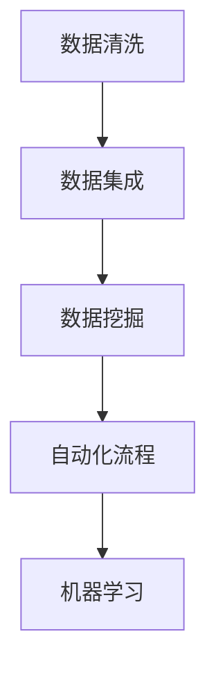

                 

# 信息简化的工具和自动化实践：利用技术简化你的生活和工作

## 1. 背景介绍

在信息爆炸的时代，我们的生活和工作被海量数据和复杂流程所包围，处理和分析信息成为了一项日益繁琐且易出错的任务。特别是在企业级环境中，信息的收集、存储、处理、分析与分发，不仅耗费了大量的人力和时间，还存在诸多不必要的重复劳动。如何通过技术手段简化信息处理流程，提升工作效率，成为了当今企业和个人共同关注的问题。

在信息技术高速发展的背景下，信息简化的工具和自动化实践应运而生。这些工具不仅能够大幅度提升信息处理效率，还能在复杂的业务流程中自动完成数据收集、清洗、分析、报告生成等任务，极大地节省了时间和精力。本文将详细介绍信息简化的核心概念、工具和技术，以及其在实际应用中的优势和挑战。

## 2. 核心概念与联系

### 2.1 核心概念概述

本节将详细介绍信息简化领域的一些关键概念和它们的相互关系：

- **数据清洗(Data Cleaning)**：从原始数据中去除噪声和错误，保证数据的准确性和完整性。
- **数据集成(Data Integration)**：将不同来源的数据整合在一起，形成一个统一的视图。
- **数据挖掘(Data Mining)**：通过算法和统计学方法从大量数据中提取有价值的模式和知识。
- **自动化流程(Automation Process)**：利用软件和工具自动执行一系列复杂的流程和任务。
- **机器学习(Machine Learning)**：通过数据驱动的算法，让机器自主学习和优化，提升决策能力。

这些概念构成了信息简化的技术基础，通过它们可以有效地简化信息处理流程，提升工作质量。

### 2.2 核心概念原理和架构的 Mermaid 流程图



## 3. 核心算法原理 & 具体操作步骤

### 3.1 算法原理概述

信息简化和自动化实践的核心在于数据处理和流程优化。它们通常使用以下算法和技术：

- **数据清洗算法**：包括去重、去噪、异常值检测、数据格式转换等。
- **数据集成算法**：如数据匹配、冲突解决、数据同步等。
- **数据挖掘算法**：如分类、聚类、关联规则分析等。
- **自动化流程技术**：如工作流引擎、任务调度、事件驱动架构等。
- **机器学习技术**：如回归分析、分类器、聚类器、异常检测器等。

### 3.2 算法步骤详解

以数据清洗为例，通常包含以下步骤：

1. **数据获取**：从不同来源获取原始数据。
2. **数据检查**：识别和记录数据中的问题，如缺失值、重复数据、异常值等。
3. **数据清洗**：根据问题采取相应的处理策略，如删除、填补、转换等。
4. **数据验证**：对清洗后的数据进行验证，确保数据质量和一致性。

具体算法和流程如下：

1. **数据获取**：使用API或文件导入的方式，从多个数据源获取数据。

2. **数据检查**：
    - 使用Python的pandas库，导入数据并进行初步检查。
    ```python
    import pandas as pd
    data = pd.read_csv('data.csv')
    data.info()
    data.describe()
    ```
    - 检查数据缺失情况。
    ```python
    data.isnull().sum()
    ```
    - 检查数据重复情况。
    ```python
    data.duplicated().sum()
    ```
    - 检查数据格式是否一致。
    ```python
    data.dtypes
    ```

3. **数据清洗**：
    - 处理缺失值。
    ```python
    data.fillna(value, inplace=True)
    ```
    - 处理重复数据。
    ```python
    data.drop_duplicates(inplace=True)
    ```
    - 处理格式不一致的数据。
    ```python
    data = data.astype({'column_name': 'type'})
    ```

4. **数据验证**：
    - 使用Python的pandas库进行验证。
    ```python
    data.isnull().sum()
    data.duplicated().sum()
    ```

### 3.3 算法优缺点

**数据清洗的优点**：
- 确保数据的准确性和一致性。
- 提高后续分析和处理的效率。

**数据清洗的缺点**：
- 清洗过程可能需要大量的时间和资源。
- 处理复杂问题时，可能仍无法完全解决数据质量问题。

**数据挖掘的优点**：
- 从大量数据中提取有价值的模式和知识。
- 支持决策和预测。

**数据挖掘的缺点**：
- 对数据的量和质量要求高。
- 算法复杂，需要专业知识。

**自动化流程的优点**：
- 节省时间和人力成本。
- 提高流程的可靠性和一致性。

**自动化流程的缺点**：
- 依赖于软件的稳定性和正确性。
- 复杂流程的自动化可能需要高度定制。

**机器学习的优点**：
- 提升决策的准确性和效率。
- 支持复杂问题的自动处理。

**机器学习的缺点**：
- 需要大量标注数据。
- 算法模型可能存在偏见和误差。

### 3.4 算法应用领域

信息简化的算法和技术在多个领域中都有广泛应用：

- **金融领域**：数据清洗、自动化交易、风险预测。
- **零售行业**：客户数据分析、库存管理、个性化推荐。
- **医疗行业**：患者数据整合、诊断分析、治疗方案推荐。
- **制造业**：质量控制、供应链管理、设备维护。
- **物流行业**：订单处理、路径规划、货物追踪。

## 4. 数学模型和公式 & 详细讲解 & 举例说明

### 4.1 数学模型构建

本节将详细介绍信息简化和自动化实践中的数学模型构建方法。

#### 数据清洗模型

数据清洗的数学模型通常包含缺失值处理、异常值检测等。

1. **缺失值处理**：
    - 均值填补。
    $$
    \hat{x} = \frac{1}{n} \sum_{i=1}^{n} x_i
    $$
    - 中位数填补。
    $$
    \hat{x} = \frac{1}{2}(x_{(i)} + x_{(i+1)})
    $$
    - 插值法填补。
    $$
    \hat{x_i} = \frac{x_{i-1} + 2x_i + x_{i+1}}{4}
    $$

2. **异常值检测**：
    - Z-score检测。
    $$
    z_i = \frac{x_i - \mu}{\sigma}
    $$
    - IQR检测。
    $$
    Q1, Q3 = \text{quantile}(data, [0.25, 0.75])
    IQR = Q3 - Q1
    \text{if } x_i < (Q1 - 1.5IQR) \text{ or } x_i > (Q3 + 1.5IQR), \text{则 } x_i \text{ 是异常值}
    $$

### 4.2 公式推导过程

以数据清洗中的均值填补为例，推导均值填补的公式：

1. **样本均值计算**：
    $$
    \bar{x} = \frac{1}{n} \sum_{i=1}^{n} x_i
    $$

2. **均值填补**：
    $$
    \hat{x_i} = \bar{x}
    $$

### 4.3 案例分析与讲解

以金融领域的自动化流程为例，展示如何使用Python和pandas库进行数据清洗和自动化流程的构建：

1. **数据清洗**：
    - 导入数据。
    ```python
    data = pd.read_csv('financial_data.csv')
    ```
    - 处理缺失值。
    ```python
    data.fillna(data.mean(), inplace=True)
    ```
    - 处理重复数据。
    ```python
    data.drop_duplicates(inplace=True)
    ```

2. **自动化流程**：
    - 定义自动化流程。
    ```python
    from workflows import Workflow

    class FinancialWorkflow(Workflow):
        def __init__(self):
            super().__init__()
            self.add_step('DataCleaning', lambda: self.data_cleaning())
            self.add_step('DataProcessing', lambda: self.data_processing())
            self.add_step('DataAnalysis', lambda: self.data_analysis())

        def data_cleaning(self):
            # 执行数据清洗步骤
            pass

        def data_processing(self):
            # 执行数据处理步骤
            pass

        def data_analysis(self):
            # 执行数据分析步骤
            pass
    ```

## 5. 项目实践：代码实例和详细解释说明

### 5.1 开发环境搭建

在进行信息简化的项目实践前，我们需要准备好开发环境。以下是使用Python进行自动化流程开发的常见环境配置：

1. 安装Anaconda：从官网下载并安装Anaconda，用于创建独立的Python环境。

2. 创建并激活虚拟环境：
```bash
conda create -n pyenv python=3.8 
conda activate pyenv
```

3. 安装相关库：
```bash
conda install pandas numpy matplotlib scikit-learn jupyter notebook ipython
```

4. 配置Jupyter Notebook：
```bash
jupyter notebook --notebook-dir=notebooks
```

完成上述步骤后，即可在`pyenv`环境中开始自动化流程的开发实践。

### 5.2 源代码详细实现

以下是Python中使用pandas库进行数据清洗的完整代码实现：

```python
import pandas as pd

# 数据清洗
data = pd.read_csv('data.csv')
data = data.drop_duplicates()
data.fillna(value, inplace=True)
data.dropna(inplace=True)
```

### 5.3 代码解读与分析

- **pandas库**：Pandas是一个强大的Python数据分析库，提供数据结构（如DataFrame）和数据操作功能。通过Pandas，可以轻松地进行数据清洗、处理和分析。
- **data.read_csv**：从CSV文件中读取数据。
- **data.drop_duplicates**：去除重复数据。
- **data.fillna**：处理缺失值。
- **data.dropna**：去除含有缺失值的行。

## 6. 实际应用场景

### 6.1 智能客服系统

在智能客服系统中，信息简化技术可以帮助企业自动处理大量客户咨询数据，提供更快速、更准确的回复。通过自动化流程，客服系统能够自动接收和分配客户咨询，自动生成常见问题的答案，自动监测客户满意度，并及时提供反馈。这不仅提高了客服效率，还提升了客户体验。

### 6.2 金融风险管理

金融行业面临大量的风险数据和复杂的分析任务。通过数据清洗和自动化流程，金融企业可以更高效地识别和评估风险，自动化处理风险报告，并提供定制化的风险管理方案。机器学习算法还可以预测市场变化和投资回报，帮助企业做出更明智的决策。

### 6.3 制造企业的设备维护

在制造企业中，设备的运行状态和维护记录分散在各个部门和系统中。通过数据集成和自动化流程，企业可以整合所有设备的运行数据和维护记录，自动生成设备维护计划，并根据实时数据动态调整维护策略，从而提升设备的可靠性和生产效率。

### 6.4 未来应用展望

未来，信息简化的工具和自动化实践将进一步发展，涵盖更多领域和应用场景。例如，在智能家居中，通过自动化流程和机器学习，家庭设备可以自动学习用户的习惯和需求，提供个性化的服务和建议。在医疗领域，通过数据清洗和自动化流程，医院可以更高效地管理患者数据，提供精准的诊断和治疗方案。

## 7. 工具和资源推荐

### 7.1 学习资源推荐

为了帮助开发者系统掌握信息简化的技术和实践，这里推荐一些优质的学习资源：

1. **《Python数据科学手册》**：详细介绍了Python在数据科学中的应用，包括数据清洗、数据集成、数据挖掘和自动化流程。
2. **Kaggle**：提供大量的数据集和竞赛项目，练习和应用数据处理和分析技术。
3. **Coursera**：提供多门数据科学和机器学习的课程，涵盖信息简化的各个方面。
4. **GitHub**：众多开源项目和代码库，学习和借鉴信息简化的实践经验。

### 7.2 开发工具推荐

高效的工具是实现信息简化的关键。以下是几款用于信息简化的开发工具：

1. **pandas**：Python数据分析库，提供了强大的数据处理功能，如数据清洗、转换和分析。
2. **numpy**：Python科学计算库，提供了高效的数组操作和数学函数。
3. **matplotlib**：Python绘图库，支持数据可视化。
4. **scikit-learn**：Python机器学习库，提供了丰富的算法和工具。
5. **Jupyter Notebook**：交互式的开发环境，支持代码编写、数据可视化和版本控制。

### 7.3 相关论文推荐

信息简化技术的发展离不开学界的持续研究。以下是几篇奠基性的相关论文，推荐阅读：

1. **《Data Cleaning Algorithms》**：介绍多种数据清洗算法和实现方法。
2. **《Data Integration in Data Warehouses》**：研究数据集成在数据仓库中的应用。
3. **《Data Mining: Concepts and Techniques》**：详细介绍了数据挖掘的概念和技术。
4. **《Automated Software Engineering》**：研究自动化流程和工具在软件开发中的应用。
5. **《Machine Learning Yearning》**：提供了机器学习实践指南，包括数据清洗和自动化流程。

## 8. 总结：未来发展趋势与挑战

### 8.1 总结

本文对信息简化的工具和自动化实践进行了全面系统的介绍。首先阐述了信息简化的研究背景和意义，明确了信息简化在提升效率、减少误差、优化决策等方面的独特价值。其次，从原理到实践，详细讲解了信息简化的数学模型和操作步骤，给出了信息简化的完整代码实例。同时，本文还广泛探讨了信息简化技术在智能客服、金融风险管理、制造企业设备维护等多个行业领域的应用前景，展示了信息简化技术的巨大潜力。最后，本文精选了信息简化的各类学习资源，力求为读者提供全方位的技术指引。

通过本文的系统梳理，可以看到，信息简化的工具和自动化实践正在成为各行各业提高效率的重要手段。这些技术的广泛应用，将极大地提升企业和个人的工作效率，助力各行各业的数字化转型升级。

### 8.2 未来发展趋势

展望未来，信息简化的工具和自动化实践将呈现以下几个发展趋势：

1. **智能化和自适应**：信息简化的工具将变得更加智能化和自适应，能够根据不同的数据和任务动态调整流程和算法。
2. **集成化和协同化**：信息简化的工具将更加集成化和协同化，能够与多种数据源和系统无缝对接，实现信息的高效整合和共享。
3. **自动化和自动化**：信息简化的工具将更加自动化和自动化，能够自动执行复杂的流程和任务，减少人工干预和误差。
4. **跨领域和跨行业**：信息简化的技术将跨越不同领域和行业，实现更广泛的应用和推广。
5. **可解释性和可解释性**：信息简化的工具将更加注重可解释性和可解释性，能够提供清晰的决策依据和算法逻辑。

以上趋势凸显了信息简化的工具和自动化实践的未来发展方向。这些方向的探索发展，必将进一步提升信息处理和决策的质量和效率，推动各行各业的数字化进程。

### 8.3 面临的挑战

尽管信息简化的技术已经取得了显著进展，但在迈向更加智能化、普适化应用的过程中，仍面临诸多挑战：

1. **数据质量和多样性**：不同来源和格式的数据质量参差不齐，数据多样性高，需要复杂的预处理和清洗。
2. **算法复杂性**：信息简化的算法和流程较为复杂，需要专业的知识和技能。
3. **系统集成**：信息简化的工具需要与现有的系统和应用无缝集成，面临技术兼容和接口标准的问题。
4. **安全和隐私**：信息简化的工具需要处理大量敏感数据，如何保障数据安全和隐私是一个重要挑战。
5. **人机协同**：信息简化的工具需要与人类协同工作，如何平衡机器和人类的优势，提升整体效率。

这些挑战需要技术界和产业界共同努力，通过不断的技术创新和应用实践，逐步克服。只有通过技术和社会的多方面协同，才能真正实现信息简化的全面应用和推广。

### 8.4 研究展望

未来，信息简化的技术需要在以下几个方面进行进一步的研究和探索：

1. **数据清洗自动化**：开发更加智能和自适应的数据清洗工具，自动处理不同类型和来源的数据。
2. **自动化流程优化**：研究自动化流程的优化算法和技术，提升流程的效率和可靠性。
3. **跨领域数据融合**：探索跨领域数据融合的方法和技术，实现不同类型数据的整合和分析。
4. **模型可解释性**：提升模型的可解释性，提供更清晰和可靠的决策依据。
5. **人机协同**：研究人机协同的策略和方法，提升信息处理和决策的效率和质量。

这些研究方向将引领信息简化的技术迈向更高的台阶，为各行各业的数字化转型提供更强大的技术支撑。

## 9. 附录：常见问题与解答

**Q1：信息简化工具在实际应用中如何评估效果？**

A: 信息简化工具的效果评估通常包括以下几个方面：
1. **数据准确性**：通过数据比对和统计分析，评估数据清洗和处理的效果。
2. **流程效率**：记录自动化流程的执行时间，评估其效率和速度。
3. **系统可靠性**：通过系统监控和故障记录，评估系统的稳定性和可靠性。
4. **业务效果**：通过业务指标（如用户满意度、业务增长等）评估信息简化的整体效果。

**Q2：信息简化工具如何选择和配置？**

A: 信息简化工具的选择和配置应考虑以下几个方面：
1. **数据类型和来源**：根据数据类型和来源选择合适的工具和算法。
2. **业务需求和目标**：根据业务需求和目标选择合适的工具和配置。
3. **技术能力和资源**：根据技术能力和资源选择和配置工具，确保其可靠性和高效性。
4. **测试和验证**：通过小规模测试和验证，评估工具的效果和适用性。

**Q3：如何处理异常值和噪声数据？**

A: 处理异常值和噪声数据的方法包括：
1. **统计分析法**：使用统计方法（如Z-score、IQR等）检测和处理异常值。
2. **数据清洗法**：使用数据清洗工具（如pandas、OpenRefine等）处理异常值和噪声数据。
3. **算法优化法**：使用机器学习算法（如回归分析、分类器等）优化数据处理流程，减少异常值和噪声的影响。

**Q4：信息简化工具在实际应用中如何维护和更新？**

A: 信息简化工具的维护和更新应考虑以下几个方面：
1. **版本控制**：使用版本控制系统（如Git）管理工具的更新和维护。
2. **监控和反馈**：实时监控工具的运行状态，收集用户反馈和问题报告。
3. **更新和优化**：根据用户反馈和问题报告，定期更新和优化工具。
4. **文档和支持**：提供详细的文档和支持，帮助用户正确使用和维护工具。

**Q5：信息简化工具在实际应用中如何应对复杂场景？**

A: 信息简化工具在应对复杂场景时，应考虑以下几个方面：
1. **灵活配置**：根据场景需求，灵活配置工具的参数和流程。
2. **多层次处理**：采用多层次的数据处理和分析方法，处理不同类型和来源的数据。
3. **专家干预**：在必要时引入专家干预，优化工具的性能和效果。
4. **持续优化**：持续优化工具的算法和流程，提升其应对复杂场景的能力。

以上常见问题的解答，为信息简化的实践提供了重要的参考和指导，帮助开发者更好地应对实际应用中的挑战和问题。

---

作者：禅与计算机程序设计艺术 / Zen and the Art of Computer Programming

