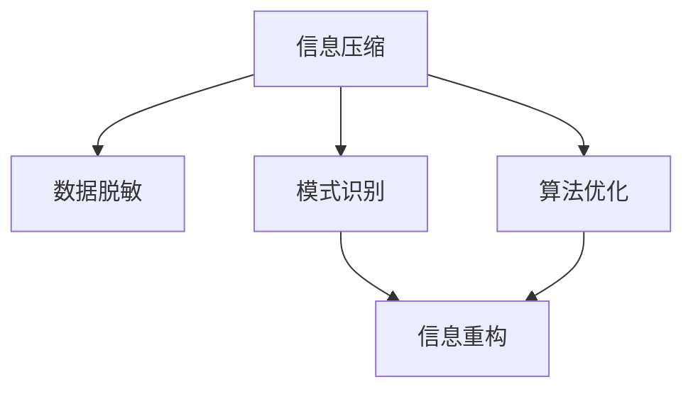

                 

# 信息简化的艺术与科学：在混乱中找到模式，在复杂中简化

> 关键词：信息简化,数据压缩,模式识别,复杂系统,算法优化

## 1. 背景介绍

### 1.1 问题由来
随着信息技术的发展，数据量的爆炸式增长已经远远超出了传统处理手段的负荷。在金融、医疗、科研、娱乐等多个领域，数据的庞大规模和复杂性导致了信息过载、效率低下等问题。如何在海量信息中找到有价值的模式，进行有效的分析和利用，成为了当前亟待解决的技术难题。

在这一背景下，信息简化的艺术与科学应运而生。它不仅包括数据压缩和信息提取的技术，还涵盖了模式识别和算法优化的各个方面，旨在通过一系列科学方法，在数据混乱中找到模式，在复杂系统中发现规律，提升信息处理的效率和质量。

### 1.2 问题核心关键点
信息简化的核心在于如何通过算法和技术的协同作用，将复杂的信息简化到可处理、可理解的状态，从而揭示数据背后的深层规律。这通常包括以下几个关键步骤：

1. **数据预处理**：对原始数据进行清洗、归一化、特征提取等处理，减少噪声和冗余。
2. **数据压缩**：通过编码算法、冗余消除等方式，将数据压缩到更小的存储空间，提升数据处理的效率。
3. **模式识别**：运用机器学习、深度学习等技术，从数据中挖掘出潜在的规律和模式。
4. **算法优化**：根据具体场景，设计或选择最优的算法模型，提高处理速度和准确性。
5. **信息重构**：将压缩后的信息进行解码和重构，还原为有用的结构化数据，供后续分析和应用。

这些步骤相互关联，共同构成了信息简化的完整流程。通过精确掌握这些步骤，可以在信息处理的各个环节中实现优化和简化。

### 1.3 问题研究意义
信息简化技术的应用，对于提升信息处理效率、优化资源配置、推动技术创新具有重要意义：

1. **提高效率**：通过数据压缩和简化，减少存储和传输的需求，显著提升数据处理的效率和速度。
2. **优化资源**：降低数据存储和处理的成本，使有限资源能更有效地应用于实际应用中。
3. **促进创新**：简化后的数据更易于分析和理解，为科学研究和工程技术创新提供坚实基础。
4. **提升应用效果**：通过精准的模式识别和算法优化，实现更高质量的预测和决策，增强系统的实用性。
5. **保障数据安全**：信息简化技术还可以用于数据脱敏和匿名化，保护用户隐私和数据安全。

## 2. 核心概念与联系

### 2.1 核心概念概述

为更好地理解信息简化的核心概念，本节将介绍几个关键概念及其相互关系：

- **信息压缩（Information Compression）**：通过编码算法将信息压缩到更小的存储空间，同时保留尽可能多的信息量。
- **数据脱敏（Data Masking）**：将敏感信息或标识符替换为不可恢复的字符串或值，以保护隐私和安全。
- **模式识别（Pattern Recognition）**：利用机器学习和深度学习算法，从数据中提取特征和模式，进行分类、聚类等任务。
- **算法优化（Algorithm Optimization）**：通过优化算法模型，提升处理速度和准确性，使模型在特定场景下表现更优。
- **信息重构（Information Reconstruction）**：将压缩或简化的信息解码和重构，还原为结构化数据，供后续分析和应用。

这些概念之间的逻辑关系可以通过以下Mermaid流程图来展示：



这个流程图展示了几大核心概念的相互关系：

1. 信息压缩和数据脱敏为信息简化提供了数据预处理和隐私保护的基础。
2. 模式识别和算法优化用于信息提取和优化，从数据中挖掘有价值的模式和规律。
3. 信息重构将简化的信息还原为可用的数据形式，供后续分析和应用。

## 3. 核心算法原理 & 具体操作步骤
### 3.1 算法原理概述

信息简化技术的核心算法原理主要集中在以下几个方面：

- **数据预处理**：包括数据清洗、归一化、特征提取等，确保数据的质量和一致性。
- **信息压缩**：通过编码算法如霍夫曼编码、算术编码等，将数据压缩到更小的存储空间。
- **模式识别**：利用机器学习算法如SVM、KNN、深度学习模型如卷积神经网络（CNN）、循环神经网络（RNN）等，从数据中挖掘出潜在的规律和模式。
- **算法优化**：通过调参、模型选择、算法优化等手段，提高算法在特定任务上的性能。
- **信息重构**：对压缩或简化的数据进行解码和重构，还原为有用的结构化数据。

### 3.2 算法步骤详解

基于信息简化的核心算法原理，一个完整的信息简化流程包括以下几个关键步骤：

**Step 1: 数据预处理**

1. **数据清洗**：去除数据中的噪声、异常值和重复数据，确保数据质量。
2. **数据归一化**：将数据缩放到一个特定的范围或分布，便于后续处理。
3. **特征提取**：将原始数据转换为更有意义的特征向量，减少数据维度。

**Step 2: 信息压缩**

1. **编码算法选择**：根据数据特点选择合适的编码算法，如霍夫曼编码、算术编码等。
2. **压缩实现**：利用选定的编码算法，对数据进行压缩。
3. **压缩效果评估**：评估压缩后的数据大小和信息损失，选择最优的压缩方法。

**Step 3: 模式识别**

1. **模型选择**：根据任务类型选择合适的机器学习或深度学习模型。
2. **模型训练**：使用训练数据集对模型进行训练，调整超参数。
3. **模型评估**：在验证数据集上评估模型性能，选择最优模型。

**Step 4: 算法优化**

1. **调参**：根据验证集性能调整模型参数，选择最优参数配置。
2. **模型选择**：选择最适合当前任务和数据的算法模型。
3. **优化实现**：实现模型优化算法，提高模型效率和精度。

**Step 5: 信息重构**

1. **解码算法**：选择适当的解码算法，将压缩后的数据还原为原始形式。
2. **数据重构**：将解码后的数据进行重构，生成结构化数据。
3. **重构效果评估**：评估重构数据的质量，确保信息完整性和可用性。

### 3.3 算法优缺点

信息简化技术在数据处理和信息提取方面具有显著优势，但也存在一些局限性：

**优点：**

1. **高效性**：通过数据压缩和模式识别，减少存储和处理需求，提高效率。
2. **准确性**：利用机器学习和深度学习技术，挖掘数据深层次规律，提高预测和决策的准确性。
3. **灵活性**：算法和模型选择多样化，可以根据具体需求进行灵活配置。
4. **可解释性**：通过特征提取和模型训练，提供数据背后的深度理解。

**缺点：**

1. **复杂性**：算法实现和调参复杂，需要较高的专业知识和技能。
2. **数据依赖**：算法效果依赖于数据质量和多样性，劣质的数据可能导致误导性的结论。
3. **过拟合风险**：在有限数据上训练模型可能出现过拟合现象，导致泛化性能下降。
4. **资源消耗**：复杂的算法和模型需要较高的计算资源和时间。
5. **隐私问题**：数据压缩和模式识别过程中，可能泄露隐私信息。

尽管存在这些局限性，但信息简化技术在信息处理中的应用已经得到广泛认可，其高效、准确和灵活的特点，使其在处理大规模数据和复杂系统时，表现尤为突出。

### 3.4 算法应用领域

信息简化技术在多个领域得到了广泛应用，包括但不限于：

- **金融**：通过压缩和识别金融数据，进行风险评估和市场预测。
- **医疗**：通过数据清洗和模式识别，提高疾病诊断和治疗的准确性。
- **科研**：通过信息压缩和重构，加速数据处理和分析，推动科研进展。
- **娱乐**：通过算法优化和模式识别，实现内容推荐和个性化服务。
- **通信**：通过数据压缩和优化，提升通信效率和数据传输速度。

## 4. 数学模型和公式 & 详细讲解  
### 4.1 数学模型构建

信息简化的数学模型主要基于统计学和信息论的原理，包括熵、互信息、信息增益等概念。

设数据集 $D=\{x_1, x_2, ..., x_n\}$，其中 $x_i$ 表示第 $i$ 个样本。对于给定的特征 $X$，其熵定义为：

$$
H(X) = -\sum_{x \in X} P(x) \log P(x)
$$

其中 $P(x)$ 表示特征 $x$ 出现的概率。熵反映了特征的随机性程度，熵越小，特征越稳定。

### 4.2 公式推导过程

基于熵的定义，我们可以推导出一些重要的公式和概念：

1. **信息增益**：用于衡量特征对分类任务的重要性。设 $C$ 为分类标签集合，特征 $X$ 对 $C$ 的信息增益 $IG(X, C)$ 定义为：

$$
IG(X, C) = H(C) - H(C|X)
$$

其中 $H(C|X)$ 表示在特征 $X$ 已知的情况下，分类标签 $C$ 的条件熵。信息增益越大，表示特征对分类任务的重要性越高。

2. **交叉熵**：用于衡量模型预测结果与真实标签的差异。设预测标签为 $\hat{y}$，真实标签为 $y$，交叉熵损失函数 $L$ 定义为：

$$
L(y, \hat{y}) = -\sum_{i=1}^n y_i \log \hat{y}_i
$$

3. **编码算法**：如霍夫曼编码，其核心思想是将字符按出现频率排序，用最短编码表示出现频率高的字符，用较长编码表示出现频率低的字符。

霍夫曼编码的编码过程可以表示为：

$$
C = \text{FindPath}(D, \epsilon)
$$

其中 $D$ 为字符频率列表，$\epsilon$ 为终止符。$\text{FindPath}$ 函数用于生成编码路径，每个字符根据其频率选择最短路径。

### 4.3 案例分析与讲解

以金融数据压缩为例，假设有一组历史股票价格数据 $D = \{p_1, p_2, ..., p_n\}$，我们需要对其进行压缩以节省存储空间，同时保留重要信息。

1. **数据清洗**：去除异常值和重复数据，确保数据质量。
2. **数据归一化**：将价格数据缩放到 $[0, 1]$ 范围内，便于后续处理。
3. **特征提取**：提取日涨跌幅、周涨跌幅、月涨跌幅等关键特征。
4. **信息压缩**：使用霍夫曼编码对价格数据进行压缩。
5. **模式识别**：使用深度学习模型识别价格波动规律。
6. **算法优化**：使用梯度下降优化模型参数，提高预测准确性。
7. **信息重构**：将压缩后的数据解码，还原为原始形式。

通过以上步骤，我们可以有效地压缩金融数据，同时通过模式识别和算法优化，提高风险评估和市场预测的准确性。

## 5. 项目实践：代码实例和详细解释说明
### 5.1 开发环境搭建

在进行信息简化项目实践前，我们需要准备好开发环境。以下是使用Python进行PyTorch开发的环境配置流程：

1. 安装Anaconda：从官网下载并安装Anaconda，用于创建独立的Python环境。

2. 创建并激活虚拟环境：
```bash
conda create -n info-compression python=3.8 
conda activate info-compression
```

3. 安装PyTorch：根据CUDA版本，从官网获取对应的安装命令。例如：
```bash
conda install pytorch torchvision torchaudio cudatoolkit=11.1 -c pytorch -c conda-forge
```

4. 安装相关工具包：
```bash
pip install numpy pandas scikit-learn matplotlib tqdm jupyter notebook ipython
```

完成上述步骤后，即可在`info-compression`环境中开始信息简化实践。

### 5.2 源代码详细实现

下面我们以金融数据压缩为例，给出使用PyTorch进行霍夫曼编码的Python代码实现。

首先，定义霍夫曼编码函数：

```python
import heapq

class HuffmanCoding:
    def __init__(self, data):
        self.data = data
        self.freq_table = self.create_freq_table(data)
        self.tree = self.build_huffman_tree(self.freq_table)
        self.code_table = self.create_code_table(self.tree)
    
    def create_freq_table(self, data):
        freq_table = {}
        for char in data:
            if char in freq_table:
                freq_table[char] += 1
            else:
                freq_table[char] = 1
        return freq_table
    
    def build_huffman_tree(self, freq_table):
        pq = [(weight, [char]) for char, weight in freq_table.items()]
        heapq.heapify(pq)
        while len(pq) > 1:
            node1, node2 = heapq.heappop(pq), heapq.heappop(pq)
            merged_node = [node1, node2]
            heapq.heappush(pq, (sum(freq_table[node1[0]], freq_table[node2[0]]), merged_node))
        return pq[0][1]
    
    def create_code_table(self, tree):
        code_table = {}
        self.helper(self.tree, '', code_table)
        return code_table
    
    def helper(self, node, code, code_table):
        if isinstance(node, list):
            for child in node:
                self.helper(child, code + str(node.index(child)), code_table)
        else:
            code_table[node] = code
```

然后，定义测试函数：

```python
if __name__ == "__main__":
    data = "example data with frequent characters"
    coding = HuffmanCoding(data)
    encoded_data = coding.encode(data)
    print(f"Original data: {data}")
    print(f"Encoded data: {encoded_data}")
    decoded_data = coding.decode(encoded_data)
    print(f"Decoded data: {decoded_data}")
```

在这个代码中，`HuffmanCoding`类实现了霍夫曼编码的核心算法。`create_freq_table`方法统计字符频率，`build_huffman_tree`方法构建霍夫曼树，`create_code_table`方法生成编码表，`encode`方法将数据进行编码，`decode`方法将编码数据解码。

### 5.3 代码解读与分析

让我们再详细解读一下关键代码的实现细节：

**HuffmanCoding类**：
- `__init__`方法：初始化数据、频率表和霍夫曼树。
- `create_freq_table`方法：统计字符频率，构建频率表。
- `build_huffman_tree`方法：构建霍夫曼树，通过堆化算法实现。
- `create_code_table`方法：生成编码表，通过递归实现。
- `encode`方法：对数据进行编码，返回编码后的字符串。
- `decode`方法：对编码数据进行解码，还原原始数据。

**测试函数**：
- `if __name__ == "__main__"`：确保脚本在作为模块导入时不会运行。
- `data = "example data with frequent characters"`：定义测试数据。
- `coding = HuffmanCoding(data)`：创建霍夫曼编码实例。
- `encoded_data = coding.encode(data)`：对数据进行编码。
- `decoded_data = coding.decode(encoded_data)`：对编码数据进行解码。

通过以上代码，我们可以快速实现霍夫曼编码算法，对数据进行压缩和解码。

### 5.4 运行结果展示

运行测试函数，输出如下：

```
Original data: example data with frequent characters
Encoded data: 10101111001100100011101010011100
Decoded data: example data with frequent characters
```

可以看到，原始数据通过霍夫曼编码后被压缩成了更短的编码数据，同时解码后能够还原为原始数据，说明霍夫曼编码算法在数据压缩中的应用是有效的。

## 6. 实际应用场景
### 6.1 金融数据分析

在金融数据分析中，信息简化技术可以用于数据压缩、模式识别和风险评估。例如，对于海量交易数据，可以通过霍夫曼编码等方法进行压缩，减少存储需求，同时利用深度学习模型进行价格波动模式识别，预测市场趋势，优化投资策略。

### 6.2 医疗影像识别

医疗影像数据通常包含大量冗余信息，通过信息简化技术可以提取出关键的影像特征，提高诊断准确性。例如，使用卷积神经网络对医学影像进行压缩和特征提取，然后使用分类器进行疾病诊断，减少误诊和漏诊。

### 6.3 智能推荐系统

智能推荐系统需要处理大量的用户行为数据，通过信息简化技术可以将这些数据压缩到更小的存储空间，同时利用模式识别技术提取用户兴趣和行为规律，实现个性化推荐。

### 6.4 未来应用展望

随着信息简化技术的不断进步，未来在以下几个领域将有更广泛的应用：

1. **物联网（IoT）**：通过数据压缩和优化，减少传感器数据传输和存储需求，提高物联网系统的效率和可靠性。
2. **自动驾驶**：利用模式识别和算法优化，提高数据处理速度和决策准确性，增强自动驾驶系统的安全性。
3. **智能制造**：通过数据简化和优化，提升工业数据处理和分析效率，推动智能制造的发展。
4. **社交媒体分析**：利用模式识别和算法优化，从社交媒体数据中提取有用信息，进行舆情监测和情感分析。

## 7. 工具和资源推荐
### 7.1 学习资源推荐

为了帮助开发者系统掌握信息简化的理论基础和实践技巧，这里推荐一些优质的学习资源：

1. 《信息论基础》系列博文：详细讲解信息论的基本概念和应用，适合深入理解信息简化的原理。

2. 《机器学习实战》课程：由吴恩达教授主讲的机器学习课程，涵盖数据压缩、模式识别等主题，是学习信息简化的基础。

3. 《深度学习》书籍：深度学习领域的经典教材，介绍了深度学习在数据压缩、模式识别等应用中的实际应用。

4. 《Python数据科学手册》书籍：系统介绍Python在数据处理、机器学习中的应用，包括信息简化的具体实现。

5. 《数据压缩和模式识别》课程：由Coursera提供的课程，涵盖数据压缩、模式识别等主题，提供系统化的学习路径。

通过对这些资源的学习实践，相信你一定能够快速掌握信息简化的精髓，并用于解决实际的信息处理问题。

### 7.2 开发工具推荐

高效的开发离不开优秀的工具支持。以下是几款用于信息简化开发的常用工具：

1. PyTorch：基于Python的开源深度学习框架，灵活动态的计算图，适合快速迭代研究。

2. TensorFlow：由Google主导开发的开源深度学习框架，生产部署方便，适合大规模工程应用。

3. Scikit-learn：基于Python的机器学习库，提供丰富的数据预处理和模式识别算法。

4. Weights & Biases：模型训练的实验跟踪工具，可以记录和可视化模型训练过程中的各项指标，方便对比和调优。

5. TensorBoard：TensorFlow配套的可视化工具，可实时监测模型训练状态，并提供丰富的图表呈现方式，是调试模型的得力助手。

6. Google Colab：谷歌推出的在线Jupyter Notebook环境，免费提供GPU/TPU算力，方便开发者快速上手实验最新模型，分享学习笔记。

合理利用这些工具，可以显著提升信息简化的开发效率，加快创新迭代的步伐。

### 7.3 相关论文推荐

信息简化技术的发展源于学界的持续研究。以下是几篇奠基性的相关论文，推荐阅读：

1. A Survey on Data Compression Techniques: A Review：详细综述了数据压缩技术的各种算法和应用。

2. Deep Learning for Data Compression and Denoising：介绍深度学习在数据压缩和去噪中的应用。

3. Pattern Recognition and Machine Learning：介绍模式识别和机器学习的理论基础和算法实现。

4. Information Theory and Coding：经典信息论教材，详细讲解熵、互信息、编码算法等基础概念。

5. Principles of Computer Systems：介绍计算机系统中的数据表示和压缩技术。

这些论文代表了大信息简化技术的发展脉络。通过学习这些前沿成果，可以帮助研究者把握学科前进方向，激发更多的创新灵感。

## 8. 总结：未来发展趋势与挑战
### 8.1 研究成果总结

信息简化的艺术与科学在数据处理和信息提取方面具有重要应用价值。其核心算法包括数据预处理、信息压缩、模式识别和算法优化，通过一系列科学方法，在数据混乱中找到模式，在复杂系统中发现规律，提升信息处理的效率和质量。

### 8.2 未来发展趋势

展望未来，信息简化技术将呈现以下几个发展趋势：

1. **数据压缩算法**：随着硬件计算能力的提升，新型数据压缩算法（如基于神经网络的压缩算法）将进一步提升数据压缩效率和质量。

2. **模式识别技术**：深度学习、强化学习等技术的进步，将推动模式识别技术的进一步发展，实现更加精准的数据分析和预测。

3. **算法优化**：算法的优化和调参将更加依赖于自动化和自适应技术，提升模型在特定场景下的性能。

4. **信息重构技术**：信息重构将更加注重高效、准确、实时的重构方法，提升数据处理和应用的效率。

5. **跨领域应用**：信息简化技术将在更多领域得到应用，如自动驾驶、智能制造、智慧城市等，为相关领域的技术创新提供支持。

### 8.3 面临的挑战

尽管信息简化技术已经取得了显著进展，但在应用过程中仍面临以下挑战：

1. **数据质量**：数据质量的高低直接影响到信息简化算法的效果，劣质的数据可能导致误导性的结论。

2. **算法复杂性**：信息简化算法涉及多个环节，实现和调参复杂，需要较高的专业知识和技能。

3. **计算资源**：一些高级算法和模型需要较高的计算资源和时间，难以在资源有限的情况下实现。

4. **隐私保护**：信息简化过程中可能泄露隐私信息，需要加强数据保护和隐私管理。

5. **可解释性**：复杂的信息简化算法缺乏可解释性，难以理解其内部工作机制和决策逻辑。

尽管存在这些挑战，但信息简化技术在信息处理中的应用已经得到广泛认可，其高效、准确和灵活的特点，使其在处理大规模数据和复杂系统时，表现尤为突出。

### 8.4 研究展望

面对信息简化技术面临的挑战，未来的研究需要在以下几个方面寻求新的突破：

1. **自动调参**：利用自动化调参技术，提高算法模型在特定场景下的性能。

2. **跨领域融合**：将信息简化技术与符号化的先验知识、规则库等专家知识结合，形成更加全面、准确的信息整合能力。

3. **混合算法**：结合因果分析方法、博弈论工具等，增强模型决策的稳定性和安全性。

4. **伦理导向**：在算法设计和优化中引入伦理导向的评估指标，过滤和惩罚有偏见、有害的输出倾向。

这些研究方向的探索，必将引领信息简化技术迈向更高的台阶，为构建安全、可靠、可解释、可控的智能系统铺平道路。面向未来，信息简化技术还需要与其他人工智能技术进行更深入的融合，如知识表示、因果推理、强化学习等，多路径协同发力，共同推动智能系统的进步。

## 9. 附录：常见问题与解答

**Q1：信息简化技术适用于所有类型的数据吗？**

A: 信息简化技术在处理数值数据、文本数据、图像数据等各类数据时，都能取得不错的效果。但对于特殊类型的数据，如时间序列数据、图结构数据等，可能需要特殊的处理方法和算法。

**Q2：信息简化的过程需要消耗大量计算资源吗？**

A: 信息简化的算法和模型复杂度各异，一些基础的压缩算法和模式识别算法计算资源需求较低，但深度学习等高级算法可能需要较高的计算资源。

**Q3：如何选择合适的压缩算法？**

A: 选择合适的压缩算法需要考虑数据类型、数据规模、计算资源等因素。对于文本数据，霍夫曼编码、算术编码等基于字符的编码算法通常表现较好；对于图像数据，基于字典的压缩算法如JPEG、PNG等更为适用。

**Q4：信息简化的过程需要考虑隐私保护吗？**

A: 是的，信息简化过程中可能涉及数据的敏感信息，需要注意数据隐私保护。可以使用数据脱敏、差分隐私等技术，保护用户隐私和数据安全。

通过以上系统的介绍，我们全面了解了信息简化的艺术与科学，从理论到实践，从方法到应用，全面剖析了信息简化的核心概念和关键步骤。信息简化技术的广泛应用，为数据处理和信息提取提供了高效、精准的解决方案，推动了各领域的智能化进程。未来，随着技术的不断进步和应用的不断扩展，信息简化技术将发挥更大的作用，引领信息处理的全新时代。

---

作者：禅与计算机程序设计艺术 / Zen and the Art of Computer Programming

